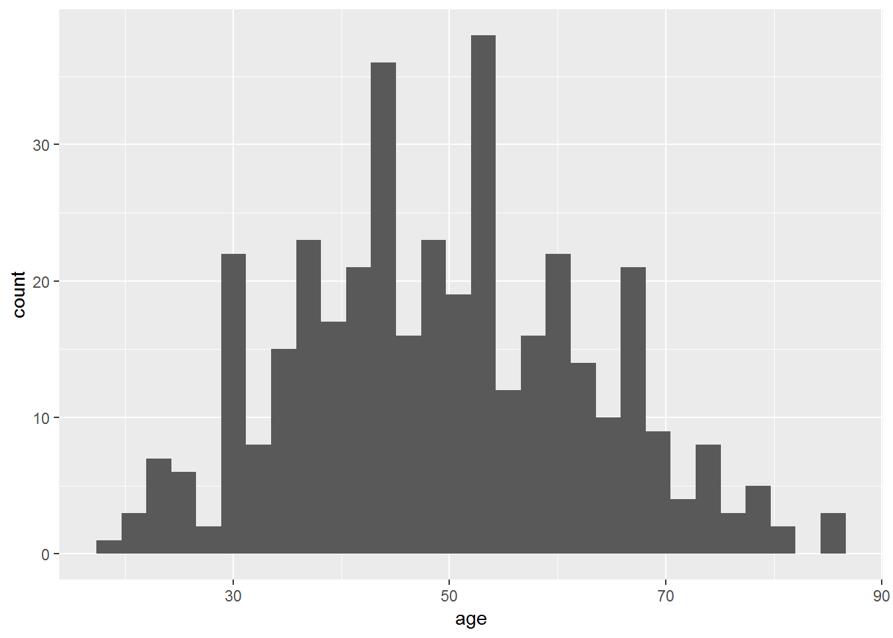
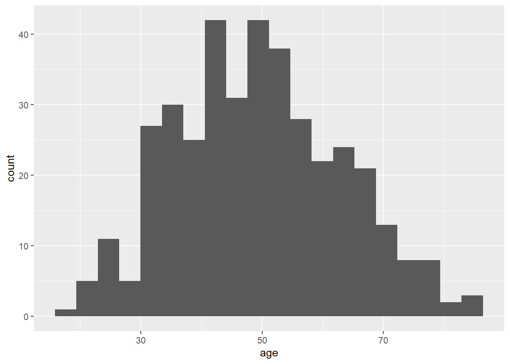
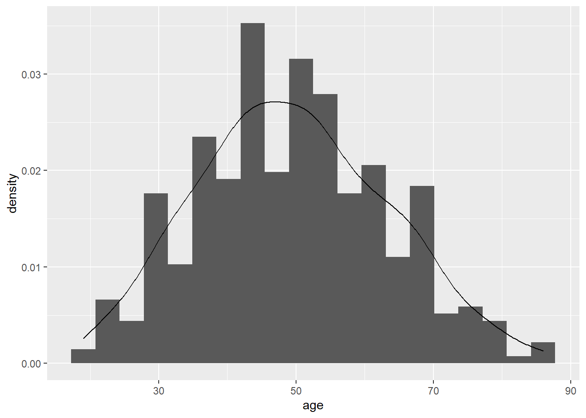

# Week 2

## Setting Up


```r
# Load packages
library(skimr)
library(gt)
library(gtsummary)
library(epiR)
library(broom)
library(pROC)
library(gmodels)
library(survival)
library(here)
library(tidyverse)

# Load data necessary to run Week 2 examples
lesson1a <- readRDS(here::here("Data", "Week 1", "lesson1a.rds"))
```

## R Instructions

### Looking at your data

There are several ways to see the variables in your dataset.

Click on the blue circle with an arrow next to the name of your dataset in the "environment" tab (top right). You will see the number of observations and the number of variables in your dataset next to the name of your dataset.

Underneath, you can see the variable name, the variable type, the values from the first several observations, and variable labels (if they exist). In some datasets, variables are labeled with information on what data is stored in the variable and/or what the variable values mean.

For example, look below at the variable "sex" under "lesson1a". To the right of the variable name, it shows that this is a numeric variable ("num") and displays the first ten values. What we would expect to find in the "sex" variable is self-explanatory, based on the variable name. However, we don't know how to interpret the values. Luckily, this information is included in the variable label on the following line.

Other variables have names that are not self-explanatory, for example, "p1". This variable has a label that indicates that this is "pain at time 1 postop". You will also notice that sometimes there are variables that are not labeled. In this dataset, "age" does not have a label - the variable name is self-explanatory, and by looking at the values we can see that this is age in years.


If you would like to print out this information in the console window, you can also use the `str` function:


```r
str(lesson1a)
```

```
## Classes 'tbl_df', 'tbl' and 'data.frame':	386 obs. of  11 variables:
##  $ id : num  541836 285383 332777 566828 193254 ...
##  $ sex: num  0 1 0 1 1 1 0 0 1 0 ...
##   ..- attr(*, "label")= chr "1 if woman, 0 if man"
##  $ age: num  33 55 52 53 57 31 54 26 52 66 ...
##  $ p1 : num  0 0 0 0 0 0 0 0 0 0 ...
##   ..- attr(*, "label")= chr "pain at time 1 postop"
##  $ p2 : num  0 1 0 0 1 0 1 0 0 1 ...
##   ..- attr(*, "label")= chr "pain at time 2 postop"
##  $ p3 : num  0 1 3 0 2 2 4 1 0 1 ...
##   ..- attr(*, "label")= chr "pain at time 3 postop"
##  $ p4 : num  0 1 3 1 3 2 1 0 0 1 ...
##   ..- attr(*, "label")= chr "pain at time 4 postop"
##  $ t  : num  0 3 6 1 6 4 6 1 0 3 ...
##   ..- attr(*, "label")= chr "total pain score times 1 - 4"
##  $ x  : num  2 2 1 2 2 1 1 1 2 1 ...
##  $ y  : chr  "campus" "campus" "campus" "campus" ...
##  $ z  : num  1 1 NA NA 1 3 1 1 3 1 ...
```

The "environment" tab and the `str` function are useful for getting an overview of the variables available in your dataset, they are not as useful for getting an overview of the data values available.

The commands you might think about using for the datasets sent after lecture 2 are given below. I give examples from lesson1a.rds, the data I sent after lecture 1.

### Summarizing continuous variables

The function `skim` will give summary statistics for specified variables.


```r
# Summary of "age" variable from "lesson1a" dataset
lesson1a %>% skim(age)
```

```
## Skim summary statistics
##  n obs: 386 
##  n variables: 11 
## 
## -- Variable type:numeric ----------------------------------------------------------------
##  variable missing complete   n  mean    sd p0 p25 p50 p75 p100     hist
##       age       0      386 386 49.48 13.75 19  40  49  59   86 ▂▅▇▇▆▅▂▁
```

So you can tell you have data on age for 386 patients ("n" is the number of observations), the mean age was about 49 years, and the standard deviation of the mean was about 13.8.

The numbers below "p0", "p25", "p50", "p75" and "p100" are the centiles. "p0" indicates the minimum value, and "p100" indicates the maximum value, so you can tell that the youngest patient was 19 and the oldest was 86. "p50" is the median (49 years), and the interquartile range is reported under "p25" and "p75" (40, 59).


```r
# Summary of "age" within men and women separately
lesson1a %>%
  group_by(sex) %>%
  skim(age)
```

```
## Skim summary statistics
##  n obs: 386 
##  n variables: 11 
##  group variables: sex 
## 
## -- Variable type:numeric ----------------------------------------------------------------
##  sex variable missing complete   n  mean    sd p0 p25 p50 p75 p100
##    0      age       0      181 181 49.07 13.61 19  40  49  58   82
##    1      age       0      205 205 49.85 13.9  21  40  49  60   86
##      hist
##  ▂▃▇▇▆▅▂▂
##  ▂▆▇▇▆▆▂▁
```

The `group_by` function allows you to group your data and perform analyses separately by group. For example, the above code groups by sex, so the mean, standard deviation and other summary statistics are presented separately among men and among women.

### Centiles

You can get R to give you centiles directly by using the `quantile` function. The option `na.rm = TRUE` tells R to ignore any missing (NA) values when calculating the centiles.


```r
# Get centiles for "age" variable
quantile(lesson1a$age, na.rm = TRUE)
```

```
##   0%  25%  50%  75% 100% 
##   19   40   49   59   86
```

The first row of the results says that you are looking at the 0, 25, 50, 75, and 100 centiles, i.e. the minimum and maximum, and the median and quartiles. The second row gives you the actual values. So you could report this as “Median age was 49 (quartiles 40, 59)."

You aren't restricted to quartiles with the `quantile` function. For example, you can use the code below to give you the 11th, 45th and 78th centile, as well as 91.5 centile, which would be the 915th highest value in a dataset of 1000 observations. 


```r
# Get specific centiles (11th, 45th, 78th, 91.5th) for "age" variable
quantile(lesson1a$age, probs = c(0.11, 0.45, 0.78, 0.915), na.rm = TRUE)
```

```
##   11%   45%   78% 91.5% 
##  32.0  47.0  60.3  69.0
```

### One-way tables

As mentioned in the first lesson, the `tbl_summary` function (from the `gtsummary` package) can be used to create a frequency table, in this case, the number of men and women.


```r
# Get formatted one-way frequency table
tbl_summary(
  lesson1a %>% select(sex), # Specify data to use and variables to include
  type = list("sex" ~ "categorical") # Show all levels of binary variables
)
```

<!--html_preserve--><style>html {
  font-family: -apple-system, BlinkMacSystemFont, 'Segoe UI', Roboto, Oxygen, Ubuntu, Cantarell, 'Helvetica Neue', 'Fira Sans', 'Droid Sans', Arial, sans-serif;
}

#iwrgxmosvm .gt_table {
  display: table;
  border-collapse: collapse;
  margin-left: auto;
  margin-right: auto;
  color: #000000;
  font-size: 16px;
  background-color: #FFFFFF;
  /* table.background.color */
  width: auto;
  /* table.width */
  border-top-style: solid;
  /* table.border.top.style */
  border-top-width: 2px;
  /* table.border.top.width */
  border-top-color: #A8A8A8;
  /* table.border.top.color */
  border-bottom-style: solid;
  /* table.border.bottom.style */
  border-bottom-width: 2px;
  /* table.border.bottom.width */
  border-bottom-color: #A8A8A8;
  /* table.border.bottom.color */
}

#iwrgxmosvm .gt_heading {
  background-color: #FFFFFF;
  /* heading.background.color */
  border-bottom-color: #FFFFFF;
}

#iwrgxmosvm .gt_title {
  color: #000000;
  font-size: 125%;
  /* heading.title.font.size */
  padding-top: 4px;
  /* heading.top.padding */
  padding-bottom: 4px;
  border-bottom-color: #FFFFFF;
  border-bottom-width: 0;
}

#iwrgxmosvm .gt_subtitle {
  color: #000000;
  font-size: 85%;
  /* heading.subtitle.font.size */
  padding-top: 2px;
  padding-bottom: 2px;
  /* heading.bottom.padding */
  border-top-color: #FFFFFF;
  border-top-width: 0;
}

#iwrgxmosvm .gt_bottom_border {
  border-bottom-style: solid;
  /* heading.border.bottom.style */
  border-bottom-width: 2px;
  /* heading.border.bottom.width */
  border-bottom-color: #A8A8A8;
  /* heading.border.bottom.color */
}

#iwrgxmosvm .gt_column_spanner {
  border-bottom-style: solid;
  border-bottom-width: 2px;
  border-bottom-color: #A8A8A8;
  padding-top: 4px;
  padding-bottom: 4px;
}

#iwrgxmosvm .gt_col_heading {
  color: #000000;
  background-color: #FFFFFF;
  /* column_labels.background.color */
  font-size: 16px;
  /* column_labels.font.size */
  font-weight: initial;
  /* column_labels.font.weight */
  vertical-align: middle;
  padding: 10px;
  margin: 10px;
  overflow-x: hidden;
}

#iwrgxmosvm .gt_columns_top_border {
  border-top-style: solid;
  border-top-width: 2px;
  border-top-color: #A8A8A8;
}

#iwrgxmosvm .gt_columns_bottom_border {
  border-bottom-style: solid;
  border-bottom-width: 2px;
  border-bottom-color: #A8A8A8;
}

#iwrgxmosvm .gt_sep_right {
  border-right: 5px solid #FFFFFF;
}

#iwrgxmosvm .gt_group_heading {
  padding: 8px;
  color: #000000;
  background-color: #FFFFFF;
  /* row_group.background.color */
  font-size: 16px;
  /* row_group.font.size */
  font-weight: initial;
  /* row_group.font.weight */
  border-top-style: solid;
  /* row_group.border.top.style */
  border-top-width: 2px;
  /* row_group.border.top.width */
  border-top-color: #A8A8A8;
  /* row_group.border.top.color */
  border-bottom-style: solid;
  /* row_group.border.bottom.style */
  border-bottom-width: 2px;
  /* row_group.border.bottom.width */
  border-bottom-color: #A8A8A8;
  /* row_group.border.bottom.color */
  vertical-align: middle;
}

#iwrgxmosvm .gt_empty_group_heading {
  padding: 0.5px;
  color: #000000;
  background-color: #FFFFFF;
  /* row_group.background.color */
  font-size: 16px;
  /* row_group.font.size */
  font-weight: initial;
  /* row_group.font.weight */
  border-top-style: solid;
  /* row_group.border.top.style */
  border-top-width: 2px;
  /* row_group.border.top.width */
  border-top-color: #A8A8A8;
  /* row_group.border.top.color */
  border-bottom-style: solid;
  /* row_group.border.bottom.style */
  border-bottom-width: 2px;
  /* row_group.border.bottom.width */
  border-bottom-color: #A8A8A8;
  /* row_group.border.bottom.color */
  vertical-align: middle;
}

#iwrgxmosvm .gt_striped {
  background-color: #f2f2f2;
}

#iwrgxmosvm .gt_from_md > :first-child {
  margin-top: 0;
}

#iwrgxmosvm .gt_from_md > :last-child {
  margin-bottom: 0;
}

#iwrgxmosvm .gt_row {
  padding: 8px;
  /* row.padding */
  margin: 10px;
  vertical-align: middle;
  overflow-x: hidden;
}

#iwrgxmosvm .gt_stub {
  border-right-style: solid;
  border-right-width: 2px;
  border-right-color: #A8A8A8;
  padding-left: 12px;
}

#iwrgxmosvm .gt_summary_row {
  color: #000000;
  background-color: #FFFFFF;
  /* summary_row.background.color */
  padding: 8px;
  /* summary_row.padding */
  text-transform: inherit;
  /* summary_row.text_transform */
}

#iwrgxmosvm .gt_grand_summary_row {
  color: #000000;
  background-color: #FFFFFF;
  /* grand_summary_row.background.color */
  padding: 8px;
  /* grand_summary_row.padding */
  text-transform: inherit;
  /* grand_summary_row.text_transform */
}

#iwrgxmosvm .gt_first_summary_row {
  border-top-style: solid;
  border-top-width: 2px;
  border-top-color: #A8A8A8;
}

#iwrgxmosvm .gt_first_grand_summary_row {
  border-top-style: double;
  border-top-width: 6px;
  border-top-color: #A8A8A8;
}

#iwrgxmosvm .gt_table_body {
  border-top-style: solid;
  /* table_body.border.top.style */
  border-top-width: 2px;
  /* table_body.border.top.width */
  border-top-color: #A8A8A8;
  /* table_body.border.top.color */
  border-bottom-style: solid;
  /* table_body.border.bottom.style */
  border-bottom-width: 2px;
  /* table_body.border.bottom.width */
  border-bottom-color: #A8A8A8;
  /* table_body.border.bottom.color */
}

#iwrgxmosvm .gt_footnotes {
  border-top-style: solid;
  /* footnotes.border.top.style */
  border-top-width: 2px;
  /* footnotes.border.top.width */
  border-top-color: #A8A8A8;
  /* footnotes.border.top.color */
}

#iwrgxmosvm .gt_footnote {
  font-size: 90%;
  /* footnote.font.size */
  margin: 0px;
  padding: 4px;
  /* footnote.padding */
}

#iwrgxmosvm .gt_sourcenotes {
  border-top-style: solid;
  /* sourcenotes.border.top.style */
  border-top-width: 2px;
  /* sourcenotes.border.top.width */
  border-top-color: #A8A8A8;
  /* sourcenotes.border.top.color */
}

#iwrgxmosvm .gt_sourcenote {
  font-size: 90%;
  /* sourcenote.font.size */
  padding: 4px;
  /* sourcenote.padding */
}

#iwrgxmosvm .gt_center {
  text-align: center;
}

#iwrgxmosvm .gt_left {
  text-align: left;
}

#iwrgxmosvm .gt_right {
  text-align: right;
  font-variant-numeric: tabular-nums;
}

#iwrgxmosvm .gt_font_normal {
  font-weight: normal;
}

#iwrgxmosvm .gt_font_bold {
  font-weight: bold;
}

#iwrgxmosvm .gt_font_italic {
  font-style: italic;
}

#iwrgxmosvm .gt_super {
  font-size: 65%;
}

#iwrgxmosvm .gt_footnote_marks {
  font-style: italic;
  font-size: 65%;
}
</style>
<div id="iwrgxmosvm" style="overflow-x:auto;overflow-y:auto;width:auto;height:auto;"><table class="gt_table">
  
  <tr>
    <th class="gt_col_heading gt_columns_bottom_border gt_columns_top_border gt_left" rowspan="1" colspan="1"><strong>Characteristic</strong><sup class="gt_footnote_marks">1</sup></th>
    <th class="gt_col_heading gt_columns_bottom_border gt_columns_top_border gt_center" rowspan="1" colspan="1"><strong>N = 386</strong></th>
  </tr>
  <body class="gt_table_body">
    <tr>
      <td class="gt_row gt_left">1 if woman, 0 if man</td>
      <td class="gt_row gt_center"></td>
    </tr>
    <tr>
      <td class="gt_row gt_left gt_striped" style="text-align: left; text-indent: 10px;">0</td>
      <td class="gt_row gt_center gt_striped">181 (47%)</td>
    </tr>
    <tr>
      <td class="gt_row gt_left" style="text-align: left; text-indent: 10px;">1</td>
      <td class="gt_row gt_center">205 (53%)</td>
    </tr>
  </body>
  
  <tfoot>
    <tr class="gt_footnotes">
      <td colspan="2">
        <p class="gt_footnote">
          <sup class="gt_footnote_marks">
            <em>1</em>
          </sup>
           
          Statistics presented: n (%)
          <br />
        </p>
      </td>
    </tr>
  </tfoot>
</table></div><!--/html_preserve-->


<br>

So there are 205 (53%) women and 181 (47%) men.

### Two-way tables

The `tbl_summary` function can also give a two-way table, for example, a table that shows where operations were done (remember that the variable "y" gives the part of the hospital) in men and women separately. In the last lesson, a 2-by-2 table was created, but `tbl_summary` can also create a two-way table with more than 2 rows or more than 2 columns.


```r
# Create a formatted two-way summary table
tbl_summary(
  lesson1a %>% select(sex, y), # Select both variables
  by = y, # The "by" option specifies which will be the column variable
  type = list("sex" ~ "categorical")
)
```

<!--html_preserve--><style>html {
  font-family: -apple-system, BlinkMacSystemFont, 'Segoe UI', Roboto, Oxygen, Ubuntu, Cantarell, 'Helvetica Neue', 'Fira Sans', 'Droid Sans', Arial, sans-serif;
}

#hlleqxdave .gt_table {
  display: table;
  border-collapse: collapse;
  margin-left: auto;
  margin-right: auto;
  color: #000000;
  font-size: 16px;
  background-color: #FFFFFF;
  /* table.background.color */
  width: auto;
  /* table.width */
  border-top-style: solid;
  /* table.border.top.style */
  border-top-width: 2px;
  /* table.border.top.width */
  border-top-color: #A8A8A8;
  /* table.border.top.color */
  border-bottom-style: solid;
  /* table.border.bottom.style */
  border-bottom-width: 2px;
  /* table.border.bottom.width */
  border-bottom-color: #A8A8A8;
  /* table.border.bottom.color */
}

#hlleqxdave .gt_heading {
  background-color: #FFFFFF;
  /* heading.background.color */
  border-bottom-color: #FFFFFF;
}

#hlleqxdave .gt_title {
  color: #000000;
  font-size: 125%;
  /* heading.title.font.size */
  padding-top: 4px;
  /* heading.top.padding */
  padding-bottom: 4px;
  border-bottom-color: #FFFFFF;
  border-bottom-width: 0;
}

#hlleqxdave .gt_subtitle {
  color: #000000;
  font-size: 85%;
  /* heading.subtitle.font.size */
  padding-top: 2px;
  padding-bottom: 2px;
  /* heading.bottom.padding */
  border-top-color: #FFFFFF;
  border-top-width: 0;
}

#hlleqxdave .gt_bottom_border {
  border-bottom-style: solid;
  /* heading.border.bottom.style */
  border-bottom-width: 2px;
  /* heading.border.bottom.width */
  border-bottom-color: #A8A8A8;
  /* heading.border.bottom.color */
}

#hlleqxdave .gt_column_spanner {
  border-bottom-style: solid;
  border-bottom-width: 2px;
  border-bottom-color: #A8A8A8;
  padding-top: 4px;
  padding-bottom: 4px;
}

#hlleqxdave .gt_col_heading {
  color: #000000;
  background-color: #FFFFFF;
  /* column_labels.background.color */
  font-size: 16px;
  /* column_labels.font.size */
  font-weight: initial;
  /* column_labels.font.weight */
  vertical-align: middle;
  padding: 10px;
  margin: 10px;
  overflow-x: hidden;
}

#hlleqxdave .gt_columns_top_border {
  border-top-style: solid;
  border-top-width: 2px;
  border-top-color: #A8A8A8;
}

#hlleqxdave .gt_columns_bottom_border {
  border-bottom-style: solid;
  border-bottom-width: 2px;
  border-bottom-color: #A8A8A8;
}

#hlleqxdave .gt_sep_right {
  border-right: 5px solid #FFFFFF;
}

#hlleqxdave .gt_group_heading {
  padding: 8px;
  color: #000000;
  background-color: #FFFFFF;
  /* row_group.background.color */
  font-size: 16px;
  /* row_group.font.size */
  font-weight: initial;
  /* row_group.font.weight */
  border-top-style: solid;
  /* row_group.border.top.style */
  border-top-width: 2px;
  /* row_group.border.top.width */
  border-top-color: #A8A8A8;
  /* row_group.border.top.color */
  border-bottom-style: solid;
  /* row_group.border.bottom.style */
  border-bottom-width: 2px;
  /* row_group.border.bottom.width */
  border-bottom-color: #A8A8A8;
  /* row_group.border.bottom.color */
  vertical-align: middle;
}

#hlleqxdave .gt_empty_group_heading {
  padding: 0.5px;
  color: #000000;
  background-color: #FFFFFF;
  /* row_group.background.color */
  font-size: 16px;
  /* row_group.font.size */
  font-weight: initial;
  /* row_group.font.weight */
  border-top-style: solid;
  /* row_group.border.top.style */
  border-top-width: 2px;
  /* row_group.border.top.width */
  border-top-color: #A8A8A8;
  /* row_group.border.top.color */
  border-bottom-style: solid;
  /* row_group.border.bottom.style */
  border-bottom-width: 2px;
  /* row_group.border.bottom.width */
  border-bottom-color: #A8A8A8;
  /* row_group.border.bottom.color */
  vertical-align: middle;
}

#hlleqxdave .gt_striped {
  background-color: #f2f2f2;
}

#hlleqxdave .gt_from_md > :first-child {
  margin-top: 0;
}

#hlleqxdave .gt_from_md > :last-child {
  margin-bottom: 0;
}

#hlleqxdave .gt_row {
  padding: 8px;
  /* row.padding */
  margin: 10px;
  vertical-align: middle;
  overflow-x: hidden;
}

#hlleqxdave .gt_stub {
  border-right-style: solid;
  border-right-width: 2px;
  border-right-color: #A8A8A8;
  padding-left: 12px;
}

#hlleqxdave .gt_summary_row {
  color: #000000;
  background-color: #FFFFFF;
  /* summary_row.background.color */
  padding: 8px;
  /* summary_row.padding */
  text-transform: inherit;
  /* summary_row.text_transform */
}

#hlleqxdave .gt_grand_summary_row {
  color: #000000;
  background-color: #FFFFFF;
  /* grand_summary_row.background.color */
  padding: 8px;
  /* grand_summary_row.padding */
  text-transform: inherit;
  /* grand_summary_row.text_transform */
}

#hlleqxdave .gt_first_summary_row {
  border-top-style: solid;
  border-top-width: 2px;
  border-top-color: #A8A8A8;
}

#hlleqxdave .gt_first_grand_summary_row {
  border-top-style: double;
  border-top-width: 6px;
  border-top-color: #A8A8A8;
}

#hlleqxdave .gt_table_body {
  border-top-style: solid;
  /* table_body.border.top.style */
  border-top-width: 2px;
  /* table_body.border.top.width */
  border-top-color: #A8A8A8;
  /* table_body.border.top.color */
  border-bottom-style: solid;
  /* table_body.border.bottom.style */
  border-bottom-width: 2px;
  /* table_body.border.bottom.width */
  border-bottom-color: #A8A8A8;
  /* table_body.border.bottom.color */
}

#hlleqxdave .gt_footnotes {
  border-top-style: solid;
  /* footnotes.border.top.style */
  border-top-width: 2px;
  /* footnotes.border.top.width */
  border-top-color: #A8A8A8;
  /* footnotes.border.top.color */
}

#hlleqxdave .gt_footnote {
  font-size: 90%;
  /* footnote.font.size */
  margin: 0px;
  padding: 4px;
  /* footnote.padding */
}

#hlleqxdave .gt_sourcenotes {
  border-top-style: solid;
  /* sourcenotes.border.top.style */
  border-top-width: 2px;
  /* sourcenotes.border.top.width */
  border-top-color: #A8A8A8;
  /* sourcenotes.border.top.color */
}

#hlleqxdave .gt_sourcenote {
  font-size: 90%;
  /* sourcenote.font.size */
  padding: 4px;
  /* sourcenote.padding */
}

#hlleqxdave .gt_center {
  text-align: center;
}

#hlleqxdave .gt_left {
  text-align: left;
}

#hlleqxdave .gt_right {
  text-align: right;
  font-variant-numeric: tabular-nums;
}

#hlleqxdave .gt_font_normal {
  font-weight: normal;
}

#hlleqxdave .gt_font_bold {
  font-weight: bold;
}

#hlleqxdave .gt_font_italic {
  font-style: italic;
}

#hlleqxdave .gt_super {
  font-size: 65%;
}

#hlleqxdave .gt_footnote_marks {
  font-style: italic;
  font-size: 65%;
}
</style>
<div id="hlleqxdave" style="overflow-x:auto;overflow-y:auto;width:auto;height:auto;"><table class="gt_table">
  
  <tr>
    <th class="gt_col_heading gt_columns_bottom_border gt_columns_top_border gt_left" rowspan="1" colspan="1"><strong>Characteristic</strong><sup class="gt_footnote_marks">1</sup></th>
    <th class="gt_col_heading gt_columns_bottom_border gt_columns_top_border gt_center" rowspan="1" colspan="1"><strong>campus</strong>, N = 240</th>
    <th class="gt_col_heading gt_columns_bottom_border gt_columns_top_border gt_center" rowspan="1" colspan="1"><strong>harding</strong>, N = 39</th>
    <th class="gt_col_heading gt_columns_bottom_border gt_columns_top_border gt_center" rowspan="1" colspan="1"><strong>peds</strong>, N = 40</th>
    <th class="gt_col_heading gt_columns_bottom_border gt_columns_top_border gt_center" rowspan="1" colspan="1"><strong>satellite</strong>, N = 67</th>
  </tr>
  <body class="gt_table_body">
    <tr>
      <td class="gt_row gt_left">1 if woman, 0 if man</td>
      <td class="gt_row gt_center"></td>
      <td class="gt_row gt_center"></td>
      <td class="gt_row gt_center"></td>
      <td class="gt_row gt_center"></td>
    </tr>
    <tr>
      <td class="gt_row gt_left gt_striped" style="text-align: left; text-indent: 10px;">0</td>
      <td class="gt_row gt_center gt_striped">115 (48%)</td>
      <td class="gt_row gt_center gt_striped">15 (38%)</td>
      <td class="gt_row gt_center gt_striped">19 (48%)</td>
      <td class="gt_row gt_center gt_striped">32 (48%)</td>
    </tr>
    <tr>
      <td class="gt_row gt_left" style="text-align: left; text-indent: 10px;">1</td>
      <td class="gt_row gt_center">125 (52%)</td>
      <td class="gt_row gt_center">24 (62%)</td>
      <td class="gt_row gt_center">21 (52%)</td>
      <td class="gt_row gt_center">35 (52%)</td>
    </tr>
  </body>
  
  <tfoot>
    <tr class="gt_footnotes">
      <td colspan="5">
        <p class="gt_footnote">
          <sup class="gt_footnote_marks">
            <em>1</em>
          </sup>
           
          Statistics presented: n (%)
          <br />
        </p>
      </td>
    </tr>
  </tfoot>
</table></div><!--/html_preserve-->

<br>

This shows that, for example, there were 240 operations done at the main campus, 115 of these were done on men and 125 on women. This shows that 48% of the operations at the satellite were on men and 52% on women.

You can use the `add_overall` function to add a column which shows the total across all sites. This is not generally advised - for instance, if the median age in the drug group is 65 and in the placebo group is 67, you don't need to be told that the median age in the cohort is somewhere near 66 - but there are sometimes reasons to report on the whole cohort as well.


```r
# Create a formatted two-way summary table and add column for all patients
tbl_summary(
  lesson1a %>% select(sex, y),
  by = y,
  type = list("sex" ~ "categorical")
) %>%
  # Add a column with totals across all locations
  # "last = TRUE" puts the column on the right side of the table
  add_overall(last = TRUE)
```

<!--html_preserve--><style>html {
  font-family: -apple-system, BlinkMacSystemFont, 'Segoe UI', Roboto, Oxygen, Ubuntu, Cantarell, 'Helvetica Neue', 'Fira Sans', 'Droid Sans', Arial, sans-serif;
}

#kqtxbhydst .gt_table {
  display: table;
  border-collapse: collapse;
  margin-left: auto;
  margin-right: auto;
  color: #000000;
  font-size: 16px;
  background-color: #FFFFFF;
  /* table.background.color */
  width: auto;
  /* table.width */
  border-top-style: solid;
  /* table.border.top.style */
  border-top-width: 2px;
  /* table.border.top.width */
  border-top-color: #A8A8A8;
  /* table.border.top.color */
  border-bottom-style: solid;
  /* table.border.bottom.style */
  border-bottom-width: 2px;
  /* table.border.bottom.width */
  border-bottom-color: #A8A8A8;
  /* table.border.bottom.color */
}

#kqtxbhydst .gt_heading {
  background-color: #FFFFFF;
  /* heading.background.color */
  border-bottom-color: #FFFFFF;
}

#kqtxbhydst .gt_title {
  color: #000000;
  font-size: 125%;
  /* heading.title.font.size */
  padding-top: 4px;
  /* heading.top.padding */
  padding-bottom: 4px;
  border-bottom-color: #FFFFFF;
  border-bottom-width: 0;
}

#kqtxbhydst .gt_subtitle {
  color: #000000;
  font-size: 85%;
  /* heading.subtitle.font.size */
  padding-top: 2px;
  padding-bottom: 2px;
  /* heading.bottom.padding */
  border-top-color: #FFFFFF;
  border-top-width: 0;
}

#kqtxbhydst .gt_bottom_border {
  border-bottom-style: solid;
  /* heading.border.bottom.style */
  border-bottom-width: 2px;
  /* heading.border.bottom.width */
  border-bottom-color: #A8A8A8;
  /* heading.border.bottom.color */
}

#kqtxbhydst .gt_column_spanner {
  border-bottom-style: solid;
  border-bottom-width: 2px;
  border-bottom-color: #A8A8A8;
  padding-top: 4px;
  padding-bottom: 4px;
}

#kqtxbhydst .gt_col_heading {
  color: #000000;
  background-color: #FFFFFF;
  /* column_labels.background.color */
  font-size: 16px;
  /* column_labels.font.size */
  font-weight: initial;
  /* column_labels.font.weight */
  vertical-align: middle;
  padding: 10px;
  margin: 10px;
  overflow-x: hidden;
}

#kqtxbhydst .gt_columns_top_border {
  border-top-style: solid;
  border-top-width: 2px;
  border-top-color: #A8A8A8;
}

#kqtxbhydst .gt_columns_bottom_border {
  border-bottom-style: solid;
  border-bottom-width: 2px;
  border-bottom-color: #A8A8A8;
}

#kqtxbhydst .gt_sep_right {
  border-right: 5px solid #FFFFFF;
}

#kqtxbhydst .gt_group_heading {
  padding: 8px;
  color: #000000;
  background-color: #FFFFFF;
  /* row_group.background.color */
  font-size: 16px;
  /* row_group.font.size */
  font-weight: initial;
  /* row_group.font.weight */
  border-top-style: solid;
  /* row_group.border.top.style */
  border-top-width: 2px;
  /* row_group.border.top.width */
  border-top-color: #A8A8A8;
  /* row_group.border.top.color */
  border-bottom-style: solid;
  /* row_group.border.bottom.style */
  border-bottom-width: 2px;
  /* row_group.border.bottom.width */
  border-bottom-color: #A8A8A8;
  /* row_group.border.bottom.color */
  vertical-align: middle;
}

#kqtxbhydst .gt_empty_group_heading {
  padding: 0.5px;
  color: #000000;
  background-color: #FFFFFF;
  /* row_group.background.color */
  font-size: 16px;
  /* row_group.font.size */
  font-weight: initial;
  /* row_group.font.weight */
  border-top-style: solid;
  /* row_group.border.top.style */
  border-top-width: 2px;
  /* row_group.border.top.width */
  border-top-color: #A8A8A8;
  /* row_group.border.top.color */
  border-bottom-style: solid;
  /* row_group.border.bottom.style */
  border-bottom-width: 2px;
  /* row_group.border.bottom.width */
  border-bottom-color: #A8A8A8;
  /* row_group.border.bottom.color */
  vertical-align: middle;
}

#kqtxbhydst .gt_striped {
  background-color: #f2f2f2;
}

#kqtxbhydst .gt_from_md > :first-child {
  margin-top: 0;
}

#kqtxbhydst .gt_from_md > :last-child {
  margin-bottom: 0;
}

#kqtxbhydst .gt_row {
  padding: 8px;
  /* row.padding */
  margin: 10px;
  vertical-align: middle;
  overflow-x: hidden;
}

#kqtxbhydst .gt_stub {
  border-right-style: solid;
  border-right-width: 2px;
  border-right-color: #A8A8A8;
  padding-left: 12px;
}

#kqtxbhydst .gt_summary_row {
  color: #000000;
  background-color: #FFFFFF;
  /* summary_row.background.color */
  padding: 8px;
  /* summary_row.padding */
  text-transform: inherit;
  /* summary_row.text_transform */
}

#kqtxbhydst .gt_grand_summary_row {
  color: #000000;
  background-color: #FFFFFF;
  /* grand_summary_row.background.color */
  padding: 8px;
  /* grand_summary_row.padding */
  text-transform: inherit;
  /* grand_summary_row.text_transform */
}

#kqtxbhydst .gt_first_summary_row {
  border-top-style: solid;
  border-top-width: 2px;
  border-top-color: #A8A8A8;
}

#kqtxbhydst .gt_first_grand_summary_row {
  border-top-style: double;
  border-top-width: 6px;
  border-top-color: #A8A8A8;
}

#kqtxbhydst .gt_table_body {
  border-top-style: solid;
  /* table_body.border.top.style */
  border-top-width: 2px;
  /* table_body.border.top.width */
  border-top-color: #A8A8A8;
  /* table_body.border.top.color */
  border-bottom-style: solid;
  /* table_body.border.bottom.style */
  border-bottom-width: 2px;
  /* table_body.border.bottom.width */
  border-bottom-color: #A8A8A8;
  /* table_body.border.bottom.color */
}

#kqtxbhydst .gt_footnotes {
  border-top-style: solid;
  /* footnotes.border.top.style */
  border-top-width: 2px;
  /* footnotes.border.top.width */
  border-top-color: #A8A8A8;
  /* footnotes.border.top.color */
}

#kqtxbhydst .gt_footnote {
  font-size: 90%;
  /* footnote.font.size */
  margin: 0px;
  padding: 4px;
  /* footnote.padding */
}

#kqtxbhydst .gt_sourcenotes {
  border-top-style: solid;
  /* sourcenotes.border.top.style */
  border-top-width: 2px;
  /* sourcenotes.border.top.width */
  border-top-color: #A8A8A8;
  /* sourcenotes.border.top.color */
}

#kqtxbhydst .gt_sourcenote {
  font-size: 90%;
  /* sourcenote.font.size */
  padding: 4px;
  /* sourcenote.padding */
}

#kqtxbhydst .gt_center {
  text-align: center;
}

#kqtxbhydst .gt_left {
  text-align: left;
}

#kqtxbhydst .gt_right {
  text-align: right;
  font-variant-numeric: tabular-nums;
}

#kqtxbhydst .gt_font_normal {
  font-weight: normal;
}

#kqtxbhydst .gt_font_bold {
  font-weight: bold;
}

#kqtxbhydst .gt_font_italic {
  font-style: italic;
}

#kqtxbhydst .gt_super {
  font-size: 65%;
}

#kqtxbhydst .gt_footnote_marks {
  font-style: italic;
  font-size: 65%;
}
</style>
<div id="kqtxbhydst" style="overflow-x:auto;overflow-y:auto;width:auto;height:auto;"><table class="gt_table">
  
  <tr>
    <th class="gt_col_heading gt_columns_bottom_border gt_columns_top_border gt_left" rowspan="1" colspan="1"><strong>Characteristic</strong><sup class="gt_footnote_marks">1</sup></th>
    <th class="gt_col_heading gt_columns_bottom_border gt_columns_top_border gt_center" rowspan="1" colspan="1"><strong>campus</strong>, N = 240</th>
    <th class="gt_col_heading gt_columns_bottom_border gt_columns_top_border gt_center" rowspan="1" colspan="1"><strong>harding</strong>, N = 39</th>
    <th class="gt_col_heading gt_columns_bottom_border gt_columns_top_border gt_center" rowspan="1" colspan="1"><strong>peds</strong>, N = 40</th>
    <th class="gt_col_heading gt_columns_bottom_border gt_columns_top_border gt_center" rowspan="1" colspan="1"><strong>satellite</strong>, N = 67</th>
    <th class="gt_col_heading gt_columns_bottom_border gt_columns_top_border gt_center" rowspan="1" colspan="1"><strong>Overall</strong>, N = 386</th>
  </tr>
  <body class="gt_table_body">
    <tr>
      <td class="gt_row gt_left">1 if woman, 0 if man</td>
      <td class="gt_row gt_center"></td>
      <td class="gt_row gt_center"></td>
      <td class="gt_row gt_center"></td>
      <td class="gt_row gt_center"></td>
      <td class="gt_row gt_center"></td>
    </tr>
    <tr>
      <td class="gt_row gt_left gt_striped" style="text-align: left; text-indent: 10px;">0</td>
      <td class="gt_row gt_center gt_striped">115 (48%)</td>
      <td class="gt_row gt_center gt_striped">15 (38%)</td>
      <td class="gt_row gt_center gt_striped">19 (48%)</td>
      <td class="gt_row gt_center gt_striped">32 (48%)</td>
      <td class="gt_row gt_center gt_striped">181 (47%)</td>
    </tr>
    <tr>
      <td class="gt_row gt_left" style="text-align: left; text-indent: 10px;">1</td>
      <td class="gt_row gt_center">125 (52%)</td>
      <td class="gt_row gt_center">24 (62%)</td>
      <td class="gt_row gt_center">21 (52%)</td>
      <td class="gt_row gt_center">35 (52%)</td>
      <td class="gt_row gt_center">205 (53%)</td>
    </tr>
  </body>
  
  <tfoot>
    <tr class="gt_footnotes">
      <td colspan="6">
        <p class="gt_footnote">
          <sup class="gt_footnote_marks">
            <em>1</em>
          </sup>
           
          Statistics presented: n (%)
          <br />
        </p>
      </td>
    </tr>
  </tfoot>
</table></div><!--/html_preserve-->

<br>

Overall, 47% of the patients treated in the hospital were men and 53% were women.

By default `tbl_summary` gives column percents (here, the percentage of patients who are men and women at each site). You can also get the row percents (for example, the percentage of women treated at each site) using the `percent` option and specifying "row".


```r
# The two-way summary table can give you row percent instead of column percent
tbl_summary(
  lesson1a %>% select(sex, y),
  by = y,
  type = list("sex" ~ "categorical"),
  percent = "row" # get the row percent instead of column percent
)
```

<!--html_preserve--><style>html {
  font-family: -apple-system, BlinkMacSystemFont, 'Segoe UI', Roboto, Oxygen, Ubuntu, Cantarell, 'Helvetica Neue', 'Fira Sans', 'Droid Sans', Arial, sans-serif;
}

#qzjvxzfwte .gt_table {
  display: table;
  border-collapse: collapse;
  margin-left: auto;
  margin-right: auto;
  color: #000000;
  font-size: 16px;
  background-color: #FFFFFF;
  /* table.background.color */
  width: auto;
  /* table.width */
  border-top-style: solid;
  /* table.border.top.style */
  border-top-width: 2px;
  /* table.border.top.width */
  border-top-color: #A8A8A8;
  /* table.border.top.color */
  border-bottom-style: solid;
  /* table.border.bottom.style */
  border-bottom-width: 2px;
  /* table.border.bottom.width */
  border-bottom-color: #A8A8A8;
  /* table.border.bottom.color */
}

#qzjvxzfwte .gt_heading {
  background-color: #FFFFFF;
  /* heading.background.color */
  border-bottom-color: #FFFFFF;
}

#qzjvxzfwte .gt_title {
  color: #000000;
  font-size: 125%;
  /* heading.title.font.size */
  padding-top: 4px;
  /* heading.top.padding */
  padding-bottom: 4px;
  border-bottom-color: #FFFFFF;
  border-bottom-width: 0;
}

#qzjvxzfwte .gt_subtitle {
  color: #000000;
  font-size: 85%;
  /* heading.subtitle.font.size */
  padding-top: 2px;
  padding-bottom: 2px;
  /* heading.bottom.padding */
  border-top-color: #FFFFFF;
  border-top-width: 0;
}

#qzjvxzfwte .gt_bottom_border {
  border-bottom-style: solid;
  /* heading.border.bottom.style */
  border-bottom-width: 2px;
  /* heading.border.bottom.width */
  border-bottom-color: #A8A8A8;
  /* heading.border.bottom.color */
}

#qzjvxzfwte .gt_column_spanner {
  border-bottom-style: solid;
  border-bottom-width: 2px;
  border-bottom-color: #A8A8A8;
  padding-top: 4px;
  padding-bottom: 4px;
}

#qzjvxzfwte .gt_col_heading {
  color: #000000;
  background-color: #FFFFFF;
  /* column_labels.background.color */
  font-size: 16px;
  /* column_labels.font.size */
  font-weight: initial;
  /* column_labels.font.weight */
  vertical-align: middle;
  padding: 10px;
  margin: 10px;
  overflow-x: hidden;
}

#qzjvxzfwte .gt_columns_top_border {
  border-top-style: solid;
  border-top-width: 2px;
  border-top-color: #A8A8A8;
}

#qzjvxzfwte .gt_columns_bottom_border {
  border-bottom-style: solid;
  border-bottom-width: 2px;
  border-bottom-color: #A8A8A8;
}

#qzjvxzfwte .gt_sep_right {
  border-right: 5px solid #FFFFFF;
}

#qzjvxzfwte .gt_group_heading {
  padding: 8px;
  color: #000000;
  background-color: #FFFFFF;
  /* row_group.background.color */
  font-size: 16px;
  /* row_group.font.size */
  font-weight: initial;
  /* row_group.font.weight */
  border-top-style: solid;
  /* row_group.border.top.style */
  border-top-width: 2px;
  /* row_group.border.top.width */
  border-top-color: #A8A8A8;
  /* row_group.border.top.color */
  border-bottom-style: solid;
  /* row_group.border.bottom.style */
  border-bottom-width: 2px;
  /* row_group.border.bottom.width */
  border-bottom-color: #A8A8A8;
  /* row_group.border.bottom.color */
  vertical-align: middle;
}

#qzjvxzfwte .gt_empty_group_heading {
  padding: 0.5px;
  color: #000000;
  background-color: #FFFFFF;
  /* row_group.background.color */
  font-size: 16px;
  /* row_group.font.size */
  font-weight: initial;
  /* row_group.font.weight */
  border-top-style: solid;
  /* row_group.border.top.style */
  border-top-width: 2px;
  /* row_group.border.top.width */
  border-top-color: #A8A8A8;
  /* row_group.border.top.color */
  border-bottom-style: solid;
  /* row_group.border.bottom.style */
  border-bottom-width: 2px;
  /* row_group.border.bottom.width */
  border-bottom-color: #A8A8A8;
  /* row_group.border.bottom.color */
  vertical-align: middle;
}

#qzjvxzfwte .gt_striped {
  background-color: #f2f2f2;
}

#qzjvxzfwte .gt_from_md > :first-child {
  margin-top: 0;
}

#qzjvxzfwte .gt_from_md > :last-child {
  margin-bottom: 0;
}

#qzjvxzfwte .gt_row {
  padding: 8px;
  /* row.padding */
  margin: 10px;
  vertical-align: middle;
  overflow-x: hidden;
}

#qzjvxzfwte .gt_stub {
  border-right-style: solid;
  border-right-width: 2px;
  border-right-color: #A8A8A8;
  padding-left: 12px;
}

#qzjvxzfwte .gt_summary_row {
  color: #000000;
  background-color: #FFFFFF;
  /* summary_row.background.color */
  padding: 8px;
  /* summary_row.padding */
  text-transform: inherit;
  /* summary_row.text_transform */
}

#qzjvxzfwte .gt_grand_summary_row {
  color: #000000;
  background-color: #FFFFFF;
  /* grand_summary_row.background.color */
  padding: 8px;
  /* grand_summary_row.padding */
  text-transform: inherit;
  /* grand_summary_row.text_transform */
}

#qzjvxzfwte .gt_first_summary_row {
  border-top-style: solid;
  border-top-width: 2px;
  border-top-color: #A8A8A8;
}

#qzjvxzfwte .gt_first_grand_summary_row {
  border-top-style: double;
  border-top-width: 6px;
  border-top-color: #A8A8A8;
}

#qzjvxzfwte .gt_table_body {
  border-top-style: solid;
  /* table_body.border.top.style */
  border-top-width: 2px;
  /* table_body.border.top.width */
  border-top-color: #A8A8A8;
  /* table_body.border.top.color */
  border-bottom-style: solid;
  /* table_body.border.bottom.style */
  border-bottom-width: 2px;
  /* table_body.border.bottom.width */
  border-bottom-color: #A8A8A8;
  /* table_body.border.bottom.color */
}

#qzjvxzfwte .gt_footnotes {
  border-top-style: solid;
  /* footnotes.border.top.style */
  border-top-width: 2px;
  /* footnotes.border.top.width */
  border-top-color: #A8A8A8;
  /* footnotes.border.top.color */
}

#qzjvxzfwte .gt_footnote {
  font-size: 90%;
  /* footnote.font.size */
  margin: 0px;
  padding: 4px;
  /* footnote.padding */
}

#qzjvxzfwte .gt_sourcenotes {
  border-top-style: solid;
  /* sourcenotes.border.top.style */
  border-top-width: 2px;
  /* sourcenotes.border.top.width */
  border-top-color: #A8A8A8;
  /* sourcenotes.border.top.color */
}

#qzjvxzfwte .gt_sourcenote {
  font-size: 90%;
  /* sourcenote.font.size */
  padding: 4px;
  /* sourcenote.padding */
}

#qzjvxzfwte .gt_center {
  text-align: center;
}

#qzjvxzfwte .gt_left {
  text-align: left;
}

#qzjvxzfwte .gt_right {
  text-align: right;
  font-variant-numeric: tabular-nums;
}

#qzjvxzfwte .gt_font_normal {
  font-weight: normal;
}

#qzjvxzfwte .gt_font_bold {
  font-weight: bold;
}

#qzjvxzfwte .gt_font_italic {
  font-style: italic;
}

#qzjvxzfwte .gt_super {
  font-size: 65%;
}

#qzjvxzfwte .gt_footnote_marks {
  font-style: italic;
  font-size: 65%;
}
</style>
<div id="qzjvxzfwte" style="overflow-x:auto;overflow-y:auto;width:auto;height:auto;"><table class="gt_table">
  
  <tr>
    <th class="gt_col_heading gt_columns_bottom_border gt_columns_top_border gt_left" rowspan="1" colspan="1"><strong>Characteristic</strong><sup class="gt_footnote_marks">1</sup></th>
    <th class="gt_col_heading gt_columns_bottom_border gt_columns_top_border gt_center" rowspan="1" colspan="1"><strong>campus</strong>, N = 240</th>
    <th class="gt_col_heading gt_columns_bottom_border gt_columns_top_border gt_center" rowspan="1" colspan="1"><strong>harding</strong>, N = 39</th>
    <th class="gt_col_heading gt_columns_bottom_border gt_columns_top_border gt_center" rowspan="1" colspan="1"><strong>peds</strong>, N = 40</th>
    <th class="gt_col_heading gt_columns_bottom_border gt_columns_top_border gt_center" rowspan="1" colspan="1"><strong>satellite</strong>, N = 67</th>
  </tr>
  <body class="gt_table_body">
    <tr>
      <td class="gt_row gt_left">1 if woman, 0 if man</td>
      <td class="gt_row gt_center"></td>
      <td class="gt_row gt_center"></td>
      <td class="gt_row gt_center"></td>
      <td class="gt_row gt_center"></td>
    </tr>
    <tr>
      <td class="gt_row gt_left gt_striped" style="text-align: left; text-indent: 10px;">0</td>
      <td class="gt_row gt_center gt_striped">115 (64%)</td>
      <td class="gt_row gt_center gt_striped">15 (8.3%)</td>
      <td class="gt_row gt_center gt_striped">19 (10%)</td>
      <td class="gt_row gt_center gt_striped">32 (18%)</td>
    </tr>
    <tr>
      <td class="gt_row gt_left" style="text-align: left; text-indent: 10px;">1</td>
      <td class="gt_row gt_center">125 (61%)</td>
      <td class="gt_row gt_center">24 (12%)</td>
      <td class="gt_row gt_center">21 (10%)</td>
      <td class="gt_row gt_center">35 (17%)</td>
    </tr>
  </body>
  
  <tfoot>
    <tr class="gt_footnotes">
      <td colspan="5">
        <p class="gt_footnote">
          <sup class="gt_footnote_marks">
            <em>1</em>
          </sup>
           
          Statistics presented: n (%)
          <br />
        </p>
      </td>
    </tr>
  </tfoot>
</table></div><!--/html_preserve-->

<br>

This shows that, for example, 8.3% of men and 12% of women had operations at the "Harding" site.

### Subsetting Data

Sometimes, you will want to subset your data - for instance, by keeping only the women from the full dataset. This can be done using the `filter` function. The `filter` function takes a condition, similar to an `if_else` statement. However, `filter` only keeps observations in the data that meet that condition.

To start, we will count the number of observations in the full dataset, so we will be able to confirm whether we have subset correctly. Passing a dataset to the `count` function will count the number of total observations.


```r
# Count all patients in the dataset
lesson1a %>% count()
```

```
## # A tibble: 1 x 1
##       n
##   <int>
## 1   386
```

In this example, we can use `filter` to count the number of women in the dataset, or the number of operations on women at the main campus. Don't forget that you need to use two equals signs here.


```r
# Count the number of women
lesson1a %>%
  filter(sex == 1) %>%
  count()
```

```
## # A tibble: 1 x 1
##       n
##   <int>
## 1   205
```

```r
# Count the number of women treated at the main campus
lesson1a %>%
  filter(sex == 1 & y == "campus") %>%
  count()
```

```
## # A tibble: 1 x 1
##       n
##   <int>
## 1   125
```

Note that because we did not use the assignment operator (`<-`) to save these datasets, we did not alter our original dataset. You can use the `count` function to confirm that `lesson1a` still contains all observations.

### Graphing

We won’t be doing much on the graphical presentation of data in this course (this has been called "graphicacy"). The only reason we are doing it here is to get a visual impression of whether data are normally presented (not something you’d want to publish).

The following might sound a little complicated, but just follow it through and everything will be fine.

First, run the following code.


```r
# This code creates a histogram of the "age" variable
ggplot(data = lesson1a,
       aes(x = age)) +
  geom_histogram()
```

```
## `stat_bin()` using `bins = 30`. Pick better value with `binwidth`.
```



`ggplot` indicates that you want to create a graph. The dataset "lesson1a" is specified in the `data` option, and `aes(x = age)` means that the variable on the x-axis should be age. `geom_histogram` takes this data and graphs it as a histogram.

One of the things that R does is to choose the number of bars for you. Notice how the graph looks "lumpy". The output also displays a message that tells you that the default number of bars (also called "bins") is 30 and suggests to "pick a better value". This is because you are breaking the data up into too many small pieces.

You can pick the number of bars yourself by using the `bins` option. Try setting the number of bins to 20, which will break the data into fewer pieces.


```r
# Here is the same histogram, setting the number of bins to 20
ggplot(data = lesson1a,
       aes(x = age)) +
  geom_histogram(bins = 20)
```



The following code will superimpose a curve for the normal distribution.


```r
# Here is the histogram with 20 bins and density curve overlay
ggplot(data = lesson1a,
       aes(x = age)) +
  geom_histogram(aes(y = ..density..), bins = 20) +
  geom_density()
```



### Further Reading

Only read this if you are feeling really keen...


```r
# The "ci" function is from the "gmodels" package
# This gives the mean of age and 90% confidence interval
ci(lesson1a$age, confidence = 0.90, na.rm = TRUE)
```

```
##   Estimate   CI lower   CI upper Std. Error 
## 49.4844560 48.3301266 50.6387853  0.7000938
```

This gives the mean of age, its standard error and its 90% confidence interval (I’ll explain confidence intervals next week: one thing you might want to think about is to compare the two numbers given for the confidence interval with the 5% and 95% centile using `quantile(lesson1a$age, na.rm = TRUE)`).


```r
# The "ci.binom" function gives the same information as "ci" but is used for binary variables
ci.binom(lesson1a$sex, na.rm = TRUE)
```

```
##       Estimate  CI lower  CI upper Std. Error
## [1,] 0.5310881 0.4799345 0.5817614 0.02540009
```

For a binary variable, the function `ci.binom` from the `gmodels` package is used. This gives the proportion of women along with 95% confidence intervals (95% is the default, meaning if you don’t specify a level, it assumes you want the 95% confidence interval.)

### Using R as a calculator

R can be used as a calculator:


```r
# Multiplication
7*7
```

```
## [1] 49
```

`log()` is the natural logarithm (to base e)


```r
# Natural logarithm
log(2.71828)
```

```
## [1] 0.9999993
```

`exp()` is the inverse natural logarithm, that is, if exp(x)=y, e^y^=x


```r
# Inverse natural logarithm
exp(1)
```

```
## [1] 2.718282
```

`log10()` gives the log to base 10


```r
# Base 10 logarithm
log10(100)
```

```
## [1] 2
```

`cos(45)` gives the cosine of 45


```r
# Cosine
cos(45)
```

```
## [1] 0.525322
```

Some of the functions give useful statistical constants.

`pnorm(x)` gives the probability that an observation will be less than mean + x standard deviations.


```r
# Probability that an observation will be less than mean + 1 standard deviations
pnorm(1)
```

```
## [1] 0.8413447
```

```r
# Probability that an observation will be less than mean - 0.5 standard deviations
pnorm(-0.5)
```

```
## [1] 0.3085375
```

`pnorm(1)` gives 0.84 - this means that 84% of a normally distributed set of data will be less than one standard deviation above the mean.

`pnorm(-0.5)` gives 0.31, meaning that 31% of a normally distributed set of data will be less than half a standard deviation below the mean.

Therefore, if you had a data set where the pain score had a mean of 5 and a standard deviation of 2, you could predict that only 16% of patients would have pain scores of 7 or more (i.e. more than one standard deviation higher than the mean) and that 69% would have pain scores of 4 or more (i.e. more than half a standard deviation below the mean: 31% of observations are half a standard deviation or more less than the mean).


```r
# Probability that an observation will be less than mean + 1.96
pnorm(1.96)
```

```
## [1] 0.9750021
```

```r
# Probability that an observation will be less than mean - 1.96
pnorm(-1.96)
```

```
## [1] 0.0249979
```

`pnorm(1.96)` gives 0.975 and `pnorm(-1.96)` gives 0.025. So 97.5% of observations are less than 1.96 standard deviations greater than the mean, and 2.5% are less than 1.96 standard deviations lower than the mean. In other words, 95% of observations are within 1.96 standard deviations of the mean.

`pnorm(0.675)` gives 0.75 and `pnorm(-0.675)` gives 0.25, meaning that 50% of observations fall within approximately 2/3 of a standard deviation on either side of the mean.

Almost all observations fall within 3 standard deviations of the mean, as shown by `pnorm(3)` and `pnorm(-3)`, which give 0.9987 and 0.0013, respectively. This means that 99.7% of all observations fall into this range.

## Assignments


```r
# Copy and paste this code to load the data for week 2 assignments
lesson2a <- readRDS(here::here("Data", "Week 2", "lesson2a.rds"))
lesson2b <- readRDS(here::here("Data", "Week 2", "lesson2b.rds"))
lesson2c <- readRDS(here::here("Data", "Week 2", "lesson2c.rds"))
lesson2d <- readRDS(here::here("Data", "Week 2", "lesson2d.rds"))
lesson2e <- readRDS(here::here("Data", "Week 2", "lesson2e.rds"))
```

It seems like a lot of them, but the task shouldn’t take you very long. However, a general rule in this class is: you don't have to do all the questions in the assignment. Try to do at least some (say, at least 2a and 2b), so that you know what we are talking about next week in class. Also, the more you do the more you'll learn. However, don't drive yourself crazy trying to get them all done.

I am phrasing the questions in ordinary English, pretty much as you would do if you were an investigator. For example, I ask you to summarize the data on race time in marathon runners, rather than say: "provide the mean of the variable `rt` by typing `skim(lesson2a$rt)`". But this means you are going to have to work out what the various variable codes are and what commands to use.

All of these questions ask you to "summarize" data. In other words, how would you describe the data in a journal article (say, your table 1)? One quick clue here: I don't ever want the standard error, we'll talk more about that next week.

- lesson2a.rds: This is data from marathon runners: summarize age, sex, race time in minutes (i.e. how long it took them to complete the race) and favorite running shoe.
- lesson2b.rds: Postoperative pain (this is a similar dataset as you had before for the assignment for the first class). Summarize average pain after the operation.  Imagine you had to draw a graph of "time course of pain after surgery". What numbers would you use for pain at time 1, time 2, time 3 etc.?
- lesson2c.rds: This is data on 241 patients undergoing radical prostatectomy. Summarize age, stage, grade and PSA.
- lesson2d.rds: Cost of a minor medical procedure. Summarize cost.
- lesson2e.rds: Total cancer pain in one month in a group with chronic cancer pain. Summarize pain scores and number of days with pain.


