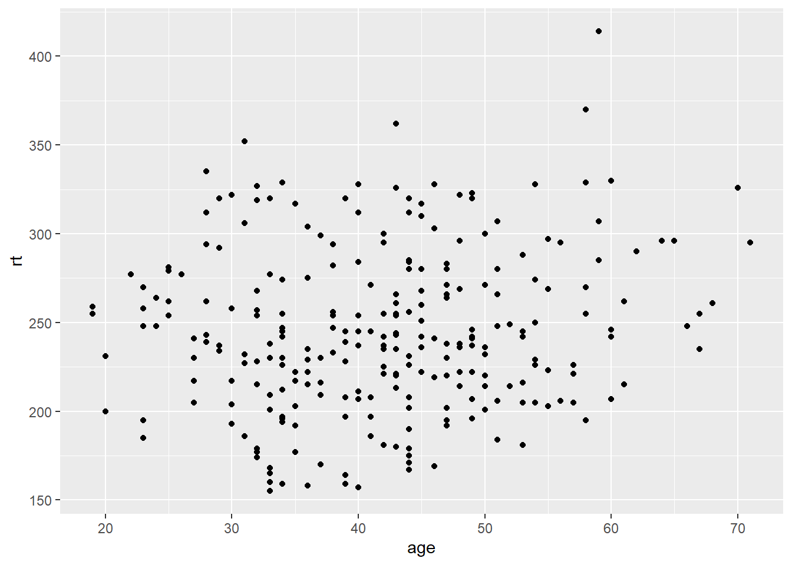

# Week 5

## Setting Up


```r
# Load packages
library(skimr)
library(gt)
library(gtsummary)
library(epiR)
library(broom)
library(pROC)
library(gmodels)
library(survival)
library(here)
library(tidyverse)

# Load data necessary to run Week 5 examples
lesson2b <- readRDS(here::here("Data", "Week 2", "lesson2b.rds"))
lesson3d <- readRDS(here::here("Data", "Week 3", "lesson3d.rds"))
lesson4d <- readRDS(here::here("Data", "Week 4", "lesson4d.rds"))
lesson5a <- readRDS(here::here("Data", "Week 5", "lesson5a.rds"))
example5a <- readRDS(here::here("Data", "Week 5", "example5a.rds"))
example5b <- readRDS(here::here("Data", "Week 5", "example5b.rds"))
```

## R Instructions

### Correlation

Correlating two or more variables is very easy: just use the `cor` function and then the dataset and selected variables.

For example, if you use the "lesson2b.rds" dataset and correlate the first four pain scores, you get the following table:


```r
# Display the correlation between variables l01, l02, l03 and l04
cor(lesson2b %>% select(l01, l02, l03, l04))
```

```
##           l01       l02       l03       l04
## l01 1.0000000 0.7900984 0.6270860 0.5395075
## l02 0.7900984 1.0000000 0.8145025 0.7148299
## l03 0.6270860 0.8145025 1.0000000 0.8383224
## l04 0.5395075 0.7148299 0.8383224 1.0000000
```


This shows, for example, that the correlation between l01 and l02 is 0.79 and the correlation between l02 and l04 is 0.71. From the table you can easily see that pain scores taken on consecutive days are more strongly correlated than those taken two or three days apart.

If the data are skewed, you can try a regression based on ranks, what is known as Spearman's rank correlation. What you'd type is the same as above, but adding the option `method = "spearman"`.


```r
# Calculate the Spearman correlation for skewed data
cor(lesson2b %>% select(l01, l02, l03, l04), method = "spearman")
```

```
##           l01       l02       l03       l04
## l01 1.0000000 0.7799856 0.6220233 0.5443327
## l02 0.7799856 1.0000000 0.8126008 0.7220277
## l03 0.6220233 0.8126008 1.0000000 0.8324906
## l04 0.5443327 0.7220277 0.8324906 1.0000000
```

### Linear regression

Linear regression is when you try to predict a continuous variable. The function to use is `lm`.

The first variable is the dependent variable (e.g. blood pressure) and must be continuous. The other variables are the predictor variables and can be binary or continuous: in some cases you can use ordinal variables but you have to be careful. We’ll deal with categorical variables later in the course. The dependent and predictor variables are separated by a "~", and multiple predictor variables are separated by "+".

Let's use the data from "lesson3d.rds" as an example dataset. We want to see if we can predict a patient's range of motion after treatment (variable a) in terms of their age, sex and pre-treatment range of motion (variable b).


```r
# Linear regression model for a, predictors are sex, age and b
lm(a ~ sex + age + b, data = lesson3d)
```

```
## 
## Call:
## lm(formula = a ~ sex + age + b, data = lesson3d)
## 
## Coefficients:
## (Intercept)          sex          age            b  
##    138.7336       2.8524      -0.4359       0.6692
```

This gives you the very basic information from the regression, but you can get more information using the `summary` function:


```r
# Save out linear regression model
rom_model <- lm(a ~ sex + age + b, data = lesson3d)

# Show additional model results
summary(rom_model)
```

```
## 
## Call:
## lm(formula = a ~ sex + age + b, data = lesson3d)
## 
## Residuals:
##     Min      1Q  Median      3Q     Max 
## -60.135 -11.943   3.238  14.523  47.732 
## 
## Coefficients:
##              Estimate Std. Error t value Pr(>|t|)    
## (Intercept) 138.73363   29.50514   4.702 5.40e-05 ***
## sex           2.85241   10.25817   0.278    0.783    
## age          -0.43589    0.27770  -1.570    0.127    
## b             0.66924    0.07816   8.563 1.49e-09 ***
## ---
## Signif. codes:  0 '***' 0.001 '**' 0.01 '*' 0.05 '.' 0.1 ' ' 1
## 
## Residual standard error: 25.29 on 30 degrees of freedom
## Multiple R-squared:  0.7475,	Adjusted R-squared:  0.7222 
## F-statistic:  29.6 on 3 and 30 DF,  p-value: 4.241e-09
```

The first column of numbers listed under "Coefficients" are the coefficients. You can interpret this as follows: start with 138.7 degrees of range of motion (the intercept or constant). Then add 2.85 if the patient is a woman, and take away 0.436 degrees for every year of age. Finally, add 0.669 degrees for every degree of range of motion the patient had before the trial.

Let's take a single patient: a 54 year old woman with a range of motion of 301 before treatment. Her predicted range of motion afterwards is 138.7 + 2.85 - 0.436\*54 + 0.669\*301 = 319.5. Her actual figure was 325, so we predicted quite well for this patient. You can get R to do this automatically using the `augment` function from the `broom` package.


```r
# The "augment" function creates a dataset of all patients included in the model
# and all variables included in the model, as well as the predictions
lesson3d_pred <- augment(rom_model)

# Print out new dataset to show output from "augment"
# The ".fitted" column is your prediction
# You can ignore all columns to the right of ".fitted"
lesson3d_pred
```

```
## # A tibble: 34 x 11
##        a   sex   age     b .fitted .se.fit  .resid   .hat .sigma .cooksd
##    <dbl> <dbl> <dbl> <dbl>   <dbl>   <dbl>   <dbl>  <dbl>  <dbl>   <dbl>
##  1   247     1    24   263    307.   11.4  -60.1   0.201    22.5 4.47e-1
##  2   324     0    73   339    334.    9.09  -9.79  0.129    25.7 6.38e-3
##  3   351     0    40   361    363.    7.78 -11.9   0.0947   25.6 6.39e-3
##  4   232     0    74   234    263.    8.49 -31.1   0.113    25.0 5.40e-2
##  5   328     0    51   329    337.    5.89  -8.68  0.0542   25.7 1.78e-3
##  6   380     0    26   376    379.   10.2    0.966 0.164    25.7 8.53e-5
##  7   302     0    54   297    314.    5.13 -12.0   0.0411   25.6 2.50e-3
##  8   254     0    39   249    288.    7.29 -34.4   0.0832   24.8 4.57e-2
##  9   250     1    65   244    277.    9.17 -26.5   0.131    25.2 4.80e-2
## 10   252     0    81   246    268.    9.58 -16.1   0.144    25.5 1.97e-2
## # ... with 24 more rows, and 1 more variable: .std.resid <dbl>
```

To get the number of observations, coefficients, 95% confidence interval and p values printed in a table for all covariates, you can use the `tbl_regression` function from the `gtsummary` package:


```r
# Print formatted table of regression results
tbl_regression(rom_model)
```

<!--html_preserve--><style>html {
  font-family: -apple-system, BlinkMacSystemFont, 'Segoe UI', Roboto, Oxygen, Ubuntu, Cantarell, 'Helvetica Neue', 'Fira Sans', 'Droid Sans', Arial, sans-serif;
}

#iwrgxmosvm .gt_table {
  display: table;
  border-collapse: collapse;
  margin-left: auto;
  margin-right: auto;
  color: #333333;
  font-size: 16px;
  background-color: #FFFFFF;
  /* table.background.color */
  width: auto;
  /* table.width */
  border-top-style: solid;
  /* table.border.top.style */
  border-top-width: 2px;
  /* table.border.top.width */
  border-top-color: #A8A8A8;
  /* table.border.top.color */
  border-bottom-style: solid;
  /* table.border.bottom.style */
  border-bottom-width: 2px;
  /* table.border.bottom.width */
  border-bottom-color: #A8A8A8;
  /* table.border.bottom.color */
}

#iwrgxmosvm .gt_heading {
  background-color: #FFFFFF;
  /* heading.background.color */
  border-bottom-color: #FFFFFF;
}

#iwrgxmosvm .gt_title {
  color: #333333;
  font-size: 125%;
  /* heading.title.font.size */
  padding-top: 4px;
  /* heading.top.padding - not yet used */
  padding-bottom: 4px;
  border-bottom-color: #FFFFFF;
  border-bottom-width: 0;
}

#iwrgxmosvm .gt_subtitle {
  color: #333333;
  font-size: 85%;
  /* heading.subtitle.font.size */
  padding-top: 0;
  padding-bottom: 4px;
  /* heading.bottom.padding - not yet used */
  border-top-color: #FFFFFF;
  border-top-width: 0;
}

#iwrgxmosvm .gt_bottom_border {
  border-bottom-style: solid;
  /* heading.border.bottom.style */
  border-bottom-width: 2px;
  /* heading.border.bottom.width */
  border-bottom-color: #D3D3D3;
  /* heading.border.bottom.color */
}

#iwrgxmosvm .gt_column_spanner {
  border-bottom-style: solid;
  border-bottom-width: 2px;
  border-bottom-color: #D3D3D3;
  padding-top: 4px;
  padding-bottom: 4px;
}

#iwrgxmosvm .gt_col_heading {
  color: #333333;
  background-color: #FFFFFF;
  /* column_labels.background.color */
  font-size: 16px;
  /* column_labels.font.size */
  font-weight: initial;
  /* column_labels.font.weight */
  vertical-align: middle;
  padding: 5px;
  margin: 10px;
  overflow-x: hidden;
}

#iwrgxmosvm .gt_columns_top_border {
  border-top-style: solid;
  border-top-width: 2px;
  border-top-color: #D3D3D3;
}

#iwrgxmosvm .gt_columns_bottom_border {
  border-bottom-style: solid;
  border-bottom-width: 2px;
  border-bottom-color: #D3D3D3;
}

#iwrgxmosvm .gt_sep_right {
  border-right: 5px solid #FFFFFF;
}

#iwrgxmosvm .gt_group_heading {
  padding: 8px;
  /* row_group.padding */
  color: #333333;
  background-color: #FFFFFF;
  /* row_group.background.color */
  font-size: 16px;
  /* row_group.font.size */
  font-weight: initial;
  /* row_group.font.weight */
  border-top-style: solid;
  /* row_group.border.top.style */
  border-top-width: 2px;
  /* row_group.border.top.width */
  border-top-color: #D3D3D3;
  /* row_group.border.top.color */
  border-bottom-style: solid;
  /* row_group.border.bottom.style */
  border-bottom-width: 2px;
  /* row_group.border.bottom.width */
  border-bottom-color: #D3D3D3;
  /* row_group.border.bottom.color */
  vertical-align: middle;
}

#iwrgxmosvm .gt_empty_group_heading {
  padding: 0.5px;
  color: #333333;
  background-color: #FFFFFF;
  /* row_group.background.color */
  font-size: 16px;
  /* row_group.font.size */
  font-weight: initial;
  /* row_group.font.weight */
  border-top-style: solid;
  /* row_group.border.top.style */
  border-top-width: 2px;
  /* row_group.border.top.width */
  border-top-color: #D3D3D3;
  /* row_group.border.top.color */
  border-bottom-style: solid;
  /* row_group.border.bottom.style */
  border-bottom-width: 2px;
  /* row_group.border.bottom.width */
  border-bottom-color: #D3D3D3;
  /* row_group.border.bottom.color */
  vertical-align: middle;
}

#iwrgxmosvm .gt_striped {
  background-color: #8080800D;
}

#iwrgxmosvm .gt_from_md > :first-child {
  margin-top: 0;
}

#iwrgxmosvm .gt_from_md > :last-child {
  margin-bottom: 0;
}

#iwrgxmosvm .gt_row {
  padding: 8px;
  /* row.padding */
  margin: 10px;
  border-top-style: solid;
  border-top-width: 1px;
  border-top-color: #D3D3D3;
  vertical-align: middle;
  overflow-x: hidden;
}

#iwrgxmosvm .gt_stub {
  border-right-style: solid;
  border-right-width: 2px;
  border-right-color: #D3D3D3;
  padding-left: 12px;
}

#iwrgxmosvm .gt_summary_row {
  color: #333333;
  background-color: #FFFFFF;
  /* summary_row.background.color */
  padding: 8px;
  /* summary_row.padding */
  text-transform: inherit;
  /* summary_row.text_transform */
}

#iwrgxmosvm .gt_grand_summary_row {
  color: #333333;
  background-color: #FFFFFF;
  /* grand_summary_row.background.color */
  padding: 8px;
  /* grand_summary_row.padding */
  text-transform: inherit;
  /* grand_summary_row.text_transform */
}

#iwrgxmosvm .gt_first_summary_row {
  border-top-style: solid;
  border-top-width: 2px;
  border-top-color: #D3D3D3;
}

#iwrgxmosvm .gt_first_grand_summary_row {
  border-top-style: double;
  border-top-width: 6px;
  border-top-color: #D3D3D3;
}

#iwrgxmosvm .gt_table_body {
  border-top-style: solid;
  /* table_body.border.top.style */
  border-top-width: 2px;
  /* table_body.border.top.width */
  border-top-color: #D3D3D3;
  /* table_body.border.top.color */
  border-bottom-style: solid;
  /* table_body.border.bottom.style */
  border-bottom-width: 2px;
  /* table_body.border.bottom.width */
  border-bottom-color: #D3D3D3;
  /* table_body.border.bottom.color */
}

#iwrgxmosvm .gt_footnotes {
  border-top-style: solid;
  /* footnotes.border.top.style */
  border-top-width: 2px;
  /* footnotes.border.top.width */
  border-top-color: #D3D3D3;
  /* footnotes.border.top.color */
}

#iwrgxmosvm .gt_footnote {
  font-size: 90%;
  /* footnote.font.size */
  margin: 0px;
  padding: 4px;
  /* footnote.padding */
}

#iwrgxmosvm .gt_sourcenotes {
  border-top-style: solid;
  /* sourcenotes.border.top.style */
  border-top-width: 2px;
  /* sourcenotes.border.top.width */
  border-top-color: #D3D3D3;
  /* sourcenotes.border.top.color */
}

#iwrgxmosvm .gt_sourcenote {
  font-size: 90%;
  /* sourcenote.font.size */
  padding: 4px;
  /* sourcenote.padding */
}

#iwrgxmosvm .gt_center {
  text-align: center;
}

#iwrgxmosvm .gt_left {
  text-align: left;
}

#iwrgxmosvm .gt_right {
  text-align: right;
  font-variant-numeric: tabular-nums;
}

#iwrgxmosvm .gt_font_normal {
  font-weight: normal;
}

#iwrgxmosvm .gt_font_bold {
  font-weight: bold;
}

#iwrgxmosvm .gt_font_italic {
  font-style: italic;
}

#iwrgxmosvm .gt_super {
  font-size: 65%;
}

#iwrgxmosvm .gt_footnote_marks {
  font-style: italic;
  font-size: 65%;
}
</style>
<div id="iwrgxmosvm" style="overflow-x:auto;overflow-y:auto;width:auto;height:auto;"><table class="gt_table">
  
  <tr>
    <th class="gt_col_heading gt_columns_bottom_border gt_columns_top_border gt_left" rowspan="1" colspan="1"><strong>N = 34</strong></th>
    <th class="gt_col_heading gt_columns_bottom_border gt_columns_top_border gt_center" rowspan="1" colspan="1"><strong>Coefficient</strong></th>
    <th class="gt_col_heading gt_columns_bottom_border gt_columns_top_border gt_center" rowspan="1" colspan="1"><strong>95% CI</strong></th>
    <th class="gt_col_heading gt_columns_bottom_border gt_columns_top_border gt_center" rowspan="1" colspan="1"><strong>p-value</strong></th>
  </tr>
  <body class="gt_table_body">
    <tr>
      <td class="gt_row gt_left">1=female</td>
      <td class="gt_row gt_center">2.9</td>
      <td class="gt_row gt_center">-18, 24</td>
      <td class="gt_row gt_center">0.8</td>
    </tr>
    <tr>
      <td class="gt_row gt_left gt_striped">age</td>
      <td class="gt_row gt_center gt_striped">-0.44</td>
      <td class="gt_row gt_center gt_striped">-1.0, 0.13</td>
      <td class="gt_row gt_center gt_striped">0.13</td>
    </tr>
    <tr>
      <td class="gt_row gt_left">range of motion before acupuncture</td>
      <td class="gt_row gt_center">0.67</td>
      <td class="gt_row gt_center">0.51, 0.83</td>
      <td class="gt_row gt_center"><0.001</td>
    </tr>
  </body>
  
  
</table></div><!--/html_preserve-->


For example, for sex, the 95% CI is -18 to 24, meaning that women might plausibly have a range of motion anywhere from 18 degrees less than men to 24 degrees more. In short, we don't have any strong evidence that sex has an effect on range of motion at all and we can see this reflected in the p value, p=0.8. There are 34 patients included in this model.


```r
# Summary of linear regression results
summary(rom_model)
```

```
## 
## Call:
## lm(formula = a ~ sex + age + b, data = lesson3d)
## 
## Residuals:
##     Min      1Q  Median      3Q     Max 
## -60.135 -11.943   3.238  14.523  47.732 
## 
## Coefficients:
##              Estimate Std. Error t value Pr(>|t|)    
## (Intercept) 138.73363   29.50514   4.702 5.40e-05 ***
## sex           2.85241   10.25817   0.278    0.783    
## age          -0.43589    0.27770  -1.570    0.127    
## b             0.66924    0.07816   8.563 1.49e-09 ***
## ---
## Signif. codes:  0 '***' 0.001 '**' 0.01 '*' 0.05 '.' 0.1 ' ' 1
## 
## Residual standard error: 25.29 on 30 degrees of freedom
## Multiple R-squared:  0.7475,	Adjusted R-squared:  0.7222 
## F-statistic:  29.6 on 3 and 30 DF,  p-value: 4.241e-09
```

At the bottom of the `summary` readout there are a few miscellaneous tidbits:

- The "p value" next to the "F-statistic" on the last line tells you whether, as a whole, your model, including the constant and three variables, is a statistically significant predictor.

- The "Multiple R-squared" value (often referred to as just "r squared") tells you how good a predictor it is on a scale from 0 to 1. We’ll discuss the meaning of r squared in more detail, but it is defined as the proportion of variation that you can explain using your model. 

### Graphing the data

Graphing the data is done using the `ggplot` function from the `ggplot2` package. In short, the main inputs for the `ggplot` function are your dataset, the x variable and the y variable. You can then create a number of different plots using this data.

To create a scatterplot, the `geom_point` function is added to the `ggplot` function:


```r
# Create a scatterplot of race time by age
ggplot(data = lesson5a,
       aes(x = age, y = rt)) +
  geom_point()
```



This scatterplot from the "lesson5a.rds" data shows race time and age for every runner in the study. This is a useful way of getting a feel for the data before you start.

### Logistic regression

Logistic regression is used when the variable you wish to predict is binary (e.g. relapsed or not). The function to use is `glm`, with the option `family = "binomial"` to indicate that our outcome variable is binary.

Again, the first variable is the dependent variable (e.g. hypertension) and must be binary. The other variables are the predictor variables and can be binary or continuous: again, in some cases you can use ordinal variables but you have to be careful. The variables are entered into the `glm` function the same way as the `lm` function (dependent ~ predictor1 + predictor2 + ...).

We'll use the dataset "lesson4d.rds" as an example.


```r
# Create a logistic regression model for response, predictors are age, sex and group
response_model <- glm(response ~ age + sex + group, data = lesson4d, family = "binomial")

# Look at additional model results
summary(response_model)
```

```
## 
## Call:
## glm(formula = response ~ age + sex + group, family = "binomial", 
##     data = lesson4d)
## 
## Deviance Residuals: 
##     Min       1Q   Median       3Q      Max  
## -1.3760  -1.0954  -0.9119   1.2366   1.5590  
## 
## Coefficients:
##              Estimate Std. Error z value Pr(>|z|)  
## (Intercept)  0.967546   0.447037   2.164   0.0304 *
## age         -0.023270   0.009807  -2.373   0.0177 *
## sex         -0.180196   0.234045  -0.770   0.4413  
## group       -0.318300   0.205037  -1.552   0.1206  
## ---
## Signif. codes:  0 '***' 0.001 '**' 0.01 '*' 0.05 '.' 0.1 ' ' 1
## 
## (Dispersion parameter for binomial family taken to be 1)
## 
##     Null deviance: 546.87  on 397  degrees of freedom
## Residual deviance: 538.18  on 394  degrees of freedom
##   (2 observations deleted due to missingness)
## AIC: 546.18
## 
## Number of Fisher Scoring iterations: 4
```


By default, R gives the coefficients in logits for logistic regression models. To easily see the coefficients and 95% confidence intervals for all covariates as odds ratio, we can again use the `tbl_regression` function. In this case, we use the option `exponentiate = TRUE`, which indicates that odds ratios (not logits) should be presented. (You can also use this function to see the formatted logit results by using the `exponentiate = FALSE` option.)


```r
# Create logistic regression model
glm(response ~ age + sex + group, data = lesson4d, family = "binomial") %>%
  # Pass to tbl_regression to show formatted table with odds ratios
  tbl_regression(exponentiate = TRUE)
```

<!--html_preserve--><style>html {
  font-family: -apple-system, BlinkMacSystemFont, 'Segoe UI', Roboto, Oxygen, Ubuntu, Cantarell, 'Helvetica Neue', 'Fira Sans', 'Droid Sans', Arial, sans-serif;
}

#hlleqxdave .gt_table {
  display: table;
  border-collapse: collapse;
  margin-left: auto;
  margin-right: auto;
  color: #333333;
  font-size: 16px;
  background-color: #FFFFFF;
  /* table.background.color */
  width: auto;
  /* table.width */
  border-top-style: solid;
  /* table.border.top.style */
  border-top-width: 2px;
  /* table.border.top.width */
  border-top-color: #A8A8A8;
  /* table.border.top.color */
  border-bottom-style: solid;
  /* table.border.bottom.style */
  border-bottom-width: 2px;
  /* table.border.bottom.width */
  border-bottom-color: #A8A8A8;
  /* table.border.bottom.color */
}

#hlleqxdave .gt_heading {
  background-color: #FFFFFF;
  /* heading.background.color */
  border-bottom-color: #FFFFFF;
}

#hlleqxdave .gt_title {
  color: #333333;
  font-size: 125%;
  /* heading.title.font.size */
  padding-top: 4px;
  /* heading.top.padding - not yet used */
  padding-bottom: 4px;
  border-bottom-color: #FFFFFF;
  border-bottom-width: 0;
}

#hlleqxdave .gt_subtitle {
  color: #333333;
  font-size: 85%;
  /* heading.subtitle.font.size */
  padding-top: 0;
  padding-bottom: 4px;
  /* heading.bottom.padding - not yet used */
  border-top-color: #FFFFFF;
  border-top-width: 0;
}

#hlleqxdave .gt_bottom_border {
  border-bottom-style: solid;
  /* heading.border.bottom.style */
  border-bottom-width: 2px;
  /* heading.border.bottom.width */
  border-bottom-color: #D3D3D3;
  /* heading.border.bottom.color */
}

#hlleqxdave .gt_column_spanner {
  border-bottom-style: solid;
  border-bottom-width: 2px;
  border-bottom-color: #D3D3D3;
  padding-top: 4px;
  padding-bottom: 4px;
}

#hlleqxdave .gt_col_heading {
  color: #333333;
  background-color: #FFFFFF;
  /* column_labels.background.color */
  font-size: 16px;
  /* column_labels.font.size */
  font-weight: initial;
  /* column_labels.font.weight */
  vertical-align: middle;
  padding: 5px;
  margin: 10px;
  overflow-x: hidden;
}

#hlleqxdave .gt_columns_top_border {
  border-top-style: solid;
  border-top-width: 2px;
  border-top-color: #D3D3D3;
}

#hlleqxdave .gt_columns_bottom_border {
  border-bottom-style: solid;
  border-bottom-width: 2px;
  border-bottom-color: #D3D3D3;
}

#hlleqxdave .gt_sep_right {
  border-right: 5px solid #FFFFFF;
}

#hlleqxdave .gt_group_heading {
  padding: 8px;
  /* row_group.padding */
  color: #333333;
  background-color: #FFFFFF;
  /* row_group.background.color */
  font-size: 16px;
  /* row_group.font.size */
  font-weight: initial;
  /* row_group.font.weight */
  border-top-style: solid;
  /* row_group.border.top.style */
  border-top-width: 2px;
  /* row_group.border.top.width */
  border-top-color: #D3D3D3;
  /* row_group.border.top.color */
  border-bottom-style: solid;
  /* row_group.border.bottom.style */
  border-bottom-width: 2px;
  /* row_group.border.bottom.width */
  border-bottom-color: #D3D3D3;
  /* row_group.border.bottom.color */
  vertical-align: middle;
}

#hlleqxdave .gt_empty_group_heading {
  padding: 0.5px;
  color: #333333;
  background-color: #FFFFFF;
  /* row_group.background.color */
  font-size: 16px;
  /* row_group.font.size */
  font-weight: initial;
  /* row_group.font.weight */
  border-top-style: solid;
  /* row_group.border.top.style */
  border-top-width: 2px;
  /* row_group.border.top.width */
  border-top-color: #D3D3D3;
  /* row_group.border.top.color */
  border-bottom-style: solid;
  /* row_group.border.bottom.style */
  border-bottom-width: 2px;
  /* row_group.border.bottom.width */
  border-bottom-color: #D3D3D3;
  /* row_group.border.bottom.color */
  vertical-align: middle;
}

#hlleqxdave .gt_striped {
  background-color: #8080800D;
}

#hlleqxdave .gt_from_md > :first-child {
  margin-top: 0;
}

#hlleqxdave .gt_from_md > :last-child {
  margin-bottom: 0;
}

#hlleqxdave .gt_row {
  padding: 8px;
  /* row.padding */
  margin: 10px;
  border-top-style: solid;
  border-top-width: 1px;
  border-top-color: #D3D3D3;
  vertical-align: middle;
  overflow-x: hidden;
}

#hlleqxdave .gt_stub {
  border-right-style: solid;
  border-right-width: 2px;
  border-right-color: #D3D3D3;
  padding-left: 12px;
}

#hlleqxdave .gt_summary_row {
  color: #333333;
  background-color: #FFFFFF;
  /* summary_row.background.color */
  padding: 8px;
  /* summary_row.padding */
  text-transform: inherit;
  /* summary_row.text_transform */
}

#hlleqxdave .gt_grand_summary_row {
  color: #333333;
  background-color: #FFFFFF;
  /* grand_summary_row.background.color */
  padding: 8px;
  /* grand_summary_row.padding */
  text-transform: inherit;
  /* grand_summary_row.text_transform */
}

#hlleqxdave .gt_first_summary_row {
  border-top-style: solid;
  border-top-width: 2px;
  border-top-color: #D3D3D3;
}

#hlleqxdave .gt_first_grand_summary_row {
  border-top-style: double;
  border-top-width: 6px;
  border-top-color: #D3D3D3;
}

#hlleqxdave .gt_table_body {
  border-top-style: solid;
  /* table_body.border.top.style */
  border-top-width: 2px;
  /* table_body.border.top.width */
  border-top-color: #D3D3D3;
  /* table_body.border.top.color */
  border-bottom-style: solid;
  /* table_body.border.bottom.style */
  border-bottom-width: 2px;
  /* table_body.border.bottom.width */
  border-bottom-color: #D3D3D3;
  /* table_body.border.bottom.color */
}

#hlleqxdave .gt_footnotes {
  border-top-style: solid;
  /* footnotes.border.top.style */
  border-top-width: 2px;
  /* footnotes.border.top.width */
  border-top-color: #D3D3D3;
  /* footnotes.border.top.color */
}

#hlleqxdave .gt_footnote {
  font-size: 90%;
  /* footnote.font.size */
  margin: 0px;
  padding: 4px;
  /* footnote.padding */
}

#hlleqxdave .gt_sourcenotes {
  border-top-style: solid;
  /* sourcenotes.border.top.style */
  border-top-width: 2px;
  /* sourcenotes.border.top.width */
  border-top-color: #D3D3D3;
  /* sourcenotes.border.top.color */
}

#hlleqxdave .gt_sourcenote {
  font-size: 90%;
  /* sourcenote.font.size */
  padding: 4px;
  /* sourcenote.padding */
}

#hlleqxdave .gt_center {
  text-align: center;
}

#hlleqxdave .gt_left {
  text-align: left;
}

#hlleqxdave .gt_right {
  text-align: right;
  font-variant-numeric: tabular-nums;
}

#hlleqxdave .gt_font_normal {
  font-weight: normal;
}

#hlleqxdave .gt_font_bold {
  font-weight: bold;
}

#hlleqxdave .gt_font_italic {
  font-style: italic;
}

#hlleqxdave .gt_super {
  font-size: 65%;
}

#hlleqxdave .gt_footnote_marks {
  font-style: italic;
  font-size: 65%;
}
</style>
<div id="hlleqxdave" style="overflow-x:auto;overflow-y:auto;width:auto;height:auto;"><table class="gt_table">
  
  <tr>
    <th class="gt_col_heading gt_columns_bottom_border gt_columns_top_border gt_left" rowspan="1" colspan="1"><strong>N = 398</strong></th>
    <th class="gt_col_heading gt_columns_bottom_border gt_columns_top_border gt_center" rowspan="1" colspan="1"><strong>OR</strong><sup class="gt_footnote_marks">1</sup></th>
    <th class="gt_col_heading gt_columns_bottom_border gt_columns_top_border gt_center" rowspan="1" colspan="1"><strong>95% CI</strong></th>
    <th class="gt_col_heading gt_columns_bottom_border gt_columns_top_border gt_center" rowspan="1" colspan="1"><strong>p-value</strong></th>
  </tr>
  <body class="gt_table_body">
    <tr>
      <td class="gt_row gt_left">age</td>
      <td class="gt_row gt_center">0.98</td>
      <td class="gt_row gt_center">0.96, 1.00</td>
      <td class="gt_row gt_center">0.018</td>
    </tr>
    <tr>
      <td class="gt_row gt_left gt_striped">1 if woman, 0 if man</td>
      <td class="gt_row gt_center gt_striped">0.84</td>
      <td class="gt_row gt_center gt_striped">0.53, 1.32</td>
      <td class="gt_row gt_center gt_striped">0.4</td>
    </tr>
    <tr>
      <td class="gt_row gt_left">1 if b, 0 if a</td>
      <td class="gt_row gt_center">0.73</td>
      <td class="gt_row gt_center">0.49, 1.09</td>
      <td class="gt_row gt_center">0.12</td>
    </tr>
  </body>
  
  <tfoot>
    <tr class="gt_footnotes">
      <td colspan="4">
        <p class="gt_footnote">
          <sup class="gt_footnote_marks">
            <em>1</em>
          </sup>
           
          OR = Odds Ratio, CI = Confidence Interval
          <br />
        </p>
      </td>
    </tr>
  </tfoot>
</table></div><!--/html_preserve-->

The key things here are the odds ratios: you can say that the odds of response is multiplied by 0.98 for a one year increase in age; that women have an odds of response 0.84 of that for the men, though this is not statistically significant, and that response is lower in group 1, with an odds of 0.73 (you would also cite the p value and 95% CIs).

The problem here is that you can’t use any of these data to work out an individual patient’s chance of response. Now you can get R to do this for you using the `augment` function. For a binary outcome, you need to specify `type.predict = "response"` as an option so that you will get predicted probabilities (not log odds).


```r
# Get predictions from logistic regression model
# type.predict = "response" gives predicted probabilities
lesson4d_pred <-
  augment(response_model, type.predict = "response")

# Look at the dataset containing predicted probabilities (.fitted variable)
# You can ignore all columns to the right of ".fitted"
lesson4d_pred
```

```
## # A tibble: 398 x 12
##    .rownames response   age   sex group .fitted .se.fit .resid    .hat
##    <chr>        <dbl> <dbl> <dbl> <dbl>   <dbl>   <dbl>  <dbl>   <dbl>
##  1 1                1    47     0     0   0.469  0.0391  1.23  0.00612
##  2 2                0    47     0     0   0.469  0.0391 -1.12  0.00612
##  3 3                1    25     0     0   0.595  0.0558  1.02  0.0129 
##  4 4                0    53     0     1   0.358  0.0440 -0.941 0.00841
##  5 5                1    64     0     0   0.372  0.0600  1.41  0.0154 
##  6 6                0    50     0     1   0.374  0.0416 -0.968 0.00738
##  7 7                1    34     0     1   0.465  0.0456  1.24  0.00838
##  8 8                0    68     0     1   0.282  0.0601 -0.814 0.0178 
##  9 9                0    49     0     0   0.457  0.0404 -1.11  0.00659
## 10 10               0    44     0     1   0.407  0.0393 -1.02  0.00641
## # ... with 388 more rows, and 3 more variables: .sigma <dbl>,
## #   .cooksd <dbl>, .std.resid <dbl>
```

NOTE: The "lesson4d_pred" dataset only includes 398 patients. If you look at the table above, you will see at the top that only 398 patients were included in the model. Any patients who are missing data for the outcome or any predictors will be excluded from the model, and will not be included in the predicted dataset.

If you want to look at calculating predictions from logistic regression in more detail, you’ll need logit (see below). 

One thing to be careful about is categorical variables. Imagine that you had the patients age and cancer stage (1, 2, 3 or 4) and wanted to know whether they recurred. If you tried `glm(recurrence ~ age + stage, ...)`, then stage would be treated as if the increase in risk going from stage 1 to 2 was exactly the same as that going from 2 to 3 and 3 to 4. To tell R that it is a categorical variable, you need to use the `factor` function with the categorical variable:


```r
# Create a model for recurrence using the categorical variable "stage"
recurrence_model <-
  glm(recurrence ~ age + factor(stage), data = example5a, family = "binomial")

# Show the results of this model
summary(recurrence_model)
```

```
## 
## Call:
## glm(formula = recurrence ~ age + factor(stage), family = "binomial", 
##     data = example5a)
## 
## Deviance Residuals: 
##     Min       1Q   Median       3Q      Max  
## -1.8330  -0.8557  -0.5887   1.0807   2.1078  
## 
## Coefficients:
##                 Estimate Std. Error z value Pr(>|z|)    
## (Intercept)    -3.410438   0.309203 -11.030  < 2e-16 ***
## age             0.042057   0.005531   7.604 2.87e-14 ***
## factor(stage)2  0.996064   0.152510   6.531 6.53e-11 ***
## factor(stage)3  1.655345   0.260107   6.364 1.96e-10 ***
## factor(stage)4  1.771858   0.292687   6.054 1.41e-09 ***
## ---
## Signif. codes:  0 '***' 0.001 '**' 0.01 '*' 0.05 '.' 0.1 ' ' 1
## 
## (Dispersion parameter for binomial family taken to be 1)
## 
##     Null deviance: 1369.7  on 1063  degrees of freedom
## Residual deviance: 1212.9  on 1059  degrees of freedom
## AIC: 1222.9
## 
## Number of Fisher Scoring iterations: 3
```


```r
# Formatted to show odds ratios
recurrence_model %>%
  tbl_regression(exponentiate = TRUE)
```

<!--html_preserve--><style>html {
  font-family: -apple-system, BlinkMacSystemFont, 'Segoe UI', Roboto, Oxygen, Ubuntu, Cantarell, 'Helvetica Neue', 'Fira Sans', 'Droid Sans', Arial, sans-serif;
}

#kqtxbhydst .gt_table {
  display: table;
  border-collapse: collapse;
  margin-left: auto;
  margin-right: auto;
  color: #333333;
  font-size: 16px;
  background-color: #FFFFFF;
  /* table.background.color */
  width: auto;
  /* table.width */
  border-top-style: solid;
  /* table.border.top.style */
  border-top-width: 2px;
  /* table.border.top.width */
  border-top-color: #A8A8A8;
  /* table.border.top.color */
  border-bottom-style: solid;
  /* table.border.bottom.style */
  border-bottom-width: 2px;
  /* table.border.bottom.width */
  border-bottom-color: #A8A8A8;
  /* table.border.bottom.color */
}

#kqtxbhydst .gt_heading {
  background-color: #FFFFFF;
  /* heading.background.color */
  border-bottom-color: #FFFFFF;
}

#kqtxbhydst .gt_title {
  color: #333333;
  font-size: 125%;
  /* heading.title.font.size */
  padding-top: 4px;
  /* heading.top.padding - not yet used */
  padding-bottom: 4px;
  border-bottom-color: #FFFFFF;
  border-bottom-width: 0;
}

#kqtxbhydst .gt_subtitle {
  color: #333333;
  font-size: 85%;
  /* heading.subtitle.font.size */
  padding-top: 0;
  padding-bottom: 4px;
  /* heading.bottom.padding - not yet used */
  border-top-color: #FFFFFF;
  border-top-width: 0;
}

#kqtxbhydst .gt_bottom_border {
  border-bottom-style: solid;
  /* heading.border.bottom.style */
  border-bottom-width: 2px;
  /* heading.border.bottom.width */
  border-bottom-color: #D3D3D3;
  /* heading.border.bottom.color */
}

#kqtxbhydst .gt_column_spanner {
  border-bottom-style: solid;
  border-bottom-width: 2px;
  border-bottom-color: #D3D3D3;
  padding-top: 4px;
  padding-bottom: 4px;
}

#kqtxbhydst .gt_col_heading {
  color: #333333;
  background-color: #FFFFFF;
  /* column_labels.background.color */
  font-size: 16px;
  /* column_labels.font.size */
  font-weight: initial;
  /* column_labels.font.weight */
  vertical-align: middle;
  padding: 5px;
  margin: 10px;
  overflow-x: hidden;
}

#kqtxbhydst .gt_columns_top_border {
  border-top-style: solid;
  border-top-width: 2px;
  border-top-color: #D3D3D3;
}

#kqtxbhydst .gt_columns_bottom_border {
  border-bottom-style: solid;
  border-bottom-width: 2px;
  border-bottom-color: #D3D3D3;
}

#kqtxbhydst .gt_sep_right {
  border-right: 5px solid #FFFFFF;
}

#kqtxbhydst .gt_group_heading {
  padding: 8px;
  /* row_group.padding */
  color: #333333;
  background-color: #FFFFFF;
  /* row_group.background.color */
  font-size: 16px;
  /* row_group.font.size */
  font-weight: initial;
  /* row_group.font.weight */
  border-top-style: solid;
  /* row_group.border.top.style */
  border-top-width: 2px;
  /* row_group.border.top.width */
  border-top-color: #D3D3D3;
  /* row_group.border.top.color */
  border-bottom-style: solid;
  /* row_group.border.bottom.style */
  border-bottom-width: 2px;
  /* row_group.border.bottom.width */
  border-bottom-color: #D3D3D3;
  /* row_group.border.bottom.color */
  vertical-align: middle;
}

#kqtxbhydst .gt_empty_group_heading {
  padding: 0.5px;
  color: #333333;
  background-color: #FFFFFF;
  /* row_group.background.color */
  font-size: 16px;
  /* row_group.font.size */
  font-weight: initial;
  /* row_group.font.weight */
  border-top-style: solid;
  /* row_group.border.top.style */
  border-top-width: 2px;
  /* row_group.border.top.width */
  border-top-color: #D3D3D3;
  /* row_group.border.top.color */
  border-bottom-style: solid;
  /* row_group.border.bottom.style */
  border-bottom-width: 2px;
  /* row_group.border.bottom.width */
  border-bottom-color: #D3D3D3;
  /* row_group.border.bottom.color */
  vertical-align: middle;
}

#kqtxbhydst .gt_striped {
  background-color: #8080800D;
}

#kqtxbhydst .gt_from_md > :first-child {
  margin-top: 0;
}

#kqtxbhydst .gt_from_md > :last-child {
  margin-bottom: 0;
}

#kqtxbhydst .gt_row {
  padding: 8px;
  /* row.padding */
  margin: 10px;
  border-top-style: solid;
  border-top-width: 1px;
  border-top-color: #D3D3D3;
  vertical-align: middle;
  overflow-x: hidden;
}

#kqtxbhydst .gt_stub {
  border-right-style: solid;
  border-right-width: 2px;
  border-right-color: #D3D3D3;
  padding-left: 12px;
}

#kqtxbhydst .gt_summary_row {
  color: #333333;
  background-color: #FFFFFF;
  /* summary_row.background.color */
  padding: 8px;
  /* summary_row.padding */
  text-transform: inherit;
  /* summary_row.text_transform */
}

#kqtxbhydst .gt_grand_summary_row {
  color: #333333;
  background-color: #FFFFFF;
  /* grand_summary_row.background.color */
  padding: 8px;
  /* grand_summary_row.padding */
  text-transform: inherit;
  /* grand_summary_row.text_transform */
}

#kqtxbhydst .gt_first_summary_row {
  border-top-style: solid;
  border-top-width: 2px;
  border-top-color: #D3D3D3;
}

#kqtxbhydst .gt_first_grand_summary_row {
  border-top-style: double;
  border-top-width: 6px;
  border-top-color: #D3D3D3;
}

#kqtxbhydst .gt_table_body {
  border-top-style: solid;
  /* table_body.border.top.style */
  border-top-width: 2px;
  /* table_body.border.top.width */
  border-top-color: #D3D3D3;
  /* table_body.border.top.color */
  border-bottom-style: solid;
  /* table_body.border.bottom.style */
  border-bottom-width: 2px;
  /* table_body.border.bottom.width */
  border-bottom-color: #D3D3D3;
  /* table_body.border.bottom.color */
}

#kqtxbhydst .gt_footnotes {
  border-top-style: solid;
  /* footnotes.border.top.style */
  border-top-width: 2px;
  /* footnotes.border.top.width */
  border-top-color: #D3D3D3;
  /* footnotes.border.top.color */
}

#kqtxbhydst .gt_footnote {
  font-size: 90%;
  /* footnote.font.size */
  margin: 0px;
  padding: 4px;
  /* footnote.padding */
}

#kqtxbhydst .gt_sourcenotes {
  border-top-style: solid;
  /* sourcenotes.border.top.style */
  border-top-width: 2px;
  /* sourcenotes.border.top.width */
  border-top-color: #D3D3D3;
  /* sourcenotes.border.top.color */
}

#kqtxbhydst .gt_sourcenote {
  font-size: 90%;
  /* sourcenote.font.size */
  padding: 4px;
  /* sourcenote.padding */
}

#kqtxbhydst .gt_center {
  text-align: center;
}

#kqtxbhydst .gt_left {
  text-align: left;
}

#kqtxbhydst .gt_right {
  text-align: right;
  font-variant-numeric: tabular-nums;
}

#kqtxbhydst .gt_font_normal {
  font-weight: normal;
}

#kqtxbhydst .gt_font_bold {
  font-weight: bold;
}

#kqtxbhydst .gt_font_italic {
  font-style: italic;
}

#kqtxbhydst .gt_super {
  font-size: 65%;
}

#kqtxbhydst .gt_footnote_marks {
  font-style: italic;
  font-size: 65%;
}
</style>
<div id="kqtxbhydst" style="overflow-x:auto;overflow-y:auto;width:auto;height:auto;"><table class="gt_table">
  
  <tr>
    <th class="gt_col_heading gt_columns_bottom_border gt_columns_top_border gt_left" rowspan="1" colspan="1"><strong>N = 1064</strong></th>
    <th class="gt_col_heading gt_columns_bottom_border gt_columns_top_border gt_center" rowspan="1" colspan="1"><strong>OR</strong><sup class="gt_footnote_marks">1</sup></th>
    <th class="gt_col_heading gt_columns_bottom_border gt_columns_top_border gt_center" rowspan="1" colspan="1"><strong>95% CI</strong></th>
    <th class="gt_col_heading gt_columns_bottom_border gt_columns_top_border gt_center" rowspan="1" colspan="1"><strong>p-value</strong></th>
  </tr>
  <body class="gt_table_body">
    <tr>
      <td class="gt_row gt_left">age</td>
      <td class="gt_row gt_center">1.04</td>
      <td class="gt_row gt_center">1.03, 1.05</td>
      <td class="gt_row gt_center"><0.001</td>
    </tr>
    <tr>
      <td class="gt_row gt_left gt_striped">factor(stage)</td>
      <td class="gt_row gt_center gt_striped"></td>
      <td class="gt_row gt_center gt_striped"></td>
      <td class="gt_row gt_center gt_striped"></td>
    </tr>
    <tr>
      <td class="gt_row gt_left" style="text-align: left; text-indent: 10px;">1</td>
      <td class="gt_row gt_center">&mdash;</td>
      <td class="gt_row gt_center">&mdash;</td>
      <td class="gt_row gt_center"></td>
    </tr>
    <tr>
      <td class="gt_row gt_left gt_striped" style="text-align: left; text-indent: 10px;">2</td>
      <td class="gt_row gt_center gt_striped">2.71</td>
      <td class="gt_row gt_center gt_striped">2.01, 3.66</td>
      <td class="gt_row gt_center gt_striped"><0.001</td>
    </tr>
    <tr>
      <td class="gt_row gt_left" style="text-align: left; text-indent: 10px;">3</td>
      <td class="gt_row gt_center">5.23</td>
      <td class="gt_row gt_center">3.16, 8.79</td>
      <td class="gt_row gt_center"><0.001</td>
    </tr>
    <tr>
      <td class="gt_row gt_left gt_striped" style="text-align: left; text-indent: 10px;">4</td>
      <td class="gt_row gt_center gt_striped">5.88</td>
      <td class="gt_row gt_center gt_striped">3.34, 10.6</td>
      <td class="gt_row gt_center gt_striped"><0.001</td>
    </tr>
  </body>
  
  <tfoot>
    <tr class="gt_footnotes">
      <td colspan="4">
        <p class="gt_footnote">
          <sup class="gt_footnote_marks">
            <em>1</em>
          </sup>
           
          OR = Odds Ratio, CI = Confidence Interval
          <br />
        </p>
      </td>
    </tr>
  </tfoot>
</table></div><!--/html_preserve-->


What you can see here is that stage is broken into categories. The odds ratio is given comparing each stage to stage 1 (the reference). So the odds of recurrence is 2.71 higher for stage 2 compared to stage 1, 5.23 for stage 3 compared to stage 1 and 5.88 for stage 4 compared to stage 1.

**For keen students only!**

Here we look at our "response" model on the logit scale.


```r
# Look at details of "response" logistic regression model
summary(response_model)
```

```
## 
## Call:
## glm(formula = response ~ age + sex + group, family = "binomial", 
##     data = lesson4d)
## 
## Deviance Residuals: 
##     Min       1Q   Median       3Q      Max  
## -1.3760  -1.0954  -0.9119   1.2366   1.5590  
## 
## Coefficients:
##              Estimate Std. Error z value Pr(>|z|)  
## (Intercept)  0.967546   0.447037   2.164   0.0304 *
## age         -0.023270   0.009807  -2.373   0.0177 *
## sex         -0.180196   0.234045  -0.770   0.4413  
## group       -0.318300   0.205037  -1.552   0.1206  
## ---
## Signif. codes:  0 '***' 0.001 '**' 0.01 '*' 0.05 '.' 0.1 ' ' 1
## 
## (Dispersion parameter for binomial family taken to be 1)
## 
##     Null deviance: 546.87  on 397  degrees of freedom
## Residual deviance: 538.18  on 394  degrees of freedom
##   (2 observations deleted due to missingness)
## AIC: 546.18
## 
## Number of Fisher Scoring iterations: 4
```


Firstly, note that the p values are the same, what differs is the coefficients. Now if you are really smart, you’ll notice that the coefficient is the natural log of the odds ratios above. You can use the coefficients to work out an individual’s probability of response. We start with the constant, and subtract 0.0233 for each year of age and then subtract an additional 0.18 if a woman and 0.318 if in group 1. Call this number "l" for the log of the odds. The probability is e^l^ / (1 + e^l^). Take a 53 year old man on regimen b (group 1): l = 0.9675 + -0.0233\*53 + -0.318, gives -0.5841.

To convert, type ``exp(-0.5841) / (exp(-0.5841)+1)`` to get a probability of 35.8%.

### Getting the area-under-the-curve

Using regression models is a way to try to predict outcome based on the data we have. After we've created a model, we want to know - is the prediction from this model any good? One way to do this is by assessing the discrimination. For logistic regression, where we have a binary endpoint, discrimination tells us how well the model distinguishes between patients who have the event and patients who do not have the event. Discrimination is measured using the area-under-the-curve (AUC) and varies between 0.5 (a coin flip) and 1 (perfect discrimination).

Imagine that you wanted to know how well a blood marker predicted cancer. Note that the blood marker could be continuous (e.g. ng/ml) or binary (positive or negative such as in a test for circulating tumor cells), it doesn’t matter for our purposes.


```r
# Calculate the AUC using the "roc" function
roc(cancer ~ marker, data = example5b)
```

```
## 
## Call:
## roc.formula(formula = cancer ~ marker, data = example5b)
## 
## Data: marker in 1865 controls (cancer 0) < 635 cases (cancer 1).
## Area under the curve: 0.8143
```

So the marker has an area under the curve of 0.814. The `roc` function is particularly useful if you want to know the area-under-the-curve with and without a marker.

For instance, the code below could tell you how much the area-under-the-curve increases when you add a new marker to a model to predict cancer that already includes age.

First, get the AUC for the model with age only:


```r
# Calculate AUC of original model with age
roc(cancer ~ age, data = example5b)
```

```
## 
## Call:
## roc.formula(formula = cancer ~ age, data = example5b)
## 
## Data: age in 1865 controls (cancer 0) < 635 cases (cancer 1).
## Area under the curve: 0.6354
```

The `roc` function can only take one predictor variable. For a univariate model, such as the model assessing age above, you can put "age" directly into the `roc` function. If you want to assess a model with multiple variables, you can use the predicted value:


```r
# Create the multivariable model
marker_model <- glm(cancer ~ age + marker, data = example5b, family = "binomial")

# Use "augment" to get predicted probability
marker_pred <- augment(marker_model, type.predict = "response")
```

Now, calculate the AUC for the model with age and the marker by using the predicted probability based on the multivariable model:


```r
# Calculate AUC of model with age and marker
roc(cancer ~ .fitted, data = marker_pred)
```

```
## 
## Call:
## roc.formula(formula = cancer ~ .fitted, data = marker_pred)
## 
## Data: .fitted in 1865 controls (cancer 0) < 635 cases (cancer 1).
## Area under the curve: 0.7996
```
The AUC for the model including both age and the marker value is higher than for age alone, so we can conclude that the marker adds important predictiveness to age. 

## Assignments


```r
# Copy and paste this code to load the data for week 5 assignments
lesson5a <- readRDS(here::here("Data", "Week 5", "lesson5a.rds"))
lesson5b <- readRDS(here::here("Data", "Week 5", "lesson5b.rds"))
lesson5c <- readRDS(here::here("Data", "Week 5", "lesson5c.rds"))
lesson5d <- readRDS(here::here("Data", "Week 5", "lesson5d.rds"))
lesson5e <- readRDS(here::here("Data", "Week 5", "lesson5e.rds"))
lesson5f <- readRDS(here::here("Data", "Week 5", "lesson5f.rds"))
lesson5g <- readRDS(here::here("Data", "Week 5", "lesson5g.rds"))
lesson5h <- readRDS(here::here("Data", "Week 5", "lesson5h.rds"))
lesson5i <- readRDS(here::here("Data", "Week 5", "lesson5i.rds"))
```

Regression is a very important part of statistics: I probably do more regressions that any other type of analysis, apart from than calculating basic summary data such as medians, means and proportions. So, I’ve given you lots of possibilities here. I’ve coded them: you really should try to do the bold ones, do those in italics if you can, and if you get to the rest, well, the more the merrier. The reason I have included all this is so I can go over it in class.

- __lesson5a.rds: These are data from marathon runners (again). Which of the following is associated with how fast runners complete the marathon: age, sex, training miles, weight?__

- __lesson5b.rds: These are data on patients with a disease that predisposes them to cancer. The disease causes precancerous lesions that can be surgically removed. A group of recently removed lesions are analyzed for a specific mutation. Does how long a patient has had the disease affect the chance that a new lesion will have a mutation?__

- lesson5c.rds: These are data from Canadian provinces giving population, unemployment rates and male and female life expectancy. Which of these variables are associated?

- _lesson5d.rds: These are data from mice inoculated with tumor cells and then treated with different doses of a drug. The growth rate of each animal’s tumor is then calculated. Is this drug effective?_

- lesson5e.rds: These are data from a study of the use of complementary medicine (e.g. massage) by UK breast cancer patients. There are data for the women’s age, time since diagnosis, presence of distant metastases, use of complementary medicine before diagnosis, whether they received a qualification after high school, the age they left education, whether usual employment is a manual trade, socioeconomic status. What predicts use of complementary medicine by women with breast cancer?

- _lesson5f.rds: These are the distance records for Frisbee for various ages in males. What is the relationship between age and how far a man can throw a Frisbee?_

- __lesson5g.rds: You’ve seen this dataset before. Patients with lung cancer are randomized to receive either chemotherapy regime a or b and assessed for tumor response. We know there is no statistically significant difference between regimens (you can test this if you like).  However, do the treatments work differently depending on sex? Do they work differently by age?__

- __lesson5h.rds: PSA is used to screen for prostate cancer. In this dataset, the researchers are looking at various forms of PSA (e.g. "nicked" PSA). What variables should be used to try to predict cancer? How accurate would this test be? (NOTE: these data were taken from a real dataset, but I played around with them a bit, so please don’t draw any conclusions about PSA testing from this assignment).__

- lesson5i.rds: This is a randomized trial of behavioral therapy in cancer patients with depressed mood (note that higher score means better mood). Patients are randomized to no treatment (group 1), informal contact with a volunteer (group 2) or behavior therapy with a trained therapist (group 3). What would you conclude about the effectiveness of these treatments?
