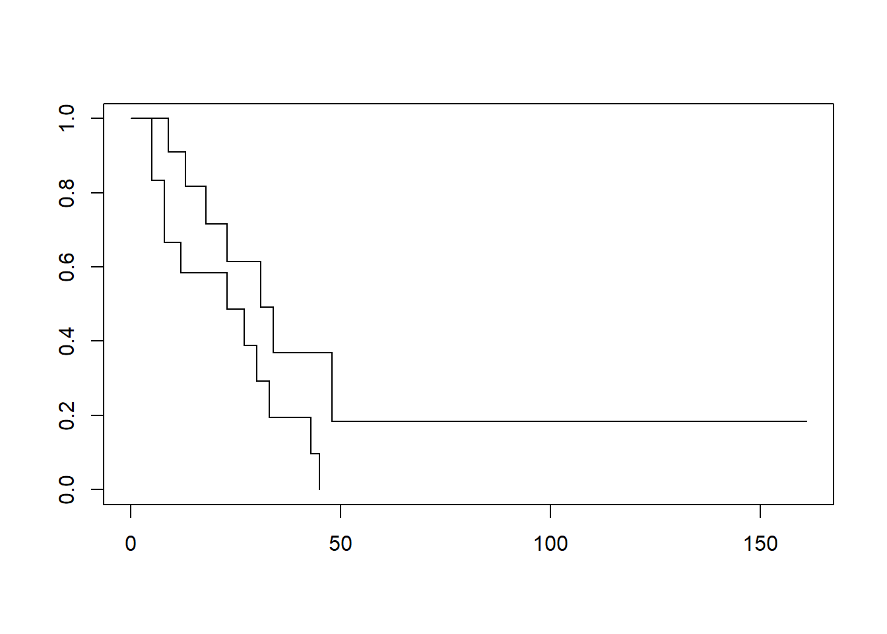

# Week 7

## Setting Up


```r
# Load packages
library(skimr)
library(gt)
library(gtsummary)
library(epiR)
library(broom)
library(pROC)
library(gmodels)
library(survival)
library(here)
library(tidyverse)

# Load data necessary to run Week 7 examples
example7a <- readRDS(here::here("Data", "Week 7", "example7a.rds"))
```

## R Instructions

### Introductory remarks on time-to-event analysis

In a typical study of a cancer drug, patients are entered on the study and then followed until death. When the data are analyzed, some patients will have died but others will still be alive. For instance, if John Doe entered the study on 4/1/2017 and died on 3/31/2019, we know that he survived exactly two years on the drug. However, if Jane Doe entered the study on 7/1/2018 and was still alive on 6/30/2019, when the study was closed for analysis, we know that she lived for more than one year, but not how much longer. We say that Jane Doe was "censored". 

When running statistical analyses, we cannot ignore the fact that Jane’s data point "1 year survival" is actually ">1 year survival". This means that, for instance, we couldn’t calculate the mean of Jane and Joe’s survival and say that average survival was 1.5 years. 

The approach used in time-to-event analysis is known as "cumulative probability". One way to think about this is the fairy tale about the brave knight who has to complete a series of challenges set by the king in order to win the hand of the princess in marriage. Imagine that he has to climb the wall of death, cross the valley of mists and slay the dragon. We might estimate the probability that he will die on each task as, respectively, 20%, 10% and 30%. In other words, he has an 80% chance of climbing the wall of death, a 90% chance of getting across the valley of mists and a 70% chance of slaying the dragon. To calculate the probability that he lives to marry the princess, we multiply those probabilities together to get 80% × 90% × 70% = 50%. 

Now let’s apply that to a cancer study. As a simple example, imagine that there are 10 patients and that one dies every month. After four months, four patients have died and so the probability of survival at four months is, obviously, 60%. But let’s think about that using the same methods as we did for the fairy tale. There were 10 patients at the start of the trial, and one died at the end of the first month. Hence the chance of surviving the first month is 90%. Nine patients were alive at the start of the second month and 8 survived till the end of the month, giving a probability of surviving the second month as 8 ÷ 9 = 88.89%. We can do similar calculations for month 3 (7 ÷ 8 = 87.50%) and month 4 (6 ÷ 7 = 85.71%). If we multiply those probabilities together, we get 90% × 88.89% × 87.50% × 85.71% = 60% survival probability, exactly what we would expect. 

However, let's imagine that the research assistant comes back to us, saying that there has been a miscommunication. The patient who was said to have died after two months actually went back to her home country and we don’t know anything more about her, so she didn’t die, she was censored. Let’s do the calculation again. The first month is unchanged: 9 out of 10 = 90% survival rate. Nine patients were alive at the start of the second month and all were alive at the end of the month, a 100% survival rate. At the start of the third month, we only have 8 patients (10 minus 1 who died and 1 who was censored), so the probability of surviving month 3 is 7 ÷ 8 = 87.5% and the probability of surviving month 4 is 6 ÷ 7 = 85.71%. Now when we multiply 90% × 100% × 87.50% × 85.71% we get 67.5%. Now let’s imagine that the woman is actually found to be still alive, 8 months in. We now calculate the 4 months probability as 90% for month 1, 100% for month 2 (there were no deaths), 8 ÷ 9 = 88.89% for month 3 and 7 ÷ 8 = 87.50% for months 4, a survival probability of 90% × 100% × 88.89% × 87.50% = 70%. 

Here are some key takeaways. 

1)	Time-to-event analysis is all about probabilities. Note that 3 patients died in both the second and third example, but it would be unsound to say "Of the ten patients that entered the trial, 3 (30%) died". You would need to say instead, "Three patients died. The probability of survival at four months was 67.5% / 70%" for example 2 / 3. 
2)	Survival probabilities don’t change until there is a death. In example 2, for instance, there is a 100% chance of surviving the second month, so the survival probabilities at month 1 and 2 are the same. This is why survival curves look like "steps", with the curve being flat (for periods when there are no deaths) and then a step down (when a death occurs). 
3)	We don’t always have death as an endpoint. It could be cancer progression, change in treatment or in fact anything that takes place over time (in engineering studies, for instance, we look at time to failure of a machine part). So the usual terminology is to talk about “time to event” and the number of "events" rather than "survival" analysis. 

### Time to event data

You need at least two variables to describe a time to event dataset: how long the patients were followed (the time variable), and whether they had the event (e.g. were alive or dead) at last observation (the failure variable). The failure variable is coded 1 if the patient had the event (e.g. died, had a recurrence) and 0 otherwise. You can have any other variables (patient codes, stage of cancer, treatment, hair color etc) but these are not essential.

You first have to tell R that you are dealing with a survival dataset. The function used is the `Surv` function from the `survival` package. The function is of the form `Surv(t, d)` where "t" is the time variable and "d" is the "failure" variable (e.g. died if 1, alive at last follow-up if 0). You can save out this survival object, but note that if you go and change any data, you have to re-run the `Surv` function so it utilizes the new data.


```r
# Create the survival object
# "t" is time in months
# "d" is survival status (0 = alive, 1 = dead)
example7a_surv <- Surv(example7a$t, example7a$d)
```

The `survfit` function (also from the `survival`) package describes the survival data. It is common to report the median survival.


```r
# Calculate descriptive statistics on time to event data
# The "~ 1" indicates that we want survival estimates for the entire group
survfit(example7a_surv ~ 1)
```

```
## Call: survfit(formula = example7a_surv ~ 1)
## 
##       n  events  median 0.95LCL 0.95UCL 
##      23      18      27      18      45
```

You often also report the median time of follow-up for survivors, which can easily be calculated manually.


```r
# Calculate median followup for survivors only
example7a %>%
  filter(d == 0) %>% # Keep only the surviving patients
  skim(t) # Remember, "p50" indicates the median
```

```
## Skim summary statistics
##  n obs: 5 
##  n variables: 6 
## 
## -- Variable type:numeric -----------------------------------------------------------------------------------
##  variable missing complete n mean    sd p0 p25 p50 p75 p100     hist
##         t       0        5 5 52.6 61.89 13  16  28  45  161 ▇▂▁▁▁▁▁▂
```

You can also plot the survival curve by adding the `plot` function around your `survfit` function:


```r
# Plot survival curve
plot(survfit(example7a_surv ~ 1))
```


Use "~ covariate" instead of "~ 1" to plot survival curves by group:


```r
# Plot survival curve by group (drug vs no drug)
# "~ drug" indicates to plot by "drug", vs "~ 1" which plots for all patients
plot(survfit(example7a_surv ~ drug, data = example7a))
```



As you may notice, this graph shows both lines in black, which makes it difficult to determine which line corresponds to which group. However, you can add color to the lines to differentiate them. The order of the colors corresponds to the order of the variable values - in this case, drug is "0" and "1", so the following code creates a graph where the placebo group (drug = 0) is plotted in blue and the drug group (drug = 1) is plotted in red.


```r
# Plot survival curve by group (drug vs no drug) with colors
plot(survfit(example7a_surv ~ drug, data = example7a), col = c("blue", "red"))
```


Graphs can be saved out by using the "Export" option at the top of the "Plots" tab.

The `survdiff` function compares survival for different groups. For example, the following code compares survival for each value of the variable "drug" (generally 0 and 1).


```r
# Compare survival between drug groups
survdiff(example7a_surv ~ drug, data = example7a)
```

```
## Call:
## survdiff(formula = example7a_surv ~ drug, data = example7a)
## 
##         N Observed Expected (O-E)^2/E (O-E)^2/V
## drug=0 12       11     7.31      1.86       3.4
## drug=1 11        7    10.69      1.27       3.4
## 
##  Chisq= 3.4  on 1 degrees of freedom, p= 0.07
```

Using the `summary` function with `survfit` lists all available followup times along with survival probabilities (you get a 95% C.I. as well):


```r
# Survival probabilities for the entire cohort
summary(survfit(example7a_surv ~ 1, data = example7a))
```

```
## Call: survfit(formula = example7a_surv ~ 1, data = example7a)
## 
##  time n.risk n.event survival std.err lower 95% CI upper 95% CI
##     5     23       2   0.9130  0.0588       0.8049        1.000
##     8     21       2   0.8261  0.0790       0.6848        0.996
##     9     19       1   0.7826  0.0860       0.6310        0.971
##    12     18       1   0.7391  0.0916       0.5798        0.942
##    13     17       1   0.6957  0.0959       0.5309        0.912
##    18     14       1   0.6460  0.1011       0.4753        0.878
##    23     13       2   0.5466  0.1073       0.3721        0.803
##    27     11       1   0.4969  0.1084       0.3240        0.762
##    30      9       1   0.4417  0.1095       0.2717        0.718
##    31      8       1   0.3865  0.1089       0.2225        0.671
##    33      7       1   0.3313  0.1064       0.1765        0.622
##    34      6       1   0.2761  0.1020       0.1338        0.569
##    43      5       1   0.2208  0.0954       0.0947        0.515
##    45      4       1   0.1656  0.0860       0.0598        0.458
##    48      2       1   0.0828  0.0727       0.0148        0.462
```

```r
# You can also summarize the survival by group:
summary(survfit(example7a_surv ~ drug, data = example7a))
```

```
## Call: survfit(formula = example7a_surv ~ drug, data = example7a)
## 
##                 drug=0 
##  time n.risk n.event survival std.err lower 95% CI upper 95% CI
##     5     12       2   0.8333  0.1076       0.6470        1.000
##     8     10       2   0.6667  0.1361       0.4468        0.995
##    12      8       1   0.5833  0.1423       0.3616        0.941
##    23      6       1   0.4861  0.1481       0.2675        0.883
##    27      5       1   0.3889  0.1470       0.1854        0.816
##    30      4       1   0.2917  0.1387       0.1148        0.741
##    33      3       1   0.1944  0.1219       0.0569        0.664
##    43      2       1   0.0972  0.0919       0.0153        0.620
##    45      1       1   0.0000     NaN           NA           NA
## 
##                 drug=1 
##  time n.risk n.event survival std.err lower 95% CI upper 95% CI
##     9     11       1    0.909  0.0867       0.7541        1.000
##    13     10       1    0.818  0.1163       0.6192        1.000
##    18      8       1    0.716  0.1397       0.4884        1.000
##    23      7       1    0.614  0.1526       0.3769        0.999
##    31      5       1    0.491  0.1642       0.2549        0.946
##    34      4       1    0.368  0.1627       0.1549        0.875
##    48      2       1    0.184  0.1535       0.0359        0.944
```

The `times` option allows you to get survival probabilities for specific timepoints. For example, at 1 year, 2 years and 5 years:


```r
# Get survival probabilities for specific time points in full dataset
# "~ 1" indicates all patients
# "t" variable is in months, so 12, 24 and 60 months used for 1, 2 and 5 years
summary(survfit(example7a_surv ~ 1, data = example7a), times = c(12, 24, 60))
```

```
## Call: survfit(formula = example7a_surv ~ 1, data = example7a)
## 
##  time n.risk n.event survival std.err lower 95% CI upper 95% CI
##    12     18       6   0.7391  0.0916       0.5798        0.942
##    24     11       4   0.5466  0.1073       0.3721        0.803
##    60      1       8   0.0828  0.0727       0.0148        0.462
```

The `coxph` function (from `survival`) is for regression analyses. For example, a univariate regression for the effects of "drug" on survival:


```r
# Create Cox regression model
coxph(example7a_surv ~ drug, data = example7a)
```

```
## Call:
## coxph(formula = example7a_surv ~ drug, data = example7a)
## 
##         coef exp(coef) se(coef)      z      p
## drug -0.9155    0.4003   0.5119 -1.788 0.0737
## 
## Likelihood ratio test=3.38  on 1 df, p=0.06581
## n= 23, number of events= 18
```

```r
# You can use the tbl_regression function with Cox models to see the hazard ratios
example7a_cox <- coxph(example7a_surv ~ drug, data = example7a)
tbl_regression(example7a_cox, exponentiate = TRUE)
```

<!--html_preserve--><style>html {
  font-family: -apple-system, BlinkMacSystemFont, 'Segoe UI', Roboto, Oxygen, Ubuntu, Cantarell, 'Helvetica Neue', 'Fira Sans', 'Droid Sans', Arial, sans-serif;
}

#iwrgxmosvm .gt_table {
  display: table;
  border-collapse: collapse;
  margin-left: auto;
  /* table.margin.left */
  margin-right: auto;
  /* table.margin.right */
  color: #333333;
  font-size: 16px;
  /* table.font.size */
  background-color: #FFFFFF;
  /* table.background.color */
  width: auto;
  /* table.width */
  border-top-style: solid;
  /* table.border.top.style */
  border-top-width: 2px;
  /* table.border.top.width */
  border-top-color: #A8A8A8;
  /* table.border.top.color */
  border-bottom-style: solid;
  /* table.border.bottom.style */
  border-bottom-width: 2px;
  /* table.border.bottom.width */
  border-bottom-color: #A8A8A8;
  /* table.border.bottom.color */
}

#iwrgxmosvm .gt_heading {
  background-color: #FFFFFF;
  /* heading.background.color */
  border-bottom-color: #FFFFFF;
  /* table.background.color */
  border-left-style: hidden;
  /* heading.border.lr.style */
  border-left-width: 1px;
  /* heading.border.lr.width */
  border-left-color: #D3D3D3;
  /* heading.border.lr.color */
  border-right-style: hidden;
  /* heading.border.lr.style */
  border-right-width: 1px;
  /* heading.border.lr.width */
  border-right-color: #D3D3D3;
  /* heading.border.lr.color */
}

#iwrgxmosvm .gt_title {
  color: #333333;
  font-size: 125%;
  /* heading.title.font.size */
  font-weight: initial;
  /* heading.title.font.weight */
  padding-top: 4px;
  /* heading.top.padding - not yet used */
  padding-bottom: 4px;
  border-bottom-color: #FFFFFF;
  /* table.background.color */
  border-bottom-width: 0;
}

#iwrgxmosvm .gt_subtitle {
  color: #333333;
  font-size: 85%;
  /* heading.subtitle.font.size */
  font-weight: initial;
  /* heading.subtitle.font.weight */
  padding-top: 0;
  padding-bottom: 4px;
  /* heading.bottom.padding - not yet used */
  border-top-color: #FFFFFF;
  /* table.background.color */
  border-top-width: 0;
}

#iwrgxmosvm .gt_bottom_border {
  border-bottom-style: solid;
  /* heading.border.bottom.style */
  border-bottom-width: 2px;
  /* heading.border.bottom.width */
  border-bottom-color: #D3D3D3;
  /* heading.border.bottom.color */
}

#iwrgxmosvm .gt_column_spanner {
  border-bottom-style: solid;
  border-bottom-width: 2px;
  border-bottom-color: #D3D3D3;
  padding-top: 4px;
  padding-bottom: 4px;
}

#iwrgxmosvm .gt_col_headings {
  border-top-style: solid;
  /* column_labels.border.top.style */
  border-top-width: 2px;
  /* column_labels.border.top.width */
  border-top-color: #D3D3D3;
  /* column_labels.border.top.color */
  border-bottom-style: solid;
  /* column_labels.border.bottom.style */
  border-bottom-width: 2px;
  /* column_labels.border.bottom.width */
  border-bottom-color: #D3D3D3;
  /* column_labels.border.bottom.color */
  border-left-style: none;
  /* column_labels.border.lr.style */
  border-left-width: 1px;
  /* column_labels.border.lr.width */
  border-left-color: #D3D3D3;
  /* column_labels.border.lr.color */
  border-right-style: none;
  /* column_labels.border.lr.style */
  border-right-width: 1px;
  /* column_labels.border.lr.width */
  border-right-color: #D3D3D3;
  /* column_labels.border.lr.color */
}

#iwrgxmosvm .gt_col_heading {
  color: #333333;
  background-color: #FFFFFF;
  /* column_labels.background.color */
  font-size: 100%;
  /* column_labels.font.size */
  font-weight: normal;
  /* column_labels.font.weight */
  text-transform: inherit;
  /* column_labels.text_transform */
  vertical-align: middle;
  padding: 5px;
  margin: 10px;
  overflow-x: hidden;
}

#iwrgxmosvm .gt_sep_right {
  border-right: 5px solid #FFFFFF;
}

#iwrgxmosvm .gt_group_heading {
  padding: 8px;
  /* row_group.padding */
  color: #333333;
  background-color: #FFFFFF;
  /* row_group.background.color */
  font-size: 100%;
  /* row_group.font.size */
  font-weight: initial;
  /* row_group.font.weight */
  text-transform: inherit;
  /* row_group.text_transform */
  border-top-style: solid;
  /* row_group.border.top.style */
  border-top-width: 2px;
  /* row_group.border.top.width */
  border-top-color: #D3D3D3;
  /* row_group.border.top.color */
  border-bottom-style: solid;
  /* row_group.border.bottom.style */
  border-bottom-width: 2px;
  /* row_group.border.bottom.width */
  border-bottom-color: #D3D3D3;
  /* row_group.border.bottom.color */
  border-left-style: none;
  /* row_group.border.left.style */
  border-left-width: 1px;
  /* row_group.border.left.width */
  border-left-color: #D3D3D3;
  /* row_group.border.left.color */
  border-right-style: none;
  /* row_group.border.right.style */
  border-right-width: 1px;
  /* row_group.border.right.width */
  border-right-color: #D3D3D3;
  /* row_group.border.right.color */
  vertical-align: middle;
}

#iwrgxmosvm .gt_empty_group_heading {
  padding: 0.5px;
  color: #333333;
  background-color: #FFFFFF;
  /* row_group.background.color */
  font-size: 100%;
  /* row_group.font.size */
  font-weight: initial;
  /* row_group.font.weight */
  border-top-style: solid;
  /* row_group.border.top.style */
  border-top-width: 2px;
  /* row_group.border.top.width */
  border-top-color: #D3D3D3;
  /* row_group.border.top.color */
  border-bottom-style: solid;
  /* row_group.border.bottom.style */
  border-bottom-width: 2px;
  /* row_group.border.bottom.width */
  border-bottom-color: #D3D3D3;
  /* row_group.border.bottom.color */
  vertical-align: middle;
}

#iwrgxmosvm .gt_striped {
  background-color: rgba(128, 128, 128, 0.05);
  /* row.striping.background_color */
}

#iwrgxmosvm .gt_from_md > :first-child {
  margin-top: 0;
}

#iwrgxmosvm .gt_from_md > :last-child {
  margin-bottom: 0;
}

#iwrgxmosvm .gt_row {
  padding-top: 8px;
  /* data_row.padding */
  padding-bottom: 8px;
  /* data_row.padding */
  padding-left: 5px;
  padding-right: 5px;
  margin: 10px;
  border-top-style: solid;
  /* table_body.hlines.style */
  border-top-width: 1px;
  /* table_body.hlines.width */
  border-top-color: #D3D3D3;
  /* table_body.hlines.color */
  border-left-style: none;
  /* table_body.vlines.style */
  border-left-width: 1px;
  /* table_body.vlines.width */
  border-left-color: #D3D3D3;
  /* table_body.vlines.color */
  border-right-style: none;
  /* table_body.vlines.style */
  border-right-width: 1px;
  /* table_body.vlines.width */
  border-right-color: #D3D3D3;
  /* table_body.vlines.color */
  vertical-align: middle;
  overflow-x: hidden;
}

#iwrgxmosvm .gt_stub {
  color: #333333;
  background-color: #FFFFFF;
  /* stub.background.color */
  font-weight: initial;
  /* stub.font.weight */
  text-transform: inherit;
  /* stub.text_transform */
  border-right-style: solid;
  /* stub.border.style */
  border-right-width: 2px;
  /* stub.border.width */
  border-right-color: #D3D3D3;
  /* stub.border.color */
  padding-left: 12px;
}

#iwrgxmosvm .gt_summary_row {
  color: #333333;
  background-color: #FFFFFF;
  /* summary_row.background.color */
  text-transform: inherit;
  /* summary_row.text_transform */
  padding-top: 8px;
  /* summary_row.padding */
  padding-bottom: 8px;
  /* summary_row.padding */
  padding-left: 5px;
  padding-right: 5px;
}

#iwrgxmosvm .gt_first_summary_row {
  padding-top: 8px;
  /* summary_row.padding */
  padding-bottom: 8px;
  /* summary_row.padding */
  padding-left: 5px;
  padding-right: 5px;
  border-top-style: solid;
  /* summary_row.border.style */
  border-top-width: 2px;
  /* summary_row.border.width */
  border-top-color: #D3D3D3;
  /* summary_row.border.color */
}

#iwrgxmosvm .gt_grand_summary_row {
  color: #333333;
  background-color: #FFFFFF;
  /* grand_summary_row.background.color */
  text-transform: inherit;
  /* grand_summary_row.text_transform */
  padding-top: 8px;
  /* grand_summary_row.padding */
  padding-bottom: 8px;
  /* grand_summary_row.padding */
  padding-left: 5px;
  padding-right: 5px;
}

#iwrgxmosvm .gt_first_grand_summary_row {
  padding-top: 8px;
  /* grand_summary_row.padding */
  padding-bottom: 8px;
  /* grand_summary_row.padding */
  padding-left: 5px;
  padding-right: 5px;
  border-top-style: double;
  /* grand_summary_row.border.style */
  border-top-width: 6px;
  /* grand_summary_row.border.width */
  border-top-color: #D3D3D3;
  /* grand_summary_row.border.color */
}

#iwrgxmosvm .gt_table_body {
  border-top-style: solid;
  /* table_body.border.top.style */
  border-top-width: 2px;
  /* table_body.border.top.width */
  border-top-color: #D3D3D3;
  /* table_body.border.top.color */
  border-bottom-style: solid;
  /* table_body.border.bottom.style */
  border-bottom-width: 2px;
  /* table_body.border.bottom.width */
  border-bottom-color: #D3D3D3;
  /* table_body.border.bottom.color */
}

#iwrgxmosvm .gt_footnotes {
  color: #333333;
  background-color: #FFFFFF;
  /* footnotes.background.color */
  border-bottom-style: none;
  /* footnotes.border.bottom.style */
  border-bottom-width: 2px;
  /* footnotes.border.bottom.width */
  border-bottom-color: #D3D3D3;
  /* footnotes.border.bottom.color */
  border-left-style: none;
  /* footnotes.border.lr.color */
  border-left-width: 2px;
  /* footnotes.border.lr.color */
  border-left-color: #D3D3D3;
  /* footnotes.border.lr.color */
  border-right-style: none;
  /* footnotes.border.lr.color */
  border-right-width: 2px;
  /* footnotes.border.lr.color */
  border-right-color: #D3D3D3;
  /* footnotes.border.lr.color */
}

#iwrgxmosvm .gt_footnote {
  margin: 0px;
  font-size: 90%;
  /* footnotes.font.size */
  padding: 4px;
  /* footnotes.padding */
}

#iwrgxmosvm .gt_sourcenotes {
  color: #333333;
  background-color: #FFFFFF;
  /* source_notes.background.color */
  border-bottom-style: none;
  /* source_notes.border.bottom.style */
  border-bottom-width: 2px;
  /* source_notes.border.bottom.width */
  border-bottom-color: #D3D3D3;
  /* source_notes.border.bottom.color */
  border-left-style: none;
  /* source_notes.border.lr.style */
  border-left-width: 2px;
  /* source_notes.border.lr.style */
  border-left-color: #D3D3D3;
  /* source_notes.border.lr.style */
  border-right-style: none;
  /* source_notes.border.lr.style */
  border-right-width: 2px;
  /* source_notes.border.lr.style */
  border-right-color: #D3D3D3;
  /* source_notes.border.lr.style */
}

#iwrgxmosvm .gt_sourcenote {
  font-size: 90%;
  /* source_notes.font.size */
  padding: 4px;
  /* source_notes.padding */
}

#iwrgxmosvm .gt_left {
  text-align: left;
}

#iwrgxmosvm .gt_center {
  text-align: center;
}

#iwrgxmosvm .gt_right {
  text-align: right;
  font-variant-numeric: tabular-nums;
}

#iwrgxmosvm .gt_font_normal {
  font-weight: normal;
}

#iwrgxmosvm .gt_font_bold {
  font-weight: bold;
}

#iwrgxmosvm .gt_font_italic {
  font-style: italic;
}

#iwrgxmosvm .gt_super {
  font-size: 65%;
}

#iwrgxmosvm .gt_footnote_marks {
  font-style: italic;
  font-size: 65%;
}
</style>
<div id="iwrgxmosvm" style="overflow-x:auto;overflow-y:auto;width:auto;height:auto;"><table class="gt_table">
  
  <thead class="gt_col_headings">
    <tr>
      <th class="gt_col_heading gt_columns_bottom_border gt_left" rowspan="1" colspan="1"><strong>Characteristic</strong></th>
      <th class="gt_col_heading gt_columns_bottom_border gt_center" rowspan="1" colspan="1"><strong>HR</strong><sup class="gt_footnote_marks">1</sup></th>
      <th class="gt_col_heading gt_columns_bottom_border gt_center" rowspan="1" colspan="1"><strong>95% CI</strong><sup class="gt_footnote_marks">1</sup></th>
      <th class="gt_col_heading gt_columns_bottom_border gt_center" rowspan="1" colspan="1"><strong>p-value</strong></th>
    </tr>
  </thead>
  <tbody class="gt_table_body">
    <tr>
      <td class="gt_row gt_left">drug</td>
      <td class="gt_row gt_center">0.40</td>
      <td class="gt_row gt_center">0.15, 1.09</td>
      <td class="gt_row gt_center">0.074</td>
    </tr>
  </tbody>
  
  <tfoot>
    <tr class="gt_footnotes">
      <td colspan="4">
        <p class="gt_footnote">
          <sup class="gt_footnote_marks">
            <em>1</em>
          </sup>
           
          HR = Hazard Ratio, CI = Confidence Interval
          <br />
        </p>
      </td>
    </tr>
  </tfoot>
</table></div><!--/html_preserve-->

The following multivariable model also includes some demographic and medical characteristics:


```r
# Create multivariable Cox regression model
# You can use the pipe operator (%>%) to show the tbl_regression table directly
# without storing the Cox model
coxph(example7a_surv ~ drug + age + sex + marker, data = example7a) %>%
  tbl_regression(exponentiate = TRUE)
```

<!--html_preserve--><style>html {
  font-family: -apple-system, BlinkMacSystemFont, 'Segoe UI', Roboto, Oxygen, Ubuntu, Cantarell, 'Helvetica Neue', 'Fira Sans', 'Droid Sans', Arial, sans-serif;
}

#hlleqxdave .gt_table {
  display: table;
  border-collapse: collapse;
  margin-left: auto;
  /* table.margin.left */
  margin-right: auto;
  /* table.margin.right */
  color: #333333;
  font-size: 16px;
  /* table.font.size */
  background-color: #FFFFFF;
  /* table.background.color */
  width: auto;
  /* table.width */
  border-top-style: solid;
  /* table.border.top.style */
  border-top-width: 2px;
  /* table.border.top.width */
  border-top-color: #A8A8A8;
  /* table.border.top.color */
  border-bottom-style: solid;
  /* table.border.bottom.style */
  border-bottom-width: 2px;
  /* table.border.bottom.width */
  border-bottom-color: #A8A8A8;
  /* table.border.bottom.color */
}

#hlleqxdave .gt_heading {
  background-color: #FFFFFF;
  /* heading.background.color */
  border-bottom-color: #FFFFFF;
  /* table.background.color */
  border-left-style: hidden;
  /* heading.border.lr.style */
  border-left-width: 1px;
  /* heading.border.lr.width */
  border-left-color: #D3D3D3;
  /* heading.border.lr.color */
  border-right-style: hidden;
  /* heading.border.lr.style */
  border-right-width: 1px;
  /* heading.border.lr.width */
  border-right-color: #D3D3D3;
  /* heading.border.lr.color */
}

#hlleqxdave .gt_title {
  color: #333333;
  font-size: 125%;
  /* heading.title.font.size */
  font-weight: initial;
  /* heading.title.font.weight */
  padding-top: 4px;
  /* heading.top.padding - not yet used */
  padding-bottom: 4px;
  border-bottom-color: #FFFFFF;
  /* table.background.color */
  border-bottom-width: 0;
}

#hlleqxdave .gt_subtitle {
  color: #333333;
  font-size: 85%;
  /* heading.subtitle.font.size */
  font-weight: initial;
  /* heading.subtitle.font.weight */
  padding-top: 0;
  padding-bottom: 4px;
  /* heading.bottom.padding - not yet used */
  border-top-color: #FFFFFF;
  /* table.background.color */
  border-top-width: 0;
}

#hlleqxdave .gt_bottom_border {
  border-bottom-style: solid;
  /* heading.border.bottom.style */
  border-bottom-width: 2px;
  /* heading.border.bottom.width */
  border-bottom-color: #D3D3D3;
  /* heading.border.bottom.color */
}

#hlleqxdave .gt_column_spanner {
  border-bottom-style: solid;
  border-bottom-width: 2px;
  border-bottom-color: #D3D3D3;
  padding-top: 4px;
  padding-bottom: 4px;
}

#hlleqxdave .gt_col_headings {
  border-top-style: solid;
  /* column_labels.border.top.style */
  border-top-width: 2px;
  /* column_labels.border.top.width */
  border-top-color: #D3D3D3;
  /* column_labels.border.top.color */
  border-bottom-style: solid;
  /* column_labels.border.bottom.style */
  border-bottom-width: 2px;
  /* column_labels.border.bottom.width */
  border-bottom-color: #D3D3D3;
  /* column_labels.border.bottom.color */
  border-left-style: none;
  /* column_labels.border.lr.style */
  border-left-width: 1px;
  /* column_labels.border.lr.width */
  border-left-color: #D3D3D3;
  /* column_labels.border.lr.color */
  border-right-style: none;
  /* column_labels.border.lr.style */
  border-right-width: 1px;
  /* column_labels.border.lr.width */
  border-right-color: #D3D3D3;
  /* column_labels.border.lr.color */
}

#hlleqxdave .gt_col_heading {
  color: #333333;
  background-color: #FFFFFF;
  /* column_labels.background.color */
  font-size: 100%;
  /* column_labels.font.size */
  font-weight: normal;
  /* column_labels.font.weight */
  text-transform: inherit;
  /* column_labels.text_transform */
  vertical-align: middle;
  padding: 5px;
  margin: 10px;
  overflow-x: hidden;
}

#hlleqxdave .gt_sep_right {
  border-right: 5px solid #FFFFFF;
}

#hlleqxdave .gt_group_heading {
  padding: 8px;
  /* row_group.padding */
  color: #333333;
  background-color: #FFFFFF;
  /* row_group.background.color */
  font-size: 100%;
  /* row_group.font.size */
  font-weight: initial;
  /* row_group.font.weight */
  text-transform: inherit;
  /* row_group.text_transform */
  border-top-style: solid;
  /* row_group.border.top.style */
  border-top-width: 2px;
  /* row_group.border.top.width */
  border-top-color: #D3D3D3;
  /* row_group.border.top.color */
  border-bottom-style: solid;
  /* row_group.border.bottom.style */
  border-bottom-width: 2px;
  /* row_group.border.bottom.width */
  border-bottom-color: #D3D3D3;
  /* row_group.border.bottom.color */
  border-left-style: none;
  /* row_group.border.left.style */
  border-left-width: 1px;
  /* row_group.border.left.width */
  border-left-color: #D3D3D3;
  /* row_group.border.left.color */
  border-right-style: none;
  /* row_group.border.right.style */
  border-right-width: 1px;
  /* row_group.border.right.width */
  border-right-color: #D3D3D3;
  /* row_group.border.right.color */
  vertical-align: middle;
}

#hlleqxdave .gt_empty_group_heading {
  padding: 0.5px;
  color: #333333;
  background-color: #FFFFFF;
  /* row_group.background.color */
  font-size: 100%;
  /* row_group.font.size */
  font-weight: initial;
  /* row_group.font.weight */
  border-top-style: solid;
  /* row_group.border.top.style */
  border-top-width: 2px;
  /* row_group.border.top.width */
  border-top-color: #D3D3D3;
  /* row_group.border.top.color */
  border-bottom-style: solid;
  /* row_group.border.bottom.style */
  border-bottom-width: 2px;
  /* row_group.border.bottom.width */
  border-bottom-color: #D3D3D3;
  /* row_group.border.bottom.color */
  vertical-align: middle;
}

#hlleqxdave .gt_striped {
  background-color: rgba(128, 128, 128, 0.05);
  /* row.striping.background_color */
}

#hlleqxdave .gt_from_md > :first-child {
  margin-top: 0;
}

#hlleqxdave .gt_from_md > :last-child {
  margin-bottom: 0;
}

#hlleqxdave .gt_row {
  padding-top: 8px;
  /* data_row.padding */
  padding-bottom: 8px;
  /* data_row.padding */
  padding-left: 5px;
  padding-right: 5px;
  margin: 10px;
  border-top-style: solid;
  /* table_body.hlines.style */
  border-top-width: 1px;
  /* table_body.hlines.width */
  border-top-color: #D3D3D3;
  /* table_body.hlines.color */
  border-left-style: none;
  /* table_body.vlines.style */
  border-left-width: 1px;
  /* table_body.vlines.width */
  border-left-color: #D3D3D3;
  /* table_body.vlines.color */
  border-right-style: none;
  /* table_body.vlines.style */
  border-right-width: 1px;
  /* table_body.vlines.width */
  border-right-color: #D3D3D3;
  /* table_body.vlines.color */
  vertical-align: middle;
  overflow-x: hidden;
}

#hlleqxdave .gt_stub {
  color: #333333;
  background-color: #FFFFFF;
  /* stub.background.color */
  font-weight: initial;
  /* stub.font.weight */
  text-transform: inherit;
  /* stub.text_transform */
  border-right-style: solid;
  /* stub.border.style */
  border-right-width: 2px;
  /* stub.border.width */
  border-right-color: #D3D3D3;
  /* stub.border.color */
  padding-left: 12px;
}

#hlleqxdave .gt_summary_row {
  color: #333333;
  background-color: #FFFFFF;
  /* summary_row.background.color */
  text-transform: inherit;
  /* summary_row.text_transform */
  padding-top: 8px;
  /* summary_row.padding */
  padding-bottom: 8px;
  /* summary_row.padding */
  padding-left: 5px;
  padding-right: 5px;
}

#hlleqxdave .gt_first_summary_row {
  padding-top: 8px;
  /* summary_row.padding */
  padding-bottom: 8px;
  /* summary_row.padding */
  padding-left: 5px;
  padding-right: 5px;
  border-top-style: solid;
  /* summary_row.border.style */
  border-top-width: 2px;
  /* summary_row.border.width */
  border-top-color: #D3D3D3;
  /* summary_row.border.color */
}

#hlleqxdave .gt_grand_summary_row {
  color: #333333;
  background-color: #FFFFFF;
  /* grand_summary_row.background.color */
  text-transform: inherit;
  /* grand_summary_row.text_transform */
  padding-top: 8px;
  /* grand_summary_row.padding */
  padding-bottom: 8px;
  /* grand_summary_row.padding */
  padding-left: 5px;
  padding-right: 5px;
}

#hlleqxdave .gt_first_grand_summary_row {
  padding-top: 8px;
  /* grand_summary_row.padding */
  padding-bottom: 8px;
  /* grand_summary_row.padding */
  padding-left: 5px;
  padding-right: 5px;
  border-top-style: double;
  /* grand_summary_row.border.style */
  border-top-width: 6px;
  /* grand_summary_row.border.width */
  border-top-color: #D3D3D3;
  /* grand_summary_row.border.color */
}

#hlleqxdave .gt_table_body {
  border-top-style: solid;
  /* table_body.border.top.style */
  border-top-width: 2px;
  /* table_body.border.top.width */
  border-top-color: #D3D3D3;
  /* table_body.border.top.color */
  border-bottom-style: solid;
  /* table_body.border.bottom.style */
  border-bottom-width: 2px;
  /* table_body.border.bottom.width */
  border-bottom-color: #D3D3D3;
  /* table_body.border.bottom.color */
}

#hlleqxdave .gt_footnotes {
  color: #333333;
  background-color: #FFFFFF;
  /* footnotes.background.color */
  border-bottom-style: none;
  /* footnotes.border.bottom.style */
  border-bottom-width: 2px;
  /* footnotes.border.bottom.width */
  border-bottom-color: #D3D3D3;
  /* footnotes.border.bottom.color */
  border-left-style: none;
  /* footnotes.border.lr.color */
  border-left-width: 2px;
  /* footnotes.border.lr.color */
  border-left-color: #D3D3D3;
  /* footnotes.border.lr.color */
  border-right-style: none;
  /* footnotes.border.lr.color */
  border-right-width: 2px;
  /* footnotes.border.lr.color */
  border-right-color: #D3D3D3;
  /* footnotes.border.lr.color */
}

#hlleqxdave .gt_footnote {
  margin: 0px;
  font-size: 90%;
  /* footnotes.font.size */
  padding: 4px;
  /* footnotes.padding */
}

#hlleqxdave .gt_sourcenotes {
  color: #333333;
  background-color: #FFFFFF;
  /* source_notes.background.color */
  border-bottom-style: none;
  /* source_notes.border.bottom.style */
  border-bottom-width: 2px;
  /* source_notes.border.bottom.width */
  border-bottom-color: #D3D3D3;
  /* source_notes.border.bottom.color */
  border-left-style: none;
  /* source_notes.border.lr.style */
  border-left-width: 2px;
  /* source_notes.border.lr.style */
  border-left-color: #D3D3D3;
  /* source_notes.border.lr.style */
  border-right-style: none;
  /* source_notes.border.lr.style */
  border-right-width: 2px;
  /* source_notes.border.lr.style */
  border-right-color: #D3D3D3;
  /* source_notes.border.lr.style */
}

#hlleqxdave .gt_sourcenote {
  font-size: 90%;
  /* source_notes.font.size */
  padding: 4px;
  /* source_notes.padding */
}

#hlleqxdave .gt_left {
  text-align: left;
}

#hlleqxdave .gt_center {
  text-align: center;
}

#hlleqxdave .gt_right {
  text-align: right;
  font-variant-numeric: tabular-nums;
}

#hlleqxdave .gt_font_normal {
  font-weight: normal;
}

#hlleqxdave .gt_font_bold {
  font-weight: bold;
}

#hlleqxdave .gt_font_italic {
  font-style: italic;
}

#hlleqxdave .gt_super {
  font-size: 65%;
}

#hlleqxdave .gt_footnote_marks {
  font-style: italic;
  font-size: 65%;
}
</style>
<div id="hlleqxdave" style="overflow-x:auto;overflow-y:auto;width:auto;height:auto;"><table class="gt_table">
  
  <thead class="gt_col_headings">
    <tr>
      <th class="gt_col_heading gt_columns_bottom_border gt_left" rowspan="1" colspan="1"><strong>Characteristic</strong></th>
      <th class="gt_col_heading gt_columns_bottom_border gt_center" rowspan="1" colspan="1"><strong>HR</strong><sup class="gt_footnote_marks">1</sup></th>
      <th class="gt_col_heading gt_columns_bottom_border gt_center" rowspan="1" colspan="1"><strong>95% CI</strong><sup class="gt_footnote_marks">1</sup></th>
      <th class="gt_col_heading gt_columns_bottom_border gt_center" rowspan="1" colspan="1"><strong>p-value</strong></th>
    </tr>
  </thead>
  <tbody class="gt_table_body">
    <tr>
      <td class="gt_row gt_left">drug</td>
      <td class="gt_row gt_center">0.17</td>
      <td class="gt_row gt_center">0.05, 0.65</td>
      <td class="gt_row gt_center">0.010</td>
    </tr>
    <tr>
      <td class="gt_row gt_left gt_striped">age</td>
      <td class="gt_row gt_center gt_striped">1.01</td>
      <td class="gt_row gt_center gt_striped">0.97, 1.06</td>
      <td class="gt_row gt_center gt_striped">0.6</td>
    </tr>
    <tr>
      <td class="gt_row gt_left">sex</td>
      <td class="gt_row gt_center">2.76</td>
      <td class="gt_row gt_center">0.88, 8.65</td>
      <td class="gt_row gt_center">0.081</td>
    </tr>
    <tr>
      <td class="gt_row gt_left gt_striped">marker</td>
      <td class="gt_row gt_center gt_striped">0.45</td>
      <td class="gt_row gt_center gt_striped">0.19, 1.03</td>
      <td class="gt_row gt_center gt_striped">0.059</td>
    </tr>
  </tbody>
  
  <tfoot>
    <tr class="gt_footnotes">
      <td colspan="4">
        <p class="gt_footnote">
          <sup class="gt_footnote_marks">
            <em>1</em>
          </sup>
           
          HR = Hazard Ratio, CI = Confidence Interval
          <br />
        </p>
      </td>
    </tr>
  </tfoot>
</table></div><!--/html_preserve-->

So, some typical code to analyze a dataset:


```r
# Create your survival object, which indicates this is a time to event outcome
example7a_surv <- Surv(example7a$t, example7a$d)

# Get median survival and number of events for group
survfit(example7a_surv ~ 1)
```

```
## Call: survfit(formula = example7a_surv ~ 1)
## 
##       n  events  median 0.95LCL 0.95UCL 
##      23      18      27      18      45
```

```r
# Get median followup for survivors
example7a %>%
  filter(d == 0) %>%
  skim(t)
```

```
## Skim summary statistics
##  n obs: 5 
##  n variables: 6 
## 
## -- Variable type:numeric -----------------------------------------------------------------------------------
##  variable missing complete n mean    sd p0 p25 p50 p75 p100     hist
##         t       0        5 5 52.6 61.89 13  16  28  45  161 ▇▂▁▁▁▁▁▂
```

```r
# Show a graph
plot(survfit(example7a_surv ~ 1))
```


```r
# Look at predictors of survival
coxph(example7a_surv ~ drug + age + sex + marker, data = example7a) %>%
  tbl_regression(exponentiate = TRUE)
```

<!--html_preserve--><style>html {
  font-family: -apple-system, BlinkMacSystemFont, 'Segoe UI', Roboto, Oxygen, Ubuntu, Cantarell, 'Helvetica Neue', 'Fira Sans', 'Droid Sans', Arial, sans-serif;
}

#kqtxbhydst .gt_table {
  display: table;
  border-collapse: collapse;
  margin-left: auto;
  /* table.margin.left */
  margin-right: auto;
  /* table.margin.right */
  color: #333333;
  font-size: 16px;
  /* table.font.size */
  background-color: #FFFFFF;
  /* table.background.color */
  width: auto;
  /* table.width */
  border-top-style: solid;
  /* table.border.top.style */
  border-top-width: 2px;
  /* table.border.top.width */
  border-top-color: #A8A8A8;
  /* table.border.top.color */
  border-bottom-style: solid;
  /* table.border.bottom.style */
  border-bottom-width: 2px;
  /* table.border.bottom.width */
  border-bottom-color: #A8A8A8;
  /* table.border.bottom.color */
}

#kqtxbhydst .gt_heading {
  background-color: #FFFFFF;
  /* heading.background.color */
  border-bottom-color: #FFFFFF;
  /* table.background.color */
  border-left-style: hidden;
  /* heading.border.lr.style */
  border-left-width: 1px;
  /* heading.border.lr.width */
  border-left-color: #D3D3D3;
  /* heading.border.lr.color */
  border-right-style: hidden;
  /* heading.border.lr.style */
  border-right-width: 1px;
  /* heading.border.lr.width */
  border-right-color: #D3D3D3;
  /* heading.border.lr.color */
}

#kqtxbhydst .gt_title {
  color: #333333;
  font-size: 125%;
  /* heading.title.font.size */
  font-weight: initial;
  /* heading.title.font.weight */
  padding-top: 4px;
  /* heading.top.padding - not yet used */
  padding-bottom: 4px;
  border-bottom-color: #FFFFFF;
  /* table.background.color */
  border-bottom-width: 0;
}

#kqtxbhydst .gt_subtitle {
  color: #333333;
  font-size: 85%;
  /* heading.subtitle.font.size */
  font-weight: initial;
  /* heading.subtitle.font.weight */
  padding-top: 0;
  padding-bottom: 4px;
  /* heading.bottom.padding - not yet used */
  border-top-color: #FFFFFF;
  /* table.background.color */
  border-top-width: 0;
}

#kqtxbhydst .gt_bottom_border {
  border-bottom-style: solid;
  /* heading.border.bottom.style */
  border-bottom-width: 2px;
  /* heading.border.bottom.width */
  border-bottom-color: #D3D3D3;
  /* heading.border.bottom.color */
}

#kqtxbhydst .gt_column_spanner {
  border-bottom-style: solid;
  border-bottom-width: 2px;
  border-bottom-color: #D3D3D3;
  padding-top: 4px;
  padding-bottom: 4px;
}

#kqtxbhydst .gt_col_headings {
  border-top-style: solid;
  /* column_labels.border.top.style */
  border-top-width: 2px;
  /* column_labels.border.top.width */
  border-top-color: #D3D3D3;
  /* column_labels.border.top.color */
  border-bottom-style: solid;
  /* column_labels.border.bottom.style */
  border-bottom-width: 2px;
  /* column_labels.border.bottom.width */
  border-bottom-color: #D3D3D3;
  /* column_labels.border.bottom.color */
  border-left-style: none;
  /* column_labels.border.lr.style */
  border-left-width: 1px;
  /* column_labels.border.lr.width */
  border-left-color: #D3D3D3;
  /* column_labels.border.lr.color */
  border-right-style: none;
  /* column_labels.border.lr.style */
  border-right-width: 1px;
  /* column_labels.border.lr.width */
  border-right-color: #D3D3D3;
  /* column_labels.border.lr.color */
}

#kqtxbhydst .gt_col_heading {
  color: #333333;
  background-color: #FFFFFF;
  /* column_labels.background.color */
  font-size: 100%;
  /* column_labels.font.size */
  font-weight: normal;
  /* column_labels.font.weight */
  text-transform: inherit;
  /* column_labels.text_transform */
  vertical-align: middle;
  padding: 5px;
  margin: 10px;
  overflow-x: hidden;
}

#kqtxbhydst .gt_sep_right {
  border-right: 5px solid #FFFFFF;
}

#kqtxbhydst .gt_group_heading {
  padding: 8px;
  /* row_group.padding */
  color: #333333;
  background-color: #FFFFFF;
  /* row_group.background.color */
  font-size: 100%;
  /* row_group.font.size */
  font-weight: initial;
  /* row_group.font.weight */
  text-transform: inherit;
  /* row_group.text_transform */
  border-top-style: solid;
  /* row_group.border.top.style */
  border-top-width: 2px;
  /* row_group.border.top.width */
  border-top-color: #D3D3D3;
  /* row_group.border.top.color */
  border-bottom-style: solid;
  /* row_group.border.bottom.style */
  border-bottom-width: 2px;
  /* row_group.border.bottom.width */
  border-bottom-color: #D3D3D3;
  /* row_group.border.bottom.color */
  border-left-style: none;
  /* row_group.border.left.style */
  border-left-width: 1px;
  /* row_group.border.left.width */
  border-left-color: #D3D3D3;
  /* row_group.border.left.color */
  border-right-style: none;
  /* row_group.border.right.style */
  border-right-width: 1px;
  /* row_group.border.right.width */
  border-right-color: #D3D3D3;
  /* row_group.border.right.color */
  vertical-align: middle;
}

#kqtxbhydst .gt_empty_group_heading {
  padding: 0.5px;
  color: #333333;
  background-color: #FFFFFF;
  /* row_group.background.color */
  font-size: 100%;
  /* row_group.font.size */
  font-weight: initial;
  /* row_group.font.weight */
  border-top-style: solid;
  /* row_group.border.top.style */
  border-top-width: 2px;
  /* row_group.border.top.width */
  border-top-color: #D3D3D3;
  /* row_group.border.top.color */
  border-bottom-style: solid;
  /* row_group.border.bottom.style */
  border-bottom-width: 2px;
  /* row_group.border.bottom.width */
  border-bottom-color: #D3D3D3;
  /* row_group.border.bottom.color */
  vertical-align: middle;
}

#kqtxbhydst .gt_striped {
  background-color: rgba(128, 128, 128, 0.05);
  /* row.striping.background_color */
}

#kqtxbhydst .gt_from_md > :first-child {
  margin-top: 0;
}

#kqtxbhydst .gt_from_md > :last-child {
  margin-bottom: 0;
}

#kqtxbhydst .gt_row {
  padding-top: 8px;
  /* data_row.padding */
  padding-bottom: 8px;
  /* data_row.padding */
  padding-left: 5px;
  padding-right: 5px;
  margin: 10px;
  border-top-style: solid;
  /* table_body.hlines.style */
  border-top-width: 1px;
  /* table_body.hlines.width */
  border-top-color: #D3D3D3;
  /* table_body.hlines.color */
  border-left-style: none;
  /* table_body.vlines.style */
  border-left-width: 1px;
  /* table_body.vlines.width */
  border-left-color: #D3D3D3;
  /* table_body.vlines.color */
  border-right-style: none;
  /* table_body.vlines.style */
  border-right-width: 1px;
  /* table_body.vlines.width */
  border-right-color: #D3D3D3;
  /* table_body.vlines.color */
  vertical-align: middle;
  overflow-x: hidden;
}

#kqtxbhydst .gt_stub {
  color: #333333;
  background-color: #FFFFFF;
  /* stub.background.color */
  font-weight: initial;
  /* stub.font.weight */
  text-transform: inherit;
  /* stub.text_transform */
  border-right-style: solid;
  /* stub.border.style */
  border-right-width: 2px;
  /* stub.border.width */
  border-right-color: #D3D3D3;
  /* stub.border.color */
  padding-left: 12px;
}

#kqtxbhydst .gt_summary_row {
  color: #333333;
  background-color: #FFFFFF;
  /* summary_row.background.color */
  text-transform: inherit;
  /* summary_row.text_transform */
  padding-top: 8px;
  /* summary_row.padding */
  padding-bottom: 8px;
  /* summary_row.padding */
  padding-left: 5px;
  padding-right: 5px;
}

#kqtxbhydst .gt_first_summary_row {
  padding-top: 8px;
  /* summary_row.padding */
  padding-bottom: 8px;
  /* summary_row.padding */
  padding-left: 5px;
  padding-right: 5px;
  border-top-style: solid;
  /* summary_row.border.style */
  border-top-width: 2px;
  /* summary_row.border.width */
  border-top-color: #D3D3D3;
  /* summary_row.border.color */
}

#kqtxbhydst .gt_grand_summary_row {
  color: #333333;
  background-color: #FFFFFF;
  /* grand_summary_row.background.color */
  text-transform: inherit;
  /* grand_summary_row.text_transform */
  padding-top: 8px;
  /* grand_summary_row.padding */
  padding-bottom: 8px;
  /* grand_summary_row.padding */
  padding-left: 5px;
  padding-right: 5px;
}

#kqtxbhydst .gt_first_grand_summary_row {
  padding-top: 8px;
  /* grand_summary_row.padding */
  padding-bottom: 8px;
  /* grand_summary_row.padding */
  padding-left: 5px;
  padding-right: 5px;
  border-top-style: double;
  /* grand_summary_row.border.style */
  border-top-width: 6px;
  /* grand_summary_row.border.width */
  border-top-color: #D3D3D3;
  /* grand_summary_row.border.color */
}

#kqtxbhydst .gt_table_body {
  border-top-style: solid;
  /* table_body.border.top.style */
  border-top-width: 2px;
  /* table_body.border.top.width */
  border-top-color: #D3D3D3;
  /* table_body.border.top.color */
  border-bottom-style: solid;
  /* table_body.border.bottom.style */
  border-bottom-width: 2px;
  /* table_body.border.bottom.width */
  border-bottom-color: #D3D3D3;
  /* table_body.border.bottom.color */
}

#kqtxbhydst .gt_footnotes {
  color: #333333;
  background-color: #FFFFFF;
  /* footnotes.background.color */
  border-bottom-style: none;
  /* footnotes.border.bottom.style */
  border-bottom-width: 2px;
  /* footnotes.border.bottom.width */
  border-bottom-color: #D3D3D3;
  /* footnotes.border.bottom.color */
  border-left-style: none;
  /* footnotes.border.lr.color */
  border-left-width: 2px;
  /* footnotes.border.lr.color */
  border-left-color: #D3D3D3;
  /* footnotes.border.lr.color */
  border-right-style: none;
  /* footnotes.border.lr.color */
  border-right-width: 2px;
  /* footnotes.border.lr.color */
  border-right-color: #D3D3D3;
  /* footnotes.border.lr.color */
}

#kqtxbhydst .gt_footnote {
  margin: 0px;
  font-size: 90%;
  /* footnotes.font.size */
  padding: 4px;
  /* footnotes.padding */
}

#kqtxbhydst .gt_sourcenotes {
  color: #333333;
  background-color: #FFFFFF;
  /* source_notes.background.color */
  border-bottom-style: none;
  /* source_notes.border.bottom.style */
  border-bottom-width: 2px;
  /* source_notes.border.bottom.width */
  border-bottom-color: #D3D3D3;
  /* source_notes.border.bottom.color */
  border-left-style: none;
  /* source_notes.border.lr.style */
  border-left-width: 2px;
  /* source_notes.border.lr.style */
  border-left-color: #D3D3D3;
  /* source_notes.border.lr.style */
  border-right-style: none;
  /* source_notes.border.lr.style */
  border-right-width: 2px;
  /* source_notes.border.lr.style */
  border-right-color: #D3D3D3;
  /* source_notes.border.lr.style */
}

#kqtxbhydst .gt_sourcenote {
  font-size: 90%;
  /* source_notes.font.size */
  padding: 4px;
  /* source_notes.padding */
}

#kqtxbhydst .gt_left {
  text-align: left;
}

#kqtxbhydst .gt_center {
  text-align: center;
}

#kqtxbhydst .gt_right {
  text-align: right;
  font-variant-numeric: tabular-nums;
}

#kqtxbhydst .gt_font_normal {
  font-weight: normal;
}

#kqtxbhydst .gt_font_bold {
  font-weight: bold;
}

#kqtxbhydst .gt_font_italic {
  font-style: italic;
}

#kqtxbhydst .gt_super {
  font-size: 65%;
}

#kqtxbhydst .gt_footnote_marks {
  font-style: italic;
  font-size: 65%;
}
</style>
<div id="kqtxbhydst" style="overflow-x:auto;overflow-y:auto;width:auto;height:auto;"><table class="gt_table">
  
  <thead class="gt_col_headings">
    <tr>
      <th class="gt_col_heading gt_columns_bottom_border gt_left" rowspan="1" colspan="1"><strong>Characteristic</strong></th>
      <th class="gt_col_heading gt_columns_bottom_border gt_center" rowspan="1" colspan="1"><strong>HR</strong><sup class="gt_footnote_marks">1</sup></th>
      <th class="gt_col_heading gt_columns_bottom_border gt_center" rowspan="1" colspan="1"><strong>95% CI</strong><sup class="gt_footnote_marks">1</sup></th>
      <th class="gt_col_heading gt_columns_bottom_border gt_center" rowspan="1" colspan="1"><strong>p-value</strong></th>
    </tr>
  </thead>
  <tbody class="gt_table_body">
    <tr>
      <td class="gt_row gt_left">drug</td>
      <td class="gt_row gt_center">0.17</td>
      <td class="gt_row gt_center">0.05, 0.65</td>
      <td class="gt_row gt_center">0.010</td>
    </tr>
    <tr>
      <td class="gt_row gt_left gt_striped">age</td>
      <td class="gt_row gt_center gt_striped">1.01</td>
      <td class="gt_row gt_center gt_striped">0.97, 1.06</td>
      <td class="gt_row gt_center gt_striped">0.6</td>
    </tr>
    <tr>
      <td class="gt_row gt_left">sex</td>
      <td class="gt_row gt_center">2.76</td>
      <td class="gt_row gt_center">0.88, 8.65</td>
      <td class="gt_row gt_center">0.081</td>
    </tr>
    <tr>
      <td class="gt_row gt_left gt_striped">marker</td>
      <td class="gt_row gt_center gt_striped">0.45</td>
      <td class="gt_row gt_center gt_striped">0.19, 1.03</td>
      <td class="gt_row gt_center gt_striped">0.059</td>
    </tr>
  </tbody>
  
  <tfoot>
    <tr class="gt_footnotes">
      <td colspan="4">
        <p class="gt_footnote">
          <sup class="gt_footnote_marks">
            <em>1</em>
          </sup>
           
          HR = Hazard Ratio, CI = Confidence Interval
          <br />
        </p>
      </td>
    </tr>
  </tfoot>
</table></div><!--/html_preserve-->

## Assignments


```r
# Copy and paste this code to load the data for week 7 assignments
lesson7a <- readRDS(here::here("Data", "Week 7", "lesson7a.rds"))
lesson7b <- readRDS(here::here("Data", "Week 7", "lesson7b.rds"))
lesson7c <- readRDS(here::here("Data", "Week 7", "lesson7c.rds"))
lesson7d <- readRDS(here::here("Data", "Week 7", "lesson7d.rds"))
```

Try to do at least lesson7a and lesson7b.

- lesson7a.rds: This is a large set of data on patients receiving adjuvant therapy after surgery for colon cancer. Describe this dataset and determine which, if any, variables are prognostic in this patient group.

- lesson7b.rds: These are time to recurrence data on forty patients with biliary cancer treated at one of two hospitals, one of which treats a large number of cancer patients and one of which does not. Do patients treated at a “high volume” hospital have a longer time to recurrence?

- lesson7c.rds: These are data from a randomized trial comparing no treatment, levamisole (an immune stimulant) and levamisole combined with 5FU (a chemotherapy agent) and in the adjuvant treatment of colon cancer. Describe the dataset. What conclusions would you draw about the effectiveness of the different treatments?

- lesson7d.rds: More data on time to recurrence by hospital volume. Given this dataset, determine whether patients treated at a “high volume” hospital have a longer time to recurrence.
