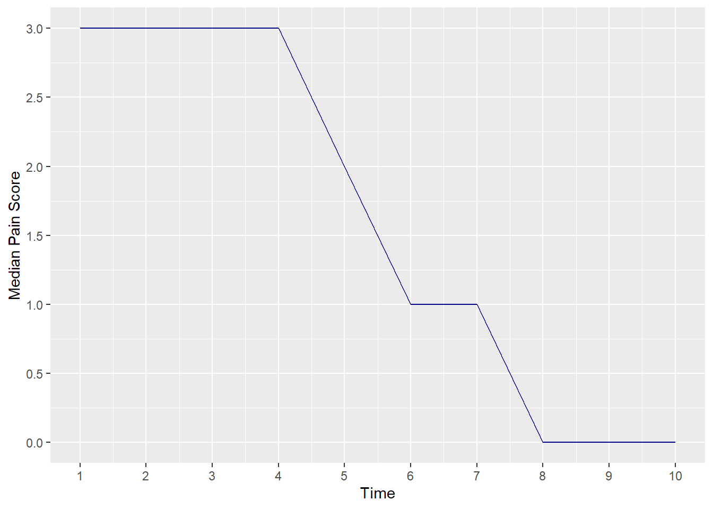
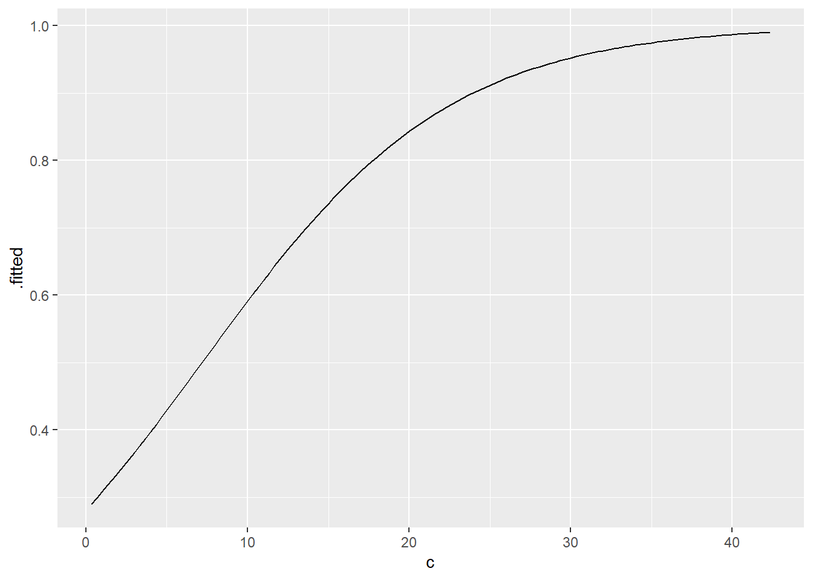
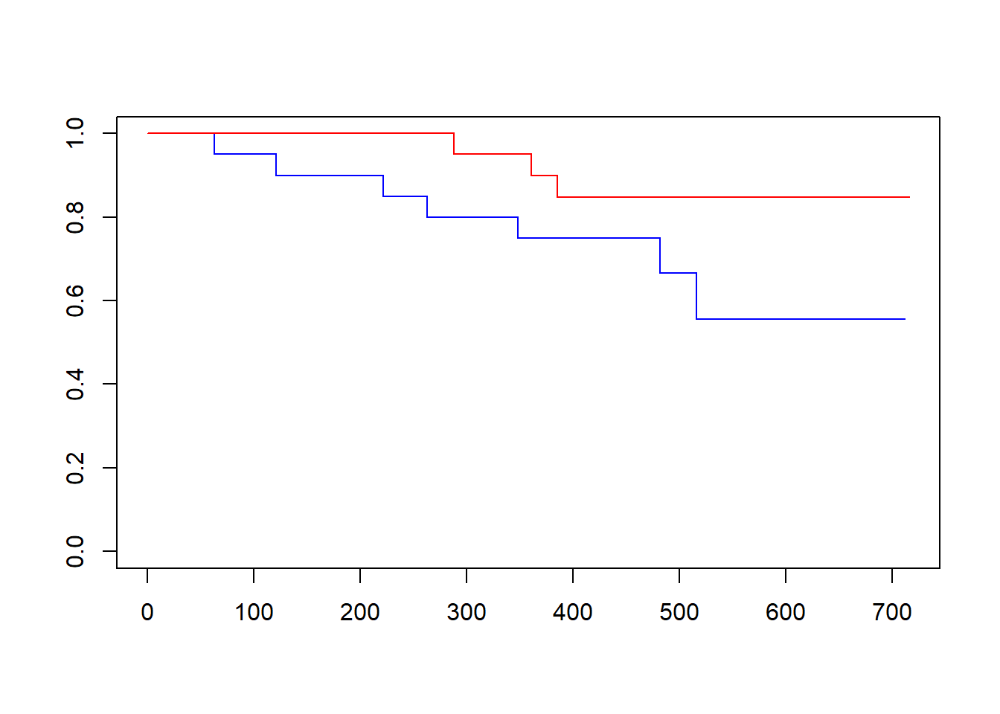
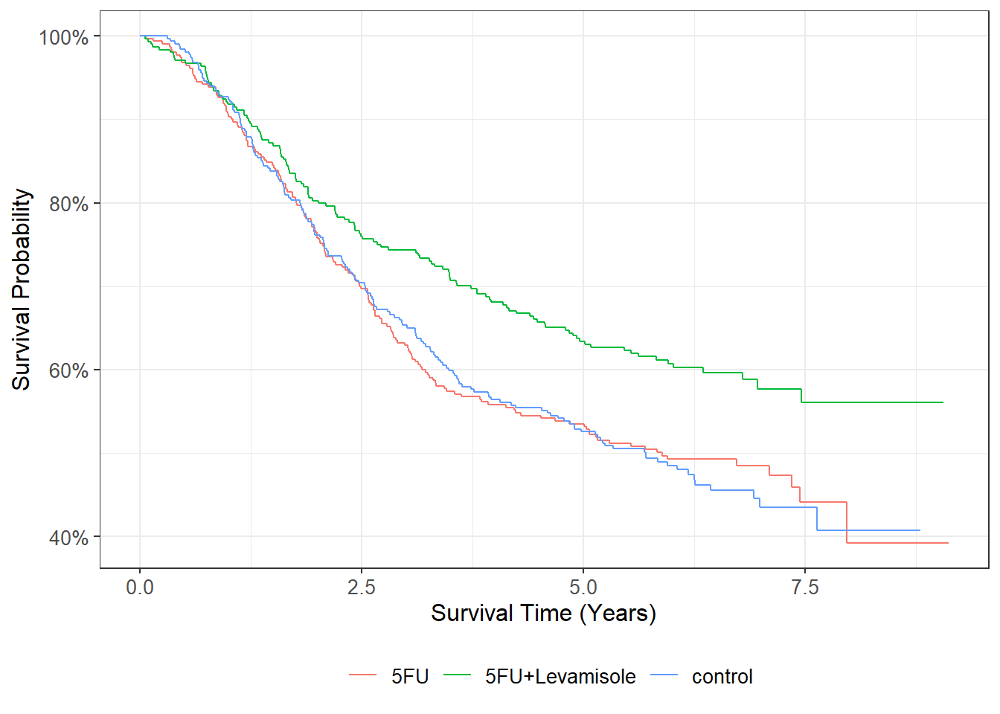

# Assignment Answers

## Week 1


```r
# Week 1: load packages
library(skimr)
library(gt)
library(gtsummary)
library(epiR)
library(broom)
library(pROC)
library(gmodels)
library(survival)
library(here)
library(tidyverse)

# Week 1: load data
lesson1a <- readRDS(here::here("Data", "Week 1", "lesson1a.rds"))
```

### lesson1a

**This is data for 386 patients undergoing surgery. What type of data (e.g. continuous, binary, ordinal, nonsense) are each of the variables?**

The dataset has 11 variables:

- "id" is clearly a hospital record number. It doesn’t matter what type of variable it is, because you only want to know the type of variable in order to summarize or analyze data, and you’d never want to analyze or summarize patient id.
- "sex" is a binary variable
- "age" is continuous
- "p1", "p2", "p3", "p4" are the pain scores after surgery. They only take integer values between 0 and 6. They would therefore typically regarded as categorical, and because they are clearly ordered (i.e. pain score of 6 is higher than one of 4) these variables can be described are ordinal. However, many statisticians, myself included, would think it perfectly reasonable to treat these variables as continuous. 
- "t": total pain score takes on values between 0 and 24 and can thus be considered continuous
- "x", "y" and "z": should you attempt to summarize a variable if you don’t know what it is? It is obvious for y, this is some kind of hospital location, and is a categorical variable. But what about x and z? As it happens, z looks ordinal but isn’t: it is blood group coded 1=o, 2=a, 3=b, 4=ab.

## Week 2


```r
# Week 2: load packages
library(skimr)
library(gt)
library(gtsummary)
library(epiR)
library(broom)
library(pROC)
library(gmodels)
library(survival)
library(here)
library(tidyverse)

# Week 2: load data
lesson2a <- readRDS(here::here("Data", "Week 2", "lesson2a.rds"))
lesson2b <- readRDS(here::here("Data", "Week 2", "lesson2b.rds"))
lesson2c <- readRDS(here::here("Data", "Week 2", "lesson2c.rds"))
lesson2d <- readRDS(here::here("Data", "Week 2", "lesson2d.rds"))
lesson2e <- readRDS(here::here("Data", "Week 2", "lesson2e.rds"))
```

### lesson2a

**This is data from marathon runners: summarize age, sex, race time in minutes (i.e. how long it took them to complete the race) and favorite running shoe.**

Age is continuous and normally distributed (look at a graph or look at the centiles) and so it wouldn’t be unreasonable to describe age in terms of mean and standard deviation (SD) by using `lesson2a %>% skim(age)`: mean of 42 years, SD of 10.2. By the way, don’t just copy the readout from R: this would give mean age as 42.43 and implies we are interested in age within a few days. 

Sex is binary: use `tbl_summary(lesson2a %>% select(sex))` to get percentages. But note that the person who prepared the data didn’t state how the variable was coded (someone with sex=1 is a woman or a man?). Now what you should do in this situation is ask, but here is another alternative:


```r
# Summary statistics for race time, separately by sex
lesson2a %>%
  group_by(sex) %>%
  skim(rt)
```


Table: (\#tab:week2a)Data summary

|                         |           |
|:------------------------|:----------|
|Name                     |Piped data |
|Number of rows           |98         |
|Number of columns        |6          |
|_______________________  |           |
|Column type frequency:   |           |
|numeric                  |1          |
|________________________ |           |
|Group variables          |sex        |


**Variable type: numeric**

|skim_variable | sex| n_missing| complete_rate|   mean|    sd|  p0|    p25|   p50|    p75| p100|hist  |
|:-------------|---:|---------:|-------------:|------:|-----:|---:|------:|-----:|------:|----:|:-----|
|rt            |   0|         0|             1| 243.23| 49.85| 158| 214.25| 236.0| 268.75|  414|▃▇▃▁▁ |
|rt            |   1|         0|             1| 264.84| 37.45| 222| 237.00| 251.5| 283.25|  362|▇▃▂▂▁ |

So sex==0 are running faster than the sex==1 and it would not be unreasonable to assume that sex==1 means women. 

Race time is continuous and looks pretty normal. Yes the data are skewed by a single outlier (a race time of 414 minutes) but the mean and median are pretty similar (250 v. 242 minutes) and the 5th and 95th centile are very close to the values expected by adding or subtracting 1.64 times the SD from the mean (5th centile is 176, expected value using means and SD is 173; 95th centile actual and expected values are 328 and 328). I would probably feel comfortable reporting a mean and SD if you wanted.

Favorite running shoe: `lesson2a %>% skim(shoe)` gives a mean of 3.08 and a median of 3. If you reported these, you need therapy: shoe is a categorical variable and you should report the percentage of runners that favor each shoe.

AN ADDITIONAL IMPORTANT POINT: you should give the number of observations and the number of missing observations. n is 98 for all observations except for favorite running shoe, where there are 95 observations and 3 missing observations.

So here is a model answer, suitable for publication (assuming that sex==1 is coded as female.)


```{=html}
<div id="iwrgxmosvm" style="padding-left:0px;padding-right:0px;padding-top:10px;padding-bottom:10px;overflow-x:auto;overflow-y:auto;width:auto;height:auto;">
<style>#iwrgxmosvm table {
  font-family: system-ui, 'Segoe UI', Roboto, Helvetica, Arial, sans-serif, 'Apple Color Emoji', 'Segoe UI Emoji', 'Segoe UI Symbol', 'Noto Color Emoji';
  -webkit-font-smoothing: antialiased;
  -moz-osx-font-smoothing: grayscale;
}

#iwrgxmosvm thead, #iwrgxmosvm tbody, #iwrgxmosvm tfoot, #iwrgxmosvm tr, #iwrgxmosvm td, #iwrgxmosvm th {
  border-style: none;
}

#iwrgxmosvm p {
  margin: 0;
  padding: 0;
}

#iwrgxmosvm .gt_table {
  display: table;
  border-collapse: collapse;
  line-height: normal;
  margin-left: auto;
  margin-right: auto;
  color: #333333;
  font-size: 16px;
  font-weight: normal;
  font-style: normal;
  background-color: #FFFFFF;
  width: auto;
  border-top-style: solid;
  border-top-width: 2px;
  border-top-color: #A8A8A8;
  border-right-style: none;
  border-right-width: 2px;
  border-right-color: #D3D3D3;
  border-bottom-style: solid;
  border-bottom-width: 2px;
  border-bottom-color: #A8A8A8;
  border-left-style: none;
  border-left-width: 2px;
  border-left-color: #D3D3D3;
}

#iwrgxmosvm .gt_caption {
  padding-top: 4px;
  padding-bottom: 4px;
}

#iwrgxmosvm .gt_title {
  color: #333333;
  font-size: 125%;
  font-weight: initial;
  padding-top: 4px;
  padding-bottom: 4px;
  padding-left: 5px;
  padding-right: 5px;
  border-bottom-color: #FFFFFF;
  border-bottom-width: 0;
}

#iwrgxmosvm .gt_subtitle {
  color: #333333;
  font-size: 85%;
  font-weight: initial;
  padding-top: 3px;
  padding-bottom: 5px;
  padding-left: 5px;
  padding-right: 5px;
  border-top-color: #FFFFFF;
  border-top-width: 0;
}

#iwrgxmosvm .gt_heading {
  background-color: #FFFFFF;
  text-align: center;
  border-bottom-color: #FFFFFF;
  border-left-style: none;
  border-left-width: 1px;
  border-left-color: #D3D3D3;
  border-right-style: none;
  border-right-width: 1px;
  border-right-color: #D3D3D3;
}

#iwrgxmosvm .gt_bottom_border {
  border-bottom-style: solid;
  border-bottom-width: 2px;
  border-bottom-color: #D3D3D3;
}

#iwrgxmosvm .gt_col_headings {
  border-top-style: solid;
  border-top-width: 2px;
  border-top-color: #D3D3D3;
  border-bottom-style: solid;
  border-bottom-width: 2px;
  border-bottom-color: #D3D3D3;
  border-left-style: none;
  border-left-width: 1px;
  border-left-color: #D3D3D3;
  border-right-style: none;
  border-right-width: 1px;
  border-right-color: #D3D3D3;
}

#iwrgxmosvm .gt_col_heading {
  color: #333333;
  background-color: #FFFFFF;
  font-size: 100%;
  font-weight: normal;
  text-transform: inherit;
  border-left-style: none;
  border-left-width: 1px;
  border-left-color: #D3D3D3;
  border-right-style: none;
  border-right-width: 1px;
  border-right-color: #D3D3D3;
  vertical-align: bottom;
  padding-top: 5px;
  padding-bottom: 6px;
  padding-left: 5px;
  padding-right: 5px;
  overflow-x: hidden;
}

#iwrgxmosvm .gt_column_spanner_outer {
  color: #333333;
  background-color: #FFFFFF;
  font-size: 100%;
  font-weight: normal;
  text-transform: inherit;
  padding-top: 0;
  padding-bottom: 0;
  padding-left: 4px;
  padding-right: 4px;
}

#iwrgxmosvm .gt_column_spanner_outer:first-child {
  padding-left: 0;
}

#iwrgxmosvm .gt_column_spanner_outer:last-child {
  padding-right: 0;
}

#iwrgxmosvm .gt_column_spanner {
  border-bottom-style: solid;
  border-bottom-width: 2px;
  border-bottom-color: #D3D3D3;
  vertical-align: bottom;
  padding-top: 5px;
  padding-bottom: 5px;
  overflow-x: hidden;
  display: inline-block;
  width: 100%;
}

#iwrgxmosvm .gt_spanner_row {
  border-bottom-style: hidden;
}

#iwrgxmosvm .gt_group_heading {
  padding-top: 8px;
  padding-bottom: 8px;
  padding-left: 5px;
  padding-right: 5px;
  color: #333333;
  background-color: #FFFFFF;
  font-size: 100%;
  font-weight: initial;
  text-transform: inherit;
  border-top-style: solid;
  border-top-width: 2px;
  border-top-color: #D3D3D3;
  border-bottom-style: solid;
  border-bottom-width: 2px;
  border-bottom-color: #D3D3D3;
  border-left-style: none;
  border-left-width: 1px;
  border-left-color: #D3D3D3;
  border-right-style: none;
  border-right-width: 1px;
  border-right-color: #D3D3D3;
  vertical-align: middle;
  text-align: left;
}

#iwrgxmosvm .gt_empty_group_heading {
  padding: 0.5px;
  color: #333333;
  background-color: #FFFFFF;
  font-size: 100%;
  font-weight: initial;
  border-top-style: solid;
  border-top-width: 2px;
  border-top-color: #D3D3D3;
  border-bottom-style: solid;
  border-bottom-width: 2px;
  border-bottom-color: #D3D3D3;
  vertical-align: middle;
}

#iwrgxmosvm .gt_from_md > :first-child {
  margin-top: 0;
}

#iwrgxmosvm .gt_from_md > :last-child {
  margin-bottom: 0;
}

#iwrgxmosvm .gt_row {
  padding-top: 8px;
  padding-bottom: 8px;
  padding-left: 5px;
  padding-right: 5px;
  margin: 10px;
  border-top-style: solid;
  border-top-width: 1px;
  border-top-color: #D3D3D3;
  border-left-style: none;
  border-left-width: 1px;
  border-left-color: #D3D3D3;
  border-right-style: none;
  border-right-width: 1px;
  border-right-color: #D3D3D3;
  vertical-align: middle;
  overflow-x: hidden;
}

#iwrgxmosvm .gt_stub {
  color: #333333;
  background-color: #FFFFFF;
  font-size: 100%;
  font-weight: initial;
  text-transform: inherit;
  border-right-style: solid;
  border-right-width: 2px;
  border-right-color: #D3D3D3;
  padding-left: 5px;
  padding-right: 5px;
}

#iwrgxmosvm .gt_stub_row_group {
  color: #333333;
  background-color: #FFFFFF;
  font-size: 100%;
  font-weight: initial;
  text-transform: inherit;
  border-right-style: solid;
  border-right-width: 2px;
  border-right-color: #D3D3D3;
  padding-left: 5px;
  padding-right: 5px;
  vertical-align: top;
}

#iwrgxmosvm .gt_row_group_first td {
  border-top-width: 2px;
}

#iwrgxmosvm .gt_row_group_first th {
  border-top-width: 2px;
}

#iwrgxmosvm .gt_summary_row {
  color: #333333;
  background-color: #FFFFFF;
  text-transform: inherit;
  padding-top: 8px;
  padding-bottom: 8px;
  padding-left: 5px;
  padding-right: 5px;
}

#iwrgxmosvm .gt_first_summary_row {
  border-top-style: solid;
  border-top-color: #D3D3D3;
}

#iwrgxmosvm .gt_first_summary_row.thick {
  border-top-width: 2px;
}

#iwrgxmosvm .gt_last_summary_row {
  padding-top: 8px;
  padding-bottom: 8px;
  padding-left: 5px;
  padding-right: 5px;
  border-bottom-style: solid;
  border-bottom-width: 2px;
  border-bottom-color: #D3D3D3;
}

#iwrgxmosvm .gt_grand_summary_row {
  color: #333333;
  background-color: #FFFFFF;
  text-transform: inherit;
  padding-top: 8px;
  padding-bottom: 8px;
  padding-left: 5px;
  padding-right: 5px;
}

#iwrgxmosvm .gt_first_grand_summary_row {
  padding-top: 8px;
  padding-bottom: 8px;
  padding-left: 5px;
  padding-right: 5px;
  border-top-style: double;
  border-top-width: 6px;
  border-top-color: #D3D3D3;
}

#iwrgxmosvm .gt_last_grand_summary_row_top {
  padding-top: 8px;
  padding-bottom: 8px;
  padding-left: 5px;
  padding-right: 5px;
  border-bottom-style: double;
  border-bottom-width: 6px;
  border-bottom-color: #D3D3D3;
}

#iwrgxmosvm .gt_striped {
  background-color: rgba(128, 128, 128, 0.05);
}

#iwrgxmosvm .gt_table_body {
  border-top-style: solid;
  border-top-width: 2px;
  border-top-color: #D3D3D3;
  border-bottom-style: solid;
  border-bottom-width: 2px;
  border-bottom-color: #D3D3D3;
}

#iwrgxmosvm .gt_footnotes {
  color: #333333;
  background-color: #FFFFFF;
  border-bottom-style: none;
  border-bottom-width: 2px;
  border-bottom-color: #D3D3D3;
  border-left-style: none;
  border-left-width: 2px;
  border-left-color: #D3D3D3;
  border-right-style: none;
  border-right-width: 2px;
  border-right-color: #D3D3D3;
}

#iwrgxmosvm .gt_footnote {
  margin: 0px;
  font-size: 90%;
  padding-top: 4px;
  padding-bottom: 4px;
  padding-left: 5px;
  padding-right: 5px;
}

#iwrgxmosvm .gt_sourcenotes {
  color: #333333;
  background-color: #FFFFFF;
  border-bottom-style: none;
  border-bottom-width: 2px;
  border-bottom-color: #D3D3D3;
  border-left-style: none;
  border-left-width: 2px;
  border-left-color: #D3D3D3;
  border-right-style: none;
  border-right-width: 2px;
  border-right-color: #D3D3D3;
}

#iwrgxmosvm .gt_sourcenote {
  font-size: 90%;
  padding-top: 4px;
  padding-bottom: 4px;
  padding-left: 5px;
  padding-right: 5px;
}

#iwrgxmosvm .gt_left {
  text-align: left;
}

#iwrgxmosvm .gt_center {
  text-align: center;
}

#iwrgxmosvm .gt_right {
  text-align: right;
  font-variant-numeric: tabular-nums;
}

#iwrgxmosvm .gt_font_normal {
  font-weight: normal;
}

#iwrgxmosvm .gt_font_bold {
  font-weight: bold;
}

#iwrgxmosvm .gt_font_italic {
  font-style: italic;
}

#iwrgxmosvm .gt_super {
  font-size: 65%;
}

#iwrgxmosvm .gt_footnote_marks {
  font-size: 75%;
  vertical-align: 0.4em;
  position: initial;
}

#iwrgxmosvm .gt_asterisk {
  font-size: 100%;
  vertical-align: 0;
}

#iwrgxmosvm .gt_indent_1 {
  text-indent: 5px;
}

#iwrgxmosvm .gt_indent_2 {
  text-indent: 10px;
}

#iwrgxmosvm .gt_indent_3 {
  text-indent: 15px;
}

#iwrgxmosvm .gt_indent_4 {
  text-indent: 20px;
}

#iwrgxmosvm .gt_indent_5 {
  text-indent: 25px;
}
</style>
<table class="gt_table" data-quarto-disable-processing="false" data-quarto-bootstrap="false">
  <thead>
    
    <tr class="gt_col_headings">
      <th class="gt_col_heading gt_columns_bottom_border gt_left" rowspan="1" colspan="1" scope="col" id="&lt;strong&gt;Characteristic&lt;/strong&gt;"><strong>Characteristic</strong></th>
      <th class="gt_col_heading gt_columns_bottom_border gt_center" rowspan="1" colspan="1" scope="col" id="&lt;strong&gt;N = 98&lt;/strong&gt;&lt;span class=&quot;gt_footnote_marks&quot; style=&quot;white-space:nowrap;font-style:italic;font-weight:normal;&quot;&gt;&lt;sup&gt;1&lt;/sup&gt;&lt;/span&gt;"><strong>N = 98</strong><span class="gt_footnote_marks" style="white-space:nowrap;font-style:italic;font-weight:normal;"><sup>1</sup></span></th>
    </tr>
  </thead>
  <tbody class="gt_table_body">
    <tr><td headers="label" class="gt_row gt_left">Age</td>
<td headers="stat_0" class="gt_row gt_center">42 (10)</td></tr>
    <tr><td headers="label" class="gt_row gt_left">Women</td>
<td headers="stat_0" class="gt_row gt_center">32 (33%)</td></tr>
    <tr><td headers="label" class="gt_row gt_left">Race time in minutes</td>
<td headers="stat_0" class="gt_row gt_center">250 (47)</td></tr>
    <tr><td headers="label" class="gt_row gt_left">Favorite Running Shoe</td>
<td headers="stat_0" class="gt_row gt_center"><br /></td></tr>
    <tr><td headers="label" class="gt_row gt_left">    Asics</td>
<td headers="stat_0" class="gt_row gt_center">14 (15%)</td></tr>
    <tr><td headers="label" class="gt_row gt_left">    New Balance</td>
<td headers="stat_0" class="gt_row gt_center">7 (7.4%)</td></tr>
    <tr><td headers="label" class="gt_row gt_left">    Nike</td>
<td headers="stat_0" class="gt_row gt_center">31 (33%)</td></tr>
    <tr><td headers="label" class="gt_row gt_left">    Saucony</td>
<td headers="stat_0" class="gt_row gt_center">43 (45%)</td></tr>
    <tr><td headers="label" class="gt_row gt_left">    Unknown</td>
<td headers="stat_0" class="gt_row gt_center">3</td></tr>
  </tbody>
  
  <tfoot class="gt_footnotes">
    <tr>
      <td class="gt_footnote" colspan="2"><span class="gt_footnote_marks" style="white-space:nowrap;font-style:italic;font-weight:normal;"><sup>1</sup></span> Mean (SD); n (%)</td>
    </tr>
  </tfoot>
</table>
</div>
```

However, look at this.


```{=html}
<div id="epqsnuprvj" style="padding-left:0px;padding-right:0px;padding-top:10px;padding-bottom:10px;overflow-x:auto;overflow-y:auto;width:auto;height:auto;">
<style>#epqsnuprvj table {
  font-family: system-ui, 'Segoe UI', Roboto, Helvetica, Arial, sans-serif, 'Apple Color Emoji', 'Segoe UI Emoji', 'Segoe UI Symbol', 'Noto Color Emoji';
  -webkit-font-smoothing: antialiased;
  -moz-osx-font-smoothing: grayscale;
}

#epqsnuprvj thead, #epqsnuprvj tbody, #epqsnuprvj tfoot, #epqsnuprvj tr, #epqsnuprvj td, #epqsnuprvj th {
  border-style: none;
}

#epqsnuprvj p {
  margin: 0;
  padding: 0;
}

#epqsnuprvj .gt_table {
  display: table;
  border-collapse: collapse;
  line-height: normal;
  margin-left: auto;
  margin-right: auto;
  color: #333333;
  font-size: 16px;
  font-weight: normal;
  font-style: normal;
  background-color: #FFFFFF;
  width: auto;
  border-top-style: solid;
  border-top-width: 2px;
  border-top-color: #A8A8A8;
  border-right-style: none;
  border-right-width: 2px;
  border-right-color: #D3D3D3;
  border-bottom-style: solid;
  border-bottom-width: 2px;
  border-bottom-color: #A8A8A8;
  border-left-style: none;
  border-left-width: 2px;
  border-left-color: #D3D3D3;
}

#epqsnuprvj .gt_caption {
  padding-top: 4px;
  padding-bottom: 4px;
}

#epqsnuprvj .gt_title {
  color: #333333;
  font-size: 125%;
  font-weight: initial;
  padding-top: 4px;
  padding-bottom: 4px;
  padding-left: 5px;
  padding-right: 5px;
  border-bottom-color: #FFFFFF;
  border-bottom-width: 0;
}

#epqsnuprvj .gt_subtitle {
  color: #333333;
  font-size: 85%;
  font-weight: initial;
  padding-top: 3px;
  padding-bottom: 5px;
  padding-left: 5px;
  padding-right: 5px;
  border-top-color: #FFFFFF;
  border-top-width: 0;
}

#epqsnuprvj .gt_heading {
  background-color: #FFFFFF;
  text-align: center;
  border-bottom-color: #FFFFFF;
  border-left-style: none;
  border-left-width: 1px;
  border-left-color: #D3D3D3;
  border-right-style: none;
  border-right-width: 1px;
  border-right-color: #D3D3D3;
}

#epqsnuprvj .gt_bottom_border {
  border-bottom-style: solid;
  border-bottom-width: 2px;
  border-bottom-color: #D3D3D3;
}

#epqsnuprvj .gt_col_headings {
  border-top-style: solid;
  border-top-width: 2px;
  border-top-color: #D3D3D3;
  border-bottom-style: solid;
  border-bottom-width: 2px;
  border-bottom-color: #D3D3D3;
  border-left-style: none;
  border-left-width: 1px;
  border-left-color: #D3D3D3;
  border-right-style: none;
  border-right-width: 1px;
  border-right-color: #D3D3D3;
}

#epqsnuprvj .gt_col_heading {
  color: #333333;
  background-color: #FFFFFF;
  font-size: 100%;
  font-weight: normal;
  text-transform: inherit;
  border-left-style: none;
  border-left-width: 1px;
  border-left-color: #D3D3D3;
  border-right-style: none;
  border-right-width: 1px;
  border-right-color: #D3D3D3;
  vertical-align: bottom;
  padding-top: 5px;
  padding-bottom: 6px;
  padding-left: 5px;
  padding-right: 5px;
  overflow-x: hidden;
}

#epqsnuprvj .gt_column_spanner_outer {
  color: #333333;
  background-color: #FFFFFF;
  font-size: 100%;
  font-weight: normal;
  text-transform: inherit;
  padding-top: 0;
  padding-bottom: 0;
  padding-left: 4px;
  padding-right: 4px;
}

#epqsnuprvj .gt_column_spanner_outer:first-child {
  padding-left: 0;
}

#epqsnuprvj .gt_column_spanner_outer:last-child {
  padding-right: 0;
}

#epqsnuprvj .gt_column_spanner {
  border-bottom-style: solid;
  border-bottom-width: 2px;
  border-bottom-color: #D3D3D3;
  vertical-align: bottom;
  padding-top: 5px;
  padding-bottom: 5px;
  overflow-x: hidden;
  display: inline-block;
  width: 100%;
}

#epqsnuprvj .gt_spanner_row {
  border-bottom-style: hidden;
}

#epqsnuprvj .gt_group_heading {
  padding-top: 8px;
  padding-bottom: 8px;
  padding-left: 5px;
  padding-right: 5px;
  color: #333333;
  background-color: #FFFFFF;
  font-size: 100%;
  font-weight: initial;
  text-transform: inherit;
  border-top-style: solid;
  border-top-width: 2px;
  border-top-color: #D3D3D3;
  border-bottom-style: solid;
  border-bottom-width: 2px;
  border-bottom-color: #D3D3D3;
  border-left-style: none;
  border-left-width: 1px;
  border-left-color: #D3D3D3;
  border-right-style: none;
  border-right-width: 1px;
  border-right-color: #D3D3D3;
  vertical-align: middle;
  text-align: left;
}

#epqsnuprvj .gt_empty_group_heading {
  padding: 0.5px;
  color: #333333;
  background-color: #FFFFFF;
  font-size: 100%;
  font-weight: initial;
  border-top-style: solid;
  border-top-width: 2px;
  border-top-color: #D3D3D3;
  border-bottom-style: solid;
  border-bottom-width: 2px;
  border-bottom-color: #D3D3D3;
  vertical-align: middle;
}

#epqsnuprvj .gt_from_md > :first-child {
  margin-top: 0;
}

#epqsnuprvj .gt_from_md > :last-child {
  margin-bottom: 0;
}

#epqsnuprvj .gt_row {
  padding-top: 8px;
  padding-bottom: 8px;
  padding-left: 5px;
  padding-right: 5px;
  margin: 10px;
  border-top-style: solid;
  border-top-width: 1px;
  border-top-color: #D3D3D3;
  border-left-style: none;
  border-left-width: 1px;
  border-left-color: #D3D3D3;
  border-right-style: none;
  border-right-width: 1px;
  border-right-color: #D3D3D3;
  vertical-align: middle;
  overflow-x: hidden;
}

#epqsnuprvj .gt_stub {
  color: #333333;
  background-color: #FFFFFF;
  font-size: 100%;
  font-weight: initial;
  text-transform: inherit;
  border-right-style: solid;
  border-right-width: 2px;
  border-right-color: #D3D3D3;
  padding-left: 5px;
  padding-right: 5px;
}

#epqsnuprvj .gt_stub_row_group {
  color: #333333;
  background-color: #FFFFFF;
  font-size: 100%;
  font-weight: initial;
  text-transform: inherit;
  border-right-style: solid;
  border-right-width: 2px;
  border-right-color: #D3D3D3;
  padding-left: 5px;
  padding-right: 5px;
  vertical-align: top;
}

#epqsnuprvj .gt_row_group_first td {
  border-top-width: 2px;
}

#epqsnuprvj .gt_row_group_first th {
  border-top-width: 2px;
}

#epqsnuprvj .gt_summary_row {
  color: #333333;
  background-color: #FFFFFF;
  text-transform: inherit;
  padding-top: 8px;
  padding-bottom: 8px;
  padding-left: 5px;
  padding-right: 5px;
}

#epqsnuprvj .gt_first_summary_row {
  border-top-style: solid;
  border-top-color: #D3D3D3;
}

#epqsnuprvj .gt_first_summary_row.thick {
  border-top-width: 2px;
}

#epqsnuprvj .gt_last_summary_row {
  padding-top: 8px;
  padding-bottom: 8px;
  padding-left: 5px;
  padding-right: 5px;
  border-bottom-style: solid;
  border-bottom-width: 2px;
  border-bottom-color: #D3D3D3;
}

#epqsnuprvj .gt_grand_summary_row {
  color: #333333;
  background-color: #FFFFFF;
  text-transform: inherit;
  padding-top: 8px;
  padding-bottom: 8px;
  padding-left: 5px;
  padding-right: 5px;
}

#epqsnuprvj .gt_first_grand_summary_row {
  padding-top: 8px;
  padding-bottom: 8px;
  padding-left: 5px;
  padding-right: 5px;
  border-top-style: double;
  border-top-width: 6px;
  border-top-color: #D3D3D3;
}

#epqsnuprvj .gt_last_grand_summary_row_top {
  padding-top: 8px;
  padding-bottom: 8px;
  padding-left: 5px;
  padding-right: 5px;
  border-bottom-style: double;
  border-bottom-width: 6px;
  border-bottom-color: #D3D3D3;
}

#epqsnuprvj .gt_striped {
  background-color: rgba(128, 128, 128, 0.05);
}

#epqsnuprvj .gt_table_body {
  border-top-style: solid;
  border-top-width: 2px;
  border-top-color: #D3D3D3;
  border-bottom-style: solid;
  border-bottom-width: 2px;
  border-bottom-color: #D3D3D3;
}

#epqsnuprvj .gt_footnotes {
  color: #333333;
  background-color: #FFFFFF;
  border-bottom-style: none;
  border-bottom-width: 2px;
  border-bottom-color: #D3D3D3;
  border-left-style: none;
  border-left-width: 2px;
  border-left-color: #D3D3D3;
  border-right-style: none;
  border-right-width: 2px;
  border-right-color: #D3D3D3;
}

#epqsnuprvj .gt_footnote {
  margin: 0px;
  font-size: 90%;
  padding-top: 4px;
  padding-bottom: 4px;
  padding-left: 5px;
  padding-right: 5px;
}

#epqsnuprvj .gt_sourcenotes {
  color: #333333;
  background-color: #FFFFFF;
  border-bottom-style: none;
  border-bottom-width: 2px;
  border-bottom-color: #D3D3D3;
  border-left-style: none;
  border-left-width: 2px;
  border-left-color: #D3D3D3;
  border-right-style: none;
  border-right-width: 2px;
  border-right-color: #D3D3D3;
}

#epqsnuprvj .gt_sourcenote {
  font-size: 90%;
  padding-top: 4px;
  padding-bottom: 4px;
  padding-left: 5px;
  padding-right: 5px;
}

#epqsnuprvj .gt_left {
  text-align: left;
}

#epqsnuprvj .gt_center {
  text-align: center;
}

#epqsnuprvj .gt_right {
  text-align: right;
  font-variant-numeric: tabular-nums;
}

#epqsnuprvj .gt_font_normal {
  font-weight: normal;
}

#epqsnuprvj .gt_font_bold {
  font-weight: bold;
}

#epqsnuprvj .gt_font_italic {
  font-style: italic;
}

#epqsnuprvj .gt_super {
  font-size: 65%;
}

#epqsnuprvj .gt_footnote_marks {
  font-size: 75%;
  vertical-align: 0.4em;
  position: initial;
}

#epqsnuprvj .gt_asterisk {
  font-size: 100%;
  vertical-align: 0;
}

#epqsnuprvj .gt_indent_1 {
  text-indent: 5px;
}

#epqsnuprvj .gt_indent_2 {
  text-indent: 10px;
}

#epqsnuprvj .gt_indent_3 {
  text-indent: 15px;
}

#epqsnuprvj .gt_indent_4 {
  text-indent: 20px;
}

#epqsnuprvj .gt_indent_5 {
  text-indent: 25px;
}
</style>
<table class="gt_table" data-quarto-disable-processing="false" data-quarto-bootstrap="false">
  <thead>
    
    <tr class="gt_col_headings">
      <th class="gt_col_heading gt_columns_bottom_border gt_left" rowspan="1" colspan="1" scope="col" id="&lt;strong&gt;Characteristic&lt;/strong&gt;"><strong>Characteristic</strong></th>
      <th class="gt_col_heading gt_columns_bottom_border gt_center" rowspan="1" colspan="1" scope="col" id="&lt;strong&gt;N = 98&lt;/strong&gt;&lt;span class=&quot;gt_footnote_marks&quot; style=&quot;white-space:nowrap;font-style:italic;font-weight:normal;&quot;&gt;&lt;sup&gt;1&lt;/sup&gt;&lt;/span&gt;"><strong>N = 98</strong><span class="gt_footnote_marks" style="white-space:nowrap;font-style:italic;font-weight:normal;"><sup>1</sup></span></th>
    </tr>
  </thead>
  <tbody class="gt_table_body">
    <tr><td headers="label" class="gt_row gt_left">Age</td>
<td headers="stat_0" class="gt_row gt_center">43 (34, 48)</td></tr>
    <tr><td headers="label" class="gt_row gt_left">Women</td>
<td headers="stat_0" class="gt_row gt_center">32 (33%)</td></tr>
    <tr><td headers="label" class="gt_row gt_left">Race time in minutes</td>
<td headers="stat_0" class="gt_row gt_center">242 (222, 273)</td></tr>
    <tr><td headers="label" class="gt_row gt_left">Favorite Running Shoe</td>
<td headers="stat_0" class="gt_row gt_center"><br /></td></tr>
    <tr><td headers="label" class="gt_row gt_left">    Asics</td>
<td headers="stat_0" class="gt_row gt_center">14 (15%)</td></tr>
    <tr><td headers="label" class="gt_row gt_left">    New Balance</td>
<td headers="stat_0" class="gt_row gt_center">7 (7.4%)</td></tr>
    <tr><td headers="label" class="gt_row gt_left">    Nike</td>
<td headers="stat_0" class="gt_row gt_center">31 (33%)</td></tr>
    <tr><td headers="label" class="gt_row gt_left">    Saucony</td>
<td headers="stat_0" class="gt_row gt_center">43 (45%)</td></tr>
    <tr><td headers="label" class="gt_row gt_left">    Unknown</td>
<td headers="stat_0" class="gt_row gt_center">3</td></tr>
  </tbody>
  
  <tfoot class="gt_footnotes">
    <tr>
      <td class="gt_footnote" colspan="2"><span class="gt_footnote_marks" style="white-space:nowrap;font-style:italic;font-weight:normal;"><sup>1</sup></span> Median (IQR); n (%)</td>
    </tr>
  </tfoot>
</table>
</div>
```

This really isn't much to distinguish between these tables. On the one hand using the mean and SD gives you more information (e.g. what proportion of patients are aged over 70?). On the other hand, I can't see anyone using a table 1 to do these types of calculation and the median and interquartile range give you some more immediately usable information (no multiplying by 1.64!).

### lesson2b

**Summarize average pain after the operation. Imagine you had to draw a graph of "time course of pain after surgery". What numbers would you use for pain at time 1, time 2, time 3, etc.?**

This is data on postoperative pain. You were asked to summarize average pain after the operation. This is continuous, so by looking at the histogram, you can see that the data look skewed. I would be tempted to use the median (1.8) and quartiles (1.1, 2.6).


```r
# Create histogram to assess whether data look skewed
ggplot(data = lesson2b,
       aes(x = t)) +
  geom_histogram()
```

```
## `stat_bin()` using `bins = 30`. Pick better value with `binwidth`.
```


However, using the mean and standard deviation doesn’t get you far off. For normal data, 50% of the observations are within two-thirds of a standard deviations of the mean. So the interquartile range predicted from the mean and SD would be 1.9 - 1.1\*0.67 and 1.9 + 1.1\*0.67 which gives you 1.2 and 2.7. This is an interesting point: the data can look skewed (and if you are interested, a statistical test can tell you that the data are definitely non-normal) but it doesn’t make much of a difference in practice. 

You were then asked to imagine that you had to draw a graph of "time course of pain after surgery". What numbers would you use for time 1, time 2 etc? The first thing to note is that to draw the graph, which seems like a useful thing to do, you have to treat the data as continuous: you can’t really graph a table very easily. This is another illustration of how something that seems technically incorrect gives you useful approximations. Now that we have continuous data we have to decide whether to use medians or means. As it turns out, normality of the data isn’t even an issue. Here is what happens if you graph the median pain score at each time point.



This makes it seem that postoperative pain doesn’t change for four time points, then drops dramatically. 

A graph using means seems more illustrative of what is really going on.


### lesson2c

**This is data on 241 patients undergoing radical prostatectomy. Summarize age, stage, grade and PSA.**

One of the first things to look for here is missing data. If you type `lesson2c %>% skim()`, you’ll see that there is no missing data for age, 9 missing observations for PSA and 41 for grade. You will notice that the "stage" variable is not included here, because it is a character variable, not a numeric variable.

If you type `tbl_summary(lesson2c %>% select(stage))`, you'll see that all patients have a stage assigned (no "NA" values).

A second issue is how to characterize the categorical variables. There are 8 different stages represented, many with very small numbers (like 2 for T4 and T1B, 4 for T3). It generally isn’t very helpful to slice and dice data into very small categories, so I would consider grouping. For instance, we could group the T1s together, and group the T3 and T4 patients together to get something like:


```{=html}
<div id="ptgxhgemkg" style="padding-left:0px;padding-right:0px;padding-top:10px;padding-bottom:10px;overflow-x:auto;overflow-y:auto;width:auto;height:auto;">
<style>#ptgxhgemkg table {
  font-family: system-ui, 'Segoe UI', Roboto, Helvetica, Arial, sans-serif, 'Apple Color Emoji', 'Segoe UI Emoji', 'Segoe UI Symbol', 'Noto Color Emoji';
  -webkit-font-smoothing: antialiased;
  -moz-osx-font-smoothing: grayscale;
}

#ptgxhgemkg thead, #ptgxhgemkg tbody, #ptgxhgemkg tfoot, #ptgxhgemkg tr, #ptgxhgemkg td, #ptgxhgemkg th {
  border-style: none;
}

#ptgxhgemkg p {
  margin: 0;
  padding: 0;
}

#ptgxhgemkg .gt_table {
  display: table;
  border-collapse: collapse;
  line-height: normal;
  margin-left: auto;
  margin-right: auto;
  color: #333333;
  font-size: 16px;
  font-weight: normal;
  font-style: normal;
  background-color: #FFFFFF;
  width: auto;
  border-top-style: solid;
  border-top-width: 2px;
  border-top-color: #A8A8A8;
  border-right-style: none;
  border-right-width: 2px;
  border-right-color: #D3D3D3;
  border-bottom-style: solid;
  border-bottom-width: 2px;
  border-bottom-color: #A8A8A8;
  border-left-style: none;
  border-left-width: 2px;
  border-left-color: #D3D3D3;
}

#ptgxhgemkg .gt_caption {
  padding-top: 4px;
  padding-bottom: 4px;
}

#ptgxhgemkg .gt_title {
  color: #333333;
  font-size: 125%;
  font-weight: initial;
  padding-top: 4px;
  padding-bottom: 4px;
  padding-left: 5px;
  padding-right: 5px;
  border-bottom-color: #FFFFFF;
  border-bottom-width: 0;
}

#ptgxhgemkg .gt_subtitle {
  color: #333333;
  font-size: 85%;
  font-weight: initial;
  padding-top: 3px;
  padding-bottom: 5px;
  padding-left: 5px;
  padding-right: 5px;
  border-top-color: #FFFFFF;
  border-top-width: 0;
}

#ptgxhgemkg .gt_heading {
  background-color: #FFFFFF;
  text-align: center;
  border-bottom-color: #FFFFFF;
  border-left-style: none;
  border-left-width: 1px;
  border-left-color: #D3D3D3;
  border-right-style: none;
  border-right-width: 1px;
  border-right-color: #D3D3D3;
}

#ptgxhgemkg .gt_bottom_border {
  border-bottom-style: solid;
  border-bottom-width: 2px;
  border-bottom-color: #D3D3D3;
}

#ptgxhgemkg .gt_col_headings {
  border-top-style: solid;
  border-top-width: 2px;
  border-top-color: #D3D3D3;
  border-bottom-style: solid;
  border-bottom-width: 2px;
  border-bottom-color: #D3D3D3;
  border-left-style: none;
  border-left-width: 1px;
  border-left-color: #D3D3D3;
  border-right-style: none;
  border-right-width: 1px;
  border-right-color: #D3D3D3;
}

#ptgxhgemkg .gt_col_heading {
  color: #333333;
  background-color: #FFFFFF;
  font-size: 100%;
  font-weight: normal;
  text-transform: inherit;
  border-left-style: none;
  border-left-width: 1px;
  border-left-color: #D3D3D3;
  border-right-style: none;
  border-right-width: 1px;
  border-right-color: #D3D3D3;
  vertical-align: bottom;
  padding-top: 5px;
  padding-bottom: 6px;
  padding-left: 5px;
  padding-right: 5px;
  overflow-x: hidden;
}

#ptgxhgemkg .gt_column_spanner_outer {
  color: #333333;
  background-color: #FFFFFF;
  font-size: 100%;
  font-weight: normal;
  text-transform: inherit;
  padding-top: 0;
  padding-bottom: 0;
  padding-left: 4px;
  padding-right: 4px;
}

#ptgxhgemkg .gt_column_spanner_outer:first-child {
  padding-left: 0;
}

#ptgxhgemkg .gt_column_spanner_outer:last-child {
  padding-right: 0;
}

#ptgxhgemkg .gt_column_spanner {
  border-bottom-style: solid;
  border-bottom-width: 2px;
  border-bottom-color: #D3D3D3;
  vertical-align: bottom;
  padding-top: 5px;
  padding-bottom: 5px;
  overflow-x: hidden;
  display: inline-block;
  width: 100%;
}

#ptgxhgemkg .gt_spanner_row {
  border-bottom-style: hidden;
}

#ptgxhgemkg .gt_group_heading {
  padding-top: 8px;
  padding-bottom: 8px;
  padding-left: 5px;
  padding-right: 5px;
  color: #333333;
  background-color: #FFFFFF;
  font-size: 100%;
  font-weight: initial;
  text-transform: inherit;
  border-top-style: solid;
  border-top-width: 2px;
  border-top-color: #D3D3D3;
  border-bottom-style: solid;
  border-bottom-width: 2px;
  border-bottom-color: #D3D3D3;
  border-left-style: none;
  border-left-width: 1px;
  border-left-color: #D3D3D3;
  border-right-style: none;
  border-right-width: 1px;
  border-right-color: #D3D3D3;
  vertical-align: middle;
  text-align: left;
}

#ptgxhgemkg .gt_empty_group_heading {
  padding: 0.5px;
  color: #333333;
  background-color: #FFFFFF;
  font-size: 100%;
  font-weight: initial;
  border-top-style: solid;
  border-top-width: 2px;
  border-top-color: #D3D3D3;
  border-bottom-style: solid;
  border-bottom-width: 2px;
  border-bottom-color: #D3D3D3;
  vertical-align: middle;
}

#ptgxhgemkg .gt_from_md > :first-child {
  margin-top: 0;
}

#ptgxhgemkg .gt_from_md > :last-child {
  margin-bottom: 0;
}

#ptgxhgemkg .gt_row {
  padding-top: 8px;
  padding-bottom: 8px;
  padding-left: 5px;
  padding-right: 5px;
  margin: 10px;
  border-top-style: solid;
  border-top-width: 1px;
  border-top-color: #D3D3D3;
  border-left-style: none;
  border-left-width: 1px;
  border-left-color: #D3D3D3;
  border-right-style: none;
  border-right-width: 1px;
  border-right-color: #D3D3D3;
  vertical-align: middle;
  overflow-x: hidden;
}

#ptgxhgemkg .gt_stub {
  color: #333333;
  background-color: #FFFFFF;
  font-size: 100%;
  font-weight: initial;
  text-transform: inherit;
  border-right-style: solid;
  border-right-width: 2px;
  border-right-color: #D3D3D3;
  padding-left: 5px;
  padding-right: 5px;
}

#ptgxhgemkg .gt_stub_row_group {
  color: #333333;
  background-color: #FFFFFF;
  font-size: 100%;
  font-weight: initial;
  text-transform: inherit;
  border-right-style: solid;
  border-right-width: 2px;
  border-right-color: #D3D3D3;
  padding-left: 5px;
  padding-right: 5px;
  vertical-align: top;
}

#ptgxhgemkg .gt_row_group_first td {
  border-top-width: 2px;
}

#ptgxhgemkg .gt_row_group_first th {
  border-top-width: 2px;
}

#ptgxhgemkg .gt_summary_row {
  color: #333333;
  background-color: #FFFFFF;
  text-transform: inherit;
  padding-top: 8px;
  padding-bottom: 8px;
  padding-left: 5px;
  padding-right: 5px;
}

#ptgxhgemkg .gt_first_summary_row {
  border-top-style: solid;
  border-top-color: #D3D3D3;
}

#ptgxhgemkg .gt_first_summary_row.thick {
  border-top-width: 2px;
}

#ptgxhgemkg .gt_last_summary_row {
  padding-top: 8px;
  padding-bottom: 8px;
  padding-left: 5px;
  padding-right: 5px;
  border-bottom-style: solid;
  border-bottom-width: 2px;
  border-bottom-color: #D3D3D3;
}

#ptgxhgemkg .gt_grand_summary_row {
  color: #333333;
  background-color: #FFFFFF;
  text-transform: inherit;
  padding-top: 8px;
  padding-bottom: 8px;
  padding-left: 5px;
  padding-right: 5px;
}

#ptgxhgemkg .gt_first_grand_summary_row {
  padding-top: 8px;
  padding-bottom: 8px;
  padding-left: 5px;
  padding-right: 5px;
  border-top-style: double;
  border-top-width: 6px;
  border-top-color: #D3D3D3;
}

#ptgxhgemkg .gt_last_grand_summary_row_top {
  padding-top: 8px;
  padding-bottom: 8px;
  padding-left: 5px;
  padding-right: 5px;
  border-bottom-style: double;
  border-bottom-width: 6px;
  border-bottom-color: #D3D3D3;
}

#ptgxhgemkg .gt_striped {
  background-color: rgba(128, 128, 128, 0.05);
}

#ptgxhgemkg .gt_table_body {
  border-top-style: solid;
  border-top-width: 2px;
  border-top-color: #D3D3D3;
  border-bottom-style: solid;
  border-bottom-width: 2px;
  border-bottom-color: #D3D3D3;
}

#ptgxhgemkg .gt_footnotes {
  color: #333333;
  background-color: #FFFFFF;
  border-bottom-style: none;
  border-bottom-width: 2px;
  border-bottom-color: #D3D3D3;
  border-left-style: none;
  border-left-width: 2px;
  border-left-color: #D3D3D3;
  border-right-style: none;
  border-right-width: 2px;
  border-right-color: #D3D3D3;
}

#ptgxhgemkg .gt_footnote {
  margin: 0px;
  font-size: 90%;
  padding-top: 4px;
  padding-bottom: 4px;
  padding-left: 5px;
  padding-right: 5px;
}

#ptgxhgemkg .gt_sourcenotes {
  color: #333333;
  background-color: #FFFFFF;
  border-bottom-style: none;
  border-bottom-width: 2px;
  border-bottom-color: #D3D3D3;
  border-left-style: none;
  border-left-width: 2px;
  border-left-color: #D3D3D3;
  border-right-style: none;
  border-right-width: 2px;
  border-right-color: #D3D3D3;
}

#ptgxhgemkg .gt_sourcenote {
  font-size: 90%;
  padding-top: 4px;
  padding-bottom: 4px;
  padding-left: 5px;
  padding-right: 5px;
}

#ptgxhgemkg .gt_left {
  text-align: left;
}

#ptgxhgemkg .gt_center {
  text-align: center;
}

#ptgxhgemkg .gt_right {
  text-align: right;
  font-variant-numeric: tabular-nums;
}

#ptgxhgemkg .gt_font_normal {
  font-weight: normal;
}

#ptgxhgemkg .gt_font_bold {
  font-weight: bold;
}

#ptgxhgemkg .gt_font_italic {
  font-style: italic;
}

#ptgxhgemkg .gt_super {
  font-size: 65%;
}

#ptgxhgemkg .gt_footnote_marks {
  font-size: 75%;
  vertical-align: 0.4em;
  position: initial;
}

#ptgxhgemkg .gt_asterisk {
  font-size: 100%;
  vertical-align: 0;
}

#ptgxhgemkg .gt_indent_1 {
  text-indent: 5px;
}

#ptgxhgemkg .gt_indent_2 {
  text-indent: 10px;
}

#ptgxhgemkg .gt_indent_3 {
  text-indent: 15px;
}

#ptgxhgemkg .gt_indent_4 {
  text-indent: 20px;
}

#ptgxhgemkg .gt_indent_5 {
  text-indent: 25px;
}
</style>
<table class="gt_table" data-quarto-disable-processing="false" data-quarto-bootstrap="false">
  <thead>
    
    <tr class="gt_col_headings">
      <th class="gt_col_heading gt_columns_bottom_border gt_left" rowspan="1" colspan="1" scope="col" id="&lt;strong&gt;Characteristic&lt;/strong&gt;"><strong>Characteristic</strong></th>
      <th class="gt_col_heading gt_columns_bottom_border gt_center" rowspan="1" colspan="1" scope="col" id="&lt;strong&gt;N = 241&lt;/strong&gt;&lt;span class=&quot;gt_footnote_marks&quot; style=&quot;white-space:nowrap;font-style:italic;font-weight:normal;&quot;&gt;&lt;sup&gt;1&lt;/sup&gt;&lt;/span&gt;"><strong>N = 241</strong><span class="gt_footnote_marks" style="white-space:nowrap;font-style:italic;font-weight:normal;"><sup>1</sup></span></th>
    </tr>
  </thead>
  <tbody class="gt_table_body">
    <tr><td headers="label" class="gt_row gt_left">Stage</td>
<td headers="stat_0" class="gt_row gt_center"><br /></td></tr>
    <tr><td headers="label" class="gt_row gt_left">    T1</td>
<td headers="stat_0" class="gt_row gt_center">169 (70%)</td></tr>
    <tr><td headers="label" class="gt_row gt_left">    T2A</td>
<td headers="stat_0" class="gt_row gt_center">36 (15%)</td></tr>
    <tr><td headers="label" class="gt_row gt_left">    T2B</td>
<td headers="stat_0" class="gt_row gt_center">22 (9.1%)</td></tr>
    <tr><td headers="label" class="gt_row gt_left">    T2C</td>
<td headers="stat_0" class="gt_row gt_center">8 (3.3%)</td></tr>
    <tr><td headers="label" class="gt_row gt_left">    T3/4</td>
<td headers="stat_0" class="gt_row gt_center">6 (2.5%)</td></tr>
  </tbody>
  
  <tfoot class="gt_footnotes">
    <tr>
      <td class="gt_footnote" colspan="2"><span class="gt_footnote_marks" style="white-space:nowrap;font-style:italic;font-weight:normal;"><sup>1</sup></span> n (%)</td>
    </tr>
  </tfoot>
</table>
</div>
```

<br>

To get this table, I created a new variable called "stage_category".

The code below uses the `case_when` function, which is similar to the `if_else` function. Both functions take a condition and assign a value, but `if_else` can only assign two values (one if the condition is TRUE, the other if the condition is FALSE). `case_when` can assign as many values as you'd like.

In this case, the `case_when` function does the following:

1) When the value of "stage" is one of the values in the list of "T1A", "T1B", or "T1C", set the variable "stage_category" to "T1".
2) When the value of "stage" is "T3" or "T4", set the variable "stage_category" to "T3/T4".
3) In `case_when`, TRUE means "every observation that didn't fall into any of the previous categories". Here, this means: for all observations that didn't fit into the previously specified "T1" or "T3/4" categories, use the value of the variable "stage". In this case, these are the "T2A", "T2B" and "T2C" values, which remain the same in both the "stage" and "stage_category" variables.


```r
# Create new variable for stage and save into "lesson2c" dataset
lesson2c <-
  lesson2c %>%
  mutate(
    stage_category =
      case_when(
        stage %in% c("T1A", "T1B", "T1C") ~ "T1",
        stage %in% c("T3", "T4") ~ "T3/4",
        TRUE ~ stage
      )
  )

# You can use the "count" function to confirm that your variable was created correctly
lesson2c %>% count(stage_category, stage)
```

```
## # A tibble: 8 × 3
##   stage_category stage     n
##   <chr>          <chr> <int>
## 1 T1             T1A       3
## 2 T1             T1B       2
## 3 T1             T1C     164
## 4 T2A            T2A      36
## 5 T2B            T2B      22
## 6 T2C            T2C       8
## 7 T3/4           T3        4
## 8 T3/4           T4        2
```

There is a similar issue for grade, with few patients having grades 4, 5, 8 or 9. Now a key point is that what you decide to do in situations like this will often need to take into account your medical understanding. It might seems sensible to categorize grade as ≤6 or ≥7, or perhaps 4/5, 6, 7, 8/9. But as it turns out in prostate cancer, pathologists can’t reliably grade a cancer as 4 or 5 and these cancers should really be grouped with grade 6. Grade 8, on the other hand, signifies very aggressive disease and really needs to be reported separately even if there are only a few patients with grade 8. So grade would probably be summarized as per the following table:


```{=html}
<div id="sctlnsbgwb" style="padding-left:0px;padding-right:0px;padding-top:10px;padding-bottom:10px;overflow-x:auto;overflow-y:auto;width:auto;height:auto;">
<style>#sctlnsbgwb table {
  font-family: system-ui, 'Segoe UI', Roboto, Helvetica, Arial, sans-serif, 'Apple Color Emoji', 'Segoe UI Emoji', 'Segoe UI Symbol', 'Noto Color Emoji';
  -webkit-font-smoothing: antialiased;
  -moz-osx-font-smoothing: grayscale;
}

#sctlnsbgwb thead, #sctlnsbgwb tbody, #sctlnsbgwb tfoot, #sctlnsbgwb tr, #sctlnsbgwb td, #sctlnsbgwb th {
  border-style: none;
}

#sctlnsbgwb p {
  margin: 0;
  padding: 0;
}

#sctlnsbgwb .gt_table {
  display: table;
  border-collapse: collapse;
  line-height: normal;
  margin-left: auto;
  margin-right: auto;
  color: #333333;
  font-size: 16px;
  font-weight: normal;
  font-style: normal;
  background-color: #FFFFFF;
  width: auto;
  border-top-style: solid;
  border-top-width: 2px;
  border-top-color: #A8A8A8;
  border-right-style: none;
  border-right-width: 2px;
  border-right-color: #D3D3D3;
  border-bottom-style: solid;
  border-bottom-width: 2px;
  border-bottom-color: #A8A8A8;
  border-left-style: none;
  border-left-width: 2px;
  border-left-color: #D3D3D3;
}

#sctlnsbgwb .gt_caption {
  padding-top: 4px;
  padding-bottom: 4px;
}

#sctlnsbgwb .gt_title {
  color: #333333;
  font-size: 125%;
  font-weight: initial;
  padding-top: 4px;
  padding-bottom: 4px;
  padding-left: 5px;
  padding-right: 5px;
  border-bottom-color: #FFFFFF;
  border-bottom-width: 0;
}

#sctlnsbgwb .gt_subtitle {
  color: #333333;
  font-size: 85%;
  font-weight: initial;
  padding-top: 3px;
  padding-bottom: 5px;
  padding-left: 5px;
  padding-right: 5px;
  border-top-color: #FFFFFF;
  border-top-width: 0;
}

#sctlnsbgwb .gt_heading {
  background-color: #FFFFFF;
  text-align: center;
  border-bottom-color: #FFFFFF;
  border-left-style: none;
  border-left-width: 1px;
  border-left-color: #D3D3D3;
  border-right-style: none;
  border-right-width: 1px;
  border-right-color: #D3D3D3;
}

#sctlnsbgwb .gt_bottom_border {
  border-bottom-style: solid;
  border-bottom-width: 2px;
  border-bottom-color: #D3D3D3;
}

#sctlnsbgwb .gt_col_headings {
  border-top-style: solid;
  border-top-width: 2px;
  border-top-color: #D3D3D3;
  border-bottom-style: solid;
  border-bottom-width: 2px;
  border-bottom-color: #D3D3D3;
  border-left-style: none;
  border-left-width: 1px;
  border-left-color: #D3D3D3;
  border-right-style: none;
  border-right-width: 1px;
  border-right-color: #D3D3D3;
}

#sctlnsbgwb .gt_col_heading {
  color: #333333;
  background-color: #FFFFFF;
  font-size: 100%;
  font-weight: normal;
  text-transform: inherit;
  border-left-style: none;
  border-left-width: 1px;
  border-left-color: #D3D3D3;
  border-right-style: none;
  border-right-width: 1px;
  border-right-color: #D3D3D3;
  vertical-align: bottom;
  padding-top: 5px;
  padding-bottom: 6px;
  padding-left: 5px;
  padding-right: 5px;
  overflow-x: hidden;
}

#sctlnsbgwb .gt_column_spanner_outer {
  color: #333333;
  background-color: #FFFFFF;
  font-size: 100%;
  font-weight: normal;
  text-transform: inherit;
  padding-top: 0;
  padding-bottom: 0;
  padding-left: 4px;
  padding-right: 4px;
}

#sctlnsbgwb .gt_column_spanner_outer:first-child {
  padding-left: 0;
}

#sctlnsbgwb .gt_column_spanner_outer:last-child {
  padding-right: 0;
}

#sctlnsbgwb .gt_column_spanner {
  border-bottom-style: solid;
  border-bottom-width: 2px;
  border-bottom-color: #D3D3D3;
  vertical-align: bottom;
  padding-top: 5px;
  padding-bottom: 5px;
  overflow-x: hidden;
  display: inline-block;
  width: 100%;
}

#sctlnsbgwb .gt_spanner_row {
  border-bottom-style: hidden;
}

#sctlnsbgwb .gt_group_heading {
  padding-top: 8px;
  padding-bottom: 8px;
  padding-left: 5px;
  padding-right: 5px;
  color: #333333;
  background-color: #FFFFFF;
  font-size: 100%;
  font-weight: initial;
  text-transform: inherit;
  border-top-style: solid;
  border-top-width: 2px;
  border-top-color: #D3D3D3;
  border-bottom-style: solid;
  border-bottom-width: 2px;
  border-bottom-color: #D3D3D3;
  border-left-style: none;
  border-left-width: 1px;
  border-left-color: #D3D3D3;
  border-right-style: none;
  border-right-width: 1px;
  border-right-color: #D3D3D3;
  vertical-align: middle;
  text-align: left;
}

#sctlnsbgwb .gt_empty_group_heading {
  padding: 0.5px;
  color: #333333;
  background-color: #FFFFFF;
  font-size: 100%;
  font-weight: initial;
  border-top-style: solid;
  border-top-width: 2px;
  border-top-color: #D3D3D3;
  border-bottom-style: solid;
  border-bottom-width: 2px;
  border-bottom-color: #D3D3D3;
  vertical-align: middle;
}

#sctlnsbgwb .gt_from_md > :first-child {
  margin-top: 0;
}

#sctlnsbgwb .gt_from_md > :last-child {
  margin-bottom: 0;
}

#sctlnsbgwb .gt_row {
  padding-top: 8px;
  padding-bottom: 8px;
  padding-left: 5px;
  padding-right: 5px;
  margin: 10px;
  border-top-style: solid;
  border-top-width: 1px;
  border-top-color: #D3D3D3;
  border-left-style: none;
  border-left-width: 1px;
  border-left-color: #D3D3D3;
  border-right-style: none;
  border-right-width: 1px;
  border-right-color: #D3D3D3;
  vertical-align: middle;
  overflow-x: hidden;
}

#sctlnsbgwb .gt_stub {
  color: #333333;
  background-color: #FFFFFF;
  font-size: 100%;
  font-weight: initial;
  text-transform: inherit;
  border-right-style: solid;
  border-right-width: 2px;
  border-right-color: #D3D3D3;
  padding-left: 5px;
  padding-right: 5px;
}

#sctlnsbgwb .gt_stub_row_group {
  color: #333333;
  background-color: #FFFFFF;
  font-size: 100%;
  font-weight: initial;
  text-transform: inherit;
  border-right-style: solid;
  border-right-width: 2px;
  border-right-color: #D3D3D3;
  padding-left: 5px;
  padding-right: 5px;
  vertical-align: top;
}

#sctlnsbgwb .gt_row_group_first td {
  border-top-width: 2px;
}

#sctlnsbgwb .gt_row_group_first th {
  border-top-width: 2px;
}

#sctlnsbgwb .gt_summary_row {
  color: #333333;
  background-color: #FFFFFF;
  text-transform: inherit;
  padding-top: 8px;
  padding-bottom: 8px;
  padding-left: 5px;
  padding-right: 5px;
}

#sctlnsbgwb .gt_first_summary_row {
  border-top-style: solid;
  border-top-color: #D3D3D3;
}

#sctlnsbgwb .gt_first_summary_row.thick {
  border-top-width: 2px;
}

#sctlnsbgwb .gt_last_summary_row {
  padding-top: 8px;
  padding-bottom: 8px;
  padding-left: 5px;
  padding-right: 5px;
  border-bottom-style: solid;
  border-bottom-width: 2px;
  border-bottom-color: #D3D3D3;
}

#sctlnsbgwb .gt_grand_summary_row {
  color: #333333;
  background-color: #FFFFFF;
  text-transform: inherit;
  padding-top: 8px;
  padding-bottom: 8px;
  padding-left: 5px;
  padding-right: 5px;
}

#sctlnsbgwb .gt_first_grand_summary_row {
  padding-top: 8px;
  padding-bottom: 8px;
  padding-left: 5px;
  padding-right: 5px;
  border-top-style: double;
  border-top-width: 6px;
  border-top-color: #D3D3D3;
}

#sctlnsbgwb .gt_last_grand_summary_row_top {
  padding-top: 8px;
  padding-bottom: 8px;
  padding-left: 5px;
  padding-right: 5px;
  border-bottom-style: double;
  border-bottom-width: 6px;
  border-bottom-color: #D3D3D3;
}

#sctlnsbgwb .gt_striped {
  background-color: rgba(128, 128, 128, 0.05);
}

#sctlnsbgwb .gt_table_body {
  border-top-style: solid;
  border-top-width: 2px;
  border-top-color: #D3D3D3;
  border-bottom-style: solid;
  border-bottom-width: 2px;
  border-bottom-color: #D3D3D3;
}

#sctlnsbgwb .gt_footnotes {
  color: #333333;
  background-color: #FFFFFF;
  border-bottom-style: none;
  border-bottom-width: 2px;
  border-bottom-color: #D3D3D3;
  border-left-style: none;
  border-left-width: 2px;
  border-left-color: #D3D3D3;
  border-right-style: none;
  border-right-width: 2px;
  border-right-color: #D3D3D3;
}

#sctlnsbgwb .gt_footnote {
  margin: 0px;
  font-size: 90%;
  padding-top: 4px;
  padding-bottom: 4px;
  padding-left: 5px;
  padding-right: 5px;
}

#sctlnsbgwb .gt_sourcenotes {
  color: #333333;
  background-color: #FFFFFF;
  border-bottom-style: none;
  border-bottom-width: 2px;
  border-bottom-color: #D3D3D3;
  border-left-style: none;
  border-left-width: 2px;
  border-left-color: #D3D3D3;
  border-right-style: none;
  border-right-width: 2px;
  border-right-color: #D3D3D3;
}

#sctlnsbgwb .gt_sourcenote {
  font-size: 90%;
  padding-top: 4px;
  padding-bottom: 4px;
  padding-left: 5px;
  padding-right: 5px;
}

#sctlnsbgwb .gt_left {
  text-align: left;
}

#sctlnsbgwb .gt_center {
  text-align: center;
}

#sctlnsbgwb .gt_right {
  text-align: right;
  font-variant-numeric: tabular-nums;
}

#sctlnsbgwb .gt_font_normal {
  font-weight: normal;
}

#sctlnsbgwb .gt_font_bold {
  font-weight: bold;
}

#sctlnsbgwb .gt_font_italic {
  font-style: italic;
}

#sctlnsbgwb .gt_super {
  font-size: 65%;
}

#sctlnsbgwb .gt_footnote_marks {
  font-size: 75%;
  vertical-align: 0.4em;
  position: initial;
}

#sctlnsbgwb .gt_asterisk {
  font-size: 100%;
  vertical-align: 0;
}

#sctlnsbgwb .gt_indent_1 {
  text-indent: 5px;
}

#sctlnsbgwb .gt_indent_2 {
  text-indent: 10px;
}

#sctlnsbgwb .gt_indent_3 {
  text-indent: 15px;
}

#sctlnsbgwb .gt_indent_4 {
  text-indent: 20px;
}

#sctlnsbgwb .gt_indent_5 {
  text-indent: 25px;
}
</style>
<table class="gt_table" data-quarto-disable-processing="false" data-quarto-bootstrap="false">
  <thead>
    
    <tr class="gt_col_headings">
      <th class="gt_col_heading gt_columns_bottom_border gt_left" rowspan="1" colspan="1" scope="col" id="&lt;strong&gt;Characteristic&lt;/strong&gt;"><strong>Characteristic</strong></th>
      <th class="gt_col_heading gt_columns_bottom_border gt_center" rowspan="1" colspan="1" scope="col" id="&lt;strong&gt;N = 241&lt;/strong&gt;&lt;span class=&quot;gt_footnote_marks&quot; style=&quot;white-space:nowrap;font-style:italic;font-weight:normal;&quot;&gt;&lt;sup&gt;1&lt;/sup&gt;&lt;/span&gt;"><strong>N = 241</strong><span class="gt_footnote_marks" style="white-space:nowrap;font-style:italic;font-weight:normal;"><sup>1</sup></span></th>
    </tr>
  </thead>
  <tbody class="gt_table_body">
    <tr><td headers="label" class="gt_row gt_left">Stage</td>
<td headers="stat_0" class="gt_row gt_center"><br /></td></tr>
    <tr><td headers="label" class="gt_row gt_left">    T1</td>
<td headers="stat_0" class="gt_row gt_center">169 (70%)</td></tr>
    <tr><td headers="label" class="gt_row gt_left">    T2A</td>
<td headers="stat_0" class="gt_row gt_center">36 (15%)</td></tr>
    <tr><td headers="label" class="gt_row gt_left">    T2B</td>
<td headers="stat_0" class="gt_row gt_center">22 (9.1%)</td></tr>
    <tr><td headers="label" class="gt_row gt_left">    T2C</td>
<td headers="stat_0" class="gt_row gt_center">8 (3.3%)</td></tr>
    <tr><td headers="label" class="gt_row gt_left">    T3/4</td>
<td headers="stat_0" class="gt_row gt_center">6 (2.5%)</td></tr>
    <tr><td headers="label" class="gt_row gt_left">Grade</td>
<td headers="stat_0" class="gt_row gt_center"><br /></td></tr>
    <tr><td headers="label" class="gt_row gt_left">    6</td>
<td headers="stat_0" class="gt_row gt_center">79 (40%)</td></tr>
    <tr><td headers="label" class="gt_row gt_left">    7</td>
<td headers="stat_0" class="gt_row gt_center">112 (56%)</td></tr>
    <tr><td headers="label" class="gt_row gt_left">    8</td>
<td headers="stat_0" class="gt_row gt_center">9 (4.5%)</td></tr>
    <tr><td headers="label" class="gt_row gt_left">    Unknown</td>
<td headers="stat_0" class="gt_row gt_center">41</td></tr>
    <tr><td headers="label" class="gt_row gt_left">Age</td>
<td headers="stat_0" class="gt_row gt_center">60 (56, 65)</td></tr>
    <tr><td headers="label" class="gt_row gt_left">PSA</td>
<td headers="stat_0" class="gt_row gt_center">5.3 (4.0, 8.0)</td></tr>
    <tr><td headers="label" class="gt_row gt_left">    Unknown</td>
<td headers="stat_0" class="gt_row gt_center">9</td></tr>
  </tbody>
  
  <tfoot class="gt_footnotes">
    <tr>
      <td class="gt_footnote" colspan="2"><span class="gt_footnote_marks" style="white-space:nowrap;font-style:italic;font-weight:normal;"><sup>1</sup></span> n (%); Median (IQR)</td>
    </tr>
  </tfoot>
</table>
</div>
```

### lesson2d

**Summarize cost.**

I asked you to summarize the cost. You can see from a graph that the data are not normally distributed. If we were to follow the rule book slavishly, we would report a median and interquartile range. But what use is a median for cost data? We want to know "average" cost so that we can predict, for example, how much we should budget for next year. This requires a mean.

### lesson2e

**Summarize total cancer pain in one month in a group of chronic cancer patients.**

The data are grossly non-normal and you could use the median pain score with interquartile range. 

As for summarizing the number of days in pain, almost everyone has 31 days of pain. So I would give proportions of patients who had pain for 31 days and then the number who, say, had pain at least 3 out of every 4 days and 2 out of 4 days. There are two ways of doing this. You could use `tbl_summary(lesson2e %>% select(f), type = list(f = "categorical"))` and then combine some of the results. Or, and this is a little more complicated, you could create a new variable.


```r
# Create variable to categorize number of days in pain
lesson2e <-
  lesson2e %>%
  mutate(
    days =
      case_when(
        f <= 15 ~ 0,
        f > 15 & f < 23 ~ 1,
        f > 23 & f < 31 ~ 2,
        f == 31 ~ 3
      )
  )
```

In other words, create a new variable called "days", and set it to 0 for anyone with 15 or less days of pain. Call anyone who has pain more than half the time (i.e. more than 15 days) a 1. Call anyone who has pain more than three quarter of the time (i.e. more than 23 days) a 2. Call anyone who has pain all the time a 3.


```r
# Print formatted table summarizing number of days in pain
tbl_summary(
  lesson2e %>% select(days)
)
```

```{=html}
<div id="sbvmjgoecr" style="padding-left:0px;padding-right:0px;padding-top:10px;padding-bottom:10px;overflow-x:auto;overflow-y:auto;width:auto;height:auto;">
<style>#sbvmjgoecr table {
  font-family: system-ui, 'Segoe UI', Roboto, Helvetica, Arial, sans-serif, 'Apple Color Emoji', 'Segoe UI Emoji', 'Segoe UI Symbol', 'Noto Color Emoji';
  -webkit-font-smoothing: antialiased;
  -moz-osx-font-smoothing: grayscale;
}

#sbvmjgoecr thead, #sbvmjgoecr tbody, #sbvmjgoecr tfoot, #sbvmjgoecr tr, #sbvmjgoecr td, #sbvmjgoecr th {
  border-style: none;
}

#sbvmjgoecr p {
  margin: 0;
  padding: 0;
}

#sbvmjgoecr .gt_table {
  display: table;
  border-collapse: collapse;
  line-height: normal;
  margin-left: auto;
  margin-right: auto;
  color: #333333;
  font-size: 16px;
  font-weight: normal;
  font-style: normal;
  background-color: #FFFFFF;
  width: auto;
  border-top-style: solid;
  border-top-width: 2px;
  border-top-color: #A8A8A8;
  border-right-style: none;
  border-right-width: 2px;
  border-right-color: #D3D3D3;
  border-bottom-style: solid;
  border-bottom-width: 2px;
  border-bottom-color: #A8A8A8;
  border-left-style: none;
  border-left-width: 2px;
  border-left-color: #D3D3D3;
}

#sbvmjgoecr .gt_caption {
  padding-top: 4px;
  padding-bottom: 4px;
}

#sbvmjgoecr .gt_title {
  color: #333333;
  font-size: 125%;
  font-weight: initial;
  padding-top: 4px;
  padding-bottom: 4px;
  padding-left: 5px;
  padding-right: 5px;
  border-bottom-color: #FFFFFF;
  border-bottom-width: 0;
}

#sbvmjgoecr .gt_subtitle {
  color: #333333;
  font-size: 85%;
  font-weight: initial;
  padding-top: 3px;
  padding-bottom: 5px;
  padding-left: 5px;
  padding-right: 5px;
  border-top-color: #FFFFFF;
  border-top-width: 0;
}

#sbvmjgoecr .gt_heading {
  background-color: #FFFFFF;
  text-align: center;
  border-bottom-color: #FFFFFF;
  border-left-style: none;
  border-left-width: 1px;
  border-left-color: #D3D3D3;
  border-right-style: none;
  border-right-width: 1px;
  border-right-color: #D3D3D3;
}

#sbvmjgoecr .gt_bottom_border {
  border-bottom-style: solid;
  border-bottom-width: 2px;
  border-bottom-color: #D3D3D3;
}

#sbvmjgoecr .gt_col_headings {
  border-top-style: solid;
  border-top-width: 2px;
  border-top-color: #D3D3D3;
  border-bottom-style: solid;
  border-bottom-width: 2px;
  border-bottom-color: #D3D3D3;
  border-left-style: none;
  border-left-width: 1px;
  border-left-color: #D3D3D3;
  border-right-style: none;
  border-right-width: 1px;
  border-right-color: #D3D3D3;
}

#sbvmjgoecr .gt_col_heading {
  color: #333333;
  background-color: #FFFFFF;
  font-size: 100%;
  font-weight: normal;
  text-transform: inherit;
  border-left-style: none;
  border-left-width: 1px;
  border-left-color: #D3D3D3;
  border-right-style: none;
  border-right-width: 1px;
  border-right-color: #D3D3D3;
  vertical-align: bottom;
  padding-top: 5px;
  padding-bottom: 6px;
  padding-left: 5px;
  padding-right: 5px;
  overflow-x: hidden;
}

#sbvmjgoecr .gt_column_spanner_outer {
  color: #333333;
  background-color: #FFFFFF;
  font-size: 100%;
  font-weight: normal;
  text-transform: inherit;
  padding-top: 0;
  padding-bottom: 0;
  padding-left: 4px;
  padding-right: 4px;
}

#sbvmjgoecr .gt_column_spanner_outer:first-child {
  padding-left: 0;
}

#sbvmjgoecr .gt_column_spanner_outer:last-child {
  padding-right: 0;
}

#sbvmjgoecr .gt_column_spanner {
  border-bottom-style: solid;
  border-bottom-width: 2px;
  border-bottom-color: #D3D3D3;
  vertical-align: bottom;
  padding-top: 5px;
  padding-bottom: 5px;
  overflow-x: hidden;
  display: inline-block;
  width: 100%;
}

#sbvmjgoecr .gt_spanner_row {
  border-bottom-style: hidden;
}

#sbvmjgoecr .gt_group_heading {
  padding-top: 8px;
  padding-bottom: 8px;
  padding-left: 5px;
  padding-right: 5px;
  color: #333333;
  background-color: #FFFFFF;
  font-size: 100%;
  font-weight: initial;
  text-transform: inherit;
  border-top-style: solid;
  border-top-width: 2px;
  border-top-color: #D3D3D3;
  border-bottom-style: solid;
  border-bottom-width: 2px;
  border-bottom-color: #D3D3D3;
  border-left-style: none;
  border-left-width: 1px;
  border-left-color: #D3D3D3;
  border-right-style: none;
  border-right-width: 1px;
  border-right-color: #D3D3D3;
  vertical-align: middle;
  text-align: left;
}

#sbvmjgoecr .gt_empty_group_heading {
  padding: 0.5px;
  color: #333333;
  background-color: #FFFFFF;
  font-size: 100%;
  font-weight: initial;
  border-top-style: solid;
  border-top-width: 2px;
  border-top-color: #D3D3D3;
  border-bottom-style: solid;
  border-bottom-width: 2px;
  border-bottom-color: #D3D3D3;
  vertical-align: middle;
}

#sbvmjgoecr .gt_from_md > :first-child {
  margin-top: 0;
}

#sbvmjgoecr .gt_from_md > :last-child {
  margin-bottom: 0;
}

#sbvmjgoecr .gt_row {
  padding-top: 8px;
  padding-bottom: 8px;
  padding-left: 5px;
  padding-right: 5px;
  margin: 10px;
  border-top-style: solid;
  border-top-width: 1px;
  border-top-color: #D3D3D3;
  border-left-style: none;
  border-left-width: 1px;
  border-left-color: #D3D3D3;
  border-right-style: none;
  border-right-width: 1px;
  border-right-color: #D3D3D3;
  vertical-align: middle;
  overflow-x: hidden;
}

#sbvmjgoecr .gt_stub {
  color: #333333;
  background-color: #FFFFFF;
  font-size: 100%;
  font-weight: initial;
  text-transform: inherit;
  border-right-style: solid;
  border-right-width: 2px;
  border-right-color: #D3D3D3;
  padding-left: 5px;
  padding-right: 5px;
}

#sbvmjgoecr .gt_stub_row_group {
  color: #333333;
  background-color: #FFFFFF;
  font-size: 100%;
  font-weight: initial;
  text-transform: inherit;
  border-right-style: solid;
  border-right-width: 2px;
  border-right-color: #D3D3D3;
  padding-left: 5px;
  padding-right: 5px;
  vertical-align: top;
}

#sbvmjgoecr .gt_row_group_first td {
  border-top-width: 2px;
}

#sbvmjgoecr .gt_row_group_first th {
  border-top-width: 2px;
}

#sbvmjgoecr .gt_summary_row {
  color: #333333;
  background-color: #FFFFFF;
  text-transform: inherit;
  padding-top: 8px;
  padding-bottom: 8px;
  padding-left: 5px;
  padding-right: 5px;
}

#sbvmjgoecr .gt_first_summary_row {
  border-top-style: solid;
  border-top-color: #D3D3D3;
}

#sbvmjgoecr .gt_first_summary_row.thick {
  border-top-width: 2px;
}

#sbvmjgoecr .gt_last_summary_row {
  padding-top: 8px;
  padding-bottom: 8px;
  padding-left: 5px;
  padding-right: 5px;
  border-bottom-style: solid;
  border-bottom-width: 2px;
  border-bottom-color: #D3D3D3;
}

#sbvmjgoecr .gt_grand_summary_row {
  color: #333333;
  background-color: #FFFFFF;
  text-transform: inherit;
  padding-top: 8px;
  padding-bottom: 8px;
  padding-left: 5px;
  padding-right: 5px;
}

#sbvmjgoecr .gt_first_grand_summary_row {
  padding-top: 8px;
  padding-bottom: 8px;
  padding-left: 5px;
  padding-right: 5px;
  border-top-style: double;
  border-top-width: 6px;
  border-top-color: #D3D3D3;
}

#sbvmjgoecr .gt_last_grand_summary_row_top {
  padding-top: 8px;
  padding-bottom: 8px;
  padding-left: 5px;
  padding-right: 5px;
  border-bottom-style: double;
  border-bottom-width: 6px;
  border-bottom-color: #D3D3D3;
}

#sbvmjgoecr .gt_striped {
  background-color: rgba(128, 128, 128, 0.05);
}

#sbvmjgoecr .gt_table_body {
  border-top-style: solid;
  border-top-width: 2px;
  border-top-color: #D3D3D3;
  border-bottom-style: solid;
  border-bottom-width: 2px;
  border-bottom-color: #D3D3D3;
}

#sbvmjgoecr .gt_footnotes {
  color: #333333;
  background-color: #FFFFFF;
  border-bottom-style: none;
  border-bottom-width: 2px;
  border-bottom-color: #D3D3D3;
  border-left-style: none;
  border-left-width: 2px;
  border-left-color: #D3D3D3;
  border-right-style: none;
  border-right-width: 2px;
  border-right-color: #D3D3D3;
}

#sbvmjgoecr .gt_footnote {
  margin: 0px;
  font-size: 90%;
  padding-top: 4px;
  padding-bottom: 4px;
  padding-left: 5px;
  padding-right: 5px;
}

#sbvmjgoecr .gt_sourcenotes {
  color: #333333;
  background-color: #FFFFFF;
  border-bottom-style: none;
  border-bottom-width: 2px;
  border-bottom-color: #D3D3D3;
  border-left-style: none;
  border-left-width: 2px;
  border-left-color: #D3D3D3;
  border-right-style: none;
  border-right-width: 2px;
  border-right-color: #D3D3D3;
}

#sbvmjgoecr .gt_sourcenote {
  font-size: 90%;
  padding-top: 4px;
  padding-bottom: 4px;
  padding-left: 5px;
  padding-right: 5px;
}

#sbvmjgoecr .gt_left {
  text-align: left;
}

#sbvmjgoecr .gt_center {
  text-align: center;
}

#sbvmjgoecr .gt_right {
  text-align: right;
  font-variant-numeric: tabular-nums;
}

#sbvmjgoecr .gt_font_normal {
  font-weight: normal;
}

#sbvmjgoecr .gt_font_bold {
  font-weight: bold;
}

#sbvmjgoecr .gt_font_italic {
  font-style: italic;
}

#sbvmjgoecr .gt_super {
  font-size: 65%;
}

#sbvmjgoecr .gt_footnote_marks {
  font-size: 75%;
  vertical-align: 0.4em;
  position: initial;
}

#sbvmjgoecr .gt_asterisk {
  font-size: 100%;
  vertical-align: 0;
}

#sbvmjgoecr .gt_indent_1 {
  text-indent: 5px;
}

#sbvmjgoecr .gt_indent_2 {
  text-indent: 10px;
}

#sbvmjgoecr .gt_indent_3 {
  text-indent: 15px;
}

#sbvmjgoecr .gt_indent_4 {
  text-indent: 20px;
}

#sbvmjgoecr .gt_indent_5 {
  text-indent: 25px;
}
</style>
<table class="gt_table" data-quarto-disable-processing="false" data-quarto-bootstrap="false">
  <thead>
    
    <tr class="gt_col_headings">
      <th class="gt_col_heading gt_columns_bottom_border gt_left" rowspan="1" colspan="1" scope="col" id="&lt;strong&gt;Characteristic&lt;/strong&gt;"><strong>Characteristic</strong></th>
      <th class="gt_col_heading gt_columns_bottom_border gt_center" rowspan="1" colspan="1" scope="col" id="&lt;strong&gt;N = 100&lt;/strong&gt;&lt;span class=&quot;gt_footnote_marks&quot; style=&quot;white-space:nowrap;font-style:italic;font-weight:normal;&quot;&gt;&lt;sup&gt;1&lt;/sup&gt;&lt;/span&gt;"><strong>N = 100</strong><span class="gt_footnote_marks" style="white-space:nowrap;font-style:italic;font-weight:normal;"><sup>1</sup></span></th>
    </tr>
  </thead>
  <tbody class="gt_table_body">
    <tr><td headers="label" class="gt_row gt_left">days</td>
<td headers="stat_0" class="gt_row gt_center"><br /></td></tr>
    <tr><td headers="label" class="gt_row gt_left">    0</td>
<td headers="stat_0" class="gt_row gt_center">16 (17%)</td></tr>
    <tr><td headers="label" class="gt_row gt_left">    1</td>
<td headers="stat_0" class="gt_row gt_center">7 (7.4%)</td></tr>
    <tr><td headers="label" class="gt_row gt_left">    2</td>
<td headers="stat_0" class="gt_row gt_center">23 (24%)</td></tr>
    <tr><td headers="label" class="gt_row gt_left">    3</td>
<td headers="stat_0" class="gt_row gt_center">48 (51%)</td></tr>
    <tr><td headers="label" class="gt_row gt_left">    Unknown</td>
<td headers="stat_0" class="gt_row gt_center">6</td></tr>
  </tbody>
  
  <tfoot class="gt_footnotes">
    <tr>
      <td class="gt_footnote" colspan="2"><span class="gt_footnote_marks" style="white-space:nowrap;font-style:italic;font-weight:normal;"><sup>1</sup></span> n (%)</td>
    </tr>
  </tfoot>
</table>
</div>
```


So you could report that, of the 94 patients with data on number of days with pain, 51% were in daily pain, 17% of patients had pain on less than half of days, 7.4% of patients had pain on more than half but less than 75% of days, 24% of patients had pain on more than 75% of days, but not every day.

_For keen students only!_

You could also try a log transformation of the pain scores. Create a new variable using `log(pain)`.


```r
# Create a variable for log of the pain score
lesson2e <-
  lesson2e %>%
  mutate(log = log(pain))
```

Analyze this variable and you’ll see it appears normally distributed.

The mean of log is 5.42. You can transform the log back by calculating e^5.42^ (the function is ``exp(5.42)``) to get 225, close to the median. Backtransforming the standard deviation is more complicated and can’t really be done directly. What you need to do is make any calculations you need on the log transformed scale and then backtransform the results. Imagine you wanted a 95% confidence interval. A 95% confidence interval is the mean ± 1.96 standard deviations. The standard deviation of the log data is close to one. So the confidence interval is 3.45 to 7.39. Transforming this ``exp(3.45)`` and ``exp(7.39)`` gives a confidence interval on the original scale of 31.44 and 1614.07. This is a reasonable approximation to the 5th (50) and 95th centile (1319).

## Week 3


```r
# Week 3: load packages
library(skimr)
library(gt)
library(gtsummary)
library(epiR)
library(broom)
library(pROC)
library(gmodels)
library(survival)
library(here)
library(tidyverse)

# Week 3: load data
lesson3a <- readRDS(here::here("Data", "Week 3", "lesson3a.rds"))
lesson3b <- readRDS(here::here("Data", "Week 3", "lesson3b.rds"))
lesson3c <- readRDS(here::here("Data", "Week 3", "lesson3c.rds"))
lesson3d <- readRDS(here::here("Data", "Week 3", "lesson3d.rds"))
lesson3e <- readRDS(here::here("Data", "Week 3", "lesson3e.rds"))
lesson3f <- readRDS(here::here("Data", "Week 3", "lesson3f.rds"))
```

### lesson3a

**These are data from over 1000 patients undergoing chemotherapy reporting a nausea and vomiting score from 0 to 10.  Does previous chemotherapy increase nausea scores? What about sex?**


Hands up, who typed in `t.test(nv ~ pc, data = lesson3a, paired = FALSE, var.equal = TRUE)` without looking at the data? There are lots of missing data. There is a question as to whether you would actually analyze these data at all: could data be missing because patients were too ill to complete questionnaires?  Could there have been bias in ascertaining who had prior chemotherapy?  If you do decide to analyze, a t-test would be appropriate (`t.test(nv ~ pc, data = lesson3a, paired = FALSE, var.equal = TRUE)` and `t.test(nv ~ sex, data = lesson3a, paired = FALSE, var.equal = TRUE)`). A model answer might be:

<div class="quote-container">

> Details of prior chemotherapy were available for 512 of the 1098 patients with nausea scores. Mean nausea scores were approximately 20% higher in the 255 patients with prior experience of chemotherapy (5.3; SD 2.03) than in the 257 chemotherapy-naive patients  (4.5; SD 1.99). The difference between groups was small (0.8, 95% C.I. 0.5, 1.2) but highly statistically significant (p<0.001 by t-test), suggesting that prior chemotherapy increases nausea scores. Nausea scores were slightly lower in women (n=444; mean 4.7; SD 1.98) than men (n=434; mean 4.8; SD 2.1) but there were no statistically significant differences between the sexes (difference between means 0.1, 95% C.I. -0.2, 0.3; p=0.7 by t-test). However, far more women (131 / 575, 60%) than men (89 / 523, 40%) failed provide a nausea score (p=0.017 by chi squared), perhaps suggesting bias in reporting.

</div>

Now, I'll explain what I did. First, I did the two t-tests:


```r
# t-test for nausea/vomiting by prior chemotherapy
t.test(nv ~ pc, data = lesson3a, paired = FALSE, var.equal = TRUE)
```

```
## 
## 	Two Sample t-test
## 
## data:  nv by pc
## t = -4.6275, df = 510, p-value = 4.7e-06
## alternative hypothesis: true difference in means between group 0 and group 1 is not equal to 0
## 95 percent confidence interval:
##  -1.1699123 -0.4725841
## sample estimates:
## mean in group 0 mean in group 1 
##        4.459144        5.280392
```

```r
# t-test for nausea/vomiting by sex
t.test(nv ~ sex, data = lesson3a, paired = FALSE, var.equal = TRUE)
```

```
## 
## 	Two Sample t-test
## 
## data:  nv by sex
## t = 0.43835, df = 876, p-value = 0.6612
## alternative hypothesis: true difference in means between group 0 and group 1 is not equal to 0
## 95 percent confidence interval:
##  -0.2100764  0.3308988
## sample estimates:
## mean in group 0 mean in group 1 
##        4.782258        4.721847
```

While the `t.test` function gives the confidence interval around the difference in means, it does not calculate the difference in means for you. While you can cut and paste to calculate this manually, you can do it by using the `tbl_summary` and `add_difference` functions from the {gtsummary} package.


```r
tbl_summary(
  # Keep 2 variables of interest
  lesson3a %>%
    select(nv, pc),
  by = pc,
  # specify that you want mean (SD) rather than median (IQR)
  statistic = list(nv = "{mean} ({sd})")
) %>%
  # Use the "add_difference" function with the "ancova" test
  add_difference(
    test = list(nv = "ancova")
  )
```

```{=html}
<div id="pclztusbkb" style="padding-left:0px;padding-right:0px;padding-top:10px;padding-bottom:10px;overflow-x:auto;overflow-y:auto;width:auto;height:auto;">
<style>#pclztusbkb table {
  font-family: system-ui, 'Segoe UI', Roboto, Helvetica, Arial, sans-serif, 'Apple Color Emoji', 'Segoe UI Emoji', 'Segoe UI Symbol', 'Noto Color Emoji';
  -webkit-font-smoothing: antialiased;
  -moz-osx-font-smoothing: grayscale;
}

#pclztusbkb thead, #pclztusbkb tbody, #pclztusbkb tfoot, #pclztusbkb tr, #pclztusbkb td, #pclztusbkb th {
  border-style: none;
}

#pclztusbkb p {
  margin: 0;
  padding: 0;
}

#pclztusbkb .gt_table {
  display: table;
  border-collapse: collapse;
  line-height: normal;
  margin-left: auto;
  margin-right: auto;
  color: #333333;
  font-size: 16px;
  font-weight: normal;
  font-style: normal;
  background-color: #FFFFFF;
  width: auto;
  border-top-style: solid;
  border-top-width: 2px;
  border-top-color: #A8A8A8;
  border-right-style: none;
  border-right-width: 2px;
  border-right-color: #D3D3D3;
  border-bottom-style: solid;
  border-bottom-width: 2px;
  border-bottom-color: #A8A8A8;
  border-left-style: none;
  border-left-width: 2px;
  border-left-color: #D3D3D3;
}

#pclztusbkb .gt_caption {
  padding-top: 4px;
  padding-bottom: 4px;
}

#pclztusbkb .gt_title {
  color: #333333;
  font-size: 125%;
  font-weight: initial;
  padding-top: 4px;
  padding-bottom: 4px;
  padding-left: 5px;
  padding-right: 5px;
  border-bottom-color: #FFFFFF;
  border-bottom-width: 0;
}

#pclztusbkb .gt_subtitle {
  color: #333333;
  font-size: 85%;
  font-weight: initial;
  padding-top: 3px;
  padding-bottom: 5px;
  padding-left: 5px;
  padding-right: 5px;
  border-top-color: #FFFFFF;
  border-top-width: 0;
}

#pclztusbkb .gt_heading {
  background-color: #FFFFFF;
  text-align: center;
  border-bottom-color: #FFFFFF;
  border-left-style: none;
  border-left-width: 1px;
  border-left-color: #D3D3D3;
  border-right-style: none;
  border-right-width: 1px;
  border-right-color: #D3D3D3;
}

#pclztusbkb .gt_bottom_border {
  border-bottom-style: solid;
  border-bottom-width: 2px;
  border-bottom-color: #D3D3D3;
}

#pclztusbkb .gt_col_headings {
  border-top-style: solid;
  border-top-width: 2px;
  border-top-color: #D3D3D3;
  border-bottom-style: solid;
  border-bottom-width: 2px;
  border-bottom-color: #D3D3D3;
  border-left-style: none;
  border-left-width: 1px;
  border-left-color: #D3D3D3;
  border-right-style: none;
  border-right-width: 1px;
  border-right-color: #D3D3D3;
}

#pclztusbkb .gt_col_heading {
  color: #333333;
  background-color: #FFFFFF;
  font-size: 100%;
  font-weight: normal;
  text-transform: inherit;
  border-left-style: none;
  border-left-width: 1px;
  border-left-color: #D3D3D3;
  border-right-style: none;
  border-right-width: 1px;
  border-right-color: #D3D3D3;
  vertical-align: bottom;
  padding-top: 5px;
  padding-bottom: 6px;
  padding-left: 5px;
  padding-right: 5px;
  overflow-x: hidden;
}

#pclztusbkb .gt_column_spanner_outer {
  color: #333333;
  background-color: #FFFFFF;
  font-size: 100%;
  font-weight: normal;
  text-transform: inherit;
  padding-top: 0;
  padding-bottom: 0;
  padding-left: 4px;
  padding-right: 4px;
}

#pclztusbkb .gt_column_spanner_outer:first-child {
  padding-left: 0;
}

#pclztusbkb .gt_column_spanner_outer:last-child {
  padding-right: 0;
}

#pclztusbkb .gt_column_spanner {
  border-bottom-style: solid;
  border-bottom-width: 2px;
  border-bottom-color: #D3D3D3;
  vertical-align: bottom;
  padding-top: 5px;
  padding-bottom: 5px;
  overflow-x: hidden;
  display: inline-block;
  width: 100%;
}

#pclztusbkb .gt_spanner_row {
  border-bottom-style: hidden;
}

#pclztusbkb .gt_group_heading {
  padding-top: 8px;
  padding-bottom: 8px;
  padding-left: 5px;
  padding-right: 5px;
  color: #333333;
  background-color: #FFFFFF;
  font-size: 100%;
  font-weight: initial;
  text-transform: inherit;
  border-top-style: solid;
  border-top-width: 2px;
  border-top-color: #D3D3D3;
  border-bottom-style: solid;
  border-bottom-width: 2px;
  border-bottom-color: #D3D3D3;
  border-left-style: none;
  border-left-width: 1px;
  border-left-color: #D3D3D3;
  border-right-style: none;
  border-right-width: 1px;
  border-right-color: #D3D3D3;
  vertical-align: middle;
  text-align: left;
}

#pclztusbkb .gt_empty_group_heading {
  padding: 0.5px;
  color: #333333;
  background-color: #FFFFFF;
  font-size: 100%;
  font-weight: initial;
  border-top-style: solid;
  border-top-width: 2px;
  border-top-color: #D3D3D3;
  border-bottom-style: solid;
  border-bottom-width: 2px;
  border-bottom-color: #D3D3D3;
  vertical-align: middle;
}

#pclztusbkb .gt_from_md > :first-child {
  margin-top: 0;
}

#pclztusbkb .gt_from_md > :last-child {
  margin-bottom: 0;
}

#pclztusbkb .gt_row {
  padding-top: 8px;
  padding-bottom: 8px;
  padding-left: 5px;
  padding-right: 5px;
  margin: 10px;
  border-top-style: solid;
  border-top-width: 1px;
  border-top-color: #D3D3D3;
  border-left-style: none;
  border-left-width: 1px;
  border-left-color: #D3D3D3;
  border-right-style: none;
  border-right-width: 1px;
  border-right-color: #D3D3D3;
  vertical-align: middle;
  overflow-x: hidden;
}

#pclztusbkb .gt_stub {
  color: #333333;
  background-color: #FFFFFF;
  font-size: 100%;
  font-weight: initial;
  text-transform: inherit;
  border-right-style: solid;
  border-right-width: 2px;
  border-right-color: #D3D3D3;
  padding-left: 5px;
  padding-right: 5px;
}

#pclztusbkb .gt_stub_row_group {
  color: #333333;
  background-color: #FFFFFF;
  font-size: 100%;
  font-weight: initial;
  text-transform: inherit;
  border-right-style: solid;
  border-right-width: 2px;
  border-right-color: #D3D3D3;
  padding-left: 5px;
  padding-right: 5px;
  vertical-align: top;
}

#pclztusbkb .gt_row_group_first td {
  border-top-width: 2px;
}

#pclztusbkb .gt_row_group_first th {
  border-top-width: 2px;
}

#pclztusbkb .gt_summary_row {
  color: #333333;
  background-color: #FFFFFF;
  text-transform: inherit;
  padding-top: 8px;
  padding-bottom: 8px;
  padding-left: 5px;
  padding-right: 5px;
}

#pclztusbkb .gt_first_summary_row {
  border-top-style: solid;
  border-top-color: #D3D3D3;
}

#pclztusbkb .gt_first_summary_row.thick {
  border-top-width: 2px;
}

#pclztusbkb .gt_last_summary_row {
  padding-top: 8px;
  padding-bottom: 8px;
  padding-left: 5px;
  padding-right: 5px;
  border-bottom-style: solid;
  border-bottom-width: 2px;
  border-bottom-color: #D3D3D3;
}

#pclztusbkb .gt_grand_summary_row {
  color: #333333;
  background-color: #FFFFFF;
  text-transform: inherit;
  padding-top: 8px;
  padding-bottom: 8px;
  padding-left: 5px;
  padding-right: 5px;
}

#pclztusbkb .gt_first_grand_summary_row {
  padding-top: 8px;
  padding-bottom: 8px;
  padding-left: 5px;
  padding-right: 5px;
  border-top-style: double;
  border-top-width: 6px;
  border-top-color: #D3D3D3;
}

#pclztusbkb .gt_last_grand_summary_row_top {
  padding-top: 8px;
  padding-bottom: 8px;
  padding-left: 5px;
  padding-right: 5px;
  border-bottom-style: double;
  border-bottom-width: 6px;
  border-bottom-color: #D3D3D3;
}

#pclztusbkb .gt_striped {
  background-color: rgba(128, 128, 128, 0.05);
}

#pclztusbkb .gt_table_body {
  border-top-style: solid;
  border-top-width: 2px;
  border-top-color: #D3D3D3;
  border-bottom-style: solid;
  border-bottom-width: 2px;
  border-bottom-color: #D3D3D3;
}

#pclztusbkb .gt_footnotes {
  color: #333333;
  background-color: #FFFFFF;
  border-bottom-style: none;
  border-bottom-width: 2px;
  border-bottom-color: #D3D3D3;
  border-left-style: none;
  border-left-width: 2px;
  border-left-color: #D3D3D3;
  border-right-style: none;
  border-right-width: 2px;
  border-right-color: #D3D3D3;
}

#pclztusbkb .gt_footnote {
  margin: 0px;
  font-size: 90%;
  padding-top: 4px;
  padding-bottom: 4px;
  padding-left: 5px;
  padding-right: 5px;
}

#pclztusbkb .gt_sourcenotes {
  color: #333333;
  background-color: #FFFFFF;
  border-bottom-style: none;
  border-bottom-width: 2px;
  border-bottom-color: #D3D3D3;
  border-left-style: none;
  border-left-width: 2px;
  border-left-color: #D3D3D3;
  border-right-style: none;
  border-right-width: 2px;
  border-right-color: #D3D3D3;
}

#pclztusbkb .gt_sourcenote {
  font-size: 90%;
  padding-top: 4px;
  padding-bottom: 4px;
  padding-left: 5px;
  padding-right: 5px;
}

#pclztusbkb .gt_left {
  text-align: left;
}

#pclztusbkb .gt_center {
  text-align: center;
}

#pclztusbkb .gt_right {
  text-align: right;
  font-variant-numeric: tabular-nums;
}

#pclztusbkb .gt_font_normal {
  font-weight: normal;
}

#pclztusbkb .gt_font_bold {
  font-weight: bold;
}

#pclztusbkb .gt_font_italic {
  font-style: italic;
}

#pclztusbkb .gt_super {
  font-size: 65%;
}

#pclztusbkb .gt_footnote_marks {
  font-size: 75%;
  vertical-align: 0.4em;
  position: initial;
}

#pclztusbkb .gt_asterisk {
  font-size: 100%;
  vertical-align: 0;
}

#pclztusbkb .gt_indent_1 {
  text-indent: 5px;
}

#pclztusbkb .gt_indent_2 {
  text-indent: 10px;
}

#pclztusbkb .gt_indent_3 {
  text-indent: 15px;
}

#pclztusbkb .gt_indent_4 {
  text-indent: 20px;
}

#pclztusbkb .gt_indent_5 {
  text-indent: 25px;
}
</style>
<table class="gt_table" data-quarto-disable-processing="false" data-quarto-bootstrap="false">
  <thead>
    
    <tr class="gt_col_headings">
      <th class="gt_col_heading gt_columns_bottom_border gt_left" rowspan="1" colspan="1" scope="col" id="&lt;strong&gt;Characteristic&lt;/strong&gt;"><strong>Characteristic</strong></th>
      <th class="gt_col_heading gt_columns_bottom_border gt_center" rowspan="1" colspan="1" scope="col" id="&lt;strong&gt;0&lt;/strong&gt;, N = 321&lt;span class=&quot;gt_footnote_marks&quot; style=&quot;white-space:nowrap;font-style:italic;font-weight:normal;&quot;&gt;&lt;sup&gt;1&lt;/sup&gt;&lt;/span&gt;"><strong>0</strong>, N = 321<span class="gt_footnote_marks" style="white-space:nowrap;font-style:italic;font-weight:normal;"><sup>1</sup></span></th>
      <th class="gt_col_heading gt_columns_bottom_border gt_center" rowspan="1" colspan="1" scope="col" id="&lt;strong&gt;1&lt;/strong&gt;, N = 318&lt;span class=&quot;gt_footnote_marks&quot; style=&quot;white-space:nowrap;font-style:italic;font-weight:normal;&quot;&gt;&lt;sup&gt;1&lt;/sup&gt;&lt;/span&gt;"><strong>1</strong>, N = 318<span class="gt_footnote_marks" style="white-space:nowrap;font-style:italic;font-weight:normal;"><sup>1</sup></span></th>
      <th class="gt_col_heading gt_columns_bottom_border gt_center" rowspan="1" colspan="1" scope="col" id="&lt;strong&gt;Difference&lt;/strong&gt;&lt;span class=&quot;gt_footnote_marks&quot; style=&quot;white-space:nowrap;font-style:italic;font-weight:normal;&quot;&gt;&lt;sup&gt;2&lt;/sup&gt;&lt;/span&gt;"><strong>Difference</strong><span class="gt_footnote_marks" style="white-space:nowrap;font-style:italic;font-weight:normal;"><sup>2</sup></span></th>
      <th class="gt_col_heading gt_columns_bottom_border gt_center" rowspan="1" colspan="1" scope="col" id="&lt;strong&gt;95% CI&lt;/strong&gt;&lt;span class=&quot;gt_footnote_marks&quot; style=&quot;white-space:nowrap;font-style:italic;font-weight:normal;&quot;&gt;&lt;sup&gt;2,3&lt;/sup&gt;&lt;/span&gt;"><strong>95% CI</strong><span class="gt_footnote_marks" style="white-space:nowrap;font-style:italic;font-weight:normal;"><sup>2,3</sup></span></th>
      <th class="gt_col_heading gt_columns_bottom_border gt_center" rowspan="1" colspan="1" scope="col" id="&lt;strong&gt;p-value&lt;/strong&gt;&lt;span class=&quot;gt_footnote_marks&quot; style=&quot;white-space:nowrap;font-style:italic;font-weight:normal;&quot;&gt;&lt;sup&gt;2&lt;/sup&gt;&lt;/span&gt;"><strong>p-value</strong><span class="gt_footnote_marks" style="white-space:nowrap;font-style:italic;font-weight:normal;"><sup>2</sup></span></th>
    </tr>
  </thead>
  <tbody class="gt_table_body">
    <tr><td headers="label" class="gt_row gt_left">nausea &amp; vomiting  grade 0 -10</td>
<td headers="stat_1" class="gt_row gt_center">4.46 (1.99)</td>
<td headers="stat_2" class="gt_row gt_center">5.28 (2.03)</td>
<td headers="estimate" class="gt_row gt_center">-0.82</td>
<td headers="ci" class="gt_row gt_center">-1.2, -0.47</td>
<td headers="p.value" class="gt_row gt_center"><0.001</td></tr>
    <tr><td headers="label" class="gt_row gt_left">    Unknown</td>
<td headers="stat_1" class="gt_row gt_center">64</td>
<td headers="stat_2" class="gt_row gt_center">63</td>
<td headers="estimate" class="gt_row gt_center"><br /></td>
<td headers="ci" class="gt_row gt_center"><br /></td>
<td headers="p.value" class="gt_row gt_center"><br /></td></tr>
  </tbody>
  
  <tfoot class="gt_footnotes">
    <tr>
      <td class="gt_footnote" colspan="6"><span class="gt_footnote_marks" style="white-space:nowrap;font-style:italic;font-weight:normal;"><sup>1</sup></span> Mean (SD)</td>
    </tr>
    <tr>
      <td class="gt_footnote" colspan="6"><span class="gt_footnote_marks" style="white-space:nowrap;font-style:italic;font-weight:normal;"><sup>2</sup></span> One-way ANOVA</td>
    </tr>
    <tr>
      <td class="gt_footnote" colspan="6"><span class="gt_footnote_marks" style="white-space:nowrap;font-style:italic;font-weight:normal;"><sup>3</sup></span> CI = Confidence Interval</td>
    </tr>
  </tfoot>
</table>
</div>
```

As you can see, the table above gives the same estimates as the `t.test` function. The table also gives additional information including the number of observations in each group, the number of missing observations in each group, and the difference in means between the two groups.

Next I created a new variable for missing data on nausea and vomiting:


```r
# Create new variable to indicate whether "nv" variable is missing
lesson3a <-
  lesson3a %>%
  mutate(
    missing =
      if_else(is.na(nv), 1, 0)
  )
```

And then created a table to look at the missingness for this variable:


```r
# Formatted table to look at rates of missingness in "nv" variable by sex
tbl_summary(
  lesson3a %>% select(missing, sex),
  by = sex,
  type = list(missing = "categorical")
)
```

```{=html}
<div id="aujwtraoed" style="padding-left:0px;padding-right:0px;padding-top:10px;padding-bottom:10px;overflow-x:auto;overflow-y:auto;width:auto;height:auto;">
<style>#aujwtraoed table {
  font-family: system-ui, 'Segoe UI', Roboto, Helvetica, Arial, sans-serif, 'Apple Color Emoji', 'Segoe UI Emoji', 'Segoe UI Symbol', 'Noto Color Emoji';
  -webkit-font-smoothing: antialiased;
  -moz-osx-font-smoothing: grayscale;
}

#aujwtraoed thead, #aujwtraoed tbody, #aujwtraoed tfoot, #aujwtraoed tr, #aujwtraoed td, #aujwtraoed th {
  border-style: none;
}

#aujwtraoed p {
  margin: 0;
  padding: 0;
}

#aujwtraoed .gt_table {
  display: table;
  border-collapse: collapse;
  line-height: normal;
  margin-left: auto;
  margin-right: auto;
  color: #333333;
  font-size: 16px;
  font-weight: normal;
  font-style: normal;
  background-color: #FFFFFF;
  width: auto;
  border-top-style: solid;
  border-top-width: 2px;
  border-top-color: #A8A8A8;
  border-right-style: none;
  border-right-width: 2px;
  border-right-color: #D3D3D3;
  border-bottom-style: solid;
  border-bottom-width: 2px;
  border-bottom-color: #A8A8A8;
  border-left-style: none;
  border-left-width: 2px;
  border-left-color: #D3D3D3;
}

#aujwtraoed .gt_caption {
  padding-top: 4px;
  padding-bottom: 4px;
}

#aujwtraoed .gt_title {
  color: #333333;
  font-size: 125%;
  font-weight: initial;
  padding-top: 4px;
  padding-bottom: 4px;
  padding-left: 5px;
  padding-right: 5px;
  border-bottom-color: #FFFFFF;
  border-bottom-width: 0;
}

#aujwtraoed .gt_subtitle {
  color: #333333;
  font-size: 85%;
  font-weight: initial;
  padding-top: 3px;
  padding-bottom: 5px;
  padding-left: 5px;
  padding-right: 5px;
  border-top-color: #FFFFFF;
  border-top-width: 0;
}

#aujwtraoed .gt_heading {
  background-color: #FFFFFF;
  text-align: center;
  border-bottom-color: #FFFFFF;
  border-left-style: none;
  border-left-width: 1px;
  border-left-color: #D3D3D3;
  border-right-style: none;
  border-right-width: 1px;
  border-right-color: #D3D3D3;
}

#aujwtraoed .gt_bottom_border {
  border-bottom-style: solid;
  border-bottom-width: 2px;
  border-bottom-color: #D3D3D3;
}

#aujwtraoed .gt_col_headings {
  border-top-style: solid;
  border-top-width: 2px;
  border-top-color: #D3D3D3;
  border-bottom-style: solid;
  border-bottom-width: 2px;
  border-bottom-color: #D3D3D3;
  border-left-style: none;
  border-left-width: 1px;
  border-left-color: #D3D3D3;
  border-right-style: none;
  border-right-width: 1px;
  border-right-color: #D3D3D3;
}

#aujwtraoed .gt_col_heading {
  color: #333333;
  background-color: #FFFFFF;
  font-size: 100%;
  font-weight: normal;
  text-transform: inherit;
  border-left-style: none;
  border-left-width: 1px;
  border-left-color: #D3D3D3;
  border-right-style: none;
  border-right-width: 1px;
  border-right-color: #D3D3D3;
  vertical-align: bottom;
  padding-top: 5px;
  padding-bottom: 6px;
  padding-left: 5px;
  padding-right: 5px;
  overflow-x: hidden;
}

#aujwtraoed .gt_column_spanner_outer {
  color: #333333;
  background-color: #FFFFFF;
  font-size: 100%;
  font-weight: normal;
  text-transform: inherit;
  padding-top: 0;
  padding-bottom: 0;
  padding-left: 4px;
  padding-right: 4px;
}

#aujwtraoed .gt_column_spanner_outer:first-child {
  padding-left: 0;
}

#aujwtraoed .gt_column_spanner_outer:last-child {
  padding-right: 0;
}

#aujwtraoed .gt_column_spanner {
  border-bottom-style: solid;
  border-bottom-width: 2px;
  border-bottom-color: #D3D3D3;
  vertical-align: bottom;
  padding-top: 5px;
  padding-bottom: 5px;
  overflow-x: hidden;
  display: inline-block;
  width: 100%;
}

#aujwtraoed .gt_spanner_row {
  border-bottom-style: hidden;
}

#aujwtraoed .gt_group_heading {
  padding-top: 8px;
  padding-bottom: 8px;
  padding-left: 5px;
  padding-right: 5px;
  color: #333333;
  background-color: #FFFFFF;
  font-size: 100%;
  font-weight: initial;
  text-transform: inherit;
  border-top-style: solid;
  border-top-width: 2px;
  border-top-color: #D3D3D3;
  border-bottom-style: solid;
  border-bottom-width: 2px;
  border-bottom-color: #D3D3D3;
  border-left-style: none;
  border-left-width: 1px;
  border-left-color: #D3D3D3;
  border-right-style: none;
  border-right-width: 1px;
  border-right-color: #D3D3D3;
  vertical-align: middle;
  text-align: left;
}

#aujwtraoed .gt_empty_group_heading {
  padding: 0.5px;
  color: #333333;
  background-color: #FFFFFF;
  font-size: 100%;
  font-weight: initial;
  border-top-style: solid;
  border-top-width: 2px;
  border-top-color: #D3D3D3;
  border-bottom-style: solid;
  border-bottom-width: 2px;
  border-bottom-color: #D3D3D3;
  vertical-align: middle;
}

#aujwtraoed .gt_from_md > :first-child {
  margin-top: 0;
}

#aujwtraoed .gt_from_md > :last-child {
  margin-bottom: 0;
}

#aujwtraoed .gt_row {
  padding-top: 8px;
  padding-bottom: 8px;
  padding-left: 5px;
  padding-right: 5px;
  margin: 10px;
  border-top-style: solid;
  border-top-width: 1px;
  border-top-color: #D3D3D3;
  border-left-style: none;
  border-left-width: 1px;
  border-left-color: #D3D3D3;
  border-right-style: none;
  border-right-width: 1px;
  border-right-color: #D3D3D3;
  vertical-align: middle;
  overflow-x: hidden;
}

#aujwtraoed .gt_stub {
  color: #333333;
  background-color: #FFFFFF;
  font-size: 100%;
  font-weight: initial;
  text-transform: inherit;
  border-right-style: solid;
  border-right-width: 2px;
  border-right-color: #D3D3D3;
  padding-left: 5px;
  padding-right: 5px;
}

#aujwtraoed .gt_stub_row_group {
  color: #333333;
  background-color: #FFFFFF;
  font-size: 100%;
  font-weight: initial;
  text-transform: inherit;
  border-right-style: solid;
  border-right-width: 2px;
  border-right-color: #D3D3D3;
  padding-left: 5px;
  padding-right: 5px;
  vertical-align: top;
}

#aujwtraoed .gt_row_group_first td {
  border-top-width: 2px;
}

#aujwtraoed .gt_row_group_first th {
  border-top-width: 2px;
}

#aujwtraoed .gt_summary_row {
  color: #333333;
  background-color: #FFFFFF;
  text-transform: inherit;
  padding-top: 8px;
  padding-bottom: 8px;
  padding-left: 5px;
  padding-right: 5px;
}

#aujwtraoed .gt_first_summary_row {
  border-top-style: solid;
  border-top-color: #D3D3D3;
}

#aujwtraoed .gt_first_summary_row.thick {
  border-top-width: 2px;
}

#aujwtraoed .gt_last_summary_row {
  padding-top: 8px;
  padding-bottom: 8px;
  padding-left: 5px;
  padding-right: 5px;
  border-bottom-style: solid;
  border-bottom-width: 2px;
  border-bottom-color: #D3D3D3;
}

#aujwtraoed .gt_grand_summary_row {
  color: #333333;
  background-color: #FFFFFF;
  text-transform: inherit;
  padding-top: 8px;
  padding-bottom: 8px;
  padding-left: 5px;
  padding-right: 5px;
}

#aujwtraoed .gt_first_grand_summary_row {
  padding-top: 8px;
  padding-bottom: 8px;
  padding-left: 5px;
  padding-right: 5px;
  border-top-style: double;
  border-top-width: 6px;
  border-top-color: #D3D3D3;
}

#aujwtraoed .gt_last_grand_summary_row_top {
  padding-top: 8px;
  padding-bottom: 8px;
  padding-left: 5px;
  padding-right: 5px;
  border-bottom-style: double;
  border-bottom-width: 6px;
  border-bottom-color: #D3D3D3;
}

#aujwtraoed .gt_striped {
  background-color: rgba(128, 128, 128, 0.05);
}

#aujwtraoed .gt_table_body {
  border-top-style: solid;
  border-top-width: 2px;
  border-top-color: #D3D3D3;
  border-bottom-style: solid;
  border-bottom-width: 2px;
  border-bottom-color: #D3D3D3;
}

#aujwtraoed .gt_footnotes {
  color: #333333;
  background-color: #FFFFFF;
  border-bottom-style: none;
  border-bottom-width: 2px;
  border-bottom-color: #D3D3D3;
  border-left-style: none;
  border-left-width: 2px;
  border-left-color: #D3D3D3;
  border-right-style: none;
  border-right-width: 2px;
  border-right-color: #D3D3D3;
}

#aujwtraoed .gt_footnote {
  margin: 0px;
  font-size: 90%;
  padding-top: 4px;
  padding-bottom: 4px;
  padding-left: 5px;
  padding-right: 5px;
}

#aujwtraoed .gt_sourcenotes {
  color: #333333;
  background-color: #FFFFFF;
  border-bottom-style: none;
  border-bottom-width: 2px;
  border-bottom-color: #D3D3D3;
  border-left-style: none;
  border-left-width: 2px;
  border-left-color: #D3D3D3;
  border-right-style: none;
  border-right-width: 2px;
  border-right-color: #D3D3D3;
}

#aujwtraoed .gt_sourcenote {
  font-size: 90%;
  padding-top: 4px;
  padding-bottom: 4px;
  padding-left: 5px;
  padding-right: 5px;
}

#aujwtraoed .gt_left {
  text-align: left;
}

#aujwtraoed .gt_center {
  text-align: center;
}

#aujwtraoed .gt_right {
  text-align: right;
  font-variant-numeric: tabular-nums;
}

#aujwtraoed .gt_font_normal {
  font-weight: normal;
}

#aujwtraoed .gt_font_bold {
  font-weight: bold;
}

#aujwtraoed .gt_font_italic {
  font-style: italic;
}

#aujwtraoed .gt_super {
  font-size: 65%;
}

#aujwtraoed .gt_footnote_marks {
  font-size: 75%;
  vertical-align: 0.4em;
  position: initial;
}

#aujwtraoed .gt_asterisk {
  font-size: 100%;
  vertical-align: 0;
}

#aujwtraoed .gt_indent_1 {
  text-indent: 5px;
}

#aujwtraoed .gt_indent_2 {
  text-indent: 10px;
}

#aujwtraoed .gt_indent_3 {
  text-indent: 15px;
}

#aujwtraoed .gt_indent_4 {
  text-indent: 20px;
}

#aujwtraoed .gt_indent_5 {
  text-indent: 25px;
}
</style>
<table class="gt_table" data-quarto-disable-processing="false" data-quarto-bootstrap="false">
  <thead>
    
    <tr class="gt_col_headings">
      <th class="gt_col_heading gt_columns_bottom_border gt_left" rowspan="1" colspan="1" scope="col" id="&lt;strong&gt;Characteristic&lt;/strong&gt;"><strong>Characteristic</strong></th>
      <th class="gt_col_heading gt_columns_bottom_border gt_center" rowspan="1" colspan="1" scope="col" id="&lt;strong&gt;0&lt;/strong&gt;, N = 523&lt;span class=&quot;gt_footnote_marks&quot; style=&quot;white-space:nowrap;font-style:italic;font-weight:normal;&quot;&gt;&lt;sup&gt;1&lt;/sup&gt;&lt;/span&gt;"><strong>0</strong>, N = 523<span class="gt_footnote_marks" style="white-space:nowrap;font-style:italic;font-weight:normal;"><sup>1</sup></span></th>
      <th class="gt_col_heading gt_columns_bottom_border gt_center" rowspan="1" colspan="1" scope="col" id="&lt;strong&gt;1&lt;/strong&gt;, N = 575&lt;span class=&quot;gt_footnote_marks&quot; style=&quot;white-space:nowrap;font-style:italic;font-weight:normal;&quot;&gt;&lt;sup&gt;1&lt;/sup&gt;&lt;/span&gt;"><strong>1</strong>, N = 575<span class="gt_footnote_marks" style="white-space:nowrap;font-style:italic;font-weight:normal;"><sup>1</sup></span></th>
    </tr>
  </thead>
  <tbody class="gt_table_body">
    <tr><td headers="label" class="gt_row gt_left">missing</td>
<td headers="stat_1" class="gt_row gt_center"><br /></td>
<td headers="stat_2" class="gt_row gt_center"><br /></td></tr>
    <tr><td headers="label" class="gt_row gt_left">    0</td>
<td headers="stat_1" class="gt_row gt_center">434 (83%)</td>
<td headers="stat_2" class="gt_row gt_center">444 (77%)</td></tr>
    <tr><td headers="label" class="gt_row gt_left">    1</td>
<td headers="stat_1" class="gt_row gt_center">89 (17%)</td>
<td headers="stat_2" class="gt_row gt_center">131 (23%)</td></tr>
  </tbody>
  
  <tfoot class="gt_footnotes">
    <tr>
      <td class="gt_footnote" colspan="3"><span class="gt_footnote_marks" style="white-space:nowrap;font-style:italic;font-weight:normal;"><sup>1</sup></span> n (%)</td>
    </tr>
  </tfoot>
</table>
</div>
```

If you got that far: wow! (also, forget the course, you don’t need it). If you didn’t get that far, don’t feel bad about it, but try to get a handle on the thought process.

One other issue: the p-value for the first t-test (previous chemotherapy) is given as "p-value = 4.7e-06". While this number is very close to 0, we cannot round to 0 - there is no such thing as a p-value of 0 for any hypothesis worth testing (there is a small but finite chance of every possible result, even throwing 100,000 tails in a row on an unbiased coin.) So do not report "p=0.0000"! You can round p-values for reporting - for example, "4.7e-06" can be rounded to "<0.0005". As you can see, if you use the `tbl_summary` and `add_difference` functions from {gtsummary}, the p-value is automatically formatted in the table as "p<0.0001".

_For more advanced students:_

The other thing you can do is to find out the precise p-value from the t value (which is given above the p-value: -4.6275). The function you need is `pt(t value, degrees of freedom)`. This will give you the p-value for a one-sided test, so you must multiply by 2 to get the two-sided test p-value.


```r
# Find out p-value from t value
pt(-4.6275, 510)*2
```

```
## [1] 4.699746e-06
```

This p-value can also be read as 4.7 x 10^-6^. An interesting question though: is it important whether p is <0.0005 or 4.7 x 10^-6^?

What is "degrees of freedom" and how come it is 510? Think about it this way: You have a line of ten people outside your door. You know the mean age of this group. Each person comes in one-by-one, you try to guess their age and they tell you how old they actually are. As each person comes in, your guesses will get better and better (for example, if the first three people have ages less than the mean, you will guess the age of the fourth person as something above the mean). However, only when you have the ages of the first nine people will you be able to guess for sure the age of the next (and last) person. In other words, the ages of the first nine people are "free", the age of the last person is "constrained". So "degrees of freedom" is the sample size minus one. Little catch though: for an unpaired test (such a straight drug v. placebo trial), you have two different groups and two different means. You would therefore be able to predict the scores of two observations (the last patient in each group). Degrees of freedom in an unpaired test is therefore the total sample size minus two (or, put another way, the sample size in group a minus one plus the sample size in group b minus one).

### lesson3b

**Patients with wrist osteoarthritis are randomized to a new drug or placebo. Pain is measured before and after treatment. Is the drug effective?**

The most obvious thing to do would be to do:


```r
# t-test for pain after treatment, by group
t.test(p ~ g, data = lesson3b, paired = TRUE, var.equal = TRUE)
```

```
## 
## 	Paired t-test
## 
## data:  p by g
## t = 2.9848, df = 17, p-value = 0.008319
## alternative hypothesis: true mean difference is not equal to 0
## 95 percent confidence interval:
##  0.1889205 1.0999684
## sample estimates:
## mean difference 
##       0.6444444
```

This gives a p-value of 0.057 and you might conclude that although the difference wasn't statistically significant, there was some evidence that the drug works. However, this t-test assumes that the data are independent. In the present case, this assumption does not hold: each patient contributes data from two wrists, and the pain scores from each wrist are correlated. There are several ways around the problem. The most obvious is to say: "These data are not independent, I am not going to analyze them. Call in a statistician."

However, if you are really keen, you could try the following:

You could analyze the data from each wrist separately by creating new variables as shown below (lines with # are comments). Since the "before" and "after" measurements are coming from the same patient, we will need to use a paired t-test here.


```r
# Analyze data separately by wrist
lesson3b <-
  lesson3b %>%
  # Create a new variable called "pright" equivalent to "p"
  # (the pain score for the right wrist (site 2) only)
  mutate(
    pright = case_when(site == 2 ~ p)
    # By default, any observations that do not fall into the specified conditions
    # in the "case_when" statement will be set to missing (NA)
  ) %>%
  # Create a new variable called "pleft" for pain scores for the left wrist
  mutate(
    pleft = case_when(site == 1 ~ p)
  )

# t-test for pain in right and left wrists separately
t.test(pright ~ g, data = lesson3b, paired = TRUE, var.equal = TRUE)
```

```
## 
## 	Paired t-test
## 
## data:  pright by g
## t = 2.6908, df = 8, p-value = 0.02746
## alternative hypothesis: true mean difference is not equal to 0
## 95 percent confidence interval:
##  0.1128056 1.4649721
## sample estimates:
## mean difference 
##       0.7888889
```

```r
t.test(pleft ~ g, data = lesson3b, paired = TRUE, var.equal = TRUE)
```

```
## 
## 	Paired t-test
## 
## data:  pleft by g
## t = 1.5289, df = 8, p-value = 0.1648
## alternative hypothesis: true mean difference is not equal to 0
## 95 percent confidence interval:
##  -0.2541178  1.2541178
## sample estimates:
## mean difference 
##             0.5
```

You could also analyze the data by taking the average of the two wrists. You can create a new value for the average using the `mean` function. The `distinct` function from the {dplyr} package allows you to drop duplicate observations. Since there are two observations per patient (one for the left wrist and one for the right wrist), we will take the average and then drop the duplicate observation so that each patient is included only once.


```r
lesson3b_avg <-
  lesson3b %>%
  # Grouping by "id" so that each patient ends up with the average of their own two wrist scores
  group_by(id) %>%
  # Calculate the mean pain score between wrists for each patient
  mutate(
    meanpain = mean(p, na.rm = TRUE)
  ) %>%
  # Only keep the patient ID, group variable and mean pain score
  select(id, g, meanpain) %>%
  # Drop duplicates so you don't count each patient twice
  # Here we only want one observation per patient since we are assessing the average pain between the two wrists
  distinct() %>%
  # Ungroup the data
  ungroup()

# t-test for average pain between both wrists
t.test(meanpain ~ g, data = lesson3b_avg, paired = TRUE, var.equal = TRUE)
```

```
## 
## 	Paired t-test
## 
## data:  meanpain by g
## t = 2.284, df = 8, p-value = 0.05175
## alternative hypothesis: true mean difference is not equal to 0
## 95 percent confidence interval:
##  -0.006217389  1.295106272
## sample estimates:
## mean difference 
##       0.6444444
```

### lesson3c

**Some postoperative pain data again. Is pain on day 2 different than pain on day 1? Is pain on day 3 different from pain on day 2?**

The most obvious issue here is that you are measuring the same patients on two occasions, so you are going to want a paired test. Should you do a paired t-test? Many statisticians would prefer a non-parametric method given that the data take only five different values and that the number of observations is small. The following command gives you the "Wilcoxon signed rank test":


```r
# Non-parametric test comparing day 1 and day 2 pain
wilcox.test(lesson3c$t1, lesson3c$t2, paired = TRUE)
```

```
## Warning in wilcox.test.default(lesson3c$t1, lesson3c$t2, paired = TRUE): cannot
## compute exact p-value with ties
```

```
## Warning in wilcox.test.default(lesson3c$t1, lesson3c$t2, paired = TRUE): cannot
## compute exact p-value with zeroes
```

```
## 
## 	Wilcoxon signed rank test with continuity correction
## 
## data:  lesson3c$t1 and lesson3c$t2
## V = 41.5, p-value = 0.1446
## alternative hypothesis: true location shift is not equal to 0
```

If you run this code, you will notice you get a warning in yellow text that states that the "exact p-value" cannot be calculated. In R, "warnings" are notes that indicate you may want to look more closely at your code, but won't stop the code from running - as you can see, this code still gives a p-value - but R is also flagging this result to tell you that this is not an "exact" p-value (you will learn more about exact p-values later). You should always take note of warnings when they occur, but sometimes you may not need to make any changes to the code.

(By the way: I know this because that is what it says on the read out. If you had asked me yesterday, I doubt I would have remembered the name of a non-parametric paired test, another reason to think in concepts rather than remembering statistical techniques). The p-value you get is p=0.14. We cannot conclude that pain scores are different. But is that all we want to say? The number of patients is small, maybe we failed to spot a difference. So let’s try a t-test:


```r
# paired t-test comparing day 1 and day 2 pain
t.test(lesson3c$t1, lesson3c$t2, paired = TRUE, var.equal = TRUE)
```

```
## 
## 	Paired t-test
## 
## data:  lesson3c$t1 and lesson3c$t2
## t = 1.5467, df = 21, p-value = 0.1369
## alternative hypothesis: true mean difference is not equal to 0
## 95 percent confidence interval:
##  -0.09395838  0.63941292
## sample estimates:
## mean difference 
##       0.2727273
```

The p-value you get (p=0.14) is very similar to the non-parametric method and you get a confidence interval for the difference between means of -0.09, 0.64. What I would conclude from this is that pain is unlikely to be worse on day 2 than day 1 but any decrease in pain is probably not important. 

What about normality of the data? Doesn’t that figure into whether you assess by t-test or non-parametric? Well if you type look at the distribution of t1 and t2, you find that neither are normally distributed. But a paired t-test does not depend on the assumption that each set of data in a pair is distributed but that the differences between pairs are normally distributed. So you would have to create a new variable and look at that:


```r
# Create a variable containing the difference in pain scores between days 1 and 2
lesson3c <-
  lesson3c %>%
  mutate(delta12 = t2 - t1)

# Summarize change in pain scores
skim(lesson3c$delta12)
```


Table: (\#tab:week3k)Data summary

|                         |                 |
|:------------------------|:----------------|
|Name                     |lesson3c$delta12 |
|Number of rows           |22               |
|Number of columns        |1                |
|_______________________  |                 |
|Column type frequency:   |                 |
|numeric                  |1                |
|________________________ |                 |
|Group variables          |None             |


**Variable type: numeric**

|skim_variable | n_missing| complete_rate|  mean|   sd| p0| p25| p50| p75| p100|hist  |
|:-------------|---------:|-------------:|-----:|----:|--:|---:|---:|---:|----:|:-----|
|data          |         0|             1| -0.27| 0.83| -2|  -1|   0|   0|    1|▁▃▁▇▂ |

As it turns out, the distribution of differences between pain scores are normally distributed even though pain at time 2 does not have a normal distribution. In fact, this is almost always the case. 

Now let's compare t2 and t3. Again, no significant difference. Does this mean that pain does not decrease after an operation? Of course, we know that pain does indeed get better. This illustrates two points: first, don't ask questions you know the answer to; second, asking lots of questions (is pain on day 2 better than on day 1?; is pain on day 3 better on day 2?) is not as good as just asking one question: does pain decrease over time? We'll discuss how to answer this question later on in the course.

### lesson3d

**This is a single-arm, uncontrolled study of acupuncture for patients with neck pain. Does acupuncture increase range of motion?  Just as many men as women get neck pain. Can we say anything about the sample chosen for this trial with respect to gender? The mean age of patients with neck pain is 58.2 years. Is the trial population representative with respect to age?**

This is before and after data, so again you’ll want a paired test. The data are continuous, so a paired t-test is an option (if you are worried about normality, do both the parametric and non-parametric test and compare the results.)

There are two ways of doing the t-test:

1) Test whether the baseline scores are different from the post-treatment scores:


```r
# paired t-test for before and after pain scores
t.test(lesson3d$b, lesson3d$a, paired = TRUE, var.equal = TRUE)
```

```
## 
## 	Paired t-test
## 
## data:  lesson3d$b and lesson3d$a
## t = -4.4912, df = 33, p-value = 8.19e-05
## alternative hypothesis: true mean difference is not equal to 0
## 95 percent confidence interval:
##  -35.17110 -13.24067
## sample estimates:
## mean difference 
##       -24.20588
```

2) Test whether the difference between scores is different from zero:


```r
# t-test for whether difference between before and after scores is different than zero
t.test(lesson3d$d, mu = 0)
```

```
## 
## 	One Sample t-test
## 
## data:  lesson3d$d
## t = 4.4912, df = 33, p-value = 8.19e-05
## alternative hypothesis: true mean is not equal to 0
## 95 percent confidence interval:
##  13.24067 35.17110
## sample estimates:
## mean of x 
##  24.20588
```

Both methods give you an identical p-value of <0.001. But note, I didn’t ask for the p-value. I asked "Does acupuncture increase range of motion?" Given that this is an uncontrolled trial, it may be that range of motion has improved naturally over time. So in fact you can’t answer the question about whether acupuncture increases range of motion from these data!

BTW: for those who are interested, acupuncture has been shown to improve neck pain and range of motion in a controlled trial, see: [Irnich, Behrens et al., Immediate effects of dry needling and acupuncture at distant points in chronic neck pain: results of a randomized, double-blind, sham-controlled crossover trial.](https://www.ncbi.nlm.nih.gov/pubmed/12237186)


```r
# Test whether proportion of women is different from 50%
binom.test(sum(lesson3d$sex), nrow(lesson3d %>% filter(!is.na(sex))), p = 0.5)
```

```
## 
## 	Exact binomial test
## 
## data:  sum(lesson3d$sex) and nrow(lesson3d %>% filter(!is.na(sex)))
## number of successes = 9, number of trials = 34, p-value = 0.009041
## alternative hypothesis: true probability of success is not equal to 0.5
## 95 percent confidence interval:
##  0.1288174 0.4436154
## sample estimates:
## probability of success 
##              0.2647059
```

Only about a quarter of the patients are women, and the binomial test gives a p-value of 0.009, suggesting that men are over-represented in this trial. But is this important?


```r
# t-test for whether age is significantly different from 58.2
t.test(lesson3d$age, mu = 58.2)
```

```
## 
## 	One Sample t-test
## 
## data:  lesson3d$age
## t = -2.261, df = 33, p-value = 0.03048
## alternative hypothesis: true mean is not equal to 58.2
## 95 percent confidence interval:
##  46.30921 57.57315
## sample estimates:
## mean of x 
##  51.94118
```

Similarly, this t-test for age gives a p-value of 0.030, but I doubt anyone would call a mean age of 52 much different from a mean age of 58, so you’d probably want to say that, ok, the trial patients are younger than we might expect, but not by much.

### lesson3e

**These data are length of stay from two different hospitals. One of the hospitals uses a new chemotherapy regime that is said to reduce adverse events and therefore length of stay. Does the new regime decrease length of stay?**

Well, before running off and doing t-tests, let’s have a look at the data: 


```r
# Summarize data by hospital
lesson3e %>%
  group_by(hospital) %>%
  skim()
```


Table: (\#tab:week3p)Data summary

|                         |           |
|:------------------------|:----------|
|Name                     |Piped data |
|Number of rows           |57         |
|Number of columns        |2          |
|_______________________  |           |
|Column type frequency:   |           |
|numeric                  |1          |
|________________________ |           |
|Group variables          |hospital   |


**Variable type: numeric**

|skim_variable |hospital | n_missing| complete_rate|  mean|    sd| p0|   p25| p50|  p75| p100|hist  |
|:-------------|:--------|---------:|-------------:|-----:|-----:|--:|-----:|---:|----:|----:|:-----|
|los           |a        |         0|             1| 44.86| 13.57| 30| 34.00|  41| 55.0|   79|▇▇▃▂▂ |
|los           |b        |         0|             1| 45.14| 10.85| 28| 39.25|  45| 50.5|   70|▃▇▇▃▂ |

This shows us the mean, median, etc. for length of stay by hospital. The two sets of data look very similar. Regardless of whether we do a t-test or non-parametric test, we do not see a difference between groups, p is >0.9 or 0.7. Interesting question: should you report a 95% confidence interval for the difference between groups? This shows, for example, that the new regimen could reduce length of stay by up to six days, surely important in cost terms. On the other hand, this is not a randomized trial. There might be all sorts of differences between the hospitals other than the different chemotherapy regime, such as the mix of patients, discharge policies etc. So you would have to be careful in stating that the chemotherapy regime "could reduce hospital stay by as much as six days" or some such. 

For advanced students only:

The data are non-normally distributed so you could try a log transform: 


```r
# Create variable for log of length of stay
lesson3e <-
  lesson3e %>%
  mutate(loglos = log(los))
```

The distribution of this new variable for both groups combined is normal, therefore data in each group will be normal. Try a t-test:


```r
# paired t-test using log of length of stay as outcome
t.test(loglos ~ hospital, data = lesson3e, paired = FALSE, var.equal = TRUE)
```

```
## 
## 	Two Sample t-test
## 
## data:  loglos by hospital
## t = -0.29426, df = 55, p-value = 0.7697
## alternative hypothesis: true difference in means between group a and group b is not equal to 0
## 95 percent confidence interval:
##  -0.1594693  0.1186343
## sample estimates:
## mean in group a mean in group b 
##        3.762733        3.783150
```


The p-value is similar to the untransformed analyses. Now, look at the difference between means -0.02 and 95% confidence interval (-0.16, 0.12).

To backtransform these values, you have to remember that addition on a log scale is the same as multiplication on an untransformed scale. Backtransform -0.02 using ``exp(-0.02)`` and you get 0.98. In other words, length of stay in hospital a is 98% more (or 2.0% less) compared to hospital b. Do the same things with the upper and lower bounds of the confidence interval and you might conclude that the difference in length of stay is between 15% less in hospital a to 13% less in hospital b. If you wanted to convert these numbers to actual days, just multiply by the mean hospital stay in group b by 0.98, 0.85 and 1.13.

### lesson3f

**These data are from a randomized trial on the effects of physiotherapy treatment on function in pediatric patients recovering from cancer surgery. Function is measured on a 100 point scale. Does physiotherapy help improve function?**

You will want to do an unpaired t-test or non-parametric test on these data. 


```r
# unpaired t-test for change in pain by physiotherapy group
t.test(delta ~ physio, data = lesson3f, paired = FALSE, var.equal = TRUE)
```

```
## 
## 	Two Sample t-test
## 
## data:  delta by physio
## t = -1.4868, df = 110, p-value = 0.1399
## alternative hypothesis: true difference in means between group 0 and group 1 is not equal to 0
## 95 percent confidence interval:
##  -16.668572   2.378662
## sample estimates:
## mean in group 0 mean in group 1 
##        11.70690        18.85185
```


This gives a p-value of 0.14 (incidentally, don't say "p > 0.05" or "p=0.1399", which are under- and over-precise, respectively). Given a p-value greater than 5%, we would say that we found no evidence that the treatment was effective. But is this really the case? Look at the read out from the t-test again, particularly the means for each group and the difference. The improvements in the treatment group was about 50% greater than in controls. The 95% confidence interval for the difference includes a possible 17 point improvement on physiotherapy, more than twice that of controls. So physiotherapy might well be a clinically important treatment in this population, even if we failed to prove it was better than control in this trial. Whatever your conclusion, don’t just report the p-value: report the means and standard deviations in each group separately plus the difference between means and a 95% confidence interval. If I was writing this up for a journal, I might say:

<div class="quote-container">

>Mean improvement in function was greater in the 54 physiotherapy group patients (18.9 points, SD 24.6) than in the 58 controls (11.7, SD 26.1). Although by t-test the difference between groups (7.1) was not statistically significant (p=0.14), the 95% confidence interval (-2.4, 17) includes clinically relevant effects. This suggests that the trial may have been underpowered to detect meaningful differences between groups.

</div>

An alternative conclusion, which I think I actually prefer, would be to focus on the difference between groups of 7.1, deciding whether this is clinically significant.

## Week 4


```r
# Week 4: load packages
library(skimr)
library(gt)
library(gtsummary)
library(epiR)
library(broom)
library(pROC)
library(gmodels)
library(survival)
library(here)
library(tidyverse)

# Week 4: load data
lesson4a <- readRDS(here::here("Data", "Week 4", "lesson4a.rds"))
lesson4b <- readRDS(here::here("Data", "Week 4", "lesson4b.rds"))
lesson4c <- readRDS(here::here("Data", "Week 4", "lesson4c.rds"))
lesson4d <- readRDS(here::here("Data", "Week 4", "lesson4d.rds"))
lesson4e <- readRDS(here::here("Data", "Week 4", "lesson4e.rds"))
```

### lesson4a

**This is a dataset on fifteen patients recording whether they had problematic nausea or vomiting after chemotherapy (defined as grade 2 or higher for either nausea or vomiting) and whether they reported being prone to travel sickness. Does travel sickness predict chemotherapy nausea and vomiting?**

To have a quick look at the data, create a two-by-two table:


```r
# Create formatted table of nausea/vomiting by car sickness history
tbl_summary(
  lesson4a %>% select(nv, cs),
  by = cs,
  type = list(nv = "categorical")
)
```

```{=html}
<div id="urdayvtajf" style="padding-left:0px;padding-right:0px;padding-top:10px;padding-bottom:10px;overflow-x:auto;overflow-y:auto;width:auto;height:auto;">
<style>#urdayvtajf table {
  font-family: system-ui, 'Segoe UI', Roboto, Helvetica, Arial, sans-serif, 'Apple Color Emoji', 'Segoe UI Emoji', 'Segoe UI Symbol', 'Noto Color Emoji';
  -webkit-font-smoothing: antialiased;
  -moz-osx-font-smoothing: grayscale;
}

#urdayvtajf thead, #urdayvtajf tbody, #urdayvtajf tfoot, #urdayvtajf tr, #urdayvtajf td, #urdayvtajf th {
  border-style: none;
}

#urdayvtajf p {
  margin: 0;
  padding: 0;
}

#urdayvtajf .gt_table {
  display: table;
  border-collapse: collapse;
  line-height: normal;
  margin-left: auto;
  margin-right: auto;
  color: #333333;
  font-size: 16px;
  font-weight: normal;
  font-style: normal;
  background-color: #FFFFFF;
  width: auto;
  border-top-style: solid;
  border-top-width: 2px;
  border-top-color: #A8A8A8;
  border-right-style: none;
  border-right-width: 2px;
  border-right-color: #D3D3D3;
  border-bottom-style: solid;
  border-bottom-width: 2px;
  border-bottom-color: #A8A8A8;
  border-left-style: none;
  border-left-width: 2px;
  border-left-color: #D3D3D3;
}

#urdayvtajf .gt_caption {
  padding-top: 4px;
  padding-bottom: 4px;
}

#urdayvtajf .gt_title {
  color: #333333;
  font-size: 125%;
  font-weight: initial;
  padding-top: 4px;
  padding-bottom: 4px;
  padding-left: 5px;
  padding-right: 5px;
  border-bottom-color: #FFFFFF;
  border-bottom-width: 0;
}

#urdayvtajf .gt_subtitle {
  color: #333333;
  font-size: 85%;
  font-weight: initial;
  padding-top: 3px;
  padding-bottom: 5px;
  padding-left: 5px;
  padding-right: 5px;
  border-top-color: #FFFFFF;
  border-top-width: 0;
}

#urdayvtajf .gt_heading {
  background-color: #FFFFFF;
  text-align: center;
  border-bottom-color: #FFFFFF;
  border-left-style: none;
  border-left-width: 1px;
  border-left-color: #D3D3D3;
  border-right-style: none;
  border-right-width: 1px;
  border-right-color: #D3D3D3;
}

#urdayvtajf .gt_bottom_border {
  border-bottom-style: solid;
  border-bottom-width: 2px;
  border-bottom-color: #D3D3D3;
}

#urdayvtajf .gt_col_headings {
  border-top-style: solid;
  border-top-width: 2px;
  border-top-color: #D3D3D3;
  border-bottom-style: solid;
  border-bottom-width: 2px;
  border-bottom-color: #D3D3D3;
  border-left-style: none;
  border-left-width: 1px;
  border-left-color: #D3D3D3;
  border-right-style: none;
  border-right-width: 1px;
  border-right-color: #D3D3D3;
}

#urdayvtajf .gt_col_heading {
  color: #333333;
  background-color: #FFFFFF;
  font-size: 100%;
  font-weight: normal;
  text-transform: inherit;
  border-left-style: none;
  border-left-width: 1px;
  border-left-color: #D3D3D3;
  border-right-style: none;
  border-right-width: 1px;
  border-right-color: #D3D3D3;
  vertical-align: bottom;
  padding-top: 5px;
  padding-bottom: 6px;
  padding-left: 5px;
  padding-right: 5px;
  overflow-x: hidden;
}

#urdayvtajf .gt_column_spanner_outer {
  color: #333333;
  background-color: #FFFFFF;
  font-size: 100%;
  font-weight: normal;
  text-transform: inherit;
  padding-top: 0;
  padding-bottom: 0;
  padding-left: 4px;
  padding-right: 4px;
}

#urdayvtajf .gt_column_spanner_outer:first-child {
  padding-left: 0;
}

#urdayvtajf .gt_column_spanner_outer:last-child {
  padding-right: 0;
}

#urdayvtajf .gt_column_spanner {
  border-bottom-style: solid;
  border-bottom-width: 2px;
  border-bottom-color: #D3D3D3;
  vertical-align: bottom;
  padding-top: 5px;
  padding-bottom: 5px;
  overflow-x: hidden;
  display: inline-block;
  width: 100%;
}

#urdayvtajf .gt_spanner_row {
  border-bottom-style: hidden;
}

#urdayvtajf .gt_group_heading {
  padding-top: 8px;
  padding-bottom: 8px;
  padding-left: 5px;
  padding-right: 5px;
  color: #333333;
  background-color: #FFFFFF;
  font-size: 100%;
  font-weight: initial;
  text-transform: inherit;
  border-top-style: solid;
  border-top-width: 2px;
  border-top-color: #D3D3D3;
  border-bottom-style: solid;
  border-bottom-width: 2px;
  border-bottom-color: #D3D3D3;
  border-left-style: none;
  border-left-width: 1px;
  border-left-color: #D3D3D3;
  border-right-style: none;
  border-right-width: 1px;
  border-right-color: #D3D3D3;
  vertical-align: middle;
  text-align: left;
}

#urdayvtajf .gt_empty_group_heading {
  padding: 0.5px;
  color: #333333;
  background-color: #FFFFFF;
  font-size: 100%;
  font-weight: initial;
  border-top-style: solid;
  border-top-width: 2px;
  border-top-color: #D3D3D3;
  border-bottom-style: solid;
  border-bottom-width: 2px;
  border-bottom-color: #D3D3D3;
  vertical-align: middle;
}

#urdayvtajf .gt_from_md > :first-child {
  margin-top: 0;
}

#urdayvtajf .gt_from_md > :last-child {
  margin-bottom: 0;
}

#urdayvtajf .gt_row {
  padding-top: 8px;
  padding-bottom: 8px;
  padding-left: 5px;
  padding-right: 5px;
  margin: 10px;
  border-top-style: solid;
  border-top-width: 1px;
  border-top-color: #D3D3D3;
  border-left-style: none;
  border-left-width: 1px;
  border-left-color: #D3D3D3;
  border-right-style: none;
  border-right-width: 1px;
  border-right-color: #D3D3D3;
  vertical-align: middle;
  overflow-x: hidden;
}

#urdayvtajf .gt_stub {
  color: #333333;
  background-color: #FFFFFF;
  font-size: 100%;
  font-weight: initial;
  text-transform: inherit;
  border-right-style: solid;
  border-right-width: 2px;
  border-right-color: #D3D3D3;
  padding-left: 5px;
  padding-right: 5px;
}

#urdayvtajf .gt_stub_row_group {
  color: #333333;
  background-color: #FFFFFF;
  font-size: 100%;
  font-weight: initial;
  text-transform: inherit;
  border-right-style: solid;
  border-right-width: 2px;
  border-right-color: #D3D3D3;
  padding-left: 5px;
  padding-right: 5px;
  vertical-align: top;
}

#urdayvtajf .gt_row_group_first td {
  border-top-width: 2px;
}

#urdayvtajf .gt_row_group_first th {
  border-top-width: 2px;
}

#urdayvtajf .gt_summary_row {
  color: #333333;
  background-color: #FFFFFF;
  text-transform: inherit;
  padding-top: 8px;
  padding-bottom: 8px;
  padding-left: 5px;
  padding-right: 5px;
}

#urdayvtajf .gt_first_summary_row {
  border-top-style: solid;
  border-top-color: #D3D3D3;
}

#urdayvtajf .gt_first_summary_row.thick {
  border-top-width: 2px;
}

#urdayvtajf .gt_last_summary_row {
  padding-top: 8px;
  padding-bottom: 8px;
  padding-left: 5px;
  padding-right: 5px;
  border-bottom-style: solid;
  border-bottom-width: 2px;
  border-bottom-color: #D3D3D3;
}

#urdayvtajf .gt_grand_summary_row {
  color: #333333;
  background-color: #FFFFFF;
  text-transform: inherit;
  padding-top: 8px;
  padding-bottom: 8px;
  padding-left: 5px;
  padding-right: 5px;
}

#urdayvtajf .gt_first_grand_summary_row {
  padding-top: 8px;
  padding-bottom: 8px;
  padding-left: 5px;
  padding-right: 5px;
  border-top-style: double;
  border-top-width: 6px;
  border-top-color: #D3D3D3;
}

#urdayvtajf .gt_last_grand_summary_row_top {
  padding-top: 8px;
  padding-bottom: 8px;
  padding-left: 5px;
  padding-right: 5px;
  border-bottom-style: double;
  border-bottom-width: 6px;
  border-bottom-color: #D3D3D3;
}

#urdayvtajf .gt_striped {
  background-color: rgba(128, 128, 128, 0.05);
}

#urdayvtajf .gt_table_body {
  border-top-style: solid;
  border-top-width: 2px;
  border-top-color: #D3D3D3;
  border-bottom-style: solid;
  border-bottom-width: 2px;
  border-bottom-color: #D3D3D3;
}

#urdayvtajf .gt_footnotes {
  color: #333333;
  background-color: #FFFFFF;
  border-bottom-style: none;
  border-bottom-width: 2px;
  border-bottom-color: #D3D3D3;
  border-left-style: none;
  border-left-width: 2px;
  border-left-color: #D3D3D3;
  border-right-style: none;
  border-right-width: 2px;
  border-right-color: #D3D3D3;
}

#urdayvtajf .gt_footnote {
  margin: 0px;
  font-size: 90%;
  padding-top: 4px;
  padding-bottom: 4px;
  padding-left: 5px;
  padding-right: 5px;
}

#urdayvtajf .gt_sourcenotes {
  color: #333333;
  background-color: #FFFFFF;
  border-bottom-style: none;
  border-bottom-width: 2px;
  border-bottom-color: #D3D3D3;
  border-left-style: none;
  border-left-width: 2px;
  border-left-color: #D3D3D3;
  border-right-style: none;
  border-right-width: 2px;
  border-right-color: #D3D3D3;
}

#urdayvtajf .gt_sourcenote {
  font-size: 90%;
  padding-top: 4px;
  padding-bottom: 4px;
  padding-left: 5px;
  padding-right: 5px;
}

#urdayvtajf .gt_left {
  text-align: left;
}

#urdayvtajf .gt_center {
  text-align: center;
}

#urdayvtajf .gt_right {
  text-align: right;
  font-variant-numeric: tabular-nums;
}

#urdayvtajf .gt_font_normal {
  font-weight: normal;
}

#urdayvtajf .gt_font_bold {
  font-weight: bold;
}

#urdayvtajf .gt_font_italic {
  font-style: italic;
}

#urdayvtajf .gt_super {
  font-size: 65%;
}

#urdayvtajf .gt_footnote_marks {
  font-size: 75%;
  vertical-align: 0.4em;
  position: initial;
}

#urdayvtajf .gt_asterisk {
  font-size: 100%;
  vertical-align: 0;
}

#urdayvtajf .gt_indent_1 {
  text-indent: 5px;
}

#urdayvtajf .gt_indent_2 {
  text-indent: 10px;
}

#urdayvtajf .gt_indent_3 {
  text-indent: 15px;
}

#urdayvtajf .gt_indent_4 {
  text-indent: 20px;
}

#urdayvtajf .gt_indent_5 {
  text-indent: 25px;
}
</style>
<table class="gt_table" data-quarto-disable-processing="false" data-quarto-bootstrap="false">
  <thead>
    
    <tr class="gt_col_headings">
      <th class="gt_col_heading gt_columns_bottom_border gt_left" rowspan="1" colspan="1" scope="col" id="&lt;strong&gt;Characteristic&lt;/strong&gt;"><strong>Characteristic</strong></th>
      <th class="gt_col_heading gt_columns_bottom_border gt_center" rowspan="1" colspan="1" scope="col" id="&lt;strong&gt;0&lt;/strong&gt;, N = 6&lt;span class=&quot;gt_footnote_marks&quot; style=&quot;white-space:nowrap;font-style:italic;font-weight:normal;&quot;&gt;&lt;sup&gt;1&lt;/sup&gt;&lt;/span&gt;"><strong>0</strong>, N = 6<span class="gt_footnote_marks" style="white-space:nowrap;font-style:italic;font-weight:normal;"><sup>1</sup></span></th>
      <th class="gt_col_heading gt_columns_bottom_border gt_center" rowspan="1" colspan="1" scope="col" id="&lt;strong&gt;1&lt;/strong&gt;, N = 9&lt;span class=&quot;gt_footnote_marks&quot; style=&quot;white-space:nowrap;font-style:italic;font-weight:normal;&quot;&gt;&lt;sup&gt;1&lt;/sup&gt;&lt;/span&gt;"><strong>1</strong>, N = 9<span class="gt_footnote_marks" style="white-space:nowrap;font-style:italic;font-weight:normal;"><sup>1</sup></span></th>
    </tr>
  </thead>
  <tbody class="gt_table_body">
    <tr><td headers="label" class="gt_row gt_left">grade 2 or above nausea 1 =yes</td>
<td headers="stat_1" class="gt_row gt_center"><br /></td>
<td headers="stat_2" class="gt_row gt_center"><br /></td></tr>
    <tr><td headers="label" class="gt_row gt_left">    0</td>
<td headers="stat_1" class="gt_row gt_center">4 (67%)</td>
<td headers="stat_2" class="gt_row gt_center">4 (44%)</td></tr>
    <tr><td headers="label" class="gt_row gt_left">    1</td>
<td headers="stat_1" class="gt_row gt_center">2 (33%)</td>
<td headers="stat_2" class="gt_row gt_center">5 (56%)</td></tr>
  </tbody>
  
  <tfoot class="gt_footnotes">
    <tr>
      <td class="gt_footnote" colspan="3"><span class="gt_footnote_marks" style="white-space:nowrap;font-style:italic;font-weight:normal;"><sup>1</sup></span> n (%)</td>
    </tr>
  </tfoot>
</table>
</div>
```


This shows, for example, 56% of those who get car sick reported problematic nausea compared to only 33% of those who aren't prone to car sickness. To find out whether this is statistically significant (it certainly seems clinically significant), you can use the `chisq.test` or the `fisher.test` function. For the `chisq.test` function, remember to use the `correct = FALSE` option to get the p-value without continuity correction.


```r
# Chi squared test
chisq.test(table(lesson4a$nv, lesson4a$cs), correct = FALSE)
```

```
## 
## 	Pearson's Chi-squared test
## 
## data:  table(lesson4a$nv, lesson4a$cs)
## X-squared = 0.71429, df = 1, p-value = 0.398
```

```r
# Fisher's exact test
fisher.test(table(lesson4a$nv, lesson4a$cs))
```

```
## 
## 	Fisher's Exact Test for Count Data
## 
## data:  table(lesson4a$nv, lesson4a$cs)
## p-value = 0.6084
## alternative hypothesis: true odds ratio is not equal to 1
## 95 percent confidence interval:
##   0.1989474 39.4980687
## sample estimates:
## odds ratio 
##   2.348722
```

`chisq.test` gives the p-value from a chi-squared test, `fisher.test` is a special form of this test when any of the numbers in the table are small, say 10 or below in any cell. The p-value is about 0.6. You now have 3 options:

1. Declare the result non-statistically significant, and conclude that you have failed to reject the null hypothesis of no difference between groups.
2.	Say that, though differences between groups were not statistically significant, sample size was too small.
3.	Say that differences between groups were not statistically significant, and that the study was too small, but try to quantify a plausible range of possible differences between groups.

For point 3, you need the confidence interval. You get this by using the `epi.2by2` command. Remember that if you want to compare the "exposed" to the "non-exposed" group, you will need to use the `factor` function and reverse the sort order for the two variables.


```r
# Confidence interval for difference between groups
epi.2by2(
  table(
    factor(lesson4a$cs, levels = c(1, 0)),
    factor(lesson4a$nv, levels = c(1, 0))
  )
)
```

```
##              Outcome +    Outcome -      Total                 Inc risk *
## Exposed +            5            4          9     55.56 (21.20 to 86.30)
## Exposed -            2            4          6      33.33 (4.33 to 77.72)
## Total                7            8         15     46.67 (21.27 to 73.41)
## 
## Point estimates and 95% CIs:
## -------------------------------------------------------------------
## Inc risk ratio                                 1.67 (0.47, 5.96)
## Inc odds ratio                                 2.50 (0.29, 21.40)
## Attrib risk in the exposed *                   22.22 (-27.54, 71.99)
## Attrib fraction in the exposed (%)            40.00 (-114.41, 83.21)
## Attrib risk in the population *                13.33 (-32.06, 58.72)
## Attrib fraction in the population (%)         28.57 (-78.75, 71.46)
## -------------------------------------------------------------------
## Yates corrected chi2 test that OR = 1: chi2(1) = 0.100 Pr>chi2 = 0.751
## Fisher exact test that OR = 1: Pr>chi2 = 0.608
##  Wald confidence limits
##  CI: confidence interval
##  * Outcomes per 100 population units
```


This gives a "risk ratio" (same as relative risk) of 1.67 with a 95% CI 0.47, 5.96. A model answer might be:

<div class="quote-container">

>Five of the nine patients (NA%) who reported prior car sickness had grade 2 or higher nausea and vomiting compared to two of the six (NA%) who reported no prior car sickness. Though differences between groups were not statistically significant (p=0.6 by Fisher's exact test), the sample size was small and the 95% confidence interval for the difference between groups includes differences of clinical relevance (relative risk 1.67; 95% CI 0.47, 5.96). It may be, for example, that problematic nausea and vomiting is up to six times more common in patients reporting prior car sickness than in those who do not.

</div>

### lesson4b

**An epidemiological study of meat consumption and hypertension. Meat consumption was defined as low, medium or high depending on whether subjects ate less than 3, 3 to 7 or 7 + meals with meat per week. Does meat consumption lead to hypertension?**


There are three levels of meat consumption. The outcome (hypertension) is binary, either 1 or 0. So we will have a 3 by 2 table. Let’s start with a quick look:


```r
# Formatted table of meat consumption by hypertension status
tbl_summary(
  lesson4b %>% select(meat, hbp),
  by = hbp
)
```

```{=html}
<div id="lwczjxtfnq" style="padding-left:0px;padding-right:0px;padding-top:10px;padding-bottom:10px;overflow-x:auto;overflow-y:auto;width:auto;height:auto;">
<style>#lwczjxtfnq table {
  font-family: system-ui, 'Segoe UI', Roboto, Helvetica, Arial, sans-serif, 'Apple Color Emoji', 'Segoe UI Emoji', 'Segoe UI Symbol', 'Noto Color Emoji';
  -webkit-font-smoothing: antialiased;
  -moz-osx-font-smoothing: grayscale;
}

#lwczjxtfnq thead, #lwczjxtfnq tbody, #lwczjxtfnq tfoot, #lwczjxtfnq tr, #lwczjxtfnq td, #lwczjxtfnq th {
  border-style: none;
}

#lwczjxtfnq p {
  margin: 0;
  padding: 0;
}

#lwczjxtfnq .gt_table {
  display: table;
  border-collapse: collapse;
  line-height: normal;
  margin-left: auto;
  margin-right: auto;
  color: #333333;
  font-size: 16px;
  font-weight: normal;
  font-style: normal;
  background-color: #FFFFFF;
  width: auto;
  border-top-style: solid;
  border-top-width: 2px;
  border-top-color: #A8A8A8;
  border-right-style: none;
  border-right-width: 2px;
  border-right-color: #D3D3D3;
  border-bottom-style: solid;
  border-bottom-width: 2px;
  border-bottom-color: #A8A8A8;
  border-left-style: none;
  border-left-width: 2px;
  border-left-color: #D3D3D3;
}

#lwczjxtfnq .gt_caption {
  padding-top: 4px;
  padding-bottom: 4px;
}

#lwczjxtfnq .gt_title {
  color: #333333;
  font-size: 125%;
  font-weight: initial;
  padding-top: 4px;
  padding-bottom: 4px;
  padding-left: 5px;
  padding-right: 5px;
  border-bottom-color: #FFFFFF;
  border-bottom-width: 0;
}

#lwczjxtfnq .gt_subtitle {
  color: #333333;
  font-size: 85%;
  font-weight: initial;
  padding-top: 3px;
  padding-bottom: 5px;
  padding-left: 5px;
  padding-right: 5px;
  border-top-color: #FFFFFF;
  border-top-width: 0;
}

#lwczjxtfnq .gt_heading {
  background-color: #FFFFFF;
  text-align: center;
  border-bottom-color: #FFFFFF;
  border-left-style: none;
  border-left-width: 1px;
  border-left-color: #D3D3D3;
  border-right-style: none;
  border-right-width: 1px;
  border-right-color: #D3D3D3;
}

#lwczjxtfnq .gt_bottom_border {
  border-bottom-style: solid;
  border-bottom-width: 2px;
  border-bottom-color: #D3D3D3;
}

#lwczjxtfnq .gt_col_headings {
  border-top-style: solid;
  border-top-width: 2px;
  border-top-color: #D3D3D3;
  border-bottom-style: solid;
  border-bottom-width: 2px;
  border-bottom-color: #D3D3D3;
  border-left-style: none;
  border-left-width: 1px;
  border-left-color: #D3D3D3;
  border-right-style: none;
  border-right-width: 1px;
  border-right-color: #D3D3D3;
}

#lwczjxtfnq .gt_col_heading {
  color: #333333;
  background-color: #FFFFFF;
  font-size: 100%;
  font-weight: normal;
  text-transform: inherit;
  border-left-style: none;
  border-left-width: 1px;
  border-left-color: #D3D3D3;
  border-right-style: none;
  border-right-width: 1px;
  border-right-color: #D3D3D3;
  vertical-align: bottom;
  padding-top: 5px;
  padding-bottom: 6px;
  padding-left: 5px;
  padding-right: 5px;
  overflow-x: hidden;
}

#lwczjxtfnq .gt_column_spanner_outer {
  color: #333333;
  background-color: #FFFFFF;
  font-size: 100%;
  font-weight: normal;
  text-transform: inherit;
  padding-top: 0;
  padding-bottom: 0;
  padding-left: 4px;
  padding-right: 4px;
}

#lwczjxtfnq .gt_column_spanner_outer:first-child {
  padding-left: 0;
}

#lwczjxtfnq .gt_column_spanner_outer:last-child {
  padding-right: 0;
}

#lwczjxtfnq .gt_column_spanner {
  border-bottom-style: solid;
  border-bottom-width: 2px;
  border-bottom-color: #D3D3D3;
  vertical-align: bottom;
  padding-top: 5px;
  padding-bottom: 5px;
  overflow-x: hidden;
  display: inline-block;
  width: 100%;
}

#lwczjxtfnq .gt_spanner_row {
  border-bottom-style: hidden;
}

#lwczjxtfnq .gt_group_heading {
  padding-top: 8px;
  padding-bottom: 8px;
  padding-left: 5px;
  padding-right: 5px;
  color: #333333;
  background-color: #FFFFFF;
  font-size: 100%;
  font-weight: initial;
  text-transform: inherit;
  border-top-style: solid;
  border-top-width: 2px;
  border-top-color: #D3D3D3;
  border-bottom-style: solid;
  border-bottom-width: 2px;
  border-bottom-color: #D3D3D3;
  border-left-style: none;
  border-left-width: 1px;
  border-left-color: #D3D3D3;
  border-right-style: none;
  border-right-width: 1px;
  border-right-color: #D3D3D3;
  vertical-align: middle;
  text-align: left;
}

#lwczjxtfnq .gt_empty_group_heading {
  padding: 0.5px;
  color: #333333;
  background-color: #FFFFFF;
  font-size: 100%;
  font-weight: initial;
  border-top-style: solid;
  border-top-width: 2px;
  border-top-color: #D3D3D3;
  border-bottom-style: solid;
  border-bottom-width: 2px;
  border-bottom-color: #D3D3D3;
  vertical-align: middle;
}

#lwczjxtfnq .gt_from_md > :first-child {
  margin-top: 0;
}

#lwczjxtfnq .gt_from_md > :last-child {
  margin-bottom: 0;
}

#lwczjxtfnq .gt_row {
  padding-top: 8px;
  padding-bottom: 8px;
  padding-left: 5px;
  padding-right: 5px;
  margin: 10px;
  border-top-style: solid;
  border-top-width: 1px;
  border-top-color: #D3D3D3;
  border-left-style: none;
  border-left-width: 1px;
  border-left-color: #D3D3D3;
  border-right-style: none;
  border-right-width: 1px;
  border-right-color: #D3D3D3;
  vertical-align: middle;
  overflow-x: hidden;
}

#lwczjxtfnq .gt_stub {
  color: #333333;
  background-color: #FFFFFF;
  font-size: 100%;
  font-weight: initial;
  text-transform: inherit;
  border-right-style: solid;
  border-right-width: 2px;
  border-right-color: #D3D3D3;
  padding-left: 5px;
  padding-right: 5px;
}

#lwczjxtfnq .gt_stub_row_group {
  color: #333333;
  background-color: #FFFFFF;
  font-size: 100%;
  font-weight: initial;
  text-transform: inherit;
  border-right-style: solid;
  border-right-width: 2px;
  border-right-color: #D3D3D3;
  padding-left: 5px;
  padding-right: 5px;
  vertical-align: top;
}

#lwczjxtfnq .gt_row_group_first td {
  border-top-width: 2px;
}

#lwczjxtfnq .gt_row_group_first th {
  border-top-width: 2px;
}

#lwczjxtfnq .gt_summary_row {
  color: #333333;
  background-color: #FFFFFF;
  text-transform: inherit;
  padding-top: 8px;
  padding-bottom: 8px;
  padding-left: 5px;
  padding-right: 5px;
}

#lwczjxtfnq .gt_first_summary_row {
  border-top-style: solid;
  border-top-color: #D3D3D3;
}

#lwczjxtfnq .gt_first_summary_row.thick {
  border-top-width: 2px;
}

#lwczjxtfnq .gt_last_summary_row {
  padding-top: 8px;
  padding-bottom: 8px;
  padding-left: 5px;
  padding-right: 5px;
  border-bottom-style: solid;
  border-bottom-width: 2px;
  border-bottom-color: #D3D3D3;
}

#lwczjxtfnq .gt_grand_summary_row {
  color: #333333;
  background-color: #FFFFFF;
  text-transform: inherit;
  padding-top: 8px;
  padding-bottom: 8px;
  padding-left: 5px;
  padding-right: 5px;
}

#lwczjxtfnq .gt_first_grand_summary_row {
  padding-top: 8px;
  padding-bottom: 8px;
  padding-left: 5px;
  padding-right: 5px;
  border-top-style: double;
  border-top-width: 6px;
  border-top-color: #D3D3D3;
}

#lwczjxtfnq .gt_last_grand_summary_row_top {
  padding-top: 8px;
  padding-bottom: 8px;
  padding-left: 5px;
  padding-right: 5px;
  border-bottom-style: double;
  border-bottom-width: 6px;
  border-bottom-color: #D3D3D3;
}

#lwczjxtfnq .gt_striped {
  background-color: rgba(128, 128, 128, 0.05);
}

#lwczjxtfnq .gt_table_body {
  border-top-style: solid;
  border-top-width: 2px;
  border-top-color: #D3D3D3;
  border-bottom-style: solid;
  border-bottom-width: 2px;
  border-bottom-color: #D3D3D3;
}

#lwczjxtfnq .gt_footnotes {
  color: #333333;
  background-color: #FFFFFF;
  border-bottom-style: none;
  border-bottom-width: 2px;
  border-bottom-color: #D3D3D3;
  border-left-style: none;
  border-left-width: 2px;
  border-left-color: #D3D3D3;
  border-right-style: none;
  border-right-width: 2px;
  border-right-color: #D3D3D3;
}

#lwczjxtfnq .gt_footnote {
  margin: 0px;
  font-size: 90%;
  padding-top: 4px;
  padding-bottom: 4px;
  padding-left: 5px;
  padding-right: 5px;
}

#lwczjxtfnq .gt_sourcenotes {
  color: #333333;
  background-color: #FFFFFF;
  border-bottom-style: none;
  border-bottom-width: 2px;
  border-bottom-color: #D3D3D3;
  border-left-style: none;
  border-left-width: 2px;
  border-left-color: #D3D3D3;
  border-right-style: none;
  border-right-width: 2px;
  border-right-color: #D3D3D3;
}

#lwczjxtfnq .gt_sourcenote {
  font-size: 90%;
  padding-top: 4px;
  padding-bottom: 4px;
  padding-left: 5px;
  padding-right: 5px;
}

#lwczjxtfnq .gt_left {
  text-align: left;
}

#lwczjxtfnq .gt_center {
  text-align: center;
}

#lwczjxtfnq .gt_right {
  text-align: right;
  font-variant-numeric: tabular-nums;
}

#lwczjxtfnq .gt_font_normal {
  font-weight: normal;
}

#lwczjxtfnq .gt_font_bold {
  font-weight: bold;
}

#lwczjxtfnq .gt_font_italic {
  font-style: italic;
}

#lwczjxtfnq .gt_super {
  font-size: 65%;
}

#lwczjxtfnq .gt_footnote_marks {
  font-size: 75%;
  vertical-align: 0.4em;
  position: initial;
}

#lwczjxtfnq .gt_asterisk {
  font-size: 100%;
  vertical-align: 0;
}

#lwczjxtfnq .gt_indent_1 {
  text-indent: 5px;
}

#lwczjxtfnq .gt_indent_2 {
  text-indent: 10px;
}

#lwczjxtfnq .gt_indent_3 {
  text-indent: 15px;
}

#lwczjxtfnq .gt_indent_4 {
  text-indent: 20px;
}

#lwczjxtfnq .gt_indent_5 {
  text-indent: 25px;
}
</style>
<table class="gt_table" data-quarto-disable-processing="false" data-quarto-bootstrap="false">
  <thead>
    
    <tr class="gt_col_headings">
      <th class="gt_col_heading gt_columns_bottom_border gt_left" rowspan="1" colspan="1" scope="col" id="&lt;strong&gt;Characteristic&lt;/strong&gt;"><strong>Characteristic</strong></th>
      <th class="gt_col_heading gt_columns_bottom_border gt_center" rowspan="1" colspan="1" scope="col" id="&lt;strong&gt;0&lt;/strong&gt;, N = 35&lt;span class=&quot;gt_footnote_marks&quot; style=&quot;white-space:nowrap;font-style:italic;font-weight:normal;&quot;&gt;&lt;sup&gt;1&lt;/sup&gt;&lt;/span&gt;"><strong>0</strong>, N = 35<span class="gt_footnote_marks" style="white-space:nowrap;font-style:italic;font-weight:normal;"><sup>1</sup></span></th>
      <th class="gt_col_heading gt_columns_bottom_border gt_center" rowspan="1" colspan="1" scope="col" id="&lt;strong&gt;1&lt;/strong&gt;, N = 71&lt;span class=&quot;gt_footnote_marks&quot; style=&quot;white-space:nowrap;font-style:italic;font-weight:normal;&quot;&gt;&lt;sup&gt;1&lt;/sup&gt;&lt;/span&gt;"><strong>1</strong>, N = 71<span class="gt_footnote_marks" style="white-space:nowrap;font-style:italic;font-weight:normal;"><sup>1</sup></span></th>
    </tr>
  </thead>
  <tbody class="gt_table_body">
    <tr><td headers="label" class="gt_row gt_left">consumption 1=lo, 2=med, 3=hi</td>
<td headers="stat_1" class="gt_row gt_center"><br /></td>
<td headers="stat_2" class="gt_row gt_center"><br /></td></tr>
    <tr><td headers="label" class="gt_row gt_left">    1</td>
<td headers="stat_1" class="gt_row gt_center">16 (46%)</td>
<td headers="stat_2" class="gt_row gt_center">16 (23%)</td></tr>
    <tr><td headers="label" class="gt_row gt_left">    2</td>
<td headers="stat_1" class="gt_row gt_center">10 (29%)</td>
<td headers="stat_2" class="gt_row gt_center">13 (18%)</td></tr>
    <tr><td headers="label" class="gt_row gt_left">    3</td>
<td headers="stat_1" class="gt_row gt_center">9 (26%)</td>
<td headers="stat_2" class="gt_row gt_center">42 (59%)</td></tr>
  </tbody>
  
  <tfoot class="gt_footnotes">
    <tr>
      <td class="gt_footnote" colspan="3"><span class="gt_footnote_marks" style="white-space:nowrap;font-style:italic;font-weight:normal;"><sup>1</sup></span> n (%)</td>
    </tr>
  </tfoot>
</table>
</div>
```

This would tell you, for example, that of the patients with hypertension, 59% ate a lot of meat and only 23% ate a little. I find this a less helpful statistic than presenting the data in terms of rates of hypertension for level of meat consumption. One other thing to notice is that the rates of hypertension are high, suggesting this is a selected population.

You also could have created this table:


```r
# Formatted table of meat consumption by hypertension status (row percents)
tbl_summary(
  lesson4b %>% select(meat, hbp),
  by = hbp,
  percent = "row"
)
```

```{=html}
<div id="wvoyvwijke" style="padding-left:0px;padding-right:0px;padding-top:10px;padding-bottom:10px;overflow-x:auto;overflow-y:auto;width:auto;height:auto;">
<style>#wvoyvwijke table {
  font-family: system-ui, 'Segoe UI', Roboto, Helvetica, Arial, sans-serif, 'Apple Color Emoji', 'Segoe UI Emoji', 'Segoe UI Symbol', 'Noto Color Emoji';
  -webkit-font-smoothing: antialiased;
  -moz-osx-font-smoothing: grayscale;
}

#wvoyvwijke thead, #wvoyvwijke tbody, #wvoyvwijke tfoot, #wvoyvwijke tr, #wvoyvwijke td, #wvoyvwijke th {
  border-style: none;
}

#wvoyvwijke p {
  margin: 0;
  padding: 0;
}

#wvoyvwijke .gt_table {
  display: table;
  border-collapse: collapse;
  line-height: normal;
  margin-left: auto;
  margin-right: auto;
  color: #333333;
  font-size: 16px;
  font-weight: normal;
  font-style: normal;
  background-color: #FFFFFF;
  width: auto;
  border-top-style: solid;
  border-top-width: 2px;
  border-top-color: #A8A8A8;
  border-right-style: none;
  border-right-width: 2px;
  border-right-color: #D3D3D3;
  border-bottom-style: solid;
  border-bottom-width: 2px;
  border-bottom-color: #A8A8A8;
  border-left-style: none;
  border-left-width: 2px;
  border-left-color: #D3D3D3;
}

#wvoyvwijke .gt_caption {
  padding-top: 4px;
  padding-bottom: 4px;
}

#wvoyvwijke .gt_title {
  color: #333333;
  font-size: 125%;
  font-weight: initial;
  padding-top: 4px;
  padding-bottom: 4px;
  padding-left: 5px;
  padding-right: 5px;
  border-bottom-color: #FFFFFF;
  border-bottom-width: 0;
}

#wvoyvwijke .gt_subtitle {
  color: #333333;
  font-size: 85%;
  font-weight: initial;
  padding-top: 3px;
  padding-bottom: 5px;
  padding-left: 5px;
  padding-right: 5px;
  border-top-color: #FFFFFF;
  border-top-width: 0;
}

#wvoyvwijke .gt_heading {
  background-color: #FFFFFF;
  text-align: center;
  border-bottom-color: #FFFFFF;
  border-left-style: none;
  border-left-width: 1px;
  border-left-color: #D3D3D3;
  border-right-style: none;
  border-right-width: 1px;
  border-right-color: #D3D3D3;
}

#wvoyvwijke .gt_bottom_border {
  border-bottom-style: solid;
  border-bottom-width: 2px;
  border-bottom-color: #D3D3D3;
}

#wvoyvwijke .gt_col_headings {
  border-top-style: solid;
  border-top-width: 2px;
  border-top-color: #D3D3D3;
  border-bottom-style: solid;
  border-bottom-width: 2px;
  border-bottom-color: #D3D3D3;
  border-left-style: none;
  border-left-width: 1px;
  border-left-color: #D3D3D3;
  border-right-style: none;
  border-right-width: 1px;
  border-right-color: #D3D3D3;
}

#wvoyvwijke .gt_col_heading {
  color: #333333;
  background-color: #FFFFFF;
  font-size: 100%;
  font-weight: normal;
  text-transform: inherit;
  border-left-style: none;
  border-left-width: 1px;
  border-left-color: #D3D3D3;
  border-right-style: none;
  border-right-width: 1px;
  border-right-color: #D3D3D3;
  vertical-align: bottom;
  padding-top: 5px;
  padding-bottom: 6px;
  padding-left: 5px;
  padding-right: 5px;
  overflow-x: hidden;
}

#wvoyvwijke .gt_column_spanner_outer {
  color: #333333;
  background-color: #FFFFFF;
  font-size: 100%;
  font-weight: normal;
  text-transform: inherit;
  padding-top: 0;
  padding-bottom: 0;
  padding-left: 4px;
  padding-right: 4px;
}

#wvoyvwijke .gt_column_spanner_outer:first-child {
  padding-left: 0;
}

#wvoyvwijke .gt_column_spanner_outer:last-child {
  padding-right: 0;
}

#wvoyvwijke .gt_column_spanner {
  border-bottom-style: solid;
  border-bottom-width: 2px;
  border-bottom-color: #D3D3D3;
  vertical-align: bottom;
  padding-top: 5px;
  padding-bottom: 5px;
  overflow-x: hidden;
  display: inline-block;
  width: 100%;
}

#wvoyvwijke .gt_spanner_row {
  border-bottom-style: hidden;
}

#wvoyvwijke .gt_group_heading {
  padding-top: 8px;
  padding-bottom: 8px;
  padding-left: 5px;
  padding-right: 5px;
  color: #333333;
  background-color: #FFFFFF;
  font-size: 100%;
  font-weight: initial;
  text-transform: inherit;
  border-top-style: solid;
  border-top-width: 2px;
  border-top-color: #D3D3D3;
  border-bottom-style: solid;
  border-bottom-width: 2px;
  border-bottom-color: #D3D3D3;
  border-left-style: none;
  border-left-width: 1px;
  border-left-color: #D3D3D3;
  border-right-style: none;
  border-right-width: 1px;
  border-right-color: #D3D3D3;
  vertical-align: middle;
  text-align: left;
}

#wvoyvwijke .gt_empty_group_heading {
  padding: 0.5px;
  color: #333333;
  background-color: #FFFFFF;
  font-size: 100%;
  font-weight: initial;
  border-top-style: solid;
  border-top-width: 2px;
  border-top-color: #D3D3D3;
  border-bottom-style: solid;
  border-bottom-width: 2px;
  border-bottom-color: #D3D3D3;
  vertical-align: middle;
}

#wvoyvwijke .gt_from_md > :first-child {
  margin-top: 0;
}

#wvoyvwijke .gt_from_md > :last-child {
  margin-bottom: 0;
}

#wvoyvwijke .gt_row {
  padding-top: 8px;
  padding-bottom: 8px;
  padding-left: 5px;
  padding-right: 5px;
  margin: 10px;
  border-top-style: solid;
  border-top-width: 1px;
  border-top-color: #D3D3D3;
  border-left-style: none;
  border-left-width: 1px;
  border-left-color: #D3D3D3;
  border-right-style: none;
  border-right-width: 1px;
  border-right-color: #D3D3D3;
  vertical-align: middle;
  overflow-x: hidden;
}

#wvoyvwijke .gt_stub {
  color: #333333;
  background-color: #FFFFFF;
  font-size: 100%;
  font-weight: initial;
  text-transform: inherit;
  border-right-style: solid;
  border-right-width: 2px;
  border-right-color: #D3D3D3;
  padding-left: 5px;
  padding-right: 5px;
}

#wvoyvwijke .gt_stub_row_group {
  color: #333333;
  background-color: #FFFFFF;
  font-size: 100%;
  font-weight: initial;
  text-transform: inherit;
  border-right-style: solid;
  border-right-width: 2px;
  border-right-color: #D3D3D3;
  padding-left: 5px;
  padding-right: 5px;
  vertical-align: top;
}

#wvoyvwijke .gt_row_group_first td {
  border-top-width: 2px;
}

#wvoyvwijke .gt_row_group_first th {
  border-top-width: 2px;
}

#wvoyvwijke .gt_summary_row {
  color: #333333;
  background-color: #FFFFFF;
  text-transform: inherit;
  padding-top: 8px;
  padding-bottom: 8px;
  padding-left: 5px;
  padding-right: 5px;
}

#wvoyvwijke .gt_first_summary_row {
  border-top-style: solid;
  border-top-color: #D3D3D3;
}

#wvoyvwijke .gt_first_summary_row.thick {
  border-top-width: 2px;
}

#wvoyvwijke .gt_last_summary_row {
  padding-top: 8px;
  padding-bottom: 8px;
  padding-left: 5px;
  padding-right: 5px;
  border-bottom-style: solid;
  border-bottom-width: 2px;
  border-bottom-color: #D3D3D3;
}

#wvoyvwijke .gt_grand_summary_row {
  color: #333333;
  background-color: #FFFFFF;
  text-transform: inherit;
  padding-top: 8px;
  padding-bottom: 8px;
  padding-left: 5px;
  padding-right: 5px;
}

#wvoyvwijke .gt_first_grand_summary_row {
  padding-top: 8px;
  padding-bottom: 8px;
  padding-left: 5px;
  padding-right: 5px;
  border-top-style: double;
  border-top-width: 6px;
  border-top-color: #D3D3D3;
}

#wvoyvwijke .gt_last_grand_summary_row_top {
  padding-top: 8px;
  padding-bottom: 8px;
  padding-left: 5px;
  padding-right: 5px;
  border-bottom-style: double;
  border-bottom-width: 6px;
  border-bottom-color: #D3D3D3;
}

#wvoyvwijke .gt_striped {
  background-color: rgba(128, 128, 128, 0.05);
}

#wvoyvwijke .gt_table_body {
  border-top-style: solid;
  border-top-width: 2px;
  border-top-color: #D3D3D3;
  border-bottom-style: solid;
  border-bottom-width: 2px;
  border-bottom-color: #D3D3D3;
}

#wvoyvwijke .gt_footnotes {
  color: #333333;
  background-color: #FFFFFF;
  border-bottom-style: none;
  border-bottom-width: 2px;
  border-bottom-color: #D3D3D3;
  border-left-style: none;
  border-left-width: 2px;
  border-left-color: #D3D3D3;
  border-right-style: none;
  border-right-width: 2px;
  border-right-color: #D3D3D3;
}

#wvoyvwijke .gt_footnote {
  margin: 0px;
  font-size: 90%;
  padding-top: 4px;
  padding-bottom: 4px;
  padding-left: 5px;
  padding-right: 5px;
}

#wvoyvwijke .gt_sourcenotes {
  color: #333333;
  background-color: #FFFFFF;
  border-bottom-style: none;
  border-bottom-width: 2px;
  border-bottom-color: #D3D3D3;
  border-left-style: none;
  border-left-width: 2px;
  border-left-color: #D3D3D3;
  border-right-style: none;
  border-right-width: 2px;
  border-right-color: #D3D3D3;
}

#wvoyvwijke .gt_sourcenote {
  font-size: 90%;
  padding-top: 4px;
  padding-bottom: 4px;
  padding-left: 5px;
  padding-right: 5px;
}

#wvoyvwijke .gt_left {
  text-align: left;
}

#wvoyvwijke .gt_center {
  text-align: center;
}

#wvoyvwijke .gt_right {
  text-align: right;
  font-variant-numeric: tabular-nums;
}

#wvoyvwijke .gt_font_normal {
  font-weight: normal;
}

#wvoyvwijke .gt_font_bold {
  font-weight: bold;
}

#wvoyvwijke .gt_font_italic {
  font-style: italic;
}

#wvoyvwijke .gt_super {
  font-size: 65%;
}

#wvoyvwijke .gt_footnote_marks {
  font-size: 75%;
  vertical-align: 0.4em;
  position: initial;
}

#wvoyvwijke .gt_asterisk {
  font-size: 100%;
  vertical-align: 0;
}

#wvoyvwijke .gt_indent_1 {
  text-indent: 5px;
}

#wvoyvwijke .gt_indent_2 {
  text-indent: 10px;
}

#wvoyvwijke .gt_indent_3 {
  text-indent: 15px;
}

#wvoyvwijke .gt_indent_4 {
  text-indent: 20px;
}

#wvoyvwijke .gt_indent_5 {
  text-indent: 25px;
}
</style>
<table class="gt_table" data-quarto-disable-processing="false" data-quarto-bootstrap="false">
  <thead>
    
    <tr class="gt_col_headings">
      <th class="gt_col_heading gt_columns_bottom_border gt_left" rowspan="1" colspan="1" scope="col" id="&lt;strong&gt;Characteristic&lt;/strong&gt;"><strong>Characteristic</strong></th>
      <th class="gt_col_heading gt_columns_bottom_border gt_center" rowspan="1" colspan="1" scope="col" id="&lt;strong&gt;0&lt;/strong&gt;, N = 35&lt;span class=&quot;gt_footnote_marks&quot; style=&quot;white-space:nowrap;font-style:italic;font-weight:normal;&quot;&gt;&lt;sup&gt;1&lt;/sup&gt;&lt;/span&gt;"><strong>0</strong>, N = 35<span class="gt_footnote_marks" style="white-space:nowrap;font-style:italic;font-weight:normal;"><sup>1</sup></span></th>
      <th class="gt_col_heading gt_columns_bottom_border gt_center" rowspan="1" colspan="1" scope="col" id="&lt;strong&gt;1&lt;/strong&gt;, N = 71&lt;span class=&quot;gt_footnote_marks&quot; style=&quot;white-space:nowrap;font-style:italic;font-weight:normal;&quot;&gt;&lt;sup&gt;1&lt;/sup&gt;&lt;/span&gt;"><strong>1</strong>, N = 71<span class="gt_footnote_marks" style="white-space:nowrap;font-style:italic;font-weight:normal;"><sup>1</sup></span></th>
    </tr>
  </thead>
  <tbody class="gt_table_body">
    <tr><td headers="label" class="gt_row gt_left">consumption 1=lo, 2=med, 3=hi</td>
<td headers="stat_1" class="gt_row gt_center"><br /></td>
<td headers="stat_2" class="gt_row gt_center"><br /></td></tr>
    <tr><td headers="label" class="gt_row gt_left">    1</td>
<td headers="stat_1" class="gt_row gt_center">16 (50%)</td>
<td headers="stat_2" class="gt_row gt_center">16 (50%)</td></tr>
    <tr><td headers="label" class="gt_row gt_left">    2</td>
<td headers="stat_1" class="gt_row gt_center">10 (43%)</td>
<td headers="stat_2" class="gt_row gt_center">13 (57%)</td></tr>
    <tr><td headers="label" class="gt_row gt_left">    3</td>
<td headers="stat_1" class="gt_row gt_center">9 (18%)</td>
<td headers="stat_2" class="gt_row gt_center">42 (82%)</td></tr>
  </tbody>
  
  <tfoot class="gt_footnotes">
    <tr>
      <td class="gt_footnote" colspan="3"><span class="gt_footnote_marks" style="white-space:nowrap;font-style:italic;font-weight:normal;"><sup>1</sup></span> n (%)</td>
    </tr>
  </tfoot>
</table>
</div>
```

These tables show the number and percentages of patients with hypertension in each category of meat eating. Rates of hypertension are 50%, 57% and 82% in the low, medium and high meat consumption groups, respectively.

To assess statistical significance, use the `chisq.test` function with the hypertension by meat consumption table as the input.


```r
# Chi squared test for association between meat consumption and hypertension
chisq.test(table(lesson4b$hbp, lesson4b$meat), correct = FALSE)
```

```
## 
## 	Pearson's Chi-squared test
## 
## data:  table(lesson4b$hbp, lesson4b$meat)
## X-squared = 10.759, df = 2, p-value = 0.004611
```

The p-value is p=0.005. How to interpret this? The formal statistical interpretation is that we can reject the null hypothesis that rates of hypertension are the same in each group. To demonstrate this, try renumbering the labels for the variable meat:


```r
# Change values of meat consumption variable
lesson4b_changed <-
  lesson4b %>%
  mutate(
    meat =
      case_when(
        meat == 3 ~ 0.98573,
        meat == 2 ~ 60,
        meat == 1 ~ 643
      )
  )

# Re-run chi squared test
chisq.test(table(lesson4b_changed$hbp, lesson4b_changed$meat), correct = FALSE)
```

```
## 
## 	Pearson's Chi-squared test
## 
## data:  table(lesson4b_changed$hbp, lesson4b_changed$meat)
## X-squared = 10.759, df = 2, p-value = 0.004611
```

You get exactly the same result. This demonstrates that: a) the numbers you use for meat consumption act only as labels; b) the order is unimportant: you get the same p-value if you arrange the columns "low med hi" as "hi low med".

So it might be useful to do what are called "pairwise" comparisons: what difference is there in the rate of hypertension between low and medium meat eaters? What about high and low? Though there are three possible comparisons (hi v. lo; hi v. med; med v. lo), it is more usual to chose either the highest or lowest category and compare everything to that. The way to do these analyses is to create new variables. The code is given below (the #s are comments that are ignored by R).


```r
# Create a new variable "c1" which is "1" if meat consumption is high and "0" if it is medium
# "c1" is missing for low meat consumption: these patients are left out of the analysis
lesson4b <-
  lesson4b %>%
  mutate(
    c1 =
      case_when(
        meat == 2 ~ 0,
        meat == 3 ~ 1
      )
  )

# Test for difference between medium and high meat consumption
epi.2by2(
  table(
    factor(lesson4b$c1, levels = c(1, 0)),
    factor(lesson4b$hbp, levels = c(1, 0))
  )
)
```

```
##              Outcome +    Outcome -      Total                 Inc risk *
## Exposed +           42            9         51     82.35 (69.13 to 91.60)
## Exposed -           13           10         23     56.52 (34.49 to 76.81)
## Total               55           19         74     74.32 (62.84 to 83.78)
## 
## Point estimates and 95% CIs:
## -------------------------------------------------------------------
## Inc risk ratio                                 1.46 (1.00, 2.13)
## Inc odds ratio                                 3.59 (1.20, 10.73)
## Attrib risk in the exposed *                   25.83 (3.03, 48.63)
## Attrib fraction in the exposed (%)            31.37 (-0.39, 53.08)
## Attrib risk in the population *                17.80 (-4.77, 40.37)
## Attrib fraction in the population (%)         23.95 (-1.91, 43.25)
## -------------------------------------------------------------------
## Uncorrected chi2 test that OR = 1: chi2(1) = 5.542 Pr>chi2 = 0.019
## Fisher exact test that OR = 1: Pr>chi2 = 0.024
##  Wald confidence limits
##  CI: confidence interval
##  * Outcomes per 100 population units
```


```r
# Compare high vs low consumption
# "c2" is "1" if meat consumption is high and "0" if it is low
# "c2" is missing for medium meat consumption: these patients are left out of the analysis
lesson4b <-
  lesson4b %>%
  mutate(
    c2 =
      case_when(
        meat == 1 ~ 0,
        meat == 3 ~ 1
      )
  )

# Test for difference between low and high meat consumption
epi.2by2(
  table(
    factor(lesson4b$c2, levels = c(1, 0)),
    factor(lesson4b$hbp, levels = c(1, 0))
  )
)
```

```
##              Outcome +    Outcome -      Total                 Inc risk *
## Exposed +           42            9         51     82.35 (69.13 to 91.60)
## Exposed -           16           16         32     50.00 (31.89 to 68.11)
## Total               58           25         83     69.88 (58.82 to 79.47)
## 
## Point estimates and 95% CIs:
## -------------------------------------------------------------------
## Inc risk ratio                                 1.65 (1.14, 2.38)
## Inc odds ratio                                 4.67 (1.72, 12.68)
## Attrib risk in the exposed *                   32.35 (12.11, 52.59)
## Attrib fraction in the exposed (%)            39.29 (12.19, 58.02)
## Attrib risk in the population *                19.88 (-0.06, 39.82)
## Attrib fraction in the population (%)         28.45 (6.12, 45.47)
## -------------------------------------------------------------------
## Uncorrected chi2 test that OR = 1: chi2(1) = 9.778 Pr>chi2 = 0.002
## Fisher exact test that OR = 1: Pr>chi2 = 0.003
##  Wald confidence limits
##  CI: confidence interval
##  * Outcomes per 100 population units
```


What these commands do is to create new variables (c1 and c2) that are used instead of the variable "meat" in analyses. These are set to 1 or 0 or missing depending on the pairwise comparison that you want to do. A model answer might be as follows: 

<div class="quote-container">

>The results of the study are shown in the table. Differences in rates of hypertension between categories of meat consumption are statistically significant (p=0.005). Rates of hypertension rise with increasing meat consumption: patients with the highest meat consumption had a risk of hypertension 1.5 times greater than those with intermediate meat consumption (95% CI 1.0, 2.1, p=0.019) and 1.6 times greater than those with the lowest levels of meat consumption (95% CI 1.1, 2.4, p=0.002). Rates of hypertension were similar between medium and low meat consumption (relative risk 1.1; 95% CI 0.69, 1.9, p=0.6).

</div>


```{=html}
<div id="ijstdxkaal" style="padding-left:0px;padding-right:0px;padding-top:10px;padding-bottom:10px;overflow-x:auto;overflow-y:auto;width:auto;height:auto;">
<style>#ijstdxkaal table {
  font-family: system-ui, 'Segoe UI', Roboto, Helvetica, Arial, sans-serif, 'Apple Color Emoji', 'Segoe UI Emoji', 'Segoe UI Symbol', 'Noto Color Emoji';
  -webkit-font-smoothing: antialiased;
  -moz-osx-font-smoothing: grayscale;
}

#ijstdxkaal thead, #ijstdxkaal tbody, #ijstdxkaal tfoot, #ijstdxkaal tr, #ijstdxkaal td, #ijstdxkaal th {
  border-style: none;
}

#ijstdxkaal p {
  margin: 0;
  padding: 0;
}

#ijstdxkaal .gt_table {
  display: table;
  border-collapse: collapse;
  line-height: normal;
  margin-left: auto;
  margin-right: auto;
  color: #333333;
  font-size: 16px;
  font-weight: normal;
  font-style: normal;
  background-color: #FFFFFF;
  width: auto;
  border-top-style: solid;
  border-top-width: 2px;
  border-top-color: #A8A8A8;
  border-right-style: none;
  border-right-width: 2px;
  border-right-color: #D3D3D3;
  border-bottom-style: solid;
  border-bottom-width: 2px;
  border-bottom-color: #A8A8A8;
  border-left-style: none;
  border-left-width: 2px;
  border-left-color: #D3D3D3;
}

#ijstdxkaal .gt_caption {
  padding-top: 4px;
  padding-bottom: 4px;
}

#ijstdxkaal .gt_title {
  color: #333333;
  font-size: 125%;
  font-weight: initial;
  padding-top: 4px;
  padding-bottom: 4px;
  padding-left: 5px;
  padding-right: 5px;
  border-bottom-color: #FFFFFF;
  border-bottom-width: 0;
}

#ijstdxkaal .gt_subtitle {
  color: #333333;
  font-size: 85%;
  font-weight: initial;
  padding-top: 3px;
  padding-bottom: 5px;
  padding-left: 5px;
  padding-right: 5px;
  border-top-color: #FFFFFF;
  border-top-width: 0;
}

#ijstdxkaal .gt_heading {
  background-color: #FFFFFF;
  text-align: center;
  border-bottom-color: #FFFFFF;
  border-left-style: none;
  border-left-width: 1px;
  border-left-color: #D3D3D3;
  border-right-style: none;
  border-right-width: 1px;
  border-right-color: #D3D3D3;
}

#ijstdxkaal .gt_bottom_border {
  border-bottom-style: solid;
  border-bottom-width: 2px;
  border-bottom-color: #D3D3D3;
}

#ijstdxkaal .gt_col_headings {
  border-top-style: solid;
  border-top-width: 2px;
  border-top-color: #D3D3D3;
  border-bottom-style: solid;
  border-bottom-width: 2px;
  border-bottom-color: #D3D3D3;
  border-left-style: none;
  border-left-width: 1px;
  border-left-color: #D3D3D3;
  border-right-style: none;
  border-right-width: 1px;
  border-right-color: #D3D3D3;
}

#ijstdxkaal .gt_col_heading {
  color: #333333;
  background-color: #FFFFFF;
  font-size: 100%;
  font-weight: normal;
  text-transform: inherit;
  border-left-style: none;
  border-left-width: 1px;
  border-left-color: #D3D3D3;
  border-right-style: none;
  border-right-width: 1px;
  border-right-color: #D3D3D3;
  vertical-align: bottom;
  padding-top: 5px;
  padding-bottom: 6px;
  padding-left: 5px;
  padding-right: 5px;
  overflow-x: hidden;
}

#ijstdxkaal .gt_column_spanner_outer {
  color: #333333;
  background-color: #FFFFFF;
  font-size: 100%;
  font-weight: normal;
  text-transform: inherit;
  padding-top: 0;
  padding-bottom: 0;
  padding-left: 4px;
  padding-right: 4px;
}

#ijstdxkaal .gt_column_spanner_outer:first-child {
  padding-left: 0;
}

#ijstdxkaal .gt_column_spanner_outer:last-child {
  padding-right: 0;
}

#ijstdxkaal .gt_column_spanner {
  border-bottom-style: solid;
  border-bottom-width: 2px;
  border-bottom-color: #D3D3D3;
  vertical-align: bottom;
  padding-top: 5px;
  padding-bottom: 5px;
  overflow-x: hidden;
  display: inline-block;
  width: 100%;
}

#ijstdxkaal .gt_spanner_row {
  border-bottom-style: hidden;
}

#ijstdxkaal .gt_group_heading {
  padding-top: 8px;
  padding-bottom: 8px;
  padding-left: 5px;
  padding-right: 5px;
  color: #333333;
  background-color: #FFFFFF;
  font-size: 100%;
  font-weight: initial;
  text-transform: inherit;
  border-top-style: solid;
  border-top-width: 2px;
  border-top-color: #D3D3D3;
  border-bottom-style: solid;
  border-bottom-width: 2px;
  border-bottom-color: #D3D3D3;
  border-left-style: none;
  border-left-width: 1px;
  border-left-color: #D3D3D3;
  border-right-style: none;
  border-right-width: 1px;
  border-right-color: #D3D3D3;
  vertical-align: middle;
  text-align: left;
}

#ijstdxkaal .gt_empty_group_heading {
  padding: 0.5px;
  color: #333333;
  background-color: #FFFFFF;
  font-size: 100%;
  font-weight: initial;
  border-top-style: solid;
  border-top-width: 2px;
  border-top-color: #D3D3D3;
  border-bottom-style: solid;
  border-bottom-width: 2px;
  border-bottom-color: #D3D3D3;
  vertical-align: middle;
}

#ijstdxkaal .gt_from_md > :first-child {
  margin-top: 0;
}

#ijstdxkaal .gt_from_md > :last-child {
  margin-bottom: 0;
}

#ijstdxkaal .gt_row {
  padding-top: 8px;
  padding-bottom: 8px;
  padding-left: 5px;
  padding-right: 5px;
  margin: 10px;
  border-top-style: solid;
  border-top-width: 1px;
  border-top-color: #D3D3D3;
  border-left-style: none;
  border-left-width: 1px;
  border-left-color: #D3D3D3;
  border-right-style: none;
  border-right-width: 1px;
  border-right-color: #D3D3D3;
  vertical-align: middle;
  overflow-x: hidden;
}

#ijstdxkaal .gt_stub {
  color: #333333;
  background-color: #FFFFFF;
  font-size: 100%;
  font-weight: initial;
  text-transform: inherit;
  border-right-style: solid;
  border-right-width: 2px;
  border-right-color: #D3D3D3;
  padding-left: 5px;
  padding-right: 5px;
}

#ijstdxkaal .gt_stub_row_group {
  color: #333333;
  background-color: #FFFFFF;
  font-size: 100%;
  font-weight: initial;
  text-transform: inherit;
  border-right-style: solid;
  border-right-width: 2px;
  border-right-color: #D3D3D3;
  padding-left: 5px;
  padding-right: 5px;
  vertical-align: top;
}

#ijstdxkaal .gt_row_group_first td {
  border-top-width: 2px;
}

#ijstdxkaal .gt_row_group_first th {
  border-top-width: 2px;
}

#ijstdxkaal .gt_summary_row {
  color: #333333;
  background-color: #FFFFFF;
  text-transform: inherit;
  padding-top: 8px;
  padding-bottom: 8px;
  padding-left: 5px;
  padding-right: 5px;
}

#ijstdxkaal .gt_first_summary_row {
  border-top-style: solid;
  border-top-color: #D3D3D3;
}

#ijstdxkaal .gt_first_summary_row.thick {
  border-top-width: 2px;
}

#ijstdxkaal .gt_last_summary_row {
  padding-top: 8px;
  padding-bottom: 8px;
  padding-left: 5px;
  padding-right: 5px;
  border-bottom-style: solid;
  border-bottom-width: 2px;
  border-bottom-color: #D3D3D3;
}

#ijstdxkaal .gt_grand_summary_row {
  color: #333333;
  background-color: #FFFFFF;
  text-transform: inherit;
  padding-top: 8px;
  padding-bottom: 8px;
  padding-left: 5px;
  padding-right: 5px;
}

#ijstdxkaal .gt_first_grand_summary_row {
  padding-top: 8px;
  padding-bottom: 8px;
  padding-left: 5px;
  padding-right: 5px;
  border-top-style: double;
  border-top-width: 6px;
  border-top-color: #D3D3D3;
}

#ijstdxkaal .gt_last_grand_summary_row_top {
  padding-top: 8px;
  padding-bottom: 8px;
  padding-left: 5px;
  padding-right: 5px;
  border-bottom-style: double;
  border-bottom-width: 6px;
  border-bottom-color: #D3D3D3;
}

#ijstdxkaal .gt_striped {
  background-color: rgba(128, 128, 128, 0.05);
}

#ijstdxkaal .gt_table_body {
  border-top-style: solid;
  border-top-width: 2px;
  border-top-color: #D3D3D3;
  border-bottom-style: solid;
  border-bottom-width: 2px;
  border-bottom-color: #D3D3D3;
}

#ijstdxkaal .gt_footnotes {
  color: #333333;
  background-color: #FFFFFF;
  border-bottom-style: none;
  border-bottom-width: 2px;
  border-bottom-color: #D3D3D3;
  border-left-style: none;
  border-left-width: 2px;
  border-left-color: #D3D3D3;
  border-right-style: none;
  border-right-width: 2px;
  border-right-color: #D3D3D3;
}

#ijstdxkaal .gt_footnote {
  margin: 0px;
  font-size: 90%;
  padding-top: 4px;
  padding-bottom: 4px;
  padding-left: 5px;
  padding-right: 5px;
}

#ijstdxkaal .gt_sourcenotes {
  color: #333333;
  background-color: #FFFFFF;
  border-bottom-style: none;
  border-bottom-width: 2px;
  border-bottom-color: #D3D3D3;
  border-left-style: none;
  border-left-width: 2px;
  border-left-color: #D3D3D3;
  border-right-style: none;
  border-right-width: 2px;
  border-right-color: #D3D3D3;
}

#ijstdxkaal .gt_sourcenote {
  font-size: 90%;
  padding-top: 4px;
  padding-bottom: 4px;
  padding-left: 5px;
  padding-right: 5px;
}

#ijstdxkaal .gt_left {
  text-align: left;
}

#ijstdxkaal .gt_center {
  text-align: center;
}

#ijstdxkaal .gt_right {
  text-align: right;
  font-variant-numeric: tabular-nums;
}

#ijstdxkaal .gt_font_normal {
  font-weight: normal;
}

#ijstdxkaal .gt_font_bold {
  font-weight: bold;
}

#ijstdxkaal .gt_font_italic {
  font-style: italic;
}

#ijstdxkaal .gt_super {
  font-size: 65%;
}

#ijstdxkaal .gt_footnote_marks {
  font-size: 75%;
  vertical-align: 0.4em;
  position: initial;
}

#ijstdxkaal .gt_asterisk {
  font-size: 100%;
  vertical-align: 0;
}

#ijstdxkaal .gt_indent_1 {
  text-indent: 5px;
}

#ijstdxkaal .gt_indent_2 {
  text-indent: 10px;
}

#ijstdxkaal .gt_indent_3 {
  text-indent: 15px;
}

#ijstdxkaal .gt_indent_4 {
  text-indent: 20px;
}

#ijstdxkaal .gt_indent_5 {
  text-indent: 25px;
}
</style>
<table class="gt_table" data-quarto-disable-processing="false" data-quarto-bootstrap="false">
  <thead>
    
    <tr class="gt_col_headings">
      <th class="gt_col_heading gt_columns_bottom_border gt_left" rowspan="1" colspan="1" scope="col" id="&lt;strong&gt;Characteristic&lt;/strong&gt;"><strong>Characteristic</strong></th>
      <th class="gt_col_heading gt_columns_bottom_border gt_center" rowspan="1" colspan="1" scope="col" id="&lt;strong&gt;No Hypertension&lt;/strong&gt;, N = 35&lt;span class=&quot;gt_footnote_marks&quot; style=&quot;white-space:nowrap;font-style:italic;font-weight:normal;&quot;&gt;&lt;sup&gt;1&lt;/sup&gt;&lt;/span&gt;"><strong>No Hypertension</strong>, N = 35<span class="gt_footnote_marks" style="white-space:nowrap;font-style:italic;font-weight:normal;"><sup>1</sup></span></th>
      <th class="gt_col_heading gt_columns_bottom_border gt_center" rowspan="1" colspan="1" scope="col" id="&lt;strong&gt;Hypertension&lt;/strong&gt;, N = 71&lt;span class=&quot;gt_footnote_marks&quot; style=&quot;white-space:nowrap;font-style:italic;font-weight:normal;&quot;&gt;&lt;sup&gt;1&lt;/sup&gt;&lt;/span&gt;"><strong>Hypertension</strong>, N = 71<span class="gt_footnote_marks" style="white-space:nowrap;font-style:italic;font-weight:normal;"><sup>1</sup></span></th>
      <th class="gt_col_heading gt_columns_bottom_border gt_center" rowspan="1" colspan="1" scope="col" id="&lt;strong&gt;Overall&lt;/strong&gt;, N = 106&lt;span class=&quot;gt_footnote_marks&quot; style=&quot;white-space:nowrap;font-style:italic;font-weight:normal;&quot;&gt;&lt;sup&gt;1&lt;/sup&gt;&lt;/span&gt;"><strong>Overall</strong>, N = 106<span class="gt_footnote_marks" style="white-space:nowrap;font-style:italic;font-weight:normal;"><sup>1</sup></span></th>
    </tr>
  </thead>
  <tbody class="gt_table_body">
    <tr><td headers="label" class="gt_row gt_left">Meat Consumption</td>
<td headers="stat_1" class="gt_row gt_center"><br /></td>
<td headers="stat_2" class="gt_row gt_center"><br /></td>
<td headers="stat_0" class="gt_row gt_center"><br /></td></tr>
    <tr><td headers="label" class="gt_row gt_left">    Low</td>
<td headers="stat_1" class="gt_row gt_center">16 (50%)</td>
<td headers="stat_2" class="gt_row gt_center">16 (50%)</td>
<td headers="stat_0" class="gt_row gt_center">32 (100%)</td></tr>
    <tr><td headers="label" class="gt_row gt_left">    Medium</td>
<td headers="stat_1" class="gt_row gt_center">10 (43%)</td>
<td headers="stat_2" class="gt_row gt_center">13 (57%)</td>
<td headers="stat_0" class="gt_row gt_center">23 (100%)</td></tr>
    <tr><td headers="label" class="gt_row gt_left">    High</td>
<td headers="stat_1" class="gt_row gt_center">9 (18%)</td>
<td headers="stat_2" class="gt_row gt_center">42 (82%)</td>
<td headers="stat_0" class="gt_row gt_center">51 (100%)</td></tr>
  </tbody>
  
  <tfoot class="gt_footnotes">
    <tr>
      <td class="gt_footnote" colspan="4"><span class="gt_footnote_marks" style="white-space:nowrap;font-style:italic;font-weight:normal;"><sup>1</sup></span> n (%)</td>
    </tr>
  </tfoot>
</table>
</div>
```

You might note that I chose to compare low and medium meat consumption, that is, give all three pairwise comparisons rather than just high v. low and high v. medium. This is probably the exception rather than the rule: in this particular case, it seems worth reporting because the low and medium groups seem very comparable compared to high meat consumption.  

And now, the key point...

You may have noticed that my model answer did not actually answer the question. The question was "does meat consumption lead to hypertension?". I only answered in terms of rates of hypertension rising with increased meat consumption and the like. This is because you cannot use statistics to prove causality without thinking about the research design. If you go out and ask how much meat people eat and then measure their blood pressure, you cannot assume that any associations are causal. It may be, for example, that meat eaters tend to smoke more and it is smoking, not meat, that causes hypertension.

### lesson4c

**This is a dataset from a chemotherapy study. The researchers think that a mutation of a certain gene may be associated with chemotherapy toxicity. Should clinicians test for the gene during pre-chemotherapy work up?**

It is immediately obvious from this table that there are very few patients who are homozygous mutant type.


```r
# Formatted two-way table of genes by toxicity outcome
tbl_summary(
  lesson4c %>% select(gene, toxicity),
  by = toxicity
)
```

```{=html}
<div id="xvkjrdadrg" style="padding-left:0px;padding-right:0px;padding-top:10px;padding-bottom:10px;overflow-x:auto;overflow-y:auto;width:auto;height:auto;">
<style>#xvkjrdadrg table {
  font-family: system-ui, 'Segoe UI', Roboto, Helvetica, Arial, sans-serif, 'Apple Color Emoji', 'Segoe UI Emoji', 'Segoe UI Symbol', 'Noto Color Emoji';
  -webkit-font-smoothing: antialiased;
  -moz-osx-font-smoothing: grayscale;
}

#xvkjrdadrg thead, #xvkjrdadrg tbody, #xvkjrdadrg tfoot, #xvkjrdadrg tr, #xvkjrdadrg td, #xvkjrdadrg th {
  border-style: none;
}

#xvkjrdadrg p {
  margin: 0;
  padding: 0;
}

#xvkjrdadrg .gt_table {
  display: table;
  border-collapse: collapse;
  line-height: normal;
  margin-left: auto;
  margin-right: auto;
  color: #333333;
  font-size: 16px;
  font-weight: normal;
  font-style: normal;
  background-color: #FFFFFF;
  width: auto;
  border-top-style: solid;
  border-top-width: 2px;
  border-top-color: #A8A8A8;
  border-right-style: none;
  border-right-width: 2px;
  border-right-color: #D3D3D3;
  border-bottom-style: solid;
  border-bottom-width: 2px;
  border-bottom-color: #A8A8A8;
  border-left-style: none;
  border-left-width: 2px;
  border-left-color: #D3D3D3;
}

#xvkjrdadrg .gt_caption {
  padding-top: 4px;
  padding-bottom: 4px;
}

#xvkjrdadrg .gt_title {
  color: #333333;
  font-size: 125%;
  font-weight: initial;
  padding-top: 4px;
  padding-bottom: 4px;
  padding-left: 5px;
  padding-right: 5px;
  border-bottom-color: #FFFFFF;
  border-bottom-width: 0;
}

#xvkjrdadrg .gt_subtitle {
  color: #333333;
  font-size: 85%;
  font-weight: initial;
  padding-top: 3px;
  padding-bottom: 5px;
  padding-left: 5px;
  padding-right: 5px;
  border-top-color: #FFFFFF;
  border-top-width: 0;
}

#xvkjrdadrg .gt_heading {
  background-color: #FFFFFF;
  text-align: center;
  border-bottom-color: #FFFFFF;
  border-left-style: none;
  border-left-width: 1px;
  border-left-color: #D3D3D3;
  border-right-style: none;
  border-right-width: 1px;
  border-right-color: #D3D3D3;
}

#xvkjrdadrg .gt_bottom_border {
  border-bottom-style: solid;
  border-bottom-width: 2px;
  border-bottom-color: #D3D3D3;
}

#xvkjrdadrg .gt_col_headings {
  border-top-style: solid;
  border-top-width: 2px;
  border-top-color: #D3D3D3;
  border-bottom-style: solid;
  border-bottom-width: 2px;
  border-bottom-color: #D3D3D3;
  border-left-style: none;
  border-left-width: 1px;
  border-left-color: #D3D3D3;
  border-right-style: none;
  border-right-width: 1px;
  border-right-color: #D3D3D3;
}

#xvkjrdadrg .gt_col_heading {
  color: #333333;
  background-color: #FFFFFF;
  font-size: 100%;
  font-weight: normal;
  text-transform: inherit;
  border-left-style: none;
  border-left-width: 1px;
  border-left-color: #D3D3D3;
  border-right-style: none;
  border-right-width: 1px;
  border-right-color: #D3D3D3;
  vertical-align: bottom;
  padding-top: 5px;
  padding-bottom: 6px;
  padding-left: 5px;
  padding-right: 5px;
  overflow-x: hidden;
}

#xvkjrdadrg .gt_column_spanner_outer {
  color: #333333;
  background-color: #FFFFFF;
  font-size: 100%;
  font-weight: normal;
  text-transform: inherit;
  padding-top: 0;
  padding-bottom: 0;
  padding-left: 4px;
  padding-right: 4px;
}

#xvkjrdadrg .gt_column_spanner_outer:first-child {
  padding-left: 0;
}

#xvkjrdadrg .gt_column_spanner_outer:last-child {
  padding-right: 0;
}

#xvkjrdadrg .gt_column_spanner {
  border-bottom-style: solid;
  border-bottom-width: 2px;
  border-bottom-color: #D3D3D3;
  vertical-align: bottom;
  padding-top: 5px;
  padding-bottom: 5px;
  overflow-x: hidden;
  display: inline-block;
  width: 100%;
}

#xvkjrdadrg .gt_spanner_row {
  border-bottom-style: hidden;
}

#xvkjrdadrg .gt_group_heading {
  padding-top: 8px;
  padding-bottom: 8px;
  padding-left: 5px;
  padding-right: 5px;
  color: #333333;
  background-color: #FFFFFF;
  font-size: 100%;
  font-weight: initial;
  text-transform: inherit;
  border-top-style: solid;
  border-top-width: 2px;
  border-top-color: #D3D3D3;
  border-bottom-style: solid;
  border-bottom-width: 2px;
  border-bottom-color: #D3D3D3;
  border-left-style: none;
  border-left-width: 1px;
  border-left-color: #D3D3D3;
  border-right-style: none;
  border-right-width: 1px;
  border-right-color: #D3D3D3;
  vertical-align: middle;
  text-align: left;
}

#xvkjrdadrg .gt_empty_group_heading {
  padding: 0.5px;
  color: #333333;
  background-color: #FFFFFF;
  font-size: 100%;
  font-weight: initial;
  border-top-style: solid;
  border-top-width: 2px;
  border-top-color: #D3D3D3;
  border-bottom-style: solid;
  border-bottom-width: 2px;
  border-bottom-color: #D3D3D3;
  vertical-align: middle;
}

#xvkjrdadrg .gt_from_md > :first-child {
  margin-top: 0;
}

#xvkjrdadrg .gt_from_md > :last-child {
  margin-bottom: 0;
}

#xvkjrdadrg .gt_row {
  padding-top: 8px;
  padding-bottom: 8px;
  padding-left: 5px;
  padding-right: 5px;
  margin: 10px;
  border-top-style: solid;
  border-top-width: 1px;
  border-top-color: #D3D3D3;
  border-left-style: none;
  border-left-width: 1px;
  border-left-color: #D3D3D3;
  border-right-style: none;
  border-right-width: 1px;
  border-right-color: #D3D3D3;
  vertical-align: middle;
  overflow-x: hidden;
}

#xvkjrdadrg .gt_stub {
  color: #333333;
  background-color: #FFFFFF;
  font-size: 100%;
  font-weight: initial;
  text-transform: inherit;
  border-right-style: solid;
  border-right-width: 2px;
  border-right-color: #D3D3D3;
  padding-left: 5px;
  padding-right: 5px;
}

#xvkjrdadrg .gt_stub_row_group {
  color: #333333;
  background-color: #FFFFFF;
  font-size: 100%;
  font-weight: initial;
  text-transform: inherit;
  border-right-style: solid;
  border-right-width: 2px;
  border-right-color: #D3D3D3;
  padding-left: 5px;
  padding-right: 5px;
  vertical-align: top;
}

#xvkjrdadrg .gt_row_group_first td {
  border-top-width: 2px;
}

#xvkjrdadrg .gt_row_group_first th {
  border-top-width: 2px;
}

#xvkjrdadrg .gt_summary_row {
  color: #333333;
  background-color: #FFFFFF;
  text-transform: inherit;
  padding-top: 8px;
  padding-bottom: 8px;
  padding-left: 5px;
  padding-right: 5px;
}

#xvkjrdadrg .gt_first_summary_row {
  border-top-style: solid;
  border-top-color: #D3D3D3;
}

#xvkjrdadrg .gt_first_summary_row.thick {
  border-top-width: 2px;
}

#xvkjrdadrg .gt_last_summary_row {
  padding-top: 8px;
  padding-bottom: 8px;
  padding-left: 5px;
  padding-right: 5px;
  border-bottom-style: solid;
  border-bottom-width: 2px;
  border-bottom-color: #D3D3D3;
}

#xvkjrdadrg .gt_grand_summary_row {
  color: #333333;
  background-color: #FFFFFF;
  text-transform: inherit;
  padding-top: 8px;
  padding-bottom: 8px;
  padding-left: 5px;
  padding-right: 5px;
}

#xvkjrdadrg .gt_first_grand_summary_row {
  padding-top: 8px;
  padding-bottom: 8px;
  padding-left: 5px;
  padding-right: 5px;
  border-top-style: double;
  border-top-width: 6px;
  border-top-color: #D3D3D3;
}

#xvkjrdadrg .gt_last_grand_summary_row_top {
  padding-top: 8px;
  padding-bottom: 8px;
  padding-left: 5px;
  padding-right: 5px;
  border-bottom-style: double;
  border-bottom-width: 6px;
  border-bottom-color: #D3D3D3;
}

#xvkjrdadrg .gt_striped {
  background-color: rgba(128, 128, 128, 0.05);
}

#xvkjrdadrg .gt_table_body {
  border-top-style: solid;
  border-top-width: 2px;
  border-top-color: #D3D3D3;
  border-bottom-style: solid;
  border-bottom-width: 2px;
  border-bottom-color: #D3D3D3;
}

#xvkjrdadrg .gt_footnotes {
  color: #333333;
  background-color: #FFFFFF;
  border-bottom-style: none;
  border-bottom-width: 2px;
  border-bottom-color: #D3D3D3;
  border-left-style: none;
  border-left-width: 2px;
  border-left-color: #D3D3D3;
  border-right-style: none;
  border-right-width: 2px;
  border-right-color: #D3D3D3;
}

#xvkjrdadrg .gt_footnote {
  margin: 0px;
  font-size: 90%;
  padding-top: 4px;
  padding-bottom: 4px;
  padding-left: 5px;
  padding-right: 5px;
}

#xvkjrdadrg .gt_sourcenotes {
  color: #333333;
  background-color: #FFFFFF;
  border-bottom-style: none;
  border-bottom-width: 2px;
  border-bottom-color: #D3D3D3;
  border-left-style: none;
  border-left-width: 2px;
  border-left-color: #D3D3D3;
  border-right-style: none;
  border-right-width: 2px;
  border-right-color: #D3D3D3;
}

#xvkjrdadrg .gt_sourcenote {
  font-size: 90%;
  padding-top: 4px;
  padding-bottom: 4px;
  padding-left: 5px;
  padding-right: 5px;
}

#xvkjrdadrg .gt_left {
  text-align: left;
}

#xvkjrdadrg .gt_center {
  text-align: center;
}

#xvkjrdadrg .gt_right {
  text-align: right;
  font-variant-numeric: tabular-nums;
}

#xvkjrdadrg .gt_font_normal {
  font-weight: normal;
}

#xvkjrdadrg .gt_font_bold {
  font-weight: bold;
}

#xvkjrdadrg .gt_font_italic {
  font-style: italic;
}

#xvkjrdadrg .gt_super {
  font-size: 65%;
}

#xvkjrdadrg .gt_footnote_marks {
  font-size: 75%;
  vertical-align: 0.4em;
  position: initial;
}

#xvkjrdadrg .gt_asterisk {
  font-size: 100%;
  vertical-align: 0;
}

#xvkjrdadrg .gt_indent_1 {
  text-indent: 5px;
}

#xvkjrdadrg .gt_indent_2 {
  text-indent: 10px;
}

#xvkjrdadrg .gt_indent_3 {
  text-indent: 15px;
}

#xvkjrdadrg .gt_indent_4 {
  text-indent: 20px;
}

#xvkjrdadrg .gt_indent_5 {
  text-indent: 25px;
}
</style>
<table class="gt_table" data-quarto-disable-processing="false" data-quarto-bootstrap="false">
  <thead>
    
    <tr class="gt_col_headings">
      <th class="gt_col_heading gt_columns_bottom_border gt_left" rowspan="1" colspan="1" scope="col" id="&lt;strong&gt;Characteristic&lt;/strong&gt;"><strong>Characteristic</strong></th>
      <th class="gt_col_heading gt_columns_bottom_border gt_center" rowspan="1" colspan="1" scope="col" id="&lt;strong&gt;0&lt;/strong&gt;, N = 204&lt;span class=&quot;gt_footnote_marks&quot; style=&quot;white-space:nowrap;font-style:italic;font-weight:normal;&quot;&gt;&lt;sup&gt;1&lt;/sup&gt;&lt;/span&gt;"><strong>0</strong>, N = 204<span class="gt_footnote_marks" style="white-space:nowrap;font-style:italic;font-weight:normal;"><sup>1</sup></span></th>
      <th class="gt_col_heading gt_columns_bottom_border gt_center" rowspan="1" colspan="1" scope="col" id="&lt;strong&gt;1&lt;/strong&gt;, N = 100&lt;span class=&quot;gt_footnote_marks&quot; style=&quot;white-space:nowrap;font-style:italic;font-weight:normal;&quot;&gt;&lt;sup&gt;1&lt;/sup&gt;&lt;/span&gt;"><strong>1</strong>, N = 100<span class="gt_footnote_marks" style="white-space:nowrap;font-style:italic;font-weight:normal;"><sup>1</sup></span></th>
    </tr>
  </thead>
  <tbody class="gt_table_body">
    <tr><td headers="label" class="gt_row gt_left">0=homozygous wild type; 1=heterozygous; 2 = homozygous mutant</td>
<td headers="stat_1" class="gt_row gt_center"><br /></td>
<td headers="stat_2" class="gt_row gt_center"><br /></td></tr>
    <tr><td headers="label" class="gt_row gt_left">    0</td>
<td headers="stat_1" class="gt_row gt_center">134 (66%)</td>
<td headers="stat_2" class="gt_row gt_center">80 (80%)</td></tr>
    <tr><td headers="label" class="gt_row gt_left">    1</td>
<td headers="stat_1" class="gt_row gt_center">65 (32%)</td>
<td headers="stat_2" class="gt_row gt_center">19 (19%)</td></tr>
    <tr><td headers="label" class="gt_row gt_left">    2</td>
<td headers="stat_1" class="gt_row gt_center">5 (2.5%)</td>
<td headers="stat_2" class="gt_row gt_center">1 (1.0%)</td></tr>
  </tbody>
  
  <tfoot class="gt_footnotes">
    <tr>
      <td class="gt_footnote" colspan="3"><span class="gt_footnote_marks" style="white-space:nowrap;font-style:italic;font-weight:normal;"><sup>1</sup></span> n (%)</td>
    </tr>
  </tfoot>
</table>
</div>
```

It would seem appropriate to combine heterozygotes and homozygous mutant type into a single category. You might be tempted to type `lesson4c %>% mutate(gene = if_else(gene == 2, 1, gene))`. But you should avoid changing raw data in this way: it would be preferable to create a new variable as follows:


```r
# Create binary variable grouping the values of "1" and "2" for gene
lesson4c <-
  lesson4c %>%
  mutate(
    mutant =
      case_when(
        gene == 1 | gene == 2 ~ 1,
        gene == 0 ~ 0
      )
  )
```

Moreover, it would be worth reporting the results of an analysis using all three groups, to investigate whether the conclusions change. This is sometimes called a "sensitivity analysis".


The results of the study are shown in the table. Very few participants (6 (2.0%)) were homozygous mutant. For the purposes of analysis therefore, data for these participants was combined with those heterozygous for the gene. Patients with any mutant allele (i.e. heterozygous or homozygous mutant) had lower rates of toxicity (20% vs 80%, p=0.010 by chi squared). The relative risk of toxicity is 0.59 compared to patients with the wild-type (95% CI 0.39, 0.91). This conclusion is not sensitive to the method of analysis: analysis of the table keeping participants in three groups gives p=0.033 by an exact test. These findings should be confirmed in a larger series. In particular, it would be interesting to know whether patients who are homozygous mutant are at particularly increased risk.


```{=html}
<div id="gqcfdyzmmt" style="padding-left:0px;padding-right:0px;padding-top:10px;padding-bottom:10px;overflow-x:auto;overflow-y:auto;width:auto;height:auto;">
<style>#gqcfdyzmmt table {
  font-family: system-ui, 'Segoe UI', Roboto, Helvetica, Arial, sans-serif, 'Apple Color Emoji', 'Segoe UI Emoji', 'Segoe UI Symbol', 'Noto Color Emoji';
  -webkit-font-smoothing: antialiased;
  -moz-osx-font-smoothing: grayscale;
}

#gqcfdyzmmt thead, #gqcfdyzmmt tbody, #gqcfdyzmmt tfoot, #gqcfdyzmmt tr, #gqcfdyzmmt td, #gqcfdyzmmt th {
  border-style: none;
}

#gqcfdyzmmt p {
  margin: 0;
  padding: 0;
}

#gqcfdyzmmt .gt_table {
  display: table;
  border-collapse: collapse;
  line-height: normal;
  margin-left: auto;
  margin-right: auto;
  color: #333333;
  font-size: 16px;
  font-weight: normal;
  font-style: normal;
  background-color: #FFFFFF;
  width: auto;
  border-top-style: solid;
  border-top-width: 2px;
  border-top-color: #A8A8A8;
  border-right-style: none;
  border-right-width: 2px;
  border-right-color: #D3D3D3;
  border-bottom-style: solid;
  border-bottom-width: 2px;
  border-bottom-color: #A8A8A8;
  border-left-style: none;
  border-left-width: 2px;
  border-left-color: #D3D3D3;
}

#gqcfdyzmmt .gt_caption {
  padding-top: 4px;
  padding-bottom: 4px;
}

#gqcfdyzmmt .gt_title {
  color: #333333;
  font-size: 125%;
  font-weight: initial;
  padding-top: 4px;
  padding-bottom: 4px;
  padding-left: 5px;
  padding-right: 5px;
  border-bottom-color: #FFFFFF;
  border-bottom-width: 0;
}

#gqcfdyzmmt .gt_subtitle {
  color: #333333;
  font-size: 85%;
  font-weight: initial;
  padding-top: 3px;
  padding-bottom: 5px;
  padding-left: 5px;
  padding-right: 5px;
  border-top-color: #FFFFFF;
  border-top-width: 0;
}

#gqcfdyzmmt .gt_heading {
  background-color: #FFFFFF;
  text-align: center;
  border-bottom-color: #FFFFFF;
  border-left-style: none;
  border-left-width: 1px;
  border-left-color: #D3D3D3;
  border-right-style: none;
  border-right-width: 1px;
  border-right-color: #D3D3D3;
}

#gqcfdyzmmt .gt_bottom_border {
  border-bottom-style: solid;
  border-bottom-width: 2px;
  border-bottom-color: #D3D3D3;
}

#gqcfdyzmmt .gt_col_headings {
  border-top-style: solid;
  border-top-width: 2px;
  border-top-color: #D3D3D3;
  border-bottom-style: solid;
  border-bottom-width: 2px;
  border-bottom-color: #D3D3D3;
  border-left-style: none;
  border-left-width: 1px;
  border-left-color: #D3D3D3;
  border-right-style: none;
  border-right-width: 1px;
  border-right-color: #D3D3D3;
}

#gqcfdyzmmt .gt_col_heading {
  color: #333333;
  background-color: #FFFFFF;
  font-size: 100%;
  font-weight: normal;
  text-transform: inherit;
  border-left-style: none;
  border-left-width: 1px;
  border-left-color: #D3D3D3;
  border-right-style: none;
  border-right-width: 1px;
  border-right-color: #D3D3D3;
  vertical-align: bottom;
  padding-top: 5px;
  padding-bottom: 6px;
  padding-left: 5px;
  padding-right: 5px;
  overflow-x: hidden;
}

#gqcfdyzmmt .gt_column_spanner_outer {
  color: #333333;
  background-color: #FFFFFF;
  font-size: 100%;
  font-weight: normal;
  text-transform: inherit;
  padding-top: 0;
  padding-bottom: 0;
  padding-left: 4px;
  padding-right: 4px;
}

#gqcfdyzmmt .gt_column_spanner_outer:first-child {
  padding-left: 0;
}

#gqcfdyzmmt .gt_column_spanner_outer:last-child {
  padding-right: 0;
}

#gqcfdyzmmt .gt_column_spanner {
  border-bottom-style: solid;
  border-bottom-width: 2px;
  border-bottom-color: #D3D3D3;
  vertical-align: bottom;
  padding-top: 5px;
  padding-bottom: 5px;
  overflow-x: hidden;
  display: inline-block;
  width: 100%;
}

#gqcfdyzmmt .gt_spanner_row {
  border-bottom-style: hidden;
}

#gqcfdyzmmt .gt_group_heading {
  padding-top: 8px;
  padding-bottom: 8px;
  padding-left: 5px;
  padding-right: 5px;
  color: #333333;
  background-color: #FFFFFF;
  font-size: 100%;
  font-weight: initial;
  text-transform: inherit;
  border-top-style: solid;
  border-top-width: 2px;
  border-top-color: #D3D3D3;
  border-bottom-style: solid;
  border-bottom-width: 2px;
  border-bottom-color: #D3D3D3;
  border-left-style: none;
  border-left-width: 1px;
  border-left-color: #D3D3D3;
  border-right-style: none;
  border-right-width: 1px;
  border-right-color: #D3D3D3;
  vertical-align: middle;
  text-align: left;
}

#gqcfdyzmmt .gt_empty_group_heading {
  padding: 0.5px;
  color: #333333;
  background-color: #FFFFFF;
  font-size: 100%;
  font-weight: initial;
  border-top-style: solid;
  border-top-width: 2px;
  border-top-color: #D3D3D3;
  border-bottom-style: solid;
  border-bottom-width: 2px;
  border-bottom-color: #D3D3D3;
  vertical-align: middle;
}

#gqcfdyzmmt .gt_from_md > :first-child {
  margin-top: 0;
}

#gqcfdyzmmt .gt_from_md > :last-child {
  margin-bottom: 0;
}

#gqcfdyzmmt .gt_row {
  padding-top: 8px;
  padding-bottom: 8px;
  padding-left: 5px;
  padding-right: 5px;
  margin: 10px;
  border-top-style: solid;
  border-top-width: 1px;
  border-top-color: #D3D3D3;
  border-left-style: none;
  border-left-width: 1px;
  border-left-color: #D3D3D3;
  border-right-style: none;
  border-right-width: 1px;
  border-right-color: #D3D3D3;
  vertical-align: middle;
  overflow-x: hidden;
}

#gqcfdyzmmt .gt_stub {
  color: #333333;
  background-color: #FFFFFF;
  font-size: 100%;
  font-weight: initial;
  text-transform: inherit;
  border-right-style: solid;
  border-right-width: 2px;
  border-right-color: #D3D3D3;
  padding-left: 5px;
  padding-right: 5px;
}

#gqcfdyzmmt .gt_stub_row_group {
  color: #333333;
  background-color: #FFFFFF;
  font-size: 100%;
  font-weight: initial;
  text-transform: inherit;
  border-right-style: solid;
  border-right-width: 2px;
  border-right-color: #D3D3D3;
  padding-left: 5px;
  padding-right: 5px;
  vertical-align: top;
}

#gqcfdyzmmt .gt_row_group_first td {
  border-top-width: 2px;
}

#gqcfdyzmmt .gt_row_group_first th {
  border-top-width: 2px;
}

#gqcfdyzmmt .gt_summary_row {
  color: #333333;
  background-color: #FFFFFF;
  text-transform: inherit;
  padding-top: 8px;
  padding-bottom: 8px;
  padding-left: 5px;
  padding-right: 5px;
}

#gqcfdyzmmt .gt_first_summary_row {
  border-top-style: solid;
  border-top-color: #D3D3D3;
}

#gqcfdyzmmt .gt_first_summary_row.thick {
  border-top-width: 2px;
}

#gqcfdyzmmt .gt_last_summary_row {
  padding-top: 8px;
  padding-bottom: 8px;
  padding-left: 5px;
  padding-right: 5px;
  border-bottom-style: solid;
  border-bottom-width: 2px;
  border-bottom-color: #D3D3D3;
}

#gqcfdyzmmt .gt_grand_summary_row {
  color: #333333;
  background-color: #FFFFFF;
  text-transform: inherit;
  padding-top: 8px;
  padding-bottom: 8px;
  padding-left: 5px;
  padding-right: 5px;
}

#gqcfdyzmmt .gt_first_grand_summary_row {
  padding-top: 8px;
  padding-bottom: 8px;
  padding-left: 5px;
  padding-right: 5px;
  border-top-style: double;
  border-top-width: 6px;
  border-top-color: #D3D3D3;
}

#gqcfdyzmmt .gt_last_grand_summary_row_top {
  padding-top: 8px;
  padding-bottom: 8px;
  padding-left: 5px;
  padding-right: 5px;
  border-bottom-style: double;
  border-bottom-width: 6px;
  border-bottom-color: #D3D3D3;
}

#gqcfdyzmmt .gt_striped {
  background-color: rgba(128, 128, 128, 0.05);
}

#gqcfdyzmmt .gt_table_body {
  border-top-style: solid;
  border-top-width: 2px;
  border-top-color: #D3D3D3;
  border-bottom-style: solid;
  border-bottom-width: 2px;
  border-bottom-color: #D3D3D3;
}

#gqcfdyzmmt .gt_footnotes {
  color: #333333;
  background-color: #FFFFFF;
  border-bottom-style: none;
  border-bottom-width: 2px;
  border-bottom-color: #D3D3D3;
  border-left-style: none;
  border-left-width: 2px;
  border-left-color: #D3D3D3;
  border-right-style: none;
  border-right-width: 2px;
  border-right-color: #D3D3D3;
}

#gqcfdyzmmt .gt_footnote {
  margin: 0px;
  font-size: 90%;
  padding-top: 4px;
  padding-bottom: 4px;
  padding-left: 5px;
  padding-right: 5px;
}

#gqcfdyzmmt .gt_sourcenotes {
  color: #333333;
  background-color: #FFFFFF;
  border-bottom-style: none;
  border-bottom-width: 2px;
  border-bottom-color: #D3D3D3;
  border-left-style: none;
  border-left-width: 2px;
  border-left-color: #D3D3D3;
  border-right-style: none;
  border-right-width: 2px;
  border-right-color: #D3D3D3;
}

#gqcfdyzmmt .gt_sourcenote {
  font-size: 90%;
  padding-top: 4px;
  padding-bottom: 4px;
  padding-left: 5px;
  padding-right: 5px;
}

#gqcfdyzmmt .gt_left {
  text-align: left;
}

#gqcfdyzmmt .gt_center {
  text-align: center;
}

#gqcfdyzmmt .gt_right {
  text-align: right;
  font-variant-numeric: tabular-nums;
}

#gqcfdyzmmt .gt_font_normal {
  font-weight: normal;
}

#gqcfdyzmmt .gt_font_bold {
  font-weight: bold;
}

#gqcfdyzmmt .gt_font_italic {
  font-style: italic;
}

#gqcfdyzmmt .gt_super {
  font-size: 65%;
}

#gqcfdyzmmt .gt_footnote_marks {
  font-size: 75%;
  vertical-align: 0.4em;
  position: initial;
}

#gqcfdyzmmt .gt_asterisk {
  font-size: 100%;
  vertical-align: 0;
}

#gqcfdyzmmt .gt_indent_1 {
  text-indent: 5px;
}

#gqcfdyzmmt .gt_indent_2 {
  text-indent: 10px;
}

#gqcfdyzmmt .gt_indent_3 {
  text-indent: 15px;
}

#gqcfdyzmmt .gt_indent_4 {
  text-indent: 20px;
}

#gqcfdyzmmt .gt_indent_5 {
  text-indent: 25px;
}
</style>
<table class="gt_table" data-quarto-disable-processing="false" data-quarto-bootstrap="false">
  <thead>
    
    <tr class="gt_col_headings">
      <th class="gt_col_heading gt_columns_bottom_border gt_left" rowspan="1" colspan="1" scope="col" id="&lt;strong&gt;Characteristic&lt;/strong&gt;"><strong>Characteristic</strong></th>
      <th class="gt_col_heading gt_columns_bottom_border gt_center" rowspan="1" colspan="1" scope="col" id="&lt;strong&gt;No Grade III/IV Toxicity&lt;/strong&gt;, N = 204&lt;span class=&quot;gt_footnote_marks&quot; style=&quot;white-space:nowrap;font-style:italic;font-weight:normal;&quot;&gt;&lt;sup&gt;1&lt;/sup&gt;&lt;/span&gt;"><strong>No Grade III/IV Toxicity</strong>, N = 204<span class="gt_footnote_marks" style="white-space:nowrap;font-style:italic;font-weight:normal;"><sup>1</sup></span></th>
      <th class="gt_col_heading gt_columns_bottom_border gt_center" rowspan="1" colspan="1" scope="col" id="&lt;strong&gt;Grade III/IV Toxicity&lt;/strong&gt;, N = 100&lt;span class=&quot;gt_footnote_marks&quot; style=&quot;white-space:nowrap;font-style:italic;font-weight:normal;&quot;&gt;&lt;sup&gt;1&lt;/sup&gt;&lt;/span&gt;"><strong>Grade III/IV Toxicity</strong>, N = 100<span class="gt_footnote_marks" style="white-space:nowrap;font-style:italic;font-weight:normal;"><sup>1</sup></span></th>
      <th class="gt_col_heading gt_columns_bottom_border gt_center" rowspan="1" colspan="1" scope="col" id="&lt;strong&gt;Overall&lt;/strong&gt;, N = 304&lt;span class=&quot;gt_footnote_marks&quot; style=&quot;white-space:nowrap;font-style:italic;font-weight:normal;&quot;&gt;&lt;sup&gt;1&lt;/sup&gt;&lt;/span&gt;"><strong>Overall</strong>, N = 304<span class="gt_footnote_marks" style="white-space:nowrap;font-style:italic;font-weight:normal;"><sup>1</sup></span></th>
    </tr>
  </thead>
  <tbody class="gt_table_body">
    <tr><td headers="label" class="gt_row gt_left">Gene</td>
<td headers="stat_1" class="gt_row gt_center"><br /></td>
<td headers="stat_2" class="gt_row gt_center"><br /></td>
<td headers="stat_0" class="gt_row gt_center"><br /></td></tr>
    <tr><td headers="label" class="gt_row gt_left">    Homozygous wild type</td>
<td headers="stat_1" class="gt_row gt_center">134 (63%)</td>
<td headers="stat_2" class="gt_row gt_center">80 (37%)</td>
<td headers="stat_0" class="gt_row gt_center">214 (100%)</td></tr>
    <tr><td headers="label" class="gt_row gt_left">    Heterozygous</td>
<td headers="stat_1" class="gt_row gt_center">65 (77%)</td>
<td headers="stat_2" class="gt_row gt_center">19 (23%)</td>
<td headers="stat_0" class="gt_row gt_center">84 (100%)</td></tr>
    <tr><td headers="label" class="gt_row gt_left">    Homozygous mutant</td>
<td headers="stat_1" class="gt_row gt_center">5 (83%)</td>
<td headers="stat_2" class="gt_row gt_center">1 (17%)</td>
<td headers="stat_0" class="gt_row gt_center">6 (100%)</td></tr>
  </tbody>
  
  <tfoot class="gt_footnotes">
    <tr>
      <td class="gt_footnote" colspan="4"><span class="gt_footnote_marks" style="white-space:nowrap;font-style:italic;font-weight:normal;"><sup>1</sup></span> n (%)</td>
    </tr>
  </tfoot>
</table>
</div>
```

Genetics type people: note that this gene is in Hardy Weinberg equilibrium!

One thing to note is my conclusion, the answer to the question. It would be a little premature to start changing clinical practice on the basis of a single study with a moderate number of patients and a less than overwhelming strength of evidence. Also, it is questionable whether you should start using a test just because it is predictive: you should use a test if it improves clinical outcome.

### lesson4d

**Patients are given chemotherapy regimen a or b and assessed for tumor response. Which regimen would you recommend to a patient? Do the treatments work differently depending on age or sex?**

The first thing we want to do is compare response by group. But using `epi.2by2` with "response" and "chemo" doesn't work. This is because the exposure variable has to be numeric (for example, 0 and 1), not "a" or "b". So you need to use the "group" variable instead of the "chemo" variable.


This gives response rates of 49% on regimen "a" and 41% on regimen "b", a relative risk of 0.84 and a p-value of 0.11. Should we conclude that there is no difference between groups and that you should feel free to use either regimen? Imagine you are a patient. You are told that you have a 50:50 chance of response on one regimen but only a 40% chance on the other. Unless there are good reasons to choose between the regimes (e.g. toxicity), which would you choose? The point here is that statistical significance does not really inform choices between similar alternatives. Assuming that toxicity, cost and inconvenience are similar between the regimes, I would recommend regimen a, even though the difference is not statistically significant. The confidence interval here is absolutely critical: the 95% C.I. for the risk difference is 0.67%, 1.0%. In other words, the response rate could be 0.67% higher on regimen a (e.g. 55% vs. 56%) or 2% lower (e.g. 50% vs. 51%). So you might do a lot better with regimen a, you are unlikely to do much worse. 

**The sub-group analyses**

A common mistake would be to use `epi.2by2` with "response" and "sex". However, this would examine whether, regardless of chemotherapy regimen used, men and women had different tumor outcome. What we want to see if the difference between treatment a and b changes depending on whether male or female patients are being treated.

To do this analysis, we first need to split the dataset up into two groups, one dataset including only men and the other including only women. You can use the `filter` function that you've previously seen to separate out males and females into different data sets. Here, sex is categorized as 0 for male and 1 for female.


```r
# Use "filter" to select only male patients
lesson4d_males <-
  lesson4d %>%
  filter(sex == 0)

# To confirm:
table(lesson4d_males$sex)
```

```
## 
##   0 
## 294
```

```r
# Use "filter" to select only female patients
lesson4d_females <-
  lesson4d %>%
  filter(sex == 1)

# To confirm:
table(lesson4d_females$sex)
```

```
## 
##   1 
## 106
```

```r
# Males (sex == 0)
epi.2by2(
  table(
    factor(lesson4d_males$group, levels = c(1, 0)),
    factor(lesson4d_males$response, levels = c(1, 0))
  )
)
```

```
##              Outcome +    Outcome -      Total                 Inc risk *
## Exposed +           54           84        138     39.13 (30.94 to 47.80)
## Exposed -           80           76        156     51.28 (43.16 to 59.35)
## Total              134          160        294     45.58 (39.79 to 51.46)
## 
## Point estimates and 95% CIs:
## -------------------------------------------------------------------
## Inc risk ratio                                 0.76 (0.59, 0.99)
## Inc odds ratio                                 0.61 (0.38, 0.97)
## Attrib risk in the exposed *                   -12.15 (-23.46, -0.85)
## Attrib fraction in the exposed (%)            -31.05 (-69.67, -1.23)
## Attrib risk in the population *                -5.70 (-15.40, 3.99)
## Attrib fraction in the population (%)         -12.51 (-24.99, -1.28)
## -------------------------------------------------------------------
## Uncorrected chi2 test that OR = 1: chi2(1) = 4.359 Pr>chi2 = 0.037
## Fisher exact test that OR = 1: Pr>chi2 = 0.046
##  Wald confidence limits
##  CI: confidence interval
##  * Outcomes per 100 population units
```

```r
# Females (sex == 1)
epi.2by2(
  table(
    factor(lesson4d_females$group, levels = c(1, 0)),
    factor(lesson4d_females$response, levels = c(1, 0))
  )
)
```

```
##              Outcome +    Outcome -      Total                 Inc risk *
## Exposed +           27           35         62     43.55 (30.99 to 56.74)
## Exposed -           17           27         44     38.64 (24.36 to 54.50)
## Total               44           62        106     41.51 (32.02 to 51.49)
## 
## Point estimates and 95% CIs:
## -------------------------------------------------------------------
## Inc risk ratio                                 1.13 (0.71, 1.80)
## Inc odds ratio                                 1.23 (0.56, 2.69)
## Attrib risk in the exposed *                   4.91 (-14.04, 23.87)
## Attrib fraction in the exposed (%)            11.28 (-41.66, 44.44)
## Attrib risk in the population *                2.87 (-14.30, 20.05)
## Attrib fraction in the population (%)         6.92 (-24.07, 30.17)
## -------------------------------------------------------------------
## Uncorrected chi2 test that OR = 1: chi2(1) = 0.256 Pr>chi2 = 0.613
## Fisher exact test that OR = 1: Pr>chi2 = 0.691
##  Wald confidence limits
##  CI: confidence interval
##  * Outcomes per 100 population units
```

What you get is a statistically significant difference between treatment groups for men (many more respond on regimen a) but not women (actually a few more respond on regimen b). How to interpret this? In the literature, this might well be trumpeted as showing that though either regimen could be used for women, regimen a is better for men. My own view is that sub-group analyses are hypothesis generating not hypothesis testing. In particular, is there any reason to believe that response to chemotherapy might depend on sex? I don't think there are any cases of this. 

Testing age is a little more difficult as it is a continuous variable. One typical approach might be to create two sub-groups depending on the median. First, `quantile(lesson4d$age, c(0.5), na.rm = TRUE)` gives a median age of 43. So:


```r
# Use "filter" again to select age
lesson4d_younger <-
  lesson4d %>%
  filter(age <= 42)

lesson4d_older <-
  lesson4d %>%
  filter(age > 42)

# Younger patients 
epi.2by2(
  table(
    factor(lesson4d_younger$group, levels = c(1, 0)),
    factor(lesson4d_younger$response, levels = c(1, 0))
  )
)
```

```
##              Outcome +    Outcome -      Total                 Inc risk *
## Exposed +           44           52         96     45.83 (35.62 to 56.31)
## Exposed -           56           47        103     54.37 (44.26 to 64.22)
## Total              100           99        199     50.25 (43.10 to 57.40)
## 
## Point estimates and 95% CIs:
## -------------------------------------------------------------------
## Inc risk ratio                                 0.84 (0.64, 1.12)
## Inc odds ratio                                 0.71 (0.41, 1.24)
## Attrib risk in the exposed *                   -8.54 (-22.39, 5.32)
## Attrib fraction in the exposed (%)            -18.62 (-57.01, 10.38)
## Attrib risk in the population *                -4.12 (-15.98, 7.75)
## Attrib fraction in the population (%)         -8.19 (-22.47, 4.42)
## -------------------------------------------------------------------
## Uncorrected chi2 test that OR = 1: chi2(1) = 1.448 Pr>chi2 = 0.229
## Fisher exact test that OR = 1: Pr>chi2 = 0.258
##  Wald confidence limits
##  CI: confidence interval
##  * Outcomes per 100 population units
```

```r
# Older patients
epi.2by2(
  table(
    factor(lesson4d_older$group, levels = c(1, 0)),
    factor(lesson4d_older$response, levels = c(1, 0))
  )
)
```

```
##              Outcome +    Outcome -      Total                 Inc risk *
## Exposed +           36           66        102     35.29 (26.09 to 45.38)
## Exposed -           41           56         97     42.27 (32.30 to 52.72)
## Total               77          122        199     38.69 (31.89 to 45.84)
## 
## Point estimates and 95% CIs:
## -------------------------------------------------------------------
## Inc risk ratio                                 0.84 (0.59, 1.19)
## Inc odds ratio                                 0.75 (0.42, 1.32)
## Attrib risk in the exposed *                   -6.97 (-20.49, 6.54)
## Attrib fraction in the exposed (%)            -19.76 (-70.10, 15.68)
## Attrib risk in the population *                -3.57 (-15.51, 8.36)
## Attrib fraction in the population (%)         -9.24 (-28.78, 7.33)
## -------------------------------------------------------------------
## Uncorrected chi2 test that OR = 1: chi2(1) = 1.019 Pr>chi2 = 0.313
## Fisher exact test that OR = 1: Pr>chi2 = 0.382
##  Wald confidence limits
##  CI: confidence interval
##  * Outcomes per 100 population units
```

You get no difference between groups for either older or younger patients. As it turns out, this is not a very efficient method of testing for age differences. A better technique will be discussed in the class on regression.

**Interaction or sub-group analysis?**

There is a further problem here: we have one question ("do effects differ between men and women?") and two p-values (one for men and one for women). What you really want is one p-value to answer one question. The correct statistical technique for looking at whether the effects of treatment differ between sub-groups is called interaction. We will look at this later in the course. In the meantime, if you are interested, you can read some brief articles at: 

[Statistics Notes: Interaction 1: heterogeneity of effects](http://bmj.bmjjournals.com/cgi/content/full/313/7055/486?ijkey=f0d0304067151ab3c6490b209ca3e954acb60a29&keytype2=tf_ipsecsha)

[Statistics Notes: Interaction 2: compare effect sizes not p-values](http://bmj.bmjjournals.com/cgi/content/full/313/7060/808?ijkey=7172a78ea07bf92702ec4a33c6804b3ea439c46c&keytype2=tf_ipsecsha)

[Statistics Notes: Interaction 3: How to examine heterogeneity](http://bmj.bmjjournals.com/cgi/content/full/313/7061/862?ijkey=c1181f258aa1146139604ac7d463ec93caa4d623&keytype2=tf_ipsecsha)

### lesson4e

**This is a lab study of two candidate tumor-suppressor genes (gene1 and gene2). Wild-type mice are compared with mice that have gene1 knocked-out, gene2 knocked-out or both. The presence of tumors is measured after 30 days. Do the genes suppress cancer?**

The obvious thing to do would be to use `epi.2by2` with "cancer" and "gene1", and then with "cancer" and "gene2". Superficially this would suggest that gene1 is a tumor suppressor gene and gene2 is not. However, don't get too fixated on p-values. The proportion of cancer in mice with gene2 knocked out is over twice that of controls. Remember that animal experiments tend to use a very small number of observations (a typical clinical trial has hundreds of patients, a typical lab study has maybe a dozen mice). So you might want to say that there is good evidence that gene1 is a tumor suppressor gene but that whilst evidence is suggestive for gene2, more research is needed.

A BIG HOWEVER - have a look at the data or this table:


```r
# Formatted table of gene1 by gene2
tbl_summary(
  lesson4e %>% select(gene1, gene2),
  by = gene2,
  type = list(gene1 = "categorical")
)
```

```{=html}
<div id="vjzetravkv" style="padding-left:0px;padding-right:0px;padding-top:10px;padding-bottom:10px;overflow-x:auto;overflow-y:auto;width:auto;height:auto;">
<style>#vjzetravkv table {
  font-family: system-ui, 'Segoe UI', Roboto, Helvetica, Arial, sans-serif, 'Apple Color Emoji', 'Segoe UI Emoji', 'Segoe UI Symbol', 'Noto Color Emoji';
  -webkit-font-smoothing: antialiased;
  -moz-osx-font-smoothing: grayscale;
}

#vjzetravkv thead, #vjzetravkv tbody, #vjzetravkv tfoot, #vjzetravkv tr, #vjzetravkv td, #vjzetravkv th {
  border-style: none;
}

#vjzetravkv p {
  margin: 0;
  padding: 0;
}

#vjzetravkv .gt_table {
  display: table;
  border-collapse: collapse;
  line-height: normal;
  margin-left: auto;
  margin-right: auto;
  color: #333333;
  font-size: 16px;
  font-weight: normal;
  font-style: normal;
  background-color: #FFFFFF;
  width: auto;
  border-top-style: solid;
  border-top-width: 2px;
  border-top-color: #A8A8A8;
  border-right-style: none;
  border-right-width: 2px;
  border-right-color: #D3D3D3;
  border-bottom-style: solid;
  border-bottom-width: 2px;
  border-bottom-color: #A8A8A8;
  border-left-style: none;
  border-left-width: 2px;
  border-left-color: #D3D3D3;
}

#vjzetravkv .gt_caption {
  padding-top: 4px;
  padding-bottom: 4px;
}

#vjzetravkv .gt_title {
  color: #333333;
  font-size: 125%;
  font-weight: initial;
  padding-top: 4px;
  padding-bottom: 4px;
  padding-left: 5px;
  padding-right: 5px;
  border-bottom-color: #FFFFFF;
  border-bottom-width: 0;
}

#vjzetravkv .gt_subtitle {
  color: #333333;
  font-size: 85%;
  font-weight: initial;
  padding-top: 3px;
  padding-bottom: 5px;
  padding-left: 5px;
  padding-right: 5px;
  border-top-color: #FFFFFF;
  border-top-width: 0;
}

#vjzetravkv .gt_heading {
  background-color: #FFFFFF;
  text-align: center;
  border-bottom-color: #FFFFFF;
  border-left-style: none;
  border-left-width: 1px;
  border-left-color: #D3D3D3;
  border-right-style: none;
  border-right-width: 1px;
  border-right-color: #D3D3D3;
}

#vjzetravkv .gt_bottom_border {
  border-bottom-style: solid;
  border-bottom-width: 2px;
  border-bottom-color: #D3D3D3;
}

#vjzetravkv .gt_col_headings {
  border-top-style: solid;
  border-top-width: 2px;
  border-top-color: #D3D3D3;
  border-bottom-style: solid;
  border-bottom-width: 2px;
  border-bottom-color: #D3D3D3;
  border-left-style: none;
  border-left-width: 1px;
  border-left-color: #D3D3D3;
  border-right-style: none;
  border-right-width: 1px;
  border-right-color: #D3D3D3;
}

#vjzetravkv .gt_col_heading {
  color: #333333;
  background-color: #FFFFFF;
  font-size: 100%;
  font-weight: normal;
  text-transform: inherit;
  border-left-style: none;
  border-left-width: 1px;
  border-left-color: #D3D3D3;
  border-right-style: none;
  border-right-width: 1px;
  border-right-color: #D3D3D3;
  vertical-align: bottom;
  padding-top: 5px;
  padding-bottom: 6px;
  padding-left: 5px;
  padding-right: 5px;
  overflow-x: hidden;
}

#vjzetravkv .gt_column_spanner_outer {
  color: #333333;
  background-color: #FFFFFF;
  font-size: 100%;
  font-weight: normal;
  text-transform: inherit;
  padding-top: 0;
  padding-bottom: 0;
  padding-left: 4px;
  padding-right: 4px;
}

#vjzetravkv .gt_column_spanner_outer:first-child {
  padding-left: 0;
}

#vjzetravkv .gt_column_spanner_outer:last-child {
  padding-right: 0;
}

#vjzetravkv .gt_column_spanner {
  border-bottom-style: solid;
  border-bottom-width: 2px;
  border-bottom-color: #D3D3D3;
  vertical-align: bottom;
  padding-top: 5px;
  padding-bottom: 5px;
  overflow-x: hidden;
  display: inline-block;
  width: 100%;
}

#vjzetravkv .gt_spanner_row {
  border-bottom-style: hidden;
}

#vjzetravkv .gt_group_heading {
  padding-top: 8px;
  padding-bottom: 8px;
  padding-left: 5px;
  padding-right: 5px;
  color: #333333;
  background-color: #FFFFFF;
  font-size: 100%;
  font-weight: initial;
  text-transform: inherit;
  border-top-style: solid;
  border-top-width: 2px;
  border-top-color: #D3D3D3;
  border-bottom-style: solid;
  border-bottom-width: 2px;
  border-bottom-color: #D3D3D3;
  border-left-style: none;
  border-left-width: 1px;
  border-left-color: #D3D3D3;
  border-right-style: none;
  border-right-width: 1px;
  border-right-color: #D3D3D3;
  vertical-align: middle;
  text-align: left;
}

#vjzetravkv .gt_empty_group_heading {
  padding: 0.5px;
  color: #333333;
  background-color: #FFFFFF;
  font-size: 100%;
  font-weight: initial;
  border-top-style: solid;
  border-top-width: 2px;
  border-top-color: #D3D3D3;
  border-bottom-style: solid;
  border-bottom-width: 2px;
  border-bottom-color: #D3D3D3;
  vertical-align: middle;
}

#vjzetravkv .gt_from_md > :first-child {
  margin-top: 0;
}

#vjzetravkv .gt_from_md > :last-child {
  margin-bottom: 0;
}

#vjzetravkv .gt_row {
  padding-top: 8px;
  padding-bottom: 8px;
  padding-left: 5px;
  padding-right: 5px;
  margin: 10px;
  border-top-style: solid;
  border-top-width: 1px;
  border-top-color: #D3D3D3;
  border-left-style: none;
  border-left-width: 1px;
  border-left-color: #D3D3D3;
  border-right-style: none;
  border-right-width: 1px;
  border-right-color: #D3D3D3;
  vertical-align: middle;
  overflow-x: hidden;
}

#vjzetravkv .gt_stub {
  color: #333333;
  background-color: #FFFFFF;
  font-size: 100%;
  font-weight: initial;
  text-transform: inherit;
  border-right-style: solid;
  border-right-width: 2px;
  border-right-color: #D3D3D3;
  padding-left: 5px;
  padding-right: 5px;
}

#vjzetravkv .gt_stub_row_group {
  color: #333333;
  background-color: #FFFFFF;
  font-size: 100%;
  font-weight: initial;
  text-transform: inherit;
  border-right-style: solid;
  border-right-width: 2px;
  border-right-color: #D3D3D3;
  padding-left: 5px;
  padding-right: 5px;
  vertical-align: top;
}

#vjzetravkv .gt_row_group_first td {
  border-top-width: 2px;
}

#vjzetravkv .gt_row_group_first th {
  border-top-width: 2px;
}

#vjzetravkv .gt_summary_row {
  color: #333333;
  background-color: #FFFFFF;
  text-transform: inherit;
  padding-top: 8px;
  padding-bottom: 8px;
  padding-left: 5px;
  padding-right: 5px;
}

#vjzetravkv .gt_first_summary_row {
  border-top-style: solid;
  border-top-color: #D3D3D3;
}

#vjzetravkv .gt_first_summary_row.thick {
  border-top-width: 2px;
}

#vjzetravkv .gt_last_summary_row {
  padding-top: 8px;
  padding-bottom: 8px;
  padding-left: 5px;
  padding-right: 5px;
  border-bottom-style: solid;
  border-bottom-width: 2px;
  border-bottom-color: #D3D3D3;
}

#vjzetravkv .gt_grand_summary_row {
  color: #333333;
  background-color: #FFFFFF;
  text-transform: inherit;
  padding-top: 8px;
  padding-bottom: 8px;
  padding-left: 5px;
  padding-right: 5px;
}

#vjzetravkv .gt_first_grand_summary_row {
  padding-top: 8px;
  padding-bottom: 8px;
  padding-left: 5px;
  padding-right: 5px;
  border-top-style: double;
  border-top-width: 6px;
  border-top-color: #D3D3D3;
}

#vjzetravkv .gt_last_grand_summary_row_top {
  padding-top: 8px;
  padding-bottom: 8px;
  padding-left: 5px;
  padding-right: 5px;
  border-bottom-style: double;
  border-bottom-width: 6px;
  border-bottom-color: #D3D3D3;
}

#vjzetravkv .gt_striped {
  background-color: rgba(128, 128, 128, 0.05);
}

#vjzetravkv .gt_table_body {
  border-top-style: solid;
  border-top-width: 2px;
  border-top-color: #D3D3D3;
  border-bottom-style: solid;
  border-bottom-width: 2px;
  border-bottom-color: #D3D3D3;
}

#vjzetravkv .gt_footnotes {
  color: #333333;
  background-color: #FFFFFF;
  border-bottom-style: none;
  border-bottom-width: 2px;
  border-bottom-color: #D3D3D3;
  border-left-style: none;
  border-left-width: 2px;
  border-left-color: #D3D3D3;
  border-right-style: none;
  border-right-width: 2px;
  border-right-color: #D3D3D3;
}

#vjzetravkv .gt_footnote {
  margin: 0px;
  font-size: 90%;
  padding-top: 4px;
  padding-bottom: 4px;
  padding-left: 5px;
  padding-right: 5px;
}

#vjzetravkv .gt_sourcenotes {
  color: #333333;
  background-color: #FFFFFF;
  border-bottom-style: none;
  border-bottom-width: 2px;
  border-bottom-color: #D3D3D3;
  border-left-style: none;
  border-left-width: 2px;
  border-left-color: #D3D3D3;
  border-right-style: none;
  border-right-width: 2px;
  border-right-color: #D3D3D3;
}

#vjzetravkv .gt_sourcenote {
  font-size: 90%;
  padding-top: 4px;
  padding-bottom: 4px;
  padding-left: 5px;
  padding-right: 5px;
}

#vjzetravkv .gt_left {
  text-align: left;
}

#vjzetravkv .gt_center {
  text-align: center;
}

#vjzetravkv .gt_right {
  text-align: right;
  font-variant-numeric: tabular-nums;
}

#vjzetravkv .gt_font_normal {
  font-weight: normal;
}

#vjzetravkv .gt_font_bold {
  font-weight: bold;
}

#vjzetravkv .gt_font_italic {
  font-style: italic;
}

#vjzetravkv .gt_super {
  font-size: 65%;
}

#vjzetravkv .gt_footnote_marks {
  font-size: 75%;
  vertical-align: 0.4em;
  position: initial;
}

#vjzetravkv .gt_asterisk {
  font-size: 100%;
  vertical-align: 0;
}

#vjzetravkv .gt_indent_1 {
  text-indent: 5px;
}

#vjzetravkv .gt_indent_2 {
  text-indent: 10px;
}

#vjzetravkv .gt_indent_3 {
  text-indent: 15px;
}

#vjzetravkv .gt_indent_4 {
  text-indent: 20px;
}

#vjzetravkv .gt_indent_5 {
  text-indent: 25px;
}
</style>
<table class="gt_table" data-quarto-disable-processing="false" data-quarto-bootstrap="false">
  <thead>
    
    <tr class="gt_col_headings">
      <th class="gt_col_heading gt_columns_bottom_border gt_left" rowspan="1" colspan="1" scope="col" id="&lt;strong&gt;Characteristic&lt;/strong&gt;"><strong>Characteristic</strong></th>
      <th class="gt_col_heading gt_columns_bottom_border gt_center" rowspan="1" colspan="1" scope="col" id="&lt;strong&gt;0&lt;/strong&gt;, N = 12&lt;span class=&quot;gt_footnote_marks&quot; style=&quot;white-space:nowrap;font-style:italic;font-weight:normal;&quot;&gt;&lt;sup&gt;1&lt;/sup&gt;&lt;/span&gt;"><strong>0</strong>, N = 12<span class="gt_footnote_marks" style="white-space:nowrap;font-style:italic;font-weight:normal;"><sup>1</sup></span></th>
      <th class="gt_col_heading gt_columns_bottom_border gt_center" rowspan="1" colspan="1" scope="col" id="&lt;strong&gt;1&lt;/strong&gt;, N = 12&lt;span class=&quot;gt_footnote_marks&quot; style=&quot;white-space:nowrap;font-style:italic;font-weight:normal;&quot;&gt;&lt;sup&gt;1&lt;/sup&gt;&lt;/span&gt;"><strong>1</strong>, N = 12<span class="gt_footnote_marks" style="white-space:nowrap;font-style:italic;font-weight:normal;"><sup>1</sup></span></th>
    </tr>
  </thead>
  <tbody class="gt_table_body">
    <tr><td headers="label" class="gt_row gt_left">gene1</td>
<td headers="stat_1" class="gt_row gt_center"><br /></td>
<td headers="stat_2" class="gt_row gt_center"><br /></td></tr>
    <tr><td headers="label" class="gt_row gt_left">    0</td>
<td headers="stat_1" class="gt_row gt_center">6 (50%)</td>
<td headers="stat_2" class="gt_row gt_center">6 (50%)</td></tr>
    <tr><td headers="label" class="gt_row gt_left">    1</td>
<td headers="stat_1" class="gt_row gt_center">6 (50%)</td>
<td headers="stat_2" class="gt_row gt_center">6 (50%)</td></tr>
  </tbody>
  
  <tfoot class="gt_footnotes">
    <tr>
      <td class="gt_footnote" colspan="3"><span class="gt_footnote_marks" style="white-space:nowrap;font-style:italic;font-weight:normal;"><sup>1</sup></span> n (%)</td>
    </tr>
  </tfoot>
</table>
</div>
```


The experimental design was to knockout no genes in some animals, gene1 in some animals, gene2 in other animals and both genes in a final set of animals. This is known as a factorial or Latin-square design. Analyzing rates of cancer for mice without gene1 or gene2, as suggested above, ignores this experimental design. Presumably the design was implemented because the researchers wanted to know if the effects of gene1 differed depending on whether gene2 had been knocked-out and vice versa. Now you could start doing separate sub-groups (e.g. using `epi.2by2` for "cancer" and "gene1", filtering by "gene2==0" and "gene2==1" separately) but this produces somewhat unhelpful results. For example, it suggests that gene1 has an effect for wild-type gene2 (p=0.046) but maybe not for knocked out gene2 (p=0.079). This has all the look and feel of a spurious sub-group analysis, however. We will discuss some regression approaches to this problem later in the lecture series.

## Week 5


```r
# Week 5: load packages
library(skimr)
library(gt)
library(gtsummary)
library(epiR)
library(broom)
library(pROC)
library(gmodels)
library(survival)
library(here)
library(tidyverse)

# Week 5: load data
lesson5a <- readRDS(here::here("Data", "Week 5", "lesson5a.rds"))
lesson5b <- readRDS(here::here("Data", "Week 5", "lesson5b.rds"))
lesson5c <- readRDS(here::here("Data", "Week 5", "lesson5c.rds"))
lesson5d <- readRDS(here::here("Data", "Week 5", "lesson5d.rds"))
lesson5e <- readRDS(here::here("Data", "Week 5", "lesson5e.rds"))
lesson5f <- readRDS(here::here("Data", "Week 5", "lesson5f.rds"))
lesson5g <- readRDS(here::here("Data", "Week 5", "lesson5g.rds"))
lesson5h <- readRDS(here::here("Data", "Week 5", "lesson5h.rds"))
lesson5i <- readRDS(here::here("Data", "Week 5", "lesson5i.rds"))
```

### lesson5a

**These are data from marathon runners (again). Which of the following is associated with how fast runners complete the marathon: age, sex, training miles, weight?**

My guess here is that we are going to want to do a regression analysis. This would allow us to quantify the association between the various predictor variables and race time. For example, it would be interesting to know not only that number of weekly training miles is correlated with race time, but by how much you can reduce your race time if you increased your training by a certain amount. Our dependent variable is "rt" (race time in minutes), so we could type:


```r
# Create linear regression model for race time
rt_model <- lm(rt ~ age + sex + tr + wt, data = lesson5a)

# Results of linear regression model
summary(rt_model)
```

```
## 
## Call:
## lm(formula = rt ~ age + sex + tr + wt, data = lesson5a)
## 
## Residuals:
##      Min       1Q   Median       3Q      Max 
## -100.066  -26.311   -3.977   20.682  165.336 
## 
## Coefficients:
##              Estimate Std. Error t value Pr(>|t|)    
## (Intercept) 256.48412   18.29679  14.018  < 2e-16 ***
## age           0.80819    0.25451   3.175 0.001719 ** 
## sex          23.16076    6.02247   3.846 0.000159 ***
## tr           -1.48529    0.20717  -7.169 1.23e-11 ***
## wt            0.04766    0.17133   0.278 0.781145    
## ---
## Signif. codes:  0 '***' 0.001 '**' 0.01 '*' 0.05 '.' 0.1 ' ' 1
## 
## Residual standard error: 39.36 on 212 degrees of freedom
##   (45 observations deleted due to missingness)
## Multiple R-squared:  0.2605,	Adjusted R-squared:  0.2465 
## F-statistic: 18.67 on 4 and 212 DF,  p-value: 3.677e-13
```


The p-values for all the predictor variables apart from weight are very low. A model answer might be:

<div class="quote-container">

>There were 262 runners in the dataset; full data were available for 217. Summary data for these 217 are given in table 1. Predictors of race time are shown in table 2. Age, sex and number of training miles were all statistically significant predictors of race time; weight is unlikely to have an important effect.

</div>

<center> **Table 1** </center>


```{=html}
<div id="fktzocbrqe" style="padding-left:0px;padding-right:0px;padding-top:10px;padding-bottom:10px;overflow-x:auto;overflow-y:auto;width:auto;height:auto;">
<style>#fktzocbrqe table {
  font-family: system-ui, 'Segoe UI', Roboto, Helvetica, Arial, sans-serif, 'Apple Color Emoji', 'Segoe UI Emoji', 'Segoe UI Symbol', 'Noto Color Emoji';
  -webkit-font-smoothing: antialiased;
  -moz-osx-font-smoothing: grayscale;
}

#fktzocbrqe thead, #fktzocbrqe tbody, #fktzocbrqe tfoot, #fktzocbrqe tr, #fktzocbrqe td, #fktzocbrqe th {
  border-style: none;
}

#fktzocbrqe p {
  margin: 0;
  padding: 0;
}

#fktzocbrqe .gt_table {
  display: table;
  border-collapse: collapse;
  line-height: normal;
  margin-left: auto;
  margin-right: auto;
  color: #333333;
  font-size: 16px;
  font-weight: normal;
  font-style: normal;
  background-color: #FFFFFF;
  width: auto;
  border-top-style: solid;
  border-top-width: 2px;
  border-top-color: #A8A8A8;
  border-right-style: none;
  border-right-width: 2px;
  border-right-color: #D3D3D3;
  border-bottom-style: solid;
  border-bottom-width: 2px;
  border-bottom-color: #A8A8A8;
  border-left-style: none;
  border-left-width: 2px;
  border-left-color: #D3D3D3;
}

#fktzocbrqe .gt_caption {
  padding-top: 4px;
  padding-bottom: 4px;
}

#fktzocbrqe .gt_title {
  color: #333333;
  font-size: 125%;
  font-weight: initial;
  padding-top: 4px;
  padding-bottom: 4px;
  padding-left: 5px;
  padding-right: 5px;
  border-bottom-color: #FFFFFF;
  border-bottom-width: 0;
}

#fktzocbrqe .gt_subtitle {
  color: #333333;
  font-size: 85%;
  font-weight: initial;
  padding-top: 3px;
  padding-bottom: 5px;
  padding-left: 5px;
  padding-right: 5px;
  border-top-color: #FFFFFF;
  border-top-width: 0;
}

#fktzocbrqe .gt_heading {
  background-color: #FFFFFF;
  text-align: center;
  border-bottom-color: #FFFFFF;
  border-left-style: none;
  border-left-width: 1px;
  border-left-color: #D3D3D3;
  border-right-style: none;
  border-right-width: 1px;
  border-right-color: #D3D3D3;
}

#fktzocbrqe .gt_bottom_border {
  border-bottom-style: solid;
  border-bottom-width: 2px;
  border-bottom-color: #D3D3D3;
}

#fktzocbrqe .gt_col_headings {
  border-top-style: solid;
  border-top-width: 2px;
  border-top-color: #D3D3D3;
  border-bottom-style: solid;
  border-bottom-width: 2px;
  border-bottom-color: #D3D3D3;
  border-left-style: none;
  border-left-width: 1px;
  border-left-color: #D3D3D3;
  border-right-style: none;
  border-right-width: 1px;
  border-right-color: #D3D3D3;
}

#fktzocbrqe .gt_col_heading {
  color: #333333;
  background-color: #FFFFFF;
  font-size: 100%;
  font-weight: normal;
  text-transform: inherit;
  border-left-style: none;
  border-left-width: 1px;
  border-left-color: #D3D3D3;
  border-right-style: none;
  border-right-width: 1px;
  border-right-color: #D3D3D3;
  vertical-align: bottom;
  padding-top: 5px;
  padding-bottom: 6px;
  padding-left: 5px;
  padding-right: 5px;
  overflow-x: hidden;
}

#fktzocbrqe .gt_column_spanner_outer {
  color: #333333;
  background-color: #FFFFFF;
  font-size: 100%;
  font-weight: normal;
  text-transform: inherit;
  padding-top: 0;
  padding-bottom: 0;
  padding-left: 4px;
  padding-right: 4px;
}

#fktzocbrqe .gt_column_spanner_outer:first-child {
  padding-left: 0;
}

#fktzocbrqe .gt_column_spanner_outer:last-child {
  padding-right: 0;
}

#fktzocbrqe .gt_column_spanner {
  border-bottom-style: solid;
  border-bottom-width: 2px;
  border-bottom-color: #D3D3D3;
  vertical-align: bottom;
  padding-top: 5px;
  padding-bottom: 5px;
  overflow-x: hidden;
  display: inline-block;
  width: 100%;
}

#fktzocbrqe .gt_spanner_row {
  border-bottom-style: hidden;
}

#fktzocbrqe .gt_group_heading {
  padding-top: 8px;
  padding-bottom: 8px;
  padding-left: 5px;
  padding-right: 5px;
  color: #333333;
  background-color: #FFFFFF;
  font-size: 100%;
  font-weight: initial;
  text-transform: inherit;
  border-top-style: solid;
  border-top-width: 2px;
  border-top-color: #D3D3D3;
  border-bottom-style: solid;
  border-bottom-width: 2px;
  border-bottom-color: #D3D3D3;
  border-left-style: none;
  border-left-width: 1px;
  border-left-color: #D3D3D3;
  border-right-style: none;
  border-right-width: 1px;
  border-right-color: #D3D3D3;
  vertical-align: middle;
  text-align: left;
}

#fktzocbrqe .gt_empty_group_heading {
  padding: 0.5px;
  color: #333333;
  background-color: #FFFFFF;
  font-size: 100%;
  font-weight: initial;
  border-top-style: solid;
  border-top-width: 2px;
  border-top-color: #D3D3D3;
  border-bottom-style: solid;
  border-bottom-width: 2px;
  border-bottom-color: #D3D3D3;
  vertical-align: middle;
}

#fktzocbrqe .gt_from_md > :first-child {
  margin-top: 0;
}

#fktzocbrqe .gt_from_md > :last-child {
  margin-bottom: 0;
}

#fktzocbrqe .gt_row {
  padding-top: 8px;
  padding-bottom: 8px;
  padding-left: 5px;
  padding-right: 5px;
  margin: 10px;
  border-top-style: solid;
  border-top-width: 1px;
  border-top-color: #D3D3D3;
  border-left-style: none;
  border-left-width: 1px;
  border-left-color: #D3D3D3;
  border-right-style: none;
  border-right-width: 1px;
  border-right-color: #D3D3D3;
  vertical-align: middle;
  overflow-x: hidden;
}

#fktzocbrqe .gt_stub {
  color: #333333;
  background-color: #FFFFFF;
  font-size: 100%;
  font-weight: initial;
  text-transform: inherit;
  border-right-style: solid;
  border-right-width: 2px;
  border-right-color: #D3D3D3;
  padding-left: 5px;
  padding-right: 5px;
}

#fktzocbrqe .gt_stub_row_group {
  color: #333333;
  background-color: #FFFFFF;
  font-size: 100%;
  font-weight: initial;
  text-transform: inherit;
  border-right-style: solid;
  border-right-width: 2px;
  border-right-color: #D3D3D3;
  padding-left: 5px;
  padding-right: 5px;
  vertical-align: top;
}

#fktzocbrqe .gt_row_group_first td {
  border-top-width: 2px;
}

#fktzocbrqe .gt_row_group_first th {
  border-top-width: 2px;
}

#fktzocbrqe .gt_summary_row {
  color: #333333;
  background-color: #FFFFFF;
  text-transform: inherit;
  padding-top: 8px;
  padding-bottom: 8px;
  padding-left: 5px;
  padding-right: 5px;
}

#fktzocbrqe .gt_first_summary_row {
  border-top-style: solid;
  border-top-color: #D3D3D3;
}

#fktzocbrqe .gt_first_summary_row.thick {
  border-top-width: 2px;
}

#fktzocbrqe .gt_last_summary_row {
  padding-top: 8px;
  padding-bottom: 8px;
  padding-left: 5px;
  padding-right: 5px;
  border-bottom-style: solid;
  border-bottom-width: 2px;
  border-bottom-color: #D3D3D3;
}

#fktzocbrqe .gt_grand_summary_row {
  color: #333333;
  background-color: #FFFFFF;
  text-transform: inherit;
  padding-top: 8px;
  padding-bottom: 8px;
  padding-left: 5px;
  padding-right: 5px;
}

#fktzocbrqe .gt_first_grand_summary_row {
  padding-top: 8px;
  padding-bottom: 8px;
  padding-left: 5px;
  padding-right: 5px;
  border-top-style: double;
  border-top-width: 6px;
  border-top-color: #D3D3D3;
}

#fktzocbrqe .gt_last_grand_summary_row_top {
  padding-top: 8px;
  padding-bottom: 8px;
  padding-left: 5px;
  padding-right: 5px;
  border-bottom-style: double;
  border-bottom-width: 6px;
  border-bottom-color: #D3D3D3;
}

#fktzocbrqe .gt_striped {
  background-color: rgba(128, 128, 128, 0.05);
}

#fktzocbrqe .gt_table_body {
  border-top-style: solid;
  border-top-width: 2px;
  border-top-color: #D3D3D3;
  border-bottom-style: solid;
  border-bottom-width: 2px;
  border-bottom-color: #D3D3D3;
}

#fktzocbrqe .gt_footnotes {
  color: #333333;
  background-color: #FFFFFF;
  border-bottom-style: none;
  border-bottom-width: 2px;
  border-bottom-color: #D3D3D3;
  border-left-style: none;
  border-left-width: 2px;
  border-left-color: #D3D3D3;
  border-right-style: none;
  border-right-width: 2px;
  border-right-color: #D3D3D3;
}

#fktzocbrqe .gt_footnote {
  margin: 0px;
  font-size: 90%;
  padding-top: 4px;
  padding-bottom: 4px;
  padding-left: 5px;
  padding-right: 5px;
}

#fktzocbrqe .gt_sourcenotes {
  color: #333333;
  background-color: #FFFFFF;
  border-bottom-style: none;
  border-bottom-width: 2px;
  border-bottom-color: #D3D3D3;
  border-left-style: none;
  border-left-width: 2px;
  border-left-color: #D3D3D3;
  border-right-style: none;
  border-right-width: 2px;
  border-right-color: #D3D3D3;
}

#fktzocbrqe .gt_sourcenote {
  font-size: 90%;
  padding-top: 4px;
  padding-bottom: 4px;
  padding-left: 5px;
  padding-right: 5px;
}

#fktzocbrqe .gt_left {
  text-align: left;
}

#fktzocbrqe .gt_center {
  text-align: center;
}

#fktzocbrqe .gt_right {
  text-align: right;
  font-variant-numeric: tabular-nums;
}

#fktzocbrqe .gt_font_normal {
  font-weight: normal;
}

#fktzocbrqe .gt_font_bold {
  font-weight: bold;
}

#fktzocbrqe .gt_font_italic {
  font-style: italic;
}

#fktzocbrqe .gt_super {
  font-size: 65%;
}

#fktzocbrqe .gt_footnote_marks {
  font-size: 75%;
  vertical-align: 0.4em;
  position: initial;
}

#fktzocbrqe .gt_asterisk {
  font-size: 100%;
  vertical-align: 0;
}

#fktzocbrqe .gt_indent_1 {
  text-indent: 5px;
}

#fktzocbrqe .gt_indent_2 {
  text-indent: 10px;
}

#fktzocbrqe .gt_indent_3 {
  text-indent: 15px;
}

#fktzocbrqe .gt_indent_4 {
  text-indent: 20px;
}

#fktzocbrqe .gt_indent_5 {
  text-indent: 25px;
}
</style>
<table class="gt_table" data-quarto-disable-processing="false" data-quarto-bootstrap="false">
  <thead>
    
    <tr class="gt_col_headings">
      <th class="gt_col_heading gt_columns_bottom_border gt_left" rowspan="1" colspan="1" scope="col" id="&lt;strong&gt;Characteristic&lt;/strong&gt;"><strong>Characteristic</strong></th>
      <th class="gt_col_heading gt_columns_bottom_border gt_center" rowspan="1" colspan="1" scope="col" id="&lt;strong&gt;N = 217&lt;/strong&gt;&lt;span class=&quot;gt_footnote_marks&quot; style=&quot;white-space:nowrap;font-style:italic;font-weight:normal;&quot;&gt;&lt;sup&gt;1&lt;/sup&gt;&lt;/span&gt;"><strong>N = 217</strong><span class="gt_footnote_marks" style="white-space:nowrap;font-style:italic;font-weight:normal;"><sup>1</sup></span></th>
    </tr>
  </thead>
  <tbody class="gt_table_body">
    <tr><td headers="label" class="gt_row gt_left">Age (years)</td>
<td headers="stat_0" class="gt_row gt_center">42 (11)</td></tr>
    <tr><td headers="label" class="gt_row gt_left">Female</td>
<td headers="stat_0" class="gt_row gt_center">61 (28%)</td></tr>
    <tr><td headers="label" class="gt_row gt_left">Training miles per week</td>
<td headers="stat_0" class="gt_row gt_center">36 (13)</td></tr>
    <tr><td headers="label" class="gt_row gt_left">Race time (minutes)</td>
<td headers="stat_0" class="gt_row gt_center">246 (45)</td></tr>
    <tr><td headers="label" class="gt_row gt_left">Weight (kg)</td>
<td headers="stat_0" class="gt_row gt_center">76 (16)</td></tr>
  </tbody>
  
  <tfoot class="gt_footnotes">
    <tr>
      <td class="gt_footnote" colspan="2"><span class="gt_footnote_marks" style="white-space:nowrap;font-style:italic;font-weight:normal;"><sup>1</sup></span> Mean (SD); n (%)</td>
    </tr>
  </tfoot>
</table>
</div>
```

<center> **Table 2** </center>


```{=html}
<div id="stdsijydij" style="padding-left:0px;padding-right:0px;padding-top:10px;padding-bottom:10px;overflow-x:auto;overflow-y:auto;width:auto;height:auto;">
<style>#stdsijydij table {
  font-family: system-ui, 'Segoe UI', Roboto, Helvetica, Arial, sans-serif, 'Apple Color Emoji', 'Segoe UI Emoji', 'Segoe UI Symbol', 'Noto Color Emoji';
  -webkit-font-smoothing: antialiased;
  -moz-osx-font-smoothing: grayscale;
}

#stdsijydij thead, #stdsijydij tbody, #stdsijydij tfoot, #stdsijydij tr, #stdsijydij td, #stdsijydij th {
  border-style: none;
}

#stdsijydij p {
  margin: 0;
  padding: 0;
}

#stdsijydij .gt_table {
  display: table;
  border-collapse: collapse;
  line-height: normal;
  margin-left: auto;
  margin-right: auto;
  color: #333333;
  font-size: 16px;
  font-weight: normal;
  font-style: normal;
  background-color: #FFFFFF;
  width: auto;
  border-top-style: solid;
  border-top-width: 2px;
  border-top-color: #A8A8A8;
  border-right-style: none;
  border-right-width: 2px;
  border-right-color: #D3D3D3;
  border-bottom-style: solid;
  border-bottom-width: 2px;
  border-bottom-color: #A8A8A8;
  border-left-style: none;
  border-left-width: 2px;
  border-left-color: #D3D3D3;
}

#stdsijydij .gt_caption {
  padding-top: 4px;
  padding-bottom: 4px;
}

#stdsijydij .gt_title {
  color: #333333;
  font-size: 125%;
  font-weight: initial;
  padding-top: 4px;
  padding-bottom: 4px;
  padding-left: 5px;
  padding-right: 5px;
  border-bottom-color: #FFFFFF;
  border-bottom-width: 0;
}

#stdsijydij .gt_subtitle {
  color: #333333;
  font-size: 85%;
  font-weight: initial;
  padding-top: 3px;
  padding-bottom: 5px;
  padding-left: 5px;
  padding-right: 5px;
  border-top-color: #FFFFFF;
  border-top-width: 0;
}

#stdsijydij .gt_heading {
  background-color: #FFFFFF;
  text-align: center;
  border-bottom-color: #FFFFFF;
  border-left-style: none;
  border-left-width: 1px;
  border-left-color: #D3D3D3;
  border-right-style: none;
  border-right-width: 1px;
  border-right-color: #D3D3D3;
}

#stdsijydij .gt_bottom_border {
  border-bottom-style: solid;
  border-bottom-width: 2px;
  border-bottom-color: #D3D3D3;
}

#stdsijydij .gt_col_headings {
  border-top-style: solid;
  border-top-width: 2px;
  border-top-color: #D3D3D3;
  border-bottom-style: solid;
  border-bottom-width: 2px;
  border-bottom-color: #D3D3D3;
  border-left-style: none;
  border-left-width: 1px;
  border-left-color: #D3D3D3;
  border-right-style: none;
  border-right-width: 1px;
  border-right-color: #D3D3D3;
}

#stdsijydij .gt_col_heading {
  color: #333333;
  background-color: #FFFFFF;
  font-size: 100%;
  font-weight: normal;
  text-transform: inherit;
  border-left-style: none;
  border-left-width: 1px;
  border-left-color: #D3D3D3;
  border-right-style: none;
  border-right-width: 1px;
  border-right-color: #D3D3D3;
  vertical-align: bottom;
  padding-top: 5px;
  padding-bottom: 6px;
  padding-left: 5px;
  padding-right: 5px;
  overflow-x: hidden;
}

#stdsijydij .gt_column_spanner_outer {
  color: #333333;
  background-color: #FFFFFF;
  font-size: 100%;
  font-weight: normal;
  text-transform: inherit;
  padding-top: 0;
  padding-bottom: 0;
  padding-left: 4px;
  padding-right: 4px;
}

#stdsijydij .gt_column_spanner_outer:first-child {
  padding-left: 0;
}

#stdsijydij .gt_column_spanner_outer:last-child {
  padding-right: 0;
}

#stdsijydij .gt_column_spanner {
  border-bottom-style: solid;
  border-bottom-width: 2px;
  border-bottom-color: #D3D3D3;
  vertical-align: bottom;
  padding-top: 5px;
  padding-bottom: 5px;
  overflow-x: hidden;
  display: inline-block;
  width: 100%;
}

#stdsijydij .gt_spanner_row {
  border-bottom-style: hidden;
}

#stdsijydij .gt_group_heading {
  padding-top: 8px;
  padding-bottom: 8px;
  padding-left: 5px;
  padding-right: 5px;
  color: #333333;
  background-color: #FFFFFF;
  font-size: 100%;
  font-weight: initial;
  text-transform: inherit;
  border-top-style: solid;
  border-top-width: 2px;
  border-top-color: #D3D3D3;
  border-bottom-style: solid;
  border-bottom-width: 2px;
  border-bottom-color: #D3D3D3;
  border-left-style: none;
  border-left-width: 1px;
  border-left-color: #D3D3D3;
  border-right-style: none;
  border-right-width: 1px;
  border-right-color: #D3D3D3;
  vertical-align: middle;
  text-align: left;
}

#stdsijydij .gt_empty_group_heading {
  padding: 0.5px;
  color: #333333;
  background-color: #FFFFFF;
  font-size: 100%;
  font-weight: initial;
  border-top-style: solid;
  border-top-width: 2px;
  border-top-color: #D3D3D3;
  border-bottom-style: solid;
  border-bottom-width: 2px;
  border-bottom-color: #D3D3D3;
  vertical-align: middle;
}

#stdsijydij .gt_from_md > :first-child {
  margin-top: 0;
}

#stdsijydij .gt_from_md > :last-child {
  margin-bottom: 0;
}

#stdsijydij .gt_row {
  padding-top: 8px;
  padding-bottom: 8px;
  padding-left: 5px;
  padding-right: 5px;
  margin: 10px;
  border-top-style: solid;
  border-top-width: 1px;
  border-top-color: #D3D3D3;
  border-left-style: none;
  border-left-width: 1px;
  border-left-color: #D3D3D3;
  border-right-style: none;
  border-right-width: 1px;
  border-right-color: #D3D3D3;
  vertical-align: middle;
  overflow-x: hidden;
}

#stdsijydij .gt_stub {
  color: #333333;
  background-color: #FFFFFF;
  font-size: 100%;
  font-weight: initial;
  text-transform: inherit;
  border-right-style: solid;
  border-right-width: 2px;
  border-right-color: #D3D3D3;
  padding-left: 5px;
  padding-right: 5px;
}

#stdsijydij .gt_stub_row_group {
  color: #333333;
  background-color: #FFFFFF;
  font-size: 100%;
  font-weight: initial;
  text-transform: inherit;
  border-right-style: solid;
  border-right-width: 2px;
  border-right-color: #D3D3D3;
  padding-left: 5px;
  padding-right: 5px;
  vertical-align: top;
}

#stdsijydij .gt_row_group_first td {
  border-top-width: 2px;
}

#stdsijydij .gt_row_group_first th {
  border-top-width: 2px;
}

#stdsijydij .gt_summary_row {
  color: #333333;
  background-color: #FFFFFF;
  text-transform: inherit;
  padding-top: 8px;
  padding-bottom: 8px;
  padding-left: 5px;
  padding-right: 5px;
}

#stdsijydij .gt_first_summary_row {
  border-top-style: solid;
  border-top-color: #D3D3D3;
}

#stdsijydij .gt_first_summary_row.thick {
  border-top-width: 2px;
}

#stdsijydij .gt_last_summary_row {
  padding-top: 8px;
  padding-bottom: 8px;
  padding-left: 5px;
  padding-right: 5px;
  border-bottom-style: solid;
  border-bottom-width: 2px;
  border-bottom-color: #D3D3D3;
}

#stdsijydij .gt_grand_summary_row {
  color: #333333;
  background-color: #FFFFFF;
  text-transform: inherit;
  padding-top: 8px;
  padding-bottom: 8px;
  padding-left: 5px;
  padding-right: 5px;
}

#stdsijydij .gt_first_grand_summary_row {
  padding-top: 8px;
  padding-bottom: 8px;
  padding-left: 5px;
  padding-right: 5px;
  border-top-style: double;
  border-top-width: 6px;
  border-top-color: #D3D3D3;
}

#stdsijydij .gt_last_grand_summary_row_top {
  padding-top: 8px;
  padding-bottom: 8px;
  padding-left: 5px;
  padding-right: 5px;
  border-bottom-style: double;
  border-bottom-width: 6px;
  border-bottom-color: #D3D3D3;
}

#stdsijydij .gt_striped {
  background-color: rgba(128, 128, 128, 0.05);
}

#stdsijydij .gt_table_body {
  border-top-style: solid;
  border-top-width: 2px;
  border-top-color: #D3D3D3;
  border-bottom-style: solid;
  border-bottom-width: 2px;
  border-bottom-color: #D3D3D3;
}

#stdsijydij .gt_footnotes {
  color: #333333;
  background-color: #FFFFFF;
  border-bottom-style: none;
  border-bottom-width: 2px;
  border-bottom-color: #D3D3D3;
  border-left-style: none;
  border-left-width: 2px;
  border-left-color: #D3D3D3;
  border-right-style: none;
  border-right-width: 2px;
  border-right-color: #D3D3D3;
}

#stdsijydij .gt_footnote {
  margin: 0px;
  font-size: 90%;
  padding-top: 4px;
  padding-bottom: 4px;
  padding-left: 5px;
  padding-right: 5px;
}

#stdsijydij .gt_sourcenotes {
  color: #333333;
  background-color: #FFFFFF;
  border-bottom-style: none;
  border-bottom-width: 2px;
  border-bottom-color: #D3D3D3;
  border-left-style: none;
  border-left-width: 2px;
  border-left-color: #D3D3D3;
  border-right-style: none;
  border-right-width: 2px;
  border-right-color: #D3D3D3;
}

#stdsijydij .gt_sourcenote {
  font-size: 90%;
  padding-top: 4px;
  padding-bottom: 4px;
  padding-left: 5px;
  padding-right: 5px;
}

#stdsijydij .gt_left {
  text-align: left;
}

#stdsijydij .gt_center {
  text-align: center;
}

#stdsijydij .gt_right {
  text-align: right;
  font-variant-numeric: tabular-nums;
}

#stdsijydij .gt_font_normal {
  font-weight: normal;
}

#stdsijydij .gt_font_bold {
  font-weight: bold;
}

#stdsijydij .gt_font_italic {
  font-style: italic;
}

#stdsijydij .gt_super {
  font-size: 65%;
}

#stdsijydij .gt_footnote_marks {
  font-size: 75%;
  vertical-align: 0.4em;
  position: initial;
}

#stdsijydij .gt_asterisk {
  font-size: 100%;
  vertical-align: 0;
}

#stdsijydij .gt_indent_1 {
  text-indent: 5px;
}

#stdsijydij .gt_indent_2 {
  text-indent: 10px;
}

#stdsijydij .gt_indent_3 {
  text-indent: 15px;
}

#stdsijydij .gt_indent_4 {
  text-indent: 20px;
}

#stdsijydij .gt_indent_5 {
  text-indent: 25px;
}
</style>
<table class="gt_table" data-quarto-disable-processing="false" data-quarto-bootstrap="false">
  <thead>
    
    <tr class="gt_col_headings">
      <th class="gt_col_heading gt_columns_bottom_border gt_left" rowspan="1" colspan="1" scope="col" id="&lt;strong&gt;Characteristic&lt;/strong&gt;"><strong>Characteristic</strong></th>
      <th class="gt_col_heading gt_columns_bottom_border gt_center" rowspan="1" colspan="1" scope="col" id="&lt;strong&gt;Beta&lt;/strong&gt;"><strong>Beta</strong></th>
      <th class="gt_col_heading gt_columns_bottom_border gt_center" rowspan="1" colspan="1" scope="col" id="&lt;strong&gt;95% CI&lt;/strong&gt;&lt;span class=&quot;gt_footnote_marks&quot; style=&quot;white-space:nowrap;font-style:italic;font-weight:normal;&quot;&gt;&lt;sup&gt;1&lt;/sup&gt;&lt;/span&gt;"><strong>95% CI</strong><span class="gt_footnote_marks" style="white-space:nowrap;font-style:italic;font-weight:normal;"><sup>1</sup></span></th>
      <th class="gt_col_heading gt_columns_bottom_border gt_center" rowspan="1" colspan="1" scope="col" id="&lt;strong&gt;p-value&lt;/strong&gt;"><strong>p-value</strong></th>
    </tr>
  </thead>
  <tbody class="gt_table_body">
    <tr><td headers="label" class="gt_row gt_left">Age (years)</td>
<td headers="estimate" class="gt_row gt_center">0.81</td>
<td headers="ci" class="gt_row gt_center">0.31, 1.3</td>
<td headers="p.value" class="gt_row gt_center">0.002</td></tr>
    <tr><td headers="label" class="gt_row gt_left">Female</td>
<td headers="estimate" class="gt_row gt_center">23</td>
<td headers="ci" class="gt_row gt_center">11, 35</td>
<td headers="p.value" class="gt_row gt_center"><0.001</td></tr>
    <tr><td headers="label" class="gt_row gt_left">Training miles per week</td>
<td headers="estimate" class="gt_row gt_center">-1.5</td>
<td headers="ci" class="gt_row gt_center">-1.9, -1.1</td>
<td headers="p.value" class="gt_row gt_center"><0.001</td></tr>
    <tr><td headers="label" class="gt_row gt_left">Weight (kg)</td>
<td headers="estimate" class="gt_row gt_center">0.05</td>
<td headers="ci" class="gt_row gt_center">-0.29, 0.39</td>
<td headers="p.value" class="gt_row gt_center">0.8</td></tr>
  </tbody>
  
  <tfoot class="gt_footnotes">
    <tr>
      <td class="gt_footnote" colspan="4"><span class="gt_footnote_marks" style="white-space:nowrap;font-style:italic;font-weight:normal;"><sup>1</sup></span> CI = Confidence Interval</td>
    </tr>
  </tfoot>
</table>
</div>
```

A real-life decision you could take away from this is that every additional mile you run in training would be predicted to cut about 1.5 minutes from your marathon time: add a couple of extra five mile runs per week and you’ll shave a quarter of an hour off your time. 

A couple of thoughts. First, you will note that I didn’t remove weight from the model (that is, use a step wise approach) then report the coefficients and p-values for the new model (by typing `lm(rt ~ age + sex + tr, data = lesson5a)`).

Second, race time is not normally distributed and the textbooks would have us believe that this invalidates a regression analysis. Let’s try:


```r
# Create variable for log of race time
lesson5a <-
  lesson5a %>%
  mutate(
    lt = log(rt)
  )

# Create linear regression model for log of race time
rtlog_model <- lm(lt ~ age + sex + tr + wt, data = lesson5a)

# Results of linear regression model
summary(rtlog_model)
```

```
## 
## Call:
## lm(formula = lt ~ age + sex + tr + wt, data = lesson5a)
## 
## Residuals:
##      Min       1Q   Median       3Q      Max 
## -0.44858 -0.10750 -0.00080  0.09165  0.58183 
## 
## Coefficients:
##               Estimate Std. Error t value Pr(>|t|)    
## (Intercept)  5.5305274  0.0729321  75.831  < 2e-16 ***
## age          0.0033135  0.0010145   3.266  0.00127 ** 
## sex          0.0980829  0.0240060   4.086 6.23e-05 ***
## tr          -0.0063758  0.0008258  -7.721 4.51e-13 ***
## wt           0.0003336  0.0006829   0.488  0.62570    
## ---
## Signif. codes:  0 '***' 0.001 '**' 0.01 '*' 0.05 '.' 0.1 ' ' 1
## 
## Residual standard error: 0.1569 on 212 degrees of freedom
##   (45 observations deleted due to missingness)
## Multiple R-squared:  0.2893,	Adjusted R-squared:  0.2759 
## F-statistic: 21.58 on 4 and 212 DF,  p-value: 5.978e-15
```

This creates a new variable called "lt" that is the log of race time. You can use the `skim` function to see that it is normally distributed. Now let’s look at the results of the regression analysis: the p-values are almost exactly the same. This suggests that the non-normality of race time is not important in this setting.

_For advanced students only_

It might be interesting to compare the coefficients from the untransformed and log transformed models. For example, women are predicted to run about 23 minutes slower on the untransformed model; the coefficient in the log model is 0.098. Backtransform by typing ``exp(0.098)`` and you get 1.10. Remember that backtransforming gives you a proportion. So to work out the difference between men and women in race time, first work out the average men’s time:


```r
# Get the average time for men
lesson5a %>%
  filter(sex == 0) %>% # Select only males
  skim(rt)
```


Table: (\#tab:week5f)Data summary

|                         |           |
|:------------------------|:----------|
|Name                     |Piped data |
|Number of rows           |190        |
|Number of columns        |6          |
|_______________________  |           |
|Column type frequency:   |           |
|numeric                  |1          |
|________________________ |           |
|Group variables          |None       |


**Variable type: numeric**

|skim_variable | n_missing| complete_rate|   mean|    sd|  p0| p25| p50| p75| p100|hist  |
|:-------------|---------:|-------------:|------:|-----:|---:|---:|---:|---:|----:|:-----|
|rt            |         1|          0.99| 238.57| 46.63| 155| 205| 235| 268|  414|▅▇▃▁▁ |

Then multiply the men's average (238.6) by 1.10 to get the women's time, which gives 263.2.

Subtract one from the other to get 24.6 minutes difference in race time between the sexes. This is very close to the value from the untransformed model.

### lesson5b

**These are data on patients with a disease that predisposes them to cancer. The disease causes precancerous lesions that can be surgically removed. A group of recently removed lesions are analyzed for a specific mutation. Does how long a patient has had the disease affect the chance that a new lesion will have a mutation?**

What you are trying to predict here is binary (mutation / no mutation). You are predicting with a continuous variable (length of disease). So a logistic regression would work nicely. Try:


```r
# Create logistic regression model
mutate_model <- glm(mutation ~ c, data = lesson5b, family = "binomial")

# Formatted results with odds ratios
tbl_regression(mutate_model, exponentiate = TRUE)
```

```{=html}
<div id="rlwtdwdhoh" style="padding-left:0px;padding-right:0px;padding-top:10px;padding-bottom:10px;overflow-x:auto;overflow-y:auto;width:auto;height:auto;">
<style>#rlwtdwdhoh table {
  font-family: system-ui, 'Segoe UI', Roboto, Helvetica, Arial, sans-serif, 'Apple Color Emoji', 'Segoe UI Emoji', 'Segoe UI Symbol', 'Noto Color Emoji';
  -webkit-font-smoothing: antialiased;
  -moz-osx-font-smoothing: grayscale;
}

#rlwtdwdhoh thead, #rlwtdwdhoh tbody, #rlwtdwdhoh tfoot, #rlwtdwdhoh tr, #rlwtdwdhoh td, #rlwtdwdhoh th {
  border-style: none;
}

#rlwtdwdhoh p {
  margin: 0;
  padding: 0;
}

#rlwtdwdhoh .gt_table {
  display: table;
  border-collapse: collapse;
  line-height: normal;
  margin-left: auto;
  margin-right: auto;
  color: #333333;
  font-size: 16px;
  font-weight: normal;
  font-style: normal;
  background-color: #FFFFFF;
  width: auto;
  border-top-style: solid;
  border-top-width: 2px;
  border-top-color: #A8A8A8;
  border-right-style: none;
  border-right-width: 2px;
  border-right-color: #D3D3D3;
  border-bottom-style: solid;
  border-bottom-width: 2px;
  border-bottom-color: #A8A8A8;
  border-left-style: none;
  border-left-width: 2px;
  border-left-color: #D3D3D3;
}

#rlwtdwdhoh .gt_caption {
  padding-top: 4px;
  padding-bottom: 4px;
}

#rlwtdwdhoh .gt_title {
  color: #333333;
  font-size: 125%;
  font-weight: initial;
  padding-top: 4px;
  padding-bottom: 4px;
  padding-left: 5px;
  padding-right: 5px;
  border-bottom-color: #FFFFFF;
  border-bottom-width: 0;
}

#rlwtdwdhoh .gt_subtitle {
  color: #333333;
  font-size: 85%;
  font-weight: initial;
  padding-top: 3px;
  padding-bottom: 5px;
  padding-left: 5px;
  padding-right: 5px;
  border-top-color: #FFFFFF;
  border-top-width: 0;
}

#rlwtdwdhoh .gt_heading {
  background-color: #FFFFFF;
  text-align: center;
  border-bottom-color: #FFFFFF;
  border-left-style: none;
  border-left-width: 1px;
  border-left-color: #D3D3D3;
  border-right-style: none;
  border-right-width: 1px;
  border-right-color: #D3D3D3;
}

#rlwtdwdhoh .gt_bottom_border {
  border-bottom-style: solid;
  border-bottom-width: 2px;
  border-bottom-color: #D3D3D3;
}

#rlwtdwdhoh .gt_col_headings {
  border-top-style: solid;
  border-top-width: 2px;
  border-top-color: #D3D3D3;
  border-bottom-style: solid;
  border-bottom-width: 2px;
  border-bottom-color: #D3D3D3;
  border-left-style: none;
  border-left-width: 1px;
  border-left-color: #D3D3D3;
  border-right-style: none;
  border-right-width: 1px;
  border-right-color: #D3D3D3;
}

#rlwtdwdhoh .gt_col_heading {
  color: #333333;
  background-color: #FFFFFF;
  font-size: 100%;
  font-weight: normal;
  text-transform: inherit;
  border-left-style: none;
  border-left-width: 1px;
  border-left-color: #D3D3D3;
  border-right-style: none;
  border-right-width: 1px;
  border-right-color: #D3D3D3;
  vertical-align: bottom;
  padding-top: 5px;
  padding-bottom: 6px;
  padding-left: 5px;
  padding-right: 5px;
  overflow-x: hidden;
}

#rlwtdwdhoh .gt_column_spanner_outer {
  color: #333333;
  background-color: #FFFFFF;
  font-size: 100%;
  font-weight: normal;
  text-transform: inherit;
  padding-top: 0;
  padding-bottom: 0;
  padding-left: 4px;
  padding-right: 4px;
}

#rlwtdwdhoh .gt_column_spanner_outer:first-child {
  padding-left: 0;
}

#rlwtdwdhoh .gt_column_spanner_outer:last-child {
  padding-right: 0;
}

#rlwtdwdhoh .gt_column_spanner {
  border-bottom-style: solid;
  border-bottom-width: 2px;
  border-bottom-color: #D3D3D3;
  vertical-align: bottom;
  padding-top: 5px;
  padding-bottom: 5px;
  overflow-x: hidden;
  display: inline-block;
  width: 100%;
}

#rlwtdwdhoh .gt_spanner_row {
  border-bottom-style: hidden;
}

#rlwtdwdhoh .gt_group_heading {
  padding-top: 8px;
  padding-bottom: 8px;
  padding-left: 5px;
  padding-right: 5px;
  color: #333333;
  background-color: #FFFFFF;
  font-size: 100%;
  font-weight: initial;
  text-transform: inherit;
  border-top-style: solid;
  border-top-width: 2px;
  border-top-color: #D3D3D3;
  border-bottom-style: solid;
  border-bottom-width: 2px;
  border-bottom-color: #D3D3D3;
  border-left-style: none;
  border-left-width: 1px;
  border-left-color: #D3D3D3;
  border-right-style: none;
  border-right-width: 1px;
  border-right-color: #D3D3D3;
  vertical-align: middle;
  text-align: left;
}

#rlwtdwdhoh .gt_empty_group_heading {
  padding: 0.5px;
  color: #333333;
  background-color: #FFFFFF;
  font-size: 100%;
  font-weight: initial;
  border-top-style: solid;
  border-top-width: 2px;
  border-top-color: #D3D3D3;
  border-bottom-style: solid;
  border-bottom-width: 2px;
  border-bottom-color: #D3D3D3;
  vertical-align: middle;
}

#rlwtdwdhoh .gt_from_md > :first-child {
  margin-top: 0;
}

#rlwtdwdhoh .gt_from_md > :last-child {
  margin-bottom: 0;
}

#rlwtdwdhoh .gt_row {
  padding-top: 8px;
  padding-bottom: 8px;
  padding-left: 5px;
  padding-right: 5px;
  margin: 10px;
  border-top-style: solid;
  border-top-width: 1px;
  border-top-color: #D3D3D3;
  border-left-style: none;
  border-left-width: 1px;
  border-left-color: #D3D3D3;
  border-right-style: none;
  border-right-width: 1px;
  border-right-color: #D3D3D3;
  vertical-align: middle;
  overflow-x: hidden;
}

#rlwtdwdhoh .gt_stub {
  color: #333333;
  background-color: #FFFFFF;
  font-size: 100%;
  font-weight: initial;
  text-transform: inherit;
  border-right-style: solid;
  border-right-width: 2px;
  border-right-color: #D3D3D3;
  padding-left: 5px;
  padding-right: 5px;
}

#rlwtdwdhoh .gt_stub_row_group {
  color: #333333;
  background-color: #FFFFFF;
  font-size: 100%;
  font-weight: initial;
  text-transform: inherit;
  border-right-style: solid;
  border-right-width: 2px;
  border-right-color: #D3D3D3;
  padding-left: 5px;
  padding-right: 5px;
  vertical-align: top;
}

#rlwtdwdhoh .gt_row_group_first td {
  border-top-width: 2px;
}

#rlwtdwdhoh .gt_row_group_first th {
  border-top-width: 2px;
}

#rlwtdwdhoh .gt_summary_row {
  color: #333333;
  background-color: #FFFFFF;
  text-transform: inherit;
  padding-top: 8px;
  padding-bottom: 8px;
  padding-left: 5px;
  padding-right: 5px;
}

#rlwtdwdhoh .gt_first_summary_row {
  border-top-style: solid;
  border-top-color: #D3D3D3;
}

#rlwtdwdhoh .gt_first_summary_row.thick {
  border-top-width: 2px;
}

#rlwtdwdhoh .gt_last_summary_row {
  padding-top: 8px;
  padding-bottom: 8px;
  padding-left: 5px;
  padding-right: 5px;
  border-bottom-style: solid;
  border-bottom-width: 2px;
  border-bottom-color: #D3D3D3;
}

#rlwtdwdhoh .gt_grand_summary_row {
  color: #333333;
  background-color: #FFFFFF;
  text-transform: inherit;
  padding-top: 8px;
  padding-bottom: 8px;
  padding-left: 5px;
  padding-right: 5px;
}

#rlwtdwdhoh .gt_first_grand_summary_row {
  padding-top: 8px;
  padding-bottom: 8px;
  padding-left: 5px;
  padding-right: 5px;
  border-top-style: double;
  border-top-width: 6px;
  border-top-color: #D3D3D3;
}

#rlwtdwdhoh .gt_last_grand_summary_row_top {
  padding-top: 8px;
  padding-bottom: 8px;
  padding-left: 5px;
  padding-right: 5px;
  border-bottom-style: double;
  border-bottom-width: 6px;
  border-bottom-color: #D3D3D3;
}

#rlwtdwdhoh .gt_striped {
  background-color: rgba(128, 128, 128, 0.05);
}

#rlwtdwdhoh .gt_table_body {
  border-top-style: solid;
  border-top-width: 2px;
  border-top-color: #D3D3D3;
  border-bottom-style: solid;
  border-bottom-width: 2px;
  border-bottom-color: #D3D3D3;
}

#rlwtdwdhoh .gt_footnotes {
  color: #333333;
  background-color: #FFFFFF;
  border-bottom-style: none;
  border-bottom-width: 2px;
  border-bottom-color: #D3D3D3;
  border-left-style: none;
  border-left-width: 2px;
  border-left-color: #D3D3D3;
  border-right-style: none;
  border-right-width: 2px;
  border-right-color: #D3D3D3;
}

#rlwtdwdhoh .gt_footnote {
  margin: 0px;
  font-size: 90%;
  padding-top: 4px;
  padding-bottom: 4px;
  padding-left: 5px;
  padding-right: 5px;
}

#rlwtdwdhoh .gt_sourcenotes {
  color: #333333;
  background-color: #FFFFFF;
  border-bottom-style: none;
  border-bottom-width: 2px;
  border-bottom-color: #D3D3D3;
  border-left-style: none;
  border-left-width: 2px;
  border-left-color: #D3D3D3;
  border-right-style: none;
  border-right-width: 2px;
  border-right-color: #D3D3D3;
}

#rlwtdwdhoh .gt_sourcenote {
  font-size: 90%;
  padding-top: 4px;
  padding-bottom: 4px;
  padding-left: 5px;
  padding-right: 5px;
}

#rlwtdwdhoh .gt_left {
  text-align: left;
}

#rlwtdwdhoh .gt_center {
  text-align: center;
}

#rlwtdwdhoh .gt_right {
  text-align: right;
  font-variant-numeric: tabular-nums;
}

#rlwtdwdhoh .gt_font_normal {
  font-weight: normal;
}

#rlwtdwdhoh .gt_font_bold {
  font-weight: bold;
}

#rlwtdwdhoh .gt_font_italic {
  font-style: italic;
}

#rlwtdwdhoh .gt_super {
  font-size: 65%;
}

#rlwtdwdhoh .gt_footnote_marks {
  font-size: 75%;
  vertical-align: 0.4em;
  position: initial;
}

#rlwtdwdhoh .gt_asterisk {
  font-size: 100%;
  vertical-align: 0;
}

#rlwtdwdhoh .gt_indent_1 {
  text-indent: 5px;
}

#rlwtdwdhoh .gt_indent_2 {
  text-indent: 10px;
}

#rlwtdwdhoh .gt_indent_3 {
  text-indent: 15px;
}

#rlwtdwdhoh .gt_indent_4 {
  text-indent: 20px;
}

#rlwtdwdhoh .gt_indent_5 {
  text-indent: 25px;
}
</style>
<table class="gt_table" data-quarto-disable-processing="false" data-quarto-bootstrap="false">
  <thead>
    
    <tr class="gt_col_headings">
      <th class="gt_col_heading gt_columns_bottom_border gt_left" rowspan="1" colspan="1" scope="col" id="&lt;strong&gt;Characteristic&lt;/strong&gt;"><strong>Characteristic</strong></th>
      <th class="gt_col_heading gt_columns_bottom_border gt_center" rowspan="1" colspan="1" scope="col" id="&lt;strong&gt;OR&lt;/strong&gt;&lt;span class=&quot;gt_footnote_marks&quot; style=&quot;white-space:nowrap;font-style:italic;font-weight:normal;&quot;&gt;&lt;sup&gt;1&lt;/sup&gt;&lt;/span&gt;"><strong>OR</strong><span class="gt_footnote_marks" style="white-space:nowrap;font-style:italic;font-weight:normal;"><sup>1</sup></span></th>
      <th class="gt_col_heading gt_columns_bottom_border gt_center" rowspan="1" colspan="1" scope="col" id="&lt;strong&gt;95% CI&lt;/strong&gt;&lt;span class=&quot;gt_footnote_marks&quot; style=&quot;white-space:nowrap;font-style:italic;font-weight:normal;&quot;&gt;&lt;sup&gt;1&lt;/sup&gt;&lt;/span&gt;"><strong>95% CI</strong><span class="gt_footnote_marks" style="white-space:nowrap;font-style:italic;font-weight:normal;"><sup>1</sup></span></th>
      <th class="gt_col_heading gt_columns_bottom_border gt_center" rowspan="1" colspan="1" scope="col" id="&lt;strong&gt;p-value&lt;/strong&gt;"><strong>p-value</strong></th>
    </tr>
  </thead>
  <tbody class="gt_table_body">
    <tr><td headers="label" class="gt_row gt_left">c</td>
<td headers="estimate" class="gt_row gt_center">0.99</td>
<td headers="ci" class="gt_row gt_center">0.96, 1.02</td>
<td headers="p.value" class="gt_row gt_center">0.7</td></tr>
  </tbody>
  
  <tfoot class="gt_footnotes">
    <tr>
      <td class="gt_footnote" colspan="4"><span class="gt_footnote_marks" style="white-space:nowrap;font-style:italic;font-weight:normal;"><sup>1</sup></span> OR = Odds Ratio, CI = Confidence Interval</td>
    </tr>
  </tfoot>
</table>
</div>
```

If you get a p-value of around 0.7, you haven't been inspecting your data. One patient has apparently had the disease for 154 years. Either this is a freak of nature or the study assistant meant to type 14 or 15. You need to delete this observation from the dataset and try the model again:


```r
# Use "filter" to exclude patients with outlying disease duration
lesson5b <-
  lesson5b %>%
  filter(c <= 50)

# Create logistic regression model
mutate_model <- glm(mutation ~ c, data = lesson5b, family = "binomial")

# Formatted results with odds ratios
tbl_regression(mutate_model, exponentiate = TRUE)
```

```{=html}
<div id="gnwvobbuyn" style="padding-left:0px;padding-right:0px;padding-top:10px;padding-bottom:10px;overflow-x:auto;overflow-y:auto;width:auto;height:auto;">
<style>#gnwvobbuyn table {
  font-family: system-ui, 'Segoe UI', Roboto, Helvetica, Arial, sans-serif, 'Apple Color Emoji', 'Segoe UI Emoji', 'Segoe UI Symbol', 'Noto Color Emoji';
  -webkit-font-smoothing: antialiased;
  -moz-osx-font-smoothing: grayscale;
}

#gnwvobbuyn thead, #gnwvobbuyn tbody, #gnwvobbuyn tfoot, #gnwvobbuyn tr, #gnwvobbuyn td, #gnwvobbuyn th {
  border-style: none;
}

#gnwvobbuyn p {
  margin: 0;
  padding: 0;
}

#gnwvobbuyn .gt_table {
  display: table;
  border-collapse: collapse;
  line-height: normal;
  margin-left: auto;
  margin-right: auto;
  color: #333333;
  font-size: 16px;
  font-weight: normal;
  font-style: normal;
  background-color: #FFFFFF;
  width: auto;
  border-top-style: solid;
  border-top-width: 2px;
  border-top-color: #A8A8A8;
  border-right-style: none;
  border-right-width: 2px;
  border-right-color: #D3D3D3;
  border-bottom-style: solid;
  border-bottom-width: 2px;
  border-bottom-color: #A8A8A8;
  border-left-style: none;
  border-left-width: 2px;
  border-left-color: #D3D3D3;
}

#gnwvobbuyn .gt_caption {
  padding-top: 4px;
  padding-bottom: 4px;
}

#gnwvobbuyn .gt_title {
  color: #333333;
  font-size: 125%;
  font-weight: initial;
  padding-top: 4px;
  padding-bottom: 4px;
  padding-left: 5px;
  padding-right: 5px;
  border-bottom-color: #FFFFFF;
  border-bottom-width: 0;
}

#gnwvobbuyn .gt_subtitle {
  color: #333333;
  font-size: 85%;
  font-weight: initial;
  padding-top: 3px;
  padding-bottom: 5px;
  padding-left: 5px;
  padding-right: 5px;
  border-top-color: #FFFFFF;
  border-top-width: 0;
}

#gnwvobbuyn .gt_heading {
  background-color: #FFFFFF;
  text-align: center;
  border-bottom-color: #FFFFFF;
  border-left-style: none;
  border-left-width: 1px;
  border-left-color: #D3D3D3;
  border-right-style: none;
  border-right-width: 1px;
  border-right-color: #D3D3D3;
}

#gnwvobbuyn .gt_bottom_border {
  border-bottom-style: solid;
  border-bottom-width: 2px;
  border-bottom-color: #D3D3D3;
}

#gnwvobbuyn .gt_col_headings {
  border-top-style: solid;
  border-top-width: 2px;
  border-top-color: #D3D3D3;
  border-bottom-style: solid;
  border-bottom-width: 2px;
  border-bottom-color: #D3D3D3;
  border-left-style: none;
  border-left-width: 1px;
  border-left-color: #D3D3D3;
  border-right-style: none;
  border-right-width: 1px;
  border-right-color: #D3D3D3;
}

#gnwvobbuyn .gt_col_heading {
  color: #333333;
  background-color: #FFFFFF;
  font-size: 100%;
  font-weight: normal;
  text-transform: inherit;
  border-left-style: none;
  border-left-width: 1px;
  border-left-color: #D3D3D3;
  border-right-style: none;
  border-right-width: 1px;
  border-right-color: #D3D3D3;
  vertical-align: bottom;
  padding-top: 5px;
  padding-bottom: 6px;
  padding-left: 5px;
  padding-right: 5px;
  overflow-x: hidden;
}

#gnwvobbuyn .gt_column_spanner_outer {
  color: #333333;
  background-color: #FFFFFF;
  font-size: 100%;
  font-weight: normal;
  text-transform: inherit;
  padding-top: 0;
  padding-bottom: 0;
  padding-left: 4px;
  padding-right: 4px;
}

#gnwvobbuyn .gt_column_spanner_outer:first-child {
  padding-left: 0;
}

#gnwvobbuyn .gt_column_spanner_outer:last-child {
  padding-right: 0;
}

#gnwvobbuyn .gt_column_spanner {
  border-bottom-style: solid;
  border-bottom-width: 2px;
  border-bottom-color: #D3D3D3;
  vertical-align: bottom;
  padding-top: 5px;
  padding-bottom: 5px;
  overflow-x: hidden;
  display: inline-block;
  width: 100%;
}

#gnwvobbuyn .gt_spanner_row {
  border-bottom-style: hidden;
}

#gnwvobbuyn .gt_group_heading {
  padding-top: 8px;
  padding-bottom: 8px;
  padding-left: 5px;
  padding-right: 5px;
  color: #333333;
  background-color: #FFFFFF;
  font-size: 100%;
  font-weight: initial;
  text-transform: inherit;
  border-top-style: solid;
  border-top-width: 2px;
  border-top-color: #D3D3D3;
  border-bottom-style: solid;
  border-bottom-width: 2px;
  border-bottom-color: #D3D3D3;
  border-left-style: none;
  border-left-width: 1px;
  border-left-color: #D3D3D3;
  border-right-style: none;
  border-right-width: 1px;
  border-right-color: #D3D3D3;
  vertical-align: middle;
  text-align: left;
}

#gnwvobbuyn .gt_empty_group_heading {
  padding: 0.5px;
  color: #333333;
  background-color: #FFFFFF;
  font-size: 100%;
  font-weight: initial;
  border-top-style: solid;
  border-top-width: 2px;
  border-top-color: #D3D3D3;
  border-bottom-style: solid;
  border-bottom-width: 2px;
  border-bottom-color: #D3D3D3;
  vertical-align: middle;
}

#gnwvobbuyn .gt_from_md > :first-child {
  margin-top: 0;
}

#gnwvobbuyn .gt_from_md > :last-child {
  margin-bottom: 0;
}

#gnwvobbuyn .gt_row {
  padding-top: 8px;
  padding-bottom: 8px;
  padding-left: 5px;
  padding-right: 5px;
  margin: 10px;
  border-top-style: solid;
  border-top-width: 1px;
  border-top-color: #D3D3D3;
  border-left-style: none;
  border-left-width: 1px;
  border-left-color: #D3D3D3;
  border-right-style: none;
  border-right-width: 1px;
  border-right-color: #D3D3D3;
  vertical-align: middle;
  overflow-x: hidden;
}

#gnwvobbuyn .gt_stub {
  color: #333333;
  background-color: #FFFFFF;
  font-size: 100%;
  font-weight: initial;
  text-transform: inherit;
  border-right-style: solid;
  border-right-width: 2px;
  border-right-color: #D3D3D3;
  padding-left: 5px;
  padding-right: 5px;
}

#gnwvobbuyn .gt_stub_row_group {
  color: #333333;
  background-color: #FFFFFF;
  font-size: 100%;
  font-weight: initial;
  text-transform: inherit;
  border-right-style: solid;
  border-right-width: 2px;
  border-right-color: #D3D3D3;
  padding-left: 5px;
  padding-right: 5px;
  vertical-align: top;
}

#gnwvobbuyn .gt_row_group_first td {
  border-top-width: 2px;
}

#gnwvobbuyn .gt_row_group_first th {
  border-top-width: 2px;
}

#gnwvobbuyn .gt_summary_row {
  color: #333333;
  background-color: #FFFFFF;
  text-transform: inherit;
  padding-top: 8px;
  padding-bottom: 8px;
  padding-left: 5px;
  padding-right: 5px;
}

#gnwvobbuyn .gt_first_summary_row {
  border-top-style: solid;
  border-top-color: #D3D3D3;
}

#gnwvobbuyn .gt_first_summary_row.thick {
  border-top-width: 2px;
}

#gnwvobbuyn .gt_last_summary_row {
  padding-top: 8px;
  padding-bottom: 8px;
  padding-left: 5px;
  padding-right: 5px;
  border-bottom-style: solid;
  border-bottom-width: 2px;
  border-bottom-color: #D3D3D3;
}

#gnwvobbuyn .gt_grand_summary_row {
  color: #333333;
  background-color: #FFFFFF;
  text-transform: inherit;
  padding-top: 8px;
  padding-bottom: 8px;
  padding-left: 5px;
  padding-right: 5px;
}

#gnwvobbuyn .gt_first_grand_summary_row {
  padding-top: 8px;
  padding-bottom: 8px;
  padding-left: 5px;
  padding-right: 5px;
  border-top-style: double;
  border-top-width: 6px;
  border-top-color: #D3D3D3;
}

#gnwvobbuyn .gt_last_grand_summary_row_top {
  padding-top: 8px;
  padding-bottom: 8px;
  padding-left: 5px;
  padding-right: 5px;
  border-bottom-style: double;
  border-bottom-width: 6px;
  border-bottom-color: #D3D3D3;
}

#gnwvobbuyn .gt_striped {
  background-color: rgba(128, 128, 128, 0.05);
}

#gnwvobbuyn .gt_table_body {
  border-top-style: solid;
  border-top-width: 2px;
  border-top-color: #D3D3D3;
  border-bottom-style: solid;
  border-bottom-width: 2px;
  border-bottom-color: #D3D3D3;
}

#gnwvobbuyn .gt_footnotes {
  color: #333333;
  background-color: #FFFFFF;
  border-bottom-style: none;
  border-bottom-width: 2px;
  border-bottom-color: #D3D3D3;
  border-left-style: none;
  border-left-width: 2px;
  border-left-color: #D3D3D3;
  border-right-style: none;
  border-right-width: 2px;
  border-right-color: #D3D3D3;
}

#gnwvobbuyn .gt_footnote {
  margin: 0px;
  font-size: 90%;
  padding-top: 4px;
  padding-bottom: 4px;
  padding-left: 5px;
  padding-right: 5px;
}

#gnwvobbuyn .gt_sourcenotes {
  color: #333333;
  background-color: #FFFFFF;
  border-bottom-style: none;
  border-bottom-width: 2px;
  border-bottom-color: #D3D3D3;
  border-left-style: none;
  border-left-width: 2px;
  border-left-color: #D3D3D3;
  border-right-style: none;
  border-right-width: 2px;
  border-right-color: #D3D3D3;
}

#gnwvobbuyn .gt_sourcenote {
  font-size: 90%;
  padding-top: 4px;
  padding-bottom: 4px;
  padding-left: 5px;
  padding-right: 5px;
}

#gnwvobbuyn .gt_left {
  text-align: left;
}

#gnwvobbuyn .gt_center {
  text-align: center;
}

#gnwvobbuyn .gt_right {
  text-align: right;
  font-variant-numeric: tabular-nums;
}

#gnwvobbuyn .gt_font_normal {
  font-weight: normal;
}

#gnwvobbuyn .gt_font_bold {
  font-weight: bold;
}

#gnwvobbuyn .gt_font_italic {
  font-style: italic;
}

#gnwvobbuyn .gt_super {
  font-size: 65%;
}

#gnwvobbuyn .gt_footnote_marks {
  font-size: 75%;
  vertical-align: 0.4em;
  position: initial;
}

#gnwvobbuyn .gt_asterisk {
  font-size: 100%;
  vertical-align: 0;
}

#gnwvobbuyn .gt_indent_1 {
  text-indent: 5px;
}

#gnwvobbuyn .gt_indent_2 {
  text-indent: 10px;
}

#gnwvobbuyn .gt_indent_3 {
  text-indent: 15px;
}

#gnwvobbuyn .gt_indent_4 {
  text-indent: 20px;
}

#gnwvobbuyn .gt_indent_5 {
  text-indent: 25px;
}
</style>
<table class="gt_table" data-quarto-disable-processing="false" data-quarto-bootstrap="false">
  <thead>
    
    <tr class="gt_col_headings">
      <th class="gt_col_heading gt_columns_bottom_border gt_left" rowspan="1" colspan="1" scope="col" id="&lt;strong&gt;Characteristic&lt;/strong&gt;"><strong>Characteristic</strong></th>
      <th class="gt_col_heading gt_columns_bottom_border gt_center" rowspan="1" colspan="1" scope="col" id="&lt;strong&gt;OR&lt;/strong&gt;&lt;span class=&quot;gt_footnote_marks&quot; style=&quot;white-space:nowrap;font-style:italic;font-weight:normal;&quot;&gt;&lt;sup&gt;1&lt;/sup&gt;&lt;/span&gt;"><strong>OR</strong><span class="gt_footnote_marks" style="white-space:nowrap;font-style:italic;font-weight:normal;"><sup>1</sup></span></th>
      <th class="gt_col_heading gt_columns_bottom_border gt_center" rowspan="1" colspan="1" scope="col" id="&lt;strong&gt;95% CI&lt;/strong&gt;&lt;span class=&quot;gt_footnote_marks&quot; style=&quot;white-space:nowrap;font-style:italic;font-weight:normal;&quot;&gt;&lt;sup&gt;1&lt;/sup&gt;&lt;/span&gt;"><strong>95% CI</strong><span class="gt_footnote_marks" style="white-space:nowrap;font-style:italic;font-weight:normal;"><sup>1</sup></span></th>
      <th class="gt_col_heading gt_columns_bottom_border gt_center" rowspan="1" colspan="1" scope="col" id="&lt;strong&gt;p-value&lt;/strong&gt;"><strong>p-value</strong></th>
    </tr>
  </thead>
  <tbody class="gt_table_body">
    <tr><td headers="label" class="gt_row gt_left">c</td>
<td headers="estimate" class="gt_row gt_center">1.14</td>
<td headers="ci" class="gt_row gt_center">1.03, 1.27</td>
<td headers="p.value" class="gt_row gt_center">0.014</td></tr>
  </tbody>
  
  <tfoot class="gt_footnotes">
    <tr>
      <td class="gt_footnote" colspan="4"><span class="gt_footnote_marks" style="white-space:nowrap;font-style:italic;font-weight:normal;"><sup>1</sup></span> OR = Odds Ratio, CI = Confidence Interval</td>
    </tr>
  </tfoot>
</table>
</div>
```


```r
# Formatted results in logits
tbl_regression(mutate_model, exponentiate = FALSE)
```

```{=html}
<div id="aqjkscolnb" style="padding-left:0px;padding-right:0px;padding-top:10px;padding-bottom:10px;overflow-x:auto;overflow-y:auto;width:auto;height:auto;">
<style>#aqjkscolnb table {
  font-family: system-ui, 'Segoe UI', Roboto, Helvetica, Arial, sans-serif, 'Apple Color Emoji', 'Segoe UI Emoji', 'Segoe UI Symbol', 'Noto Color Emoji';
  -webkit-font-smoothing: antialiased;
  -moz-osx-font-smoothing: grayscale;
}

#aqjkscolnb thead, #aqjkscolnb tbody, #aqjkscolnb tfoot, #aqjkscolnb tr, #aqjkscolnb td, #aqjkscolnb th {
  border-style: none;
}

#aqjkscolnb p {
  margin: 0;
  padding: 0;
}

#aqjkscolnb .gt_table {
  display: table;
  border-collapse: collapse;
  line-height: normal;
  margin-left: auto;
  margin-right: auto;
  color: #333333;
  font-size: 16px;
  font-weight: normal;
  font-style: normal;
  background-color: #FFFFFF;
  width: auto;
  border-top-style: solid;
  border-top-width: 2px;
  border-top-color: #A8A8A8;
  border-right-style: none;
  border-right-width: 2px;
  border-right-color: #D3D3D3;
  border-bottom-style: solid;
  border-bottom-width: 2px;
  border-bottom-color: #A8A8A8;
  border-left-style: none;
  border-left-width: 2px;
  border-left-color: #D3D3D3;
}

#aqjkscolnb .gt_caption {
  padding-top: 4px;
  padding-bottom: 4px;
}

#aqjkscolnb .gt_title {
  color: #333333;
  font-size: 125%;
  font-weight: initial;
  padding-top: 4px;
  padding-bottom: 4px;
  padding-left: 5px;
  padding-right: 5px;
  border-bottom-color: #FFFFFF;
  border-bottom-width: 0;
}

#aqjkscolnb .gt_subtitle {
  color: #333333;
  font-size: 85%;
  font-weight: initial;
  padding-top: 3px;
  padding-bottom: 5px;
  padding-left: 5px;
  padding-right: 5px;
  border-top-color: #FFFFFF;
  border-top-width: 0;
}

#aqjkscolnb .gt_heading {
  background-color: #FFFFFF;
  text-align: center;
  border-bottom-color: #FFFFFF;
  border-left-style: none;
  border-left-width: 1px;
  border-left-color: #D3D3D3;
  border-right-style: none;
  border-right-width: 1px;
  border-right-color: #D3D3D3;
}

#aqjkscolnb .gt_bottom_border {
  border-bottom-style: solid;
  border-bottom-width: 2px;
  border-bottom-color: #D3D3D3;
}

#aqjkscolnb .gt_col_headings {
  border-top-style: solid;
  border-top-width: 2px;
  border-top-color: #D3D3D3;
  border-bottom-style: solid;
  border-bottom-width: 2px;
  border-bottom-color: #D3D3D3;
  border-left-style: none;
  border-left-width: 1px;
  border-left-color: #D3D3D3;
  border-right-style: none;
  border-right-width: 1px;
  border-right-color: #D3D3D3;
}

#aqjkscolnb .gt_col_heading {
  color: #333333;
  background-color: #FFFFFF;
  font-size: 100%;
  font-weight: normal;
  text-transform: inherit;
  border-left-style: none;
  border-left-width: 1px;
  border-left-color: #D3D3D3;
  border-right-style: none;
  border-right-width: 1px;
  border-right-color: #D3D3D3;
  vertical-align: bottom;
  padding-top: 5px;
  padding-bottom: 6px;
  padding-left: 5px;
  padding-right: 5px;
  overflow-x: hidden;
}

#aqjkscolnb .gt_column_spanner_outer {
  color: #333333;
  background-color: #FFFFFF;
  font-size: 100%;
  font-weight: normal;
  text-transform: inherit;
  padding-top: 0;
  padding-bottom: 0;
  padding-left: 4px;
  padding-right: 4px;
}

#aqjkscolnb .gt_column_spanner_outer:first-child {
  padding-left: 0;
}

#aqjkscolnb .gt_column_spanner_outer:last-child {
  padding-right: 0;
}

#aqjkscolnb .gt_column_spanner {
  border-bottom-style: solid;
  border-bottom-width: 2px;
  border-bottom-color: #D3D3D3;
  vertical-align: bottom;
  padding-top: 5px;
  padding-bottom: 5px;
  overflow-x: hidden;
  display: inline-block;
  width: 100%;
}

#aqjkscolnb .gt_spanner_row {
  border-bottom-style: hidden;
}

#aqjkscolnb .gt_group_heading {
  padding-top: 8px;
  padding-bottom: 8px;
  padding-left: 5px;
  padding-right: 5px;
  color: #333333;
  background-color: #FFFFFF;
  font-size: 100%;
  font-weight: initial;
  text-transform: inherit;
  border-top-style: solid;
  border-top-width: 2px;
  border-top-color: #D3D3D3;
  border-bottom-style: solid;
  border-bottom-width: 2px;
  border-bottom-color: #D3D3D3;
  border-left-style: none;
  border-left-width: 1px;
  border-left-color: #D3D3D3;
  border-right-style: none;
  border-right-width: 1px;
  border-right-color: #D3D3D3;
  vertical-align: middle;
  text-align: left;
}

#aqjkscolnb .gt_empty_group_heading {
  padding: 0.5px;
  color: #333333;
  background-color: #FFFFFF;
  font-size: 100%;
  font-weight: initial;
  border-top-style: solid;
  border-top-width: 2px;
  border-top-color: #D3D3D3;
  border-bottom-style: solid;
  border-bottom-width: 2px;
  border-bottom-color: #D3D3D3;
  vertical-align: middle;
}

#aqjkscolnb .gt_from_md > :first-child {
  margin-top: 0;
}

#aqjkscolnb .gt_from_md > :last-child {
  margin-bottom: 0;
}

#aqjkscolnb .gt_row {
  padding-top: 8px;
  padding-bottom: 8px;
  padding-left: 5px;
  padding-right: 5px;
  margin: 10px;
  border-top-style: solid;
  border-top-width: 1px;
  border-top-color: #D3D3D3;
  border-left-style: none;
  border-left-width: 1px;
  border-left-color: #D3D3D3;
  border-right-style: none;
  border-right-width: 1px;
  border-right-color: #D3D3D3;
  vertical-align: middle;
  overflow-x: hidden;
}

#aqjkscolnb .gt_stub {
  color: #333333;
  background-color: #FFFFFF;
  font-size: 100%;
  font-weight: initial;
  text-transform: inherit;
  border-right-style: solid;
  border-right-width: 2px;
  border-right-color: #D3D3D3;
  padding-left: 5px;
  padding-right: 5px;
}

#aqjkscolnb .gt_stub_row_group {
  color: #333333;
  background-color: #FFFFFF;
  font-size: 100%;
  font-weight: initial;
  text-transform: inherit;
  border-right-style: solid;
  border-right-width: 2px;
  border-right-color: #D3D3D3;
  padding-left: 5px;
  padding-right: 5px;
  vertical-align: top;
}

#aqjkscolnb .gt_row_group_first td {
  border-top-width: 2px;
}

#aqjkscolnb .gt_row_group_first th {
  border-top-width: 2px;
}

#aqjkscolnb .gt_summary_row {
  color: #333333;
  background-color: #FFFFFF;
  text-transform: inherit;
  padding-top: 8px;
  padding-bottom: 8px;
  padding-left: 5px;
  padding-right: 5px;
}

#aqjkscolnb .gt_first_summary_row {
  border-top-style: solid;
  border-top-color: #D3D3D3;
}

#aqjkscolnb .gt_first_summary_row.thick {
  border-top-width: 2px;
}

#aqjkscolnb .gt_last_summary_row {
  padding-top: 8px;
  padding-bottom: 8px;
  padding-left: 5px;
  padding-right: 5px;
  border-bottom-style: solid;
  border-bottom-width: 2px;
  border-bottom-color: #D3D3D3;
}

#aqjkscolnb .gt_grand_summary_row {
  color: #333333;
  background-color: #FFFFFF;
  text-transform: inherit;
  padding-top: 8px;
  padding-bottom: 8px;
  padding-left: 5px;
  padding-right: 5px;
}

#aqjkscolnb .gt_first_grand_summary_row {
  padding-top: 8px;
  padding-bottom: 8px;
  padding-left: 5px;
  padding-right: 5px;
  border-top-style: double;
  border-top-width: 6px;
  border-top-color: #D3D3D3;
}

#aqjkscolnb .gt_last_grand_summary_row_top {
  padding-top: 8px;
  padding-bottom: 8px;
  padding-left: 5px;
  padding-right: 5px;
  border-bottom-style: double;
  border-bottom-width: 6px;
  border-bottom-color: #D3D3D3;
}

#aqjkscolnb .gt_striped {
  background-color: rgba(128, 128, 128, 0.05);
}

#aqjkscolnb .gt_table_body {
  border-top-style: solid;
  border-top-width: 2px;
  border-top-color: #D3D3D3;
  border-bottom-style: solid;
  border-bottom-width: 2px;
  border-bottom-color: #D3D3D3;
}

#aqjkscolnb .gt_footnotes {
  color: #333333;
  background-color: #FFFFFF;
  border-bottom-style: none;
  border-bottom-width: 2px;
  border-bottom-color: #D3D3D3;
  border-left-style: none;
  border-left-width: 2px;
  border-left-color: #D3D3D3;
  border-right-style: none;
  border-right-width: 2px;
  border-right-color: #D3D3D3;
}

#aqjkscolnb .gt_footnote {
  margin: 0px;
  font-size: 90%;
  padding-top: 4px;
  padding-bottom: 4px;
  padding-left: 5px;
  padding-right: 5px;
}

#aqjkscolnb .gt_sourcenotes {
  color: #333333;
  background-color: #FFFFFF;
  border-bottom-style: none;
  border-bottom-width: 2px;
  border-bottom-color: #D3D3D3;
  border-left-style: none;
  border-left-width: 2px;
  border-left-color: #D3D3D3;
  border-right-style: none;
  border-right-width: 2px;
  border-right-color: #D3D3D3;
}

#aqjkscolnb .gt_sourcenote {
  font-size: 90%;
  padding-top: 4px;
  padding-bottom: 4px;
  padding-left: 5px;
  padding-right: 5px;
}

#aqjkscolnb .gt_left {
  text-align: left;
}

#aqjkscolnb .gt_center {
  text-align: center;
}

#aqjkscolnb .gt_right {
  text-align: right;
  font-variant-numeric: tabular-nums;
}

#aqjkscolnb .gt_font_normal {
  font-weight: normal;
}

#aqjkscolnb .gt_font_bold {
  font-weight: bold;
}

#aqjkscolnb .gt_font_italic {
  font-style: italic;
}

#aqjkscolnb .gt_super {
  font-size: 65%;
}

#aqjkscolnb .gt_footnote_marks {
  font-size: 75%;
  vertical-align: 0.4em;
  position: initial;
}

#aqjkscolnb .gt_asterisk {
  font-size: 100%;
  vertical-align: 0;
}

#aqjkscolnb .gt_indent_1 {
  text-indent: 5px;
}

#aqjkscolnb .gt_indent_2 {
  text-indent: 10px;
}

#aqjkscolnb .gt_indent_3 {
  text-indent: 15px;
}

#aqjkscolnb .gt_indent_4 {
  text-indent: 20px;
}

#aqjkscolnb .gt_indent_5 {
  text-indent: 25px;
}
</style>
<table class="gt_table" data-quarto-disable-processing="false" data-quarto-bootstrap="false">
  <thead>
    
    <tr class="gt_col_headings">
      <th class="gt_col_heading gt_columns_bottom_border gt_left" rowspan="1" colspan="1" scope="col" id="&lt;strong&gt;Characteristic&lt;/strong&gt;"><strong>Characteristic</strong></th>
      <th class="gt_col_heading gt_columns_bottom_border gt_center" rowspan="1" colspan="1" scope="col" id="&lt;strong&gt;log(OR)&lt;/strong&gt;&lt;span class=&quot;gt_footnote_marks&quot; style=&quot;white-space:nowrap;font-style:italic;font-weight:normal;&quot;&gt;&lt;sup&gt;1&lt;/sup&gt;&lt;/span&gt;"><strong>log(OR)</strong><span class="gt_footnote_marks" style="white-space:nowrap;font-style:italic;font-weight:normal;"><sup>1</sup></span></th>
      <th class="gt_col_heading gt_columns_bottom_border gt_center" rowspan="1" colspan="1" scope="col" id="&lt;strong&gt;95% CI&lt;/strong&gt;&lt;span class=&quot;gt_footnote_marks&quot; style=&quot;white-space:nowrap;font-style:italic;font-weight:normal;&quot;&gt;&lt;sup&gt;1&lt;/sup&gt;&lt;/span&gt;"><strong>95% CI</strong><span class="gt_footnote_marks" style="white-space:nowrap;font-style:italic;font-weight:normal;"><sup>1</sup></span></th>
      <th class="gt_col_heading gt_columns_bottom_border gt_center" rowspan="1" colspan="1" scope="col" id="&lt;strong&gt;p-value&lt;/strong&gt;"><strong>p-value</strong></th>
    </tr>
  </thead>
  <tbody class="gt_table_body">
    <tr><td headers="label" class="gt_row gt_left">c</td>
<td headers="estimate" class="gt_row gt_center">0.13</td>
<td headers="ci" class="gt_row gt_center">0.03, 0.24</td>
<td headers="p.value" class="gt_row gt_center">0.014</td></tr>
  </tbody>
  
  <tfoot class="gt_footnotes">
    <tr>
      <td class="gt_footnote" colspan="4"><span class="gt_footnote_marks" style="white-space:nowrap;font-style:italic;font-weight:normal;"><sup>1</sup></span> OR = Odds Ratio, CI = Confidence Interval</td>
    </tr>
  </tfoot>
</table>
</div>
```


After fixing the data, you will now find an association (p=0.014). Using the `tbl_regression` function, you get an odds ratio of 1.14, meaning that the odds of having a mutation increase by 1.14 each year.

You can get the constant or intercept term from the `tbl_regression` function by using the `intercept = TRUE` option, and the coefficients in logits using the `exponentiate = FALSE` option.


```r
# Results in logits
# The "intercept = TRUE" option includes the constant in the table
tbl_regression(mutate_model,
               exponentiate = FALSE,
               intercept = TRUE)
```

```{=html}
<div id="ffoercdbxo" style="padding-left:0px;padding-right:0px;padding-top:10px;padding-bottom:10px;overflow-x:auto;overflow-y:auto;width:auto;height:auto;">
<style>#ffoercdbxo table {
  font-family: system-ui, 'Segoe UI', Roboto, Helvetica, Arial, sans-serif, 'Apple Color Emoji', 'Segoe UI Emoji', 'Segoe UI Symbol', 'Noto Color Emoji';
  -webkit-font-smoothing: antialiased;
  -moz-osx-font-smoothing: grayscale;
}

#ffoercdbxo thead, #ffoercdbxo tbody, #ffoercdbxo tfoot, #ffoercdbxo tr, #ffoercdbxo td, #ffoercdbxo th {
  border-style: none;
}

#ffoercdbxo p {
  margin: 0;
  padding: 0;
}

#ffoercdbxo .gt_table {
  display: table;
  border-collapse: collapse;
  line-height: normal;
  margin-left: auto;
  margin-right: auto;
  color: #333333;
  font-size: 16px;
  font-weight: normal;
  font-style: normal;
  background-color: #FFFFFF;
  width: auto;
  border-top-style: solid;
  border-top-width: 2px;
  border-top-color: #A8A8A8;
  border-right-style: none;
  border-right-width: 2px;
  border-right-color: #D3D3D3;
  border-bottom-style: solid;
  border-bottom-width: 2px;
  border-bottom-color: #A8A8A8;
  border-left-style: none;
  border-left-width: 2px;
  border-left-color: #D3D3D3;
}

#ffoercdbxo .gt_caption {
  padding-top: 4px;
  padding-bottom: 4px;
}

#ffoercdbxo .gt_title {
  color: #333333;
  font-size: 125%;
  font-weight: initial;
  padding-top: 4px;
  padding-bottom: 4px;
  padding-left: 5px;
  padding-right: 5px;
  border-bottom-color: #FFFFFF;
  border-bottom-width: 0;
}

#ffoercdbxo .gt_subtitle {
  color: #333333;
  font-size: 85%;
  font-weight: initial;
  padding-top: 3px;
  padding-bottom: 5px;
  padding-left: 5px;
  padding-right: 5px;
  border-top-color: #FFFFFF;
  border-top-width: 0;
}

#ffoercdbxo .gt_heading {
  background-color: #FFFFFF;
  text-align: center;
  border-bottom-color: #FFFFFF;
  border-left-style: none;
  border-left-width: 1px;
  border-left-color: #D3D3D3;
  border-right-style: none;
  border-right-width: 1px;
  border-right-color: #D3D3D3;
}

#ffoercdbxo .gt_bottom_border {
  border-bottom-style: solid;
  border-bottom-width: 2px;
  border-bottom-color: #D3D3D3;
}

#ffoercdbxo .gt_col_headings {
  border-top-style: solid;
  border-top-width: 2px;
  border-top-color: #D3D3D3;
  border-bottom-style: solid;
  border-bottom-width: 2px;
  border-bottom-color: #D3D3D3;
  border-left-style: none;
  border-left-width: 1px;
  border-left-color: #D3D3D3;
  border-right-style: none;
  border-right-width: 1px;
  border-right-color: #D3D3D3;
}

#ffoercdbxo .gt_col_heading {
  color: #333333;
  background-color: #FFFFFF;
  font-size: 100%;
  font-weight: normal;
  text-transform: inherit;
  border-left-style: none;
  border-left-width: 1px;
  border-left-color: #D3D3D3;
  border-right-style: none;
  border-right-width: 1px;
  border-right-color: #D3D3D3;
  vertical-align: bottom;
  padding-top: 5px;
  padding-bottom: 6px;
  padding-left: 5px;
  padding-right: 5px;
  overflow-x: hidden;
}

#ffoercdbxo .gt_column_spanner_outer {
  color: #333333;
  background-color: #FFFFFF;
  font-size: 100%;
  font-weight: normal;
  text-transform: inherit;
  padding-top: 0;
  padding-bottom: 0;
  padding-left: 4px;
  padding-right: 4px;
}

#ffoercdbxo .gt_column_spanner_outer:first-child {
  padding-left: 0;
}

#ffoercdbxo .gt_column_spanner_outer:last-child {
  padding-right: 0;
}

#ffoercdbxo .gt_column_spanner {
  border-bottom-style: solid;
  border-bottom-width: 2px;
  border-bottom-color: #D3D3D3;
  vertical-align: bottom;
  padding-top: 5px;
  padding-bottom: 5px;
  overflow-x: hidden;
  display: inline-block;
  width: 100%;
}

#ffoercdbxo .gt_spanner_row {
  border-bottom-style: hidden;
}

#ffoercdbxo .gt_group_heading {
  padding-top: 8px;
  padding-bottom: 8px;
  padding-left: 5px;
  padding-right: 5px;
  color: #333333;
  background-color: #FFFFFF;
  font-size: 100%;
  font-weight: initial;
  text-transform: inherit;
  border-top-style: solid;
  border-top-width: 2px;
  border-top-color: #D3D3D3;
  border-bottom-style: solid;
  border-bottom-width: 2px;
  border-bottom-color: #D3D3D3;
  border-left-style: none;
  border-left-width: 1px;
  border-left-color: #D3D3D3;
  border-right-style: none;
  border-right-width: 1px;
  border-right-color: #D3D3D3;
  vertical-align: middle;
  text-align: left;
}

#ffoercdbxo .gt_empty_group_heading {
  padding: 0.5px;
  color: #333333;
  background-color: #FFFFFF;
  font-size: 100%;
  font-weight: initial;
  border-top-style: solid;
  border-top-width: 2px;
  border-top-color: #D3D3D3;
  border-bottom-style: solid;
  border-bottom-width: 2px;
  border-bottom-color: #D3D3D3;
  vertical-align: middle;
}

#ffoercdbxo .gt_from_md > :first-child {
  margin-top: 0;
}

#ffoercdbxo .gt_from_md > :last-child {
  margin-bottom: 0;
}

#ffoercdbxo .gt_row {
  padding-top: 8px;
  padding-bottom: 8px;
  padding-left: 5px;
  padding-right: 5px;
  margin: 10px;
  border-top-style: solid;
  border-top-width: 1px;
  border-top-color: #D3D3D3;
  border-left-style: none;
  border-left-width: 1px;
  border-left-color: #D3D3D3;
  border-right-style: none;
  border-right-width: 1px;
  border-right-color: #D3D3D3;
  vertical-align: middle;
  overflow-x: hidden;
}

#ffoercdbxo .gt_stub {
  color: #333333;
  background-color: #FFFFFF;
  font-size: 100%;
  font-weight: initial;
  text-transform: inherit;
  border-right-style: solid;
  border-right-width: 2px;
  border-right-color: #D3D3D3;
  padding-left: 5px;
  padding-right: 5px;
}

#ffoercdbxo .gt_stub_row_group {
  color: #333333;
  background-color: #FFFFFF;
  font-size: 100%;
  font-weight: initial;
  text-transform: inherit;
  border-right-style: solid;
  border-right-width: 2px;
  border-right-color: #D3D3D3;
  padding-left: 5px;
  padding-right: 5px;
  vertical-align: top;
}

#ffoercdbxo .gt_row_group_first td {
  border-top-width: 2px;
}

#ffoercdbxo .gt_row_group_first th {
  border-top-width: 2px;
}

#ffoercdbxo .gt_summary_row {
  color: #333333;
  background-color: #FFFFFF;
  text-transform: inherit;
  padding-top: 8px;
  padding-bottom: 8px;
  padding-left: 5px;
  padding-right: 5px;
}

#ffoercdbxo .gt_first_summary_row {
  border-top-style: solid;
  border-top-color: #D3D3D3;
}

#ffoercdbxo .gt_first_summary_row.thick {
  border-top-width: 2px;
}

#ffoercdbxo .gt_last_summary_row {
  padding-top: 8px;
  padding-bottom: 8px;
  padding-left: 5px;
  padding-right: 5px;
  border-bottom-style: solid;
  border-bottom-width: 2px;
  border-bottom-color: #D3D3D3;
}

#ffoercdbxo .gt_grand_summary_row {
  color: #333333;
  background-color: #FFFFFF;
  text-transform: inherit;
  padding-top: 8px;
  padding-bottom: 8px;
  padding-left: 5px;
  padding-right: 5px;
}

#ffoercdbxo .gt_first_grand_summary_row {
  padding-top: 8px;
  padding-bottom: 8px;
  padding-left: 5px;
  padding-right: 5px;
  border-top-style: double;
  border-top-width: 6px;
  border-top-color: #D3D3D3;
}

#ffoercdbxo .gt_last_grand_summary_row_top {
  padding-top: 8px;
  padding-bottom: 8px;
  padding-left: 5px;
  padding-right: 5px;
  border-bottom-style: double;
  border-bottom-width: 6px;
  border-bottom-color: #D3D3D3;
}

#ffoercdbxo .gt_striped {
  background-color: rgba(128, 128, 128, 0.05);
}

#ffoercdbxo .gt_table_body {
  border-top-style: solid;
  border-top-width: 2px;
  border-top-color: #D3D3D3;
  border-bottom-style: solid;
  border-bottom-width: 2px;
  border-bottom-color: #D3D3D3;
}

#ffoercdbxo .gt_footnotes {
  color: #333333;
  background-color: #FFFFFF;
  border-bottom-style: none;
  border-bottom-width: 2px;
  border-bottom-color: #D3D3D3;
  border-left-style: none;
  border-left-width: 2px;
  border-left-color: #D3D3D3;
  border-right-style: none;
  border-right-width: 2px;
  border-right-color: #D3D3D3;
}

#ffoercdbxo .gt_footnote {
  margin: 0px;
  font-size: 90%;
  padding-top: 4px;
  padding-bottom: 4px;
  padding-left: 5px;
  padding-right: 5px;
}

#ffoercdbxo .gt_sourcenotes {
  color: #333333;
  background-color: #FFFFFF;
  border-bottom-style: none;
  border-bottom-width: 2px;
  border-bottom-color: #D3D3D3;
  border-left-style: none;
  border-left-width: 2px;
  border-left-color: #D3D3D3;
  border-right-style: none;
  border-right-width: 2px;
  border-right-color: #D3D3D3;
}

#ffoercdbxo .gt_sourcenote {
  font-size: 90%;
  padding-top: 4px;
  padding-bottom: 4px;
  padding-left: 5px;
  padding-right: 5px;
}

#ffoercdbxo .gt_left {
  text-align: left;
}

#ffoercdbxo .gt_center {
  text-align: center;
}

#ffoercdbxo .gt_right {
  text-align: right;
  font-variant-numeric: tabular-nums;
}

#ffoercdbxo .gt_font_normal {
  font-weight: normal;
}

#ffoercdbxo .gt_font_bold {
  font-weight: bold;
}

#ffoercdbxo .gt_font_italic {
  font-style: italic;
}

#ffoercdbxo .gt_super {
  font-size: 65%;
}

#ffoercdbxo .gt_footnote_marks {
  font-size: 75%;
  vertical-align: 0.4em;
  position: initial;
}

#ffoercdbxo .gt_asterisk {
  font-size: 100%;
  vertical-align: 0;
}

#ffoercdbxo .gt_indent_1 {
  text-indent: 5px;
}

#ffoercdbxo .gt_indent_2 {
  text-indent: 10px;
}

#ffoercdbxo .gt_indent_3 {
  text-indent: 15px;
}

#ffoercdbxo .gt_indent_4 {
  text-indent: 20px;
}

#ffoercdbxo .gt_indent_5 {
  text-indent: 25px;
}
</style>
<table class="gt_table" data-quarto-disable-processing="false" data-quarto-bootstrap="false">
  <thead>
    
    <tr class="gt_col_headings">
      <th class="gt_col_heading gt_columns_bottom_border gt_left" rowspan="1" colspan="1" scope="col" id="&lt;strong&gt;Characteristic&lt;/strong&gt;"><strong>Characteristic</strong></th>
      <th class="gt_col_heading gt_columns_bottom_border gt_center" rowspan="1" colspan="1" scope="col" id="&lt;strong&gt;log(OR)&lt;/strong&gt;&lt;span class=&quot;gt_footnote_marks&quot; style=&quot;white-space:nowrap;font-style:italic;font-weight:normal;&quot;&gt;&lt;sup&gt;1&lt;/sup&gt;&lt;/span&gt;"><strong>log(OR)</strong><span class="gt_footnote_marks" style="white-space:nowrap;font-style:italic;font-weight:normal;"><sup>1</sup></span></th>
      <th class="gt_col_heading gt_columns_bottom_border gt_center" rowspan="1" colspan="1" scope="col" id="&lt;strong&gt;95% CI&lt;/strong&gt;&lt;span class=&quot;gt_footnote_marks&quot; style=&quot;white-space:nowrap;font-style:italic;font-weight:normal;&quot;&gt;&lt;sup&gt;1&lt;/sup&gt;&lt;/span&gt;"><strong>95% CI</strong><span class="gt_footnote_marks" style="white-space:nowrap;font-style:italic;font-weight:normal;"><sup>1</sup></span></th>
      <th class="gt_col_heading gt_columns_bottom_border gt_center" rowspan="1" colspan="1" scope="col" id="&lt;strong&gt;p-value&lt;/strong&gt;"><strong>p-value</strong></th>
    </tr>
  </thead>
  <tbody class="gt_table_body">
    <tr><td headers="label" class="gt_row gt_left">(Intercept)</td>
<td headers="estimate" class="gt_row gt_center">-0.94</td>
<td headers="ci" class="gt_row gt_center">-2.0, 0.08</td>
<td headers="p.value" class="gt_row gt_center">0.076</td></tr>
    <tr><td headers="label" class="gt_row gt_left">c</td>
<td headers="estimate" class="gt_row gt_center">0.13</td>
<td headers="ci" class="gt_row gt_center">0.03, 0.24</td>
<td headers="p.value" class="gt_row gt_center">0.014</td></tr>
  </tbody>
  
  <tfoot class="gt_footnotes">
    <tr>
      <td class="gt_footnote" colspan="4"><span class="gt_footnote_marks" style="white-space:nowrap;font-style:italic;font-weight:normal;"><sup>1</sup></span> OR = Odds Ratio, CI = Confidence Interval</td>
    </tr>
  </tfoot>
</table>
</div>
```

This gives a coefficient of 0.13 and a constant of -0.94. This can be used to make a specific prediction using the equation below ("l" stands for the log odds).

$p = e^l / (e^l+1)$

Take someone who has had the disease for 10 years. Their logit is 10 times the coefficient of 0.13 minus the constant -0.94 to give 0.37. Plug 0.37 into the equation (``exp(0.37)/(exp(0.37)+1)``) and you get 59%. Someone who has had the disease for 3 years has a logit of -0.55 giving a risk (``exp(-0.55)/(exp(-0.55)+1)``) of 37%.

If you wanted to get flashy, you could work out the risk for each year between 2 and 18 and get a graph. But R can do this automatically for you: you can create a variable with the risk of mutation for each observation based on the duration of disease using the `augment` function. The column that contains the risk is called ".fitted". Since this is a logistic regression model, we also need to specify `type.predict = "response"` to get the predicted probabilities.


```r
# Create predictions
lesson5b_pred <-
  augment(mutate_model,
          type.predict = "response")

# Show resulting dataset
lesson5b_pred
```

```
## # A tibble: 124 × 8
##    mutation     c .fitted .resid    .hat .sigma .cooksd .std.resid
##       <dbl> <dbl>   <dbl>  <dbl>   <dbl>  <dbl>   <dbl>      <dbl>
##  1        1    11   0.623  0.973 0.0101    1.16 0.00313      0.978
##  2        0     6   0.462 -1.11  0.0163    1.16 0.00723     -1.12 
##  3        1    12   0.653  0.923 0.0126    1.16 0.00344      0.929
##  4        1     9   0.559  1.08  0.00862   1.16 0.00345      1.08 
##  5        0    13   0.682 -1.51  0.0161    1.15 0.0178      -1.53 
##  6        1     9   0.559  1.08  0.00862   1.16 0.00345      1.08 
##  7        0     8   0.527 -1.22  0.00984   1.15 0.00559     -1.23 
##  8        1     6   0.462  1.24  0.0163    1.15 0.00984      1.25 
##  9        0    11   0.623 -1.40  0.0101    1.15 0.00852     -1.40 
## 10        0     4   0.397 -1.01  0.0275    1.16 0.00958     -1.02 
## # ℹ 114 more rows
```

```r
# Graph over disease duration
# Tells the plot what data to use, and what variables correspond
# to the x and y axes
ggplot(data = lesson5b_pred, aes(x = c, y = .fitted)) +
  # Creates the line portion of the graph
  geom_line() +
  # Creates the points along the line
  geom_point() +
  # Labels the x and y axes
  labs(
    x = "Disease duration",
    y = "Risk of mutation"
  )
```


You can also use the `augment` function for linear regression and multivariable models. One other interesting thing you can do is to make "out of sample" predictions.

Try this:


```r
# Reopen lesson5b dataset
lesson5b <- readRDS(here::here("Data", "Week 5", "lesson5b.rds"))

# Use original logistic regression model
tbl_regression(mutate_model, exponentiate = TRUE)
```

```{=html}
<div id="fccvjjaiig" style="padding-left:0px;padding-right:0px;padding-top:10px;padding-bottom:10px;overflow-x:auto;overflow-y:auto;width:auto;height:auto;">
<style>#fccvjjaiig table {
  font-family: system-ui, 'Segoe UI', Roboto, Helvetica, Arial, sans-serif, 'Apple Color Emoji', 'Segoe UI Emoji', 'Segoe UI Symbol', 'Noto Color Emoji';
  -webkit-font-smoothing: antialiased;
  -moz-osx-font-smoothing: grayscale;
}

#fccvjjaiig thead, #fccvjjaiig tbody, #fccvjjaiig tfoot, #fccvjjaiig tr, #fccvjjaiig td, #fccvjjaiig th {
  border-style: none;
}

#fccvjjaiig p {
  margin: 0;
  padding: 0;
}

#fccvjjaiig .gt_table {
  display: table;
  border-collapse: collapse;
  line-height: normal;
  margin-left: auto;
  margin-right: auto;
  color: #333333;
  font-size: 16px;
  font-weight: normal;
  font-style: normal;
  background-color: #FFFFFF;
  width: auto;
  border-top-style: solid;
  border-top-width: 2px;
  border-top-color: #A8A8A8;
  border-right-style: none;
  border-right-width: 2px;
  border-right-color: #D3D3D3;
  border-bottom-style: solid;
  border-bottom-width: 2px;
  border-bottom-color: #A8A8A8;
  border-left-style: none;
  border-left-width: 2px;
  border-left-color: #D3D3D3;
}

#fccvjjaiig .gt_caption {
  padding-top: 4px;
  padding-bottom: 4px;
}

#fccvjjaiig .gt_title {
  color: #333333;
  font-size: 125%;
  font-weight: initial;
  padding-top: 4px;
  padding-bottom: 4px;
  padding-left: 5px;
  padding-right: 5px;
  border-bottom-color: #FFFFFF;
  border-bottom-width: 0;
}

#fccvjjaiig .gt_subtitle {
  color: #333333;
  font-size: 85%;
  font-weight: initial;
  padding-top: 3px;
  padding-bottom: 5px;
  padding-left: 5px;
  padding-right: 5px;
  border-top-color: #FFFFFF;
  border-top-width: 0;
}

#fccvjjaiig .gt_heading {
  background-color: #FFFFFF;
  text-align: center;
  border-bottom-color: #FFFFFF;
  border-left-style: none;
  border-left-width: 1px;
  border-left-color: #D3D3D3;
  border-right-style: none;
  border-right-width: 1px;
  border-right-color: #D3D3D3;
}

#fccvjjaiig .gt_bottom_border {
  border-bottom-style: solid;
  border-bottom-width: 2px;
  border-bottom-color: #D3D3D3;
}

#fccvjjaiig .gt_col_headings {
  border-top-style: solid;
  border-top-width: 2px;
  border-top-color: #D3D3D3;
  border-bottom-style: solid;
  border-bottom-width: 2px;
  border-bottom-color: #D3D3D3;
  border-left-style: none;
  border-left-width: 1px;
  border-left-color: #D3D3D3;
  border-right-style: none;
  border-right-width: 1px;
  border-right-color: #D3D3D3;
}

#fccvjjaiig .gt_col_heading {
  color: #333333;
  background-color: #FFFFFF;
  font-size: 100%;
  font-weight: normal;
  text-transform: inherit;
  border-left-style: none;
  border-left-width: 1px;
  border-left-color: #D3D3D3;
  border-right-style: none;
  border-right-width: 1px;
  border-right-color: #D3D3D3;
  vertical-align: bottom;
  padding-top: 5px;
  padding-bottom: 6px;
  padding-left: 5px;
  padding-right: 5px;
  overflow-x: hidden;
}

#fccvjjaiig .gt_column_spanner_outer {
  color: #333333;
  background-color: #FFFFFF;
  font-size: 100%;
  font-weight: normal;
  text-transform: inherit;
  padding-top: 0;
  padding-bottom: 0;
  padding-left: 4px;
  padding-right: 4px;
}

#fccvjjaiig .gt_column_spanner_outer:first-child {
  padding-left: 0;
}

#fccvjjaiig .gt_column_spanner_outer:last-child {
  padding-right: 0;
}

#fccvjjaiig .gt_column_spanner {
  border-bottom-style: solid;
  border-bottom-width: 2px;
  border-bottom-color: #D3D3D3;
  vertical-align: bottom;
  padding-top: 5px;
  padding-bottom: 5px;
  overflow-x: hidden;
  display: inline-block;
  width: 100%;
}

#fccvjjaiig .gt_spanner_row {
  border-bottom-style: hidden;
}

#fccvjjaiig .gt_group_heading {
  padding-top: 8px;
  padding-bottom: 8px;
  padding-left: 5px;
  padding-right: 5px;
  color: #333333;
  background-color: #FFFFFF;
  font-size: 100%;
  font-weight: initial;
  text-transform: inherit;
  border-top-style: solid;
  border-top-width: 2px;
  border-top-color: #D3D3D3;
  border-bottom-style: solid;
  border-bottom-width: 2px;
  border-bottom-color: #D3D3D3;
  border-left-style: none;
  border-left-width: 1px;
  border-left-color: #D3D3D3;
  border-right-style: none;
  border-right-width: 1px;
  border-right-color: #D3D3D3;
  vertical-align: middle;
  text-align: left;
}

#fccvjjaiig .gt_empty_group_heading {
  padding: 0.5px;
  color: #333333;
  background-color: #FFFFFF;
  font-size: 100%;
  font-weight: initial;
  border-top-style: solid;
  border-top-width: 2px;
  border-top-color: #D3D3D3;
  border-bottom-style: solid;
  border-bottom-width: 2px;
  border-bottom-color: #D3D3D3;
  vertical-align: middle;
}

#fccvjjaiig .gt_from_md > :first-child {
  margin-top: 0;
}

#fccvjjaiig .gt_from_md > :last-child {
  margin-bottom: 0;
}

#fccvjjaiig .gt_row {
  padding-top: 8px;
  padding-bottom: 8px;
  padding-left: 5px;
  padding-right: 5px;
  margin: 10px;
  border-top-style: solid;
  border-top-width: 1px;
  border-top-color: #D3D3D3;
  border-left-style: none;
  border-left-width: 1px;
  border-left-color: #D3D3D3;
  border-right-style: none;
  border-right-width: 1px;
  border-right-color: #D3D3D3;
  vertical-align: middle;
  overflow-x: hidden;
}

#fccvjjaiig .gt_stub {
  color: #333333;
  background-color: #FFFFFF;
  font-size: 100%;
  font-weight: initial;
  text-transform: inherit;
  border-right-style: solid;
  border-right-width: 2px;
  border-right-color: #D3D3D3;
  padding-left: 5px;
  padding-right: 5px;
}

#fccvjjaiig .gt_stub_row_group {
  color: #333333;
  background-color: #FFFFFF;
  font-size: 100%;
  font-weight: initial;
  text-transform: inherit;
  border-right-style: solid;
  border-right-width: 2px;
  border-right-color: #D3D3D3;
  padding-left: 5px;
  padding-right: 5px;
  vertical-align: top;
}

#fccvjjaiig .gt_row_group_first td {
  border-top-width: 2px;
}

#fccvjjaiig .gt_row_group_first th {
  border-top-width: 2px;
}

#fccvjjaiig .gt_summary_row {
  color: #333333;
  background-color: #FFFFFF;
  text-transform: inherit;
  padding-top: 8px;
  padding-bottom: 8px;
  padding-left: 5px;
  padding-right: 5px;
}

#fccvjjaiig .gt_first_summary_row {
  border-top-style: solid;
  border-top-color: #D3D3D3;
}

#fccvjjaiig .gt_first_summary_row.thick {
  border-top-width: 2px;
}

#fccvjjaiig .gt_last_summary_row {
  padding-top: 8px;
  padding-bottom: 8px;
  padding-left: 5px;
  padding-right: 5px;
  border-bottom-style: solid;
  border-bottom-width: 2px;
  border-bottom-color: #D3D3D3;
}

#fccvjjaiig .gt_grand_summary_row {
  color: #333333;
  background-color: #FFFFFF;
  text-transform: inherit;
  padding-top: 8px;
  padding-bottom: 8px;
  padding-left: 5px;
  padding-right: 5px;
}

#fccvjjaiig .gt_first_grand_summary_row {
  padding-top: 8px;
  padding-bottom: 8px;
  padding-left: 5px;
  padding-right: 5px;
  border-top-style: double;
  border-top-width: 6px;
  border-top-color: #D3D3D3;
}

#fccvjjaiig .gt_last_grand_summary_row_top {
  padding-top: 8px;
  padding-bottom: 8px;
  padding-left: 5px;
  padding-right: 5px;
  border-bottom-style: double;
  border-bottom-width: 6px;
  border-bottom-color: #D3D3D3;
}

#fccvjjaiig .gt_striped {
  background-color: rgba(128, 128, 128, 0.05);
}

#fccvjjaiig .gt_table_body {
  border-top-style: solid;
  border-top-width: 2px;
  border-top-color: #D3D3D3;
  border-bottom-style: solid;
  border-bottom-width: 2px;
  border-bottom-color: #D3D3D3;
}

#fccvjjaiig .gt_footnotes {
  color: #333333;
  background-color: #FFFFFF;
  border-bottom-style: none;
  border-bottom-width: 2px;
  border-bottom-color: #D3D3D3;
  border-left-style: none;
  border-left-width: 2px;
  border-left-color: #D3D3D3;
  border-right-style: none;
  border-right-width: 2px;
  border-right-color: #D3D3D3;
}

#fccvjjaiig .gt_footnote {
  margin: 0px;
  font-size: 90%;
  padding-top: 4px;
  padding-bottom: 4px;
  padding-left: 5px;
  padding-right: 5px;
}

#fccvjjaiig .gt_sourcenotes {
  color: #333333;
  background-color: #FFFFFF;
  border-bottom-style: none;
  border-bottom-width: 2px;
  border-bottom-color: #D3D3D3;
  border-left-style: none;
  border-left-width: 2px;
  border-left-color: #D3D3D3;
  border-right-style: none;
  border-right-width: 2px;
  border-right-color: #D3D3D3;
}

#fccvjjaiig .gt_sourcenote {
  font-size: 90%;
  padding-top: 4px;
  padding-bottom: 4px;
  padding-left: 5px;
  padding-right: 5px;
}

#fccvjjaiig .gt_left {
  text-align: left;
}

#fccvjjaiig .gt_center {
  text-align: center;
}

#fccvjjaiig .gt_right {
  text-align: right;
  font-variant-numeric: tabular-nums;
}

#fccvjjaiig .gt_font_normal {
  font-weight: normal;
}

#fccvjjaiig .gt_font_bold {
  font-weight: bold;
}

#fccvjjaiig .gt_font_italic {
  font-style: italic;
}

#fccvjjaiig .gt_super {
  font-size: 65%;
}

#fccvjjaiig .gt_footnote_marks {
  font-size: 75%;
  vertical-align: 0.4em;
  position: initial;
}

#fccvjjaiig .gt_asterisk {
  font-size: 100%;
  vertical-align: 0;
}

#fccvjjaiig .gt_indent_1 {
  text-indent: 5px;
}

#fccvjjaiig .gt_indent_2 {
  text-indent: 10px;
}

#fccvjjaiig .gt_indent_3 {
  text-indent: 15px;
}

#fccvjjaiig .gt_indent_4 {
  text-indent: 20px;
}

#fccvjjaiig .gt_indent_5 {
  text-indent: 25px;
}
</style>
<table class="gt_table" data-quarto-disable-processing="false" data-quarto-bootstrap="false">
  <thead>
    
    <tr class="gt_col_headings">
      <th class="gt_col_heading gt_columns_bottom_border gt_left" rowspan="1" colspan="1" scope="col" id="&lt;strong&gt;Characteristic&lt;/strong&gt;"><strong>Characteristic</strong></th>
      <th class="gt_col_heading gt_columns_bottom_border gt_center" rowspan="1" colspan="1" scope="col" id="&lt;strong&gt;OR&lt;/strong&gt;&lt;span class=&quot;gt_footnote_marks&quot; style=&quot;white-space:nowrap;font-style:italic;font-weight:normal;&quot;&gt;&lt;sup&gt;1&lt;/sup&gt;&lt;/span&gt;"><strong>OR</strong><span class="gt_footnote_marks" style="white-space:nowrap;font-style:italic;font-weight:normal;"><sup>1</sup></span></th>
      <th class="gt_col_heading gt_columns_bottom_border gt_center" rowspan="1" colspan="1" scope="col" id="&lt;strong&gt;95% CI&lt;/strong&gt;&lt;span class=&quot;gt_footnote_marks&quot; style=&quot;white-space:nowrap;font-style:italic;font-weight:normal;&quot;&gt;&lt;sup&gt;1&lt;/sup&gt;&lt;/span&gt;"><strong>95% CI</strong><span class="gt_footnote_marks" style="white-space:nowrap;font-style:italic;font-weight:normal;"><sup>1</sup></span></th>
      <th class="gt_col_heading gt_columns_bottom_border gt_center" rowspan="1" colspan="1" scope="col" id="&lt;strong&gt;p-value&lt;/strong&gt;"><strong>p-value</strong></th>
    </tr>
  </thead>
  <tbody class="gt_table_body">
    <tr><td headers="label" class="gt_row gt_left">c</td>
<td headers="estimate" class="gt_row gt_center">1.14</td>
<td headers="ci" class="gt_row gt_center">1.03, 1.27</td>
<td headers="p.value" class="gt_row gt_center">0.014</td></tr>
  </tbody>
  
  <tfoot class="gt_footnotes">
    <tr>
      <td class="gt_footnote" colspan="4"><span class="gt_footnote_marks" style="white-space:nowrap;font-style:italic;font-weight:normal;"><sup>1</sup></span> OR = Odds Ratio, CI = Confidence Interval</td>
    </tr>
  </tfoot>
</table>
</div>
```


```r
# Create new values for "c" (disease duration)
lesson5b_new <-
  lesson5b %>%
  mutate(c = row_number()/3)
# "row_number()" gives the observation number for each observation
# Replace c with observation number / 3 gives a list of simulated
# disease durations between 0.33 and 42.33.

# Predict risk of mutation
# The "newdata" option allows you to get predictions for a dataset
# other than the dataset that was used to create the model
lesson5b_pred_new <-
  augment(mutate_model,
          newdata = lesson5b_new,
          type.predict = "response")

# Create graph
ggplot(data = lesson5b_pred_new,
       aes(x = c, y = .fitted)) +
  geom_line()
```



### lesson5c

**These are data from Canadian provinces giving population, unemployment rates and male and female life expectancy. Which of these variables are associated?**

A key first question: what are we likely to be interested in? For example, total population and unemployment rate will have no illuminating relationship whatsoever and we wouldn’t want to analyze the association between these two. The link between unemployment and life expectancy seems more interesting. Before we start doing the analysis however, we need to look at the data.


```r
# Open up dataset to view observations
View(lesson5c)
```

It seems that there are not only data for each province separately but for Canada as a whole. Clearly we would have to delete this row as it is not an independent observation.


```r
# Remove the observation for all of Canada from dataset
lesson5c_fixed <-
  lesson5c %>%
  filter(place != "Canada")
```

Now, we could just correlate the three variables together: 


```r
# Calculate correlation between unemployment and male/female life expectancy
# There are missing values for unemployment,
# so we need to indicate that we only want to use "complete observations"
cor(lesson5c_fixed %>% select(unemp, mlife, flife),
    use = "complete.obs")
```

```
##            unemp      mlife      flife
## unemp  1.0000000 -0.7413079 -0.6152419
## mlife -0.7413079  1.0000000  0.7619491
## flife -0.6152419  0.7619491  1.0000000
```

This tells you that unemployment rates are negatively correlated with life expectancy (i.e. the higher the unemployment rate, the lower the life expectancy), that this effect seems stronger for men than for women and that male and female life expectancy are strongly correlated.

We might also want to go on and do some regressions. We probably wouldn’t ever want to predict the unemployment rate on the basis of life expectancy, but the opposite case is indeed of interest: we might want to know, for example, what effect a 1% drop in unemployment rate might have on life expectancy. 

Try these regression models:


```r
# Create linear regression model for male life expectancy
mlife_model <- lm(mlife ~ unemp, data = lesson5c_fixed)
tbl_regression(mlife_model)
```

```{=html}
<div id="zsjqipmubt" style="padding-left:0px;padding-right:0px;padding-top:10px;padding-bottom:10px;overflow-x:auto;overflow-y:auto;width:auto;height:auto;">
<style>#zsjqipmubt table {
  font-family: system-ui, 'Segoe UI', Roboto, Helvetica, Arial, sans-serif, 'Apple Color Emoji', 'Segoe UI Emoji', 'Segoe UI Symbol', 'Noto Color Emoji';
  -webkit-font-smoothing: antialiased;
  -moz-osx-font-smoothing: grayscale;
}

#zsjqipmubt thead, #zsjqipmubt tbody, #zsjqipmubt tfoot, #zsjqipmubt tr, #zsjqipmubt td, #zsjqipmubt th {
  border-style: none;
}

#zsjqipmubt p {
  margin: 0;
  padding: 0;
}

#zsjqipmubt .gt_table {
  display: table;
  border-collapse: collapse;
  line-height: normal;
  margin-left: auto;
  margin-right: auto;
  color: #333333;
  font-size: 16px;
  font-weight: normal;
  font-style: normal;
  background-color: #FFFFFF;
  width: auto;
  border-top-style: solid;
  border-top-width: 2px;
  border-top-color: #A8A8A8;
  border-right-style: none;
  border-right-width: 2px;
  border-right-color: #D3D3D3;
  border-bottom-style: solid;
  border-bottom-width: 2px;
  border-bottom-color: #A8A8A8;
  border-left-style: none;
  border-left-width: 2px;
  border-left-color: #D3D3D3;
}

#zsjqipmubt .gt_caption {
  padding-top: 4px;
  padding-bottom: 4px;
}

#zsjqipmubt .gt_title {
  color: #333333;
  font-size: 125%;
  font-weight: initial;
  padding-top: 4px;
  padding-bottom: 4px;
  padding-left: 5px;
  padding-right: 5px;
  border-bottom-color: #FFFFFF;
  border-bottom-width: 0;
}

#zsjqipmubt .gt_subtitle {
  color: #333333;
  font-size: 85%;
  font-weight: initial;
  padding-top: 3px;
  padding-bottom: 5px;
  padding-left: 5px;
  padding-right: 5px;
  border-top-color: #FFFFFF;
  border-top-width: 0;
}

#zsjqipmubt .gt_heading {
  background-color: #FFFFFF;
  text-align: center;
  border-bottom-color: #FFFFFF;
  border-left-style: none;
  border-left-width: 1px;
  border-left-color: #D3D3D3;
  border-right-style: none;
  border-right-width: 1px;
  border-right-color: #D3D3D3;
}

#zsjqipmubt .gt_bottom_border {
  border-bottom-style: solid;
  border-bottom-width: 2px;
  border-bottom-color: #D3D3D3;
}

#zsjqipmubt .gt_col_headings {
  border-top-style: solid;
  border-top-width: 2px;
  border-top-color: #D3D3D3;
  border-bottom-style: solid;
  border-bottom-width: 2px;
  border-bottom-color: #D3D3D3;
  border-left-style: none;
  border-left-width: 1px;
  border-left-color: #D3D3D3;
  border-right-style: none;
  border-right-width: 1px;
  border-right-color: #D3D3D3;
}

#zsjqipmubt .gt_col_heading {
  color: #333333;
  background-color: #FFFFFF;
  font-size: 100%;
  font-weight: normal;
  text-transform: inherit;
  border-left-style: none;
  border-left-width: 1px;
  border-left-color: #D3D3D3;
  border-right-style: none;
  border-right-width: 1px;
  border-right-color: #D3D3D3;
  vertical-align: bottom;
  padding-top: 5px;
  padding-bottom: 6px;
  padding-left: 5px;
  padding-right: 5px;
  overflow-x: hidden;
}

#zsjqipmubt .gt_column_spanner_outer {
  color: #333333;
  background-color: #FFFFFF;
  font-size: 100%;
  font-weight: normal;
  text-transform: inherit;
  padding-top: 0;
  padding-bottom: 0;
  padding-left: 4px;
  padding-right: 4px;
}

#zsjqipmubt .gt_column_spanner_outer:first-child {
  padding-left: 0;
}

#zsjqipmubt .gt_column_spanner_outer:last-child {
  padding-right: 0;
}

#zsjqipmubt .gt_column_spanner {
  border-bottom-style: solid;
  border-bottom-width: 2px;
  border-bottom-color: #D3D3D3;
  vertical-align: bottom;
  padding-top: 5px;
  padding-bottom: 5px;
  overflow-x: hidden;
  display: inline-block;
  width: 100%;
}

#zsjqipmubt .gt_spanner_row {
  border-bottom-style: hidden;
}

#zsjqipmubt .gt_group_heading {
  padding-top: 8px;
  padding-bottom: 8px;
  padding-left: 5px;
  padding-right: 5px;
  color: #333333;
  background-color: #FFFFFF;
  font-size: 100%;
  font-weight: initial;
  text-transform: inherit;
  border-top-style: solid;
  border-top-width: 2px;
  border-top-color: #D3D3D3;
  border-bottom-style: solid;
  border-bottom-width: 2px;
  border-bottom-color: #D3D3D3;
  border-left-style: none;
  border-left-width: 1px;
  border-left-color: #D3D3D3;
  border-right-style: none;
  border-right-width: 1px;
  border-right-color: #D3D3D3;
  vertical-align: middle;
  text-align: left;
}

#zsjqipmubt .gt_empty_group_heading {
  padding: 0.5px;
  color: #333333;
  background-color: #FFFFFF;
  font-size: 100%;
  font-weight: initial;
  border-top-style: solid;
  border-top-width: 2px;
  border-top-color: #D3D3D3;
  border-bottom-style: solid;
  border-bottom-width: 2px;
  border-bottom-color: #D3D3D3;
  vertical-align: middle;
}

#zsjqipmubt .gt_from_md > :first-child {
  margin-top: 0;
}

#zsjqipmubt .gt_from_md > :last-child {
  margin-bottom: 0;
}

#zsjqipmubt .gt_row {
  padding-top: 8px;
  padding-bottom: 8px;
  padding-left: 5px;
  padding-right: 5px;
  margin: 10px;
  border-top-style: solid;
  border-top-width: 1px;
  border-top-color: #D3D3D3;
  border-left-style: none;
  border-left-width: 1px;
  border-left-color: #D3D3D3;
  border-right-style: none;
  border-right-width: 1px;
  border-right-color: #D3D3D3;
  vertical-align: middle;
  overflow-x: hidden;
}

#zsjqipmubt .gt_stub {
  color: #333333;
  background-color: #FFFFFF;
  font-size: 100%;
  font-weight: initial;
  text-transform: inherit;
  border-right-style: solid;
  border-right-width: 2px;
  border-right-color: #D3D3D3;
  padding-left: 5px;
  padding-right: 5px;
}

#zsjqipmubt .gt_stub_row_group {
  color: #333333;
  background-color: #FFFFFF;
  font-size: 100%;
  font-weight: initial;
  text-transform: inherit;
  border-right-style: solid;
  border-right-width: 2px;
  border-right-color: #D3D3D3;
  padding-left: 5px;
  padding-right: 5px;
  vertical-align: top;
}

#zsjqipmubt .gt_row_group_first td {
  border-top-width: 2px;
}

#zsjqipmubt .gt_row_group_first th {
  border-top-width: 2px;
}

#zsjqipmubt .gt_summary_row {
  color: #333333;
  background-color: #FFFFFF;
  text-transform: inherit;
  padding-top: 8px;
  padding-bottom: 8px;
  padding-left: 5px;
  padding-right: 5px;
}

#zsjqipmubt .gt_first_summary_row {
  border-top-style: solid;
  border-top-color: #D3D3D3;
}

#zsjqipmubt .gt_first_summary_row.thick {
  border-top-width: 2px;
}

#zsjqipmubt .gt_last_summary_row {
  padding-top: 8px;
  padding-bottom: 8px;
  padding-left: 5px;
  padding-right: 5px;
  border-bottom-style: solid;
  border-bottom-width: 2px;
  border-bottom-color: #D3D3D3;
}

#zsjqipmubt .gt_grand_summary_row {
  color: #333333;
  background-color: #FFFFFF;
  text-transform: inherit;
  padding-top: 8px;
  padding-bottom: 8px;
  padding-left: 5px;
  padding-right: 5px;
}

#zsjqipmubt .gt_first_grand_summary_row {
  padding-top: 8px;
  padding-bottom: 8px;
  padding-left: 5px;
  padding-right: 5px;
  border-top-style: double;
  border-top-width: 6px;
  border-top-color: #D3D3D3;
}

#zsjqipmubt .gt_last_grand_summary_row_top {
  padding-top: 8px;
  padding-bottom: 8px;
  padding-left: 5px;
  padding-right: 5px;
  border-bottom-style: double;
  border-bottom-width: 6px;
  border-bottom-color: #D3D3D3;
}

#zsjqipmubt .gt_striped {
  background-color: rgba(128, 128, 128, 0.05);
}

#zsjqipmubt .gt_table_body {
  border-top-style: solid;
  border-top-width: 2px;
  border-top-color: #D3D3D3;
  border-bottom-style: solid;
  border-bottom-width: 2px;
  border-bottom-color: #D3D3D3;
}

#zsjqipmubt .gt_footnotes {
  color: #333333;
  background-color: #FFFFFF;
  border-bottom-style: none;
  border-bottom-width: 2px;
  border-bottom-color: #D3D3D3;
  border-left-style: none;
  border-left-width: 2px;
  border-left-color: #D3D3D3;
  border-right-style: none;
  border-right-width: 2px;
  border-right-color: #D3D3D3;
}

#zsjqipmubt .gt_footnote {
  margin: 0px;
  font-size: 90%;
  padding-top: 4px;
  padding-bottom: 4px;
  padding-left: 5px;
  padding-right: 5px;
}

#zsjqipmubt .gt_sourcenotes {
  color: #333333;
  background-color: #FFFFFF;
  border-bottom-style: none;
  border-bottom-width: 2px;
  border-bottom-color: #D3D3D3;
  border-left-style: none;
  border-left-width: 2px;
  border-left-color: #D3D3D3;
  border-right-style: none;
  border-right-width: 2px;
  border-right-color: #D3D3D3;
}

#zsjqipmubt .gt_sourcenote {
  font-size: 90%;
  padding-top: 4px;
  padding-bottom: 4px;
  padding-left: 5px;
  padding-right: 5px;
}

#zsjqipmubt .gt_left {
  text-align: left;
}

#zsjqipmubt .gt_center {
  text-align: center;
}

#zsjqipmubt .gt_right {
  text-align: right;
  font-variant-numeric: tabular-nums;
}

#zsjqipmubt .gt_font_normal {
  font-weight: normal;
}

#zsjqipmubt .gt_font_bold {
  font-weight: bold;
}

#zsjqipmubt .gt_font_italic {
  font-style: italic;
}

#zsjqipmubt .gt_super {
  font-size: 65%;
}

#zsjqipmubt .gt_footnote_marks {
  font-size: 75%;
  vertical-align: 0.4em;
  position: initial;
}

#zsjqipmubt .gt_asterisk {
  font-size: 100%;
  vertical-align: 0;
}

#zsjqipmubt .gt_indent_1 {
  text-indent: 5px;
}

#zsjqipmubt .gt_indent_2 {
  text-indent: 10px;
}

#zsjqipmubt .gt_indent_3 {
  text-indent: 15px;
}

#zsjqipmubt .gt_indent_4 {
  text-indent: 20px;
}

#zsjqipmubt .gt_indent_5 {
  text-indent: 25px;
}
</style>
<table class="gt_table" data-quarto-disable-processing="false" data-quarto-bootstrap="false">
  <thead>
    
    <tr class="gt_col_headings">
      <th class="gt_col_heading gt_columns_bottom_border gt_left" rowspan="1" colspan="1" scope="col" id="&lt;strong&gt;Characteristic&lt;/strong&gt;"><strong>Characteristic</strong></th>
      <th class="gt_col_heading gt_columns_bottom_border gt_center" rowspan="1" colspan="1" scope="col" id="&lt;strong&gt;Beta&lt;/strong&gt;"><strong>Beta</strong></th>
      <th class="gt_col_heading gt_columns_bottom_border gt_center" rowspan="1" colspan="1" scope="col" id="&lt;strong&gt;95% CI&lt;/strong&gt;&lt;span class=&quot;gt_footnote_marks&quot; style=&quot;white-space:nowrap;font-style:italic;font-weight:normal;&quot;&gt;&lt;sup&gt;1&lt;/sup&gt;&lt;/span&gt;"><strong>95% CI</strong><span class="gt_footnote_marks" style="white-space:nowrap;font-style:italic;font-weight:normal;"><sup>1</sup></span></th>
      <th class="gt_col_heading gt_columns_bottom_border gt_center" rowspan="1" colspan="1" scope="col" id="&lt;strong&gt;p-value&lt;/strong&gt;"><strong>p-value</strong></th>
    </tr>
  </thead>
  <tbody class="gt_table_body">
    <tr><td headers="label" class="gt_row gt_left">% 15+ population unemployed, 1995</td>
<td headers="estimate" class="gt_row gt_center">-0.10</td>
<td headers="ci" class="gt_row gt_center">-0.18, -0.03</td>
<td headers="p.value" class="gt_row gt_center">0.014</td></tr>
  </tbody>
  
  <tfoot class="gt_footnotes">
    <tr>
      <td class="gt_footnote" colspan="4"><span class="gt_footnote_marks" style="white-space:nowrap;font-style:italic;font-weight:normal;"><sup>1</sup></span> CI = Confidence Interval</td>
    </tr>
  </tfoot>
</table>
</div>
```


```r
# Create linear regression model for female life expectancy
flife_model <- lm(flife ~ unemp, data = lesson5c_fixed)
tbl_regression(flife_model)
```

```{=html}
<div id="wzmbmwxqki" style="padding-left:0px;padding-right:0px;padding-top:10px;padding-bottom:10px;overflow-x:auto;overflow-y:auto;width:auto;height:auto;">
<style>#wzmbmwxqki table {
  font-family: system-ui, 'Segoe UI', Roboto, Helvetica, Arial, sans-serif, 'Apple Color Emoji', 'Segoe UI Emoji', 'Segoe UI Symbol', 'Noto Color Emoji';
  -webkit-font-smoothing: antialiased;
  -moz-osx-font-smoothing: grayscale;
}

#wzmbmwxqki thead, #wzmbmwxqki tbody, #wzmbmwxqki tfoot, #wzmbmwxqki tr, #wzmbmwxqki td, #wzmbmwxqki th {
  border-style: none;
}

#wzmbmwxqki p {
  margin: 0;
  padding: 0;
}

#wzmbmwxqki .gt_table {
  display: table;
  border-collapse: collapse;
  line-height: normal;
  margin-left: auto;
  margin-right: auto;
  color: #333333;
  font-size: 16px;
  font-weight: normal;
  font-style: normal;
  background-color: #FFFFFF;
  width: auto;
  border-top-style: solid;
  border-top-width: 2px;
  border-top-color: #A8A8A8;
  border-right-style: none;
  border-right-width: 2px;
  border-right-color: #D3D3D3;
  border-bottom-style: solid;
  border-bottom-width: 2px;
  border-bottom-color: #A8A8A8;
  border-left-style: none;
  border-left-width: 2px;
  border-left-color: #D3D3D3;
}

#wzmbmwxqki .gt_caption {
  padding-top: 4px;
  padding-bottom: 4px;
}

#wzmbmwxqki .gt_title {
  color: #333333;
  font-size: 125%;
  font-weight: initial;
  padding-top: 4px;
  padding-bottom: 4px;
  padding-left: 5px;
  padding-right: 5px;
  border-bottom-color: #FFFFFF;
  border-bottom-width: 0;
}

#wzmbmwxqki .gt_subtitle {
  color: #333333;
  font-size: 85%;
  font-weight: initial;
  padding-top: 3px;
  padding-bottom: 5px;
  padding-left: 5px;
  padding-right: 5px;
  border-top-color: #FFFFFF;
  border-top-width: 0;
}

#wzmbmwxqki .gt_heading {
  background-color: #FFFFFF;
  text-align: center;
  border-bottom-color: #FFFFFF;
  border-left-style: none;
  border-left-width: 1px;
  border-left-color: #D3D3D3;
  border-right-style: none;
  border-right-width: 1px;
  border-right-color: #D3D3D3;
}

#wzmbmwxqki .gt_bottom_border {
  border-bottom-style: solid;
  border-bottom-width: 2px;
  border-bottom-color: #D3D3D3;
}

#wzmbmwxqki .gt_col_headings {
  border-top-style: solid;
  border-top-width: 2px;
  border-top-color: #D3D3D3;
  border-bottom-style: solid;
  border-bottom-width: 2px;
  border-bottom-color: #D3D3D3;
  border-left-style: none;
  border-left-width: 1px;
  border-left-color: #D3D3D3;
  border-right-style: none;
  border-right-width: 1px;
  border-right-color: #D3D3D3;
}

#wzmbmwxqki .gt_col_heading {
  color: #333333;
  background-color: #FFFFFF;
  font-size: 100%;
  font-weight: normal;
  text-transform: inherit;
  border-left-style: none;
  border-left-width: 1px;
  border-left-color: #D3D3D3;
  border-right-style: none;
  border-right-width: 1px;
  border-right-color: #D3D3D3;
  vertical-align: bottom;
  padding-top: 5px;
  padding-bottom: 6px;
  padding-left: 5px;
  padding-right: 5px;
  overflow-x: hidden;
}

#wzmbmwxqki .gt_column_spanner_outer {
  color: #333333;
  background-color: #FFFFFF;
  font-size: 100%;
  font-weight: normal;
  text-transform: inherit;
  padding-top: 0;
  padding-bottom: 0;
  padding-left: 4px;
  padding-right: 4px;
}

#wzmbmwxqki .gt_column_spanner_outer:first-child {
  padding-left: 0;
}

#wzmbmwxqki .gt_column_spanner_outer:last-child {
  padding-right: 0;
}

#wzmbmwxqki .gt_column_spanner {
  border-bottom-style: solid;
  border-bottom-width: 2px;
  border-bottom-color: #D3D3D3;
  vertical-align: bottom;
  padding-top: 5px;
  padding-bottom: 5px;
  overflow-x: hidden;
  display: inline-block;
  width: 100%;
}

#wzmbmwxqki .gt_spanner_row {
  border-bottom-style: hidden;
}

#wzmbmwxqki .gt_group_heading {
  padding-top: 8px;
  padding-bottom: 8px;
  padding-left: 5px;
  padding-right: 5px;
  color: #333333;
  background-color: #FFFFFF;
  font-size: 100%;
  font-weight: initial;
  text-transform: inherit;
  border-top-style: solid;
  border-top-width: 2px;
  border-top-color: #D3D3D3;
  border-bottom-style: solid;
  border-bottom-width: 2px;
  border-bottom-color: #D3D3D3;
  border-left-style: none;
  border-left-width: 1px;
  border-left-color: #D3D3D3;
  border-right-style: none;
  border-right-width: 1px;
  border-right-color: #D3D3D3;
  vertical-align: middle;
  text-align: left;
}

#wzmbmwxqki .gt_empty_group_heading {
  padding: 0.5px;
  color: #333333;
  background-color: #FFFFFF;
  font-size: 100%;
  font-weight: initial;
  border-top-style: solid;
  border-top-width: 2px;
  border-top-color: #D3D3D3;
  border-bottom-style: solid;
  border-bottom-width: 2px;
  border-bottom-color: #D3D3D3;
  vertical-align: middle;
}

#wzmbmwxqki .gt_from_md > :first-child {
  margin-top: 0;
}

#wzmbmwxqki .gt_from_md > :last-child {
  margin-bottom: 0;
}

#wzmbmwxqki .gt_row {
  padding-top: 8px;
  padding-bottom: 8px;
  padding-left: 5px;
  padding-right: 5px;
  margin: 10px;
  border-top-style: solid;
  border-top-width: 1px;
  border-top-color: #D3D3D3;
  border-left-style: none;
  border-left-width: 1px;
  border-left-color: #D3D3D3;
  border-right-style: none;
  border-right-width: 1px;
  border-right-color: #D3D3D3;
  vertical-align: middle;
  overflow-x: hidden;
}

#wzmbmwxqki .gt_stub {
  color: #333333;
  background-color: #FFFFFF;
  font-size: 100%;
  font-weight: initial;
  text-transform: inherit;
  border-right-style: solid;
  border-right-width: 2px;
  border-right-color: #D3D3D3;
  padding-left: 5px;
  padding-right: 5px;
}

#wzmbmwxqki .gt_stub_row_group {
  color: #333333;
  background-color: #FFFFFF;
  font-size: 100%;
  font-weight: initial;
  text-transform: inherit;
  border-right-style: solid;
  border-right-width: 2px;
  border-right-color: #D3D3D3;
  padding-left: 5px;
  padding-right: 5px;
  vertical-align: top;
}

#wzmbmwxqki .gt_row_group_first td {
  border-top-width: 2px;
}

#wzmbmwxqki .gt_row_group_first th {
  border-top-width: 2px;
}

#wzmbmwxqki .gt_summary_row {
  color: #333333;
  background-color: #FFFFFF;
  text-transform: inherit;
  padding-top: 8px;
  padding-bottom: 8px;
  padding-left: 5px;
  padding-right: 5px;
}

#wzmbmwxqki .gt_first_summary_row {
  border-top-style: solid;
  border-top-color: #D3D3D3;
}

#wzmbmwxqki .gt_first_summary_row.thick {
  border-top-width: 2px;
}

#wzmbmwxqki .gt_last_summary_row {
  padding-top: 8px;
  padding-bottom: 8px;
  padding-left: 5px;
  padding-right: 5px;
  border-bottom-style: solid;
  border-bottom-width: 2px;
  border-bottom-color: #D3D3D3;
}

#wzmbmwxqki .gt_grand_summary_row {
  color: #333333;
  background-color: #FFFFFF;
  text-transform: inherit;
  padding-top: 8px;
  padding-bottom: 8px;
  padding-left: 5px;
  padding-right: 5px;
}

#wzmbmwxqki .gt_first_grand_summary_row {
  padding-top: 8px;
  padding-bottom: 8px;
  padding-left: 5px;
  padding-right: 5px;
  border-top-style: double;
  border-top-width: 6px;
  border-top-color: #D3D3D3;
}

#wzmbmwxqki .gt_last_grand_summary_row_top {
  padding-top: 8px;
  padding-bottom: 8px;
  padding-left: 5px;
  padding-right: 5px;
  border-bottom-style: double;
  border-bottom-width: 6px;
  border-bottom-color: #D3D3D3;
}

#wzmbmwxqki .gt_striped {
  background-color: rgba(128, 128, 128, 0.05);
}

#wzmbmwxqki .gt_table_body {
  border-top-style: solid;
  border-top-width: 2px;
  border-top-color: #D3D3D3;
  border-bottom-style: solid;
  border-bottom-width: 2px;
  border-bottom-color: #D3D3D3;
}

#wzmbmwxqki .gt_footnotes {
  color: #333333;
  background-color: #FFFFFF;
  border-bottom-style: none;
  border-bottom-width: 2px;
  border-bottom-color: #D3D3D3;
  border-left-style: none;
  border-left-width: 2px;
  border-left-color: #D3D3D3;
  border-right-style: none;
  border-right-width: 2px;
  border-right-color: #D3D3D3;
}

#wzmbmwxqki .gt_footnote {
  margin: 0px;
  font-size: 90%;
  padding-top: 4px;
  padding-bottom: 4px;
  padding-left: 5px;
  padding-right: 5px;
}

#wzmbmwxqki .gt_sourcenotes {
  color: #333333;
  background-color: #FFFFFF;
  border-bottom-style: none;
  border-bottom-width: 2px;
  border-bottom-color: #D3D3D3;
  border-left-style: none;
  border-left-width: 2px;
  border-left-color: #D3D3D3;
  border-right-style: none;
  border-right-width: 2px;
  border-right-color: #D3D3D3;
}

#wzmbmwxqki .gt_sourcenote {
  font-size: 90%;
  padding-top: 4px;
  padding-bottom: 4px;
  padding-left: 5px;
  padding-right: 5px;
}

#wzmbmwxqki .gt_left {
  text-align: left;
}

#wzmbmwxqki .gt_center {
  text-align: center;
}

#wzmbmwxqki .gt_right {
  text-align: right;
  font-variant-numeric: tabular-nums;
}

#wzmbmwxqki .gt_font_normal {
  font-weight: normal;
}

#wzmbmwxqki .gt_font_bold {
  font-weight: bold;
}

#wzmbmwxqki .gt_font_italic {
  font-style: italic;
}

#wzmbmwxqki .gt_super {
  font-size: 65%;
}

#wzmbmwxqki .gt_footnote_marks {
  font-size: 75%;
  vertical-align: 0.4em;
  position: initial;
}

#wzmbmwxqki .gt_asterisk {
  font-size: 100%;
  vertical-align: 0;
}

#wzmbmwxqki .gt_indent_1 {
  text-indent: 5px;
}

#wzmbmwxqki .gt_indent_2 {
  text-indent: 10px;
}

#wzmbmwxqki .gt_indent_3 {
  text-indent: 15px;
}

#wzmbmwxqki .gt_indent_4 {
  text-indent: 20px;
}

#wzmbmwxqki .gt_indent_5 {
  text-indent: 25px;
}
</style>
<table class="gt_table" data-quarto-disable-processing="false" data-quarto-bootstrap="false">
  <thead>
    
    <tr class="gt_col_headings">
      <th class="gt_col_heading gt_columns_bottom_border gt_left" rowspan="1" colspan="1" scope="col" id="&lt;strong&gt;Characteristic&lt;/strong&gt;"><strong>Characteristic</strong></th>
      <th class="gt_col_heading gt_columns_bottom_border gt_center" rowspan="1" colspan="1" scope="col" id="&lt;strong&gt;Beta&lt;/strong&gt;"><strong>Beta</strong></th>
      <th class="gt_col_heading gt_columns_bottom_border gt_center" rowspan="1" colspan="1" scope="col" id="&lt;strong&gt;95% CI&lt;/strong&gt;&lt;span class=&quot;gt_footnote_marks&quot; style=&quot;white-space:nowrap;font-style:italic;font-weight:normal;&quot;&gt;&lt;sup&gt;1&lt;/sup&gt;&lt;/span&gt;"><strong>95% CI</strong><span class="gt_footnote_marks" style="white-space:nowrap;font-style:italic;font-weight:normal;"><sup>1</sup></span></th>
      <th class="gt_col_heading gt_columns_bottom_border gt_center" rowspan="1" colspan="1" scope="col" id="&lt;strong&gt;p-value&lt;/strong&gt;"><strong>p-value</strong></th>
    </tr>
  </thead>
  <tbody class="gt_table_body">
    <tr><td headers="label" class="gt_row gt_left">% 15+ population unemployed, 1995</td>
<td headers="estimate" class="gt_row gt_center">-0.08</td>
<td headers="ci" class="gt_row gt_center">-0.17, 0.00</td>
<td headers="p.value" class="gt_row gt_center">0.058</td></tr>
  </tbody>
  
  <tfoot class="gt_footnotes">
    <tr>
      <td class="gt_footnote" colspan="4"><span class="gt_footnote_marks" style="white-space:nowrap;font-style:italic;font-weight:normal;"><sup>1</sup></span> CI = Confidence Interval</td>
    </tr>
  </tfoot>
</table>
</div>
```

The coefficients you get (-0.10 for men and -0.08 for women) suggest that a 5% drop in unemployment is associated with about a 6 month increase in life expectancy, in other words, a small effect.

Interesting question: should you also report a p-value and 95% confidence interval for the coefficients? The answer is no. This is because Canadian provinces are not some random sample from a large theoretical population of Canadian provinces. You have all the data. So questions of inference (i.e. p-values) and uncertainty (i.e. 95% confidence intervals) don’t come into it.

Even more interesting question: the conclusion of a 5% drop in unemployment being associated with a 6 month increase in life expectancy is based on a causal relationship, that is, we believe that changes in unemployment _cause_ changes in life expectancy. This is not implausible: unemployment leads to poverty and depression, both of which reduce life expectancy. However, a causal relationship cannot be assumed. For example, it may be that life expectancy is lower in certain areas of the country (due to eating patterns or ethnic differences) that also happen to suffer higher unemployment. 

### lesson5d

**These are data from mice inoculated with tumor cells and then treated with different doses of a drug. The growth rate of each animal’s tumor is then calculated. Is this drug effective?**

This is a straightforward linear regression that shows a significant decrease in log tumor size with increasing dose.


```r
# Create linear regression model for tumor size
tumorsize_model <- lm(s ~ dose, data = lesson5d)
summary(tumorsize_model)
```

```
## 
## Call:
## lm(formula = s ~ dose, data = lesson5d)
## 
## Residuals:
##       Min        1Q    Median        3Q       Max 
## -0.026182 -0.010515 -0.005768  0.009948  0.050698 
## 
## Coefficients:
##               Estimate Std. Error t value Pr(>|t|)    
## (Intercept)  5.272e-02  5.376e-03   9.807 1.19e-07 ***
## dose        -7.986e-05  2.674e-05  -2.986  0.00982 ** 
## ---
## Signif. codes:  0 '***' 0.001 '**' 0.01 '*' 0.05 '.' 0.1 ' ' 1
## 
## Residual standard error: 0.01793 on 14 degrees of freedom
## Multiple R-squared:  0.3891,	Adjusted R-squared:  0.3454 
## F-statistic: 8.916 on 1 and 14 DF,  p-value: 0.00982
```

A couple of thoughts. Firstly, this rather obvious analysis is not often conducted in lab research. Typically, researchers present pairwise comparisons between each dose and control. For example, see the following typical diagram. Each of the p-values compares the dose to control. The problem with such an approach is that you end up with multiple p-values (instead of just one) and that each test takes place in a vacuum: the p-value of a comparison between no treatment and, say, dose level 3, is the same regardless of whether there were 2 dose levels in the experiment, or 100, and whether all other dose levels showed an effect or did not. A regression analysis gives you a single p-value and uses all data in one analysis.


A second thought: should you report the coefficient of -0.00008? This can be interpreted as "for each increase in dose of one unit, increase in log tumor size is less by -0.00008". I would argue that this coefficient might be misleading because you only have a few doses and they are widely spaced. Also, dose-response is often non-linear: it generally takes a sigmoidal curve (see below). In short, you might have too few data to be confident about a linear prediction. Finally, it is rare that you really want to estimate the effects of a treatment on a mouse: generally, laboratory studies are about testing hypotheses.


My model answer would be:

<div class="quote-container">

>Mean increase in log tumor size per day by dose is given in the table. Higher doses were associated with lower growth rates (p=0.010 by linear regression).

</div>


```{=html}
<div id="eqgvpitsks" style="padding-left:0px;padding-right:0px;padding-top:10px;padding-bottom:10px;overflow-x:auto;overflow-y:auto;width:auto;height:auto;">
<style>#eqgvpitsks table {
  font-family: system-ui, 'Segoe UI', Roboto, Helvetica, Arial, sans-serif, 'Apple Color Emoji', 'Segoe UI Emoji', 'Segoe UI Symbol', 'Noto Color Emoji';
  -webkit-font-smoothing: antialiased;
  -moz-osx-font-smoothing: grayscale;
}

#eqgvpitsks thead, #eqgvpitsks tbody, #eqgvpitsks tfoot, #eqgvpitsks tr, #eqgvpitsks td, #eqgvpitsks th {
  border-style: none;
}

#eqgvpitsks p {
  margin: 0;
  padding: 0;
}

#eqgvpitsks .gt_table {
  display: table;
  border-collapse: collapse;
  line-height: normal;
  margin-left: auto;
  margin-right: auto;
  color: #333333;
  font-size: 16px;
  font-weight: normal;
  font-style: normal;
  background-color: #FFFFFF;
  width: auto;
  border-top-style: solid;
  border-top-width: 2px;
  border-top-color: #A8A8A8;
  border-right-style: none;
  border-right-width: 2px;
  border-right-color: #D3D3D3;
  border-bottom-style: solid;
  border-bottom-width: 2px;
  border-bottom-color: #A8A8A8;
  border-left-style: none;
  border-left-width: 2px;
  border-left-color: #D3D3D3;
}

#eqgvpitsks .gt_caption {
  padding-top: 4px;
  padding-bottom: 4px;
}

#eqgvpitsks .gt_title {
  color: #333333;
  font-size: 125%;
  font-weight: initial;
  padding-top: 4px;
  padding-bottom: 4px;
  padding-left: 5px;
  padding-right: 5px;
  border-bottom-color: #FFFFFF;
  border-bottom-width: 0;
}

#eqgvpitsks .gt_subtitle {
  color: #333333;
  font-size: 85%;
  font-weight: initial;
  padding-top: 3px;
  padding-bottom: 5px;
  padding-left: 5px;
  padding-right: 5px;
  border-top-color: #FFFFFF;
  border-top-width: 0;
}

#eqgvpitsks .gt_heading {
  background-color: #FFFFFF;
  text-align: center;
  border-bottom-color: #FFFFFF;
  border-left-style: none;
  border-left-width: 1px;
  border-left-color: #D3D3D3;
  border-right-style: none;
  border-right-width: 1px;
  border-right-color: #D3D3D3;
}

#eqgvpitsks .gt_bottom_border {
  border-bottom-style: solid;
  border-bottom-width: 2px;
  border-bottom-color: #D3D3D3;
}

#eqgvpitsks .gt_col_headings {
  border-top-style: solid;
  border-top-width: 2px;
  border-top-color: #D3D3D3;
  border-bottom-style: solid;
  border-bottom-width: 2px;
  border-bottom-color: #D3D3D3;
  border-left-style: none;
  border-left-width: 1px;
  border-left-color: #D3D3D3;
  border-right-style: none;
  border-right-width: 1px;
  border-right-color: #D3D3D3;
}

#eqgvpitsks .gt_col_heading {
  color: #333333;
  background-color: #FFFFFF;
  font-size: 100%;
  font-weight: normal;
  text-transform: inherit;
  border-left-style: none;
  border-left-width: 1px;
  border-left-color: #D3D3D3;
  border-right-style: none;
  border-right-width: 1px;
  border-right-color: #D3D3D3;
  vertical-align: bottom;
  padding-top: 5px;
  padding-bottom: 6px;
  padding-left: 5px;
  padding-right: 5px;
  overflow-x: hidden;
}

#eqgvpitsks .gt_column_spanner_outer {
  color: #333333;
  background-color: #FFFFFF;
  font-size: 100%;
  font-weight: normal;
  text-transform: inherit;
  padding-top: 0;
  padding-bottom: 0;
  padding-left: 4px;
  padding-right: 4px;
}

#eqgvpitsks .gt_column_spanner_outer:first-child {
  padding-left: 0;
}

#eqgvpitsks .gt_column_spanner_outer:last-child {
  padding-right: 0;
}

#eqgvpitsks .gt_column_spanner {
  border-bottom-style: solid;
  border-bottom-width: 2px;
  border-bottom-color: #D3D3D3;
  vertical-align: bottom;
  padding-top: 5px;
  padding-bottom: 5px;
  overflow-x: hidden;
  display: inline-block;
  width: 100%;
}

#eqgvpitsks .gt_spanner_row {
  border-bottom-style: hidden;
}

#eqgvpitsks .gt_group_heading {
  padding-top: 8px;
  padding-bottom: 8px;
  padding-left: 5px;
  padding-right: 5px;
  color: #333333;
  background-color: #FFFFFF;
  font-size: 100%;
  font-weight: initial;
  text-transform: inherit;
  border-top-style: solid;
  border-top-width: 2px;
  border-top-color: #D3D3D3;
  border-bottom-style: solid;
  border-bottom-width: 2px;
  border-bottom-color: #D3D3D3;
  border-left-style: none;
  border-left-width: 1px;
  border-left-color: #D3D3D3;
  border-right-style: none;
  border-right-width: 1px;
  border-right-color: #D3D3D3;
  vertical-align: middle;
  text-align: left;
}

#eqgvpitsks .gt_empty_group_heading {
  padding: 0.5px;
  color: #333333;
  background-color: #FFFFFF;
  font-size: 100%;
  font-weight: initial;
  border-top-style: solid;
  border-top-width: 2px;
  border-top-color: #D3D3D3;
  border-bottom-style: solid;
  border-bottom-width: 2px;
  border-bottom-color: #D3D3D3;
  vertical-align: middle;
}

#eqgvpitsks .gt_from_md > :first-child {
  margin-top: 0;
}

#eqgvpitsks .gt_from_md > :last-child {
  margin-bottom: 0;
}

#eqgvpitsks .gt_row {
  padding-top: 8px;
  padding-bottom: 8px;
  padding-left: 5px;
  padding-right: 5px;
  margin: 10px;
  border-top-style: solid;
  border-top-width: 1px;
  border-top-color: #D3D3D3;
  border-left-style: none;
  border-left-width: 1px;
  border-left-color: #D3D3D3;
  border-right-style: none;
  border-right-width: 1px;
  border-right-color: #D3D3D3;
  vertical-align: middle;
  overflow-x: hidden;
}

#eqgvpitsks .gt_stub {
  color: #333333;
  background-color: #FFFFFF;
  font-size: 100%;
  font-weight: initial;
  text-transform: inherit;
  border-right-style: solid;
  border-right-width: 2px;
  border-right-color: #D3D3D3;
  padding-left: 5px;
  padding-right: 5px;
}

#eqgvpitsks .gt_stub_row_group {
  color: #333333;
  background-color: #FFFFFF;
  font-size: 100%;
  font-weight: initial;
  text-transform: inherit;
  border-right-style: solid;
  border-right-width: 2px;
  border-right-color: #D3D3D3;
  padding-left: 5px;
  padding-right: 5px;
  vertical-align: top;
}

#eqgvpitsks .gt_row_group_first td {
  border-top-width: 2px;
}

#eqgvpitsks .gt_row_group_first th {
  border-top-width: 2px;
}

#eqgvpitsks .gt_summary_row {
  color: #333333;
  background-color: #FFFFFF;
  text-transform: inherit;
  padding-top: 8px;
  padding-bottom: 8px;
  padding-left: 5px;
  padding-right: 5px;
}

#eqgvpitsks .gt_first_summary_row {
  border-top-style: solid;
  border-top-color: #D3D3D3;
}

#eqgvpitsks .gt_first_summary_row.thick {
  border-top-width: 2px;
}

#eqgvpitsks .gt_last_summary_row {
  padding-top: 8px;
  padding-bottom: 8px;
  padding-left: 5px;
  padding-right: 5px;
  border-bottom-style: solid;
  border-bottom-width: 2px;
  border-bottom-color: #D3D3D3;
}

#eqgvpitsks .gt_grand_summary_row {
  color: #333333;
  background-color: #FFFFFF;
  text-transform: inherit;
  padding-top: 8px;
  padding-bottom: 8px;
  padding-left: 5px;
  padding-right: 5px;
}

#eqgvpitsks .gt_first_grand_summary_row {
  padding-top: 8px;
  padding-bottom: 8px;
  padding-left: 5px;
  padding-right: 5px;
  border-top-style: double;
  border-top-width: 6px;
  border-top-color: #D3D3D3;
}

#eqgvpitsks .gt_last_grand_summary_row_top {
  padding-top: 8px;
  padding-bottom: 8px;
  padding-left: 5px;
  padding-right: 5px;
  border-bottom-style: double;
  border-bottom-width: 6px;
  border-bottom-color: #D3D3D3;
}

#eqgvpitsks .gt_striped {
  background-color: rgba(128, 128, 128, 0.05);
}

#eqgvpitsks .gt_table_body {
  border-top-style: solid;
  border-top-width: 2px;
  border-top-color: #D3D3D3;
  border-bottom-style: solid;
  border-bottom-width: 2px;
  border-bottom-color: #D3D3D3;
}

#eqgvpitsks .gt_footnotes {
  color: #333333;
  background-color: #FFFFFF;
  border-bottom-style: none;
  border-bottom-width: 2px;
  border-bottom-color: #D3D3D3;
  border-left-style: none;
  border-left-width: 2px;
  border-left-color: #D3D3D3;
  border-right-style: none;
  border-right-width: 2px;
  border-right-color: #D3D3D3;
}

#eqgvpitsks .gt_footnote {
  margin: 0px;
  font-size: 90%;
  padding-top: 4px;
  padding-bottom: 4px;
  padding-left: 5px;
  padding-right: 5px;
}

#eqgvpitsks .gt_sourcenotes {
  color: #333333;
  background-color: #FFFFFF;
  border-bottom-style: none;
  border-bottom-width: 2px;
  border-bottom-color: #D3D3D3;
  border-left-style: none;
  border-left-width: 2px;
  border-left-color: #D3D3D3;
  border-right-style: none;
  border-right-width: 2px;
  border-right-color: #D3D3D3;
}

#eqgvpitsks .gt_sourcenote {
  font-size: 90%;
  padding-top: 4px;
  padding-bottom: 4px;
  padding-left: 5px;
  padding-right: 5px;
}

#eqgvpitsks .gt_left {
  text-align: left;
}

#eqgvpitsks .gt_center {
  text-align: center;
}

#eqgvpitsks .gt_right {
  text-align: right;
  font-variant-numeric: tabular-nums;
}

#eqgvpitsks .gt_font_normal {
  font-weight: normal;
}

#eqgvpitsks .gt_font_bold {
  font-weight: bold;
}

#eqgvpitsks .gt_font_italic {
  font-style: italic;
}

#eqgvpitsks .gt_super {
  font-size: 65%;
}

#eqgvpitsks .gt_footnote_marks {
  font-size: 75%;
  vertical-align: 0.4em;
  position: initial;
}

#eqgvpitsks .gt_asterisk {
  font-size: 100%;
  vertical-align: 0;
}

#eqgvpitsks .gt_indent_1 {
  text-indent: 5px;
}

#eqgvpitsks .gt_indent_2 {
  text-indent: 10px;
}

#eqgvpitsks .gt_indent_3 {
  text-indent: 15px;
}

#eqgvpitsks .gt_indent_4 {
  text-indent: 20px;
}

#eqgvpitsks .gt_indent_5 {
  text-indent: 25px;
}
</style>
<table class="gt_table" data-quarto-disable-processing="false" data-quarto-bootstrap="false">
  <thead>
    
    <tr class="gt_col_headings">
      <th class="gt_col_heading gt_columns_bottom_border gt_right" rowspan="1" colspan="1" scope="col" id="Dose">Dose</th>
      <th class="gt_col_heading gt_columns_bottom_border gt_right" rowspan="1" colspan="1" scope="col" id="Mean (SD)">Mean (SD)</th>
    </tr>
  </thead>
  <tbody class="gt_table_body">
    <tr><td headers="dose" class="gt_row gt_right">0</td>
<td headers="value" class="gt_row gt_right">0.069 (0.025)</td></tr>
    <tr><td headers="dose" class="gt_row gt_right">4</td>
<td headers="value" class="gt_row gt_right">0.046 (0.016)</td></tr>
    <tr><td headers="dose" class="gt_row gt_right">40</td>
<td headers="value" class="gt_row gt_right">0.039 (0.001)</td></tr>
    <tr><td headers="dose" class="gt_row gt_right">400</td>
<td headers="value" class="gt_row gt_right">0.022 (0.009)</td></tr>
  </tbody>
  
  
</table>
</div>
```

### lesson5e

**These are data from a study of the use of complementary medicine (e.g. massage) by UK breast cancer patients. There are data for the women’s age, time since diagnosis, presence of distant metastases, use of complementary medicine before diagnosis, whether they received a qualification after high school, the age they left education, whether usual employment is a manual trade, socioeconomic status. What predicts use of complementary medicine by women with breast cancer?**

This is a fairly simple analysis: the outcome is binary and as we want to make predictions we are going to want a logistic regression. It would be tempting just to throw all the variables into the analysis:


```r
# Create multivariable logistic regression model for CAM
cam_model1 <- glm(CAM ~ age + t + mets + u + q18 + e + m + ses,
                  data = lesson5e,
                  family = "binomial")
tbl_regression(cam_model1, exponentiate = TRUE)
```

```{=html}
<div id="znlhemcpia" style="padding-left:0px;padding-right:0px;padding-top:10px;padding-bottom:10px;overflow-x:auto;overflow-y:auto;width:auto;height:auto;">
<style>#znlhemcpia table {
  font-family: system-ui, 'Segoe UI', Roboto, Helvetica, Arial, sans-serif, 'Apple Color Emoji', 'Segoe UI Emoji', 'Segoe UI Symbol', 'Noto Color Emoji';
  -webkit-font-smoothing: antialiased;
  -moz-osx-font-smoothing: grayscale;
}

#znlhemcpia thead, #znlhemcpia tbody, #znlhemcpia tfoot, #znlhemcpia tr, #znlhemcpia td, #znlhemcpia th {
  border-style: none;
}

#znlhemcpia p {
  margin: 0;
  padding: 0;
}

#znlhemcpia .gt_table {
  display: table;
  border-collapse: collapse;
  line-height: normal;
  margin-left: auto;
  margin-right: auto;
  color: #333333;
  font-size: 16px;
  font-weight: normal;
  font-style: normal;
  background-color: #FFFFFF;
  width: auto;
  border-top-style: solid;
  border-top-width: 2px;
  border-top-color: #A8A8A8;
  border-right-style: none;
  border-right-width: 2px;
  border-right-color: #D3D3D3;
  border-bottom-style: solid;
  border-bottom-width: 2px;
  border-bottom-color: #A8A8A8;
  border-left-style: none;
  border-left-width: 2px;
  border-left-color: #D3D3D3;
}

#znlhemcpia .gt_caption {
  padding-top: 4px;
  padding-bottom: 4px;
}

#znlhemcpia .gt_title {
  color: #333333;
  font-size: 125%;
  font-weight: initial;
  padding-top: 4px;
  padding-bottom: 4px;
  padding-left: 5px;
  padding-right: 5px;
  border-bottom-color: #FFFFFF;
  border-bottom-width: 0;
}

#znlhemcpia .gt_subtitle {
  color: #333333;
  font-size: 85%;
  font-weight: initial;
  padding-top: 3px;
  padding-bottom: 5px;
  padding-left: 5px;
  padding-right: 5px;
  border-top-color: #FFFFFF;
  border-top-width: 0;
}

#znlhemcpia .gt_heading {
  background-color: #FFFFFF;
  text-align: center;
  border-bottom-color: #FFFFFF;
  border-left-style: none;
  border-left-width: 1px;
  border-left-color: #D3D3D3;
  border-right-style: none;
  border-right-width: 1px;
  border-right-color: #D3D3D3;
}

#znlhemcpia .gt_bottom_border {
  border-bottom-style: solid;
  border-bottom-width: 2px;
  border-bottom-color: #D3D3D3;
}

#znlhemcpia .gt_col_headings {
  border-top-style: solid;
  border-top-width: 2px;
  border-top-color: #D3D3D3;
  border-bottom-style: solid;
  border-bottom-width: 2px;
  border-bottom-color: #D3D3D3;
  border-left-style: none;
  border-left-width: 1px;
  border-left-color: #D3D3D3;
  border-right-style: none;
  border-right-width: 1px;
  border-right-color: #D3D3D3;
}

#znlhemcpia .gt_col_heading {
  color: #333333;
  background-color: #FFFFFF;
  font-size: 100%;
  font-weight: normal;
  text-transform: inherit;
  border-left-style: none;
  border-left-width: 1px;
  border-left-color: #D3D3D3;
  border-right-style: none;
  border-right-width: 1px;
  border-right-color: #D3D3D3;
  vertical-align: bottom;
  padding-top: 5px;
  padding-bottom: 6px;
  padding-left: 5px;
  padding-right: 5px;
  overflow-x: hidden;
}

#znlhemcpia .gt_column_spanner_outer {
  color: #333333;
  background-color: #FFFFFF;
  font-size: 100%;
  font-weight: normal;
  text-transform: inherit;
  padding-top: 0;
  padding-bottom: 0;
  padding-left: 4px;
  padding-right: 4px;
}

#znlhemcpia .gt_column_spanner_outer:first-child {
  padding-left: 0;
}

#znlhemcpia .gt_column_spanner_outer:last-child {
  padding-right: 0;
}

#znlhemcpia .gt_column_spanner {
  border-bottom-style: solid;
  border-bottom-width: 2px;
  border-bottom-color: #D3D3D3;
  vertical-align: bottom;
  padding-top: 5px;
  padding-bottom: 5px;
  overflow-x: hidden;
  display: inline-block;
  width: 100%;
}

#znlhemcpia .gt_spanner_row {
  border-bottom-style: hidden;
}

#znlhemcpia .gt_group_heading {
  padding-top: 8px;
  padding-bottom: 8px;
  padding-left: 5px;
  padding-right: 5px;
  color: #333333;
  background-color: #FFFFFF;
  font-size: 100%;
  font-weight: initial;
  text-transform: inherit;
  border-top-style: solid;
  border-top-width: 2px;
  border-top-color: #D3D3D3;
  border-bottom-style: solid;
  border-bottom-width: 2px;
  border-bottom-color: #D3D3D3;
  border-left-style: none;
  border-left-width: 1px;
  border-left-color: #D3D3D3;
  border-right-style: none;
  border-right-width: 1px;
  border-right-color: #D3D3D3;
  vertical-align: middle;
  text-align: left;
}

#znlhemcpia .gt_empty_group_heading {
  padding: 0.5px;
  color: #333333;
  background-color: #FFFFFF;
  font-size: 100%;
  font-weight: initial;
  border-top-style: solid;
  border-top-width: 2px;
  border-top-color: #D3D3D3;
  border-bottom-style: solid;
  border-bottom-width: 2px;
  border-bottom-color: #D3D3D3;
  vertical-align: middle;
}

#znlhemcpia .gt_from_md > :first-child {
  margin-top: 0;
}

#znlhemcpia .gt_from_md > :last-child {
  margin-bottom: 0;
}

#znlhemcpia .gt_row {
  padding-top: 8px;
  padding-bottom: 8px;
  padding-left: 5px;
  padding-right: 5px;
  margin: 10px;
  border-top-style: solid;
  border-top-width: 1px;
  border-top-color: #D3D3D3;
  border-left-style: none;
  border-left-width: 1px;
  border-left-color: #D3D3D3;
  border-right-style: none;
  border-right-width: 1px;
  border-right-color: #D3D3D3;
  vertical-align: middle;
  overflow-x: hidden;
}

#znlhemcpia .gt_stub {
  color: #333333;
  background-color: #FFFFFF;
  font-size: 100%;
  font-weight: initial;
  text-transform: inherit;
  border-right-style: solid;
  border-right-width: 2px;
  border-right-color: #D3D3D3;
  padding-left: 5px;
  padding-right: 5px;
}

#znlhemcpia .gt_stub_row_group {
  color: #333333;
  background-color: #FFFFFF;
  font-size: 100%;
  font-weight: initial;
  text-transform: inherit;
  border-right-style: solid;
  border-right-width: 2px;
  border-right-color: #D3D3D3;
  padding-left: 5px;
  padding-right: 5px;
  vertical-align: top;
}

#znlhemcpia .gt_row_group_first td {
  border-top-width: 2px;
}

#znlhemcpia .gt_row_group_first th {
  border-top-width: 2px;
}

#znlhemcpia .gt_summary_row {
  color: #333333;
  background-color: #FFFFFF;
  text-transform: inherit;
  padding-top: 8px;
  padding-bottom: 8px;
  padding-left: 5px;
  padding-right: 5px;
}

#znlhemcpia .gt_first_summary_row {
  border-top-style: solid;
  border-top-color: #D3D3D3;
}

#znlhemcpia .gt_first_summary_row.thick {
  border-top-width: 2px;
}

#znlhemcpia .gt_last_summary_row {
  padding-top: 8px;
  padding-bottom: 8px;
  padding-left: 5px;
  padding-right: 5px;
  border-bottom-style: solid;
  border-bottom-width: 2px;
  border-bottom-color: #D3D3D3;
}

#znlhemcpia .gt_grand_summary_row {
  color: #333333;
  background-color: #FFFFFF;
  text-transform: inherit;
  padding-top: 8px;
  padding-bottom: 8px;
  padding-left: 5px;
  padding-right: 5px;
}

#znlhemcpia .gt_first_grand_summary_row {
  padding-top: 8px;
  padding-bottom: 8px;
  padding-left: 5px;
  padding-right: 5px;
  border-top-style: double;
  border-top-width: 6px;
  border-top-color: #D3D3D3;
}

#znlhemcpia .gt_last_grand_summary_row_top {
  padding-top: 8px;
  padding-bottom: 8px;
  padding-left: 5px;
  padding-right: 5px;
  border-bottom-style: double;
  border-bottom-width: 6px;
  border-bottom-color: #D3D3D3;
}

#znlhemcpia .gt_striped {
  background-color: rgba(128, 128, 128, 0.05);
}

#znlhemcpia .gt_table_body {
  border-top-style: solid;
  border-top-width: 2px;
  border-top-color: #D3D3D3;
  border-bottom-style: solid;
  border-bottom-width: 2px;
  border-bottom-color: #D3D3D3;
}

#znlhemcpia .gt_footnotes {
  color: #333333;
  background-color: #FFFFFF;
  border-bottom-style: none;
  border-bottom-width: 2px;
  border-bottom-color: #D3D3D3;
  border-left-style: none;
  border-left-width: 2px;
  border-left-color: #D3D3D3;
  border-right-style: none;
  border-right-width: 2px;
  border-right-color: #D3D3D3;
}

#znlhemcpia .gt_footnote {
  margin: 0px;
  font-size: 90%;
  padding-top: 4px;
  padding-bottom: 4px;
  padding-left: 5px;
  padding-right: 5px;
}

#znlhemcpia .gt_sourcenotes {
  color: #333333;
  background-color: #FFFFFF;
  border-bottom-style: none;
  border-bottom-width: 2px;
  border-bottom-color: #D3D3D3;
  border-left-style: none;
  border-left-width: 2px;
  border-left-color: #D3D3D3;
  border-right-style: none;
  border-right-width: 2px;
  border-right-color: #D3D3D3;
}

#znlhemcpia .gt_sourcenote {
  font-size: 90%;
  padding-top: 4px;
  padding-bottom: 4px;
  padding-left: 5px;
  padding-right: 5px;
}

#znlhemcpia .gt_left {
  text-align: left;
}

#znlhemcpia .gt_center {
  text-align: center;
}

#znlhemcpia .gt_right {
  text-align: right;
  font-variant-numeric: tabular-nums;
}

#znlhemcpia .gt_font_normal {
  font-weight: normal;
}

#znlhemcpia .gt_font_bold {
  font-weight: bold;
}

#znlhemcpia .gt_font_italic {
  font-style: italic;
}

#znlhemcpia .gt_super {
  font-size: 65%;
}

#znlhemcpia .gt_footnote_marks {
  font-size: 75%;
  vertical-align: 0.4em;
  position: initial;
}

#znlhemcpia .gt_asterisk {
  font-size: 100%;
  vertical-align: 0;
}

#znlhemcpia .gt_indent_1 {
  text-indent: 5px;
}

#znlhemcpia .gt_indent_2 {
  text-indent: 10px;
}

#znlhemcpia .gt_indent_3 {
  text-indent: 15px;
}

#znlhemcpia .gt_indent_4 {
  text-indent: 20px;
}

#znlhemcpia .gt_indent_5 {
  text-indent: 25px;
}
</style>
<table class="gt_table" data-quarto-disable-processing="false" data-quarto-bootstrap="false">
  <thead>
    
    <tr class="gt_col_headings">
      <th class="gt_col_heading gt_columns_bottom_border gt_left" rowspan="1" colspan="1" scope="col" id="&lt;strong&gt;Characteristic&lt;/strong&gt;"><strong>Characteristic</strong></th>
      <th class="gt_col_heading gt_columns_bottom_border gt_center" rowspan="1" colspan="1" scope="col" id="&lt;strong&gt;OR&lt;/strong&gt;&lt;span class=&quot;gt_footnote_marks&quot; style=&quot;white-space:nowrap;font-style:italic;font-weight:normal;&quot;&gt;&lt;sup&gt;1&lt;/sup&gt;&lt;/span&gt;"><strong>OR</strong><span class="gt_footnote_marks" style="white-space:nowrap;font-style:italic;font-weight:normal;"><sup>1</sup></span></th>
      <th class="gt_col_heading gt_columns_bottom_border gt_center" rowspan="1" colspan="1" scope="col" id="&lt;strong&gt;95% CI&lt;/strong&gt;&lt;span class=&quot;gt_footnote_marks&quot; style=&quot;white-space:nowrap;font-style:italic;font-weight:normal;&quot;&gt;&lt;sup&gt;1&lt;/sup&gt;&lt;/span&gt;"><strong>95% CI</strong><span class="gt_footnote_marks" style="white-space:nowrap;font-style:italic;font-weight:normal;"><sup>1</sup></span></th>
      <th class="gt_col_heading gt_columns_bottom_border gt_center" rowspan="1" colspan="1" scope="col" id="&lt;strong&gt;p-value&lt;/strong&gt;"><strong>p-value</strong></th>
    </tr>
  </thead>
  <tbody class="gt_table_body">
    <tr><td headers="label" class="gt_row gt_left">age</td>
<td headers="estimate" class="gt_row gt_center">0.97</td>
<td headers="ci" class="gt_row gt_center">0.95, 0.99</td>
<td headers="p.value" class="gt_row gt_center">0.004</td></tr>
    <tr><td headers="label" class="gt_row gt_left">time since diagnosis</td>
<td headers="estimate" class="gt_row gt_center">1.02</td>
<td headers="ci" class="gt_row gt_center">0.91, 1.15</td>
<td headers="p.value" class="gt_row gt_center">0.7</td></tr>
    <tr><td headers="label" class="gt_row gt_left">distant metastases?</td>
<td headers="estimate" class="gt_row gt_center">1.45</td>
<td headers="ci" class="gt_row gt_center">0.12, 15.3</td>
<td headers="p.value" class="gt_row gt_center">0.8</td></tr>
    <tr><td headers="label" class="gt_row gt_left">used CAM before diagnosis?</td>
<td headers="estimate" class="gt_row gt_center">7.40</td>
<td headers="ci" class="gt_row gt_center">4.23, 13.5</td>
<td headers="p.value" class="gt_row gt_center"><0.001</td></tr>
    <tr><td headers="label" class="gt_row gt_left">qualifications after 18?</td>
<td headers="estimate" class="gt_row gt_center">2.07</td>
<td headers="ci" class="gt_row gt_center">1.16, 3.73</td>
<td headers="p.value" class="gt_row gt_center">0.015</td></tr>
    <tr><td headers="label" class="gt_row gt_left">age left education</td>
<td headers="estimate" class="gt_row gt_center">0.93</td>
<td headers="ci" class="gt_row gt_center">0.83, 1.02</td>
<td headers="p.value" class="gt_row gt_center">0.2</td></tr>
    <tr><td headers="label" class="gt_row gt_left">manual trade?</td>
<td headers="estimate" class="gt_row gt_center">1.19</td>
<td headers="ci" class="gt_row gt_center">0.39, 3.61</td>
<td headers="p.value" class="gt_row gt_center">0.8</td></tr>
    <tr><td headers="label" class="gt_row gt_left">socioeconomic status 1 - 5</td>
<td headers="estimate" class="gt_row gt_center">0.81</td>
<td headers="ci" class="gt_row gt_center">0.54, 1.22</td>
<td headers="p.value" class="gt_row gt_center">0.3</td></tr>
  </tbody>
  
  <tfoot class="gt_footnotes">
    <tr>
      <td class="gt_footnote" colspan="4"><span class="gt_footnote_marks" style="white-space:nowrap;font-style:italic;font-weight:normal;"><sup>1</sup></span> OR = Odds Ratio, CI = Confidence Interval</td>
    </tr>
  </tfoot>
</table>
</div>
```

This would suggest that the strongest predictor is whether women used complementary medicine before diagnosis and that two other variables are predictive: women with a qualification after leaving high school are more likely to use complementary medicine, but use declines with age (older people are more conservative, or alternatively, wiser, depending on your point of view.)

However...

Should we just throw everything in the model? For example, only 6 patients have distant metastases. Secondly, many of the variables seem highly correlated. For example, age at which the patient left education and whether they received a qualification after the age of 18 are highly correlated as are socioeconomic status and whether the patient’s job is a manual trade. In clinical terms, you wouldn’t need to know the age that someone left education if you already knew whether they had a post-high school qualification. And as would be intuitive, regression does not deal well with correlated variables. To take an extreme example, take two variables "x" which is equal to height, and "y" which is equal to height plus 1 inch. These have a correlation of one. Regressing just variable x or y on shoe size you get:

$shoesize = 0.6*x - 30$

or

$shoesize = 0.6*y - 31$

What would you get for regressing x and y? Any of the following are possible:

$shoesize = 0.3*x + 0.3*y - 30.5$

$shoesize = 0.4*x + 0.2*y - 30.5$

$shoesize = 0.1*x + 0.5*y - 30.5$

There is no way of telling these apart in terms of regression. Bottom line: care is needed with correlated variables both in a clinical  / scientific sense (you don’t need both of two correlated variables in a model) and a statistical sense (regression results can be misleading).

So I would start with the full model and then remove the least predictive of socioeconomic status and manual trade, and the least predictive of qualification and age left education. You end up with:


```r
# Create logistic regression model for CAM removing "e" and "m"
cam_model2 <- glm(CAM ~ age + t + mets + u + q18 + ses,
                  data = lesson5e,
                  family = "binomial")
tbl_regression(cam_model2, exponentiate = TRUE)
```

```{=html}
<div id="natakocqvf" style="padding-left:0px;padding-right:0px;padding-top:10px;padding-bottom:10px;overflow-x:auto;overflow-y:auto;width:auto;height:auto;">
<style>#natakocqvf table {
  font-family: system-ui, 'Segoe UI', Roboto, Helvetica, Arial, sans-serif, 'Apple Color Emoji', 'Segoe UI Emoji', 'Segoe UI Symbol', 'Noto Color Emoji';
  -webkit-font-smoothing: antialiased;
  -moz-osx-font-smoothing: grayscale;
}

#natakocqvf thead, #natakocqvf tbody, #natakocqvf tfoot, #natakocqvf tr, #natakocqvf td, #natakocqvf th {
  border-style: none;
}

#natakocqvf p {
  margin: 0;
  padding: 0;
}

#natakocqvf .gt_table {
  display: table;
  border-collapse: collapse;
  line-height: normal;
  margin-left: auto;
  margin-right: auto;
  color: #333333;
  font-size: 16px;
  font-weight: normal;
  font-style: normal;
  background-color: #FFFFFF;
  width: auto;
  border-top-style: solid;
  border-top-width: 2px;
  border-top-color: #A8A8A8;
  border-right-style: none;
  border-right-width: 2px;
  border-right-color: #D3D3D3;
  border-bottom-style: solid;
  border-bottom-width: 2px;
  border-bottom-color: #A8A8A8;
  border-left-style: none;
  border-left-width: 2px;
  border-left-color: #D3D3D3;
}

#natakocqvf .gt_caption {
  padding-top: 4px;
  padding-bottom: 4px;
}

#natakocqvf .gt_title {
  color: #333333;
  font-size: 125%;
  font-weight: initial;
  padding-top: 4px;
  padding-bottom: 4px;
  padding-left: 5px;
  padding-right: 5px;
  border-bottom-color: #FFFFFF;
  border-bottom-width: 0;
}

#natakocqvf .gt_subtitle {
  color: #333333;
  font-size: 85%;
  font-weight: initial;
  padding-top: 3px;
  padding-bottom: 5px;
  padding-left: 5px;
  padding-right: 5px;
  border-top-color: #FFFFFF;
  border-top-width: 0;
}

#natakocqvf .gt_heading {
  background-color: #FFFFFF;
  text-align: center;
  border-bottom-color: #FFFFFF;
  border-left-style: none;
  border-left-width: 1px;
  border-left-color: #D3D3D3;
  border-right-style: none;
  border-right-width: 1px;
  border-right-color: #D3D3D3;
}

#natakocqvf .gt_bottom_border {
  border-bottom-style: solid;
  border-bottom-width: 2px;
  border-bottom-color: #D3D3D3;
}

#natakocqvf .gt_col_headings {
  border-top-style: solid;
  border-top-width: 2px;
  border-top-color: #D3D3D3;
  border-bottom-style: solid;
  border-bottom-width: 2px;
  border-bottom-color: #D3D3D3;
  border-left-style: none;
  border-left-width: 1px;
  border-left-color: #D3D3D3;
  border-right-style: none;
  border-right-width: 1px;
  border-right-color: #D3D3D3;
}

#natakocqvf .gt_col_heading {
  color: #333333;
  background-color: #FFFFFF;
  font-size: 100%;
  font-weight: normal;
  text-transform: inherit;
  border-left-style: none;
  border-left-width: 1px;
  border-left-color: #D3D3D3;
  border-right-style: none;
  border-right-width: 1px;
  border-right-color: #D3D3D3;
  vertical-align: bottom;
  padding-top: 5px;
  padding-bottom: 6px;
  padding-left: 5px;
  padding-right: 5px;
  overflow-x: hidden;
}

#natakocqvf .gt_column_spanner_outer {
  color: #333333;
  background-color: #FFFFFF;
  font-size: 100%;
  font-weight: normal;
  text-transform: inherit;
  padding-top: 0;
  padding-bottom: 0;
  padding-left: 4px;
  padding-right: 4px;
}

#natakocqvf .gt_column_spanner_outer:first-child {
  padding-left: 0;
}

#natakocqvf .gt_column_spanner_outer:last-child {
  padding-right: 0;
}

#natakocqvf .gt_column_spanner {
  border-bottom-style: solid;
  border-bottom-width: 2px;
  border-bottom-color: #D3D3D3;
  vertical-align: bottom;
  padding-top: 5px;
  padding-bottom: 5px;
  overflow-x: hidden;
  display: inline-block;
  width: 100%;
}

#natakocqvf .gt_spanner_row {
  border-bottom-style: hidden;
}

#natakocqvf .gt_group_heading {
  padding-top: 8px;
  padding-bottom: 8px;
  padding-left: 5px;
  padding-right: 5px;
  color: #333333;
  background-color: #FFFFFF;
  font-size: 100%;
  font-weight: initial;
  text-transform: inherit;
  border-top-style: solid;
  border-top-width: 2px;
  border-top-color: #D3D3D3;
  border-bottom-style: solid;
  border-bottom-width: 2px;
  border-bottom-color: #D3D3D3;
  border-left-style: none;
  border-left-width: 1px;
  border-left-color: #D3D3D3;
  border-right-style: none;
  border-right-width: 1px;
  border-right-color: #D3D3D3;
  vertical-align: middle;
  text-align: left;
}

#natakocqvf .gt_empty_group_heading {
  padding: 0.5px;
  color: #333333;
  background-color: #FFFFFF;
  font-size: 100%;
  font-weight: initial;
  border-top-style: solid;
  border-top-width: 2px;
  border-top-color: #D3D3D3;
  border-bottom-style: solid;
  border-bottom-width: 2px;
  border-bottom-color: #D3D3D3;
  vertical-align: middle;
}

#natakocqvf .gt_from_md > :first-child {
  margin-top: 0;
}

#natakocqvf .gt_from_md > :last-child {
  margin-bottom: 0;
}

#natakocqvf .gt_row {
  padding-top: 8px;
  padding-bottom: 8px;
  padding-left: 5px;
  padding-right: 5px;
  margin: 10px;
  border-top-style: solid;
  border-top-width: 1px;
  border-top-color: #D3D3D3;
  border-left-style: none;
  border-left-width: 1px;
  border-left-color: #D3D3D3;
  border-right-style: none;
  border-right-width: 1px;
  border-right-color: #D3D3D3;
  vertical-align: middle;
  overflow-x: hidden;
}

#natakocqvf .gt_stub {
  color: #333333;
  background-color: #FFFFFF;
  font-size: 100%;
  font-weight: initial;
  text-transform: inherit;
  border-right-style: solid;
  border-right-width: 2px;
  border-right-color: #D3D3D3;
  padding-left: 5px;
  padding-right: 5px;
}

#natakocqvf .gt_stub_row_group {
  color: #333333;
  background-color: #FFFFFF;
  font-size: 100%;
  font-weight: initial;
  text-transform: inherit;
  border-right-style: solid;
  border-right-width: 2px;
  border-right-color: #D3D3D3;
  padding-left: 5px;
  padding-right: 5px;
  vertical-align: top;
}

#natakocqvf .gt_row_group_first td {
  border-top-width: 2px;
}

#natakocqvf .gt_row_group_first th {
  border-top-width: 2px;
}

#natakocqvf .gt_summary_row {
  color: #333333;
  background-color: #FFFFFF;
  text-transform: inherit;
  padding-top: 8px;
  padding-bottom: 8px;
  padding-left: 5px;
  padding-right: 5px;
}

#natakocqvf .gt_first_summary_row {
  border-top-style: solid;
  border-top-color: #D3D3D3;
}

#natakocqvf .gt_first_summary_row.thick {
  border-top-width: 2px;
}

#natakocqvf .gt_last_summary_row {
  padding-top: 8px;
  padding-bottom: 8px;
  padding-left: 5px;
  padding-right: 5px;
  border-bottom-style: solid;
  border-bottom-width: 2px;
  border-bottom-color: #D3D3D3;
}

#natakocqvf .gt_grand_summary_row {
  color: #333333;
  background-color: #FFFFFF;
  text-transform: inherit;
  padding-top: 8px;
  padding-bottom: 8px;
  padding-left: 5px;
  padding-right: 5px;
}

#natakocqvf .gt_first_grand_summary_row {
  padding-top: 8px;
  padding-bottom: 8px;
  padding-left: 5px;
  padding-right: 5px;
  border-top-style: double;
  border-top-width: 6px;
  border-top-color: #D3D3D3;
}

#natakocqvf .gt_last_grand_summary_row_top {
  padding-top: 8px;
  padding-bottom: 8px;
  padding-left: 5px;
  padding-right: 5px;
  border-bottom-style: double;
  border-bottom-width: 6px;
  border-bottom-color: #D3D3D3;
}

#natakocqvf .gt_striped {
  background-color: rgba(128, 128, 128, 0.05);
}

#natakocqvf .gt_table_body {
  border-top-style: solid;
  border-top-width: 2px;
  border-top-color: #D3D3D3;
  border-bottom-style: solid;
  border-bottom-width: 2px;
  border-bottom-color: #D3D3D3;
}

#natakocqvf .gt_footnotes {
  color: #333333;
  background-color: #FFFFFF;
  border-bottom-style: none;
  border-bottom-width: 2px;
  border-bottom-color: #D3D3D3;
  border-left-style: none;
  border-left-width: 2px;
  border-left-color: #D3D3D3;
  border-right-style: none;
  border-right-width: 2px;
  border-right-color: #D3D3D3;
}

#natakocqvf .gt_footnote {
  margin: 0px;
  font-size: 90%;
  padding-top: 4px;
  padding-bottom: 4px;
  padding-left: 5px;
  padding-right: 5px;
}

#natakocqvf .gt_sourcenotes {
  color: #333333;
  background-color: #FFFFFF;
  border-bottom-style: none;
  border-bottom-width: 2px;
  border-bottom-color: #D3D3D3;
  border-left-style: none;
  border-left-width: 2px;
  border-left-color: #D3D3D3;
  border-right-style: none;
  border-right-width: 2px;
  border-right-color: #D3D3D3;
}

#natakocqvf .gt_sourcenote {
  font-size: 90%;
  padding-top: 4px;
  padding-bottom: 4px;
  padding-left: 5px;
  padding-right: 5px;
}

#natakocqvf .gt_left {
  text-align: left;
}

#natakocqvf .gt_center {
  text-align: center;
}

#natakocqvf .gt_right {
  text-align: right;
  font-variant-numeric: tabular-nums;
}

#natakocqvf .gt_font_normal {
  font-weight: normal;
}

#natakocqvf .gt_font_bold {
  font-weight: bold;
}

#natakocqvf .gt_font_italic {
  font-style: italic;
}

#natakocqvf .gt_super {
  font-size: 65%;
}

#natakocqvf .gt_footnote_marks {
  font-size: 75%;
  vertical-align: 0.4em;
  position: initial;
}

#natakocqvf .gt_asterisk {
  font-size: 100%;
  vertical-align: 0;
}

#natakocqvf .gt_indent_1 {
  text-indent: 5px;
}

#natakocqvf .gt_indent_2 {
  text-indent: 10px;
}

#natakocqvf .gt_indent_3 {
  text-indent: 15px;
}

#natakocqvf .gt_indent_4 {
  text-indent: 20px;
}

#natakocqvf .gt_indent_5 {
  text-indent: 25px;
}
</style>
<table class="gt_table" data-quarto-disable-processing="false" data-quarto-bootstrap="false">
  <thead>
    
    <tr class="gt_col_headings">
      <th class="gt_col_heading gt_columns_bottom_border gt_left" rowspan="1" colspan="1" scope="col" id="&lt;strong&gt;Characteristic&lt;/strong&gt;"><strong>Characteristic</strong></th>
      <th class="gt_col_heading gt_columns_bottom_border gt_center" rowspan="1" colspan="1" scope="col" id="&lt;strong&gt;OR&lt;/strong&gt;&lt;span class=&quot;gt_footnote_marks&quot; style=&quot;white-space:nowrap;font-style:italic;font-weight:normal;&quot;&gt;&lt;sup&gt;1&lt;/sup&gt;&lt;/span&gt;"><strong>OR</strong><span class="gt_footnote_marks" style="white-space:nowrap;font-style:italic;font-weight:normal;"><sup>1</sup></span></th>
      <th class="gt_col_heading gt_columns_bottom_border gt_center" rowspan="1" colspan="1" scope="col" id="&lt;strong&gt;95% CI&lt;/strong&gt;&lt;span class=&quot;gt_footnote_marks&quot; style=&quot;white-space:nowrap;font-style:italic;font-weight:normal;&quot;&gt;&lt;sup&gt;1&lt;/sup&gt;&lt;/span&gt;"><strong>95% CI</strong><span class="gt_footnote_marks" style="white-space:nowrap;font-style:italic;font-weight:normal;"><sup>1</sup></span></th>
      <th class="gt_col_heading gt_columns_bottom_border gt_center" rowspan="1" colspan="1" scope="col" id="&lt;strong&gt;p-value&lt;/strong&gt;"><strong>p-value</strong></th>
    </tr>
  </thead>
  <tbody class="gt_table_body">
    <tr><td headers="label" class="gt_row gt_left">age</td>
<td headers="estimate" class="gt_row gt_center">0.97</td>
<td headers="ci" class="gt_row gt_center">0.95, 0.99</td>
<td headers="p.value" class="gt_row gt_center">0.004</td></tr>
    <tr><td headers="label" class="gt_row gt_left">time since diagnosis</td>
<td headers="estimate" class="gt_row gt_center">1.02</td>
<td headers="ci" class="gt_row gt_center">0.91, 1.15</td>
<td headers="p.value" class="gt_row gt_center">0.7</td></tr>
    <tr><td headers="label" class="gt_row gt_left">distant metastases?</td>
<td headers="estimate" class="gt_row gt_center">1.36</td>
<td headers="ci" class="gt_row gt_center">0.11, 14.8</td>
<td headers="p.value" class="gt_row gt_center">0.8</td></tr>
    <tr><td headers="label" class="gt_row gt_left">used CAM before diagnosis?</td>
<td headers="estimate" class="gt_row gt_center">7.21</td>
<td headers="ci" class="gt_row gt_center">4.16, 12.9</td>
<td headers="p.value" class="gt_row gt_center"><0.001</td></tr>
    <tr><td headers="label" class="gt_row gt_left">qualifications after 18?</td>
<td headers="estimate" class="gt_row gt_center">1.71</td>
<td headers="ci" class="gt_row gt_center">1.04, 2.80</td>
<td headers="p.value" class="gt_row gt_center">0.033</td></tr>
    <tr><td headers="label" class="gt_row gt_left">socioeconomic status 1 - 5</td>
<td headers="estimate" class="gt_row gt_center">0.88</td>
<td headers="ci" class="gt_row gt_center">0.73, 1.07</td>
<td headers="p.value" class="gt_row gt_center">0.2</td></tr>
  </tbody>
  
  <tfoot class="gt_footnotes">
    <tr>
      <td class="gt_footnote" colspan="4"><span class="gt_footnote_marks" style="white-space:nowrap;font-style:italic;font-weight:normal;"><sup>1</sup></span> OR = Odds Ratio, CI = Confidence Interval</td>
    </tr>
  </tfoot>
</table>
</div>
```

Now it appears that "q18" is predictive but not "ses". So try removing one of these from the model in turn:


```r
# Create logistic regression model for CAM removing "q18"
cam_model3 <- glm(CAM ~ age + t + mets + u + ses,
                  data = lesson5e,
                  family = "binomial")
tbl_regression(cam_model3, exponentiate = TRUE)
```

```{=html}
<div id="guzisrxorj" style="padding-left:0px;padding-right:0px;padding-top:10px;padding-bottom:10px;overflow-x:auto;overflow-y:auto;width:auto;height:auto;">
<style>#guzisrxorj table {
  font-family: system-ui, 'Segoe UI', Roboto, Helvetica, Arial, sans-serif, 'Apple Color Emoji', 'Segoe UI Emoji', 'Segoe UI Symbol', 'Noto Color Emoji';
  -webkit-font-smoothing: antialiased;
  -moz-osx-font-smoothing: grayscale;
}

#guzisrxorj thead, #guzisrxorj tbody, #guzisrxorj tfoot, #guzisrxorj tr, #guzisrxorj td, #guzisrxorj th {
  border-style: none;
}

#guzisrxorj p {
  margin: 0;
  padding: 0;
}

#guzisrxorj .gt_table {
  display: table;
  border-collapse: collapse;
  line-height: normal;
  margin-left: auto;
  margin-right: auto;
  color: #333333;
  font-size: 16px;
  font-weight: normal;
  font-style: normal;
  background-color: #FFFFFF;
  width: auto;
  border-top-style: solid;
  border-top-width: 2px;
  border-top-color: #A8A8A8;
  border-right-style: none;
  border-right-width: 2px;
  border-right-color: #D3D3D3;
  border-bottom-style: solid;
  border-bottom-width: 2px;
  border-bottom-color: #A8A8A8;
  border-left-style: none;
  border-left-width: 2px;
  border-left-color: #D3D3D3;
}

#guzisrxorj .gt_caption {
  padding-top: 4px;
  padding-bottom: 4px;
}

#guzisrxorj .gt_title {
  color: #333333;
  font-size: 125%;
  font-weight: initial;
  padding-top: 4px;
  padding-bottom: 4px;
  padding-left: 5px;
  padding-right: 5px;
  border-bottom-color: #FFFFFF;
  border-bottom-width: 0;
}

#guzisrxorj .gt_subtitle {
  color: #333333;
  font-size: 85%;
  font-weight: initial;
  padding-top: 3px;
  padding-bottom: 5px;
  padding-left: 5px;
  padding-right: 5px;
  border-top-color: #FFFFFF;
  border-top-width: 0;
}

#guzisrxorj .gt_heading {
  background-color: #FFFFFF;
  text-align: center;
  border-bottom-color: #FFFFFF;
  border-left-style: none;
  border-left-width: 1px;
  border-left-color: #D3D3D3;
  border-right-style: none;
  border-right-width: 1px;
  border-right-color: #D3D3D3;
}

#guzisrxorj .gt_bottom_border {
  border-bottom-style: solid;
  border-bottom-width: 2px;
  border-bottom-color: #D3D3D3;
}

#guzisrxorj .gt_col_headings {
  border-top-style: solid;
  border-top-width: 2px;
  border-top-color: #D3D3D3;
  border-bottom-style: solid;
  border-bottom-width: 2px;
  border-bottom-color: #D3D3D3;
  border-left-style: none;
  border-left-width: 1px;
  border-left-color: #D3D3D3;
  border-right-style: none;
  border-right-width: 1px;
  border-right-color: #D3D3D3;
}

#guzisrxorj .gt_col_heading {
  color: #333333;
  background-color: #FFFFFF;
  font-size: 100%;
  font-weight: normal;
  text-transform: inherit;
  border-left-style: none;
  border-left-width: 1px;
  border-left-color: #D3D3D3;
  border-right-style: none;
  border-right-width: 1px;
  border-right-color: #D3D3D3;
  vertical-align: bottom;
  padding-top: 5px;
  padding-bottom: 6px;
  padding-left: 5px;
  padding-right: 5px;
  overflow-x: hidden;
}

#guzisrxorj .gt_column_spanner_outer {
  color: #333333;
  background-color: #FFFFFF;
  font-size: 100%;
  font-weight: normal;
  text-transform: inherit;
  padding-top: 0;
  padding-bottom: 0;
  padding-left: 4px;
  padding-right: 4px;
}

#guzisrxorj .gt_column_spanner_outer:first-child {
  padding-left: 0;
}

#guzisrxorj .gt_column_spanner_outer:last-child {
  padding-right: 0;
}

#guzisrxorj .gt_column_spanner {
  border-bottom-style: solid;
  border-bottom-width: 2px;
  border-bottom-color: #D3D3D3;
  vertical-align: bottom;
  padding-top: 5px;
  padding-bottom: 5px;
  overflow-x: hidden;
  display: inline-block;
  width: 100%;
}

#guzisrxorj .gt_spanner_row {
  border-bottom-style: hidden;
}

#guzisrxorj .gt_group_heading {
  padding-top: 8px;
  padding-bottom: 8px;
  padding-left: 5px;
  padding-right: 5px;
  color: #333333;
  background-color: #FFFFFF;
  font-size: 100%;
  font-weight: initial;
  text-transform: inherit;
  border-top-style: solid;
  border-top-width: 2px;
  border-top-color: #D3D3D3;
  border-bottom-style: solid;
  border-bottom-width: 2px;
  border-bottom-color: #D3D3D3;
  border-left-style: none;
  border-left-width: 1px;
  border-left-color: #D3D3D3;
  border-right-style: none;
  border-right-width: 1px;
  border-right-color: #D3D3D3;
  vertical-align: middle;
  text-align: left;
}

#guzisrxorj .gt_empty_group_heading {
  padding: 0.5px;
  color: #333333;
  background-color: #FFFFFF;
  font-size: 100%;
  font-weight: initial;
  border-top-style: solid;
  border-top-width: 2px;
  border-top-color: #D3D3D3;
  border-bottom-style: solid;
  border-bottom-width: 2px;
  border-bottom-color: #D3D3D3;
  vertical-align: middle;
}

#guzisrxorj .gt_from_md > :first-child {
  margin-top: 0;
}

#guzisrxorj .gt_from_md > :last-child {
  margin-bottom: 0;
}

#guzisrxorj .gt_row {
  padding-top: 8px;
  padding-bottom: 8px;
  padding-left: 5px;
  padding-right: 5px;
  margin: 10px;
  border-top-style: solid;
  border-top-width: 1px;
  border-top-color: #D3D3D3;
  border-left-style: none;
  border-left-width: 1px;
  border-left-color: #D3D3D3;
  border-right-style: none;
  border-right-width: 1px;
  border-right-color: #D3D3D3;
  vertical-align: middle;
  overflow-x: hidden;
}

#guzisrxorj .gt_stub {
  color: #333333;
  background-color: #FFFFFF;
  font-size: 100%;
  font-weight: initial;
  text-transform: inherit;
  border-right-style: solid;
  border-right-width: 2px;
  border-right-color: #D3D3D3;
  padding-left: 5px;
  padding-right: 5px;
}

#guzisrxorj .gt_stub_row_group {
  color: #333333;
  background-color: #FFFFFF;
  font-size: 100%;
  font-weight: initial;
  text-transform: inherit;
  border-right-style: solid;
  border-right-width: 2px;
  border-right-color: #D3D3D3;
  padding-left: 5px;
  padding-right: 5px;
  vertical-align: top;
}

#guzisrxorj .gt_row_group_first td {
  border-top-width: 2px;
}

#guzisrxorj .gt_row_group_first th {
  border-top-width: 2px;
}

#guzisrxorj .gt_summary_row {
  color: #333333;
  background-color: #FFFFFF;
  text-transform: inherit;
  padding-top: 8px;
  padding-bottom: 8px;
  padding-left: 5px;
  padding-right: 5px;
}

#guzisrxorj .gt_first_summary_row {
  border-top-style: solid;
  border-top-color: #D3D3D3;
}

#guzisrxorj .gt_first_summary_row.thick {
  border-top-width: 2px;
}

#guzisrxorj .gt_last_summary_row {
  padding-top: 8px;
  padding-bottom: 8px;
  padding-left: 5px;
  padding-right: 5px;
  border-bottom-style: solid;
  border-bottom-width: 2px;
  border-bottom-color: #D3D3D3;
}

#guzisrxorj .gt_grand_summary_row {
  color: #333333;
  background-color: #FFFFFF;
  text-transform: inherit;
  padding-top: 8px;
  padding-bottom: 8px;
  padding-left: 5px;
  padding-right: 5px;
}

#guzisrxorj .gt_first_grand_summary_row {
  padding-top: 8px;
  padding-bottom: 8px;
  padding-left: 5px;
  padding-right: 5px;
  border-top-style: double;
  border-top-width: 6px;
  border-top-color: #D3D3D3;
}

#guzisrxorj .gt_last_grand_summary_row_top {
  padding-top: 8px;
  padding-bottom: 8px;
  padding-left: 5px;
  padding-right: 5px;
  border-bottom-style: double;
  border-bottom-width: 6px;
  border-bottom-color: #D3D3D3;
}

#guzisrxorj .gt_striped {
  background-color: rgba(128, 128, 128, 0.05);
}

#guzisrxorj .gt_table_body {
  border-top-style: solid;
  border-top-width: 2px;
  border-top-color: #D3D3D3;
  border-bottom-style: solid;
  border-bottom-width: 2px;
  border-bottom-color: #D3D3D3;
}

#guzisrxorj .gt_footnotes {
  color: #333333;
  background-color: #FFFFFF;
  border-bottom-style: none;
  border-bottom-width: 2px;
  border-bottom-color: #D3D3D3;
  border-left-style: none;
  border-left-width: 2px;
  border-left-color: #D3D3D3;
  border-right-style: none;
  border-right-width: 2px;
  border-right-color: #D3D3D3;
}

#guzisrxorj .gt_footnote {
  margin: 0px;
  font-size: 90%;
  padding-top: 4px;
  padding-bottom: 4px;
  padding-left: 5px;
  padding-right: 5px;
}

#guzisrxorj .gt_sourcenotes {
  color: #333333;
  background-color: #FFFFFF;
  border-bottom-style: none;
  border-bottom-width: 2px;
  border-bottom-color: #D3D3D3;
  border-left-style: none;
  border-left-width: 2px;
  border-left-color: #D3D3D3;
  border-right-style: none;
  border-right-width: 2px;
  border-right-color: #D3D3D3;
}

#guzisrxorj .gt_sourcenote {
  font-size: 90%;
  padding-top: 4px;
  padding-bottom: 4px;
  padding-left: 5px;
  padding-right: 5px;
}

#guzisrxorj .gt_left {
  text-align: left;
}

#guzisrxorj .gt_center {
  text-align: center;
}

#guzisrxorj .gt_right {
  text-align: right;
  font-variant-numeric: tabular-nums;
}

#guzisrxorj .gt_font_normal {
  font-weight: normal;
}

#guzisrxorj .gt_font_bold {
  font-weight: bold;
}

#guzisrxorj .gt_font_italic {
  font-style: italic;
}

#guzisrxorj .gt_super {
  font-size: 65%;
}

#guzisrxorj .gt_footnote_marks {
  font-size: 75%;
  vertical-align: 0.4em;
  position: initial;
}

#guzisrxorj .gt_asterisk {
  font-size: 100%;
  vertical-align: 0;
}

#guzisrxorj .gt_indent_1 {
  text-indent: 5px;
}

#guzisrxorj .gt_indent_2 {
  text-indent: 10px;
}

#guzisrxorj .gt_indent_3 {
  text-indent: 15px;
}

#guzisrxorj .gt_indent_4 {
  text-indent: 20px;
}

#guzisrxorj .gt_indent_5 {
  text-indent: 25px;
}
</style>
<table class="gt_table" data-quarto-disable-processing="false" data-quarto-bootstrap="false">
  <thead>
    
    <tr class="gt_col_headings">
      <th class="gt_col_heading gt_columns_bottom_border gt_left" rowspan="1" colspan="1" scope="col" id="&lt;strong&gt;Characteristic&lt;/strong&gt;"><strong>Characteristic</strong></th>
      <th class="gt_col_heading gt_columns_bottom_border gt_center" rowspan="1" colspan="1" scope="col" id="&lt;strong&gt;OR&lt;/strong&gt;&lt;span class=&quot;gt_footnote_marks&quot; style=&quot;white-space:nowrap;font-style:italic;font-weight:normal;&quot;&gt;&lt;sup&gt;1&lt;/sup&gt;&lt;/span&gt;"><strong>OR</strong><span class="gt_footnote_marks" style="white-space:nowrap;font-style:italic;font-weight:normal;"><sup>1</sup></span></th>
      <th class="gt_col_heading gt_columns_bottom_border gt_center" rowspan="1" colspan="1" scope="col" id="&lt;strong&gt;95% CI&lt;/strong&gt;&lt;span class=&quot;gt_footnote_marks&quot; style=&quot;white-space:nowrap;font-style:italic;font-weight:normal;&quot;&gt;&lt;sup&gt;1&lt;/sup&gt;&lt;/span&gt;"><strong>95% CI</strong><span class="gt_footnote_marks" style="white-space:nowrap;font-style:italic;font-weight:normal;"><sup>1</sup></span></th>
      <th class="gt_col_heading gt_columns_bottom_border gt_center" rowspan="1" colspan="1" scope="col" id="&lt;strong&gt;p-value&lt;/strong&gt;"><strong>p-value</strong></th>
    </tr>
  </thead>
  <tbody class="gt_table_body">
    <tr><td headers="label" class="gt_row gt_left">age</td>
<td headers="estimate" class="gt_row gt_center">0.97</td>
<td headers="ci" class="gt_row gt_center">0.95, 0.99</td>
<td headers="p.value" class="gt_row gt_center">0.002</td></tr>
    <tr><td headers="label" class="gt_row gt_left">time since diagnosis</td>
<td headers="estimate" class="gt_row gt_center">1.04</td>
<td headers="ci" class="gt_row gt_center">0.93, 1.17</td>
<td headers="p.value" class="gt_row gt_center">0.5</td></tr>
    <tr><td headers="label" class="gt_row gt_left">distant metastases?</td>
<td headers="estimate" class="gt_row gt_center">1.23</td>
<td headers="ci" class="gt_row gt_center">0.10, 13.4</td>
<td headers="p.value" class="gt_row gt_center">0.9</td></tr>
    <tr><td headers="label" class="gt_row gt_left">used CAM before diagnosis?</td>
<td headers="estimate" class="gt_row gt_center">7.65</td>
<td headers="ci" class="gt_row gt_center">4.45, 13.6</td>
<td headers="p.value" class="gt_row gt_center"><0.001</td></tr>
    <tr><td headers="label" class="gt_row gt_left">socioeconomic status 1 - 5</td>
<td headers="estimate" class="gt_row gt_center">0.78</td>
<td headers="ci" class="gt_row gt_center">0.66, 0.93</td>
<td headers="p.value" class="gt_row gt_center">0.005</td></tr>
  </tbody>
  
  <tfoot class="gt_footnotes">
    <tr>
      <td class="gt_footnote" colspan="4"><span class="gt_footnote_marks" style="white-space:nowrap;font-style:italic;font-weight:normal;"><sup>1</sup></span> OR = Odds Ratio, CI = Confidence Interval</td>
    </tr>
  </tfoot>
</table>
</div>
```


```r
# Create logistic regression model for CAM removing "ses"
cam_model4 <- glm(CAM ~ age + t + mets + u + q18,
                  data = lesson5e,
                  family = "binomial")
tbl_regression(cam_model4, exponentiate = TRUE)
```

```{=html}
<div id="rhjiljgvpv" style="padding-left:0px;padding-right:0px;padding-top:10px;padding-bottom:10px;overflow-x:auto;overflow-y:auto;width:auto;height:auto;">
<style>#rhjiljgvpv table {
  font-family: system-ui, 'Segoe UI', Roboto, Helvetica, Arial, sans-serif, 'Apple Color Emoji', 'Segoe UI Emoji', 'Segoe UI Symbol', 'Noto Color Emoji';
  -webkit-font-smoothing: antialiased;
  -moz-osx-font-smoothing: grayscale;
}

#rhjiljgvpv thead, #rhjiljgvpv tbody, #rhjiljgvpv tfoot, #rhjiljgvpv tr, #rhjiljgvpv td, #rhjiljgvpv th {
  border-style: none;
}

#rhjiljgvpv p {
  margin: 0;
  padding: 0;
}

#rhjiljgvpv .gt_table {
  display: table;
  border-collapse: collapse;
  line-height: normal;
  margin-left: auto;
  margin-right: auto;
  color: #333333;
  font-size: 16px;
  font-weight: normal;
  font-style: normal;
  background-color: #FFFFFF;
  width: auto;
  border-top-style: solid;
  border-top-width: 2px;
  border-top-color: #A8A8A8;
  border-right-style: none;
  border-right-width: 2px;
  border-right-color: #D3D3D3;
  border-bottom-style: solid;
  border-bottom-width: 2px;
  border-bottom-color: #A8A8A8;
  border-left-style: none;
  border-left-width: 2px;
  border-left-color: #D3D3D3;
}

#rhjiljgvpv .gt_caption {
  padding-top: 4px;
  padding-bottom: 4px;
}

#rhjiljgvpv .gt_title {
  color: #333333;
  font-size: 125%;
  font-weight: initial;
  padding-top: 4px;
  padding-bottom: 4px;
  padding-left: 5px;
  padding-right: 5px;
  border-bottom-color: #FFFFFF;
  border-bottom-width: 0;
}

#rhjiljgvpv .gt_subtitle {
  color: #333333;
  font-size: 85%;
  font-weight: initial;
  padding-top: 3px;
  padding-bottom: 5px;
  padding-left: 5px;
  padding-right: 5px;
  border-top-color: #FFFFFF;
  border-top-width: 0;
}

#rhjiljgvpv .gt_heading {
  background-color: #FFFFFF;
  text-align: center;
  border-bottom-color: #FFFFFF;
  border-left-style: none;
  border-left-width: 1px;
  border-left-color: #D3D3D3;
  border-right-style: none;
  border-right-width: 1px;
  border-right-color: #D3D3D3;
}

#rhjiljgvpv .gt_bottom_border {
  border-bottom-style: solid;
  border-bottom-width: 2px;
  border-bottom-color: #D3D3D3;
}

#rhjiljgvpv .gt_col_headings {
  border-top-style: solid;
  border-top-width: 2px;
  border-top-color: #D3D3D3;
  border-bottom-style: solid;
  border-bottom-width: 2px;
  border-bottom-color: #D3D3D3;
  border-left-style: none;
  border-left-width: 1px;
  border-left-color: #D3D3D3;
  border-right-style: none;
  border-right-width: 1px;
  border-right-color: #D3D3D3;
}

#rhjiljgvpv .gt_col_heading {
  color: #333333;
  background-color: #FFFFFF;
  font-size: 100%;
  font-weight: normal;
  text-transform: inherit;
  border-left-style: none;
  border-left-width: 1px;
  border-left-color: #D3D3D3;
  border-right-style: none;
  border-right-width: 1px;
  border-right-color: #D3D3D3;
  vertical-align: bottom;
  padding-top: 5px;
  padding-bottom: 6px;
  padding-left: 5px;
  padding-right: 5px;
  overflow-x: hidden;
}

#rhjiljgvpv .gt_column_spanner_outer {
  color: #333333;
  background-color: #FFFFFF;
  font-size: 100%;
  font-weight: normal;
  text-transform: inherit;
  padding-top: 0;
  padding-bottom: 0;
  padding-left: 4px;
  padding-right: 4px;
}

#rhjiljgvpv .gt_column_spanner_outer:first-child {
  padding-left: 0;
}

#rhjiljgvpv .gt_column_spanner_outer:last-child {
  padding-right: 0;
}

#rhjiljgvpv .gt_column_spanner {
  border-bottom-style: solid;
  border-bottom-width: 2px;
  border-bottom-color: #D3D3D3;
  vertical-align: bottom;
  padding-top: 5px;
  padding-bottom: 5px;
  overflow-x: hidden;
  display: inline-block;
  width: 100%;
}

#rhjiljgvpv .gt_spanner_row {
  border-bottom-style: hidden;
}

#rhjiljgvpv .gt_group_heading {
  padding-top: 8px;
  padding-bottom: 8px;
  padding-left: 5px;
  padding-right: 5px;
  color: #333333;
  background-color: #FFFFFF;
  font-size: 100%;
  font-weight: initial;
  text-transform: inherit;
  border-top-style: solid;
  border-top-width: 2px;
  border-top-color: #D3D3D3;
  border-bottom-style: solid;
  border-bottom-width: 2px;
  border-bottom-color: #D3D3D3;
  border-left-style: none;
  border-left-width: 1px;
  border-left-color: #D3D3D3;
  border-right-style: none;
  border-right-width: 1px;
  border-right-color: #D3D3D3;
  vertical-align: middle;
  text-align: left;
}

#rhjiljgvpv .gt_empty_group_heading {
  padding: 0.5px;
  color: #333333;
  background-color: #FFFFFF;
  font-size: 100%;
  font-weight: initial;
  border-top-style: solid;
  border-top-width: 2px;
  border-top-color: #D3D3D3;
  border-bottom-style: solid;
  border-bottom-width: 2px;
  border-bottom-color: #D3D3D3;
  vertical-align: middle;
}

#rhjiljgvpv .gt_from_md > :first-child {
  margin-top: 0;
}

#rhjiljgvpv .gt_from_md > :last-child {
  margin-bottom: 0;
}

#rhjiljgvpv .gt_row {
  padding-top: 8px;
  padding-bottom: 8px;
  padding-left: 5px;
  padding-right: 5px;
  margin: 10px;
  border-top-style: solid;
  border-top-width: 1px;
  border-top-color: #D3D3D3;
  border-left-style: none;
  border-left-width: 1px;
  border-left-color: #D3D3D3;
  border-right-style: none;
  border-right-width: 1px;
  border-right-color: #D3D3D3;
  vertical-align: middle;
  overflow-x: hidden;
}

#rhjiljgvpv .gt_stub {
  color: #333333;
  background-color: #FFFFFF;
  font-size: 100%;
  font-weight: initial;
  text-transform: inherit;
  border-right-style: solid;
  border-right-width: 2px;
  border-right-color: #D3D3D3;
  padding-left: 5px;
  padding-right: 5px;
}

#rhjiljgvpv .gt_stub_row_group {
  color: #333333;
  background-color: #FFFFFF;
  font-size: 100%;
  font-weight: initial;
  text-transform: inherit;
  border-right-style: solid;
  border-right-width: 2px;
  border-right-color: #D3D3D3;
  padding-left: 5px;
  padding-right: 5px;
  vertical-align: top;
}

#rhjiljgvpv .gt_row_group_first td {
  border-top-width: 2px;
}

#rhjiljgvpv .gt_row_group_first th {
  border-top-width: 2px;
}

#rhjiljgvpv .gt_summary_row {
  color: #333333;
  background-color: #FFFFFF;
  text-transform: inherit;
  padding-top: 8px;
  padding-bottom: 8px;
  padding-left: 5px;
  padding-right: 5px;
}

#rhjiljgvpv .gt_first_summary_row {
  border-top-style: solid;
  border-top-color: #D3D3D3;
}

#rhjiljgvpv .gt_first_summary_row.thick {
  border-top-width: 2px;
}

#rhjiljgvpv .gt_last_summary_row {
  padding-top: 8px;
  padding-bottom: 8px;
  padding-left: 5px;
  padding-right: 5px;
  border-bottom-style: solid;
  border-bottom-width: 2px;
  border-bottom-color: #D3D3D3;
}

#rhjiljgvpv .gt_grand_summary_row {
  color: #333333;
  background-color: #FFFFFF;
  text-transform: inherit;
  padding-top: 8px;
  padding-bottom: 8px;
  padding-left: 5px;
  padding-right: 5px;
}

#rhjiljgvpv .gt_first_grand_summary_row {
  padding-top: 8px;
  padding-bottom: 8px;
  padding-left: 5px;
  padding-right: 5px;
  border-top-style: double;
  border-top-width: 6px;
  border-top-color: #D3D3D3;
}

#rhjiljgvpv .gt_last_grand_summary_row_top {
  padding-top: 8px;
  padding-bottom: 8px;
  padding-left: 5px;
  padding-right: 5px;
  border-bottom-style: double;
  border-bottom-width: 6px;
  border-bottom-color: #D3D3D3;
}

#rhjiljgvpv .gt_striped {
  background-color: rgba(128, 128, 128, 0.05);
}

#rhjiljgvpv .gt_table_body {
  border-top-style: solid;
  border-top-width: 2px;
  border-top-color: #D3D3D3;
  border-bottom-style: solid;
  border-bottom-width: 2px;
  border-bottom-color: #D3D3D3;
}

#rhjiljgvpv .gt_footnotes {
  color: #333333;
  background-color: #FFFFFF;
  border-bottom-style: none;
  border-bottom-width: 2px;
  border-bottom-color: #D3D3D3;
  border-left-style: none;
  border-left-width: 2px;
  border-left-color: #D3D3D3;
  border-right-style: none;
  border-right-width: 2px;
  border-right-color: #D3D3D3;
}

#rhjiljgvpv .gt_footnote {
  margin: 0px;
  font-size: 90%;
  padding-top: 4px;
  padding-bottom: 4px;
  padding-left: 5px;
  padding-right: 5px;
}

#rhjiljgvpv .gt_sourcenotes {
  color: #333333;
  background-color: #FFFFFF;
  border-bottom-style: none;
  border-bottom-width: 2px;
  border-bottom-color: #D3D3D3;
  border-left-style: none;
  border-left-width: 2px;
  border-left-color: #D3D3D3;
  border-right-style: none;
  border-right-width: 2px;
  border-right-color: #D3D3D3;
}

#rhjiljgvpv .gt_sourcenote {
  font-size: 90%;
  padding-top: 4px;
  padding-bottom: 4px;
  padding-left: 5px;
  padding-right: 5px;
}

#rhjiljgvpv .gt_left {
  text-align: left;
}

#rhjiljgvpv .gt_center {
  text-align: center;
}

#rhjiljgvpv .gt_right {
  text-align: right;
  font-variant-numeric: tabular-nums;
}

#rhjiljgvpv .gt_font_normal {
  font-weight: normal;
}

#rhjiljgvpv .gt_font_bold {
  font-weight: bold;
}

#rhjiljgvpv .gt_font_italic {
  font-style: italic;
}

#rhjiljgvpv .gt_super {
  font-size: 65%;
}

#rhjiljgvpv .gt_footnote_marks {
  font-size: 75%;
  vertical-align: 0.4em;
  position: initial;
}

#rhjiljgvpv .gt_asterisk {
  font-size: 100%;
  vertical-align: 0;
}

#rhjiljgvpv .gt_indent_1 {
  text-indent: 5px;
}

#rhjiljgvpv .gt_indent_2 {
  text-indent: 10px;
}

#rhjiljgvpv .gt_indent_3 {
  text-indent: 15px;
}

#rhjiljgvpv .gt_indent_4 {
  text-indent: 20px;
}

#rhjiljgvpv .gt_indent_5 {
  text-indent: 25px;
}
</style>
<table class="gt_table" data-quarto-disable-processing="false" data-quarto-bootstrap="false">
  <thead>
    
    <tr class="gt_col_headings">
      <th class="gt_col_heading gt_columns_bottom_border gt_left" rowspan="1" colspan="1" scope="col" id="&lt;strong&gt;Characteristic&lt;/strong&gt;"><strong>Characteristic</strong></th>
      <th class="gt_col_heading gt_columns_bottom_border gt_center" rowspan="1" colspan="1" scope="col" id="&lt;strong&gt;OR&lt;/strong&gt;&lt;span class=&quot;gt_footnote_marks&quot; style=&quot;white-space:nowrap;font-style:italic;font-weight:normal;&quot;&gt;&lt;sup&gt;1&lt;/sup&gt;&lt;/span&gt;"><strong>OR</strong><span class="gt_footnote_marks" style="white-space:nowrap;font-style:italic;font-weight:normal;"><sup>1</sup></span></th>
      <th class="gt_col_heading gt_columns_bottom_border gt_center" rowspan="1" colspan="1" scope="col" id="&lt;strong&gt;95% CI&lt;/strong&gt;&lt;span class=&quot;gt_footnote_marks&quot; style=&quot;white-space:nowrap;font-style:italic;font-weight:normal;&quot;&gt;&lt;sup&gt;1&lt;/sup&gt;&lt;/span&gt;"><strong>95% CI</strong><span class="gt_footnote_marks" style="white-space:nowrap;font-style:italic;font-weight:normal;"><sup>1</sup></span></th>
      <th class="gt_col_heading gt_columns_bottom_border gt_center" rowspan="1" colspan="1" scope="col" id="&lt;strong&gt;p-value&lt;/strong&gt;"><strong>p-value</strong></th>
    </tr>
  </thead>
  <tbody class="gt_table_body">
    <tr><td headers="label" class="gt_row gt_left">age</td>
<td headers="estimate" class="gt_row gt_center">0.96</td>
<td headers="ci" class="gt_row gt_center">0.94, 0.97</td>
<td headers="p.value" class="gt_row gt_center"><0.001</td></tr>
    <tr><td headers="label" class="gt_row gt_left">time since diagnosis</td>
<td headers="estimate" class="gt_row gt_center">1.01</td>
<td headers="ci" class="gt_row gt_center">0.92, 1.12</td>
<td headers="p.value" class="gt_row gt_center">0.8</td></tr>
    <tr><td headers="label" class="gt_row gt_left">distant metastases?</td>
<td headers="estimate" class="gt_row gt_center">0.85</td>
<td headers="ci" class="gt_row gt_center">0.08, 6.83</td>
<td headers="p.value" class="gt_row gt_center">0.9</td></tr>
    <tr><td headers="label" class="gt_row gt_left">used CAM before diagnosis?</td>
<td headers="estimate" class="gt_row gt_center">7.32</td>
<td headers="ci" class="gt_row gt_center">4.48, 12.3</td>
<td headers="p.value" class="gt_row gt_center"><0.001</td></tr>
    <tr><td headers="label" class="gt_row gt_left">qualifications after 18?</td>
<td headers="estimate" class="gt_row gt_center">1.90</td>
<td headers="ci" class="gt_row gt_center">1.28, 2.82</td>
<td headers="p.value" class="gt_row gt_center">0.002</td></tr>
  </tbody>
  
  <tfoot class="gt_footnotes">
    <tr>
      <td class="gt_footnote" colspan="4"><span class="gt_footnote_marks" style="white-space:nowrap;font-style:italic;font-weight:normal;"><sup>1</sup></span> OR = Odds Ratio, CI = Confidence Interval</td>
    </tr>
  </tfoot>
</table>
</div>
```

It turns out that both are predictive independently, but not together. When you think about this, it is because socioeconomic status is correlated with education. The most sensible thing to do is to leave "q18" in the model as a) it is slightly more predictive and b) it is easier to ask about; c) there are fewer missing data. As such, my model answer might be:

<div class="quote-container">

>There were responses from 714 women, of whom 651 had data adequate for analysis. There were more missing data for socioeconomic status but this was not included in the final model. In a multivariable model, use of complementary medicine before diagnosis was the strongest predictor of complementary medicine use in women with breast cancer, odds ratio 7.32 (95% CI 4.48, 12.3; p<0.001). Complementary medicine use was related to education. The odds of a woman with a qualification received after the age of 18 using complementary medicine were 1.90 (95% CI 1.28, 2.82; p=0.002) those of women without a qualification after high school. In a univariate model, higher socioeconomic status predicted use of complementary medicine, but this was dropped from the multivariable model due to collinearity with educational achievement. Older women were less likely to use complementary medicine (odds ratio 0.96 for a one-year increase in age; 95% CI 0.94, 0.97, p<0.001). There was no statistically significant effect of time since diagnosis (odds ratio 1.01 per year; 95% CI 0.92, 1.12, p=0.8). This suggests that breast cancer patients who use complementary medicine are likely to start doing so shortly after diagnosis.

</div>

### lesson5f

**These are the distance records for Frisbee for various ages in males. What is the relationship between age and how far a man can throw a Frisbee?**

Well the obvious thing to do would be a linear regression:


```r
# Create linear regression model for distance
frisbee_model <- lm(distance ~ age, data = lesson5f)
summary(frisbee_model)
```

```
## 
## Call:
## lm(formula = distance ~ age, data = lesson5f)
## 
## Residuals:
##     Min      1Q  Median      3Q     Max 
## -90.772 -53.291   4.797  43.120 105.031 
## 
## Coefficients:
##             Estimate Std. Error t value Pr(>|t|)    
## (Intercept)   88.165     20.447   4.312 0.000717 ***
## age            1.623      0.673   2.412 0.030187 *  
## ---
## Signif. codes:  0 '***' 0.001 '**' 0.01 '*' 0.05 '.' 0.1 ' ' 1
## 
## Residual standard error: 56.94 on 14 degrees of freedom
## Multiple R-squared:  0.2935,	Adjusted R-squared:  0.243 
## F-statistic: 5.816 on 1 and 14 DF,  p-value: 0.03019
```

You get a coefficient of 1.62, meaning that the furthest a man can throw a Frisbee increases by 1.62 meters every year. But of course this is nonsense: you can’t throw further and further each year, athletic ability starts to decline with age. You can see this on a graph:


```r
# Scatterplot of distance by age
ggplot(data = lesson5f,
       aes(x = age, y = distance)) + 
  geom_point()
```


In other words, there is not a linear relationship between your age and the distance you can throw a Frisbee. There are two options. You can either do two linear regressions, one for age up to 30 and one for age >30. But this is a little sloppy: better, you could try including non-linear terms (see below). In either case, remember not to report p-values or 95% confidence intervals: these are meaningless because there is only one record per distance.

_For advanced students only:_

Often the relationship between an $x$ and a $y$ does not follow a straight line. You may remember from high school that one way to get a curve is to have a quadratic equation including both $x$ and $x^2$. So you have to create a new variable called age2 using `mutate(age2 = age^2)` and regress:


```r
# Create new variable for age squared
lesson5f <-
  lesson5f %>%
  mutate(
    age2 = age^2
  )

# Create linear regression model using age and age squared
frisbee_model2 <- lm(distance ~ age + age2, data = lesson5f)
summary(frisbee_model2)
```

```
## 
## Call:
## lm(formula = distance ~ age + age2, data = lesson5f)
## 
## Residuals:
##     Min      1Q  Median      3Q     Max 
## -38.530 -18.159   1.256  19.124  37.573 
## 
## Coefficients:
##             Estimate Std. Error t value Pr(>|t|)    
## (Intercept)  8.13134   13.41881   0.606    0.555    
## age         11.60072    1.29513   8.957 6.36e-07 ***
## age2        -0.14906    0.01886  -7.905 2.55e-06 ***
## ---
## Signif. codes:  0 '***' 0.001 '**' 0.01 '*' 0.05 '.' 0.1 ' ' 1
## 
## Residual standard error: 24.52 on 13 degrees of freedom
## Multiple R-squared:  0.8783,	Adjusted R-squared:  0.8596 
## F-statistic: 46.92 on 2 and 13 DF,  p-value: 1.132e-06
```


This model (distance = 11.6\*age - 0.149\*age^2 + 8.13) fits extremely well (r^2^ of 0.88 vs 0.29 for the linear model). If you really remember your high school math, consider that for a regression equation $y = ax + bx^2 + c$ you can work out the maximum $y$ as $-a/2b$. We predict that the world record for distance will be held by a man who is -11.6/(2 * -0.149) = 38.9 years old.

Here is the predicted fit from the model using age and age^2^:


```
## `geom_smooth()` using method = 'loess' and formula = 'y ~ x'
```


Note: while adding a quadratic term (here, the squared term) fit this data well, statisticians do not often use quadratic terms to model non-linear associations. There are a number of other methods for creating models for a non-linear association, but these will not be covered in this course.

### lesson5g

**You’ve seen this dataset before. Patients with lung cancer are randomized to receive either chemotherapy regime a or b and assessed for tumor response. We know there is no difference between regimes (you can test this if you like).  However, do the treatments work differently depending on age or sex?**

The first thing to do here is to do the sub-group analysis, just to get a feel for the data. 

Try this:


```r
# For men
tbl_summary(
  lesson5g %>% filter(sex == 0) %>% select(response, chemo),
  by = chemo,
  type = list(response = "categorical")
)
```

```{=html}
<div id="rmbnlfjtsk" style="padding-left:0px;padding-right:0px;padding-top:10px;padding-bottom:10px;overflow-x:auto;overflow-y:auto;width:auto;height:auto;">
<style>#rmbnlfjtsk table {
  font-family: system-ui, 'Segoe UI', Roboto, Helvetica, Arial, sans-serif, 'Apple Color Emoji', 'Segoe UI Emoji', 'Segoe UI Symbol', 'Noto Color Emoji';
  -webkit-font-smoothing: antialiased;
  -moz-osx-font-smoothing: grayscale;
}

#rmbnlfjtsk thead, #rmbnlfjtsk tbody, #rmbnlfjtsk tfoot, #rmbnlfjtsk tr, #rmbnlfjtsk td, #rmbnlfjtsk th {
  border-style: none;
}

#rmbnlfjtsk p {
  margin: 0;
  padding: 0;
}

#rmbnlfjtsk .gt_table {
  display: table;
  border-collapse: collapse;
  line-height: normal;
  margin-left: auto;
  margin-right: auto;
  color: #333333;
  font-size: 16px;
  font-weight: normal;
  font-style: normal;
  background-color: #FFFFFF;
  width: auto;
  border-top-style: solid;
  border-top-width: 2px;
  border-top-color: #A8A8A8;
  border-right-style: none;
  border-right-width: 2px;
  border-right-color: #D3D3D3;
  border-bottom-style: solid;
  border-bottom-width: 2px;
  border-bottom-color: #A8A8A8;
  border-left-style: none;
  border-left-width: 2px;
  border-left-color: #D3D3D3;
}

#rmbnlfjtsk .gt_caption {
  padding-top: 4px;
  padding-bottom: 4px;
}

#rmbnlfjtsk .gt_title {
  color: #333333;
  font-size: 125%;
  font-weight: initial;
  padding-top: 4px;
  padding-bottom: 4px;
  padding-left: 5px;
  padding-right: 5px;
  border-bottom-color: #FFFFFF;
  border-bottom-width: 0;
}

#rmbnlfjtsk .gt_subtitle {
  color: #333333;
  font-size: 85%;
  font-weight: initial;
  padding-top: 3px;
  padding-bottom: 5px;
  padding-left: 5px;
  padding-right: 5px;
  border-top-color: #FFFFFF;
  border-top-width: 0;
}

#rmbnlfjtsk .gt_heading {
  background-color: #FFFFFF;
  text-align: center;
  border-bottom-color: #FFFFFF;
  border-left-style: none;
  border-left-width: 1px;
  border-left-color: #D3D3D3;
  border-right-style: none;
  border-right-width: 1px;
  border-right-color: #D3D3D3;
}

#rmbnlfjtsk .gt_bottom_border {
  border-bottom-style: solid;
  border-bottom-width: 2px;
  border-bottom-color: #D3D3D3;
}

#rmbnlfjtsk .gt_col_headings {
  border-top-style: solid;
  border-top-width: 2px;
  border-top-color: #D3D3D3;
  border-bottom-style: solid;
  border-bottom-width: 2px;
  border-bottom-color: #D3D3D3;
  border-left-style: none;
  border-left-width: 1px;
  border-left-color: #D3D3D3;
  border-right-style: none;
  border-right-width: 1px;
  border-right-color: #D3D3D3;
}

#rmbnlfjtsk .gt_col_heading {
  color: #333333;
  background-color: #FFFFFF;
  font-size: 100%;
  font-weight: normal;
  text-transform: inherit;
  border-left-style: none;
  border-left-width: 1px;
  border-left-color: #D3D3D3;
  border-right-style: none;
  border-right-width: 1px;
  border-right-color: #D3D3D3;
  vertical-align: bottom;
  padding-top: 5px;
  padding-bottom: 6px;
  padding-left: 5px;
  padding-right: 5px;
  overflow-x: hidden;
}

#rmbnlfjtsk .gt_column_spanner_outer {
  color: #333333;
  background-color: #FFFFFF;
  font-size: 100%;
  font-weight: normal;
  text-transform: inherit;
  padding-top: 0;
  padding-bottom: 0;
  padding-left: 4px;
  padding-right: 4px;
}

#rmbnlfjtsk .gt_column_spanner_outer:first-child {
  padding-left: 0;
}

#rmbnlfjtsk .gt_column_spanner_outer:last-child {
  padding-right: 0;
}

#rmbnlfjtsk .gt_column_spanner {
  border-bottom-style: solid;
  border-bottom-width: 2px;
  border-bottom-color: #D3D3D3;
  vertical-align: bottom;
  padding-top: 5px;
  padding-bottom: 5px;
  overflow-x: hidden;
  display: inline-block;
  width: 100%;
}

#rmbnlfjtsk .gt_spanner_row {
  border-bottom-style: hidden;
}

#rmbnlfjtsk .gt_group_heading {
  padding-top: 8px;
  padding-bottom: 8px;
  padding-left: 5px;
  padding-right: 5px;
  color: #333333;
  background-color: #FFFFFF;
  font-size: 100%;
  font-weight: initial;
  text-transform: inherit;
  border-top-style: solid;
  border-top-width: 2px;
  border-top-color: #D3D3D3;
  border-bottom-style: solid;
  border-bottom-width: 2px;
  border-bottom-color: #D3D3D3;
  border-left-style: none;
  border-left-width: 1px;
  border-left-color: #D3D3D3;
  border-right-style: none;
  border-right-width: 1px;
  border-right-color: #D3D3D3;
  vertical-align: middle;
  text-align: left;
}

#rmbnlfjtsk .gt_empty_group_heading {
  padding: 0.5px;
  color: #333333;
  background-color: #FFFFFF;
  font-size: 100%;
  font-weight: initial;
  border-top-style: solid;
  border-top-width: 2px;
  border-top-color: #D3D3D3;
  border-bottom-style: solid;
  border-bottom-width: 2px;
  border-bottom-color: #D3D3D3;
  vertical-align: middle;
}

#rmbnlfjtsk .gt_from_md > :first-child {
  margin-top: 0;
}

#rmbnlfjtsk .gt_from_md > :last-child {
  margin-bottom: 0;
}

#rmbnlfjtsk .gt_row {
  padding-top: 8px;
  padding-bottom: 8px;
  padding-left: 5px;
  padding-right: 5px;
  margin: 10px;
  border-top-style: solid;
  border-top-width: 1px;
  border-top-color: #D3D3D3;
  border-left-style: none;
  border-left-width: 1px;
  border-left-color: #D3D3D3;
  border-right-style: none;
  border-right-width: 1px;
  border-right-color: #D3D3D3;
  vertical-align: middle;
  overflow-x: hidden;
}

#rmbnlfjtsk .gt_stub {
  color: #333333;
  background-color: #FFFFFF;
  font-size: 100%;
  font-weight: initial;
  text-transform: inherit;
  border-right-style: solid;
  border-right-width: 2px;
  border-right-color: #D3D3D3;
  padding-left: 5px;
  padding-right: 5px;
}

#rmbnlfjtsk .gt_stub_row_group {
  color: #333333;
  background-color: #FFFFFF;
  font-size: 100%;
  font-weight: initial;
  text-transform: inherit;
  border-right-style: solid;
  border-right-width: 2px;
  border-right-color: #D3D3D3;
  padding-left: 5px;
  padding-right: 5px;
  vertical-align: top;
}

#rmbnlfjtsk .gt_row_group_first td {
  border-top-width: 2px;
}

#rmbnlfjtsk .gt_row_group_first th {
  border-top-width: 2px;
}

#rmbnlfjtsk .gt_summary_row {
  color: #333333;
  background-color: #FFFFFF;
  text-transform: inherit;
  padding-top: 8px;
  padding-bottom: 8px;
  padding-left: 5px;
  padding-right: 5px;
}

#rmbnlfjtsk .gt_first_summary_row {
  border-top-style: solid;
  border-top-color: #D3D3D3;
}

#rmbnlfjtsk .gt_first_summary_row.thick {
  border-top-width: 2px;
}

#rmbnlfjtsk .gt_last_summary_row {
  padding-top: 8px;
  padding-bottom: 8px;
  padding-left: 5px;
  padding-right: 5px;
  border-bottom-style: solid;
  border-bottom-width: 2px;
  border-bottom-color: #D3D3D3;
}

#rmbnlfjtsk .gt_grand_summary_row {
  color: #333333;
  background-color: #FFFFFF;
  text-transform: inherit;
  padding-top: 8px;
  padding-bottom: 8px;
  padding-left: 5px;
  padding-right: 5px;
}

#rmbnlfjtsk .gt_first_grand_summary_row {
  padding-top: 8px;
  padding-bottom: 8px;
  padding-left: 5px;
  padding-right: 5px;
  border-top-style: double;
  border-top-width: 6px;
  border-top-color: #D3D3D3;
}

#rmbnlfjtsk .gt_last_grand_summary_row_top {
  padding-top: 8px;
  padding-bottom: 8px;
  padding-left: 5px;
  padding-right: 5px;
  border-bottom-style: double;
  border-bottom-width: 6px;
  border-bottom-color: #D3D3D3;
}

#rmbnlfjtsk .gt_striped {
  background-color: rgba(128, 128, 128, 0.05);
}

#rmbnlfjtsk .gt_table_body {
  border-top-style: solid;
  border-top-width: 2px;
  border-top-color: #D3D3D3;
  border-bottom-style: solid;
  border-bottom-width: 2px;
  border-bottom-color: #D3D3D3;
}

#rmbnlfjtsk .gt_footnotes {
  color: #333333;
  background-color: #FFFFFF;
  border-bottom-style: none;
  border-bottom-width: 2px;
  border-bottom-color: #D3D3D3;
  border-left-style: none;
  border-left-width: 2px;
  border-left-color: #D3D3D3;
  border-right-style: none;
  border-right-width: 2px;
  border-right-color: #D3D3D3;
}

#rmbnlfjtsk .gt_footnote {
  margin: 0px;
  font-size: 90%;
  padding-top: 4px;
  padding-bottom: 4px;
  padding-left: 5px;
  padding-right: 5px;
}

#rmbnlfjtsk .gt_sourcenotes {
  color: #333333;
  background-color: #FFFFFF;
  border-bottom-style: none;
  border-bottom-width: 2px;
  border-bottom-color: #D3D3D3;
  border-left-style: none;
  border-left-width: 2px;
  border-left-color: #D3D3D3;
  border-right-style: none;
  border-right-width: 2px;
  border-right-color: #D3D3D3;
}

#rmbnlfjtsk .gt_sourcenote {
  font-size: 90%;
  padding-top: 4px;
  padding-bottom: 4px;
  padding-left: 5px;
  padding-right: 5px;
}

#rmbnlfjtsk .gt_left {
  text-align: left;
}

#rmbnlfjtsk .gt_center {
  text-align: center;
}

#rmbnlfjtsk .gt_right {
  text-align: right;
  font-variant-numeric: tabular-nums;
}

#rmbnlfjtsk .gt_font_normal {
  font-weight: normal;
}

#rmbnlfjtsk .gt_font_bold {
  font-weight: bold;
}

#rmbnlfjtsk .gt_font_italic {
  font-style: italic;
}

#rmbnlfjtsk .gt_super {
  font-size: 65%;
}

#rmbnlfjtsk .gt_footnote_marks {
  font-size: 75%;
  vertical-align: 0.4em;
  position: initial;
}

#rmbnlfjtsk .gt_asterisk {
  font-size: 100%;
  vertical-align: 0;
}

#rmbnlfjtsk .gt_indent_1 {
  text-indent: 5px;
}

#rmbnlfjtsk .gt_indent_2 {
  text-indent: 10px;
}

#rmbnlfjtsk .gt_indent_3 {
  text-indent: 15px;
}

#rmbnlfjtsk .gt_indent_4 {
  text-indent: 20px;
}

#rmbnlfjtsk .gt_indent_5 {
  text-indent: 25px;
}
</style>
<table class="gt_table" data-quarto-disable-processing="false" data-quarto-bootstrap="false">
  <thead>
    
    <tr class="gt_col_headings">
      <th class="gt_col_heading gt_columns_bottom_border gt_left" rowspan="1" colspan="1" scope="col" id="&lt;strong&gt;Characteristic&lt;/strong&gt;"><strong>Characteristic</strong></th>
      <th class="gt_col_heading gt_columns_bottom_border gt_center" rowspan="1" colspan="1" scope="col" id="&lt;strong&gt;0&lt;/strong&gt;, N = 138&lt;span class=&quot;gt_footnote_marks&quot; style=&quot;white-space:nowrap;font-style:italic;font-weight:normal;&quot;&gt;&lt;sup&gt;1&lt;/sup&gt;&lt;/span&gt;"><strong>0</strong>, N = 138<span class="gt_footnote_marks" style="white-space:nowrap;font-style:italic;font-weight:normal;"><sup>1</sup></span></th>
      <th class="gt_col_heading gt_columns_bottom_border gt_center" rowspan="1" colspan="1" scope="col" id="&lt;strong&gt;1&lt;/strong&gt;, N = 156&lt;span class=&quot;gt_footnote_marks&quot; style=&quot;white-space:nowrap;font-style:italic;font-weight:normal;&quot;&gt;&lt;sup&gt;1&lt;/sup&gt;&lt;/span&gt;"><strong>1</strong>, N = 156<span class="gt_footnote_marks" style="white-space:nowrap;font-style:italic;font-weight:normal;"><sup>1</sup></span></th>
    </tr>
  </thead>
  <tbody class="gt_table_body">
    <tr><td headers="label" class="gt_row gt_left">1 = response to treatment, 0 = failure</td>
<td headers="stat_1" class="gt_row gt_center"><br /></td>
<td headers="stat_2" class="gt_row gt_center"><br /></td></tr>
    <tr><td headers="label" class="gt_row gt_left">    0</td>
<td headers="stat_1" class="gt_row gt_center">84 (61%)</td>
<td headers="stat_2" class="gt_row gt_center">76 (49%)</td></tr>
    <tr><td headers="label" class="gt_row gt_left">    1</td>
<td headers="stat_1" class="gt_row gt_center">54 (39%)</td>
<td headers="stat_2" class="gt_row gt_center">80 (51%)</td></tr>
  </tbody>
  
  <tfoot class="gt_footnotes">
    <tr>
      <td class="gt_footnote" colspan="3"><span class="gt_footnote_marks" style="white-space:nowrap;font-style:italic;font-weight:normal;"><sup>1</sup></span> n (%)</td>
    </tr>
  </tfoot>
</table>
</div>
```

```r
# For women
tbl_summary(
  lesson5g %>% filter(sex == 1) %>% select(response, chemo),
  by = chemo,
  type = list(response = "categorical")
)
```

```{=html}
<div id="fjpfjyeazg" style="padding-left:0px;padding-right:0px;padding-top:10px;padding-bottom:10px;overflow-x:auto;overflow-y:auto;width:auto;height:auto;">
<style>#fjpfjyeazg table {
  font-family: system-ui, 'Segoe UI', Roboto, Helvetica, Arial, sans-serif, 'Apple Color Emoji', 'Segoe UI Emoji', 'Segoe UI Symbol', 'Noto Color Emoji';
  -webkit-font-smoothing: antialiased;
  -moz-osx-font-smoothing: grayscale;
}

#fjpfjyeazg thead, #fjpfjyeazg tbody, #fjpfjyeazg tfoot, #fjpfjyeazg tr, #fjpfjyeazg td, #fjpfjyeazg th {
  border-style: none;
}

#fjpfjyeazg p {
  margin: 0;
  padding: 0;
}

#fjpfjyeazg .gt_table {
  display: table;
  border-collapse: collapse;
  line-height: normal;
  margin-left: auto;
  margin-right: auto;
  color: #333333;
  font-size: 16px;
  font-weight: normal;
  font-style: normal;
  background-color: #FFFFFF;
  width: auto;
  border-top-style: solid;
  border-top-width: 2px;
  border-top-color: #A8A8A8;
  border-right-style: none;
  border-right-width: 2px;
  border-right-color: #D3D3D3;
  border-bottom-style: solid;
  border-bottom-width: 2px;
  border-bottom-color: #A8A8A8;
  border-left-style: none;
  border-left-width: 2px;
  border-left-color: #D3D3D3;
}

#fjpfjyeazg .gt_caption {
  padding-top: 4px;
  padding-bottom: 4px;
}

#fjpfjyeazg .gt_title {
  color: #333333;
  font-size: 125%;
  font-weight: initial;
  padding-top: 4px;
  padding-bottom: 4px;
  padding-left: 5px;
  padding-right: 5px;
  border-bottom-color: #FFFFFF;
  border-bottom-width: 0;
}

#fjpfjyeazg .gt_subtitle {
  color: #333333;
  font-size: 85%;
  font-weight: initial;
  padding-top: 3px;
  padding-bottom: 5px;
  padding-left: 5px;
  padding-right: 5px;
  border-top-color: #FFFFFF;
  border-top-width: 0;
}

#fjpfjyeazg .gt_heading {
  background-color: #FFFFFF;
  text-align: center;
  border-bottom-color: #FFFFFF;
  border-left-style: none;
  border-left-width: 1px;
  border-left-color: #D3D3D3;
  border-right-style: none;
  border-right-width: 1px;
  border-right-color: #D3D3D3;
}

#fjpfjyeazg .gt_bottom_border {
  border-bottom-style: solid;
  border-bottom-width: 2px;
  border-bottom-color: #D3D3D3;
}

#fjpfjyeazg .gt_col_headings {
  border-top-style: solid;
  border-top-width: 2px;
  border-top-color: #D3D3D3;
  border-bottom-style: solid;
  border-bottom-width: 2px;
  border-bottom-color: #D3D3D3;
  border-left-style: none;
  border-left-width: 1px;
  border-left-color: #D3D3D3;
  border-right-style: none;
  border-right-width: 1px;
  border-right-color: #D3D3D3;
}

#fjpfjyeazg .gt_col_heading {
  color: #333333;
  background-color: #FFFFFF;
  font-size: 100%;
  font-weight: normal;
  text-transform: inherit;
  border-left-style: none;
  border-left-width: 1px;
  border-left-color: #D3D3D3;
  border-right-style: none;
  border-right-width: 1px;
  border-right-color: #D3D3D3;
  vertical-align: bottom;
  padding-top: 5px;
  padding-bottom: 6px;
  padding-left: 5px;
  padding-right: 5px;
  overflow-x: hidden;
}

#fjpfjyeazg .gt_column_spanner_outer {
  color: #333333;
  background-color: #FFFFFF;
  font-size: 100%;
  font-weight: normal;
  text-transform: inherit;
  padding-top: 0;
  padding-bottom: 0;
  padding-left: 4px;
  padding-right: 4px;
}

#fjpfjyeazg .gt_column_spanner_outer:first-child {
  padding-left: 0;
}

#fjpfjyeazg .gt_column_spanner_outer:last-child {
  padding-right: 0;
}

#fjpfjyeazg .gt_column_spanner {
  border-bottom-style: solid;
  border-bottom-width: 2px;
  border-bottom-color: #D3D3D3;
  vertical-align: bottom;
  padding-top: 5px;
  padding-bottom: 5px;
  overflow-x: hidden;
  display: inline-block;
  width: 100%;
}

#fjpfjyeazg .gt_spanner_row {
  border-bottom-style: hidden;
}

#fjpfjyeazg .gt_group_heading {
  padding-top: 8px;
  padding-bottom: 8px;
  padding-left: 5px;
  padding-right: 5px;
  color: #333333;
  background-color: #FFFFFF;
  font-size: 100%;
  font-weight: initial;
  text-transform: inherit;
  border-top-style: solid;
  border-top-width: 2px;
  border-top-color: #D3D3D3;
  border-bottom-style: solid;
  border-bottom-width: 2px;
  border-bottom-color: #D3D3D3;
  border-left-style: none;
  border-left-width: 1px;
  border-left-color: #D3D3D3;
  border-right-style: none;
  border-right-width: 1px;
  border-right-color: #D3D3D3;
  vertical-align: middle;
  text-align: left;
}

#fjpfjyeazg .gt_empty_group_heading {
  padding: 0.5px;
  color: #333333;
  background-color: #FFFFFF;
  font-size: 100%;
  font-weight: initial;
  border-top-style: solid;
  border-top-width: 2px;
  border-top-color: #D3D3D3;
  border-bottom-style: solid;
  border-bottom-width: 2px;
  border-bottom-color: #D3D3D3;
  vertical-align: middle;
}

#fjpfjyeazg .gt_from_md > :first-child {
  margin-top: 0;
}

#fjpfjyeazg .gt_from_md > :last-child {
  margin-bottom: 0;
}

#fjpfjyeazg .gt_row {
  padding-top: 8px;
  padding-bottom: 8px;
  padding-left: 5px;
  padding-right: 5px;
  margin: 10px;
  border-top-style: solid;
  border-top-width: 1px;
  border-top-color: #D3D3D3;
  border-left-style: none;
  border-left-width: 1px;
  border-left-color: #D3D3D3;
  border-right-style: none;
  border-right-width: 1px;
  border-right-color: #D3D3D3;
  vertical-align: middle;
  overflow-x: hidden;
}

#fjpfjyeazg .gt_stub {
  color: #333333;
  background-color: #FFFFFF;
  font-size: 100%;
  font-weight: initial;
  text-transform: inherit;
  border-right-style: solid;
  border-right-width: 2px;
  border-right-color: #D3D3D3;
  padding-left: 5px;
  padding-right: 5px;
}

#fjpfjyeazg .gt_stub_row_group {
  color: #333333;
  background-color: #FFFFFF;
  font-size: 100%;
  font-weight: initial;
  text-transform: inherit;
  border-right-style: solid;
  border-right-width: 2px;
  border-right-color: #D3D3D3;
  padding-left: 5px;
  padding-right: 5px;
  vertical-align: top;
}

#fjpfjyeazg .gt_row_group_first td {
  border-top-width: 2px;
}

#fjpfjyeazg .gt_row_group_first th {
  border-top-width: 2px;
}

#fjpfjyeazg .gt_summary_row {
  color: #333333;
  background-color: #FFFFFF;
  text-transform: inherit;
  padding-top: 8px;
  padding-bottom: 8px;
  padding-left: 5px;
  padding-right: 5px;
}

#fjpfjyeazg .gt_first_summary_row {
  border-top-style: solid;
  border-top-color: #D3D3D3;
}

#fjpfjyeazg .gt_first_summary_row.thick {
  border-top-width: 2px;
}

#fjpfjyeazg .gt_last_summary_row {
  padding-top: 8px;
  padding-bottom: 8px;
  padding-left: 5px;
  padding-right: 5px;
  border-bottom-style: solid;
  border-bottom-width: 2px;
  border-bottom-color: #D3D3D3;
}

#fjpfjyeazg .gt_grand_summary_row {
  color: #333333;
  background-color: #FFFFFF;
  text-transform: inherit;
  padding-top: 8px;
  padding-bottom: 8px;
  padding-left: 5px;
  padding-right: 5px;
}

#fjpfjyeazg .gt_first_grand_summary_row {
  padding-top: 8px;
  padding-bottom: 8px;
  padding-left: 5px;
  padding-right: 5px;
  border-top-style: double;
  border-top-width: 6px;
  border-top-color: #D3D3D3;
}

#fjpfjyeazg .gt_last_grand_summary_row_top {
  padding-top: 8px;
  padding-bottom: 8px;
  padding-left: 5px;
  padding-right: 5px;
  border-bottom-style: double;
  border-bottom-width: 6px;
  border-bottom-color: #D3D3D3;
}

#fjpfjyeazg .gt_striped {
  background-color: rgba(128, 128, 128, 0.05);
}

#fjpfjyeazg .gt_table_body {
  border-top-style: solid;
  border-top-width: 2px;
  border-top-color: #D3D3D3;
  border-bottom-style: solid;
  border-bottom-width: 2px;
  border-bottom-color: #D3D3D3;
}

#fjpfjyeazg .gt_footnotes {
  color: #333333;
  background-color: #FFFFFF;
  border-bottom-style: none;
  border-bottom-width: 2px;
  border-bottom-color: #D3D3D3;
  border-left-style: none;
  border-left-width: 2px;
  border-left-color: #D3D3D3;
  border-right-style: none;
  border-right-width: 2px;
  border-right-color: #D3D3D3;
}

#fjpfjyeazg .gt_footnote {
  margin: 0px;
  font-size: 90%;
  padding-top: 4px;
  padding-bottom: 4px;
  padding-left: 5px;
  padding-right: 5px;
}

#fjpfjyeazg .gt_sourcenotes {
  color: #333333;
  background-color: #FFFFFF;
  border-bottom-style: none;
  border-bottom-width: 2px;
  border-bottom-color: #D3D3D3;
  border-left-style: none;
  border-left-width: 2px;
  border-left-color: #D3D3D3;
  border-right-style: none;
  border-right-width: 2px;
  border-right-color: #D3D3D3;
}

#fjpfjyeazg .gt_sourcenote {
  font-size: 90%;
  padding-top: 4px;
  padding-bottom: 4px;
  padding-left: 5px;
  padding-right: 5px;
}

#fjpfjyeazg .gt_left {
  text-align: left;
}

#fjpfjyeazg .gt_center {
  text-align: center;
}

#fjpfjyeazg .gt_right {
  text-align: right;
  font-variant-numeric: tabular-nums;
}

#fjpfjyeazg .gt_font_normal {
  font-weight: normal;
}

#fjpfjyeazg .gt_font_bold {
  font-weight: bold;
}

#fjpfjyeazg .gt_font_italic {
  font-style: italic;
}

#fjpfjyeazg .gt_super {
  font-size: 65%;
}

#fjpfjyeazg .gt_footnote_marks {
  font-size: 75%;
  vertical-align: 0.4em;
  position: initial;
}

#fjpfjyeazg .gt_asterisk {
  font-size: 100%;
  vertical-align: 0;
}

#fjpfjyeazg .gt_indent_1 {
  text-indent: 5px;
}

#fjpfjyeazg .gt_indent_2 {
  text-indent: 10px;
}

#fjpfjyeazg .gt_indent_3 {
  text-indent: 15px;
}

#fjpfjyeazg .gt_indent_4 {
  text-indent: 20px;
}

#fjpfjyeazg .gt_indent_5 {
  text-indent: 25px;
}
</style>
<table class="gt_table" data-quarto-disable-processing="false" data-quarto-bootstrap="false">
  <thead>
    
    <tr class="gt_col_headings">
      <th class="gt_col_heading gt_columns_bottom_border gt_left" rowspan="1" colspan="1" scope="col" id="&lt;strong&gt;Characteristic&lt;/strong&gt;"><strong>Characteristic</strong></th>
      <th class="gt_col_heading gt_columns_bottom_border gt_center" rowspan="1" colspan="1" scope="col" id="&lt;strong&gt;0&lt;/strong&gt;, N = 62&lt;span class=&quot;gt_footnote_marks&quot; style=&quot;white-space:nowrap;font-style:italic;font-weight:normal;&quot;&gt;&lt;sup&gt;1&lt;/sup&gt;&lt;/span&gt;"><strong>0</strong>, N = 62<span class="gt_footnote_marks" style="white-space:nowrap;font-style:italic;font-weight:normal;"><sup>1</sup></span></th>
      <th class="gt_col_heading gt_columns_bottom_border gt_center" rowspan="1" colspan="1" scope="col" id="&lt;strong&gt;1&lt;/strong&gt;, N = 44&lt;span class=&quot;gt_footnote_marks&quot; style=&quot;white-space:nowrap;font-style:italic;font-weight:normal;&quot;&gt;&lt;sup&gt;1&lt;/sup&gt;&lt;/span&gt;"><strong>1</strong>, N = 44<span class="gt_footnote_marks" style="white-space:nowrap;font-style:italic;font-weight:normal;"><sup>1</sup></span></th>
    </tr>
  </thead>
  <tbody class="gt_table_body">
    <tr><td headers="label" class="gt_row gt_left">1 = response to treatment, 0 = failure</td>
<td headers="stat_1" class="gt_row gt_center"><br /></td>
<td headers="stat_2" class="gt_row gt_center"><br /></td></tr>
    <tr><td headers="label" class="gt_row gt_left">    0</td>
<td headers="stat_1" class="gt_row gt_center">35 (56%)</td>
<td headers="stat_2" class="gt_row gt_center">27 (61%)</td></tr>
    <tr><td headers="label" class="gt_row gt_left">    1</td>
<td headers="stat_1" class="gt_row gt_center">27 (44%)</td>
<td headers="stat_2" class="gt_row gt_center">17 (39%)</td></tr>
  </tbody>
  
  <tfoot class="gt_footnotes">
    <tr>
      <td class="gt_footnote" colspan="3"><span class="gt_footnote_marks" style="white-space:nowrap;font-style:italic;font-weight:normal;"><sup>1</sup></span> n (%)</td>
    </tr>
  </tfoot>
</table>
</div>
```

```r
# Here, the "summarize" function stores out the p-values for the chi-squared test by sex
lesson5g %>%
  group_by(sex) %>%
  summarize(p = chisq.test(response, chemo, correct = FALSE)$p.value)
```

```
## # A tibble: 2 × 2
##     sex      p
##   <dbl>  <dbl>
## 1     0 0.0368
## 2     1 0.613
```


This shows that regime b is better for men (51% vs 39% response rate, p=0.037). For women, there doesn't seem to be a difference between groups. The next thing to check is whether sex in general makes a difference to response:


```r
# Create two-way table of response by sex
tbl_summary(
  lesson5g %>% select(response, sex),
  by = sex,
  type = list(response = "categorical")
)
```

```{=html}
<div id="qplrmavzgy" style="padding-left:0px;padding-right:0px;padding-top:10px;padding-bottom:10px;overflow-x:auto;overflow-y:auto;width:auto;height:auto;">
<style>#qplrmavzgy table {
  font-family: system-ui, 'Segoe UI', Roboto, Helvetica, Arial, sans-serif, 'Apple Color Emoji', 'Segoe UI Emoji', 'Segoe UI Symbol', 'Noto Color Emoji';
  -webkit-font-smoothing: antialiased;
  -moz-osx-font-smoothing: grayscale;
}

#qplrmavzgy thead, #qplrmavzgy tbody, #qplrmavzgy tfoot, #qplrmavzgy tr, #qplrmavzgy td, #qplrmavzgy th {
  border-style: none;
}

#qplrmavzgy p {
  margin: 0;
  padding: 0;
}

#qplrmavzgy .gt_table {
  display: table;
  border-collapse: collapse;
  line-height: normal;
  margin-left: auto;
  margin-right: auto;
  color: #333333;
  font-size: 16px;
  font-weight: normal;
  font-style: normal;
  background-color: #FFFFFF;
  width: auto;
  border-top-style: solid;
  border-top-width: 2px;
  border-top-color: #A8A8A8;
  border-right-style: none;
  border-right-width: 2px;
  border-right-color: #D3D3D3;
  border-bottom-style: solid;
  border-bottom-width: 2px;
  border-bottom-color: #A8A8A8;
  border-left-style: none;
  border-left-width: 2px;
  border-left-color: #D3D3D3;
}

#qplrmavzgy .gt_caption {
  padding-top: 4px;
  padding-bottom: 4px;
}

#qplrmavzgy .gt_title {
  color: #333333;
  font-size: 125%;
  font-weight: initial;
  padding-top: 4px;
  padding-bottom: 4px;
  padding-left: 5px;
  padding-right: 5px;
  border-bottom-color: #FFFFFF;
  border-bottom-width: 0;
}

#qplrmavzgy .gt_subtitle {
  color: #333333;
  font-size: 85%;
  font-weight: initial;
  padding-top: 3px;
  padding-bottom: 5px;
  padding-left: 5px;
  padding-right: 5px;
  border-top-color: #FFFFFF;
  border-top-width: 0;
}

#qplrmavzgy .gt_heading {
  background-color: #FFFFFF;
  text-align: center;
  border-bottom-color: #FFFFFF;
  border-left-style: none;
  border-left-width: 1px;
  border-left-color: #D3D3D3;
  border-right-style: none;
  border-right-width: 1px;
  border-right-color: #D3D3D3;
}

#qplrmavzgy .gt_bottom_border {
  border-bottom-style: solid;
  border-bottom-width: 2px;
  border-bottom-color: #D3D3D3;
}

#qplrmavzgy .gt_col_headings {
  border-top-style: solid;
  border-top-width: 2px;
  border-top-color: #D3D3D3;
  border-bottom-style: solid;
  border-bottom-width: 2px;
  border-bottom-color: #D3D3D3;
  border-left-style: none;
  border-left-width: 1px;
  border-left-color: #D3D3D3;
  border-right-style: none;
  border-right-width: 1px;
  border-right-color: #D3D3D3;
}

#qplrmavzgy .gt_col_heading {
  color: #333333;
  background-color: #FFFFFF;
  font-size: 100%;
  font-weight: normal;
  text-transform: inherit;
  border-left-style: none;
  border-left-width: 1px;
  border-left-color: #D3D3D3;
  border-right-style: none;
  border-right-width: 1px;
  border-right-color: #D3D3D3;
  vertical-align: bottom;
  padding-top: 5px;
  padding-bottom: 6px;
  padding-left: 5px;
  padding-right: 5px;
  overflow-x: hidden;
}

#qplrmavzgy .gt_column_spanner_outer {
  color: #333333;
  background-color: #FFFFFF;
  font-size: 100%;
  font-weight: normal;
  text-transform: inherit;
  padding-top: 0;
  padding-bottom: 0;
  padding-left: 4px;
  padding-right: 4px;
}

#qplrmavzgy .gt_column_spanner_outer:first-child {
  padding-left: 0;
}

#qplrmavzgy .gt_column_spanner_outer:last-child {
  padding-right: 0;
}

#qplrmavzgy .gt_column_spanner {
  border-bottom-style: solid;
  border-bottom-width: 2px;
  border-bottom-color: #D3D3D3;
  vertical-align: bottom;
  padding-top: 5px;
  padding-bottom: 5px;
  overflow-x: hidden;
  display: inline-block;
  width: 100%;
}

#qplrmavzgy .gt_spanner_row {
  border-bottom-style: hidden;
}

#qplrmavzgy .gt_group_heading {
  padding-top: 8px;
  padding-bottom: 8px;
  padding-left: 5px;
  padding-right: 5px;
  color: #333333;
  background-color: #FFFFFF;
  font-size: 100%;
  font-weight: initial;
  text-transform: inherit;
  border-top-style: solid;
  border-top-width: 2px;
  border-top-color: #D3D3D3;
  border-bottom-style: solid;
  border-bottom-width: 2px;
  border-bottom-color: #D3D3D3;
  border-left-style: none;
  border-left-width: 1px;
  border-left-color: #D3D3D3;
  border-right-style: none;
  border-right-width: 1px;
  border-right-color: #D3D3D3;
  vertical-align: middle;
  text-align: left;
}

#qplrmavzgy .gt_empty_group_heading {
  padding: 0.5px;
  color: #333333;
  background-color: #FFFFFF;
  font-size: 100%;
  font-weight: initial;
  border-top-style: solid;
  border-top-width: 2px;
  border-top-color: #D3D3D3;
  border-bottom-style: solid;
  border-bottom-width: 2px;
  border-bottom-color: #D3D3D3;
  vertical-align: middle;
}

#qplrmavzgy .gt_from_md > :first-child {
  margin-top: 0;
}

#qplrmavzgy .gt_from_md > :last-child {
  margin-bottom: 0;
}

#qplrmavzgy .gt_row {
  padding-top: 8px;
  padding-bottom: 8px;
  padding-left: 5px;
  padding-right: 5px;
  margin: 10px;
  border-top-style: solid;
  border-top-width: 1px;
  border-top-color: #D3D3D3;
  border-left-style: none;
  border-left-width: 1px;
  border-left-color: #D3D3D3;
  border-right-style: none;
  border-right-width: 1px;
  border-right-color: #D3D3D3;
  vertical-align: middle;
  overflow-x: hidden;
}

#qplrmavzgy .gt_stub {
  color: #333333;
  background-color: #FFFFFF;
  font-size: 100%;
  font-weight: initial;
  text-transform: inherit;
  border-right-style: solid;
  border-right-width: 2px;
  border-right-color: #D3D3D3;
  padding-left: 5px;
  padding-right: 5px;
}

#qplrmavzgy .gt_stub_row_group {
  color: #333333;
  background-color: #FFFFFF;
  font-size: 100%;
  font-weight: initial;
  text-transform: inherit;
  border-right-style: solid;
  border-right-width: 2px;
  border-right-color: #D3D3D3;
  padding-left: 5px;
  padding-right: 5px;
  vertical-align: top;
}

#qplrmavzgy .gt_row_group_first td {
  border-top-width: 2px;
}

#qplrmavzgy .gt_row_group_first th {
  border-top-width: 2px;
}

#qplrmavzgy .gt_summary_row {
  color: #333333;
  background-color: #FFFFFF;
  text-transform: inherit;
  padding-top: 8px;
  padding-bottom: 8px;
  padding-left: 5px;
  padding-right: 5px;
}

#qplrmavzgy .gt_first_summary_row {
  border-top-style: solid;
  border-top-color: #D3D3D3;
}

#qplrmavzgy .gt_first_summary_row.thick {
  border-top-width: 2px;
}

#qplrmavzgy .gt_last_summary_row {
  padding-top: 8px;
  padding-bottom: 8px;
  padding-left: 5px;
  padding-right: 5px;
  border-bottom-style: solid;
  border-bottom-width: 2px;
  border-bottom-color: #D3D3D3;
}

#qplrmavzgy .gt_grand_summary_row {
  color: #333333;
  background-color: #FFFFFF;
  text-transform: inherit;
  padding-top: 8px;
  padding-bottom: 8px;
  padding-left: 5px;
  padding-right: 5px;
}

#qplrmavzgy .gt_first_grand_summary_row {
  padding-top: 8px;
  padding-bottom: 8px;
  padding-left: 5px;
  padding-right: 5px;
  border-top-style: double;
  border-top-width: 6px;
  border-top-color: #D3D3D3;
}

#qplrmavzgy .gt_last_grand_summary_row_top {
  padding-top: 8px;
  padding-bottom: 8px;
  padding-left: 5px;
  padding-right: 5px;
  border-bottom-style: double;
  border-bottom-width: 6px;
  border-bottom-color: #D3D3D3;
}

#qplrmavzgy .gt_striped {
  background-color: rgba(128, 128, 128, 0.05);
}

#qplrmavzgy .gt_table_body {
  border-top-style: solid;
  border-top-width: 2px;
  border-top-color: #D3D3D3;
  border-bottom-style: solid;
  border-bottom-width: 2px;
  border-bottom-color: #D3D3D3;
}

#qplrmavzgy .gt_footnotes {
  color: #333333;
  background-color: #FFFFFF;
  border-bottom-style: none;
  border-bottom-width: 2px;
  border-bottom-color: #D3D3D3;
  border-left-style: none;
  border-left-width: 2px;
  border-left-color: #D3D3D3;
  border-right-style: none;
  border-right-width: 2px;
  border-right-color: #D3D3D3;
}

#qplrmavzgy .gt_footnote {
  margin: 0px;
  font-size: 90%;
  padding-top: 4px;
  padding-bottom: 4px;
  padding-left: 5px;
  padding-right: 5px;
}

#qplrmavzgy .gt_sourcenotes {
  color: #333333;
  background-color: #FFFFFF;
  border-bottom-style: none;
  border-bottom-width: 2px;
  border-bottom-color: #D3D3D3;
  border-left-style: none;
  border-left-width: 2px;
  border-left-color: #D3D3D3;
  border-right-style: none;
  border-right-width: 2px;
  border-right-color: #D3D3D3;
}

#qplrmavzgy .gt_sourcenote {
  font-size: 90%;
  padding-top: 4px;
  padding-bottom: 4px;
  padding-left: 5px;
  padding-right: 5px;
}

#qplrmavzgy .gt_left {
  text-align: left;
}

#qplrmavzgy .gt_center {
  text-align: center;
}

#qplrmavzgy .gt_right {
  text-align: right;
  font-variant-numeric: tabular-nums;
}

#qplrmavzgy .gt_font_normal {
  font-weight: normal;
}

#qplrmavzgy .gt_font_bold {
  font-weight: bold;
}

#qplrmavzgy .gt_font_italic {
  font-style: italic;
}

#qplrmavzgy .gt_super {
  font-size: 65%;
}

#qplrmavzgy .gt_footnote_marks {
  font-size: 75%;
  vertical-align: 0.4em;
  position: initial;
}

#qplrmavzgy .gt_asterisk {
  font-size: 100%;
  vertical-align: 0;
}

#qplrmavzgy .gt_indent_1 {
  text-indent: 5px;
}

#qplrmavzgy .gt_indent_2 {
  text-indent: 10px;
}

#qplrmavzgy .gt_indent_3 {
  text-indent: 15px;
}

#qplrmavzgy .gt_indent_4 {
  text-indent: 20px;
}

#qplrmavzgy .gt_indent_5 {
  text-indent: 25px;
}
</style>
<table class="gt_table" data-quarto-disable-processing="false" data-quarto-bootstrap="false">
  <thead>
    
    <tr class="gt_col_headings">
      <th class="gt_col_heading gt_columns_bottom_border gt_left" rowspan="1" colspan="1" scope="col" id="&lt;strong&gt;Characteristic&lt;/strong&gt;"><strong>Characteristic</strong></th>
      <th class="gt_col_heading gt_columns_bottom_border gt_center" rowspan="1" colspan="1" scope="col" id="&lt;strong&gt;0&lt;/strong&gt;, N = 294&lt;span class=&quot;gt_footnote_marks&quot; style=&quot;white-space:nowrap;font-style:italic;font-weight:normal;&quot;&gt;&lt;sup&gt;1&lt;/sup&gt;&lt;/span&gt;"><strong>0</strong>, N = 294<span class="gt_footnote_marks" style="white-space:nowrap;font-style:italic;font-weight:normal;"><sup>1</sup></span></th>
      <th class="gt_col_heading gt_columns_bottom_border gt_center" rowspan="1" colspan="1" scope="col" id="&lt;strong&gt;1&lt;/strong&gt;, N = 106&lt;span class=&quot;gt_footnote_marks&quot; style=&quot;white-space:nowrap;font-style:italic;font-weight:normal;&quot;&gt;&lt;sup&gt;1&lt;/sup&gt;&lt;/span&gt;"><strong>1</strong>, N = 106<span class="gt_footnote_marks" style="white-space:nowrap;font-style:italic;font-weight:normal;"><sup>1</sup></span></th>
    </tr>
  </thead>
  <tbody class="gt_table_body">
    <tr><td headers="label" class="gt_row gt_left">1 = response to treatment, 0 = failure</td>
<td headers="stat_1" class="gt_row gt_center"><br /></td>
<td headers="stat_2" class="gt_row gt_center"><br /></td></tr>
    <tr><td headers="label" class="gt_row gt_left">    0</td>
<td headers="stat_1" class="gt_row gt_center">160 (54%)</td>
<td headers="stat_2" class="gt_row gt_center">62 (58%)</td></tr>
    <tr><td headers="label" class="gt_row gt_left">    1</td>
<td headers="stat_1" class="gt_row gt_center">134 (46%)</td>
<td headers="stat_2" class="gt_row gt_center">44 (42%)</td></tr>
  </tbody>
  
  <tfoot class="gt_footnotes">
    <tr>
      <td class="gt_footnote" colspan="3"><span class="gt_footnote_marks" style="white-space:nowrap;font-style:italic;font-weight:normal;"><sup>1</sup></span> n (%)</td>
    </tr>
  </tfoot>
</table>
</div>
```

```r
# Test for a difference in response by sex using chi-squared test
table(lesson5g$response, lesson5g$sex) %>%
  chisq.test(correct = FALSE)
```

```
## 
## 	Pearson's Chi-squared test
## 
## data:  .
## X-squared = 0.52224, df = 1, p-value = 0.4699
```

This shows similar response rates (around 40-45%) for men and women.

Now we want to test for interaction between chemo regime and sex in a multivariable regression. You can put the interaction directly into the multivariable model:


```r
# Create logistic regression model for response including interaction between sex and chemo
sex_int_model <- glm(response ~ sex + chemo + sex*chemo,
                     data = lesson5g,
                     family = "binomial")
tbl_regression(sex_int_model, exponentiate = TRUE)
```

```{=html}
<div id="xxizcrxuwb" style="padding-left:0px;padding-right:0px;padding-top:10px;padding-bottom:10px;overflow-x:auto;overflow-y:auto;width:auto;height:auto;">
<style>#xxizcrxuwb table {
  font-family: system-ui, 'Segoe UI', Roboto, Helvetica, Arial, sans-serif, 'Apple Color Emoji', 'Segoe UI Emoji', 'Segoe UI Symbol', 'Noto Color Emoji';
  -webkit-font-smoothing: antialiased;
  -moz-osx-font-smoothing: grayscale;
}

#xxizcrxuwb thead, #xxizcrxuwb tbody, #xxizcrxuwb tfoot, #xxizcrxuwb tr, #xxizcrxuwb td, #xxizcrxuwb th {
  border-style: none;
}

#xxizcrxuwb p {
  margin: 0;
  padding: 0;
}

#xxizcrxuwb .gt_table {
  display: table;
  border-collapse: collapse;
  line-height: normal;
  margin-left: auto;
  margin-right: auto;
  color: #333333;
  font-size: 16px;
  font-weight: normal;
  font-style: normal;
  background-color: #FFFFFF;
  width: auto;
  border-top-style: solid;
  border-top-width: 2px;
  border-top-color: #A8A8A8;
  border-right-style: none;
  border-right-width: 2px;
  border-right-color: #D3D3D3;
  border-bottom-style: solid;
  border-bottom-width: 2px;
  border-bottom-color: #A8A8A8;
  border-left-style: none;
  border-left-width: 2px;
  border-left-color: #D3D3D3;
}

#xxizcrxuwb .gt_caption {
  padding-top: 4px;
  padding-bottom: 4px;
}

#xxizcrxuwb .gt_title {
  color: #333333;
  font-size: 125%;
  font-weight: initial;
  padding-top: 4px;
  padding-bottom: 4px;
  padding-left: 5px;
  padding-right: 5px;
  border-bottom-color: #FFFFFF;
  border-bottom-width: 0;
}

#xxizcrxuwb .gt_subtitle {
  color: #333333;
  font-size: 85%;
  font-weight: initial;
  padding-top: 3px;
  padding-bottom: 5px;
  padding-left: 5px;
  padding-right: 5px;
  border-top-color: #FFFFFF;
  border-top-width: 0;
}

#xxizcrxuwb .gt_heading {
  background-color: #FFFFFF;
  text-align: center;
  border-bottom-color: #FFFFFF;
  border-left-style: none;
  border-left-width: 1px;
  border-left-color: #D3D3D3;
  border-right-style: none;
  border-right-width: 1px;
  border-right-color: #D3D3D3;
}

#xxizcrxuwb .gt_bottom_border {
  border-bottom-style: solid;
  border-bottom-width: 2px;
  border-bottom-color: #D3D3D3;
}

#xxizcrxuwb .gt_col_headings {
  border-top-style: solid;
  border-top-width: 2px;
  border-top-color: #D3D3D3;
  border-bottom-style: solid;
  border-bottom-width: 2px;
  border-bottom-color: #D3D3D3;
  border-left-style: none;
  border-left-width: 1px;
  border-left-color: #D3D3D3;
  border-right-style: none;
  border-right-width: 1px;
  border-right-color: #D3D3D3;
}

#xxizcrxuwb .gt_col_heading {
  color: #333333;
  background-color: #FFFFFF;
  font-size: 100%;
  font-weight: normal;
  text-transform: inherit;
  border-left-style: none;
  border-left-width: 1px;
  border-left-color: #D3D3D3;
  border-right-style: none;
  border-right-width: 1px;
  border-right-color: #D3D3D3;
  vertical-align: bottom;
  padding-top: 5px;
  padding-bottom: 6px;
  padding-left: 5px;
  padding-right: 5px;
  overflow-x: hidden;
}

#xxizcrxuwb .gt_column_spanner_outer {
  color: #333333;
  background-color: #FFFFFF;
  font-size: 100%;
  font-weight: normal;
  text-transform: inherit;
  padding-top: 0;
  padding-bottom: 0;
  padding-left: 4px;
  padding-right: 4px;
}

#xxizcrxuwb .gt_column_spanner_outer:first-child {
  padding-left: 0;
}

#xxizcrxuwb .gt_column_spanner_outer:last-child {
  padding-right: 0;
}

#xxizcrxuwb .gt_column_spanner {
  border-bottom-style: solid;
  border-bottom-width: 2px;
  border-bottom-color: #D3D3D3;
  vertical-align: bottom;
  padding-top: 5px;
  padding-bottom: 5px;
  overflow-x: hidden;
  display: inline-block;
  width: 100%;
}

#xxizcrxuwb .gt_spanner_row {
  border-bottom-style: hidden;
}

#xxizcrxuwb .gt_group_heading {
  padding-top: 8px;
  padding-bottom: 8px;
  padding-left: 5px;
  padding-right: 5px;
  color: #333333;
  background-color: #FFFFFF;
  font-size: 100%;
  font-weight: initial;
  text-transform: inherit;
  border-top-style: solid;
  border-top-width: 2px;
  border-top-color: #D3D3D3;
  border-bottom-style: solid;
  border-bottom-width: 2px;
  border-bottom-color: #D3D3D3;
  border-left-style: none;
  border-left-width: 1px;
  border-left-color: #D3D3D3;
  border-right-style: none;
  border-right-width: 1px;
  border-right-color: #D3D3D3;
  vertical-align: middle;
  text-align: left;
}

#xxizcrxuwb .gt_empty_group_heading {
  padding: 0.5px;
  color: #333333;
  background-color: #FFFFFF;
  font-size: 100%;
  font-weight: initial;
  border-top-style: solid;
  border-top-width: 2px;
  border-top-color: #D3D3D3;
  border-bottom-style: solid;
  border-bottom-width: 2px;
  border-bottom-color: #D3D3D3;
  vertical-align: middle;
}

#xxizcrxuwb .gt_from_md > :first-child {
  margin-top: 0;
}

#xxizcrxuwb .gt_from_md > :last-child {
  margin-bottom: 0;
}

#xxizcrxuwb .gt_row {
  padding-top: 8px;
  padding-bottom: 8px;
  padding-left: 5px;
  padding-right: 5px;
  margin: 10px;
  border-top-style: solid;
  border-top-width: 1px;
  border-top-color: #D3D3D3;
  border-left-style: none;
  border-left-width: 1px;
  border-left-color: #D3D3D3;
  border-right-style: none;
  border-right-width: 1px;
  border-right-color: #D3D3D3;
  vertical-align: middle;
  overflow-x: hidden;
}

#xxizcrxuwb .gt_stub {
  color: #333333;
  background-color: #FFFFFF;
  font-size: 100%;
  font-weight: initial;
  text-transform: inherit;
  border-right-style: solid;
  border-right-width: 2px;
  border-right-color: #D3D3D3;
  padding-left: 5px;
  padding-right: 5px;
}

#xxizcrxuwb .gt_stub_row_group {
  color: #333333;
  background-color: #FFFFFF;
  font-size: 100%;
  font-weight: initial;
  text-transform: inherit;
  border-right-style: solid;
  border-right-width: 2px;
  border-right-color: #D3D3D3;
  padding-left: 5px;
  padding-right: 5px;
  vertical-align: top;
}

#xxizcrxuwb .gt_row_group_first td {
  border-top-width: 2px;
}

#xxizcrxuwb .gt_row_group_first th {
  border-top-width: 2px;
}

#xxizcrxuwb .gt_summary_row {
  color: #333333;
  background-color: #FFFFFF;
  text-transform: inherit;
  padding-top: 8px;
  padding-bottom: 8px;
  padding-left: 5px;
  padding-right: 5px;
}

#xxizcrxuwb .gt_first_summary_row {
  border-top-style: solid;
  border-top-color: #D3D3D3;
}

#xxizcrxuwb .gt_first_summary_row.thick {
  border-top-width: 2px;
}

#xxizcrxuwb .gt_last_summary_row {
  padding-top: 8px;
  padding-bottom: 8px;
  padding-left: 5px;
  padding-right: 5px;
  border-bottom-style: solid;
  border-bottom-width: 2px;
  border-bottom-color: #D3D3D3;
}

#xxizcrxuwb .gt_grand_summary_row {
  color: #333333;
  background-color: #FFFFFF;
  text-transform: inherit;
  padding-top: 8px;
  padding-bottom: 8px;
  padding-left: 5px;
  padding-right: 5px;
}

#xxizcrxuwb .gt_first_grand_summary_row {
  padding-top: 8px;
  padding-bottom: 8px;
  padding-left: 5px;
  padding-right: 5px;
  border-top-style: double;
  border-top-width: 6px;
  border-top-color: #D3D3D3;
}

#xxizcrxuwb .gt_last_grand_summary_row_top {
  padding-top: 8px;
  padding-bottom: 8px;
  padding-left: 5px;
  padding-right: 5px;
  border-bottom-style: double;
  border-bottom-width: 6px;
  border-bottom-color: #D3D3D3;
}

#xxizcrxuwb .gt_striped {
  background-color: rgba(128, 128, 128, 0.05);
}

#xxizcrxuwb .gt_table_body {
  border-top-style: solid;
  border-top-width: 2px;
  border-top-color: #D3D3D3;
  border-bottom-style: solid;
  border-bottom-width: 2px;
  border-bottom-color: #D3D3D3;
}

#xxizcrxuwb .gt_footnotes {
  color: #333333;
  background-color: #FFFFFF;
  border-bottom-style: none;
  border-bottom-width: 2px;
  border-bottom-color: #D3D3D3;
  border-left-style: none;
  border-left-width: 2px;
  border-left-color: #D3D3D3;
  border-right-style: none;
  border-right-width: 2px;
  border-right-color: #D3D3D3;
}

#xxizcrxuwb .gt_footnote {
  margin: 0px;
  font-size: 90%;
  padding-top: 4px;
  padding-bottom: 4px;
  padding-left: 5px;
  padding-right: 5px;
}

#xxizcrxuwb .gt_sourcenotes {
  color: #333333;
  background-color: #FFFFFF;
  border-bottom-style: none;
  border-bottom-width: 2px;
  border-bottom-color: #D3D3D3;
  border-left-style: none;
  border-left-width: 2px;
  border-left-color: #D3D3D3;
  border-right-style: none;
  border-right-width: 2px;
  border-right-color: #D3D3D3;
}

#xxizcrxuwb .gt_sourcenote {
  font-size: 90%;
  padding-top: 4px;
  padding-bottom: 4px;
  padding-left: 5px;
  padding-right: 5px;
}

#xxizcrxuwb .gt_left {
  text-align: left;
}

#xxizcrxuwb .gt_center {
  text-align: center;
}

#xxizcrxuwb .gt_right {
  text-align: right;
  font-variant-numeric: tabular-nums;
}

#xxizcrxuwb .gt_font_normal {
  font-weight: normal;
}

#xxizcrxuwb .gt_font_bold {
  font-weight: bold;
}

#xxizcrxuwb .gt_font_italic {
  font-style: italic;
}

#xxizcrxuwb .gt_super {
  font-size: 65%;
}

#xxizcrxuwb .gt_footnote_marks {
  font-size: 75%;
  vertical-align: 0.4em;
  position: initial;
}

#xxizcrxuwb .gt_asterisk {
  font-size: 100%;
  vertical-align: 0;
}

#xxizcrxuwb .gt_indent_1 {
  text-indent: 5px;
}

#xxizcrxuwb .gt_indent_2 {
  text-indent: 10px;
}

#xxizcrxuwb .gt_indent_3 {
  text-indent: 15px;
}

#xxizcrxuwb .gt_indent_4 {
  text-indent: 20px;
}

#xxizcrxuwb .gt_indent_5 {
  text-indent: 25px;
}
</style>
<table class="gt_table" data-quarto-disable-processing="false" data-quarto-bootstrap="false">
  <thead>
    
    <tr class="gt_col_headings">
      <th class="gt_col_heading gt_columns_bottom_border gt_left" rowspan="1" colspan="1" scope="col" id="&lt;strong&gt;Characteristic&lt;/strong&gt;"><strong>Characteristic</strong></th>
      <th class="gt_col_heading gt_columns_bottom_border gt_center" rowspan="1" colspan="1" scope="col" id="&lt;strong&gt;OR&lt;/strong&gt;&lt;span class=&quot;gt_footnote_marks&quot; style=&quot;white-space:nowrap;font-style:italic;font-weight:normal;&quot;&gt;&lt;sup&gt;1&lt;/sup&gt;&lt;/span&gt;"><strong>OR</strong><span class="gt_footnote_marks" style="white-space:nowrap;font-style:italic;font-weight:normal;"><sup>1</sup></span></th>
      <th class="gt_col_heading gt_columns_bottom_border gt_center" rowspan="1" colspan="1" scope="col" id="&lt;strong&gt;95% CI&lt;/strong&gt;&lt;span class=&quot;gt_footnote_marks&quot; style=&quot;white-space:nowrap;font-style:italic;font-weight:normal;&quot;&gt;&lt;sup&gt;1&lt;/sup&gt;&lt;/span&gt;"><strong>95% CI</strong><span class="gt_footnote_marks" style="white-space:nowrap;font-style:italic;font-weight:normal;"><sup>1</sup></span></th>
      <th class="gt_col_heading gt_columns_bottom_border gt_center" rowspan="1" colspan="1" scope="col" id="&lt;strong&gt;p-value&lt;/strong&gt;"><strong>p-value</strong></th>
    </tr>
  </thead>
  <tbody class="gt_table_body">
    <tr><td headers="label" class="gt_row gt_left">1 if female</td>
<td headers="estimate" class="gt_row gt_center">1.20</td>
<td headers="ci" class="gt_row gt_center">0.65, 2.20</td>
<td headers="p.value" class="gt_row gt_center">0.6</td></tr>
    <tr><td headers="label" class="gt_row gt_left">0 for regime a, 1 for regime b</td>
<td headers="estimate" class="gt_row gt_center">1.64</td>
<td headers="ci" class="gt_row gt_center">1.03, 2.61</td>
<td headers="p.value" class="gt_row gt_center">0.037</td></tr>
    <tr><td headers="label" class="gt_row gt_left">1 if female * 0 for regime a, 1 for regime b</td>
<td headers="estimate" class="gt_row gt_center">0.50</td>
<td headers="ci" class="gt_row gt_center">0.20, 1.24</td>
<td headers="p.value" class="gt_row gt_center">0.14</td></tr>
  </tbody>
  
  <tfoot class="gt_footnotes">
    <tr>
      <td class="gt_footnote" colspan="4"><span class="gt_footnote_marks" style="white-space:nowrap;font-style:italic;font-weight:normal;"><sup>1</sup></span> OR = Odds Ratio, CI = Confidence Interval</td>
    </tr>
  </tfoot>
</table>
</div>
```

By the way, don't try `glm(response ~ sex*chemo, ...)`, that is, including only the interaction term. This would involve a non-randomized comparison between men and women who received the same chemotherapy treatment.

You can repeat this for age by creating a new variable based on the median age:


```r
# First, get the median age
skim(lesson5g$age)
```


Table: (\#tab:week510)Data summary

|                         |             |
|:------------------------|:------------|
|Name                     |lesson5g$age |
|Number of rows           |400          |
|Number of columns        |1            |
|_______________________  |             |
|Column type frequency:   |             |
|numeric                  |1            |
|________________________ |             |
|Group variables          |None         |


**Variable type: numeric**

|skim_variable | n_missing| complete_rate|  mean|    sd| p0|   p25|  p50| p75| p100|hist  |
|:-------------|---------:|-------------:|-----:|-----:|--:|-----:|----:|---:|----:|:-----|
|data          |         2|             1| 42.46| 10.58| 17| 34.25| 42.5|  49|   71|▂▆▇▅▁ |

```r
# Then, create a category variable based on median age
lesson5g <-
  lesson5g %>%
  mutate(
    hiage = if_else(age > 42.5, 1, 0)
  )
```

Then do the subgroup analysis as above:


```r
# For younger patients
tbl_summary(
  lesson5g %>% filter(hiage == 0) %>% select(response, chemo),
  by = chemo,
  type = list(response = "categorical")
)
```

```{=html}
<div id="ejthrmauwx" style="padding-left:0px;padding-right:0px;padding-top:10px;padding-bottom:10px;overflow-x:auto;overflow-y:auto;width:auto;height:auto;">
<style>#ejthrmauwx table {
  font-family: system-ui, 'Segoe UI', Roboto, Helvetica, Arial, sans-serif, 'Apple Color Emoji', 'Segoe UI Emoji', 'Segoe UI Symbol', 'Noto Color Emoji';
  -webkit-font-smoothing: antialiased;
  -moz-osx-font-smoothing: grayscale;
}

#ejthrmauwx thead, #ejthrmauwx tbody, #ejthrmauwx tfoot, #ejthrmauwx tr, #ejthrmauwx td, #ejthrmauwx th {
  border-style: none;
}

#ejthrmauwx p {
  margin: 0;
  padding: 0;
}

#ejthrmauwx .gt_table {
  display: table;
  border-collapse: collapse;
  line-height: normal;
  margin-left: auto;
  margin-right: auto;
  color: #333333;
  font-size: 16px;
  font-weight: normal;
  font-style: normal;
  background-color: #FFFFFF;
  width: auto;
  border-top-style: solid;
  border-top-width: 2px;
  border-top-color: #A8A8A8;
  border-right-style: none;
  border-right-width: 2px;
  border-right-color: #D3D3D3;
  border-bottom-style: solid;
  border-bottom-width: 2px;
  border-bottom-color: #A8A8A8;
  border-left-style: none;
  border-left-width: 2px;
  border-left-color: #D3D3D3;
}

#ejthrmauwx .gt_caption {
  padding-top: 4px;
  padding-bottom: 4px;
}

#ejthrmauwx .gt_title {
  color: #333333;
  font-size: 125%;
  font-weight: initial;
  padding-top: 4px;
  padding-bottom: 4px;
  padding-left: 5px;
  padding-right: 5px;
  border-bottom-color: #FFFFFF;
  border-bottom-width: 0;
}

#ejthrmauwx .gt_subtitle {
  color: #333333;
  font-size: 85%;
  font-weight: initial;
  padding-top: 3px;
  padding-bottom: 5px;
  padding-left: 5px;
  padding-right: 5px;
  border-top-color: #FFFFFF;
  border-top-width: 0;
}

#ejthrmauwx .gt_heading {
  background-color: #FFFFFF;
  text-align: center;
  border-bottom-color: #FFFFFF;
  border-left-style: none;
  border-left-width: 1px;
  border-left-color: #D3D3D3;
  border-right-style: none;
  border-right-width: 1px;
  border-right-color: #D3D3D3;
}

#ejthrmauwx .gt_bottom_border {
  border-bottom-style: solid;
  border-bottom-width: 2px;
  border-bottom-color: #D3D3D3;
}

#ejthrmauwx .gt_col_headings {
  border-top-style: solid;
  border-top-width: 2px;
  border-top-color: #D3D3D3;
  border-bottom-style: solid;
  border-bottom-width: 2px;
  border-bottom-color: #D3D3D3;
  border-left-style: none;
  border-left-width: 1px;
  border-left-color: #D3D3D3;
  border-right-style: none;
  border-right-width: 1px;
  border-right-color: #D3D3D3;
}

#ejthrmauwx .gt_col_heading {
  color: #333333;
  background-color: #FFFFFF;
  font-size: 100%;
  font-weight: normal;
  text-transform: inherit;
  border-left-style: none;
  border-left-width: 1px;
  border-left-color: #D3D3D3;
  border-right-style: none;
  border-right-width: 1px;
  border-right-color: #D3D3D3;
  vertical-align: bottom;
  padding-top: 5px;
  padding-bottom: 6px;
  padding-left: 5px;
  padding-right: 5px;
  overflow-x: hidden;
}

#ejthrmauwx .gt_column_spanner_outer {
  color: #333333;
  background-color: #FFFFFF;
  font-size: 100%;
  font-weight: normal;
  text-transform: inherit;
  padding-top: 0;
  padding-bottom: 0;
  padding-left: 4px;
  padding-right: 4px;
}

#ejthrmauwx .gt_column_spanner_outer:first-child {
  padding-left: 0;
}

#ejthrmauwx .gt_column_spanner_outer:last-child {
  padding-right: 0;
}

#ejthrmauwx .gt_column_spanner {
  border-bottom-style: solid;
  border-bottom-width: 2px;
  border-bottom-color: #D3D3D3;
  vertical-align: bottom;
  padding-top: 5px;
  padding-bottom: 5px;
  overflow-x: hidden;
  display: inline-block;
  width: 100%;
}

#ejthrmauwx .gt_spanner_row {
  border-bottom-style: hidden;
}

#ejthrmauwx .gt_group_heading {
  padding-top: 8px;
  padding-bottom: 8px;
  padding-left: 5px;
  padding-right: 5px;
  color: #333333;
  background-color: #FFFFFF;
  font-size: 100%;
  font-weight: initial;
  text-transform: inherit;
  border-top-style: solid;
  border-top-width: 2px;
  border-top-color: #D3D3D3;
  border-bottom-style: solid;
  border-bottom-width: 2px;
  border-bottom-color: #D3D3D3;
  border-left-style: none;
  border-left-width: 1px;
  border-left-color: #D3D3D3;
  border-right-style: none;
  border-right-width: 1px;
  border-right-color: #D3D3D3;
  vertical-align: middle;
  text-align: left;
}

#ejthrmauwx .gt_empty_group_heading {
  padding: 0.5px;
  color: #333333;
  background-color: #FFFFFF;
  font-size: 100%;
  font-weight: initial;
  border-top-style: solid;
  border-top-width: 2px;
  border-top-color: #D3D3D3;
  border-bottom-style: solid;
  border-bottom-width: 2px;
  border-bottom-color: #D3D3D3;
  vertical-align: middle;
}

#ejthrmauwx .gt_from_md > :first-child {
  margin-top: 0;
}

#ejthrmauwx .gt_from_md > :last-child {
  margin-bottom: 0;
}

#ejthrmauwx .gt_row {
  padding-top: 8px;
  padding-bottom: 8px;
  padding-left: 5px;
  padding-right: 5px;
  margin: 10px;
  border-top-style: solid;
  border-top-width: 1px;
  border-top-color: #D3D3D3;
  border-left-style: none;
  border-left-width: 1px;
  border-left-color: #D3D3D3;
  border-right-style: none;
  border-right-width: 1px;
  border-right-color: #D3D3D3;
  vertical-align: middle;
  overflow-x: hidden;
}

#ejthrmauwx .gt_stub {
  color: #333333;
  background-color: #FFFFFF;
  font-size: 100%;
  font-weight: initial;
  text-transform: inherit;
  border-right-style: solid;
  border-right-width: 2px;
  border-right-color: #D3D3D3;
  padding-left: 5px;
  padding-right: 5px;
}

#ejthrmauwx .gt_stub_row_group {
  color: #333333;
  background-color: #FFFFFF;
  font-size: 100%;
  font-weight: initial;
  text-transform: inherit;
  border-right-style: solid;
  border-right-width: 2px;
  border-right-color: #D3D3D3;
  padding-left: 5px;
  padding-right: 5px;
  vertical-align: top;
}

#ejthrmauwx .gt_row_group_first td {
  border-top-width: 2px;
}

#ejthrmauwx .gt_row_group_first th {
  border-top-width: 2px;
}

#ejthrmauwx .gt_summary_row {
  color: #333333;
  background-color: #FFFFFF;
  text-transform: inherit;
  padding-top: 8px;
  padding-bottom: 8px;
  padding-left: 5px;
  padding-right: 5px;
}

#ejthrmauwx .gt_first_summary_row {
  border-top-style: solid;
  border-top-color: #D3D3D3;
}

#ejthrmauwx .gt_first_summary_row.thick {
  border-top-width: 2px;
}

#ejthrmauwx .gt_last_summary_row {
  padding-top: 8px;
  padding-bottom: 8px;
  padding-left: 5px;
  padding-right: 5px;
  border-bottom-style: solid;
  border-bottom-width: 2px;
  border-bottom-color: #D3D3D3;
}

#ejthrmauwx .gt_grand_summary_row {
  color: #333333;
  background-color: #FFFFFF;
  text-transform: inherit;
  padding-top: 8px;
  padding-bottom: 8px;
  padding-left: 5px;
  padding-right: 5px;
}

#ejthrmauwx .gt_first_grand_summary_row {
  padding-top: 8px;
  padding-bottom: 8px;
  padding-left: 5px;
  padding-right: 5px;
  border-top-style: double;
  border-top-width: 6px;
  border-top-color: #D3D3D3;
}

#ejthrmauwx .gt_last_grand_summary_row_top {
  padding-top: 8px;
  padding-bottom: 8px;
  padding-left: 5px;
  padding-right: 5px;
  border-bottom-style: double;
  border-bottom-width: 6px;
  border-bottom-color: #D3D3D3;
}

#ejthrmauwx .gt_striped {
  background-color: rgba(128, 128, 128, 0.05);
}

#ejthrmauwx .gt_table_body {
  border-top-style: solid;
  border-top-width: 2px;
  border-top-color: #D3D3D3;
  border-bottom-style: solid;
  border-bottom-width: 2px;
  border-bottom-color: #D3D3D3;
}

#ejthrmauwx .gt_footnotes {
  color: #333333;
  background-color: #FFFFFF;
  border-bottom-style: none;
  border-bottom-width: 2px;
  border-bottom-color: #D3D3D3;
  border-left-style: none;
  border-left-width: 2px;
  border-left-color: #D3D3D3;
  border-right-style: none;
  border-right-width: 2px;
  border-right-color: #D3D3D3;
}

#ejthrmauwx .gt_footnote {
  margin: 0px;
  font-size: 90%;
  padding-top: 4px;
  padding-bottom: 4px;
  padding-left: 5px;
  padding-right: 5px;
}

#ejthrmauwx .gt_sourcenotes {
  color: #333333;
  background-color: #FFFFFF;
  border-bottom-style: none;
  border-bottom-width: 2px;
  border-bottom-color: #D3D3D3;
  border-left-style: none;
  border-left-width: 2px;
  border-left-color: #D3D3D3;
  border-right-style: none;
  border-right-width: 2px;
  border-right-color: #D3D3D3;
}

#ejthrmauwx .gt_sourcenote {
  font-size: 90%;
  padding-top: 4px;
  padding-bottom: 4px;
  padding-left: 5px;
  padding-right: 5px;
}

#ejthrmauwx .gt_left {
  text-align: left;
}

#ejthrmauwx .gt_center {
  text-align: center;
}

#ejthrmauwx .gt_right {
  text-align: right;
  font-variant-numeric: tabular-nums;
}

#ejthrmauwx .gt_font_normal {
  font-weight: normal;
}

#ejthrmauwx .gt_font_bold {
  font-weight: bold;
}

#ejthrmauwx .gt_font_italic {
  font-style: italic;
}

#ejthrmauwx .gt_super {
  font-size: 65%;
}

#ejthrmauwx .gt_footnote_marks {
  font-size: 75%;
  vertical-align: 0.4em;
  position: initial;
}

#ejthrmauwx .gt_asterisk {
  font-size: 100%;
  vertical-align: 0;
}

#ejthrmauwx .gt_indent_1 {
  text-indent: 5px;
}

#ejthrmauwx .gt_indent_2 {
  text-indent: 10px;
}

#ejthrmauwx .gt_indent_3 {
  text-indent: 15px;
}

#ejthrmauwx .gt_indent_4 {
  text-indent: 20px;
}

#ejthrmauwx .gt_indent_5 {
  text-indent: 25px;
}
</style>
<table class="gt_table" data-quarto-disable-processing="false" data-quarto-bootstrap="false">
  <thead>
    
    <tr class="gt_col_headings">
      <th class="gt_col_heading gt_columns_bottom_border gt_left" rowspan="1" colspan="1" scope="col" id="&lt;strong&gt;Characteristic&lt;/strong&gt;"><strong>Characteristic</strong></th>
      <th class="gt_col_heading gt_columns_bottom_border gt_center" rowspan="1" colspan="1" scope="col" id="&lt;strong&gt;0&lt;/strong&gt;, N = 96&lt;span class=&quot;gt_footnote_marks&quot; style=&quot;white-space:nowrap;font-style:italic;font-weight:normal;&quot;&gt;&lt;sup&gt;1&lt;/sup&gt;&lt;/span&gt;"><strong>0</strong>, N = 96<span class="gt_footnote_marks" style="white-space:nowrap;font-style:italic;font-weight:normal;"><sup>1</sup></span></th>
      <th class="gt_col_heading gt_columns_bottom_border gt_center" rowspan="1" colspan="1" scope="col" id="&lt;strong&gt;1&lt;/strong&gt;, N = 103&lt;span class=&quot;gt_footnote_marks&quot; style=&quot;white-space:nowrap;font-style:italic;font-weight:normal;&quot;&gt;&lt;sup&gt;1&lt;/sup&gt;&lt;/span&gt;"><strong>1</strong>, N = 103<span class="gt_footnote_marks" style="white-space:nowrap;font-style:italic;font-weight:normal;"><sup>1</sup></span></th>
    </tr>
  </thead>
  <tbody class="gt_table_body">
    <tr><td headers="label" class="gt_row gt_left">1 = response to treatment, 0 = failure</td>
<td headers="stat_1" class="gt_row gt_center"><br /></td>
<td headers="stat_2" class="gt_row gt_center"><br /></td></tr>
    <tr><td headers="label" class="gt_row gt_left">    0</td>
<td headers="stat_1" class="gt_row gt_center">52 (54%)</td>
<td headers="stat_2" class="gt_row gt_center">47 (46%)</td></tr>
    <tr><td headers="label" class="gt_row gt_left">    1</td>
<td headers="stat_1" class="gt_row gt_center">44 (46%)</td>
<td headers="stat_2" class="gt_row gt_center">56 (54%)</td></tr>
  </tbody>
  
  <tfoot class="gt_footnotes">
    <tr>
      <td class="gt_footnote" colspan="3"><span class="gt_footnote_marks" style="white-space:nowrap;font-style:italic;font-weight:normal;"><sup>1</sup></span> n (%)</td>
    </tr>
  </tfoot>
</table>
</div>
```

```r
# For older patients
tbl_summary(
  lesson5g %>% filter(hiage == 1) %>% select(response, chemo),
  by = chemo,
  type = list(response = "categorical")
)
```

```{=html}
<div id="xsijksncyf" style="padding-left:0px;padding-right:0px;padding-top:10px;padding-bottom:10px;overflow-x:auto;overflow-y:auto;width:auto;height:auto;">
<style>#xsijksncyf table {
  font-family: system-ui, 'Segoe UI', Roboto, Helvetica, Arial, sans-serif, 'Apple Color Emoji', 'Segoe UI Emoji', 'Segoe UI Symbol', 'Noto Color Emoji';
  -webkit-font-smoothing: antialiased;
  -moz-osx-font-smoothing: grayscale;
}

#xsijksncyf thead, #xsijksncyf tbody, #xsijksncyf tfoot, #xsijksncyf tr, #xsijksncyf td, #xsijksncyf th {
  border-style: none;
}

#xsijksncyf p {
  margin: 0;
  padding: 0;
}

#xsijksncyf .gt_table {
  display: table;
  border-collapse: collapse;
  line-height: normal;
  margin-left: auto;
  margin-right: auto;
  color: #333333;
  font-size: 16px;
  font-weight: normal;
  font-style: normal;
  background-color: #FFFFFF;
  width: auto;
  border-top-style: solid;
  border-top-width: 2px;
  border-top-color: #A8A8A8;
  border-right-style: none;
  border-right-width: 2px;
  border-right-color: #D3D3D3;
  border-bottom-style: solid;
  border-bottom-width: 2px;
  border-bottom-color: #A8A8A8;
  border-left-style: none;
  border-left-width: 2px;
  border-left-color: #D3D3D3;
}

#xsijksncyf .gt_caption {
  padding-top: 4px;
  padding-bottom: 4px;
}

#xsijksncyf .gt_title {
  color: #333333;
  font-size: 125%;
  font-weight: initial;
  padding-top: 4px;
  padding-bottom: 4px;
  padding-left: 5px;
  padding-right: 5px;
  border-bottom-color: #FFFFFF;
  border-bottom-width: 0;
}

#xsijksncyf .gt_subtitle {
  color: #333333;
  font-size: 85%;
  font-weight: initial;
  padding-top: 3px;
  padding-bottom: 5px;
  padding-left: 5px;
  padding-right: 5px;
  border-top-color: #FFFFFF;
  border-top-width: 0;
}

#xsijksncyf .gt_heading {
  background-color: #FFFFFF;
  text-align: center;
  border-bottom-color: #FFFFFF;
  border-left-style: none;
  border-left-width: 1px;
  border-left-color: #D3D3D3;
  border-right-style: none;
  border-right-width: 1px;
  border-right-color: #D3D3D3;
}

#xsijksncyf .gt_bottom_border {
  border-bottom-style: solid;
  border-bottom-width: 2px;
  border-bottom-color: #D3D3D3;
}

#xsijksncyf .gt_col_headings {
  border-top-style: solid;
  border-top-width: 2px;
  border-top-color: #D3D3D3;
  border-bottom-style: solid;
  border-bottom-width: 2px;
  border-bottom-color: #D3D3D3;
  border-left-style: none;
  border-left-width: 1px;
  border-left-color: #D3D3D3;
  border-right-style: none;
  border-right-width: 1px;
  border-right-color: #D3D3D3;
}

#xsijksncyf .gt_col_heading {
  color: #333333;
  background-color: #FFFFFF;
  font-size: 100%;
  font-weight: normal;
  text-transform: inherit;
  border-left-style: none;
  border-left-width: 1px;
  border-left-color: #D3D3D3;
  border-right-style: none;
  border-right-width: 1px;
  border-right-color: #D3D3D3;
  vertical-align: bottom;
  padding-top: 5px;
  padding-bottom: 6px;
  padding-left: 5px;
  padding-right: 5px;
  overflow-x: hidden;
}

#xsijksncyf .gt_column_spanner_outer {
  color: #333333;
  background-color: #FFFFFF;
  font-size: 100%;
  font-weight: normal;
  text-transform: inherit;
  padding-top: 0;
  padding-bottom: 0;
  padding-left: 4px;
  padding-right: 4px;
}

#xsijksncyf .gt_column_spanner_outer:first-child {
  padding-left: 0;
}

#xsijksncyf .gt_column_spanner_outer:last-child {
  padding-right: 0;
}

#xsijksncyf .gt_column_spanner {
  border-bottom-style: solid;
  border-bottom-width: 2px;
  border-bottom-color: #D3D3D3;
  vertical-align: bottom;
  padding-top: 5px;
  padding-bottom: 5px;
  overflow-x: hidden;
  display: inline-block;
  width: 100%;
}

#xsijksncyf .gt_spanner_row {
  border-bottom-style: hidden;
}

#xsijksncyf .gt_group_heading {
  padding-top: 8px;
  padding-bottom: 8px;
  padding-left: 5px;
  padding-right: 5px;
  color: #333333;
  background-color: #FFFFFF;
  font-size: 100%;
  font-weight: initial;
  text-transform: inherit;
  border-top-style: solid;
  border-top-width: 2px;
  border-top-color: #D3D3D3;
  border-bottom-style: solid;
  border-bottom-width: 2px;
  border-bottom-color: #D3D3D3;
  border-left-style: none;
  border-left-width: 1px;
  border-left-color: #D3D3D3;
  border-right-style: none;
  border-right-width: 1px;
  border-right-color: #D3D3D3;
  vertical-align: middle;
  text-align: left;
}

#xsijksncyf .gt_empty_group_heading {
  padding: 0.5px;
  color: #333333;
  background-color: #FFFFFF;
  font-size: 100%;
  font-weight: initial;
  border-top-style: solid;
  border-top-width: 2px;
  border-top-color: #D3D3D3;
  border-bottom-style: solid;
  border-bottom-width: 2px;
  border-bottom-color: #D3D3D3;
  vertical-align: middle;
}

#xsijksncyf .gt_from_md > :first-child {
  margin-top: 0;
}

#xsijksncyf .gt_from_md > :last-child {
  margin-bottom: 0;
}

#xsijksncyf .gt_row {
  padding-top: 8px;
  padding-bottom: 8px;
  padding-left: 5px;
  padding-right: 5px;
  margin: 10px;
  border-top-style: solid;
  border-top-width: 1px;
  border-top-color: #D3D3D3;
  border-left-style: none;
  border-left-width: 1px;
  border-left-color: #D3D3D3;
  border-right-style: none;
  border-right-width: 1px;
  border-right-color: #D3D3D3;
  vertical-align: middle;
  overflow-x: hidden;
}

#xsijksncyf .gt_stub {
  color: #333333;
  background-color: #FFFFFF;
  font-size: 100%;
  font-weight: initial;
  text-transform: inherit;
  border-right-style: solid;
  border-right-width: 2px;
  border-right-color: #D3D3D3;
  padding-left: 5px;
  padding-right: 5px;
}

#xsijksncyf .gt_stub_row_group {
  color: #333333;
  background-color: #FFFFFF;
  font-size: 100%;
  font-weight: initial;
  text-transform: inherit;
  border-right-style: solid;
  border-right-width: 2px;
  border-right-color: #D3D3D3;
  padding-left: 5px;
  padding-right: 5px;
  vertical-align: top;
}

#xsijksncyf .gt_row_group_first td {
  border-top-width: 2px;
}

#xsijksncyf .gt_row_group_first th {
  border-top-width: 2px;
}

#xsijksncyf .gt_summary_row {
  color: #333333;
  background-color: #FFFFFF;
  text-transform: inherit;
  padding-top: 8px;
  padding-bottom: 8px;
  padding-left: 5px;
  padding-right: 5px;
}

#xsijksncyf .gt_first_summary_row {
  border-top-style: solid;
  border-top-color: #D3D3D3;
}

#xsijksncyf .gt_first_summary_row.thick {
  border-top-width: 2px;
}

#xsijksncyf .gt_last_summary_row {
  padding-top: 8px;
  padding-bottom: 8px;
  padding-left: 5px;
  padding-right: 5px;
  border-bottom-style: solid;
  border-bottom-width: 2px;
  border-bottom-color: #D3D3D3;
}

#xsijksncyf .gt_grand_summary_row {
  color: #333333;
  background-color: #FFFFFF;
  text-transform: inherit;
  padding-top: 8px;
  padding-bottom: 8px;
  padding-left: 5px;
  padding-right: 5px;
}

#xsijksncyf .gt_first_grand_summary_row {
  padding-top: 8px;
  padding-bottom: 8px;
  padding-left: 5px;
  padding-right: 5px;
  border-top-style: double;
  border-top-width: 6px;
  border-top-color: #D3D3D3;
}

#xsijksncyf .gt_last_grand_summary_row_top {
  padding-top: 8px;
  padding-bottom: 8px;
  padding-left: 5px;
  padding-right: 5px;
  border-bottom-style: double;
  border-bottom-width: 6px;
  border-bottom-color: #D3D3D3;
}

#xsijksncyf .gt_striped {
  background-color: rgba(128, 128, 128, 0.05);
}

#xsijksncyf .gt_table_body {
  border-top-style: solid;
  border-top-width: 2px;
  border-top-color: #D3D3D3;
  border-bottom-style: solid;
  border-bottom-width: 2px;
  border-bottom-color: #D3D3D3;
}

#xsijksncyf .gt_footnotes {
  color: #333333;
  background-color: #FFFFFF;
  border-bottom-style: none;
  border-bottom-width: 2px;
  border-bottom-color: #D3D3D3;
  border-left-style: none;
  border-left-width: 2px;
  border-left-color: #D3D3D3;
  border-right-style: none;
  border-right-width: 2px;
  border-right-color: #D3D3D3;
}

#xsijksncyf .gt_footnote {
  margin: 0px;
  font-size: 90%;
  padding-top: 4px;
  padding-bottom: 4px;
  padding-left: 5px;
  padding-right: 5px;
}

#xsijksncyf .gt_sourcenotes {
  color: #333333;
  background-color: #FFFFFF;
  border-bottom-style: none;
  border-bottom-width: 2px;
  border-bottom-color: #D3D3D3;
  border-left-style: none;
  border-left-width: 2px;
  border-left-color: #D3D3D3;
  border-right-style: none;
  border-right-width: 2px;
  border-right-color: #D3D3D3;
}

#xsijksncyf .gt_sourcenote {
  font-size: 90%;
  padding-top: 4px;
  padding-bottom: 4px;
  padding-left: 5px;
  padding-right: 5px;
}

#xsijksncyf .gt_left {
  text-align: left;
}

#xsijksncyf .gt_center {
  text-align: center;
}

#xsijksncyf .gt_right {
  text-align: right;
  font-variant-numeric: tabular-nums;
}

#xsijksncyf .gt_font_normal {
  font-weight: normal;
}

#xsijksncyf .gt_font_bold {
  font-weight: bold;
}

#xsijksncyf .gt_font_italic {
  font-style: italic;
}

#xsijksncyf .gt_super {
  font-size: 65%;
}

#xsijksncyf .gt_footnote_marks {
  font-size: 75%;
  vertical-align: 0.4em;
  position: initial;
}

#xsijksncyf .gt_asterisk {
  font-size: 100%;
  vertical-align: 0;
}

#xsijksncyf .gt_indent_1 {
  text-indent: 5px;
}

#xsijksncyf .gt_indent_2 {
  text-indent: 10px;
}

#xsijksncyf .gt_indent_3 {
  text-indent: 15px;
}

#xsijksncyf .gt_indent_4 {
  text-indent: 20px;
}

#xsijksncyf .gt_indent_5 {
  text-indent: 25px;
}
</style>
<table class="gt_table" data-quarto-disable-processing="false" data-quarto-bootstrap="false">
  <thead>
    
    <tr class="gt_col_headings">
      <th class="gt_col_heading gt_columns_bottom_border gt_left" rowspan="1" colspan="1" scope="col" id="&lt;strong&gt;Characteristic&lt;/strong&gt;"><strong>Characteristic</strong></th>
      <th class="gt_col_heading gt_columns_bottom_border gt_center" rowspan="1" colspan="1" scope="col" id="&lt;strong&gt;0&lt;/strong&gt;, N = 102&lt;span class=&quot;gt_footnote_marks&quot; style=&quot;white-space:nowrap;font-style:italic;font-weight:normal;&quot;&gt;&lt;sup&gt;1&lt;/sup&gt;&lt;/span&gt;"><strong>0</strong>, N = 102<span class="gt_footnote_marks" style="white-space:nowrap;font-style:italic;font-weight:normal;"><sup>1</sup></span></th>
      <th class="gt_col_heading gt_columns_bottom_border gt_center" rowspan="1" colspan="1" scope="col" id="&lt;strong&gt;1&lt;/strong&gt;, N = 97&lt;span class=&quot;gt_footnote_marks&quot; style=&quot;white-space:nowrap;font-style:italic;font-weight:normal;&quot;&gt;&lt;sup&gt;1&lt;/sup&gt;&lt;/span&gt;"><strong>1</strong>, N = 97<span class="gt_footnote_marks" style="white-space:nowrap;font-style:italic;font-weight:normal;"><sup>1</sup></span></th>
    </tr>
  </thead>
  <tbody class="gt_table_body">
    <tr><td headers="label" class="gt_row gt_left">1 = response to treatment, 0 = failure</td>
<td headers="stat_1" class="gt_row gt_center"><br /></td>
<td headers="stat_2" class="gt_row gt_center"><br /></td></tr>
    <tr><td headers="label" class="gt_row gt_left">    0</td>
<td headers="stat_1" class="gt_row gt_center">66 (65%)</td>
<td headers="stat_2" class="gt_row gt_center">56 (58%)</td></tr>
    <tr><td headers="label" class="gt_row gt_left">    1</td>
<td headers="stat_1" class="gt_row gt_center">36 (35%)</td>
<td headers="stat_2" class="gt_row gt_center">41 (42%)</td></tr>
  </tbody>
  
  <tfoot class="gt_footnotes">
    <tr>
      <td class="gt_footnote" colspan="3"><span class="gt_footnote_marks" style="white-space:nowrap;font-style:italic;font-weight:normal;"><sup>1</sup></span> n (%)</td>
    </tr>
  </tfoot>
</table>
</div>
```

```r
# Calculate p-value for each comparison
lesson5g %>%
  filter(!is.na(age)) %>% # Exclude 2 patients missing age
  group_by(hiage) %>%
  summarize(p = chisq.test(response, chemo, correct = FALSE)$p.value)
```

```
## # A tibble: 2 × 2
##   hiage     p
##   <dbl> <dbl>
## 1     0 0.229
## 2     1 0.313
```

There do not appear to be any differences between groups. Now to do the interaction analysis, you can create an interaction term in one of two ways ("chemo\*age" or "chemo\*hiage").


```r
# Logistic regression model with interaction between chemo and age (continuous)
age_int_model1 <-
  glm(response ~ chemo + age + chemo*age,
      data = lesson5g,
      family = "binomial")
tbl_regression(age_int_model1, exponentiate = TRUE)
```

```{=html}
<div id="rswznxxvhf" style="padding-left:0px;padding-right:0px;padding-top:10px;padding-bottom:10px;overflow-x:auto;overflow-y:auto;width:auto;height:auto;">
<style>#rswznxxvhf table {
  font-family: system-ui, 'Segoe UI', Roboto, Helvetica, Arial, sans-serif, 'Apple Color Emoji', 'Segoe UI Emoji', 'Segoe UI Symbol', 'Noto Color Emoji';
  -webkit-font-smoothing: antialiased;
  -moz-osx-font-smoothing: grayscale;
}

#rswznxxvhf thead, #rswznxxvhf tbody, #rswznxxvhf tfoot, #rswznxxvhf tr, #rswznxxvhf td, #rswznxxvhf th {
  border-style: none;
}

#rswznxxvhf p {
  margin: 0;
  padding: 0;
}

#rswznxxvhf .gt_table {
  display: table;
  border-collapse: collapse;
  line-height: normal;
  margin-left: auto;
  margin-right: auto;
  color: #333333;
  font-size: 16px;
  font-weight: normal;
  font-style: normal;
  background-color: #FFFFFF;
  width: auto;
  border-top-style: solid;
  border-top-width: 2px;
  border-top-color: #A8A8A8;
  border-right-style: none;
  border-right-width: 2px;
  border-right-color: #D3D3D3;
  border-bottom-style: solid;
  border-bottom-width: 2px;
  border-bottom-color: #A8A8A8;
  border-left-style: none;
  border-left-width: 2px;
  border-left-color: #D3D3D3;
}

#rswznxxvhf .gt_caption {
  padding-top: 4px;
  padding-bottom: 4px;
}

#rswznxxvhf .gt_title {
  color: #333333;
  font-size: 125%;
  font-weight: initial;
  padding-top: 4px;
  padding-bottom: 4px;
  padding-left: 5px;
  padding-right: 5px;
  border-bottom-color: #FFFFFF;
  border-bottom-width: 0;
}

#rswznxxvhf .gt_subtitle {
  color: #333333;
  font-size: 85%;
  font-weight: initial;
  padding-top: 3px;
  padding-bottom: 5px;
  padding-left: 5px;
  padding-right: 5px;
  border-top-color: #FFFFFF;
  border-top-width: 0;
}

#rswznxxvhf .gt_heading {
  background-color: #FFFFFF;
  text-align: center;
  border-bottom-color: #FFFFFF;
  border-left-style: none;
  border-left-width: 1px;
  border-left-color: #D3D3D3;
  border-right-style: none;
  border-right-width: 1px;
  border-right-color: #D3D3D3;
}

#rswznxxvhf .gt_bottom_border {
  border-bottom-style: solid;
  border-bottom-width: 2px;
  border-bottom-color: #D3D3D3;
}

#rswznxxvhf .gt_col_headings {
  border-top-style: solid;
  border-top-width: 2px;
  border-top-color: #D3D3D3;
  border-bottom-style: solid;
  border-bottom-width: 2px;
  border-bottom-color: #D3D3D3;
  border-left-style: none;
  border-left-width: 1px;
  border-left-color: #D3D3D3;
  border-right-style: none;
  border-right-width: 1px;
  border-right-color: #D3D3D3;
}

#rswznxxvhf .gt_col_heading {
  color: #333333;
  background-color: #FFFFFF;
  font-size: 100%;
  font-weight: normal;
  text-transform: inherit;
  border-left-style: none;
  border-left-width: 1px;
  border-left-color: #D3D3D3;
  border-right-style: none;
  border-right-width: 1px;
  border-right-color: #D3D3D3;
  vertical-align: bottom;
  padding-top: 5px;
  padding-bottom: 6px;
  padding-left: 5px;
  padding-right: 5px;
  overflow-x: hidden;
}

#rswznxxvhf .gt_column_spanner_outer {
  color: #333333;
  background-color: #FFFFFF;
  font-size: 100%;
  font-weight: normal;
  text-transform: inherit;
  padding-top: 0;
  padding-bottom: 0;
  padding-left: 4px;
  padding-right: 4px;
}

#rswznxxvhf .gt_column_spanner_outer:first-child {
  padding-left: 0;
}

#rswznxxvhf .gt_column_spanner_outer:last-child {
  padding-right: 0;
}

#rswznxxvhf .gt_column_spanner {
  border-bottom-style: solid;
  border-bottom-width: 2px;
  border-bottom-color: #D3D3D3;
  vertical-align: bottom;
  padding-top: 5px;
  padding-bottom: 5px;
  overflow-x: hidden;
  display: inline-block;
  width: 100%;
}

#rswznxxvhf .gt_spanner_row {
  border-bottom-style: hidden;
}

#rswznxxvhf .gt_group_heading {
  padding-top: 8px;
  padding-bottom: 8px;
  padding-left: 5px;
  padding-right: 5px;
  color: #333333;
  background-color: #FFFFFF;
  font-size: 100%;
  font-weight: initial;
  text-transform: inherit;
  border-top-style: solid;
  border-top-width: 2px;
  border-top-color: #D3D3D3;
  border-bottom-style: solid;
  border-bottom-width: 2px;
  border-bottom-color: #D3D3D3;
  border-left-style: none;
  border-left-width: 1px;
  border-left-color: #D3D3D3;
  border-right-style: none;
  border-right-width: 1px;
  border-right-color: #D3D3D3;
  vertical-align: middle;
  text-align: left;
}

#rswznxxvhf .gt_empty_group_heading {
  padding: 0.5px;
  color: #333333;
  background-color: #FFFFFF;
  font-size: 100%;
  font-weight: initial;
  border-top-style: solid;
  border-top-width: 2px;
  border-top-color: #D3D3D3;
  border-bottom-style: solid;
  border-bottom-width: 2px;
  border-bottom-color: #D3D3D3;
  vertical-align: middle;
}

#rswznxxvhf .gt_from_md > :first-child {
  margin-top: 0;
}

#rswznxxvhf .gt_from_md > :last-child {
  margin-bottom: 0;
}

#rswznxxvhf .gt_row {
  padding-top: 8px;
  padding-bottom: 8px;
  padding-left: 5px;
  padding-right: 5px;
  margin: 10px;
  border-top-style: solid;
  border-top-width: 1px;
  border-top-color: #D3D3D3;
  border-left-style: none;
  border-left-width: 1px;
  border-left-color: #D3D3D3;
  border-right-style: none;
  border-right-width: 1px;
  border-right-color: #D3D3D3;
  vertical-align: middle;
  overflow-x: hidden;
}

#rswznxxvhf .gt_stub {
  color: #333333;
  background-color: #FFFFFF;
  font-size: 100%;
  font-weight: initial;
  text-transform: inherit;
  border-right-style: solid;
  border-right-width: 2px;
  border-right-color: #D3D3D3;
  padding-left: 5px;
  padding-right: 5px;
}

#rswznxxvhf .gt_stub_row_group {
  color: #333333;
  background-color: #FFFFFF;
  font-size: 100%;
  font-weight: initial;
  text-transform: inherit;
  border-right-style: solid;
  border-right-width: 2px;
  border-right-color: #D3D3D3;
  padding-left: 5px;
  padding-right: 5px;
  vertical-align: top;
}

#rswznxxvhf .gt_row_group_first td {
  border-top-width: 2px;
}

#rswznxxvhf .gt_row_group_first th {
  border-top-width: 2px;
}

#rswznxxvhf .gt_summary_row {
  color: #333333;
  background-color: #FFFFFF;
  text-transform: inherit;
  padding-top: 8px;
  padding-bottom: 8px;
  padding-left: 5px;
  padding-right: 5px;
}

#rswznxxvhf .gt_first_summary_row {
  border-top-style: solid;
  border-top-color: #D3D3D3;
}

#rswznxxvhf .gt_first_summary_row.thick {
  border-top-width: 2px;
}

#rswznxxvhf .gt_last_summary_row {
  padding-top: 8px;
  padding-bottom: 8px;
  padding-left: 5px;
  padding-right: 5px;
  border-bottom-style: solid;
  border-bottom-width: 2px;
  border-bottom-color: #D3D3D3;
}

#rswznxxvhf .gt_grand_summary_row {
  color: #333333;
  background-color: #FFFFFF;
  text-transform: inherit;
  padding-top: 8px;
  padding-bottom: 8px;
  padding-left: 5px;
  padding-right: 5px;
}

#rswznxxvhf .gt_first_grand_summary_row {
  padding-top: 8px;
  padding-bottom: 8px;
  padding-left: 5px;
  padding-right: 5px;
  border-top-style: double;
  border-top-width: 6px;
  border-top-color: #D3D3D3;
}

#rswznxxvhf .gt_last_grand_summary_row_top {
  padding-top: 8px;
  padding-bottom: 8px;
  padding-left: 5px;
  padding-right: 5px;
  border-bottom-style: double;
  border-bottom-width: 6px;
  border-bottom-color: #D3D3D3;
}

#rswznxxvhf .gt_striped {
  background-color: rgba(128, 128, 128, 0.05);
}

#rswznxxvhf .gt_table_body {
  border-top-style: solid;
  border-top-width: 2px;
  border-top-color: #D3D3D3;
  border-bottom-style: solid;
  border-bottom-width: 2px;
  border-bottom-color: #D3D3D3;
}

#rswznxxvhf .gt_footnotes {
  color: #333333;
  background-color: #FFFFFF;
  border-bottom-style: none;
  border-bottom-width: 2px;
  border-bottom-color: #D3D3D3;
  border-left-style: none;
  border-left-width: 2px;
  border-left-color: #D3D3D3;
  border-right-style: none;
  border-right-width: 2px;
  border-right-color: #D3D3D3;
}

#rswznxxvhf .gt_footnote {
  margin: 0px;
  font-size: 90%;
  padding-top: 4px;
  padding-bottom: 4px;
  padding-left: 5px;
  padding-right: 5px;
}

#rswznxxvhf .gt_sourcenotes {
  color: #333333;
  background-color: #FFFFFF;
  border-bottom-style: none;
  border-bottom-width: 2px;
  border-bottom-color: #D3D3D3;
  border-left-style: none;
  border-left-width: 2px;
  border-left-color: #D3D3D3;
  border-right-style: none;
  border-right-width: 2px;
  border-right-color: #D3D3D3;
}

#rswznxxvhf .gt_sourcenote {
  font-size: 90%;
  padding-top: 4px;
  padding-bottom: 4px;
  padding-left: 5px;
  padding-right: 5px;
}

#rswznxxvhf .gt_left {
  text-align: left;
}

#rswznxxvhf .gt_center {
  text-align: center;
}

#rswznxxvhf .gt_right {
  text-align: right;
  font-variant-numeric: tabular-nums;
}

#rswznxxvhf .gt_font_normal {
  font-weight: normal;
}

#rswznxxvhf .gt_font_bold {
  font-weight: bold;
}

#rswznxxvhf .gt_font_italic {
  font-style: italic;
}

#rswznxxvhf .gt_super {
  font-size: 65%;
}

#rswznxxvhf .gt_footnote_marks {
  font-size: 75%;
  vertical-align: 0.4em;
  position: initial;
}

#rswznxxvhf .gt_asterisk {
  font-size: 100%;
  vertical-align: 0;
}

#rswznxxvhf .gt_indent_1 {
  text-indent: 5px;
}

#rswznxxvhf .gt_indent_2 {
  text-indent: 10px;
}

#rswznxxvhf .gt_indent_3 {
  text-indent: 15px;
}

#rswznxxvhf .gt_indent_4 {
  text-indent: 20px;
}

#rswznxxvhf .gt_indent_5 {
  text-indent: 25px;
}
</style>
<table class="gt_table" data-quarto-disable-processing="false" data-quarto-bootstrap="false">
  <thead>
    
    <tr class="gt_col_headings">
      <th class="gt_col_heading gt_columns_bottom_border gt_left" rowspan="1" colspan="1" scope="col" id="&lt;strong&gt;Characteristic&lt;/strong&gt;"><strong>Characteristic</strong></th>
      <th class="gt_col_heading gt_columns_bottom_border gt_center" rowspan="1" colspan="1" scope="col" id="&lt;strong&gt;OR&lt;/strong&gt;&lt;span class=&quot;gt_footnote_marks&quot; style=&quot;white-space:nowrap;font-style:italic;font-weight:normal;&quot;&gt;&lt;sup&gt;1&lt;/sup&gt;&lt;/span&gt;"><strong>OR</strong><span class="gt_footnote_marks" style="white-space:nowrap;font-style:italic;font-weight:normal;"><sup>1</sup></span></th>
      <th class="gt_col_heading gt_columns_bottom_border gt_center" rowspan="1" colspan="1" scope="col" id="&lt;strong&gt;95% CI&lt;/strong&gt;&lt;span class=&quot;gt_footnote_marks&quot; style=&quot;white-space:nowrap;font-style:italic;font-weight:normal;&quot;&gt;&lt;sup&gt;1&lt;/sup&gt;&lt;/span&gt;"><strong>95% CI</strong><span class="gt_footnote_marks" style="white-space:nowrap;font-style:italic;font-weight:normal;"><sup>1</sup></span></th>
      <th class="gt_col_heading gt_columns_bottom_border gt_center" rowspan="1" colspan="1" scope="col" id="&lt;strong&gt;p-value&lt;/strong&gt;"><strong>p-value</strong></th>
    </tr>
  </thead>
  <tbody class="gt_table_body">
    <tr><td headers="label" class="gt_row gt_left">0 for regime a, 1 for regime b</td>
<td headers="estimate" class="gt_row gt_center">2.24</td>
<td headers="ci" class="gt_row gt_center">0.42, 12.1</td>
<td headers="p.value" class="gt_row gt_center">0.3</td></tr>
    <tr><td headers="label" class="gt_row gt_left">age</td>
<td headers="estimate" class="gt_row gt_center">0.98</td>
<td headers="ci" class="gt_row gt_center">0.96, 1.01</td>
<td headers="p.value" class="gt_row gt_center">0.3</td></tr>
    <tr><td headers="label" class="gt_row gt_left">0 for regime a, 1 for regime b * age</td>
<td headers="estimate" class="gt_row gt_center">0.99</td>
<td headers="ci" class="gt_row gt_center">0.95, 1.03</td>
<td headers="p.value" class="gt_row gt_center">0.6</td></tr>
  </tbody>
  
  <tfoot class="gt_footnotes">
    <tr>
      <td class="gt_footnote" colspan="4"><span class="gt_footnote_marks" style="white-space:nowrap;font-style:italic;font-weight:normal;"><sup>1</sup></span> OR = Odds Ratio, CI = Confidence Interval</td>
    </tr>
  </tfoot>
</table>
</div>
```


```r
# Logistic regression model with interaction between chemo and hiage (binary)
age_int_model2 <-
  glm(response ~ chemo + hiage + chemo*hiage,
      data = lesson5g,
      family = "binomial")
tbl_regression(age_int_model2, exponentiate = TRUE)
```

```{=html}
<div id="ndykiwtvho" style="padding-left:0px;padding-right:0px;padding-top:10px;padding-bottom:10px;overflow-x:auto;overflow-y:auto;width:auto;height:auto;">
<style>#ndykiwtvho table {
  font-family: system-ui, 'Segoe UI', Roboto, Helvetica, Arial, sans-serif, 'Apple Color Emoji', 'Segoe UI Emoji', 'Segoe UI Symbol', 'Noto Color Emoji';
  -webkit-font-smoothing: antialiased;
  -moz-osx-font-smoothing: grayscale;
}

#ndykiwtvho thead, #ndykiwtvho tbody, #ndykiwtvho tfoot, #ndykiwtvho tr, #ndykiwtvho td, #ndykiwtvho th {
  border-style: none;
}

#ndykiwtvho p {
  margin: 0;
  padding: 0;
}

#ndykiwtvho .gt_table {
  display: table;
  border-collapse: collapse;
  line-height: normal;
  margin-left: auto;
  margin-right: auto;
  color: #333333;
  font-size: 16px;
  font-weight: normal;
  font-style: normal;
  background-color: #FFFFFF;
  width: auto;
  border-top-style: solid;
  border-top-width: 2px;
  border-top-color: #A8A8A8;
  border-right-style: none;
  border-right-width: 2px;
  border-right-color: #D3D3D3;
  border-bottom-style: solid;
  border-bottom-width: 2px;
  border-bottom-color: #A8A8A8;
  border-left-style: none;
  border-left-width: 2px;
  border-left-color: #D3D3D3;
}

#ndykiwtvho .gt_caption {
  padding-top: 4px;
  padding-bottom: 4px;
}

#ndykiwtvho .gt_title {
  color: #333333;
  font-size: 125%;
  font-weight: initial;
  padding-top: 4px;
  padding-bottom: 4px;
  padding-left: 5px;
  padding-right: 5px;
  border-bottom-color: #FFFFFF;
  border-bottom-width: 0;
}

#ndykiwtvho .gt_subtitle {
  color: #333333;
  font-size: 85%;
  font-weight: initial;
  padding-top: 3px;
  padding-bottom: 5px;
  padding-left: 5px;
  padding-right: 5px;
  border-top-color: #FFFFFF;
  border-top-width: 0;
}

#ndykiwtvho .gt_heading {
  background-color: #FFFFFF;
  text-align: center;
  border-bottom-color: #FFFFFF;
  border-left-style: none;
  border-left-width: 1px;
  border-left-color: #D3D3D3;
  border-right-style: none;
  border-right-width: 1px;
  border-right-color: #D3D3D3;
}

#ndykiwtvho .gt_bottom_border {
  border-bottom-style: solid;
  border-bottom-width: 2px;
  border-bottom-color: #D3D3D3;
}

#ndykiwtvho .gt_col_headings {
  border-top-style: solid;
  border-top-width: 2px;
  border-top-color: #D3D3D3;
  border-bottom-style: solid;
  border-bottom-width: 2px;
  border-bottom-color: #D3D3D3;
  border-left-style: none;
  border-left-width: 1px;
  border-left-color: #D3D3D3;
  border-right-style: none;
  border-right-width: 1px;
  border-right-color: #D3D3D3;
}

#ndykiwtvho .gt_col_heading {
  color: #333333;
  background-color: #FFFFFF;
  font-size: 100%;
  font-weight: normal;
  text-transform: inherit;
  border-left-style: none;
  border-left-width: 1px;
  border-left-color: #D3D3D3;
  border-right-style: none;
  border-right-width: 1px;
  border-right-color: #D3D3D3;
  vertical-align: bottom;
  padding-top: 5px;
  padding-bottom: 6px;
  padding-left: 5px;
  padding-right: 5px;
  overflow-x: hidden;
}

#ndykiwtvho .gt_column_spanner_outer {
  color: #333333;
  background-color: #FFFFFF;
  font-size: 100%;
  font-weight: normal;
  text-transform: inherit;
  padding-top: 0;
  padding-bottom: 0;
  padding-left: 4px;
  padding-right: 4px;
}

#ndykiwtvho .gt_column_spanner_outer:first-child {
  padding-left: 0;
}

#ndykiwtvho .gt_column_spanner_outer:last-child {
  padding-right: 0;
}

#ndykiwtvho .gt_column_spanner {
  border-bottom-style: solid;
  border-bottom-width: 2px;
  border-bottom-color: #D3D3D3;
  vertical-align: bottom;
  padding-top: 5px;
  padding-bottom: 5px;
  overflow-x: hidden;
  display: inline-block;
  width: 100%;
}

#ndykiwtvho .gt_spanner_row {
  border-bottom-style: hidden;
}

#ndykiwtvho .gt_group_heading {
  padding-top: 8px;
  padding-bottom: 8px;
  padding-left: 5px;
  padding-right: 5px;
  color: #333333;
  background-color: #FFFFFF;
  font-size: 100%;
  font-weight: initial;
  text-transform: inherit;
  border-top-style: solid;
  border-top-width: 2px;
  border-top-color: #D3D3D3;
  border-bottom-style: solid;
  border-bottom-width: 2px;
  border-bottom-color: #D3D3D3;
  border-left-style: none;
  border-left-width: 1px;
  border-left-color: #D3D3D3;
  border-right-style: none;
  border-right-width: 1px;
  border-right-color: #D3D3D3;
  vertical-align: middle;
  text-align: left;
}

#ndykiwtvho .gt_empty_group_heading {
  padding: 0.5px;
  color: #333333;
  background-color: #FFFFFF;
  font-size: 100%;
  font-weight: initial;
  border-top-style: solid;
  border-top-width: 2px;
  border-top-color: #D3D3D3;
  border-bottom-style: solid;
  border-bottom-width: 2px;
  border-bottom-color: #D3D3D3;
  vertical-align: middle;
}

#ndykiwtvho .gt_from_md > :first-child {
  margin-top: 0;
}

#ndykiwtvho .gt_from_md > :last-child {
  margin-bottom: 0;
}

#ndykiwtvho .gt_row {
  padding-top: 8px;
  padding-bottom: 8px;
  padding-left: 5px;
  padding-right: 5px;
  margin: 10px;
  border-top-style: solid;
  border-top-width: 1px;
  border-top-color: #D3D3D3;
  border-left-style: none;
  border-left-width: 1px;
  border-left-color: #D3D3D3;
  border-right-style: none;
  border-right-width: 1px;
  border-right-color: #D3D3D3;
  vertical-align: middle;
  overflow-x: hidden;
}

#ndykiwtvho .gt_stub {
  color: #333333;
  background-color: #FFFFFF;
  font-size: 100%;
  font-weight: initial;
  text-transform: inherit;
  border-right-style: solid;
  border-right-width: 2px;
  border-right-color: #D3D3D3;
  padding-left: 5px;
  padding-right: 5px;
}

#ndykiwtvho .gt_stub_row_group {
  color: #333333;
  background-color: #FFFFFF;
  font-size: 100%;
  font-weight: initial;
  text-transform: inherit;
  border-right-style: solid;
  border-right-width: 2px;
  border-right-color: #D3D3D3;
  padding-left: 5px;
  padding-right: 5px;
  vertical-align: top;
}

#ndykiwtvho .gt_row_group_first td {
  border-top-width: 2px;
}

#ndykiwtvho .gt_row_group_first th {
  border-top-width: 2px;
}

#ndykiwtvho .gt_summary_row {
  color: #333333;
  background-color: #FFFFFF;
  text-transform: inherit;
  padding-top: 8px;
  padding-bottom: 8px;
  padding-left: 5px;
  padding-right: 5px;
}

#ndykiwtvho .gt_first_summary_row {
  border-top-style: solid;
  border-top-color: #D3D3D3;
}

#ndykiwtvho .gt_first_summary_row.thick {
  border-top-width: 2px;
}

#ndykiwtvho .gt_last_summary_row {
  padding-top: 8px;
  padding-bottom: 8px;
  padding-left: 5px;
  padding-right: 5px;
  border-bottom-style: solid;
  border-bottom-width: 2px;
  border-bottom-color: #D3D3D3;
}

#ndykiwtvho .gt_grand_summary_row {
  color: #333333;
  background-color: #FFFFFF;
  text-transform: inherit;
  padding-top: 8px;
  padding-bottom: 8px;
  padding-left: 5px;
  padding-right: 5px;
}

#ndykiwtvho .gt_first_grand_summary_row {
  padding-top: 8px;
  padding-bottom: 8px;
  padding-left: 5px;
  padding-right: 5px;
  border-top-style: double;
  border-top-width: 6px;
  border-top-color: #D3D3D3;
}

#ndykiwtvho .gt_last_grand_summary_row_top {
  padding-top: 8px;
  padding-bottom: 8px;
  padding-left: 5px;
  padding-right: 5px;
  border-bottom-style: double;
  border-bottom-width: 6px;
  border-bottom-color: #D3D3D3;
}

#ndykiwtvho .gt_striped {
  background-color: rgba(128, 128, 128, 0.05);
}

#ndykiwtvho .gt_table_body {
  border-top-style: solid;
  border-top-width: 2px;
  border-top-color: #D3D3D3;
  border-bottom-style: solid;
  border-bottom-width: 2px;
  border-bottom-color: #D3D3D3;
}

#ndykiwtvho .gt_footnotes {
  color: #333333;
  background-color: #FFFFFF;
  border-bottom-style: none;
  border-bottom-width: 2px;
  border-bottom-color: #D3D3D3;
  border-left-style: none;
  border-left-width: 2px;
  border-left-color: #D3D3D3;
  border-right-style: none;
  border-right-width: 2px;
  border-right-color: #D3D3D3;
}

#ndykiwtvho .gt_footnote {
  margin: 0px;
  font-size: 90%;
  padding-top: 4px;
  padding-bottom: 4px;
  padding-left: 5px;
  padding-right: 5px;
}

#ndykiwtvho .gt_sourcenotes {
  color: #333333;
  background-color: #FFFFFF;
  border-bottom-style: none;
  border-bottom-width: 2px;
  border-bottom-color: #D3D3D3;
  border-left-style: none;
  border-left-width: 2px;
  border-left-color: #D3D3D3;
  border-right-style: none;
  border-right-width: 2px;
  border-right-color: #D3D3D3;
}

#ndykiwtvho .gt_sourcenote {
  font-size: 90%;
  padding-top: 4px;
  padding-bottom: 4px;
  padding-left: 5px;
  padding-right: 5px;
}

#ndykiwtvho .gt_left {
  text-align: left;
}

#ndykiwtvho .gt_center {
  text-align: center;
}

#ndykiwtvho .gt_right {
  text-align: right;
  font-variant-numeric: tabular-nums;
}

#ndykiwtvho .gt_font_normal {
  font-weight: normal;
}

#ndykiwtvho .gt_font_bold {
  font-weight: bold;
}

#ndykiwtvho .gt_font_italic {
  font-style: italic;
}

#ndykiwtvho .gt_super {
  font-size: 65%;
}

#ndykiwtvho .gt_footnote_marks {
  font-size: 75%;
  vertical-align: 0.4em;
  position: initial;
}

#ndykiwtvho .gt_asterisk {
  font-size: 100%;
  vertical-align: 0;
}

#ndykiwtvho .gt_indent_1 {
  text-indent: 5px;
}

#ndykiwtvho .gt_indent_2 {
  text-indent: 10px;
}

#ndykiwtvho .gt_indent_3 {
  text-indent: 15px;
}

#ndykiwtvho .gt_indent_4 {
  text-indent: 20px;
}

#ndykiwtvho .gt_indent_5 {
  text-indent: 25px;
}
</style>
<table class="gt_table" data-quarto-disable-processing="false" data-quarto-bootstrap="false">
  <thead>
    
    <tr class="gt_col_headings">
      <th class="gt_col_heading gt_columns_bottom_border gt_left" rowspan="1" colspan="1" scope="col" id="&lt;strong&gt;Characteristic&lt;/strong&gt;"><strong>Characteristic</strong></th>
      <th class="gt_col_heading gt_columns_bottom_border gt_center" rowspan="1" colspan="1" scope="col" id="&lt;strong&gt;OR&lt;/strong&gt;&lt;span class=&quot;gt_footnote_marks&quot; style=&quot;white-space:nowrap;font-style:italic;font-weight:normal;&quot;&gt;&lt;sup&gt;1&lt;/sup&gt;&lt;/span&gt;"><strong>OR</strong><span class="gt_footnote_marks" style="white-space:nowrap;font-style:italic;font-weight:normal;"><sup>1</sup></span></th>
      <th class="gt_col_heading gt_columns_bottom_border gt_center" rowspan="1" colspan="1" scope="col" id="&lt;strong&gt;95% CI&lt;/strong&gt;&lt;span class=&quot;gt_footnote_marks&quot; style=&quot;white-space:nowrap;font-style:italic;font-weight:normal;&quot;&gt;&lt;sup&gt;1&lt;/sup&gt;&lt;/span&gt;"><strong>95% CI</strong><span class="gt_footnote_marks" style="white-space:nowrap;font-style:italic;font-weight:normal;"><sup>1</sup></span></th>
      <th class="gt_col_heading gt_columns_bottom_border gt_center" rowspan="1" colspan="1" scope="col" id="&lt;strong&gt;p-value&lt;/strong&gt;"><strong>p-value</strong></th>
    </tr>
  </thead>
  <tbody class="gt_table_body">
    <tr><td headers="label" class="gt_row gt_left">0 for regime a, 1 for regime b</td>
<td headers="estimate" class="gt_row gt_center">1.41</td>
<td headers="ci" class="gt_row gt_center">0.81, 2.47</td>
<td headers="p.value" class="gt_row gt_center">0.2</td></tr>
    <tr><td headers="label" class="gt_row gt_left">hiage</td>
<td headers="estimate" class="gt_row gt_center">0.64</td>
<td headers="ci" class="gt_row gt_center">0.36, 1.14</td>
<td headers="p.value" class="gt_row gt_center">0.13</td></tr>
    <tr><td headers="label" class="gt_row gt_left">0 for regime a, 1 for regime b * hiage</td>
<td headers="estimate" class="gt_row gt_center">0.95</td>
<td headers="ci" class="gt_row gt_center">0.43, 2.12</td>
<td headers="p.value" class="gt_row gt_center">>0.9</td></tr>
  </tbody>
  
  <tfoot class="gt_footnotes">
    <tr>
      <td class="gt_footnote" colspan="4"><span class="gt_footnote_marks" style="white-space:nowrap;font-style:italic;font-weight:normal;"><sup>1</sup></span> OR = Odds Ratio, CI = Confidence Interval</td>
    </tr>
  </tfoot>
</table>
</div>
```


Whichever one you choose, the interaction is non-significant in a logistic regression with age and chemotherapy. Incidentally, you must put age in the model because, not surprisingly, it is statistically significant, with higher age being associated with a lower chance of response.

Incidentally, I have often emphasized the importance of including an estimate and a 95% confidence interval in any set of results rather than just saying "differences between groups were / were not significant". Interaction analyses are somewhat of an exception to this general rule. First, these tend to be secondary, exploratory analyses. Secondly, interaction is rather rare in medicine: treatments tend to work (or not work) regardless of a patient's age, gender, race and so on. Thirdly, the coefficient for the interaction term can be quite difficult to interpret. So it is often appropriate just to say that you looked for an interaction and didn't find one. A model answer might be:

<div class="quote-container">

>[Describe main comparison between chemo regimens here. Describe age and sex here.] In a subgroup analysis, there appeared to be a differential effect of the two regimens depending on sex. In men, response rates were higher for regimen B (51%) than regimen A (39%); response rates were more similar in women, though perhaps favoring regimen A (44% vs. 39%). Sex and sex by regimen interaction were entered into a logistic regression model of regimen and response, but the interaction term was non-significant (p=0.14). There were no apparent differences in response depending on age: response rates were 54% v. 46% in patients aged below the median compared to 42% v. 35% in patients aged above the median. The interaction between regimen and age as a continuous variable was non-significant (p=0.6).

</div>

### lesson5h

**PSA is used to screen for prostate cancer. In this dataset, the researchers are looking at various forms of PSA (e.g. "nicked" PSA). What variables should be used to try to predict prostate cancer? How accurate would this test be?**


One approach to selecting which variables to include in a predictive model would be to do a regression. You could start with all the variables.


```r
# Model with all variables
glm(cancer ~ psa + psan + psai + psant, data = lesson5h, family = "binomial") %>%
  tbl_regression(exponentiate = TRUE)
```

```{=html}
<div id="xszrsppyhq" style="padding-left:0px;padding-right:0px;padding-top:10px;padding-bottom:10px;overflow-x:auto;overflow-y:auto;width:auto;height:auto;">
<style>#xszrsppyhq table {
  font-family: system-ui, 'Segoe UI', Roboto, Helvetica, Arial, sans-serif, 'Apple Color Emoji', 'Segoe UI Emoji', 'Segoe UI Symbol', 'Noto Color Emoji';
  -webkit-font-smoothing: antialiased;
  -moz-osx-font-smoothing: grayscale;
}

#xszrsppyhq thead, #xszrsppyhq tbody, #xszrsppyhq tfoot, #xszrsppyhq tr, #xszrsppyhq td, #xszrsppyhq th {
  border-style: none;
}

#xszrsppyhq p {
  margin: 0;
  padding: 0;
}

#xszrsppyhq .gt_table {
  display: table;
  border-collapse: collapse;
  line-height: normal;
  margin-left: auto;
  margin-right: auto;
  color: #333333;
  font-size: 16px;
  font-weight: normal;
  font-style: normal;
  background-color: #FFFFFF;
  width: auto;
  border-top-style: solid;
  border-top-width: 2px;
  border-top-color: #A8A8A8;
  border-right-style: none;
  border-right-width: 2px;
  border-right-color: #D3D3D3;
  border-bottom-style: solid;
  border-bottom-width: 2px;
  border-bottom-color: #A8A8A8;
  border-left-style: none;
  border-left-width: 2px;
  border-left-color: #D3D3D3;
}

#xszrsppyhq .gt_caption {
  padding-top: 4px;
  padding-bottom: 4px;
}

#xszrsppyhq .gt_title {
  color: #333333;
  font-size: 125%;
  font-weight: initial;
  padding-top: 4px;
  padding-bottom: 4px;
  padding-left: 5px;
  padding-right: 5px;
  border-bottom-color: #FFFFFF;
  border-bottom-width: 0;
}

#xszrsppyhq .gt_subtitle {
  color: #333333;
  font-size: 85%;
  font-weight: initial;
  padding-top: 3px;
  padding-bottom: 5px;
  padding-left: 5px;
  padding-right: 5px;
  border-top-color: #FFFFFF;
  border-top-width: 0;
}

#xszrsppyhq .gt_heading {
  background-color: #FFFFFF;
  text-align: center;
  border-bottom-color: #FFFFFF;
  border-left-style: none;
  border-left-width: 1px;
  border-left-color: #D3D3D3;
  border-right-style: none;
  border-right-width: 1px;
  border-right-color: #D3D3D3;
}

#xszrsppyhq .gt_bottom_border {
  border-bottom-style: solid;
  border-bottom-width: 2px;
  border-bottom-color: #D3D3D3;
}

#xszrsppyhq .gt_col_headings {
  border-top-style: solid;
  border-top-width: 2px;
  border-top-color: #D3D3D3;
  border-bottom-style: solid;
  border-bottom-width: 2px;
  border-bottom-color: #D3D3D3;
  border-left-style: none;
  border-left-width: 1px;
  border-left-color: #D3D3D3;
  border-right-style: none;
  border-right-width: 1px;
  border-right-color: #D3D3D3;
}

#xszrsppyhq .gt_col_heading {
  color: #333333;
  background-color: #FFFFFF;
  font-size: 100%;
  font-weight: normal;
  text-transform: inherit;
  border-left-style: none;
  border-left-width: 1px;
  border-left-color: #D3D3D3;
  border-right-style: none;
  border-right-width: 1px;
  border-right-color: #D3D3D3;
  vertical-align: bottom;
  padding-top: 5px;
  padding-bottom: 6px;
  padding-left: 5px;
  padding-right: 5px;
  overflow-x: hidden;
}

#xszrsppyhq .gt_column_spanner_outer {
  color: #333333;
  background-color: #FFFFFF;
  font-size: 100%;
  font-weight: normal;
  text-transform: inherit;
  padding-top: 0;
  padding-bottom: 0;
  padding-left: 4px;
  padding-right: 4px;
}

#xszrsppyhq .gt_column_spanner_outer:first-child {
  padding-left: 0;
}

#xszrsppyhq .gt_column_spanner_outer:last-child {
  padding-right: 0;
}

#xszrsppyhq .gt_column_spanner {
  border-bottom-style: solid;
  border-bottom-width: 2px;
  border-bottom-color: #D3D3D3;
  vertical-align: bottom;
  padding-top: 5px;
  padding-bottom: 5px;
  overflow-x: hidden;
  display: inline-block;
  width: 100%;
}

#xszrsppyhq .gt_spanner_row {
  border-bottom-style: hidden;
}

#xszrsppyhq .gt_group_heading {
  padding-top: 8px;
  padding-bottom: 8px;
  padding-left: 5px;
  padding-right: 5px;
  color: #333333;
  background-color: #FFFFFF;
  font-size: 100%;
  font-weight: initial;
  text-transform: inherit;
  border-top-style: solid;
  border-top-width: 2px;
  border-top-color: #D3D3D3;
  border-bottom-style: solid;
  border-bottom-width: 2px;
  border-bottom-color: #D3D3D3;
  border-left-style: none;
  border-left-width: 1px;
  border-left-color: #D3D3D3;
  border-right-style: none;
  border-right-width: 1px;
  border-right-color: #D3D3D3;
  vertical-align: middle;
  text-align: left;
}

#xszrsppyhq .gt_empty_group_heading {
  padding: 0.5px;
  color: #333333;
  background-color: #FFFFFF;
  font-size: 100%;
  font-weight: initial;
  border-top-style: solid;
  border-top-width: 2px;
  border-top-color: #D3D3D3;
  border-bottom-style: solid;
  border-bottom-width: 2px;
  border-bottom-color: #D3D3D3;
  vertical-align: middle;
}

#xszrsppyhq .gt_from_md > :first-child {
  margin-top: 0;
}

#xszrsppyhq .gt_from_md > :last-child {
  margin-bottom: 0;
}

#xszrsppyhq .gt_row {
  padding-top: 8px;
  padding-bottom: 8px;
  padding-left: 5px;
  padding-right: 5px;
  margin: 10px;
  border-top-style: solid;
  border-top-width: 1px;
  border-top-color: #D3D3D3;
  border-left-style: none;
  border-left-width: 1px;
  border-left-color: #D3D3D3;
  border-right-style: none;
  border-right-width: 1px;
  border-right-color: #D3D3D3;
  vertical-align: middle;
  overflow-x: hidden;
}

#xszrsppyhq .gt_stub {
  color: #333333;
  background-color: #FFFFFF;
  font-size: 100%;
  font-weight: initial;
  text-transform: inherit;
  border-right-style: solid;
  border-right-width: 2px;
  border-right-color: #D3D3D3;
  padding-left: 5px;
  padding-right: 5px;
}

#xszrsppyhq .gt_stub_row_group {
  color: #333333;
  background-color: #FFFFFF;
  font-size: 100%;
  font-weight: initial;
  text-transform: inherit;
  border-right-style: solid;
  border-right-width: 2px;
  border-right-color: #D3D3D3;
  padding-left: 5px;
  padding-right: 5px;
  vertical-align: top;
}

#xszrsppyhq .gt_row_group_first td {
  border-top-width: 2px;
}

#xszrsppyhq .gt_row_group_first th {
  border-top-width: 2px;
}

#xszrsppyhq .gt_summary_row {
  color: #333333;
  background-color: #FFFFFF;
  text-transform: inherit;
  padding-top: 8px;
  padding-bottom: 8px;
  padding-left: 5px;
  padding-right: 5px;
}

#xszrsppyhq .gt_first_summary_row {
  border-top-style: solid;
  border-top-color: #D3D3D3;
}

#xszrsppyhq .gt_first_summary_row.thick {
  border-top-width: 2px;
}

#xszrsppyhq .gt_last_summary_row {
  padding-top: 8px;
  padding-bottom: 8px;
  padding-left: 5px;
  padding-right: 5px;
  border-bottom-style: solid;
  border-bottom-width: 2px;
  border-bottom-color: #D3D3D3;
}

#xszrsppyhq .gt_grand_summary_row {
  color: #333333;
  background-color: #FFFFFF;
  text-transform: inherit;
  padding-top: 8px;
  padding-bottom: 8px;
  padding-left: 5px;
  padding-right: 5px;
}

#xszrsppyhq .gt_first_grand_summary_row {
  padding-top: 8px;
  padding-bottom: 8px;
  padding-left: 5px;
  padding-right: 5px;
  border-top-style: double;
  border-top-width: 6px;
  border-top-color: #D3D3D3;
}

#xszrsppyhq .gt_last_grand_summary_row_top {
  padding-top: 8px;
  padding-bottom: 8px;
  padding-left: 5px;
  padding-right: 5px;
  border-bottom-style: double;
  border-bottom-width: 6px;
  border-bottom-color: #D3D3D3;
}

#xszrsppyhq .gt_striped {
  background-color: rgba(128, 128, 128, 0.05);
}

#xszrsppyhq .gt_table_body {
  border-top-style: solid;
  border-top-width: 2px;
  border-top-color: #D3D3D3;
  border-bottom-style: solid;
  border-bottom-width: 2px;
  border-bottom-color: #D3D3D3;
}

#xszrsppyhq .gt_footnotes {
  color: #333333;
  background-color: #FFFFFF;
  border-bottom-style: none;
  border-bottom-width: 2px;
  border-bottom-color: #D3D3D3;
  border-left-style: none;
  border-left-width: 2px;
  border-left-color: #D3D3D3;
  border-right-style: none;
  border-right-width: 2px;
  border-right-color: #D3D3D3;
}

#xszrsppyhq .gt_footnote {
  margin: 0px;
  font-size: 90%;
  padding-top: 4px;
  padding-bottom: 4px;
  padding-left: 5px;
  padding-right: 5px;
}

#xszrsppyhq .gt_sourcenotes {
  color: #333333;
  background-color: #FFFFFF;
  border-bottom-style: none;
  border-bottom-width: 2px;
  border-bottom-color: #D3D3D3;
  border-left-style: none;
  border-left-width: 2px;
  border-left-color: #D3D3D3;
  border-right-style: none;
  border-right-width: 2px;
  border-right-color: #D3D3D3;
}

#xszrsppyhq .gt_sourcenote {
  font-size: 90%;
  padding-top: 4px;
  padding-bottom: 4px;
  padding-left: 5px;
  padding-right: 5px;
}

#xszrsppyhq .gt_left {
  text-align: left;
}

#xszrsppyhq .gt_center {
  text-align: center;
}

#xszrsppyhq .gt_right {
  text-align: right;
  font-variant-numeric: tabular-nums;
}

#xszrsppyhq .gt_font_normal {
  font-weight: normal;
}

#xszrsppyhq .gt_font_bold {
  font-weight: bold;
}

#xszrsppyhq .gt_font_italic {
  font-style: italic;
}

#xszrsppyhq .gt_super {
  font-size: 65%;
}

#xszrsppyhq .gt_footnote_marks {
  font-size: 75%;
  vertical-align: 0.4em;
  position: initial;
}

#xszrsppyhq .gt_asterisk {
  font-size: 100%;
  vertical-align: 0;
}

#xszrsppyhq .gt_indent_1 {
  text-indent: 5px;
}

#xszrsppyhq .gt_indent_2 {
  text-indent: 10px;
}

#xszrsppyhq .gt_indent_3 {
  text-indent: 15px;
}

#xszrsppyhq .gt_indent_4 {
  text-indent: 20px;
}

#xszrsppyhq .gt_indent_5 {
  text-indent: 25px;
}
</style>
<table class="gt_table" data-quarto-disable-processing="false" data-quarto-bootstrap="false">
  <thead>
    
    <tr class="gt_col_headings">
      <th class="gt_col_heading gt_columns_bottom_border gt_left" rowspan="1" colspan="1" scope="col" id="&lt;strong&gt;Characteristic&lt;/strong&gt;"><strong>Characteristic</strong></th>
      <th class="gt_col_heading gt_columns_bottom_border gt_center" rowspan="1" colspan="1" scope="col" id="&lt;strong&gt;OR&lt;/strong&gt;&lt;span class=&quot;gt_footnote_marks&quot; style=&quot;white-space:nowrap;font-style:italic;font-weight:normal;&quot;&gt;&lt;sup&gt;1&lt;/sup&gt;&lt;/span&gt;"><strong>OR</strong><span class="gt_footnote_marks" style="white-space:nowrap;font-style:italic;font-weight:normal;"><sup>1</sup></span></th>
      <th class="gt_col_heading gt_columns_bottom_border gt_center" rowspan="1" colspan="1" scope="col" id="&lt;strong&gt;95% CI&lt;/strong&gt;&lt;span class=&quot;gt_footnote_marks&quot; style=&quot;white-space:nowrap;font-style:italic;font-weight:normal;&quot;&gt;&lt;sup&gt;1&lt;/sup&gt;&lt;/span&gt;"><strong>95% CI</strong><span class="gt_footnote_marks" style="white-space:nowrap;font-style:italic;font-weight:normal;"><sup>1</sup></span></th>
      <th class="gt_col_heading gt_columns_bottom_border gt_center" rowspan="1" colspan="1" scope="col" id="&lt;strong&gt;p-value&lt;/strong&gt;"><strong>p-value</strong></th>
    </tr>
  </thead>
  <tbody class="gt_table_body">
    <tr><td headers="label" class="gt_row gt_left">total PSA</td>
<td headers="estimate" class="gt_row gt_center">1.25</td>
<td headers="ci" class="gt_row gt_center">1.12, 1.40</td>
<td headers="p.value" class="gt_row gt_center"><0.001</td></tr>
    <tr><td headers="label" class="gt_row gt_left">nicked PSA</td>
<td headers="estimate" class="gt_row gt_center">0.35</td>
<td headers="ci" class="gt_row gt_center">0.12, 0.95</td>
<td headers="p.value" class="gt_row gt_center">0.058</td></tr>
    <tr><td headers="label" class="gt_row gt_left">intact PSA</td>
<td headers="estimate" class="gt_row gt_center">0.27</td>
<td headers="ci" class="gt_row gt_center">0.05, 0.91</td>
<td headers="p.value" class="gt_row gt_center">0.058</td></tr>
    <tr><td headers="label" class="gt_row gt_left">ratio of nicked to total psa</td>
<td headers="estimate" class="gt_row gt_center">0.01</td>
<td headers="ci" class="gt_row gt_center">0.00, 25.5</td>
<td headers="p.value" class="gt_row gt_center">0.3</td></tr>
  </tbody>
  
  <tfoot class="gt_footnotes">
    <tr>
      <td class="gt_footnote" colspan="4"><span class="gt_footnote_marks" style="white-space:nowrap;font-style:italic;font-weight:normal;"><sup>1</sup></span> OR = Odds Ratio, CI = Confidence Interval</td>
    </tr>
  </tfoot>
</table>
</div>
```

You might notice that "psant" is not a good predictor (p=0.3) and decide to take it out of the model.


```r
# Model excluding "psant"
glm(cancer ~ psa + psan + psai, data = lesson5h, family = "binomial") %>%
  tbl_regression(exponentiate = TRUE)
```

```{=html}
<div id="nklaodvmfr" style="padding-left:0px;padding-right:0px;padding-top:10px;padding-bottom:10px;overflow-x:auto;overflow-y:auto;width:auto;height:auto;">
<style>#nklaodvmfr table {
  font-family: system-ui, 'Segoe UI', Roboto, Helvetica, Arial, sans-serif, 'Apple Color Emoji', 'Segoe UI Emoji', 'Segoe UI Symbol', 'Noto Color Emoji';
  -webkit-font-smoothing: antialiased;
  -moz-osx-font-smoothing: grayscale;
}

#nklaodvmfr thead, #nklaodvmfr tbody, #nklaodvmfr tfoot, #nklaodvmfr tr, #nklaodvmfr td, #nklaodvmfr th {
  border-style: none;
}

#nklaodvmfr p {
  margin: 0;
  padding: 0;
}

#nklaodvmfr .gt_table {
  display: table;
  border-collapse: collapse;
  line-height: normal;
  margin-left: auto;
  margin-right: auto;
  color: #333333;
  font-size: 16px;
  font-weight: normal;
  font-style: normal;
  background-color: #FFFFFF;
  width: auto;
  border-top-style: solid;
  border-top-width: 2px;
  border-top-color: #A8A8A8;
  border-right-style: none;
  border-right-width: 2px;
  border-right-color: #D3D3D3;
  border-bottom-style: solid;
  border-bottom-width: 2px;
  border-bottom-color: #A8A8A8;
  border-left-style: none;
  border-left-width: 2px;
  border-left-color: #D3D3D3;
}

#nklaodvmfr .gt_caption {
  padding-top: 4px;
  padding-bottom: 4px;
}

#nklaodvmfr .gt_title {
  color: #333333;
  font-size: 125%;
  font-weight: initial;
  padding-top: 4px;
  padding-bottom: 4px;
  padding-left: 5px;
  padding-right: 5px;
  border-bottom-color: #FFFFFF;
  border-bottom-width: 0;
}

#nklaodvmfr .gt_subtitle {
  color: #333333;
  font-size: 85%;
  font-weight: initial;
  padding-top: 3px;
  padding-bottom: 5px;
  padding-left: 5px;
  padding-right: 5px;
  border-top-color: #FFFFFF;
  border-top-width: 0;
}

#nklaodvmfr .gt_heading {
  background-color: #FFFFFF;
  text-align: center;
  border-bottom-color: #FFFFFF;
  border-left-style: none;
  border-left-width: 1px;
  border-left-color: #D3D3D3;
  border-right-style: none;
  border-right-width: 1px;
  border-right-color: #D3D3D3;
}

#nklaodvmfr .gt_bottom_border {
  border-bottom-style: solid;
  border-bottom-width: 2px;
  border-bottom-color: #D3D3D3;
}

#nklaodvmfr .gt_col_headings {
  border-top-style: solid;
  border-top-width: 2px;
  border-top-color: #D3D3D3;
  border-bottom-style: solid;
  border-bottom-width: 2px;
  border-bottom-color: #D3D3D3;
  border-left-style: none;
  border-left-width: 1px;
  border-left-color: #D3D3D3;
  border-right-style: none;
  border-right-width: 1px;
  border-right-color: #D3D3D3;
}

#nklaodvmfr .gt_col_heading {
  color: #333333;
  background-color: #FFFFFF;
  font-size: 100%;
  font-weight: normal;
  text-transform: inherit;
  border-left-style: none;
  border-left-width: 1px;
  border-left-color: #D3D3D3;
  border-right-style: none;
  border-right-width: 1px;
  border-right-color: #D3D3D3;
  vertical-align: bottom;
  padding-top: 5px;
  padding-bottom: 6px;
  padding-left: 5px;
  padding-right: 5px;
  overflow-x: hidden;
}

#nklaodvmfr .gt_column_spanner_outer {
  color: #333333;
  background-color: #FFFFFF;
  font-size: 100%;
  font-weight: normal;
  text-transform: inherit;
  padding-top: 0;
  padding-bottom: 0;
  padding-left: 4px;
  padding-right: 4px;
}

#nklaodvmfr .gt_column_spanner_outer:first-child {
  padding-left: 0;
}

#nklaodvmfr .gt_column_spanner_outer:last-child {
  padding-right: 0;
}

#nklaodvmfr .gt_column_spanner {
  border-bottom-style: solid;
  border-bottom-width: 2px;
  border-bottom-color: #D3D3D3;
  vertical-align: bottom;
  padding-top: 5px;
  padding-bottom: 5px;
  overflow-x: hidden;
  display: inline-block;
  width: 100%;
}

#nklaodvmfr .gt_spanner_row {
  border-bottom-style: hidden;
}

#nklaodvmfr .gt_group_heading {
  padding-top: 8px;
  padding-bottom: 8px;
  padding-left: 5px;
  padding-right: 5px;
  color: #333333;
  background-color: #FFFFFF;
  font-size: 100%;
  font-weight: initial;
  text-transform: inherit;
  border-top-style: solid;
  border-top-width: 2px;
  border-top-color: #D3D3D3;
  border-bottom-style: solid;
  border-bottom-width: 2px;
  border-bottom-color: #D3D3D3;
  border-left-style: none;
  border-left-width: 1px;
  border-left-color: #D3D3D3;
  border-right-style: none;
  border-right-width: 1px;
  border-right-color: #D3D3D3;
  vertical-align: middle;
  text-align: left;
}

#nklaodvmfr .gt_empty_group_heading {
  padding: 0.5px;
  color: #333333;
  background-color: #FFFFFF;
  font-size: 100%;
  font-weight: initial;
  border-top-style: solid;
  border-top-width: 2px;
  border-top-color: #D3D3D3;
  border-bottom-style: solid;
  border-bottom-width: 2px;
  border-bottom-color: #D3D3D3;
  vertical-align: middle;
}

#nklaodvmfr .gt_from_md > :first-child {
  margin-top: 0;
}

#nklaodvmfr .gt_from_md > :last-child {
  margin-bottom: 0;
}

#nklaodvmfr .gt_row {
  padding-top: 8px;
  padding-bottom: 8px;
  padding-left: 5px;
  padding-right: 5px;
  margin: 10px;
  border-top-style: solid;
  border-top-width: 1px;
  border-top-color: #D3D3D3;
  border-left-style: none;
  border-left-width: 1px;
  border-left-color: #D3D3D3;
  border-right-style: none;
  border-right-width: 1px;
  border-right-color: #D3D3D3;
  vertical-align: middle;
  overflow-x: hidden;
}

#nklaodvmfr .gt_stub {
  color: #333333;
  background-color: #FFFFFF;
  font-size: 100%;
  font-weight: initial;
  text-transform: inherit;
  border-right-style: solid;
  border-right-width: 2px;
  border-right-color: #D3D3D3;
  padding-left: 5px;
  padding-right: 5px;
}

#nklaodvmfr .gt_stub_row_group {
  color: #333333;
  background-color: #FFFFFF;
  font-size: 100%;
  font-weight: initial;
  text-transform: inherit;
  border-right-style: solid;
  border-right-width: 2px;
  border-right-color: #D3D3D3;
  padding-left: 5px;
  padding-right: 5px;
  vertical-align: top;
}

#nklaodvmfr .gt_row_group_first td {
  border-top-width: 2px;
}

#nklaodvmfr .gt_row_group_first th {
  border-top-width: 2px;
}

#nklaodvmfr .gt_summary_row {
  color: #333333;
  background-color: #FFFFFF;
  text-transform: inherit;
  padding-top: 8px;
  padding-bottom: 8px;
  padding-left: 5px;
  padding-right: 5px;
}

#nklaodvmfr .gt_first_summary_row {
  border-top-style: solid;
  border-top-color: #D3D3D3;
}

#nklaodvmfr .gt_first_summary_row.thick {
  border-top-width: 2px;
}

#nklaodvmfr .gt_last_summary_row {
  padding-top: 8px;
  padding-bottom: 8px;
  padding-left: 5px;
  padding-right: 5px;
  border-bottom-style: solid;
  border-bottom-width: 2px;
  border-bottom-color: #D3D3D3;
}

#nklaodvmfr .gt_grand_summary_row {
  color: #333333;
  background-color: #FFFFFF;
  text-transform: inherit;
  padding-top: 8px;
  padding-bottom: 8px;
  padding-left: 5px;
  padding-right: 5px;
}

#nklaodvmfr .gt_first_grand_summary_row {
  padding-top: 8px;
  padding-bottom: 8px;
  padding-left: 5px;
  padding-right: 5px;
  border-top-style: double;
  border-top-width: 6px;
  border-top-color: #D3D3D3;
}

#nklaodvmfr .gt_last_grand_summary_row_top {
  padding-top: 8px;
  padding-bottom: 8px;
  padding-left: 5px;
  padding-right: 5px;
  border-bottom-style: double;
  border-bottom-width: 6px;
  border-bottom-color: #D3D3D3;
}

#nklaodvmfr .gt_striped {
  background-color: rgba(128, 128, 128, 0.05);
}

#nklaodvmfr .gt_table_body {
  border-top-style: solid;
  border-top-width: 2px;
  border-top-color: #D3D3D3;
  border-bottom-style: solid;
  border-bottom-width: 2px;
  border-bottom-color: #D3D3D3;
}

#nklaodvmfr .gt_footnotes {
  color: #333333;
  background-color: #FFFFFF;
  border-bottom-style: none;
  border-bottom-width: 2px;
  border-bottom-color: #D3D3D3;
  border-left-style: none;
  border-left-width: 2px;
  border-left-color: #D3D3D3;
  border-right-style: none;
  border-right-width: 2px;
  border-right-color: #D3D3D3;
}

#nklaodvmfr .gt_footnote {
  margin: 0px;
  font-size: 90%;
  padding-top: 4px;
  padding-bottom: 4px;
  padding-left: 5px;
  padding-right: 5px;
}

#nklaodvmfr .gt_sourcenotes {
  color: #333333;
  background-color: #FFFFFF;
  border-bottom-style: none;
  border-bottom-width: 2px;
  border-bottom-color: #D3D3D3;
  border-left-style: none;
  border-left-width: 2px;
  border-left-color: #D3D3D3;
  border-right-style: none;
  border-right-width: 2px;
  border-right-color: #D3D3D3;
}

#nklaodvmfr .gt_sourcenote {
  font-size: 90%;
  padding-top: 4px;
  padding-bottom: 4px;
  padding-left: 5px;
  padding-right: 5px;
}

#nklaodvmfr .gt_left {
  text-align: left;
}

#nklaodvmfr .gt_center {
  text-align: center;
}

#nklaodvmfr .gt_right {
  text-align: right;
  font-variant-numeric: tabular-nums;
}

#nklaodvmfr .gt_font_normal {
  font-weight: normal;
}

#nklaodvmfr .gt_font_bold {
  font-weight: bold;
}

#nklaodvmfr .gt_font_italic {
  font-style: italic;
}

#nklaodvmfr .gt_super {
  font-size: 65%;
}

#nklaodvmfr .gt_footnote_marks {
  font-size: 75%;
  vertical-align: 0.4em;
  position: initial;
}

#nklaodvmfr .gt_asterisk {
  font-size: 100%;
  vertical-align: 0;
}

#nklaodvmfr .gt_indent_1 {
  text-indent: 5px;
}

#nklaodvmfr .gt_indent_2 {
  text-indent: 10px;
}

#nklaodvmfr .gt_indent_3 {
  text-indent: 15px;
}

#nklaodvmfr .gt_indent_4 {
  text-indent: 20px;
}

#nklaodvmfr .gt_indent_5 {
  text-indent: 25px;
}
</style>
<table class="gt_table" data-quarto-disable-processing="false" data-quarto-bootstrap="false">
  <thead>
    
    <tr class="gt_col_headings">
      <th class="gt_col_heading gt_columns_bottom_border gt_left" rowspan="1" colspan="1" scope="col" id="&lt;strong&gt;Characteristic&lt;/strong&gt;"><strong>Characteristic</strong></th>
      <th class="gt_col_heading gt_columns_bottom_border gt_center" rowspan="1" colspan="1" scope="col" id="&lt;strong&gt;OR&lt;/strong&gt;&lt;span class=&quot;gt_footnote_marks&quot; style=&quot;white-space:nowrap;font-style:italic;font-weight:normal;&quot;&gt;&lt;sup&gt;1&lt;/sup&gt;&lt;/span&gt;"><strong>OR</strong><span class="gt_footnote_marks" style="white-space:nowrap;font-style:italic;font-weight:normal;"><sup>1</sup></span></th>
      <th class="gt_col_heading gt_columns_bottom_border gt_center" rowspan="1" colspan="1" scope="col" id="&lt;strong&gt;95% CI&lt;/strong&gt;&lt;span class=&quot;gt_footnote_marks&quot; style=&quot;white-space:nowrap;font-style:italic;font-weight:normal;&quot;&gt;&lt;sup&gt;1&lt;/sup&gt;&lt;/span&gt;"><strong>95% CI</strong><span class="gt_footnote_marks" style="white-space:nowrap;font-style:italic;font-weight:normal;"><sup>1</sup></span></th>
      <th class="gt_col_heading gt_columns_bottom_border gt_center" rowspan="1" colspan="1" scope="col" id="&lt;strong&gt;p-value&lt;/strong&gt;"><strong>p-value</strong></th>
    </tr>
  </thead>
  <tbody class="gt_table_body">
    <tr><td headers="label" class="gt_row gt_left">total PSA</td>
<td headers="estimate" class="gt_row gt_center">1.30</td>
<td headers="ci" class="gt_row gt_center">1.20, 1.43</td>
<td headers="p.value" class="gt_row gt_center"><0.001</td></tr>
    <tr><td headers="label" class="gt_row gt_left">nicked PSA</td>
<td headers="estimate" class="gt_row gt_center">0.22</td>
<td headers="ci" class="gt_row gt_center">0.10, 0.46</td>
<td headers="p.value" class="gt_row gt_center"><0.001</td></tr>
    <tr><td headers="label" class="gt_row gt_left">intact PSA</td>
<td headers="estimate" class="gt_row gt_center">0.41</td>
<td headers="ci" class="gt_row gt_center">0.13, 1.10</td>
<td headers="p.value" class="gt_row gt_center">0.081</td></tr>
  </tbody>
  
  <tfoot class="gt_footnotes">
    <tr>
      <td class="gt_footnote" colspan="4"><span class="gt_footnote_marks" style="white-space:nowrap;font-style:italic;font-weight:normal;"><sup>1</sup></span> OR = Odds Ratio, CI = Confidence Interval</td>
    </tr>
  </tfoot>
</table>
</div>
```

In a regression using the remaining three variables, "psai" is not statistically significant, and you might then want to remove that variable too.


```r
# Model excluding "psant" and "psai"
glm(cancer ~ psa + psan, data = lesson5h, family = "binomial") %>%
  tbl_regression(exponentiate = TRUE)
```

```{=html}
<div id="xsoktoaang" style="padding-left:0px;padding-right:0px;padding-top:10px;padding-bottom:10px;overflow-x:auto;overflow-y:auto;width:auto;height:auto;">
<style>#xsoktoaang table {
  font-family: system-ui, 'Segoe UI', Roboto, Helvetica, Arial, sans-serif, 'Apple Color Emoji', 'Segoe UI Emoji', 'Segoe UI Symbol', 'Noto Color Emoji';
  -webkit-font-smoothing: antialiased;
  -moz-osx-font-smoothing: grayscale;
}

#xsoktoaang thead, #xsoktoaang tbody, #xsoktoaang tfoot, #xsoktoaang tr, #xsoktoaang td, #xsoktoaang th {
  border-style: none;
}

#xsoktoaang p {
  margin: 0;
  padding: 0;
}

#xsoktoaang .gt_table {
  display: table;
  border-collapse: collapse;
  line-height: normal;
  margin-left: auto;
  margin-right: auto;
  color: #333333;
  font-size: 16px;
  font-weight: normal;
  font-style: normal;
  background-color: #FFFFFF;
  width: auto;
  border-top-style: solid;
  border-top-width: 2px;
  border-top-color: #A8A8A8;
  border-right-style: none;
  border-right-width: 2px;
  border-right-color: #D3D3D3;
  border-bottom-style: solid;
  border-bottom-width: 2px;
  border-bottom-color: #A8A8A8;
  border-left-style: none;
  border-left-width: 2px;
  border-left-color: #D3D3D3;
}

#xsoktoaang .gt_caption {
  padding-top: 4px;
  padding-bottom: 4px;
}

#xsoktoaang .gt_title {
  color: #333333;
  font-size: 125%;
  font-weight: initial;
  padding-top: 4px;
  padding-bottom: 4px;
  padding-left: 5px;
  padding-right: 5px;
  border-bottom-color: #FFFFFF;
  border-bottom-width: 0;
}

#xsoktoaang .gt_subtitle {
  color: #333333;
  font-size: 85%;
  font-weight: initial;
  padding-top: 3px;
  padding-bottom: 5px;
  padding-left: 5px;
  padding-right: 5px;
  border-top-color: #FFFFFF;
  border-top-width: 0;
}

#xsoktoaang .gt_heading {
  background-color: #FFFFFF;
  text-align: center;
  border-bottom-color: #FFFFFF;
  border-left-style: none;
  border-left-width: 1px;
  border-left-color: #D3D3D3;
  border-right-style: none;
  border-right-width: 1px;
  border-right-color: #D3D3D3;
}

#xsoktoaang .gt_bottom_border {
  border-bottom-style: solid;
  border-bottom-width: 2px;
  border-bottom-color: #D3D3D3;
}

#xsoktoaang .gt_col_headings {
  border-top-style: solid;
  border-top-width: 2px;
  border-top-color: #D3D3D3;
  border-bottom-style: solid;
  border-bottom-width: 2px;
  border-bottom-color: #D3D3D3;
  border-left-style: none;
  border-left-width: 1px;
  border-left-color: #D3D3D3;
  border-right-style: none;
  border-right-width: 1px;
  border-right-color: #D3D3D3;
}

#xsoktoaang .gt_col_heading {
  color: #333333;
  background-color: #FFFFFF;
  font-size: 100%;
  font-weight: normal;
  text-transform: inherit;
  border-left-style: none;
  border-left-width: 1px;
  border-left-color: #D3D3D3;
  border-right-style: none;
  border-right-width: 1px;
  border-right-color: #D3D3D3;
  vertical-align: bottom;
  padding-top: 5px;
  padding-bottom: 6px;
  padding-left: 5px;
  padding-right: 5px;
  overflow-x: hidden;
}

#xsoktoaang .gt_column_spanner_outer {
  color: #333333;
  background-color: #FFFFFF;
  font-size: 100%;
  font-weight: normal;
  text-transform: inherit;
  padding-top: 0;
  padding-bottom: 0;
  padding-left: 4px;
  padding-right: 4px;
}

#xsoktoaang .gt_column_spanner_outer:first-child {
  padding-left: 0;
}

#xsoktoaang .gt_column_spanner_outer:last-child {
  padding-right: 0;
}

#xsoktoaang .gt_column_spanner {
  border-bottom-style: solid;
  border-bottom-width: 2px;
  border-bottom-color: #D3D3D3;
  vertical-align: bottom;
  padding-top: 5px;
  padding-bottom: 5px;
  overflow-x: hidden;
  display: inline-block;
  width: 100%;
}

#xsoktoaang .gt_spanner_row {
  border-bottom-style: hidden;
}

#xsoktoaang .gt_group_heading {
  padding-top: 8px;
  padding-bottom: 8px;
  padding-left: 5px;
  padding-right: 5px;
  color: #333333;
  background-color: #FFFFFF;
  font-size: 100%;
  font-weight: initial;
  text-transform: inherit;
  border-top-style: solid;
  border-top-width: 2px;
  border-top-color: #D3D3D3;
  border-bottom-style: solid;
  border-bottom-width: 2px;
  border-bottom-color: #D3D3D3;
  border-left-style: none;
  border-left-width: 1px;
  border-left-color: #D3D3D3;
  border-right-style: none;
  border-right-width: 1px;
  border-right-color: #D3D3D3;
  vertical-align: middle;
  text-align: left;
}

#xsoktoaang .gt_empty_group_heading {
  padding: 0.5px;
  color: #333333;
  background-color: #FFFFFF;
  font-size: 100%;
  font-weight: initial;
  border-top-style: solid;
  border-top-width: 2px;
  border-top-color: #D3D3D3;
  border-bottom-style: solid;
  border-bottom-width: 2px;
  border-bottom-color: #D3D3D3;
  vertical-align: middle;
}

#xsoktoaang .gt_from_md > :first-child {
  margin-top: 0;
}

#xsoktoaang .gt_from_md > :last-child {
  margin-bottom: 0;
}

#xsoktoaang .gt_row {
  padding-top: 8px;
  padding-bottom: 8px;
  padding-left: 5px;
  padding-right: 5px;
  margin: 10px;
  border-top-style: solid;
  border-top-width: 1px;
  border-top-color: #D3D3D3;
  border-left-style: none;
  border-left-width: 1px;
  border-left-color: #D3D3D3;
  border-right-style: none;
  border-right-width: 1px;
  border-right-color: #D3D3D3;
  vertical-align: middle;
  overflow-x: hidden;
}

#xsoktoaang .gt_stub {
  color: #333333;
  background-color: #FFFFFF;
  font-size: 100%;
  font-weight: initial;
  text-transform: inherit;
  border-right-style: solid;
  border-right-width: 2px;
  border-right-color: #D3D3D3;
  padding-left: 5px;
  padding-right: 5px;
}

#xsoktoaang .gt_stub_row_group {
  color: #333333;
  background-color: #FFFFFF;
  font-size: 100%;
  font-weight: initial;
  text-transform: inherit;
  border-right-style: solid;
  border-right-width: 2px;
  border-right-color: #D3D3D3;
  padding-left: 5px;
  padding-right: 5px;
  vertical-align: top;
}

#xsoktoaang .gt_row_group_first td {
  border-top-width: 2px;
}

#xsoktoaang .gt_row_group_first th {
  border-top-width: 2px;
}

#xsoktoaang .gt_summary_row {
  color: #333333;
  background-color: #FFFFFF;
  text-transform: inherit;
  padding-top: 8px;
  padding-bottom: 8px;
  padding-left: 5px;
  padding-right: 5px;
}

#xsoktoaang .gt_first_summary_row {
  border-top-style: solid;
  border-top-color: #D3D3D3;
}

#xsoktoaang .gt_first_summary_row.thick {
  border-top-width: 2px;
}

#xsoktoaang .gt_last_summary_row {
  padding-top: 8px;
  padding-bottom: 8px;
  padding-left: 5px;
  padding-right: 5px;
  border-bottom-style: solid;
  border-bottom-width: 2px;
  border-bottom-color: #D3D3D3;
}

#xsoktoaang .gt_grand_summary_row {
  color: #333333;
  background-color: #FFFFFF;
  text-transform: inherit;
  padding-top: 8px;
  padding-bottom: 8px;
  padding-left: 5px;
  padding-right: 5px;
}

#xsoktoaang .gt_first_grand_summary_row {
  padding-top: 8px;
  padding-bottom: 8px;
  padding-left: 5px;
  padding-right: 5px;
  border-top-style: double;
  border-top-width: 6px;
  border-top-color: #D3D3D3;
}

#xsoktoaang .gt_last_grand_summary_row_top {
  padding-top: 8px;
  padding-bottom: 8px;
  padding-left: 5px;
  padding-right: 5px;
  border-bottom-style: double;
  border-bottom-width: 6px;
  border-bottom-color: #D3D3D3;
}

#xsoktoaang .gt_striped {
  background-color: rgba(128, 128, 128, 0.05);
}

#xsoktoaang .gt_table_body {
  border-top-style: solid;
  border-top-width: 2px;
  border-top-color: #D3D3D3;
  border-bottom-style: solid;
  border-bottom-width: 2px;
  border-bottom-color: #D3D3D3;
}

#xsoktoaang .gt_footnotes {
  color: #333333;
  background-color: #FFFFFF;
  border-bottom-style: none;
  border-bottom-width: 2px;
  border-bottom-color: #D3D3D3;
  border-left-style: none;
  border-left-width: 2px;
  border-left-color: #D3D3D3;
  border-right-style: none;
  border-right-width: 2px;
  border-right-color: #D3D3D3;
}

#xsoktoaang .gt_footnote {
  margin: 0px;
  font-size: 90%;
  padding-top: 4px;
  padding-bottom: 4px;
  padding-left: 5px;
  padding-right: 5px;
}

#xsoktoaang .gt_sourcenotes {
  color: #333333;
  background-color: #FFFFFF;
  border-bottom-style: none;
  border-bottom-width: 2px;
  border-bottom-color: #D3D3D3;
  border-left-style: none;
  border-left-width: 2px;
  border-left-color: #D3D3D3;
  border-right-style: none;
  border-right-width: 2px;
  border-right-color: #D3D3D3;
}

#xsoktoaang .gt_sourcenote {
  font-size: 90%;
  padding-top: 4px;
  padding-bottom: 4px;
  padding-left: 5px;
  padding-right: 5px;
}

#xsoktoaang .gt_left {
  text-align: left;
}

#xsoktoaang .gt_center {
  text-align: center;
}

#xsoktoaang .gt_right {
  text-align: right;
  font-variant-numeric: tabular-nums;
}

#xsoktoaang .gt_font_normal {
  font-weight: normal;
}

#xsoktoaang .gt_font_bold {
  font-weight: bold;
}

#xsoktoaang .gt_font_italic {
  font-style: italic;
}

#xsoktoaang .gt_super {
  font-size: 65%;
}

#xsoktoaang .gt_footnote_marks {
  font-size: 75%;
  vertical-align: 0.4em;
  position: initial;
}

#xsoktoaang .gt_asterisk {
  font-size: 100%;
  vertical-align: 0;
}

#xsoktoaang .gt_indent_1 {
  text-indent: 5px;
}

#xsoktoaang .gt_indent_2 {
  text-indent: 10px;
}

#xsoktoaang .gt_indent_3 {
  text-indent: 15px;
}

#xsoktoaang .gt_indent_4 {
  text-indent: 20px;
}

#xsoktoaang .gt_indent_5 {
  text-indent: 25px;
}
</style>
<table class="gt_table" data-quarto-disable-processing="false" data-quarto-bootstrap="false">
  <thead>
    
    <tr class="gt_col_headings">
      <th class="gt_col_heading gt_columns_bottom_border gt_left" rowspan="1" colspan="1" scope="col" id="&lt;strong&gt;Characteristic&lt;/strong&gt;"><strong>Characteristic</strong></th>
      <th class="gt_col_heading gt_columns_bottom_border gt_center" rowspan="1" colspan="1" scope="col" id="&lt;strong&gt;OR&lt;/strong&gt;&lt;span class=&quot;gt_footnote_marks&quot; style=&quot;white-space:nowrap;font-style:italic;font-weight:normal;&quot;&gt;&lt;sup&gt;1&lt;/sup&gt;&lt;/span&gt;"><strong>OR</strong><span class="gt_footnote_marks" style="white-space:nowrap;font-style:italic;font-weight:normal;"><sup>1</sup></span></th>
      <th class="gt_col_heading gt_columns_bottom_border gt_center" rowspan="1" colspan="1" scope="col" id="&lt;strong&gt;95% CI&lt;/strong&gt;&lt;span class=&quot;gt_footnote_marks&quot; style=&quot;white-space:nowrap;font-style:italic;font-weight:normal;&quot;&gt;&lt;sup&gt;1&lt;/sup&gt;&lt;/span&gt;"><strong>95% CI</strong><span class="gt_footnote_marks" style="white-space:nowrap;font-style:italic;font-weight:normal;"><sup>1</sup></span></th>
      <th class="gt_col_heading gt_columns_bottom_border gt_center" rowspan="1" colspan="1" scope="col" id="&lt;strong&gt;p-value&lt;/strong&gt;"><strong>p-value</strong></th>
    </tr>
  </thead>
  <tbody class="gt_table_body">
    <tr><td headers="label" class="gt_row gt_left">total PSA</td>
<td headers="estimate" class="gt_row gt_center">1.28</td>
<td headers="ci" class="gt_row gt_center">1.18, 1.40</td>
<td headers="p.value" class="gt_row gt_center"><0.001</td></tr>
    <tr><td headers="label" class="gt_row gt_left">nicked PSA</td>
<td headers="estimate" class="gt_row gt_center">0.30</td>
<td headers="ci" class="gt_row gt_center">0.15, 0.54</td>
<td headers="p.value" class="gt_row gt_center"><0.001</td></tr>
  </tbody>
  
  <tfoot class="gt_footnotes">
    <tr>
      <td class="gt_footnote" colspan="4"><span class="gt_footnote_marks" style="white-space:nowrap;font-style:italic;font-weight:normal;"><sup>1</sup></span> OR = Odds Ratio, CI = Confidence Interval</td>
    </tr>
  </tfoot>
</table>
</div>
```

Both "psa" and "psan" are highly predictive, so you could leave them in the model and use the `roc` function to get the area-under-the-curve.


```r
# Save out final model
final_model <-
  glm(cancer ~ psa + psan, data = lesson5h, family = "binomial")

# Get predicted probabilities from final model
final_model_pred <-
  augment(final_model, type.predict = "response")

# Get AUC
roc(cancer ~ .fitted, data = final_model_pred)
```

```
## 
## Call:
## roc.formula(formula = cancer ~ .fitted, data = final_model_pred)
## 
## Data: .fitted in 117 controls (cancer 0) < 236 cases (cancer 1).
## Area under the curve: 0.729
```

However, I would have my doubts about such an approach. What you are trying to do here is predict the presence of cancer as well as you can: the significance or otherwise of individual variables doesn’t really come into it. How I would go about my analysis would be in terms of the area-under-the-curve of the models.


```r
# Full model
model1 <- glm(cancer ~ psa + psan + psai + psant, data = lesson5h, family = "binomial")
model1_pred <- augment(model1, type.predict = "response")
roc(cancer ~ .fitted, data = model1_pred)
```

```
## 
## Call:
## roc.formula(formula = cancer ~ .fitted, data = model1_pred)
## 
## Data: .fitted in 117 controls (cancer 0) < 236 cases (cancer 1).
## Area under the curve: 0.7365
```

```r
# Model without "psant"
model2 <- glm(cancer ~ psa + psan + psai, data = lesson5h, family = "binomial")
model2_pred <- augment(model2, type.predict = "response")
roc(cancer ~ .fitted, data = model2_pred)
```

```
## 
## Call:
## roc.formula(formula = cancer ~ .fitted, data = model2_pred)
## 
## Data: .fitted in 117 controls (cancer 0) < 236 cases (cancer 1).
## Area under the curve: 0.7378
```

```r
# Model without "psant" or "psai"
model3 <- glm(cancer ~ psa + psan, data = lesson5h, family = "binomial")
model3_pred <- augment(model3, type.predict = "response")
roc(cancer ~ .fitted, data = model3_pred)
```

```
## 
## Call:
## roc.formula(formula = cancer ~ .fitted, data = model3_pred)
## 
## Data: .fitted in 117 controls (cancer 0) < 236 cases (cancer 1).
## Area under the curve: 0.729
```

So a model answer might be:

<div class="quote-container">

>The cohort consisted of 353 patients. Values for PSA and PSA subtypes are shown in the table. Entering all four PSA variables into a logistic model to predict the presence of prostate cancer gave an area-under-the-curve (AUC) of 0.736. Nicked-to-total ratio was not a strong predictor and removing it from the model did not decrease AUC (0.738). Removing intact PSA from the model had a small but noticeable impact on AUC (0.729). We therefore recommend that further research use total, nicked and intact PSA to predict prostate cancer.

</div>

<br>

<center> **Table 1. Marker distributions** </center>


```{=html}
<div id="uihoapdpsy" style="padding-left:0px;padding-right:0px;padding-top:10px;padding-bottom:10px;overflow-x:auto;overflow-y:auto;width:auto;height:auto;">
<style>#uihoapdpsy table {
  font-family: system-ui, 'Segoe UI', Roboto, Helvetica, Arial, sans-serif, 'Apple Color Emoji', 'Segoe UI Emoji', 'Segoe UI Symbol', 'Noto Color Emoji';
  -webkit-font-smoothing: antialiased;
  -moz-osx-font-smoothing: grayscale;
}

#uihoapdpsy thead, #uihoapdpsy tbody, #uihoapdpsy tfoot, #uihoapdpsy tr, #uihoapdpsy td, #uihoapdpsy th {
  border-style: none;
}

#uihoapdpsy p {
  margin: 0;
  padding: 0;
}

#uihoapdpsy .gt_table {
  display: table;
  border-collapse: collapse;
  line-height: normal;
  margin-left: auto;
  margin-right: auto;
  color: #333333;
  font-size: 16px;
  font-weight: normal;
  font-style: normal;
  background-color: #FFFFFF;
  width: auto;
  border-top-style: solid;
  border-top-width: 2px;
  border-top-color: #A8A8A8;
  border-right-style: none;
  border-right-width: 2px;
  border-right-color: #D3D3D3;
  border-bottom-style: solid;
  border-bottom-width: 2px;
  border-bottom-color: #A8A8A8;
  border-left-style: none;
  border-left-width: 2px;
  border-left-color: #D3D3D3;
}

#uihoapdpsy .gt_caption {
  padding-top: 4px;
  padding-bottom: 4px;
}

#uihoapdpsy .gt_title {
  color: #333333;
  font-size: 125%;
  font-weight: initial;
  padding-top: 4px;
  padding-bottom: 4px;
  padding-left: 5px;
  padding-right: 5px;
  border-bottom-color: #FFFFFF;
  border-bottom-width: 0;
}

#uihoapdpsy .gt_subtitle {
  color: #333333;
  font-size: 85%;
  font-weight: initial;
  padding-top: 3px;
  padding-bottom: 5px;
  padding-left: 5px;
  padding-right: 5px;
  border-top-color: #FFFFFF;
  border-top-width: 0;
}

#uihoapdpsy .gt_heading {
  background-color: #FFFFFF;
  text-align: center;
  border-bottom-color: #FFFFFF;
  border-left-style: none;
  border-left-width: 1px;
  border-left-color: #D3D3D3;
  border-right-style: none;
  border-right-width: 1px;
  border-right-color: #D3D3D3;
}

#uihoapdpsy .gt_bottom_border {
  border-bottom-style: solid;
  border-bottom-width: 2px;
  border-bottom-color: #D3D3D3;
}

#uihoapdpsy .gt_col_headings {
  border-top-style: solid;
  border-top-width: 2px;
  border-top-color: #D3D3D3;
  border-bottom-style: solid;
  border-bottom-width: 2px;
  border-bottom-color: #D3D3D3;
  border-left-style: none;
  border-left-width: 1px;
  border-left-color: #D3D3D3;
  border-right-style: none;
  border-right-width: 1px;
  border-right-color: #D3D3D3;
}

#uihoapdpsy .gt_col_heading {
  color: #333333;
  background-color: #FFFFFF;
  font-size: 100%;
  font-weight: normal;
  text-transform: inherit;
  border-left-style: none;
  border-left-width: 1px;
  border-left-color: #D3D3D3;
  border-right-style: none;
  border-right-width: 1px;
  border-right-color: #D3D3D3;
  vertical-align: bottom;
  padding-top: 5px;
  padding-bottom: 6px;
  padding-left: 5px;
  padding-right: 5px;
  overflow-x: hidden;
}

#uihoapdpsy .gt_column_spanner_outer {
  color: #333333;
  background-color: #FFFFFF;
  font-size: 100%;
  font-weight: normal;
  text-transform: inherit;
  padding-top: 0;
  padding-bottom: 0;
  padding-left: 4px;
  padding-right: 4px;
}

#uihoapdpsy .gt_column_spanner_outer:first-child {
  padding-left: 0;
}

#uihoapdpsy .gt_column_spanner_outer:last-child {
  padding-right: 0;
}

#uihoapdpsy .gt_column_spanner {
  border-bottom-style: solid;
  border-bottom-width: 2px;
  border-bottom-color: #D3D3D3;
  vertical-align: bottom;
  padding-top: 5px;
  padding-bottom: 5px;
  overflow-x: hidden;
  display: inline-block;
  width: 100%;
}

#uihoapdpsy .gt_spanner_row {
  border-bottom-style: hidden;
}

#uihoapdpsy .gt_group_heading {
  padding-top: 8px;
  padding-bottom: 8px;
  padding-left: 5px;
  padding-right: 5px;
  color: #333333;
  background-color: #FFFFFF;
  font-size: 100%;
  font-weight: initial;
  text-transform: inherit;
  border-top-style: solid;
  border-top-width: 2px;
  border-top-color: #D3D3D3;
  border-bottom-style: solid;
  border-bottom-width: 2px;
  border-bottom-color: #D3D3D3;
  border-left-style: none;
  border-left-width: 1px;
  border-left-color: #D3D3D3;
  border-right-style: none;
  border-right-width: 1px;
  border-right-color: #D3D3D3;
  vertical-align: middle;
  text-align: left;
}

#uihoapdpsy .gt_empty_group_heading {
  padding: 0.5px;
  color: #333333;
  background-color: #FFFFFF;
  font-size: 100%;
  font-weight: initial;
  border-top-style: solid;
  border-top-width: 2px;
  border-top-color: #D3D3D3;
  border-bottom-style: solid;
  border-bottom-width: 2px;
  border-bottom-color: #D3D3D3;
  vertical-align: middle;
}

#uihoapdpsy .gt_from_md > :first-child {
  margin-top: 0;
}

#uihoapdpsy .gt_from_md > :last-child {
  margin-bottom: 0;
}

#uihoapdpsy .gt_row {
  padding-top: 8px;
  padding-bottom: 8px;
  padding-left: 5px;
  padding-right: 5px;
  margin: 10px;
  border-top-style: solid;
  border-top-width: 1px;
  border-top-color: #D3D3D3;
  border-left-style: none;
  border-left-width: 1px;
  border-left-color: #D3D3D3;
  border-right-style: none;
  border-right-width: 1px;
  border-right-color: #D3D3D3;
  vertical-align: middle;
  overflow-x: hidden;
}

#uihoapdpsy .gt_stub {
  color: #333333;
  background-color: #FFFFFF;
  font-size: 100%;
  font-weight: initial;
  text-transform: inherit;
  border-right-style: solid;
  border-right-width: 2px;
  border-right-color: #D3D3D3;
  padding-left: 5px;
  padding-right: 5px;
}

#uihoapdpsy .gt_stub_row_group {
  color: #333333;
  background-color: #FFFFFF;
  font-size: 100%;
  font-weight: initial;
  text-transform: inherit;
  border-right-style: solid;
  border-right-width: 2px;
  border-right-color: #D3D3D3;
  padding-left: 5px;
  padding-right: 5px;
  vertical-align: top;
}

#uihoapdpsy .gt_row_group_first td {
  border-top-width: 2px;
}

#uihoapdpsy .gt_row_group_first th {
  border-top-width: 2px;
}

#uihoapdpsy .gt_summary_row {
  color: #333333;
  background-color: #FFFFFF;
  text-transform: inherit;
  padding-top: 8px;
  padding-bottom: 8px;
  padding-left: 5px;
  padding-right: 5px;
}

#uihoapdpsy .gt_first_summary_row {
  border-top-style: solid;
  border-top-color: #D3D3D3;
}

#uihoapdpsy .gt_first_summary_row.thick {
  border-top-width: 2px;
}

#uihoapdpsy .gt_last_summary_row {
  padding-top: 8px;
  padding-bottom: 8px;
  padding-left: 5px;
  padding-right: 5px;
  border-bottom-style: solid;
  border-bottom-width: 2px;
  border-bottom-color: #D3D3D3;
}

#uihoapdpsy .gt_grand_summary_row {
  color: #333333;
  background-color: #FFFFFF;
  text-transform: inherit;
  padding-top: 8px;
  padding-bottom: 8px;
  padding-left: 5px;
  padding-right: 5px;
}

#uihoapdpsy .gt_first_grand_summary_row {
  padding-top: 8px;
  padding-bottom: 8px;
  padding-left: 5px;
  padding-right: 5px;
  border-top-style: double;
  border-top-width: 6px;
  border-top-color: #D3D3D3;
}

#uihoapdpsy .gt_last_grand_summary_row_top {
  padding-top: 8px;
  padding-bottom: 8px;
  padding-left: 5px;
  padding-right: 5px;
  border-bottom-style: double;
  border-bottom-width: 6px;
  border-bottom-color: #D3D3D3;
}

#uihoapdpsy .gt_striped {
  background-color: rgba(128, 128, 128, 0.05);
}

#uihoapdpsy .gt_table_body {
  border-top-style: solid;
  border-top-width: 2px;
  border-top-color: #D3D3D3;
  border-bottom-style: solid;
  border-bottom-width: 2px;
  border-bottom-color: #D3D3D3;
}

#uihoapdpsy .gt_footnotes {
  color: #333333;
  background-color: #FFFFFF;
  border-bottom-style: none;
  border-bottom-width: 2px;
  border-bottom-color: #D3D3D3;
  border-left-style: none;
  border-left-width: 2px;
  border-left-color: #D3D3D3;
  border-right-style: none;
  border-right-width: 2px;
  border-right-color: #D3D3D3;
}

#uihoapdpsy .gt_footnote {
  margin: 0px;
  font-size: 90%;
  padding-top: 4px;
  padding-bottom: 4px;
  padding-left: 5px;
  padding-right: 5px;
}

#uihoapdpsy .gt_sourcenotes {
  color: #333333;
  background-color: #FFFFFF;
  border-bottom-style: none;
  border-bottom-width: 2px;
  border-bottom-color: #D3D3D3;
  border-left-style: none;
  border-left-width: 2px;
  border-left-color: #D3D3D3;
  border-right-style: none;
  border-right-width: 2px;
  border-right-color: #D3D3D3;
}

#uihoapdpsy .gt_sourcenote {
  font-size: 90%;
  padding-top: 4px;
  padding-bottom: 4px;
  padding-left: 5px;
  padding-right: 5px;
}

#uihoapdpsy .gt_left {
  text-align: left;
}

#uihoapdpsy .gt_center {
  text-align: center;
}

#uihoapdpsy .gt_right {
  text-align: right;
  font-variant-numeric: tabular-nums;
}

#uihoapdpsy .gt_font_normal {
  font-weight: normal;
}

#uihoapdpsy .gt_font_bold {
  font-weight: bold;
}

#uihoapdpsy .gt_font_italic {
  font-style: italic;
}

#uihoapdpsy .gt_super {
  font-size: 65%;
}

#uihoapdpsy .gt_footnote_marks {
  font-size: 75%;
  vertical-align: 0.4em;
  position: initial;
}

#uihoapdpsy .gt_asterisk {
  font-size: 100%;
  vertical-align: 0;
}

#uihoapdpsy .gt_indent_1 {
  text-indent: 5px;
}

#uihoapdpsy .gt_indent_2 {
  text-indent: 10px;
}

#uihoapdpsy .gt_indent_3 {
  text-indent: 15px;
}

#uihoapdpsy .gt_indent_4 {
  text-indent: 20px;
}

#uihoapdpsy .gt_indent_5 {
  text-indent: 25px;
}
</style>
<table class="gt_table" data-quarto-disable-processing="false" data-quarto-bootstrap="false">
  <thead>
    
    <tr class="gt_col_headings">
      <th class="gt_col_heading gt_columns_bottom_border gt_left" rowspan="1" colspan="1" scope="col" id="&lt;strong&gt;Characteristic&lt;/strong&gt;"><strong>Characteristic</strong></th>
      <th class="gt_col_heading gt_columns_bottom_border gt_center" rowspan="1" colspan="1" scope="col" id="&lt;strong&gt;N = 353&lt;/strong&gt;&lt;span class=&quot;gt_footnote_marks&quot; style=&quot;white-space:nowrap;font-style:italic;font-weight:normal;&quot;&gt;&lt;sup&gt;1&lt;/sup&gt;&lt;/span&gt;"><strong>N = 353</strong><span class="gt_footnote_marks" style="white-space:nowrap;font-style:italic;font-weight:normal;"><sup>1</sup></span></th>
    </tr>
  </thead>
  <tbody class="gt_table_body">
    <tr><td headers="label" class="gt_row gt_left">Total PSA (ng/mL)</td>
<td headers="stat_0" class="gt_row gt_center">6.8 (4.3, 10.2)</td></tr>
    <tr><td headers="label" class="gt_row gt_left">Nicked PSA (ng/mL)</td>
<td headers="stat_0" class="gt_row gt_center">0.47 (0.28, 0.71)</td></tr>
    <tr><td headers="label" class="gt_row gt_left">Intact PSA (ng/mL)</td>
<td headers="stat_0" class="gt_row gt_center">0.48 (0.38, 0.57)</td></tr>
    <tr><td headers="label" class="gt_row gt_left">Nicked-to-total ratio</td>
<td headers="stat_0" class="gt_row gt_center">0.07 (0.05, 0.11)</td></tr>
  </tbody>
  
  <tfoot class="gt_footnotes">
    <tr>
      <td class="gt_footnote" colspan="2"><span class="gt_footnote_marks" style="white-space:nowrap;font-style:italic;font-weight:normal;"><sup>1</sup></span> Median (IQR)</td>
    </tr>
  </tfoot>
</table>
</div>
```

<center> **Table 2. Multivariable prediction model** </center>


```{=html}
<div id="pfycklkvel" style="padding-left:0px;padding-right:0px;padding-top:10px;padding-bottom:10px;overflow-x:auto;overflow-y:auto;width:auto;height:auto;">
<style>#pfycklkvel table {
  font-family: system-ui, 'Segoe UI', Roboto, Helvetica, Arial, sans-serif, 'Apple Color Emoji', 'Segoe UI Emoji', 'Segoe UI Symbol', 'Noto Color Emoji';
  -webkit-font-smoothing: antialiased;
  -moz-osx-font-smoothing: grayscale;
}

#pfycklkvel thead, #pfycklkvel tbody, #pfycklkvel tfoot, #pfycklkvel tr, #pfycklkvel td, #pfycklkvel th {
  border-style: none;
}

#pfycklkvel p {
  margin: 0;
  padding: 0;
}

#pfycklkvel .gt_table {
  display: table;
  border-collapse: collapse;
  line-height: normal;
  margin-left: auto;
  margin-right: auto;
  color: #333333;
  font-size: 16px;
  font-weight: normal;
  font-style: normal;
  background-color: #FFFFFF;
  width: auto;
  border-top-style: solid;
  border-top-width: 2px;
  border-top-color: #A8A8A8;
  border-right-style: none;
  border-right-width: 2px;
  border-right-color: #D3D3D3;
  border-bottom-style: solid;
  border-bottom-width: 2px;
  border-bottom-color: #A8A8A8;
  border-left-style: none;
  border-left-width: 2px;
  border-left-color: #D3D3D3;
}

#pfycklkvel .gt_caption {
  padding-top: 4px;
  padding-bottom: 4px;
}

#pfycklkvel .gt_title {
  color: #333333;
  font-size: 125%;
  font-weight: initial;
  padding-top: 4px;
  padding-bottom: 4px;
  padding-left: 5px;
  padding-right: 5px;
  border-bottom-color: #FFFFFF;
  border-bottom-width: 0;
}

#pfycklkvel .gt_subtitle {
  color: #333333;
  font-size: 85%;
  font-weight: initial;
  padding-top: 3px;
  padding-bottom: 5px;
  padding-left: 5px;
  padding-right: 5px;
  border-top-color: #FFFFFF;
  border-top-width: 0;
}

#pfycklkvel .gt_heading {
  background-color: #FFFFFF;
  text-align: center;
  border-bottom-color: #FFFFFF;
  border-left-style: none;
  border-left-width: 1px;
  border-left-color: #D3D3D3;
  border-right-style: none;
  border-right-width: 1px;
  border-right-color: #D3D3D3;
}

#pfycklkvel .gt_bottom_border {
  border-bottom-style: solid;
  border-bottom-width: 2px;
  border-bottom-color: #D3D3D3;
}

#pfycklkvel .gt_col_headings {
  border-top-style: solid;
  border-top-width: 2px;
  border-top-color: #D3D3D3;
  border-bottom-style: solid;
  border-bottom-width: 2px;
  border-bottom-color: #D3D3D3;
  border-left-style: none;
  border-left-width: 1px;
  border-left-color: #D3D3D3;
  border-right-style: none;
  border-right-width: 1px;
  border-right-color: #D3D3D3;
}

#pfycklkvel .gt_col_heading {
  color: #333333;
  background-color: #FFFFFF;
  font-size: 100%;
  font-weight: normal;
  text-transform: inherit;
  border-left-style: none;
  border-left-width: 1px;
  border-left-color: #D3D3D3;
  border-right-style: none;
  border-right-width: 1px;
  border-right-color: #D3D3D3;
  vertical-align: bottom;
  padding-top: 5px;
  padding-bottom: 6px;
  padding-left: 5px;
  padding-right: 5px;
  overflow-x: hidden;
}

#pfycklkvel .gt_column_spanner_outer {
  color: #333333;
  background-color: #FFFFFF;
  font-size: 100%;
  font-weight: normal;
  text-transform: inherit;
  padding-top: 0;
  padding-bottom: 0;
  padding-left: 4px;
  padding-right: 4px;
}

#pfycklkvel .gt_column_spanner_outer:first-child {
  padding-left: 0;
}

#pfycklkvel .gt_column_spanner_outer:last-child {
  padding-right: 0;
}

#pfycklkvel .gt_column_spanner {
  border-bottom-style: solid;
  border-bottom-width: 2px;
  border-bottom-color: #D3D3D3;
  vertical-align: bottom;
  padding-top: 5px;
  padding-bottom: 5px;
  overflow-x: hidden;
  display: inline-block;
  width: 100%;
}

#pfycklkvel .gt_spanner_row {
  border-bottom-style: hidden;
}

#pfycklkvel .gt_group_heading {
  padding-top: 8px;
  padding-bottom: 8px;
  padding-left: 5px;
  padding-right: 5px;
  color: #333333;
  background-color: #FFFFFF;
  font-size: 100%;
  font-weight: initial;
  text-transform: inherit;
  border-top-style: solid;
  border-top-width: 2px;
  border-top-color: #D3D3D3;
  border-bottom-style: solid;
  border-bottom-width: 2px;
  border-bottom-color: #D3D3D3;
  border-left-style: none;
  border-left-width: 1px;
  border-left-color: #D3D3D3;
  border-right-style: none;
  border-right-width: 1px;
  border-right-color: #D3D3D3;
  vertical-align: middle;
  text-align: left;
}

#pfycklkvel .gt_empty_group_heading {
  padding: 0.5px;
  color: #333333;
  background-color: #FFFFFF;
  font-size: 100%;
  font-weight: initial;
  border-top-style: solid;
  border-top-width: 2px;
  border-top-color: #D3D3D3;
  border-bottom-style: solid;
  border-bottom-width: 2px;
  border-bottom-color: #D3D3D3;
  vertical-align: middle;
}

#pfycklkvel .gt_from_md > :first-child {
  margin-top: 0;
}

#pfycklkvel .gt_from_md > :last-child {
  margin-bottom: 0;
}

#pfycklkvel .gt_row {
  padding-top: 8px;
  padding-bottom: 8px;
  padding-left: 5px;
  padding-right: 5px;
  margin: 10px;
  border-top-style: solid;
  border-top-width: 1px;
  border-top-color: #D3D3D3;
  border-left-style: none;
  border-left-width: 1px;
  border-left-color: #D3D3D3;
  border-right-style: none;
  border-right-width: 1px;
  border-right-color: #D3D3D3;
  vertical-align: middle;
  overflow-x: hidden;
}

#pfycklkvel .gt_stub {
  color: #333333;
  background-color: #FFFFFF;
  font-size: 100%;
  font-weight: initial;
  text-transform: inherit;
  border-right-style: solid;
  border-right-width: 2px;
  border-right-color: #D3D3D3;
  padding-left: 5px;
  padding-right: 5px;
}

#pfycklkvel .gt_stub_row_group {
  color: #333333;
  background-color: #FFFFFF;
  font-size: 100%;
  font-weight: initial;
  text-transform: inherit;
  border-right-style: solid;
  border-right-width: 2px;
  border-right-color: #D3D3D3;
  padding-left: 5px;
  padding-right: 5px;
  vertical-align: top;
}

#pfycklkvel .gt_row_group_first td {
  border-top-width: 2px;
}

#pfycklkvel .gt_row_group_first th {
  border-top-width: 2px;
}

#pfycklkvel .gt_summary_row {
  color: #333333;
  background-color: #FFFFFF;
  text-transform: inherit;
  padding-top: 8px;
  padding-bottom: 8px;
  padding-left: 5px;
  padding-right: 5px;
}

#pfycklkvel .gt_first_summary_row {
  border-top-style: solid;
  border-top-color: #D3D3D3;
}

#pfycklkvel .gt_first_summary_row.thick {
  border-top-width: 2px;
}

#pfycklkvel .gt_last_summary_row {
  padding-top: 8px;
  padding-bottom: 8px;
  padding-left: 5px;
  padding-right: 5px;
  border-bottom-style: solid;
  border-bottom-width: 2px;
  border-bottom-color: #D3D3D3;
}

#pfycklkvel .gt_grand_summary_row {
  color: #333333;
  background-color: #FFFFFF;
  text-transform: inherit;
  padding-top: 8px;
  padding-bottom: 8px;
  padding-left: 5px;
  padding-right: 5px;
}

#pfycklkvel .gt_first_grand_summary_row {
  padding-top: 8px;
  padding-bottom: 8px;
  padding-left: 5px;
  padding-right: 5px;
  border-top-style: double;
  border-top-width: 6px;
  border-top-color: #D3D3D3;
}

#pfycklkvel .gt_last_grand_summary_row_top {
  padding-top: 8px;
  padding-bottom: 8px;
  padding-left: 5px;
  padding-right: 5px;
  border-bottom-style: double;
  border-bottom-width: 6px;
  border-bottom-color: #D3D3D3;
}

#pfycklkvel .gt_striped {
  background-color: rgba(128, 128, 128, 0.05);
}

#pfycklkvel .gt_table_body {
  border-top-style: solid;
  border-top-width: 2px;
  border-top-color: #D3D3D3;
  border-bottom-style: solid;
  border-bottom-width: 2px;
  border-bottom-color: #D3D3D3;
}

#pfycklkvel .gt_footnotes {
  color: #333333;
  background-color: #FFFFFF;
  border-bottom-style: none;
  border-bottom-width: 2px;
  border-bottom-color: #D3D3D3;
  border-left-style: none;
  border-left-width: 2px;
  border-left-color: #D3D3D3;
  border-right-style: none;
  border-right-width: 2px;
  border-right-color: #D3D3D3;
}

#pfycklkvel .gt_footnote {
  margin: 0px;
  font-size: 90%;
  padding-top: 4px;
  padding-bottom: 4px;
  padding-left: 5px;
  padding-right: 5px;
}

#pfycklkvel .gt_sourcenotes {
  color: #333333;
  background-color: #FFFFFF;
  border-bottom-style: none;
  border-bottom-width: 2px;
  border-bottom-color: #D3D3D3;
  border-left-style: none;
  border-left-width: 2px;
  border-left-color: #D3D3D3;
  border-right-style: none;
  border-right-width: 2px;
  border-right-color: #D3D3D3;
}

#pfycklkvel .gt_sourcenote {
  font-size: 90%;
  padding-top: 4px;
  padding-bottom: 4px;
  padding-left: 5px;
  padding-right: 5px;
}

#pfycklkvel .gt_left {
  text-align: left;
}

#pfycklkvel .gt_center {
  text-align: center;
}

#pfycklkvel .gt_right {
  text-align: right;
  font-variant-numeric: tabular-nums;
}

#pfycklkvel .gt_font_normal {
  font-weight: normal;
}

#pfycklkvel .gt_font_bold {
  font-weight: bold;
}

#pfycklkvel .gt_font_italic {
  font-style: italic;
}

#pfycklkvel .gt_super {
  font-size: 65%;
}

#pfycklkvel .gt_footnote_marks {
  font-size: 75%;
  vertical-align: 0.4em;
  position: initial;
}

#pfycklkvel .gt_asterisk {
  font-size: 100%;
  vertical-align: 0;
}

#pfycklkvel .gt_indent_1 {
  text-indent: 5px;
}

#pfycklkvel .gt_indent_2 {
  text-indent: 10px;
}

#pfycklkvel .gt_indent_3 {
  text-indent: 15px;
}

#pfycklkvel .gt_indent_4 {
  text-indent: 20px;
}

#pfycklkvel .gt_indent_5 {
  text-indent: 25px;
}
</style>
<table class="gt_table" data-quarto-disable-processing="false" data-quarto-bootstrap="false">
  <thead>
    
    <tr class="gt_col_headings">
      <th class="gt_col_heading gt_columns_bottom_border gt_left" rowspan="1" colspan="1" scope="col" id="&lt;strong&gt;Characteristic&lt;/strong&gt;"><strong>Characteristic</strong></th>
      <th class="gt_col_heading gt_columns_bottom_border gt_center" rowspan="1" colspan="1" scope="col" id="&lt;strong&gt;OR&lt;/strong&gt;&lt;span class=&quot;gt_footnote_marks&quot; style=&quot;white-space:nowrap;font-style:italic;font-weight:normal;&quot;&gt;&lt;sup&gt;1&lt;/sup&gt;&lt;/span&gt;"><strong>OR</strong><span class="gt_footnote_marks" style="white-space:nowrap;font-style:italic;font-weight:normal;"><sup>1</sup></span></th>
      <th class="gt_col_heading gt_columns_bottom_border gt_center" rowspan="1" colspan="1" scope="col" id="&lt;strong&gt;95% CI&lt;/strong&gt;&lt;span class=&quot;gt_footnote_marks&quot; style=&quot;white-space:nowrap;font-style:italic;font-weight:normal;&quot;&gt;&lt;sup&gt;1&lt;/sup&gt;&lt;/span&gt;"><strong>95% CI</strong><span class="gt_footnote_marks" style="white-space:nowrap;font-style:italic;font-weight:normal;"><sup>1</sup></span></th>
      <th class="gt_col_heading gt_columns_bottom_border gt_center" rowspan="1" colspan="1" scope="col" id="&lt;strong&gt;p-value&lt;/strong&gt;"><strong>p-value</strong></th>
    </tr>
  </thead>
  <tbody class="gt_table_body">
    <tr><td headers="label" class="gt_row gt_left">Total PSA</td>
<td headers="estimate" class="gt_row gt_center">1.30</td>
<td headers="ci" class="gt_row gt_center">1.20, 1.43</td>
<td headers="p.value" class="gt_row gt_center"><0.001</td></tr>
    <tr><td headers="label" class="gt_row gt_left">Nicked PSA</td>
<td headers="estimate" class="gt_row gt_center">0.22</td>
<td headers="ci" class="gt_row gt_center">0.10, 0.46</td>
<td headers="p.value" class="gt_row gt_center"><0.001</td></tr>
    <tr><td headers="label" class="gt_row gt_left">Intact PSA</td>
<td headers="estimate" class="gt_row gt_center">0.41</td>
<td headers="ci" class="gt_row gt_center">0.13, 1.10</td>
<td headers="p.value" class="gt_row gt_center">0.081</td></tr>
  </tbody>
  
  <tfoot class="gt_footnotes">
    <tr>
      <td class="gt_footnote" colspan="4"><span class="gt_footnote_marks" style="white-space:nowrap;font-style:italic;font-weight:normal;"><sup>1</sup></span> OR = Odds Ratio, CI = Confidence Interval</td>
    </tr>
  </tfoot>
</table>
</div>
```

### lesson5i

**This is a randomized trial of behavioral therapy in cancer patients with depressed mood. Patients are randomized to no treatment (group 1), informal contact with a volunteer (group 2) or behavior therapy with a trained therapist (group 3). What would you conclude about the effectiveness of these treatments?**

One approach to these data is to use a test called ANOVA. This addresses the question of whether there is some overall difference between the three groups, or, more specifically, tests the null hypothesis that the three groups are equivalent. But this isn’t a very interesting hypothesis. The other thing to do would be to conduct t-tests on all possible pairs (i.e. no treatment vs. therapy; therapy vs. volunteer; volunteer vs. no treatment). But I am not sure that this is particularly interesting either.

What I would use is a regression analysis.


```r
# Create variables for treatment (yes/no) and therapy (yes/no)
lesson5i <-
  lesson5i %>%
  mutate(
    treat = if_else(group > 1, 1, 0),
    therapy = if_else(group == 3, 1, 0),
  )

# Create linear regression model for followup
treat_model <- lm(followup ~ baseline + treat + therapy,
                  data = lesson5i)
tbl_regression(treat_model)
```

```{=html}
<div id="jeynrclmkb" style="padding-left:0px;padding-right:0px;padding-top:10px;padding-bottom:10px;overflow-x:auto;overflow-y:auto;width:auto;height:auto;">
<style>#jeynrclmkb table {
  font-family: system-ui, 'Segoe UI', Roboto, Helvetica, Arial, sans-serif, 'Apple Color Emoji', 'Segoe UI Emoji', 'Segoe UI Symbol', 'Noto Color Emoji';
  -webkit-font-smoothing: antialiased;
  -moz-osx-font-smoothing: grayscale;
}

#jeynrclmkb thead, #jeynrclmkb tbody, #jeynrclmkb tfoot, #jeynrclmkb tr, #jeynrclmkb td, #jeynrclmkb th {
  border-style: none;
}

#jeynrclmkb p {
  margin: 0;
  padding: 0;
}

#jeynrclmkb .gt_table {
  display: table;
  border-collapse: collapse;
  line-height: normal;
  margin-left: auto;
  margin-right: auto;
  color: #333333;
  font-size: 16px;
  font-weight: normal;
  font-style: normal;
  background-color: #FFFFFF;
  width: auto;
  border-top-style: solid;
  border-top-width: 2px;
  border-top-color: #A8A8A8;
  border-right-style: none;
  border-right-width: 2px;
  border-right-color: #D3D3D3;
  border-bottom-style: solid;
  border-bottom-width: 2px;
  border-bottom-color: #A8A8A8;
  border-left-style: none;
  border-left-width: 2px;
  border-left-color: #D3D3D3;
}

#jeynrclmkb .gt_caption {
  padding-top: 4px;
  padding-bottom: 4px;
}

#jeynrclmkb .gt_title {
  color: #333333;
  font-size: 125%;
  font-weight: initial;
  padding-top: 4px;
  padding-bottom: 4px;
  padding-left: 5px;
  padding-right: 5px;
  border-bottom-color: #FFFFFF;
  border-bottom-width: 0;
}

#jeynrclmkb .gt_subtitle {
  color: #333333;
  font-size: 85%;
  font-weight: initial;
  padding-top: 3px;
  padding-bottom: 5px;
  padding-left: 5px;
  padding-right: 5px;
  border-top-color: #FFFFFF;
  border-top-width: 0;
}

#jeynrclmkb .gt_heading {
  background-color: #FFFFFF;
  text-align: center;
  border-bottom-color: #FFFFFF;
  border-left-style: none;
  border-left-width: 1px;
  border-left-color: #D3D3D3;
  border-right-style: none;
  border-right-width: 1px;
  border-right-color: #D3D3D3;
}

#jeynrclmkb .gt_bottom_border {
  border-bottom-style: solid;
  border-bottom-width: 2px;
  border-bottom-color: #D3D3D3;
}

#jeynrclmkb .gt_col_headings {
  border-top-style: solid;
  border-top-width: 2px;
  border-top-color: #D3D3D3;
  border-bottom-style: solid;
  border-bottom-width: 2px;
  border-bottom-color: #D3D3D3;
  border-left-style: none;
  border-left-width: 1px;
  border-left-color: #D3D3D3;
  border-right-style: none;
  border-right-width: 1px;
  border-right-color: #D3D3D3;
}

#jeynrclmkb .gt_col_heading {
  color: #333333;
  background-color: #FFFFFF;
  font-size: 100%;
  font-weight: normal;
  text-transform: inherit;
  border-left-style: none;
  border-left-width: 1px;
  border-left-color: #D3D3D3;
  border-right-style: none;
  border-right-width: 1px;
  border-right-color: #D3D3D3;
  vertical-align: bottom;
  padding-top: 5px;
  padding-bottom: 6px;
  padding-left: 5px;
  padding-right: 5px;
  overflow-x: hidden;
}

#jeynrclmkb .gt_column_spanner_outer {
  color: #333333;
  background-color: #FFFFFF;
  font-size: 100%;
  font-weight: normal;
  text-transform: inherit;
  padding-top: 0;
  padding-bottom: 0;
  padding-left: 4px;
  padding-right: 4px;
}

#jeynrclmkb .gt_column_spanner_outer:first-child {
  padding-left: 0;
}

#jeynrclmkb .gt_column_spanner_outer:last-child {
  padding-right: 0;
}

#jeynrclmkb .gt_column_spanner {
  border-bottom-style: solid;
  border-bottom-width: 2px;
  border-bottom-color: #D3D3D3;
  vertical-align: bottom;
  padding-top: 5px;
  padding-bottom: 5px;
  overflow-x: hidden;
  display: inline-block;
  width: 100%;
}

#jeynrclmkb .gt_spanner_row {
  border-bottom-style: hidden;
}

#jeynrclmkb .gt_group_heading {
  padding-top: 8px;
  padding-bottom: 8px;
  padding-left: 5px;
  padding-right: 5px;
  color: #333333;
  background-color: #FFFFFF;
  font-size: 100%;
  font-weight: initial;
  text-transform: inherit;
  border-top-style: solid;
  border-top-width: 2px;
  border-top-color: #D3D3D3;
  border-bottom-style: solid;
  border-bottom-width: 2px;
  border-bottom-color: #D3D3D3;
  border-left-style: none;
  border-left-width: 1px;
  border-left-color: #D3D3D3;
  border-right-style: none;
  border-right-width: 1px;
  border-right-color: #D3D3D3;
  vertical-align: middle;
  text-align: left;
}

#jeynrclmkb .gt_empty_group_heading {
  padding: 0.5px;
  color: #333333;
  background-color: #FFFFFF;
  font-size: 100%;
  font-weight: initial;
  border-top-style: solid;
  border-top-width: 2px;
  border-top-color: #D3D3D3;
  border-bottom-style: solid;
  border-bottom-width: 2px;
  border-bottom-color: #D3D3D3;
  vertical-align: middle;
}

#jeynrclmkb .gt_from_md > :first-child {
  margin-top: 0;
}

#jeynrclmkb .gt_from_md > :last-child {
  margin-bottom: 0;
}

#jeynrclmkb .gt_row {
  padding-top: 8px;
  padding-bottom: 8px;
  padding-left: 5px;
  padding-right: 5px;
  margin: 10px;
  border-top-style: solid;
  border-top-width: 1px;
  border-top-color: #D3D3D3;
  border-left-style: none;
  border-left-width: 1px;
  border-left-color: #D3D3D3;
  border-right-style: none;
  border-right-width: 1px;
  border-right-color: #D3D3D3;
  vertical-align: middle;
  overflow-x: hidden;
}

#jeynrclmkb .gt_stub {
  color: #333333;
  background-color: #FFFFFF;
  font-size: 100%;
  font-weight: initial;
  text-transform: inherit;
  border-right-style: solid;
  border-right-width: 2px;
  border-right-color: #D3D3D3;
  padding-left: 5px;
  padding-right: 5px;
}

#jeynrclmkb .gt_stub_row_group {
  color: #333333;
  background-color: #FFFFFF;
  font-size: 100%;
  font-weight: initial;
  text-transform: inherit;
  border-right-style: solid;
  border-right-width: 2px;
  border-right-color: #D3D3D3;
  padding-left: 5px;
  padding-right: 5px;
  vertical-align: top;
}

#jeynrclmkb .gt_row_group_first td {
  border-top-width: 2px;
}

#jeynrclmkb .gt_row_group_first th {
  border-top-width: 2px;
}

#jeynrclmkb .gt_summary_row {
  color: #333333;
  background-color: #FFFFFF;
  text-transform: inherit;
  padding-top: 8px;
  padding-bottom: 8px;
  padding-left: 5px;
  padding-right: 5px;
}

#jeynrclmkb .gt_first_summary_row {
  border-top-style: solid;
  border-top-color: #D3D3D3;
}

#jeynrclmkb .gt_first_summary_row.thick {
  border-top-width: 2px;
}

#jeynrclmkb .gt_last_summary_row {
  padding-top: 8px;
  padding-bottom: 8px;
  padding-left: 5px;
  padding-right: 5px;
  border-bottom-style: solid;
  border-bottom-width: 2px;
  border-bottom-color: #D3D3D3;
}

#jeynrclmkb .gt_grand_summary_row {
  color: #333333;
  background-color: #FFFFFF;
  text-transform: inherit;
  padding-top: 8px;
  padding-bottom: 8px;
  padding-left: 5px;
  padding-right: 5px;
}

#jeynrclmkb .gt_first_grand_summary_row {
  padding-top: 8px;
  padding-bottom: 8px;
  padding-left: 5px;
  padding-right: 5px;
  border-top-style: double;
  border-top-width: 6px;
  border-top-color: #D3D3D3;
}

#jeynrclmkb .gt_last_grand_summary_row_top {
  padding-top: 8px;
  padding-bottom: 8px;
  padding-left: 5px;
  padding-right: 5px;
  border-bottom-style: double;
  border-bottom-width: 6px;
  border-bottom-color: #D3D3D3;
}

#jeynrclmkb .gt_striped {
  background-color: rgba(128, 128, 128, 0.05);
}

#jeynrclmkb .gt_table_body {
  border-top-style: solid;
  border-top-width: 2px;
  border-top-color: #D3D3D3;
  border-bottom-style: solid;
  border-bottom-width: 2px;
  border-bottom-color: #D3D3D3;
}

#jeynrclmkb .gt_footnotes {
  color: #333333;
  background-color: #FFFFFF;
  border-bottom-style: none;
  border-bottom-width: 2px;
  border-bottom-color: #D3D3D3;
  border-left-style: none;
  border-left-width: 2px;
  border-left-color: #D3D3D3;
  border-right-style: none;
  border-right-width: 2px;
  border-right-color: #D3D3D3;
}

#jeynrclmkb .gt_footnote {
  margin: 0px;
  font-size: 90%;
  padding-top: 4px;
  padding-bottom: 4px;
  padding-left: 5px;
  padding-right: 5px;
}

#jeynrclmkb .gt_sourcenotes {
  color: #333333;
  background-color: #FFFFFF;
  border-bottom-style: none;
  border-bottom-width: 2px;
  border-bottom-color: #D3D3D3;
  border-left-style: none;
  border-left-width: 2px;
  border-left-color: #D3D3D3;
  border-right-style: none;
  border-right-width: 2px;
  border-right-color: #D3D3D3;
}

#jeynrclmkb .gt_sourcenote {
  font-size: 90%;
  padding-top: 4px;
  padding-bottom: 4px;
  padding-left: 5px;
  padding-right: 5px;
}

#jeynrclmkb .gt_left {
  text-align: left;
}

#jeynrclmkb .gt_center {
  text-align: center;
}

#jeynrclmkb .gt_right {
  text-align: right;
  font-variant-numeric: tabular-nums;
}

#jeynrclmkb .gt_font_normal {
  font-weight: normal;
}

#jeynrclmkb .gt_font_bold {
  font-weight: bold;
}

#jeynrclmkb .gt_font_italic {
  font-style: italic;
}

#jeynrclmkb .gt_super {
  font-size: 65%;
}

#jeynrclmkb .gt_footnote_marks {
  font-size: 75%;
  vertical-align: 0.4em;
  position: initial;
}

#jeynrclmkb .gt_asterisk {
  font-size: 100%;
  vertical-align: 0;
}

#jeynrclmkb .gt_indent_1 {
  text-indent: 5px;
}

#jeynrclmkb .gt_indent_2 {
  text-indent: 10px;
}

#jeynrclmkb .gt_indent_3 {
  text-indent: 15px;
}

#jeynrclmkb .gt_indent_4 {
  text-indent: 20px;
}

#jeynrclmkb .gt_indent_5 {
  text-indent: 25px;
}
</style>
<table class="gt_table" data-quarto-disable-processing="false" data-quarto-bootstrap="false">
  <thead>
    
    <tr class="gt_col_headings">
      <th class="gt_col_heading gt_columns_bottom_border gt_left" rowspan="1" colspan="1" scope="col" id="&lt;strong&gt;Characteristic&lt;/strong&gt;"><strong>Characteristic</strong></th>
      <th class="gt_col_heading gt_columns_bottom_border gt_center" rowspan="1" colspan="1" scope="col" id="&lt;strong&gt;Beta&lt;/strong&gt;"><strong>Beta</strong></th>
      <th class="gt_col_heading gt_columns_bottom_border gt_center" rowspan="1" colspan="1" scope="col" id="&lt;strong&gt;95% CI&lt;/strong&gt;&lt;span class=&quot;gt_footnote_marks&quot; style=&quot;white-space:nowrap;font-style:italic;font-weight:normal;&quot;&gt;&lt;sup&gt;1&lt;/sup&gt;&lt;/span&gt;"><strong>95% CI</strong><span class="gt_footnote_marks" style="white-space:nowrap;font-style:italic;font-weight:normal;"><sup>1</sup></span></th>
      <th class="gt_col_heading gt_columns_bottom_border gt_center" rowspan="1" colspan="1" scope="col" id="&lt;strong&gt;p-value&lt;/strong&gt;"><strong>p-value</strong></th>
    </tr>
  </thead>
  <tbody class="gt_table_body">
    <tr><td headers="label" class="gt_row gt_left">baseline mood score</td>
<td headers="estimate" class="gt_row gt_center">0.58</td>
<td headers="ci" class="gt_row gt_center">0.52, 0.63</td>
<td headers="p.value" class="gt_row gt_center"><0.001</td></tr>
    <tr><td headers="label" class="gt_row gt_left">treat</td>
<td headers="estimate" class="gt_row gt_center">0.83</td>
<td headers="ci" class="gt_row gt_center">0.54, 1.1</td>
<td headers="p.value" class="gt_row gt_center"><0.001</td></tr>
    <tr><td headers="label" class="gt_row gt_left">therapy</td>
<td headers="estimate" class="gt_row gt_center">1.0</td>
<td headers="ci" class="gt_row gt_center">0.73, 1.3</td>
<td headers="p.value" class="gt_row gt_center"><0.001</td></tr>
  </tbody>
  
  <tfoot class="gt_footnotes">
    <tr>
      <td class="gt_footnote" colspan="4"><span class="gt_footnote_marks" style="white-space:nowrap;font-style:italic;font-weight:normal;"><sup>1</sup></span> CI = Confidence Interval</td>
    </tr>
  </tfoot>
</table>
</div>
```

What this does is to create two dummy variables "treat" and "therapy". "treat" means that you had some kind of treatment, whether that was contact with the therapist or just with a volunteer. "therapy" means you saw the trained therapist. So the groups are coded:


```{=html}
<div id="eciiugdwhv" style="padding-left:0px;padding-right:0px;padding-top:10px;padding-bottom:10px;overflow-x:auto;overflow-y:auto;width:auto;height:auto;">
<style>#eciiugdwhv table {
  font-family: system-ui, 'Segoe UI', Roboto, Helvetica, Arial, sans-serif, 'Apple Color Emoji', 'Segoe UI Emoji', 'Segoe UI Symbol', 'Noto Color Emoji';
  -webkit-font-smoothing: antialiased;
  -moz-osx-font-smoothing: grayscale;
}

#eciiugdwhv thead, #eciiugdwhv tbody, #eciiugdwhv tfoot, #eciiugdwhv tr, #eciiugdwhv td, #eciiugdwhv th {
  border-style: none;
}

#eciiugdwhv p {
  margin: 0;
  padding: 0;
}

#eciiugdwhv .gt_table {
  display: table;
  border-collapse: collapse;
  line-height: normal;
  margin-left: auto;
  margin-right: auto;
  color: #333333;
  font-size: 16px;
  font-weight: normal;
  font-style: normal;
  background-color: #FFFFFF;
  width: auto;
  border-top-style: solid;
  border-top-width: 2px;
  border-top-color: #A8A8A8;
  border-right-style: none;
  border-right-width: 2px;
  border-right-color: #D3D3D3;
  border-bottom-style: solid;
  border-bottom-width: 2px;
  border-bottom-color: #A8A8A8;
  border-left-style: none;
  border-left-width: 2px;
  border-left-color: #D3D3D3;
}

#eciiugdwhv .gt_caption {
  padding-top: 4px;
  padding-bottom: 4px;
}

#eciiugdwhv .gt_title {
  color: #333333;
  font-size: 125%;
  font-weight: initial;
  padding-top: 4px;
  padding-bottom: 4px;
  padding-left: 5px;
  padding-right: 5px;
  border-bottom-color: #FFFFFF;
  border-bottom-width: 0;
}

#eciiugdwhv .gt_subtitle {
  color: #333333;
  font-size: 85%;
  font-weight: initial;
  padding-top: 3px;
  padding-bottom: 5px;
  padding-left: 5px;
  padding-right: 5px;
  border-top-color: #FFFFFF;
  border-top-width: 0;
}

#eciiugdwhv .gt_heading {
  background-color: #FFFFFF;
  text-align: center;
  border-bottom-color: #FFFFFF;
  border-left-style: none;
  border-left-width: 1px;
  border-left-color: #D3D3D3;
  border-right-style: none;
  border-right-width: 1px;
  border-right-color: #D3D3D3;
}

#eciiugdwhv .gt_bottom_border {
  border-bottom-style: solid;
  border-bottom-width: 2px;
  border-bottom-color: #D3D3D3;
}

#eciiugdwhv .gt_col_headings {
  border-top-style: solid;
  border-top-width: 2px;
  border-top-color: #D3D3D3;
  border-bottom-style: solid;
  border-bottom-width: 2px;
  border-bottom-color: #D3D3D3;
  border-left-style: none;
  border-left-width: 1px;
  border-left-color: #D3D3D3;
  border-right-style: none;
  border-right-width: 1px;
  border-right-color: #D3D3D3;
}

#eciiugdwhv .gt_col_heading {
  color: #333333;
  background-color: #FFFFFF;
  font-size: 100%;
  font-weight: normal;
  text-transform: inherit;
  border-left-style: none;
  border-left-width: 1px;
  border-left-color: #D3D3D3;
  border-right-style: none;
  border-right-width: 1px;
  border-right-color: #D3D3D3;
  vertical-align: bottom;
  padding-top: 5px;
  padding-bottom: 6px;
  padding-left: 5px;
  padding-right: 5px;
  overflow-x: hidden;
}

#eciiugdwhv .gt_column_spanner_outer {
  color: #333333;
  background-color: #FFFFFF;
  font-size: 100%;
  font-weight: normal;
  text-transform: inherit;
  padding-top: 0;
  padding-bottom: 0;
  padding-left: 4px;
  padding-right: 4px;
}

#eciiugdwhv .gt_column_spanner_outer:first-child {
  padding-left: 0;
}

#eciiugdwhv .gt_column_spanner_outer:last-child {
  padding-right: 0;
}

#eciiugdwhv .gt_column_spanner {
  border-bottom-style: solid;
  border-bottom-width: 2px;
  border-bottom-color: #D3D3D3;
  vertical-align: bottom;
  padding-top: 5px;
  padding-bottom: 5px;
  overflow-x: hidden;
  display: inline-block;
  width: 100%;
}

#eciiugdwhv .gt_spanner_row {
  border-bottom-style: hidden;
}

#eciiugdwhv .gt_group_heading {
  padding-top: 8px;
  padding-bottom: 8px;
  padding-left: 5px;
  padding-right: 5px;
  color: #333333;
  background-color: #FFFFFF;
  font-size: 100%;
  font-weight: initial;
  text-transform: inherit;
  border-top-style: solid;
  border-top-width: 2px;
  border-top-color: #D3D3D3;
  border-bottom-style: solid;
  border-bottom-width: 2px;
  border-bottom-color: #D3D3D3;
  border-left-style: none;
  border-left-width: 1px;
  border-left-color: #D3D3D3;
  border-right-style: none;
  border-right-width: 1px;
  border-right-color: #D3D3D3;
  vertical-align: middle;
  text-align: left;
}

#eciiugdwhv .gt_empty_group_heading {
  padding: 0.5px;
  color: #333333;
  background-color: #FFFFFF;
  font-size: 100%;
  font-weight: initial;
  border-top-style: solid;
  border-top-width: 2px;
  border-top-color: #D3D3D3;
  border-bottom-style: solid;
  border-bottom-width: 2px;
  border-bottom-color: #D3D3D3;
  vertical-align: middle;
}

#eciiugdwhv .gt_from_md > :first-child {
  margin-top: 0;
}

#eciiugdwhv .gt_from_md > :last-child {
  margin-bottom: 0;
}

#eciiugdwhv .gt_row {
  padding-top: 8px;
  padding-bottom: 8px;
  padding-left: 5px;
  padding-right: 5px;
  margin: 10px;
  border-top-style: solid;
  border-top-width: 1px;
  border-top-color: #D3D3D3;
  border-left-style: none;
  border-left-width: 1px;
  border-left-color: #D3D3D3;
  border-right-style: none;
  border-right-width: 1px;
  border-right-color: #D3D3D3;
  vertical-align: middle;
  overflow-x: hidden;
}

#eciiugdwhv .gt_stub {
  color: #333333;
  background-color: #FFFFFF;
  font-size: 100%;
  font-weight: initial;
  text-transform: inherit;
  border-right-style: solid;
  border-right-width: 2px;
  border-right-color: #D3D3D3;
  padding-left: 5px;
  padding-right: 5px;
}

#eciiugdwhv .gt_stub_row_group {
  color: #333333;
  background-color: #FFFFFF;
  font-size: 100%;
  font-weight: initial;
  text-transform: inherit;
  border-right-style: solid;
  border-right-width: 2px;
  border-right-color: #D3D3D3;
  padding-left: 5px;
  padding-right: 5px;
  vertical-align: top;
}

#eciiugdwhv .gt_row_group_first td {
  border-top-width: 2px;
}

#eciiugdwhv .gt_row_group_first th {
  border-top-width: 2px;
}

#eciiugdwhv .gt_summary_row {
  color: #333333;
  background-color: #FFFFFF;
  text-transform: inherit;
  padding-top: 8px;
  padding-bottom: 8px;
  padding-left: 5px;
  padding-right: 5px;
}

#eciiugdwhv .gt_first_summary_row {
  border-top-style: solid;
  border-top-color: #D3D3D3;
}

#eciiugdwhv .gt_first_summary_row.thick {
  border-top-width: 2px;
}

#eciiugdwhv .gt_last_summary_row {
  padding-top: 8px;
  padding-bottom: 8px;
  padding-left: 5px;
  padding-right: 5px;
  border-bottom-style: solid;
  border-bottom-width: 2px;
  border-bottom-color: #D3D3D3;
}

#eciiugdwhv .gt_grand_summary_row {
  color: #333333;
  background-color: #FFFFFF;
  text-transform: inherit;
  padding-top: 8px;
  padding-bottom: 8px;
  padding-left: 5px;
  padding-right: 5px;
}

#eciiugdwhv .gt_first_grand_summary_row {
  padding-top: 8px;
  padding-bottom: 8px;
  padding-left: 5px;
  padding-right: 5px;
  border-top-style: double;
  border-top-width: 6px;
  border-top-color: #D3D3D3;
}

#eciiugdwhv .gt_last_grand_summary_row_top {
  padding-top: 8px;
  padding-bottom: 8px;
  padding-left: 5px;
  padding-right: 5px;
  border-bottom-style: double;
  border-bottom-width: 6px;
  border-bottom-color: #D3D3D3;
}

#eciiugdwhv .gt_striped {
  background-color: rgba(128, 128, 128, 0.05);
}

#eciiugdwhv .gt_table_body {
  border-top-style: solid;
  border-top-width: 2px;
  border-top-color: #D3D3D3;
  border-bottom-style: solid;
  border-bottom-width: 2px;
  border-bottom-color: #D3D3D3;
}

#eciiugdwhv .gt_footnotes {
  color: #333333;
  background-color: #FFFFFF;
  border-bottom-style: none;
  border-bottom-width: 2px;
  border-bottom-color: #D3D3D3;
  border-left-style: none;
  border-left-width: 2px;
  border-left-color: #D3D3D3;
  border-right-style: none;
  border-right-width: 2px;
  border-right-color: #D3D3D3;
}

#eciiugdwhv .gt_footnote {
  margin: 0px;
  font-size: 90%;
  padding-top: 4px;
  padding-bottom: 4px;
  padding-left: 5px;
  padding-right: 5px;
}

#eciiugdwhv .gt_sourcenotes {
  color: #333333;
  background-color: #FFFFFF;
  border-bottom-style: none;
  border-bottom-width: 2px;
  border-bottom-color: #D3D3D3;
  border-left-style: none;
  border-left-width: 2px;
  border-left-color: #D3D3D3;
  border-right-style: none;
  border-right-width: 2px;
  border-right-color: #D3D3D3;
}

#eciiugdwhv .gt_sourcenote {
  font-size: 90%;
  padding-top: 4px;
  padding-bottom: 4px;
  padding-left: 5px;
  padding-right: 5px;
}

#eciiugdwhv .gt_left {
  text-align: left;
}

#eciiugdwhv .gt_center {
  text-align: center;
}

#eciiugdwhv .gt_right {
  text-align: right;
  font-variant-numeric: tabular-nums;
}

#eciiugdwhv .gt_font_normal {
  font-weight: normal;
}

#eciiugdwhv .gt_font_bold {
  font-weight: bold;
}

#eciiugdwhv .gt_font_italic {
  font-style: italic;
}

#eciiugdwhv .gt_super {
  font-size: 65%;
}

#eciiugdwhv .gt_footnote_marks {
  font-size: 75%;
  vertical-align: 0.4em;
  position: initial;
}

#eciiugdwhv .gt_asterisk {
  font-size: 100%;
  vertical-align: 0;
}

#eciiugdwhv .gt_indent_1 {
  text-indent: 5px;
}

#eciiugdwhv .gt_indent_2 {
  text-indent: 10px;
}

#eciiugdwhv .gt_indent_3 {
  text-indent: 15px;
}

#eciiugdwhv .gt_indent_4 {
  text-indent: 20px;
}

#eciiugdwhv .gt_indent_5 {
  text-indent: 25px;
}
</style>
<table class="gt_table" data-quarto-disable-processing="false" data-quarto-bootstrap="false">
  <thead>
    
    <tr class="gt_col_headings">
      <th class="gt_col_heading gt_columns_bottom_border gt_left" rowspan="1" colspan="1" scope="col" id="Group">Group</th>
      <th class="gt_col_heading gt_columns_bottom_border gt_right" rowspan="1" colspan="1" scope="col" id="treat">treat</th>
      <th class="gt_col_heading gt_columns_bottom_border gt_right" rowspan="1" colspan="1" scope="col" id="therapy">therapy</th>
    </tr>
  </thead>
  <tbody class="gt_table_body">
    <tr><td headers="Group" class="gt_row gt_left">No treatment</td>
<td headers="treat" class="gt_row gt_right">0</td>
<td headers="therapy" class="gt_row gt_right">0</td></tr>
    <tr><td headers="Group" class="gt_row gt_left">Volunteer</td>
<td headers="treat" class="gt_row gt_right">1</td>
<td headers="therapy" class="gt_row gt_right">0</td></tr>
    <tr><td headers="Group" class="gt_row gt_left">Trained therapy</td>
<td headers="treat" class="gt_row gt_right">1</td>
<td headers="therapy" class="gt_row gt_right">1</td></tr>
  </tbody>
  
  
</table>
</div>
```

Now when you regress the change score using the variables "treat" and "therapy" you get an estimate of the effect of just spending time with someone and the effect of seeing a trained professional. In my view, this fits in well with the original study design. A model answer might be:

<div class="quote-container">

> Mood scores improved in the therapist group (2.1 points, SD 0.88) and volunteer groups (1.0, SD 0.89) but not in the no treatment group (0.1 point worsening in score, SD 1.1). Interaction with a considerate individual appears to improve mood by 0.83 points (95% CI 0.54, 1.1, p<0.001) with active behavior therapy further improving scores an additional 1.0 points (95% CI 0.73, 1.3, p<0.001).

</div>

## Week 6


```r
# Week 6: load packages
library(skimr)
library(gt)
library(gtsummary)
library(epiR)
library(broom)
library(pROC)
library(gmodels)
library(survival)
library(here)
library(tidyverse)

# Week 6: load data
lesson6a <- readRDS(here::here("Data", "Week 6", "lesson6a.rds"))
lesson6b <- readRDS(here::here("Data", "Week 6", "lesson6b.rds"))
lesson6c <- readRDS(here::here("Data", "Week 6", "lesson6c.rds"))
lesson6d <- readRDS(here::here("Data", "Week 6", "lesson6d.rds"))
```

### lesson6a and lesson6b

**These are data on a blood test (creatine kinase) to detect a recent myocardial infarct. The two datasets are from a coronary care unit population (06b) and a general hospital population (06c). What is the sensitivity, specificity, positive predictive value and negative predictive value?**


```{=html}
<div id="tejvzqoolg" style="padding-left:0px;padding-right:0px;padding-top:10px;padding-bottom:10px;overflow-x:auto;overflow-y:auto;width:auto;height:auto;">
<style>#tejvzqoolg table {
  font-family: system-ui, 'Segoe UI', Roboto, Helvetica, Arial, sans-serif, 'Apple Color Emoji', 'Segoe UI Emoji', 'Segoe UI Symbol', 'Noto Color Emoji';
  -webkit-font-smoothing: antialiased;
  -moz-osx-font-smoothing: grayscale;
}

#tejvzqoolg thead, #tejvzqoolg tbody, #tejvzqoolg tfoot, #tejvzqoolg tr, #tejvzqoolg td, #tejvzqoolg th {
  border-style: none;
}

#tejvzqoolg p {
  margin: 0;
  padding: 0;
}

#tejvzqoolg .gt_table {
  display: table;
  border-collapse: collapse;
  line-height: normal;
  margin-left: auto;
  margin-right: auto;
  color: #333333;
  font-size: 16px;
  font-weight: normal;
  font-style: normal;
  background-color: #FFFFFF;
  width: auto;
  border-top-style: solid;
  border-top-width: 2px;
  border-top-color: #A8A8A8;
  border-right-style: none;
  border-right-width: 2px;
  border-right-color: #D3D3D3;
  border-bottom-style: solid;
  border-bottom-width: 2px;
  border-bottom-color: #A8A8A8;
  border-left-style: none;
  border-left-width: 2px;
  border-left-color: #D3D3D3;
}

#tejvzqoolg .gt_caption {
  padding-top: 4px;
  padding-bottom: 4px;
}

#tejvzqoolg .gt_title {
  color: #333333;
  font-size: 125%;
  font-weight: initial;
  padding-top: 4px;
  padding-bottom: 4px;
  padding-left: 5px;
  padding-right: 5px;
  border-bottom-color: #FFFFFF;
  border-bottom-width: 0;
}

#tejvzqoolg .gt_subtitle {
  color: #333333;
  font-size: 85%;
  font-weight: initial;
  padding-top: 3px;
  padding-bottom: 5px;
  padding-left: 5px;
  padding-right: 5px;
  border-top-color: #FFFFFF;
  border-top-width: 0;
}

#tejvzqoolg .gt_heading {
  background-color: #FFFFFF;
  text-align: center;
  border-bottom-color: #FFFFFF;
  border-left-style: none;
  border-left-width: 1px;
  border-left-color: #D3D3D3;
  border-right-style: none;
  border-right-width: 1px;
  border-right-color: #D3D3D3;
}

#tejvzqoolg .gt_bottom_border {
  border-bottom-style: solid;
  border-bottom-width: 2px;
  border-bottom-color: #D3D3D3;
}

#tejvzqoolg .gt_col_headings {
  border-top-style: solid;
  border-top-width: 2px;
  border-top-color: #D3D3D3;
  border-bottom-style: solid;
  border-bottom-width: 2px;
  border-bottom-color: #D3D3D3;
  border-left-style: none;
  border-left-width: 1px;
  border-left-color: #D3D3D3;
  border-right-style: none;
  border-right-width: 1px;
  border-right-color: #D3D3D3;
}

#tejvzqoolg .gt_col_heading {
  color: #333333;
  background-color: #FFFFFF;
  font-size: 100%;
  font-weight: normal;
  text-transform: inherit;
  border-left-style: none;
  border-left-width: 1px;
  border-left-color: #D3D3D3;
  border-right-style: none;
  border-right-width: 1px;
  border-right-color: #D3D3D3;
  vertical-align: bottom;
  padding-top: 5px;
  padding-bottom: 6px;
  padding-left: 5px;
  padding-right: 5px;
  overflow-x: hidden;
}

#tejvzqoolg .gt_column_spanner_outer {
  color: #333333;
  background-color: #FFFFFF;
  font-size: 100%;
  font-weight: normal;
  text-transform: inherit;
  padding-top: 0;
  padding-bottom: 0;
  padding-left: 4px;
  padding-right: 4px;
}

#tejvzqoolg .gt_column_spanner_outer:first-child {
  padding-left: 0;
}

#tejvzqoolg .gt_column_spanner_outer:last-child {
  padding-right: 0;
}

#tejvzqoolg .gt_column_spanner {
  border-bottom-style: solid;
  border-bottom-width: 2px;
  border-bottom-color: #D3D3D3;
  vertical-align: bottom;
  padding-top: 5px;
  padding-bottom: 5px;
  overflow-x: hidden;
  display: inline-block;
  width: 100%;
}

#tejvzqoolg .gt_spanner_row {
  border-bottom-style: hidden;
}

#tejvzqoolg .gt_group_heading {
  padding-top: 8px;
  padding-bottom: 8px;
  padding-left: 5px;
  padding-right: 5px;
  color: #333333;
  background-color: #FFFFFF;
  font-size: 100%;
  font-weight: initial;
  text-transform: inherit;
  border-top-style: solid;
  border-top-width: 2px;
  border-top-color: #D3D3D3;
  border-bottom-style: solid;
  border-bottom-width: 2px;
  border-bottom-color: #D3D3D3;
  border-left-style: none;
  border-left-width: 1px;
  border-left-color: #D3D3D3;
  border-right-style: none;
  border-right-width: 1px;
  border-right-color: #D3D3D3;
  vertical-align: middle;
  text-align: left;
}

#tejvzqoolg .gt_empty_group_heading {
  padding: 0.5px;
  color: #333333;
  background-color: #FFFFFF;
  font-size: 100%;
  font-weight: initial;
  border-top-style: solid;
  border-top-width: 2px;
  border-top-color: #D3D3D3;
  border-bottom-style: solid;
  border-bottom-width: 2px;
  border-bottom-color: #D3D3D3;
  vertical-align: middle;
}

#tejvzqoolg .gt_from_md > :first-child {
  margin-top: 0;
}

#tejvzqoolg .gt_from_md > :last-child {
  margin-bottom: 0;
}

#tejvzqoolg .gt_row {
  padding-top: 8px;
  padding-bottom: 8px;
  padding-left: 5px;
  padding-right: 5px;
  margin: 10px;
  border-top-style: solid;
  border-top-width: 1px;
  border-top-color: #D3D3D3;
  border-left-style: none;
  border-left-width: 1px;
  border-left-color: #D3D3D3;
  border-right-style: none;
  border-right-width: 1px;
  border-right-color: #D3D3D3;
  vertical-align: middle;
  overflow-x: hidden;
}

#tejvzqoolg .gt_stub {
  color: #333333;
  background-color: #FFFFFF;
  font-size: 100%;
  font-weight: initial;
  text-transform: inherit;
  border-right-style: solid;
  border-right-width: 2px;
  border-right-color: #D3D3D3;
  padding-left: 5px;
  padding-right: 5px;
}

#tejvzqoolg .gt_stub_row_group {
  color: #333333;
  background-color: #FFFFFF;
  font-size: 100%;
  font-weight: initial;
  text-transform: inherit;
  border-right-style: solid;
  border-right-width: 2px;
  border-right-color: #D3D3D3;
  padding-left: 5px;
  padding-right: 5px;
  vertical-align: top;
}

#tejvzqoolg .gt_row_group_first td {
  border-top-width: 2px;
}

#tejvzqoolg .gt_row_group_first th {
  border-top-width: 2px;
}

#tejvzqoolg .gt_summary_row {
  color: #333333;
  background-color: #FFFFFF;
  text-transform: inherit;
  padding-top: 8px;
  padding-bottom: 8px;
  padding-left: 5px;
  padding-right: 5px;
}

#tejvzqoolg .gt_first_summary_row {
  border-top-style: solid;
  border-top-color: #D3D3D3;
}

#tejvzqoolg .gt_first_summary_row.thick {
  border-top-width: 2px;
}

#tejvzqoolg .gt_last_summary_row {
  padding-top: 8px;
  padding-bottom: 8px;
  padding-left: 5px;
  padding-right: 5px;
  border-bottom-style: solid;
  border-bottom-width: 2px;
  border-bottom-color: #D3D3D3;
}

#tejvzqoolg .gt_grand_summary_row {
  color: #333333;
  background-color: #FFFFFF;
  text-transform: inherit;
  padding-top: 8px;
  padding-bottom: 8px;
  padding-left: 5px;
  padding-right: 5px;
}

#tejvzqoolg .gt_first_grand_summary_row {
  padding-top: 8px;
  padding-bottom: 8px;
  padding-left: 5px;
  padding-right: 5px;
  border-top-style: double;
  border-top-width: 6px;
  border-top-color: #D3D3D3;
}

#tejvzqoolg .gt_last_grand_summary_row_top {
  padding-top: 8px;
  padding-bottom: 8px;
  padding-left: 5px;
  padding-right: 5px;
  border-bottom-style: double;
  border-bottom-width: 6px;
  border-bottom-color: #D3D3D3;
}

#tejvzqoolg .gt_striped {
  background-color: rgba(128, 128, 128, 0.05);
}

#tejvzqoolg .gt_table_body {
  border-top-style: solid;
  border-top-width: 2px;
  border-top-color: #D3D3D3;
  border-bottom-style: solid;
  border-bottom-width: 2px;
  border-bottom-color: #D3D3D3;
}

#tejvzqoolg .gt_footnotes {
  color: #333333;
  background-color: #FFFFFF;
  border-bottom-style: none;
  border-bottom-width: 2px;
  border-bottom-color: #D3D3D3;
  border-left-style: none;
  border-left-width: 2px;
  border-left-color: #D3D3D3;
  border-right-style: none;
  border-right-width: 2px;
  border-right-color: #D3D3D3;
}

#tejvzqoolg .gt_footnote {
  margin: 0px;
  font-size: 90%;
  padding-top: 4px;
  padding-bottom: 4px;
  padding-left: 5px;
  padding-right: 5px;
}

#tejvzqoolg .gt_sourcenotes {
  color: #333333;
  background-color: #FFFFFF;
  border-bottom-style: none;
  border-bottom-width: 2px;
  border-bottom-color: #D3D3D3;
  border-left-style: none;
  border-left-width: 2px;
  border-left-color: #D3D3D3;
  border-right-style: none;
  border-right-width: 2px;
  border-right-color: #D3D3D3;
}

#tejvzqoolg .gt_sourcenote {
  font-size: 90%;
  padding-top: 4px;
  padding-bottom: 4px;
  padding-left: 5px;
  padding-right: 5px;
}

#tejvzqoolg .gt_left {
  text-align: left;
}

#tejvzqoolg .gt_center {
  text-align: center;
}

#tejvzqoolg .gt_right {
  text-align: right;
  font-variant-numeric: tabular-nums;
}

#tejvzqoolg .gt_font_normal {
  font-weight: normal;
}

#tejvzqoolg .gt_font_bold {
  font-weight: bold;
}

#tejvzqoolg .gt_font_italic {
  font-style: italic;
}

#tejvzqoolg .gt_super {
  font-size: 65%;
}

#tejvzqoolg .gt_footnote_marks {
  font-size: 75%;
  vertical-align: 0.4em;
  position: initial;
}

#tejvzqoolg .gt_asterisk {
  font-size: 100%;
  vertical-align: 0;
}

#tejvzqoolg .gt_indent_1 {
  text-indent: 5px;
}

#tejvzqoolg .gt_indent_2 {
  text-indent: 10px;
}

#tejvzqoolg .gt_indent_3 {
  text-indent: 15px;
}

#tejvzqoolg .gt_indent_4 {
  text-indent: 20px;
}

#tejvzqoolg .gt_indent_5 {
  text-indent: 25px;
}
</style>
<table class="gt_table" data-quarto-disable-processing="false" data-quarto-bootstrap="false">
  <thead>
    
    <tr class="gt_col_headings">
      <th class="gt_col_heading gt_columns_bottom_border gt_left" rowspan="1" colspan="1" scope="col" id=""></th>
      <th class="gt_col_heading gt_columns_bottom_border gt_right" rowspan="1" colspan="1" scope="col" id="Coronary Care Population">Coronary Care Population</th>
      <th class="gt_col_heading gt_columns_bottom_border gt_right" rowspan="1" colspan="1" scope="col" id="General Hospital Population">General Hospital Population</th>
    </tr>
  </thead>
  <tbody class="gt_table_body">
    <tr><td headers="test" class="gt_row gt_left">Sensitivity</td>
<td headers="value_6a" class="gt_row gt_right">93</td>
<td headers="value_6b" class="gt_row gt_right">93</td></tr>
    <tr><td headers="test" class="gt_row gt_left">Specificity</td>
<td headers="value_6a" class="gt_row gt_right">88</td>
<td headers="value_6b" class="gt_row gt_right">88</td></tr>
    <tr><td headers="test" class="gt_row gt_left">Positive Predictive Value</td>
<td headers="value_6a" class="gt_row gt_right">93</td>
<td headers="value_6b" class="gt_row gt_right">46</td></tr>
    <tr><td headers="test" class="gt_row gt_left">Negative Predictive Value</td>
<td headers="value_6a" class="gt_row gt_right">88</td>
<td headers="value_6b" class="gt_row gt_right">99</td></tr>
  </tbody>
  
  
</table>
</div>
```

The thing to take away from this is that sensitivity and specificity don’t change, but the positive and negative predictive value do. The prevalence of myocardial infarct is obviously much lower in the general hospital population compared to the coronary care population. So negative predictive value is higher in general patients (you are unlikely to have an MI anyway, so if the test says you’re negative, it is almost definite) and positive predictive value higher in coronary care patients (you are at high risk of having an MI, so a positive test just about confirms it).

### lesson6c

**Here are the data from a study of a marker to predict the results of biopsy for cancer. There are 2000 patients, half of whom had a suspicious imaging result and were biopsied. It is known that only about half of patients with abnormal imaging actually have cancer and that is what is found in this study. The marker was measured in patients undergoing biopsy. Might the new marker help decide which patients with abnormal scans should receive biopsy?**

You might be tempted just to try:


```r
# Calculate AUC for marker predicting cancer using marker
roc(cancer ~ marker, data = lesson6c)
```

```
## 
## Call:
## roc.formula(formula = cancer ~ marker, data = lesson6c)
## 
## Data: marker in 500 controls (cancer 0) < 500 cases (cancer 1).
## Area under the curve: 0.7
```

You'd get an AUC of 0.700, which is pretty good. But the question isn't "how good is the marker?" but "might the new marker help make a clinical decision about biopsy?" So we need to look at clinical consequences.

Let's try:


```r
# Here we will drop observations missing marker data from the table (filter function)
tbl_summary(
  lesson6c %>% filter(!is.na(marker)) %>% select(cancer, marker),
  by = marker,
  type = list(cancer = "categorical")
)
```

```{=html}
<div id="lwomokszxb" style="padding-left:0px;padding-right:0px;padding-top:10px;padding-bottom:10px;overflow-x:auto;overflow-y:auto;width:auto;height:auto;">
<style>#lwomokszxb table {
  font-family: system-ui, 'Segoe UI', Roboto, Helvetica, Arial, sans-serif, 'Apple Color Emoji', 'Segoe UI Emoji', 'Segoe UI Symbol', 'Noto Color Emoji';
  -webkit-font-smoothing: antialiased;
  -moz-osx-font-smoothing: grayscale;
}

#lwomokszxb thead, #lwomokszxb tbody, #lwomokszxb tfoot, #lwomokszxb tr, #lwomokszxb td, #lwomokszxb th {
  border-style: none;
}

#lwomokszxb p {
  margin: 0;
  padding: 0;
}

#lwomokszxb .gt_table {
  display: table;
  border-collapse: collapse;
  line-height: normal;
  margin-left: auto;
  margin-right: auto;
  color: #333333;
  font-size: 16px;
  font-weight: normal;
  font-style: normal;
  background-color: #FFFFFF;
  width: auto;
  border-top-style: solid;
  border-top-width: 2px;
  border-top-color: #A8A8A8;
  border-right-style: none;
  border-right-width: 2px;
  border-right-color: #D3D3D3;
  border-bottom-style: solid;
  border-bottom-width: 2px;
  border-bottom-color: #A8A8A8;
  border-left-style: none;
  border-left-width: 2px;
  border-left-color: #D3D3D3;
}

#lwomokszxb .gt_caption {
  padding-top: 4px;
  padding-bottom: 4px;
}

#lwomokszxb .gt_title {
  color: #333333;
  font-size: 125%;
  font-weight: initial;
  padding-top: 4px;
  padding-bottom: 4px;
  padding-left: 5px;
  padding-right: 5px;
  border-bottom-color: #FFFFFF;
  border-bottom-width: 0;
}

#lwomokszxb .gt_subtitle {
  color: #333333;
  font-size: 85%;
  font-weight: initial;
  padding-top: 3px;
  padding-bottom: 5px;
  padding-left: 5px;
  padding-right: 5px;
  border-top-color: #FFFFFF;
  border-top-width: 0;
}

#lwomokszxb .gt_heading {
  background-color: #FFFFFF;
  text-align: center;
  border-bottom-color: #FFFFFF;
  border-left-style: none;
  border-left-width: 1px;
  border-left-color: #D3D3D3;
  border-right-style: none;
  border-right-width: 1px;
  border-right-color: #D3D3D3;
}

#lwomokszxb .gt_bottom_border {
  border-bottom-style: solid;
  border-bottom-width: 2px;
  border-bottom-color: #D3D3D3;
}

#lwomokszxb .gt_col_headings {
  border-top-style: solid;
  border-top-width: 2px;
  border-top-color: #D3D3D3;
  border-bottom-style: solid;
  border-bottom-width: 2px;
  border-bottom-color: #D3D3D3;
  border-left-style: none;
  border-left-width: 1px;
  border-left-color: #D3D3D3;
  border-right-style: none;
  border-right-width: 1px;
  border-right-color: #D3D3D3;
}

#lwomokszxb .gt_col_heading {
  color: #333333;
  background-color: #FFFFFF;
  font-size: 100%;
  font-weight: normal;
  text-transform: inherit;
  border-left-style: none;
  border-left-width: 1px;
  border-left-color: #D3D3D3;
  border-right-style: none;
  border-right-width: 1px;
  border-right-color: #D3D3D3;
  vertical-align: bottom;
  padding-top: 5px;
  padding-bottom: 6px;
  padding-left: 5px;
  padding-right: 5px;
  overflow-x: hidden;
}

#lwomokszxb .gt_column_spanner_outer {
  color: #333333;
  background-color: #FFFFFF;
  font-size: 100%;
  font-weight: normal;
  text-transform: inherit;
  padding-top: 0;
  padding-bottom: 0;
  padding-left: 4px;
  padding-right: 4px;
}

#lwomokszxb .gt_column_spanner_outer:first-child {
  padding-left: 0;
}

#lwomokszxb .gt_column_spanner_outer:last-child {
  padding-right: 0;
}

#lwomokszxb .gt_column_spanner {
  border-bottom-style: solid;
  border-bottom-width: 2px;
  border-bottom-color: #D3D3D3;
  vertical-align: bottom;
  padding-top: 5px;
  padding-bottom: 5px;
  overflow-x: hidden;
  display: inline-block;
  width: 100%;
}

#lwomokszxb .gt_spanner_row {
  border-bottom-style: hidden;
}

#lwomokszxb .gt_group_heading {
  padding-top: 8px;
  padding-bottom: 8px;
  padding-left: 5px;
  padding-right: 5px;
  color: #333333;
  background-color: #FFFFFF;
  font-size: 100%;
  font-weight: initial;
  text-transform: inherit;
  border-top-style: solid;
  border-top-width: 2px;
  border-top-color: #D3D3D3;
  border-bottom-style: solid;
  border-bottom-width: 2px;
  border-bottom-color: #D3D3D3;
  border-left-style: none;
  border-left-width: 1px;
  border-left-color: #D3D3D3;
  border-right-style: none;
  border-right-width: 1px;
  border-right-color: #D3D3D3;
  vertical-align: middle;
  text-align: left;
}

#lwomokszxb .gt_empty_group_heading {
  padding: 0.5px;
  color: #333333;
  background-color: #FFFFFF;
  font-size: 100%;
  font-weight: initial;
  border-top-style: solid;
  border-top-width: 2px;
  border-top-color: #D3D3D3;
  border-bottom-style: solid;
  border-bottom-width: 2px;
  border-bottom-color: #D3D3D3;
  vertical-align: middle;
}

#lwomokszxb .gt_from_md > :first-child {
  margin-top: 0;
}

#lwomokszxb .gt_from_md > :last-child {
  margin-bottom: 0;
}

#lwomokszxb .gt_row {
  padding-top: 8px;
  padding-bottom: 8px;
  padding-left: 5px;
  padding-right: 5px;
  margin: 10px;
  border-top-style: solid;
  border-top-width: 1px;
  border-top-color: #D3D3D3;
  border-left-style: none;
  border-left-width: 1px;
  border-left-color: #D3D3D3;
  border-right-style: none;
  border-right-width: 1px;
  border-right-color: #D3D3D3;
  vertical-align: middle;
  overflow-x: hidden;
}

#lwomokszxb .gt_stub {
  color: #333333;
  background-color: #FFFFFF;
  font-size: 100%;
  font-weight: initial;
  text-transform: inherit;
  border-right-style: solid;
  border-right-width: 2px;
  border-right-color: #D3D3D3;
  padding-left: 5px;
  padding-right: 5px;
}

#lwomokszxb .gt_stub_row_group {
  color: #333333;
  background-color: #FFFFFF;
  font-size: 100%;
  font-weight: initial;
  text-transform: inherit;
  border-right-style: solid;
  border-right-width: 2px;
  border-right-color: #D3D3D3;
  padding-left: 5px;
  padding-right: 5px;
  vertical-align: top;
}

#lwomokszxb .gt_row_group_first td {
  border-top-width: 2px;
}

#lwomokszxb .gt_row_group_first th {
  border-top-width: 2px;
}

#lwomokszxb .gt_summary_row {
  color: #333333;
  background-color: #FFFFFF;
  text-transform: inherit;
  padding-top: 8px;
  padding-bottom: 8px;
  padding-left: 5px;
  padding-right: 5px;
}

#lwomokszxb .gt_first_summary_row {
  border-top-style: solid;
  border-top-color: #D3D3D3;
}

#lwomokszxb .gt_first_summary_row.thick {
  border-top-width: 2px;
}

#lwomokszxb .gt_last_summary_row {
  padding-top: 8px;
  padding-bottom: 8px;
  padding-left: 5px;
  padding-right: 5px;
  border-bottom-style: solid;
  border-bottom-width: 2px;
  border-bottom-color: #D3D3D3;
}

#lwomokszxb .gt_grand_summary_row {
  color: #333333;
  background-color: #FFFFFF;
  text-transform: inherit;
  padding-top: 8px;
  padding-bottom: 8px;
  padding-left: 5px;
  padding-right: 5px;
}

#lwomokszxb .gt_first_grand_summary_row {
  padding-top: 8px;
  padding-bottom: 8px;
  padding-left: 5px;
  padding-right: 5px;
  border-top-style: double;
  border-top-width: 6px;
  border-top-color: #D3D3D3;
}

#lwomokszxb .gt_last_grand_summary_row_top {
  padding-top: 8px;
  padding-bottom: 8px;
  padding-left: 5px;
  padding-right: 5px;
  border-bottom-style: double;
  border-bottom-width: 6px;
  border-bottom-color: #D3D3D3;
}

#lwomokszxb .gt_striped {
  background-color: rgba(128, 128, 128, 0.05);
}

#lwomokszxb .gt_table_body {
  border-top-style: solid;
  border-top-width: 2px;
  border-top-color: #D3D3D3;
  border-bottom-style: solid;
  border-bottom-width: 2px;
  border-bottom-color: #D3D3D3;
}

#lwomokszxb .gt_footnotes {
  color: #333333;
  background-color: #FFFFFF;
  border-bottom-style: none;
  border-bottom-width: 2px;
  border-bottom-color: #D3D3D3;
  border-left-style: none;
  border-left-width: 2px;
  border-left-color: #D3D3D3;
  border-right-style: none;
  border-right-width: 2px;
  border-right-color: #D3D3D3;
}

#lwomokszxb .gt_footnote {
  margin: 0px;
  font-size: 90%;
  padding-top: 4px;
  padding-bottom: 4px;
  padding-left: 5px;
  padding-right: 5px;
}

#lwomokszxb .gt_sourcenotes {
  color: #333333;
  background-color: #FFFFFF;
  border-bottom-style: none;
  border-bottom-width: 2px;
  border-bottom-color: #D3D3D3;
  border-left-style: none;
  border-left-width: 2px;
  border-left-color: #D3D3D3;
  border-right-style: none;
  border-right-width: 2px;
  border-right-color: #D3D3D3;
}

#lwomokszxb .gt_sourcenote {
  font-size: 90%;
  padding-top: 4px;
  padding-bottom: 4px;
  padding-left: 5px;
  padding-right: 5px;
}

#lwomokszxb .gt_left {
  text-align: left;
}

#lwomokszxb .gt_center {
  text-align: center;
}

#lwomokszxb .gt_right {
  text-align: right;
  font-variant-numeric: tabular-nums;
}

#lwomokszxb .gt_font_normal {
  font-weight: normal;
}

#lwomokszxb .gt_font_bold {
  font-weight: bold;
}

#lwomokszxb .gt_font_italic {
  font-style: italic;
}

#lwomokszxb .gt_super {
  font-size: 65%;
}

#lwomokszxb .gt_footnote_marks {
  font-size: 75%;
  vertical-align: 0.4em;
  position: initial;
}

#lwomokszxb .gt_asterisk {
  font-size: 100%;
  vertical-align: 0;
}

#lwomokszxb .gt_indent_1 {
  text-indent: 5px;
}

#lwomokszxb .gt_indent_2 {
  text-indent: 10px;
}

#lwomokszxb .gt_indent_3 {
  text-indent: 15px;
}

#lwomokszxb .gt_indent_4 {
  text-indent: 20px;
}

#lwomokszxb .gt_indent_5 {
  text-indent: 25px;
}
</style>
<table class="gt_table" data-quarto-disable-processing="false" data-quarto-bootstrap="false">
  <thead>
    
    <tr class="gt_col_headings">
      <th class="gt_col_heading gt_columns_bottom_border gt_left" rowspan="1" colspan="1" scope="col" id="&lt;strong&gt;Characteristic&lt;/strong&gt;"><strong>Characteristic</strong></th>
      <th class="gt_col_heading gt_columns_bottom_border gt_center" rowspan="1" colspan="1" scope="col" id="&lt;strong&gt;0&lt;/strong&gt;, N = 600&lt;span class=&quot;gt_footnote_marks&quot; style=&quot;white-space:nowrap;font-style:italic;font-weight:normal;&quot;&gt;&lt;sup&gt;1&lt;/sup&gt;&lt;/span&gt;"><strong>0</strong>, N = 600<span class="gt_footnote_marks" style="white-space:nowrap;font-style:italic;font-weight:normal;"><sup>1</sup></span></th>
      <th class="gt_col_heading gt_columns_bottom_border gt_center" rowspan="1" colspan="1" scope="col" id="&lt;strong&gt;1&lt;/strong&gt;, N = 400&lt;span class=&quot;gt_footnote_marks&quot; style=&quot;white-space:nowrap;font-style:italic;font-weight:normal;&quot;&gt;&lt;sup&gt;1&lt;/sup&gt;&lt;/span&gt;"><strong>1</strong>, N = 400<span class="gt_footnote_marks" style="white-space:nowrap;font-style:italic;font-weight:normal;"><sup>1</sup></span></th>
    </tr>
  </thead>
  <tbody class="gt_table_body">
    <tr><td headers="label" class="gt_row gt_left">cancer</td>
<td headers="stat_1" class="gt_row gt_center"><br /></td>
<td headers="stat_2" class="gt_row gt_center"><br /></td></tr>
    <tr><td headers="label" class="gt_row gt_left">    0</td>
<td headers="stat_1" class="gt_row gt_center">400 (67%)</td>
<td headers="stat_2" class="gt_row gt_center">100 (25%)</td></tr>
    <tr><td headers="label" class="gt_row gt_left">    1</td>
<td headers="stat_1" class="gt_row gt_center">200 (33%)</td>
<td headers="stat_2" class="gt_row gt_center">300 (75%)</td></tr>
  </tbody>
  
  <tfoot class="gt_footnotes">
    <tr>
      <td class="gt_footnote" colspan="3"><span class="gt_footnote_marks" style="white-space:nowrap;font-style:italic;font-weight:normal;"><sup>1</sup></span> n (%)</td>
    </tr>
  </tfoot>
</table>
</div>
```

So you can see that, if you only biopsied patients who were positive for the marker, you do 600 fewer biopsies per 1000, but you’d also miss 200 cancers. That is a lot of cancers to miss and so you might feel that using the marker to make biopsy decisions would do more harm than good. 

### lesson6d

**This is a dataset of cancer patients undergoing surgery with the endpoint of recurrence within 5 years. Since this cohort was established, adjuvant therapy has been shown to be of benefit. Current guidelines are that adjuvant therapy should be considered in patients with stage 3 or high grade disease. Recently, two new variables have been added to the dataset:  levels of a novel tumor marker were obtained from banked tissue samples and preoperative imaging scans were retrieved and scored from 0 (no evidence of local extension) to 4 (definite evidence of local extension). Here are some questions about these data:**

- **How good is the current method for determining whether patients should be referred to adjuvant therapy?**
- **It has been suggested that a statistical model using stage and grade would be better than the current risk grouping. How good do you think this model would be?**
- **Does the marker add information to the model of stage and grade?**
- **Does imaging add information to the model including stage, grade and the marker?**

The first question concerns the value of the current method of determining referral for adjuvant therapy. There are two ways of thinking about this. The first is to show a simple table:


```r
# Two-way table of recurrence by hi_risk
tbl_summary(
  lesson6d %>% select(recurrence, hi_risk),
  by = hi_risk,
  type = list(recurrence = "categorical")
)
```

```{=html}
<div id="mtzvizypaj" style="padding-left:0px;padding-right:0px;padding-top:10px;padding-bottom:10px;overflow-x:auto;overflow-y:auto;width:auto;height:auto;">
<style>#mtzvizypaj table {
  font-family: system-ui, 'Segoe UI', Roboto, Helvetica, Arial, sans-serif, 'Apple Color Emoji', 'Segoe UI Emoji', 'Segoe UI Symbol', 'Noto Color Emoji';
  -webkit-font-smoothing: antialiased;
  -moz-osx-font-smoothing: grayscale;
}

#mtzvizypaj thead, #mtzvizypaj tbody, #mtzvizypaj tfoot, #mtzvizypaj tr, #mtzvizypaj td, #mtzvizypaj th {
  border-style: none;
}

#mtzvizypaj p {
  margin: 0;
  padding: 0;
}

#mtzvizypaj .gt_table {
  display: table;
  border-collapse: collapse;
  line-height: normal;
  margin-left: auto;
  margin-right: auto;
  color: #333333;
  font-size: 16px;
  font-weight: normal;
  font-style: normal;
  background-color: #FFFFFF;
  width: auto;
  border-top-style: solid;
  border-top-width: 2px;
  border-top-color: #A8A8A8;
  border-right-style: none;
  border-right-width: 2px;
  border-right-color: #D3D3D3;
  border-bottom-style: solid;
  border-bottom-width: 2px;
  border-bottom-color: #A8A8A8;
  border-left-style: none;
  border-left-width: 2px;
  border-left-color: #D3D3D3;
}

#mtzvizypaj .gt_caption {
  padding-top: 4px;
  padding-bottom: 4px;
}

#mtzvizypaj .gt_title {
  color: #333333;
  font-size: 125%;
  font-weight: initial;
  padding-top: 4px;
  padding-bottom: 4px;
  padding-left: 5px;
  padding-right: 5px;
  border-bottom-color: #FFFFFF;
  border-bottom-width: 0;
}

#mtzvizypaj .gt_subtitle {
  color: #333333;
  font-size: 85%;
  font-weight: initial;
  padding-top: 3px;
  padding-bottom: 5px;
  padding-left: 5px;
  padding-right: 5px;
  border-top-color: #FFFFFF;
  border-top-width: 0;
}

#mtzvizypaj .gt_heading {
  background-color: #FFFFFF;
  text-align: center;
  border-bottom-color: #FFFFFF;
  border-left-style: none;
  border-left-width: 1px;
  border-left-color: #D3D3D3;
  border-right-style: none;
  border-right-width: 1px;
  border-right-color: #D3D3D3;
}

#mtzvizypaj .gt_bottom_border {
  border-bottom-style: solid;
  border-bottom-width: 2px;
  border-bottom-color: #D3D3D3;
}

#mtzvizypaj .gt_col_headings {
  border-top-style: solid;
  border-top-width: 2px;
  border-top-color: #D3D3D3;
  border-bottom-style: solid;
  border-bottom-width: 2px;
  border-bottom-color: #D3D3D3;
  border-left-style: none;
  border-left-width: 1px;
  border-left-color: #D3D3D3;
  border-right-style: none;
  border-right-width: 1px;
  border-right-color: #D3D3D3;
}

#mtzvizypaj .gt_col_heading {
  color: #333333;
  background-color: #FFFFFF;
  font-size: 100%;
  font-weight: normal;
  text-transform: inherit;
  border-left-style: none;
  border-left-width: 1px;
  border-left-color: #D3D3D3;
  border-right-style: none;
  border-right-width: 1px;
  border-right-color: #D3D3D3;
  vertical-align: bottom;
  padding-top: 5px;
  padding-bottom: 6px;
  padding-left: 5px;
  padding-right: 5px;
  overflow-x: hidden;
}

#mtzvizypaj .gt_column_spanner_outer {
  color: #333333;
  background-color: #FFFFFF;
  font-size: 100%;
  font-weight: normal;
  text-transform: inherit;
  padding-top: 0;
  padding-bottom: 0;
  padding-left: 4px;
  padding-right: 4px;
}

#mtzvizypaj .gt_column_spanner_outer:first-child {
  padding-left: 0;
}

#mtzvizypaj .gt_column_spanner_outer:last-child {
  padding-right: 0;
}

#mtzvizypaj .gt_column_spanner {
  border-bottom-style: solid;
  border-bottom-width: 2px;
  border-bottom-color: #D3D3D3;
  vertical-align: bottom;
  padding-top: 5px;
  padding-bottom: 5px;
  overflow-x: hidden;
  display: inline-block;
  width: 100%;
}

#mtzvizypaj .gt_spanner_row {
  border-bottom-style: hidden;
}

#mtzvizypaj .gt_group_heading {
  padding-top: 8px;
  padding-bottom: 8px;
  padding-left: 5px;
  padding-right: 5px;
  color: #333333;
  background-color: #FFFFFF;
  font-size: 100%;
  font-weight: initial;
  text-transform: inherit;
  border-top-style: solid;
  border-top-width: 2px;
  border-top-color: #D3D3D3;
  border-bottom-style: solid;
  border-bottom-width: 2px;
  border-bottom-color: #D3D3D3;
  border-left-style: none;
  border-left-width: 1px;
  border-left-color: #D3D3D3;
  border-right-style: none;
  border-right-width: 1px;
  border-right-color: #D3D3D3;
  vertical-align: middle;
  text-align: left;
}

#mtzvizypaj .gt_empty_group_heading {
  padding: 0.5px;
  color: #333333;
  background-color: #FFFFFF;
  font-size: 100%;
  font-weight: initial;
  border-top-style: solid;
  border-top-width: 2px;
  border-top-color: #D3D3D3;
  border-bottom-style: solid;
  border-bottom-width: 2px;
  border-bottom-color: #D3D3D3;
  vertical-align: middle;
}

#mtzvizypaj .gt_from_md > :first-child {
  margin-top: 0;
}

#mtzvizypaj .gt_from_md > :last-child {
  margin-bottom: 0;
}

#mtzvizypaj .gt_row {
  padding-top: 8px;
  padding-bottom: 8px;
  padding-left: 5px;
  padding-right: 5px;
  margin: 10px;
  border-top-style: solid;
  border-top-width: 1px;
  border-top-color: #D3D3D3;
  border-left-style: none;
  border-left-width: 1px;
  border-left-color: #D3D3D3;
  border-right-style: none;
  border-right-width: 1px;
  border-right-color: #D3D3D3;
  vertical-align: middle;
  overflow-x: hidden;
}

#mtzvizypaj .gt_stub {
  color: #333333;
  background-color: #FFFFFF;
  font-size: 100%;
  font-weight: initial;
  text-transform: inherit;
  border-right-style: solid;
  border-right-width: 2px;
  border-right-color: #D3D3D3;
  padding-left: 5px;
  padding-right: 5px;
}

#mtzvizypaj .gt_stub_row_group {
  color: #333333;
  background-color: #FFFFFF;
  font-size: 100%;
  font-weight: initial;
  text-transform: inherit;
  border-right-style: solid;
  border-right-width: 2px;
  border-right-color: #D3D3D3;
  padding-left: 5px;
  padding-right: 5px;
  vertical-align: top;
}

#mtzvizypaj .gt_row_group_first td {
  border-top-width: 2px;
}

#mtzvizypaj .gt_row_group_first th {
  border-top-width: 2px;
}

#mtzvizypaj .gt_summary_row {
  color: #333333;
  background-color: #FFFFFF;
  text-transform: inherit;
  padding-top: 8px;
  padding-bottom: 8px;
  padding-left: 5px;
  padding-right: 5px;
}

#mtzvizypaj .gt_first_summary_row {
  border-top-style: solid;
  border-top-color: #D3D3D3;
}

#mtzvizypaj .gt_first_summary_row.thick {
  border-top-width: 2px;
}

#mtzvizypaj .gt_last_summary_row {
  padding-top: 8px;
  padding-bottom: 8px;
  padding-left: 5px;
  padding-right: 5px;
  border-bottom-style: solid;
  border-bottom-width: 2px;
  border-bottom-color: #D3D3D3;
}

#mtzvizypaj .gt_grand_summary_row {
  color: #333333;
  background-color: #FFFFFF;
  text-transform: inherit;
  padding-top: 8px;
  padding-bottom: 8px;
  padding-left: 5px;
  padding-right: 5px;
}

#mtzvizypaj .gt_first_grand_summary_row {
  padding-top: 8px;
  padding-bottom: 8px;
  padding-left: 5px;
  padding-right: 5px;
  border-top-style: double;
  border-top-width: 6px;
  border-top-color: #D3D3D3;
}

#mtzvizypaj .gt_last_grand_summary_row_top {
  padding-top: 8px;
  padding-bottom: 8px;
  padding-left: 5px;
  padding-right: 5px;
  border-bottom-style: double;
  border-bottom-width: 6px;
  border-bottom-color: #D3D3D3;
}

#mtzvizypaj .gt_striped {
  background-color: rgba(128, 128, 128, 0.05);
}

#mtzvizypaj .gt_table_body {
  border-top-style: solid;
  border-top-width: 2px;
  border-top-color: #D3D3D3;
  border-bottom-style: solid;
  border-bottom-width: 2px;
  border-bottom-color: #D3D3D3;
}

#mtzvizypaj .gt_footnotes {
  color: #333333;
  background-color: #FFFFFF;
  border-bottom-style: none;
  border-bottom-width: 2px;
  border-bottom-color: #D3D3D3;
  border-left-style: none;
  border-left-width: 2px;
  border-left-color: #D3D3D3;
  border-right-style: none;
  border-right-width: 2px;
  border-right-color: #D3D3D3;
}

#mtzvizypaj .gt_footnote {
  margin: 0px;
  font-size: 90%;
  padding-top: 4px;
  padding-bottom: 4px;
  padding-left: 5px;
  padding-right: 5px;
}

#mtzvizypaj .gt_sourcenotes {
  color: #333333;
  background-color: #FFFFFF;
  border-bottom-style: none;
  border-bottom-width: 2px;
  border-bottom-color: #D3D3D3;
  border-left-style: none;
  border-left-width: 2px;
  border-left-color: #D3D3D3;
  border-right-style: none;
  border-right-width: 2px;
  border-right-color: #D3D3D3;
}

#mtzvizypaj .gt_sourcenote {
  font-size: 90%;
  padding-top: 4px;
  padding-bottom: 4px;
  padding-left: 5px;
  padding-right: 5px;
}

#mtzvizypaj .gt_left {
  text-align: left;
}

#mtzvizypaj .gt_center {
  text-align: center;
}

#mtzvizypaj .gt_right {
  text-align: right;
  font-variant-numeric: tabular-nums;
}

#mtzvizypaj .gt_font_normal {
  font-weight: normal;
}

#mtzvizypaj .gt_font_bold {
  font-weight: bold;
}

#mtzvizypaj .gt_font_italic {
  font-style: italic;
}

#mtzvizypaj .gt_super {
  font-size: 65%;
}

#mtzvizypaj .gt_footnote_marks {
  font-size: 75%;
  vertical-align: 0.4em;
  position: initial;
}

#mtzvizypaj .gt_asterisk {
  font-size: 100%;
  vertical-align: 0;
}

#mtzvizypaj .gt_indent_1 {
  text-indent: 5px;
}

#mtzvizypaj .gt_indent_2 {
  text-indent: 10px;
}

#mtzvizypaj .gt_indent_3 {
  text-indent: 15px;
}

#mtzvizypaj .gt_indent_4 {
  text-indent: 20px;
}

#mtzvizypaj .gt_indent_5 {
  text-indent: 25px;
}
</style>
<table class="gt_table" data-quarto-disable-processing="false" data-quarto-bootstrap="false">
  <thead>
    
    <tr class="gt_col_headings">
      <th class="gt_col_heading gt_columns_bottom_border gt_left" rowspan="1" colspan="1" scope="col" id="&lt;strong&gt;Characteristic&lt;/strong&gt;"><strong>Characteristic</strong></th>
      <th class="gt_col_heading gt_columns_bottom_border gt_center" rowspan="1" colspan="1" scope="col" id="&lt;strong&gt;0&lt;/strong&gt;, N = 4,375&lt;span class=&quot;gt_footnote_marks&quot; style=&quot;white-space:nowrap;font-style:italic;font-weight:normal;&quot;&gt;&lt;sup&gt;1&lt;/sup&gt;&lt;/span&gt;"><strong>0</strong>, N = 4,375<span class="gt_footnote_marks" style="white-space:nowrap;font-style:italic;font-weight:normal;"><sup>1</sup></span></th>
      <th class="gt_col_heading gt_columns_bottom_border gt_center" rowspan="1" colspan="1" scope="col" id="&lt;strong&gt;1&lt;/strong&gt;, N = 2,200&lt;span class=&quot;gt_footnote_marks&quot; style=&quot;white-space:nowrap;font-style:italic;font-weight:normal;&quot;&gt;&lt;sup&gt;1&lt;/sup&gt;&lt;/span&gt;"><strong>1</strong>, N = 2,200<span class="gt_footnote_marks" style="white-space:nowrap;font-style:italic;font-weight:normal;"><sup>1</sup></span></th>
    </tr>
  </thead>
  <tbody class="gt_table_body">
    <tr><td headers="label" class="gt_row gt_left">recurrence</td>
<td headers="stat_1" class="gt_row gt_center"><br /></td>
<td headers="stat_2" class="gt_row gt_center"><br /></td></tr>
    <tr><td headers="label" class="gt_row gt_left">    0</td>
<td headers="stat_1" class="gt_row gt_center">4,125 (94%)</td>
<td headers="stat_2" class="gt_row gt_center">1,609 (73%)</td></tr>
    <tr><td headers="label" class="gt_row gt_left">    1</td>
<td headers="stat_1" class="gt_row gt_center">250 (5.7%)</td>
<td headers="stat_2" class="gt_row gt_center">591 (27%)</td></tr>
  </tbody>
  
  <tfoot class="gt_footnotes">
    <tr>
      <td class="gt_footnote" colspan="3"><span class="gt_footnote_marks" style="white-space:nowrap;font-style:italic;font-weight:normal;"><sup>1</sup></span> n (%)</td>
    </tr>
  </tfoot>
</table>
</div>
```


You can see that 27% of patients who met high risk criteria recurred compared to only 5.7% of those who were not high stage or high grade. Another way to think about "how good" the criterion is would be to look at discriminative accuracy.


```r
# Calculate AUC for prediction of recurrence using hi_risk
roc(recurrence ~ hi_risk, data = lesson6d)
```

```
## 
## Call:
## roc.formula(formula = recurrence ~ hi_risk, data = lesson6d)
## 
## Data: hi_risk in 5734 controls (recurrence 0) < 841 cases (recurrence 1).
## Area under the curve: 0.7111
```

The area-under-the-curve (AUC) is 0.71. Because high risk is a binary variable, this AUC is equivalent to sensitivity plus specificity – 1 (you can check this if you like). 

So now let’s look at the statistical model of stage and grade. We'll first create this model and then use the model to give us the predicted probabilities for each patient.


```r
# Create the model
# "grade" is a categorical variable, so use "factor()"
recur_model <- glm(recurrence ~ stage + factor(grade_numeric),
                   data = lesson6d,
                   family = "binomial")

# Get the predicted probability for each patient
lesson6d_pred <-
  augment(
    recur_model,
    newdata = lesson6d,
    type.predict = "response",
    se = TRUE
  ) %>%
  # Renaming to identify each prediction separately
  rename(clinpred = .fitted, clinpred_se = .se.fit)

# Calculate the AUC for the clinical model
roc(recurrence ~ clinpred, data = lesson6d_pred)
```

```
## 
## Call:
## roc.formula(formula = recurrence ~ clinpred, data = lesson6d_pred)
## 
## Data: clinpred in 5734 controls (recurrence 0) < 841 cases (recurrence 1).
## Area under the curve: 0.7567
```

So the AUC is better for the model than for simple risk grouping. But would using a model make a clinical difference? The first thing to think about is the sort of risk that would make you consider the use of adjuvant therapy. Clearly a patient with a 1% risk of recurrence should not be referred for adjuvant; a risk of 90% would definitely be an indication for chemotherapy. Somewhere in between 1% and 90%, we’d think that the risk becomes high enough to warrant adjuvant therapy. Let’s imagine that we choose a risk threshold of 10%. We can now do this.


```r
# Create a new variable to define patients at high risk from the model
lesson6d_pred <-
  lesson6d_pred %>%
  mutate(
    clinmodel_hirisk = if_else(clinpred >= 0.1, 1, 0)
  )

# Compare who is defined as high risk from the model
# with those defined as high risk using clinical criteria
tbl_summary(
  lesson6d_pred %>% select(clinmodel_hirisk, hi_risk),
  by = hi_risk,
  type = list(clinmodel_hirisk = "categorical")
)
```

```{=html}
<div id="jydvrfkjmq" style="padding-left:0px;padding-right:0px;padding-top:10px;padding-bottom:10px;overflow-x:auto;overflow-y:auto;width:auto;height:auto;">
<style>#jydvrfkjmq table {
  font-family: system-ui, 'Segoe UI', Roboto, Helvetica, Arial, sans-serif, 'Apple Color Emoji', 'Segoe UI Emoji', 'Segoe UI Symbol', 'Noto Color Emoji';
  -webkit-font-smoothing: antialiased;
  -moz-osx-font-smoothing: grayscale;
}

#jydvrfkjmq thead, #jydvrfkjmq tbody, #jydvrfkjmq tfoot, #jydvrfkjmq tr, #jydvrfkjmq td, #jydvrfkjmq th {
  border-style: none;
}

#jydvrfkjmq p {
  margin: 0;
  padding: 0;
}

#jydvrfkjmq .gt_table {
  display: table;
  border-collapse: collapse;
  line-height: normal;
  margin-left: auto;
  margin-right: auto;
  color: #333333;
  font-size: 16px;
  font-weight: normal;
  font-style: normal;
  background-color: #FFFFFF;
  width: auto;
  border-top-style: solid;
  border-top-width: 2px;
  border-top-color: #A8A8A8;
  border-right-style: none;
  border-right-width: 2px;
  border-right-color: #D3D3D3;
  border-bottom-style: solid;
  border-bottom-width: 2px;
  border-bottom-color: #A8A8A8;
  border-left-style: none;
  border-left-width: 2px;
  border-left-color: #D3D3D3;
}

#jydvrfkjmq .gt_caption {
  padding-top: 4px;
  padding-bottom: 4px;
}

#jydvrfkjmq .gt_title {
  color: #333333;
  font-size: 125%;
  font-weight: initial;
  padding-top: 4px;
  padding-bottom: 4px;
  padding-left: 5px;
  padding-right: 5px;
  border-bottom-color: #FFFFFF;
  border-bottom-width: 0;
}

#jydvrfkjmq .gt_subtitle {
  color: #333333;
  font-size: 85%;
  font-weight: initial;
  padding-top: 3px;
  padding-bottom: 5px;
  padding-left: 5px;
  padding-right: 5px;
  border-top-color: #FFFFFF;
  border-top-width: 0;
}

#jydvrfkjmq .gt_heading {
  background-color: #FFFFFF;
  text-align: center;
  border-bottom-color: #FFFFFF;
  border-left-style: none;
  border-left-width: 1px;
  border-left-color: #D3D3D3;
  border-right-style: none;
  border-right-width: 1px;
  border-right-color: #D3D3D3;
}

#jydvrfkjmq .gt_bottom_border {
  border-bottom-style: solid;
  border-bottom-width: 2px;
  border-bottom-color: #D3D3D3;
}

#jydvrfkjmq .gt_col_headings {
  border-top-style: solid;
  border-top-width: 2px;
  border-top-color: #D3D3D3;
  border-bottom-style: solid;
  border-bottom-width: 2px;
  border-bottom-color: #D3D3D3;
  border-left-style: none;
  border-left-width: 1px;
  border-left-color: #D3D3D3;
  border-right-style: none;
  border-right-width: 1px;
  border-right-color: #D3D3D3;
}

#jydvrfkjmq .gt_col_heading {
  color: #333333;
  background-color: #FFFFFF;
  font-size: 100%;
  font-weight: normal;
  text-transform: inherit;
  border-left-style: none;
  border-left-width: 1px;
  border-left-color: #D3D3D3;
  border-right-style: none;
  border-right-width: 1px;
  border-right-color: #D3D3D3;
  vertical-align: bottom;
  padding-top: 5px;
  padding-bottom: 6px;
  padding-left: 5px;
  padding-right: 5px;
  overflow-x: hidden;
}

#jydvrfkjmq .gt_column_spanner_outer {
  color: #333333;
  background-color: #FFFFFF;
  font-size: 100%;
  font-weight: normal;
  text-transform: inherit;
  padding-top: 0;
  padding-bottom: 0;
  padding-left: 4px;
  padding-right: 4px;
}

#jydvrfkjmq .gt_column_spanner_outer:first-child {
  padding-left: 0;
}

#jydvrfkjmq .gt_column_spanner_outer:last-child {
  padding-right: 0;
}

#jydvrfkjmq .gt_column_spanner {
  border-bottom-style: solid;
  border-bottom-width: 2px;
  border-bottom-color: #D3D3D3;
  vertical-align: bottom;
  padding-top: 5px;
  padding-bottom: 5px;
  overflow-x: hidden;
  display: inline-block;
  width: 100%;
}

#jydvrfkjmq .gt_spanner_row {
  border-bottom-style: hidden;
}

#jydvrfkjmq .gt_group_heading {
  padding-top: 8px;
  padding-bottom: 8px;
  padding-left: 5px;
  padding-right: 5px;
  color: #333333;
  background-color: #FFFFFF;
  font-size: 100%;
  font-weight: initial;
  text-transform: inherit;
  border-top-style: solid;
  border-top-width: 2px;
  border-top-color: #D3D3D3;
  border-bottom-style: solid;
  border-bottom-width: 2px;
  border-bottom-color: #D3D3D3;
  border-left-style: none;
  border-left-width: 1px;
  border-left-color: #D3D3D3;
  border-right-style: none;
  border-right-width: 1px;
  border-right-color: #D3D3D3;
  vertical-align: middle;
  text-align: left;
}

#jydvrfkjmq .gt_empty_group_heading {
  padding: 0.5px;
  color: #333333;
  background-color: #FFFFFF;
  font-size: 100%;
  font-weight: initial;
  border-top-style: solid;
  border-top-width: 2px;
  border-top-color: #D3D3D3;
  border-bottom-style: solid;
  border-bottom-width: 2px;
  border-bottom-color: #D3D3D3;
  vertical-align: middle;
}

#jydvrfkjmq .gt_from_md > :first-child {
  margin-top: 0;
}

#jydvrfkjmq .gt_from_md > :last-child {
  margin-bottom: 0;
}

#jydvrfkjmq .gt_row {
  padding-top: 8px;
  padding-bottom: 8px;
  padding-left: 5px;
  padding-right: 5px;
  margin: 10px;
  border-top-style: solid;
  border-top-width: 1px;
  border-top-color: #D3D3D3;
  border-left-style: none;
  border-left-width: 1px;
  border-left-color: #D3D3D3;
  border-right-style: none;
  border-right-width: 1px;
  border-right-color: #D3D3D3;
  vertical-align: middle;
  overflow-x: hidden;
}

#jydvrfkjmq .gt_stub {
  color: #333333;
  background-color: #FFFFFF;
  font-size: 100%;
  font-weight: initial;
  text-transform: inherit;
  border-right-style: solid;
  border-right-width: 2px;
  border-right-color: #D3D3D3;
  padding-left: 5px;
  padding-right: 5px;
}

#jydvrfkjmq .gt_stub_row_group {
  color: #333333;
  background-color: #FFFFFF;
  font-size: 100%;
  font-weight: initial;
  text-transform: inherit;
  border-right-style: solid;
  border-right-width: 2px;
  border-right-color: #D3D3D3;
  padding-left: 5px;
  padding-right: 5px;
  vertical-align: top;
}

#jydvrfkjmq .gt_row_group_first td {
  border-top-width: 2px;
}

#jydvrfkjmq .gt_row_group_first th {
  border-top-width: 2px;
}

#jydvrfkjmq .gt_summary_row {
  color: #333333;
  background-color: #FFFFFF;
  text-transform: inherit;
  padding-top: 8px;
  padding-bottom: 8px;
  padding-left: 5px;
  padding-right: 5px;
}

#jydvrfkjmq .gt_first_summary_row {
  border-top-style: solid;
  border-top-color: #D3D3D3;
}

#jydvrfkjmq .gt_first_summary_row.thick {
  border-top-width: 2px;
}

#jydvrfkjmq .gt_last_summary_row {
  padding-top: 8px;
  padding-bottom: 8px;
  padding-left: 5px;
  padding-right: 5px;
  border-bottom-style: solid;
  border-bottom-width: 2px;
  border-bottom-color: #D3D3D3;
}

#jydvrfkjmq .gt_grand_summary_row {
  color: #333333;
  background-color: #FFFFFF;
  text-transform: inherit;
  padding-top: 8px;
  padding-bottom: 8px;
  padding-left: 5px;
  padding-right: 5px;
}

#jydvrfkjmq .gt_first_grand_summary_row {
  padding-top: 8px;
  padding-bottom: 8px;
  padding-left: 5px;
  padding-right: 5px;
  border-top-style: double;
  border-top-width: 6px;
  border-top-color: #D3D3D3;
}

#jydvrfkjmq .gt_last_grand_summary_row_top {
  padding-top: 8px;
  padding-bottom: 8px;
  padding-left: 5px;
  padding-right: 5px;
  border-bottom-style: double;
  border-bottom-width: 6px;
  border-bottom-color: #D3D3D3;
}

#jydvrfkjmq .gt_striped {
  background-color: rgba(128, 128, 128, 0.05);
}

#jydvrfkjmq .gt_table_body {
  border-top-style: solid;
  border-top-width: 2px;
  border-top-color: #D3D3D3;
  border-bottom-style: solid;
  border-bottom-width: 2px;
  border-bottom-color: #D3D3D3;
}

#jydvrfkjmq .gt_footnotes {
  color: #333333;
  background-color: #FFFFFF;
  border-bottom-style: none;
  border-bottom-width: 2px;
  border-bottom-color: #D3D3D3;
  border-left-style: none;
  border-left-width: 2px;
  border-left-color: #D3D3D3;
  border-right-style: none;
  border-right-width: 2px;
  border-right-color: #D3D3D3;
}

#jydvrfkjmq .gt_footnote {
  margin: 0px;
  font-size: 90%;
  padding-top: 4px;
  padding-bottom: 4px;
  padding-left: 5px;
  padding-right: 5px;
}

#jydvrfkjmq .gt_sourcenotes {
  color: #333333;
  background-color: #FFFFFF;
  border-bottom-style: none;
  border-bottom-width: 2px;
  border-bottom-color: #D3D3D3;
  border-left-style: none;
  border-left-width: 2px;
  border-left-color: #D3D3D3;
  border-right-style: none;
  border-right-width: 2px;
  border-right-color: #D3D3D3;
}

#jydvrfkjmq .gt_sourcenote {
  font-size: 90%;
  padding-top: 4px;
  padding-bottom: 4px;
  padding-left: 5px;
  padding-right: 5px;
}

#jydvrfkjmq .gt_left {
  text-align: left;
}

#jydvrfkjmq .gt_center {
  text-align: center;
}

#jydvrfkjmq .gt_right {
  text-align: right;
  font-variant-numeric: tabular-nums;
}

#jydvrfkjmq .gt_font_normal {
  font-weight: normal;
}

#jydvrfkjmq .gt_font_bold {
  font-weight: bold;
}

#jydvrfkjmq .gt_font_italic {
  font-style: italic;
}

#jydvrfkjmq .gt_super {
  font-size: 65%;
}

#jydvrfkjmq .gt_footnote_marks {
  font-size: 75%;
  vertical-align: 0.4em;
  position: initial;
}

#jydvrfkjmq .gt_asterisk {
  font-size: 100%;
  vertical-align: 0;
}

#jydvrfkjmq .gt_indent_1 {
  text-indent: 5px;
}

#jydvrfkjmq .gt_indent_2 {
  text-indent: 10px;
}

#jydvrfkjmq .gt_indent_3 {
  text-indent: 15px;
}

#jydvrfkjmq .gt_indent_4 {
  text-indent: 20px;
}

#jydvrfkjmq .gt_indent_5 {
  text-indent: 25px;
}
</style>
<table class="gt_table" data-quarto-disable-processing="false" data-quarto-bootstrap="false">
  <thead>
    
    <tr class="gt_col_headings">
      <th class="gt_col_heading gt_columns_bottom_border gt_left" rowspan="1" colspan="1" scope="col" id="&lt;strong&gt;Characteristic&lt;/strong&gt;"><strong>Characteristic</strong></th>
      <th class="gt_col_heading gt_columns_bottom_border gt_center" rowspan="1" colspan="1" scope="col" id="&lt;strong&gt;0&lt;/strong&gt;, N = 4,375&lt;span class=&quot;gt_footnote_marks&quot; style=&quot;white-space:nowrap;font-style:italic;font-weight:normal;&quot;&gt;&lt;sup&gt;1&lt;/sup&gt;&lt;/span&gt;"><strong>0</strong>, N = 4,375<span class="gt_footnote_marks" style="white-space:nowrap;font-style:italic;font-weight:normal;"><sup>1</sup></span></th>
      <th class="gt_col_heading gt_columns_bottom_border gt_center" rowspan="1" colspan="1" scope="col" id="&lt;strong&gt;1&lt;/strong&gt;, N = 2,200&lt;span class=&quot;gt_footnote_marks&quot; style=&quot;white-space:nowrap;font-style:italic;font-weight:normal;&quot;&gt;&lt;sup&gt;1&lt;/sup&gt;&lt;/span&gt;"><strong>1</strong>, N = 2,200<span class="gt_footnote_marks" style="white-space:nowrap;font-style:italic;font-weight:normal;"><sup>1</sup></span></th>
    </tr>
  </thead>
  <tbody class="gt_table_body">
    <tr><td headers="label" class="gt_row gt_left">clinmodel_hirisk</td>
<td headers="stat_1" class="gt_row gt_center"><br /></td>
<td headers="stat_2" class="gt_row gt_center"><br /></td></tr>
    <tr><td headers="label" class="gt_row gt_left">    0</td>
<td headers="stat_1" class="gt_row gt_center">4,375 (100%)</td>
<td headers="stat_2" class="gt_row gt_center">0 (0%)</td></tr>
    <tr><td headers="label" class="gt_row gt_left">    1</td>
<td headers="stat_1" class="gt_row gt_center">0 (0%)</td>
<td headers="stat_2" class="gt_row gt_center">2,200 (100%)</td></tr>
  </tbody>
  
  <tfoot class="gt_footnotes">
    <tr>
      <td class="gt_footnote" colspan="3"><span class="gt_footnote_marks" style="white-space:nowrap;font-style:italic;font-weight:normal;"><sup>1</sup></span> n (%)</td>
    </tr>
  </tfoot>
</table>
</div>
```

You can see that no patient is "reclassified" using the model. All 2200 patients defined as high risk by clinical criteria are also defined as high risk (risk ≥10%) by the model, similarly, all 4,375 patients defined as low risk by clinical criteria have risks <10% from the model.

How about adding in the marker?


```r
# Create the model
marker_recur_model <- glm(recurrence ~ stage + factor(grade_numeric) + marker,
                          data = lesson6d,
                          family = "binomial")
tbl_regression(marker_recur_model, exponentiate = TRUE)
```

```{=html}
<div id="lkytsjnnbe" style="padding-left:0px;padding-right:0px;padding-top:10px;padding-bottom:10px;overflow-x:auto;overflow-y:auto;width:auto;height:auto;">
<style>#lkytsjnnbe table {
  font-family: system-ui, 'Segoe UI', Roboto, Helvetica, Arial, sans-serif, 'Apple Color Emoji', 'Segoe UI Emoji', 'Segoe UI Symbol', 'Noto Color Emoji';
  -webkit-font-smoothing: antialiased;
  -moz-osx-font-smoothing: grayscale;
}

#lkytsjnnbe thead, #lkytsjnnbe tbody, #lkytsjnnbe tfoot, #lkytsjnnbe tr, #lkytsjnnbe td, #lkytsjnnbe th {
  border-style: none;
}

#lkytsjnnbe p {
  margin: 0;
  padding: 0;
}

#lkytsjnnbe .gt_table {
  display: table;
  border-collapse: collapse;
  line-height: normal;
  margin-left: auto;
  margin-right: auto;
  color: #333333;
  font-size: 16px;
  font-weight: normal;
  font-style: normal;
  background-color: #FFFFFF;
  width: auto;
  border-top-style: solid;
  border-top-width: 2px;
  border-top-color: #A8A8A8;
  border-right-style: none;
  border-right-width: 2px;
  border-right-color: #D3D3D3;
  border-bottom-style: solid;
  border-bottom-width: 2px;
  border-bottom-color: #A8A8A8;
  border-left-style: none;
  border-left-width: 2px;
  border-left-color: #D3D3D3;
}

#lkytsjnnbe .gt_caption {
  padding-top: 4px;
  padding-bottom: 4px;
}

#lkytsjnnbe .gt_title {
  color: #333333;
  font-size: 125%;
  font-weight: initial;
  padding-top: 4px;
  padding-bottom: 4px;
  padding-left: 5px;
  padding-right: 5px;
  border-bottom-color: #FFFFFF;
  border-bottom-width: 0;
}

#lkytsjnnbe .gt_subtitle {
  color: #333333;
  font-size: 85%;
  font-weight: initial;
  padding-top: 3px;
  padding-bottom: 5px;
  padding-left: 5px;
  padding-right: 5px;
  border-top-color: #FFFFFF;
  border-top-width: 0;
}

#lkytsjnnbe .gt_heading {
  background-color: #FFFFFF;
  text-align: center;
  border-bottom-color: #FFFFFF;
  border-left-style: none;
  border-left-width: 1px;
  border-left-color: #D3D3D3;
  border-right-style: none;
  border-right-width: 1px;
  border-right-color: #D3D3D3;
}

#lkytsjnnbe .gt_bottom_border {
  border-bottom-style: solid;
  border-bottom-width: 2px;
  border-bottom-color: #D3D3D3;
}

#lkytsjnnbe .gt_col_headings {
  border-top-style: solid;
  border-top-width: 2px;
  border-top-color: #D3D3D3;
  border-bottom-style: solid;
  border-bottom-width: 2px;
  border-bottom-color: #D3D3D3;
  border-left-style: none;
  border-left-width: 1px;
  border-left-color: #D3D3D3;
  border-right-style: none;
  border-right-width: 1px;
  border-right-color: #D3D3D3;
}

#lkytsjnnbe .gt_col_heading {
  color: #333333;
  background-color: #FFFFFF;
  font-size: 100%;
  font-weight: normal;
  text-transform: inherit;
  border-left-style: none;
  border-left-width: 1px;
  border-left-color: #D3D3D3;
  border-right-style: none;
  border-right-width: 1px;
  border-right-color: #D3D3D3;
  vertical-align: bottom;
  padding-top: 5px;
  padding-bottom: 6px;
  padding-left: 5px;
  padding-right: 5px;
  overflow-x: hidden;
}

#lkytsjnnbe .gt_column_spanner_outer {
  color: #333333;
  background-color: #FFFFFF;
  font-size: 100%;
  font-weight: normal;
  text-transform: inherit;
  padding-top: 0;
  padding-bottom: 0;
  padding-left: 4px;
  padding-right: 4px;
}

#lkytsjnnbe .gt_column_spanner_outer:first-child {
  padding-left: 0;
}

#lkytsjnnbe .gt_column_spanner_outer:last-child {
  padding-right: 0;
}

#lkytsjnnbe .gt_column_spanner {
  border-bottom-style: solid;
  border-bottom-width: 2px;
  border-bottom-color: #D3D3D3;
  vertical-align: bottom;
  padding-top: 5px;
  padding-bottom: 5px;
  overflow-x: hidden;
  display: inline-block;
  width: 100%;
}

#lkytsjnnbe .gt_spanner_row {
  border-bottom-style: hidden;
}

#lkytsjnnbe .gt_group_heading {
  padding-top: 8px;
  padding-bottom: 8px;
  padding-left: 5px;
  padding-right: 5px;
  color: #333333;
  background-color: #FFFFFF;
  font-size: 100%;
  font-weight: initial;
  text-transform: inherit;
  border-top-style: solid;
  border-top-width: 2px;
  border-top-color: #D3D3D3;
  border-bottom-style: solid;
  border-bottom-width: 2px;
  border-bottom-color: #D3D3D3;
  border-left-style: none;
  border-left-width: 1px;
  border-left-color: #D3D3D3;
  border-right-style: none;
  border-right-width: 1px;
  border-right-color: #D3D3D3;
  vertical-align: middle;
  text-align: left;
}

#lkytsjnnbe .gt_empty_group_heading {
  padding: 0.5px;
  color: #333333;
  background-color: #FFFFFF;
  font-size: 100%;
  font-weight: initial;
  border-top-style: solid;
  border-top-width: 2px;
  border-top-color: #D3D3D3;
  border-bottom-style: solid;
  border-bottom-width: 2px;
  border-bottom-color: #D3D3D3;
  vertical-align: middle;
}

#lkytsjnnbe .gt_from_md > :first-child {
  margin-top: 0;
}

#lkytsjnnbe .gt_from_md > :last-child {
  margin-bottom: 0;
}

#lkytsjnnbe .gt_row {
  padding-top: 8px;
  padding-bottom: 8px;
  padding-left: 5px;
  padding-right: 5px;
  margin: 10px;
  border-top-style: solid;
  border-top-width: 1px;
  border-top-color: #D3D3D3;
  border-left-style: none;
  border-left-width: 1px;
  border-left-color: #D3D3D3;
  border-right-style: none;
  border-right-width: 1px;
  border-right-color: #D3D3D3;
  vertical-align: middle;
  overflow-x: hidden;
}

#lkytsjnnbe .gt_stub {
  color: #333333;
  background-color: #FFFFFF;
  font-size: 100%;
  font-weight: initial;
  text-transform: inherit;
  border-right-style: solid;
  border-right-width: 2px;
  border-right-color: #D3D3D3;
  padding-left: 5px;
  padding-right: 5px;
}

#lkytsjnnbe .gt_stub_row_group {
  color: #333333;
  background-color: #FFFFFF;
  font-size: 100%;
  font-weight: initial;
  text-transform: inherit;
  border-right-style: solid;
  border-right-width: 2px;
  border-right-color: #D3D3D3;
  padding-left: 5px;
  padding-right: 5px;
  vertical-align: top;
}

#lkytsjnnbe .gt_row_group_first td {
  border-top-width: 2px;
}

#lkytsjnnbe .gt_row_group_first th {
  border-top-width: 2px;
}

#lkytsjnnbe .gt_summary_row {
  color: #333333;
  background-color: #FFFFFF;
  text-transform: inherit;
  padding-top: 8px;
  padding-bottom: 8px;
  padding-left: 5px;
  padding-right: 5px;
}

#lkytsjnnbe .gt_first_summary_row {
  border-top-style: solid;
  border-top-color: #D3D3D3;
}

#lkytsjnnbe .gt_first_summary_row.thick {
  border-top-width: 2px;
}

#lkytsjnnbe .gt_last_summary_row {
  padding-top: 8px;
  padding-bottom: 8px;
  padding-left: 5px;
  padding-right: 5px;
  border-bottom-style: solid;
  border-bottom-width: 2px;
  border-bottom-color: #D3D3D3;
}

#lkytsjnnbe .gt_grand_summary_row {
  color: #333333;
  background-color: #FFFFFF;
  text-transform: inherit;
  padding-top: 8px;
  padding-bottom: 8px;
  padding-left: 5px;
  padding-right: 5px;
}

#lkytsjnnbe .gt_first_grand_summary_row {
  padding-top: 8px;
  padding-bottom: 8px;
  padding-left: 5px;
  padding-right: 5px;
  border-top-style: double;
  border-top-width: 6px;
  border-top-color: #D3D3D3;
}

#lkytsjnnbe .gt_last_grand_summary_row_top {
  padding-top: 8px;
  padding-bottom: 8px;
  padding-left: 5px;
  padding-right: 5px;
  border-bottom-style: double;
  border-bottom-width: 6px;
  border-bottom-color: #D3D3D3;
}

#lkytsjnnbe .gt_striped {
  background-color: rgba(128, 128, 128, 0.05);
}

#lkytsjnnbe .gt_table_body {
  border-top-style: solid;
  border-top-width: 2px;
  border-top-color: #D3D3D3;
  border-bottom-style: solid;
  border-bottom-width: 2px;
  border-bottom-color: #D3D3D3;
}

#lkytsjnnbe .gt_footnotes {
  color: #333333;
  background-color: #FFFFFF;
  border-bottom-style: none;
  border-bottom-width: 2px;
  border-bottom-color: #D3D3D3;
  border-left-style: none;
  border-left-width: 2px;
  border-left-color: #D3D3D3;
  border-right-style: none;
  border-right-width: 2px;
  border-right-color: #D3D3D3;
}

#lkytsjnnbe .gt_footnote {
  margin: 0px;
  font-size: 90%;
  padding-top: 4px;
  padding-bottom: 4px;
  padding-left: 5px;
  padding-right: 5px;
}

#lkytsjnnbe .gt_sourcenotes {
  color: #333333;
  background-color: #FFFFFF;
  border-bottom-style: none;
  border-bottom-width: 2px;
  border-bottom-color: #D3D3D3;
  border-left-style: none;
  border-left-width: 2px;
  border-left-color: #D3D3D3;
  border-right-style: none;
  border-right-width: 2px;
  border-right-color: #D3D3D3;
}

#lkytsjnnbe .gt_sourcenote {
  font-size: 90%;
  padding-top: 4px;
  padding-bottom: 4px;
  padding-left: 5px;
  padding-right: 5px;
}

#lkytsjnnbe .gt_left {
  text-align: left;
}

#lkytsjnnbe .gt_center {
  text-align: center;
}

#lkytsjnnbe .gt_right {
  text-align: right;
  font-variant-numeric: tabular-nums;
}

#lkytsjnnbe .gt_font_normal {
  font-weight: normal;
}

#lkytsjnnbe .gt_font_bold {
  font-weight: bold;
}

#lkytsjnnbe .gt_font_italic {
  font-style: italic;
}

#lkytsjnnbe .gt_super {
  font-size: 65%;
}

#lkytsjnnbe .gt_footnote_marks {
  font-size: 75%;
  vertical-align: 0.4em;
  position: initial;
}

#lkytsjnnbe .gt_asterisk {
  font-size: 100%;
  vertical-align: 0;
}

#lkytsjnnbe .gt_indent_1 {
  text-indent: 5px;
}

#lkytsjnnbe .gt_indent_2 {
  text-indent: 10px;
}

#lkytsjnnbe .gt_indent_3 {
  text-indent: 15px;
}

#lkytsjnnbe .gt_indent_4 {
  text-indent: 20px;
}

#lkytsjnnbe .gt_indent_5 {
  text-indent: 25px;
}
</style>
<table class="gt_table" data-quarto-disable-processing="false" data-quarto-bootstrap="false">
  <thead>
    
    <tr class="gt_col_headings">
      <th class="gt_col_heading gt_columns_bottom_border gt_left" rowspan="1" colspan="1" scope="col" id="&lt;strong&gt;Characteristic&lt;/strong&gt;"><strong>Characteristic</strong></th>
      <th class="gt_col_heading gt_columns_bottom_border gt_center" rowspan="1" colspan="1" scope="col" id="&lt;strong&gt;OR&lt;/strong&gt;&lt;span class=&quot;gt_footnote_marks&quot; style=&quot;white-space:nowrap;font-style:italic;font-weight:normal;&quot;&gt;&lt;sup&gt;1&lt;/sup&gt;&lt;/span&gt;"><strong>OR</strong><span class="gt_footnote_marks" style="white-space:nowrap;font-style:italic;font-weight:normal;"><sup>1</sup></span></th>
      <th class="gt_col_heading gt_columns_bottom_border gt_center" rowspan="1" colspan="1" scope="col" id="&lt;strong&gt;95% CI&lt;/strong&gt;&lt;span class=&quot;gt_footnote_marks&quot; style=&quot;white-space:nowrap;font-style:italic;font-weight:normal;&quot;&gt;&lt;sup&gt;1&lt;/sup&gt;&lt;/span&gt;"><strong>95% CI</strong><span class="gt_footnote_marks" style="white-space:nowrap;font-style:italic;font-weight:normal;"><sup>1</sup></span></th>
      <th class="gt_col_heading gt_columns_bottom_border gt_center" rowspan="1" colspan="1" scope="col" id="&lt;strong&gt;p-value&lt;/strong&gt;"><strong>p-value</strong></th>
    </tr>
  </thead>
  <tbody class="gt_table_body">
    <tr><td headers="label" class="gt_row gt_left">Stage II or III disease</td>
<td headers="estimate" class="gt_row gt_center">3.26</td>
<td headers="ci" class="gt_row gt_center">2.75, 3.86</td>
<td headers="p.value" class="gt_row gt_center"><0.001</td></tr>
    <tr><td headers="label" class="gt_row gt_left">factor(grade_numeric)</td>
<td headers="estimate" class="gt_row gt_center"><br /></td>
<td headers="ci" class="gt_row gt_center"><br /></td>
<td headers="p.value" class="gt_row gt_center"><br /></td></tr>
    <tr><td headers="label" class="gt_row gt_left">    0</td>
<td headers="estimate" class="gt_row gt_center">—</td>
<td headers="ci" class="gt_row gt_center">—</td>
<td headers="p.value" class="gt_row gt_center"><br /></td></tr>
    <tr><td headers="label" class="gt_row gt_left">    1</td>
<td headers="estimate" class="gt_row gt_center">1.83</td>
<td headers="ci" class="gt_row gt_center">1.51, 2.22</td>
<td headers="p.value" class="gt_row gt_center"><0.001</td></tr>
    <tr><td headers="label" class="gt_row gt_left">    2</td>
<td headers="estimate" class="gt_row gt_center">6.77</td>
<td headers="ci" class="gt_row gt_center">5.26, 8.73</td>
<td headers="p.value" class="gt_row gt_center"><0.001</td></tr>
    <tr><td headers="label" class="gt_row gt_left">Marker level</td>
<td headers="estimate" class="gt_row gt_center">1.09</td>
<td headers="ci" class="gt_row gt_center">1.07, 1.10</td>
<td headers="p.value" class="gt_row gt_center"><0.001</td></tr>
  </tbody>
  
  <tfoot class="gt_footnotes">
    <tr>
      <td class="gt_footnote" colspan="4"><span class="gt_footnote_marks" style="white-space:nowrap;font-style:italic;font-weight:normal;"><sup>1</sup></span> OR = Odds Ratio, CI = Confidence Interval</td>
    </tr>
  </tfoot>
</table>
</div>
```

```r
# Get the predicted probability for each patient
lesson6d_pred <-
  augment(
    marker_recur_model,
    newdata = lesson6d_pred,
    type.predict = "response",
    se = TRUE
  ) %>%
  rename(markerpred = .fitted, markerpred_se = .se.fit)

# Calculate the AUC from the marker for the marker model
roc(recurrence ~ markerpred, data = lesson6d_pred)
```

```
## 
## Call:
## roc.formula(formula = recurrence ~ markerpred, data = lesson6d_pred)
## 
## Data: markerpred in 5734 controls (recurrence 0) < 841 cases (recurrence 1).
## Area under the curve: 0.7982
```


A couple of things to note here. First, the marker is a statistically significant predictor in the model. Typical language is that the marker is "an independent predictor" or that "it is significant after adjusting for stage and grade". Second, it increases AUC quite a bit, from 0.757 for the clinical variables alone to 0.798 for the clinical variables plus the marker. But let's again look at clinical consequences.


```r
# Identify patients at >= 10% risk from clinical+marker model
lesson6d_pred <-
  lesson6d_pred %>%
  mutate(markermodel_hirisk = if_else(markerpred >= 0.1, 1, 0))

# Compare who is defined as high risk from the clinical+marker model
# with those defined as high risk using clinical criteria
tbl_summary(
  lesson6d_pred %>% select(markermodel_hirisk, hi_risk),
  by = hi_risk,
  type = list(markermodel_hirisk = "categorical")
)
```

```{=html}
<div id="ksdyynfryq" style="padding-left:0px;padding-right:0px;padding-top:10px;padding-bottom:10px;overflow-x:auto;overflow-y:auto;width:auto;height:auto;">
<style>#ksdyynfryq table {
  font-family: system-ui, 'Segoe UI', Roboto, Helvetica, Arial, sans-serif, 'Apple Color Emoji', 'Segoe UI Emoji', 'Segoe UI Symbol', 'Noto Color Emoji';
  -webkit-font-smoothing: antialiased;
  -moz-osx-font-smoothing: grayscale;
}

#ksdyynfryq thead, #ksdyynfryq tbody, #ksdyynfryq tfoot, #ksdyynfryq tr, #ksdyynfryq td, #ksdyynfryq th {
  border-style: none;
}

#ksdyynfryq p {
  margin: 0;
  padding: 0;
}

#ksdyynfryq .gt_table {
  display: table;
  border-collapse: collapse;
  line-height: normal;
  margin-left: auto;
  margin-right: auto;
  color: #333333;
  font-size: 16px;
  font-weight: normal;
  font-style: normal;
  background-color: #FFFFFF;
  width: auto;
  border-top-style: solid;
  border-top-width: 2px;
  border-top-color: #A8A8A8;
  border-right-style: none;
  border-right-width: 2px;
  border-right-color: #D3D3D3;
  border-bottom-style: solid;
  border-bottom-width: 2px;
  border-bottom-color: #A8A8A8;
  border-left-style: none;
  border-left-width: 2px;
  border-left-color: #D3D3D3;
}

#ksdyynfryq .gt_caption {
  padding-top: 4px;
  padding-bottom: 4px;
}

#ksdyynfryq .gt_title {
  color: #333333;
  font-size: 125%;
  font-weight: initial;
  padding-top: 4px;
  padding-bottom: 4px;
  padding-left: 5px;
  padding-right: 5px;
  border-bottom-color: #FFFFFF;
  border-bottom-width: 0;
}

#ksdyynfryq .gt_subtitle {
  color: #333333;
  font-size: 85%;
  font-weight: initial;
  padding-top: 3px;
  padding-bottom: 5px;
  padding-left: 5px;
  padding-right: 5px;
  border-top-color: #FFFFFF;
  border-top-width: 0;
}

#ksdyynfryq .gt_heading {
  background-color: #FFFFFF;
  text-align: center;
  border-bottom-color: #FFFFFF;
  border-left-style: none;
  border-left-width: 1px;
  border-left-color: #D3D3D3;
  border-right-style: none;
  border-right-width: 1px;
  border-right-color: #D3D3D3;
}

#ksdyynfryq .gt_bottom_border {
  border-bottom-style: solid;
  border-bottom-width: 2px;
  border-bottom-color: #D3D3D3;
}

#ksdyynfryq .gt_col_headings {
  border-top-style: solid;
  border-top-width: 2px;
  border-top-color: #D3D3D3;
  border-bottom-style: solid;
  border-bottom-width: 2px;
  border-bottom-color: #D3D3D3;
  border-left-style: none;
  border-left-width: 1px;
  border-left-color: #D3D3D3;
  border-right-style: none;
  border-right-width: 1px;
  border-right-color: #D3D3D3;
}

#ksdyynfryq .gt_col_heading {
  color: #333333;
  background-color: #FFFFFF;
  font-size: 100%;
  font-weight: normal;
  text-transform: inherit;
  border-left-style: none;
  border-left-width: 1px;
  border-left-color: #D3D3D3;
  border-right-style: none;
  border-right-width: 1px;
  border-right-color: #D3D3D3;
  vertical-align: bottom;
  padding-top: 5px;
  padding-bottom: 6px;
  padding-left: 5px;
  padding-right: 5px;
  overflow-x: hidden;
}

#ksdyynfryq .gt_column_spanner_outer {
  color: #333333;
  background-color: #FFFFFF;
  font-size: 100%;
  font-weight: normal;
  text-transform: inherit;
  padding-top: 0;
  padding-bottom: 0;
  padding-left: 4px;
  padding-right: 4px;
}

#ksdyynfryq .gt_column_spanner_outer:first-child {
  padding-left: 0;
}

#ksdyynfryq .gt_column_spanner_outer:last-child {
  padding-right: 0;
}

#ksdyynfryq .gt_column_spanner {
  border-bottom-style: solid;
  border-bottom-width: 2px;
  border-bottom-color: #D3D3D3;
  vertical-align: bottom;
  padding-top: 5px;
  padding-bottom: 5px;
  overflow-x: hidden;
  display: inline-block;
  width: 100%;
}

#ksdyynfryq .gt_spanner_row {
  border-bottom-style: hidden;
}

#ksdyynfryq .gt_group_heading {
  padding-top: 8px;
  padding-bottom: 8px;
  padding-left: 5px;
  padding-right: 5px;
  color: #333333;
  background-color: #FFFFFF;
  font-size: 100%;
  font-weight: initial;
  text-transform: inherit;
  border-top-style: solid;
  border-top-width: 2px;
  border-top-color: #D3D3D3;
  border-bottom-style: solid;
  border-bottom-width: 2px;
  border-bottom-color: #D3D3D3;
  border-left-style: none;
  border-left-width: 1px;
  border-left-color: #D3D3D3;
  border-right-style: none;
  border-right-width: 1px;
  border-right-color: #D3D3D3;
  vertical-align: middle;
  text-align: left;
}

#ksdyynfryq .gt_empty_group_heading {
  padding: 0.5px;
  color: #333333;
  background-color: #FFFFFF;
  font-size: 100%;
  font-weight: initial;
  border-top-style: solid;
  border-top-width: 2px;
  border-top-color: #D3D3D3;
  border-bottom-style: solid;
  border-bottom-width: 2px;
  border-bottom-color: #D3D3D3;
  vertical-align: middle;
}

#ksdyynfryq .gt_from_md > :first-child {
  margin-top: 0;
}

#ksdyynfryq .gt_from_md > :last-child {
  margin-bottom: 0;
}

#ksdyynfryq .gt_row {
  padding-top: 8px;
  padding-bottom: 8px;
  padding-left: 5px;
  padding-right: 5px;
  margin: 10px;
  border-top-style: solid;
  border-top-width: 1px;
  border-top-color: #D3D3D3;
  border-left-style: none;
  border-left-width: 1px;
  border-left-color: #D3D3D3;
  border-right-style: none;
  border-right-width: 1px;
  border-right-color: #D3D3D3;
  vertical-align: middle;
  overflow-x: hidden;
}

#ksdyynfryq .gt_stub {
  color: #333333;
  background-color: #FFFFFF;
  font-size: 100%;
  font-weight: initial;
  text-transform: inherit;
  border-right-style: solid;
  border-right-width: 2px;
  border-right-color: #D3D3D3;
  padding-left: 5px;
  padding-right: 5px;
}

#ksdyynfryq .gt_stub_row_group {
  color: #333333;
  background-color: #FFFFFF;
  font-size: 100%;
  font-weight: initial;
  text-transform: inherit;
  border-right-style: solid;
  border-right-width: 2px;
  border-right-color: #D3D3D3;
  padding-left: 5px;
  padding-right: 5px;
  vertical-align: top;
}

#ksdyynfryq .gt_row_group_first td {
  border-top-width: 2px;
}

#ksdyynfryq .gt_row_group_first th {
  border-top-width: 2px;
}

#ksdyynfryq .gt_summary_row {
  color: #333333;
  background-color: #FFFFFF;
  text-transform: inherit;
  padding-top: 8px;
  padding-bottom: 8px;
  padding-left: 5px;
  padding-right: 5px;
}

#ksdyynfryq .gt_first_summary_row {
  border-top-style: solid;
  border-top-color: #D3D3D3;
}

#ksdyynfryq .gt_first_summary_row.thick {
  border-top-width: 2px;
}

#ksdyynfryq .gt_last_summary_row {
  padding-top: 8px;
  padding-bottom: 8px;
  padding-left: 5px;
  padding-right: 5px;
  border-bottom-style: solid;
  border-bottom-width: 2px;
  border-bottom-color: #D3D3D3;
}

#ksdyynfryq .gt_grand_summary_row {
  color: #333333;
  background-color: #FFFFFF;
  text-transform: inherit;
  padding-top: 8px;
  padding-bottom: 8px;
  padding-left: 5px;
  padding-right: 5px;
}

#ksdyynfryq .gt_first_grand_summary_row {
  padding-top: 8px;
  padding-bottom: 8px;
  padding-left: 5px;
  padding-right: 5px;
  border-top-style: double;
  border-top-width: 6px;
  border-top-color: #D3D3D3;
}

#ksdyynfryq .gt_last_grand_summary_row_top {
  padding-top: 8px;
  padding-bottom: 8px;
  padding-left: 5px;
  padding-right: 5px;
  border-bottom-style: double;
  border-bottom-width: 6px;
  border-bottom-color: #D3D3D3;
}

#ksdyynfryq .gt_striped {
  background-color: rgba(128, 128, 128, 0.05);
}

#ksdyynfryq .gt_table_body {
  border-top-style: solid;
  border-top-width: 2px;
  border-top-color: #D3D3D3;
  border-bottom-style: solid;
  border-bottom-width: 2px;
  border-bottom-color: #D3D3D3;
}

#ksdyynfryq .gt_footnotes {
  color: #333333;
  background-color: #FFFFFF;
  border-bottom-style: none;
  border-bottom-width: 2px;
  border-bottom-color: #D3D3D3;
  border-left-style: none;
  border-left-width: 2px;
  border-left-color: #D3D3D3;
  border-right-style: none;
  border-right-width: 2px;
  border-right-color: #D3D3D3;
}

#ksdyynfryq .gt_footnote {
  margin: 0px;
  font-size: 90%;
  padding-top: 4px;
  padding-bottom: 4px;
  padding-left: 5px;
  padding-right: 5px;
}

#ksdyynfryq .gt_sourcenotes {
  color: #333333;
  background-color: #FFFFFF;
  border-bottom-style: none;
  border-bottom-width: 2px;
  border-bottom-color: #D3D3D3;
  border-left-style: none;
  border-left-width: 2px;
  border-left-color: #D3D3D3;
  border-right-style: none;
  border-right-width: 2px;
  border-right-color: #D3D3D3;
}

#ksdyynfryq .gt_sourcenote {
  font-size: 90%;
  padding-top: 4px;
  padding-bottom: 4px;
  padding-left: 5px;
  padding-right: 5px;
}

#ksdyynfryq .gt_left {
  text-align: left;
}

#ksdyynfryq .gt_center {
  text-align: center;
}

#ksdyynfryq .gt_right {
  text-align: right;
  font-variant-numeric: tabular-nums;
}

#ksdyynfryq .gt_font_normal {
  font-weight: normal;
}

#ksdyynfryq .gt_font_bold {
  font-weight: bold;
}

#ksdyynfryq .gt_font_italic {
  font-style: italic;
}

#ksdyynfryq .gt_super {
  font-size: 65%;
}

#ksdyynfryq .gt_footnote_marks {
  font-size: 75%;
  vertical-align: 0.4em;
  position: initial;
}

#ksdyynfryq .gt_asterisk {
  font-size: 100%;
  vertical-align: 0;
}

#ksdyynfryq .gt_indent_1 {
  text-indent: 5px;
}

#ksdyynfryq .gt_indent_2 {
  text-indent: 10px;
}

#ksdyynfryq .gt_indent_3 {
  text-indent: 15px;
}

#ksdyynfryq .gt_indent_4 {
  text-indent: 20px;
}

#ksdyynfryq .gt_indent_5 {
  text-indent: 25px;
}
</style>
<table class="gt_table" data-quarto-disable-processing="false" data-quarto-bootstrap="false">
  <thead>
    
    <tr class="gt_col_headings">
      <th class="gt_col_heading gt_columns_bottom_border gt_left" rowspan="1" colspan="1" scope="col" id="&lt;strong&gt;Characteristic&lt;/strong&gt;"><strong>Characteristic</strong></th>
      <th class="gt_col_heading gt_columns_bottom_border gt_center" rowspan="1" colspan="1" scope="col" id="&lt;strong&gt;0&lt;/strong&gt;, N = 4,375&lt;span class=&quot;gt_footnote_marks&quot; style=&quot;white-space:nowrap;font-style:italic;font-weight:normal;&quot;&gt;&lt;sup&gt;1&lt;/sup&gt;&lt;/span&gt;"><strong>0</strong>, N = 4,375<span class="gt_footnote_marks" style="white-space:nowrap;font-style:italic;font-weight:normal;"><sup>1</sup></span></th>
      <th class="gt_col_heading gt_columns_bottom_border gt_center" rowspan="1" colspan="1" scope="col" id="&lt;strong&gt;1&lt;/strong&gt;, N = 2,200&lt;span class=&quot;gt_footnote_marks&quot; style=&quot;white-space:nowrap;font-style:italic;font-weight:normal;&quot;&gt;&lt;sup&gt;1&lt;/sup&gt;&lt;/span&gt;"><strong>1</strong>, N = 2,200<span class="gt_footnote_marks" style="white-space:nowrap;font-style:italic;font-weight:normal;"><sup>1</sup></span></th>
    </tr>
  </thead>
  <tbody class="gt_table_body">
    <tr><td headers="label" class="gt_row gt_left">markermodel_hirisk</td>
<td headers="stat_1" class="gt_row gt_center"><br /></td>
<td headers="stat_2" class="gt_row gt_center"><br /></td></tr>
    <tr><td headers="label" class="gt_row gt_left">    0</td>
<td headers="stat_1" class="gt_row gt_center">4,030 (92%)</td>
<td headers="stat_2" class="gt_row gt_center">133 (6.0%)</td></tr>
    <tr><td headers="label" class="gt_row gt_left">    1</td>
<td headers="stat_1" class="gt_row gt_center">345 (7.9%)</td>
<td headers="stat_2" class="gt_row gt_center">2,067 (94%)</td></tr>
  </tbody>
  
  <tfoot class="gt_footnotes">
    <tr>
      <td class="gt_footnote" colspan="3"><span class="gt_footnote_marks" style="white-space:nowrap;font-style:italic;font-weight:normal;"><sup>1</sup></span> n (%)</td>
    </tr>
  </tfoot>
</table>
</div>
```


You can see now that 133 patients who would otherwise be referred to adjuvant chemotherapy would not using the model, and 345 of those defined at low risk by the clinical criteria are reclassified as high risk from the model (presumably because of a high level of the marker). You could also do this:


```r
# Table of recurrences for those at high risk from the marker model but not clinically
tbl_summary(
  lesson6d_pred %>%
    filter(markermodel_hirisk == 1 & hi_risk == 0) %>%
    select(recurrence),
  type = list(recurrence = "categorical")
)
```

```{=html}
<div id="uzeciqvuoz" style="padding-left:0px;padding-right:0px;padding-top:10px;padding-bottom:10px;overflow-x:auto;overflow-y:auto;width:auto;height:auto;">
<style>#uzeciqvuoz table {
  font-family: system-ui, 'Segoe UI', Roboto, Helvetica, Arial, sans-serif, 'Apple Color Emoji', 'Segoe UI Emoji', 'Segoe UI Symbol', 'Noto Color Emoji';
  -webkit-font-smoothing: antialiased;
  -moz-osx-font-smoothing: grayscale;
}

#uzeciqvuoz thead, #uzeciqvuoz tbody, #uzeciqvuoz tfoot, #uzeciqvuoz tr, #uzeciqvuoz td, #uzeciqvuoz th {
  border-style: none;
}

#uzeciqvuoz p {
  margin: 0;
  padding: 0;
}

#uzeciqvuoz .gt_table {
  display: table;
  border-collapse: collapse;
  line-height: normal;
  margin-left: auto;
  margin-right: auto;
  color: #333333;
  font-size: 16px;
  font-weight: normal;
  font-style: normal;
  background-color: #FFFFFF;
  width: auto;
  border-top-style: solid;
  border-top-width: 2px;
  border-top-color: #A8A8A8;
  border-right-style: none;
  border-right-width: 2px;
  border-right-color: #D3D3D3;
  border-bottom-style: solid;
  border-bottom-width: 2px;
  border-bottom-color: #A8A8A8;
  border-left-style: none;
  border-left-width: 2px;
  border-left-color: #D3D3D3;
}

#uzeciqvuoz .gt_caption {
  padding-top: 4px;
  padding-bottom: 4px;
}

#uzeciqvuoz .gt_title {
  color: #333333;
  font-size: 125%;
  font-weight: initial;
  padding-top: 4px;
  padding-bottom: 4px;
  padding-left: 5px;
  padding-right: 5px;
  border-bottom-color: #FFFFFF;
  border-bottom-width: 0;
}

#uzeciqvuoz .gt_subtitle {
  color: #333333;
  font-size: 85%;
  font-weight: initial;
  padding-top: 3px;
  padding-bottom: 5px;
  padding-left: 5px;
  padding-right: 5px;
  border-top-color: #FFFFFF;
  border-top-width: 0;
}

#uzeciqvuoz .gt_heading {
  background-color: #FFFFFF;
  text-align: center;
  border-bottom-color: #FFFFFF;
  border-left-style: none;
  border-left-width: 1px;
  border-left-color: #D3D3D3;
  border-right-style: none;
  border-right-width: 1px;
  border-right-color: #D3D3D3;
}

#uzeciqvuoz .gt_bottom_border {
  border-bottom-style: solid;
  border-bottom-width: 2px;
  border-bottom-color: #D3D3D3;
}

#uzeciqvuoz .gt_col_headings {
  border-top-style: solid;
  border-top-width: 2px;
  border-top-color: #D3D3D3;
  border-bottom-style: solid;
  border-bottom-width: 2px;
  border-bottom-color: #D3D3D3;
  border-left-style: none;
  border-left-width: 1px;
  border-left-color: #D3D3D3;
  border-right-style: none;
  border-right-width: 1px;
  border-right-color: #D3D3D3;
}

#uzeciqvuoz .gt_col_heading {
  color: #333333;
  background-color: #FFFFFF;
  font-size: 100%;
  font-weight: normal;
  text-transform: inherit;
  border-left-style: none;
  border-left-width: 1px;
  border-left-color: #D3D3D3;
  border-right-style: none;
  border-right-width: 1px;
  border-right-color: #D3D3D3;
  vertical-align: bottom;
  padding-top: 5px;
  padding-bottom: 6px;
  padding-left: 5px;
  padding-right: 5px;
  overflow-x: hidden;
}

#uzeciqvuoz .gt_column_spanner_outer {
  color: #333333;
  background-color: #FFFFFF;
  font-size: 100%;
  font-weight: normal;
  text-transform: inherit;
  padding-top: 0;
  padding-bottom: 0;
  padding-left: 4px;
  padding-right: 4px;
}

#uzeciqvuoz .gt_column_spanner_outer:first-child {
  padding-left: 0;
}

#uzeciqvuoz .gt_column_spanner_outer:last-child {
  padding-right: 0;
}

#uzeciqvuoz .gt_column_spanner {
  border-bottom-style: solid;
  border-bottom-width: 2px;
  border-bottom-color: #D3D3D3;
  vertical-align: bottom;
  padding-top: 5px;
  padding-bottom: 5px;
  overflow-x: hidden;
  display: inline-block;
  width: 100%;
}

#uzeciqvuoz .gt_spanner_row {
  border-bottom-style: hidden;
}

#uzeciqvuoz .gt_group_heading {
  padding-top: 8px;
  padding-bottom: 8px;
  padding-left: 5px;
  padding-right: 5px;
  color: #333333;
  background-color: #FFFFFF;
  font-size: 100%;
  font-weight: initial;
  text-transform: inherit;
  border-top-style: solid;
  border-top-width: 2px;
  border-top-color: #D3D3D3;
  border-bottom-style: solid;
  border-bottom-width: 2px;
  border-bottom-color: #D3D3D3;
  border-left-style: none;
  border-left-width: 1px;
  border-left-color: #D3D3D3;
  border-right-style: none;
  border-right-width: 1px;
  border-right-color: #D3D3D3;
  vertical-align: middle;
  text-align: left;
}

#uzeciqvuoz .gt_empty_group_heading {
  padding: 0.5px;
  color: #333333;
  background-color: #FFFFFF;
  font-size: 100%;
  font-weight: initial;
  border-top-style: solid;
  border-top-width: 2px;
  border-top-color: #D3D3D3;
  border-bottom-style: solid;
  border-bottom-width: 2px;
  border-bottom-color: #D3D3D3;
  vertical-align: middle;
}

#uzeciqvuoz .gt_from_md > :first-child {
  margin-top: 0;
}

#uzeciqvuoz .gt_from_md > :last-child {
  margin-bottom: 0;
}

#uzeciqvuoz .gt_row {
  padding-top: 8px;
  padding-bottom: 8px;
  padding-left: 5px;
  padding-right: 5px;
  margin: 10px;
  border-top-style: solid;
  border-top-width: 1px;
  border-top-color: #D3D3D3;
  border-left-style: none;
  border-left-width: 1px;
  border-left-color: #D3D3D3;
  border-right-style: none;
  border-right-width: 1px;
  border-right-color: #D3D3D3;
  vertical-align: middle;
  overflow-x: hidden;
}

#uzeciqvuoz .gt_stub {
  color: #333333;
  background-color: #FFFFFF;
  font-size: 100%;
  font-weight: initial;
  text-transform: inherit;
  border-right-style: solid;
  border-right-width: 2px;
  border-right-color: #D3D3D3;
  padding-left: 5px;
  padding-right: 5px;
}

#uzeciqvuoz .gt_stub_row_group {
  color: #333333;
  background-color: #FFFFFF;
  font-size: 100%;
  font-weight: initial;
  text-transform: inherit;
  border-right-style: solid;
  border-right-width: 2px;
  border-right-color: #D3D3D3;
  padding-left: 5px;
  padding-right: 5px;
  vertical-align: top;
}

#uzeciqvuoz .gt_row_group_first td {
  border-top-width: 2px;
}

#uzeciqvuoz .gt_row_group_first th {
  border-top-width: 2px;
}

#uzeciqvuoz .gt_summary_row {
  color: #333333;
  background-color: #FFFFFF;
  text-transform: inherit;
  padding-top: 8px;
  padding-bottom: 8px;
  padding-left: 5px;
  padding-right: 5px;
}

#uzeciqvuoz .gt_first_summary_row {
  border-top-style: solid;
  border-top-color: #D3D3D3;
}

#uzeciqvuoz .gt_first_summary_row.thick {
  border-top-width: 2px;
}

#uzeciqvuoz .gt_last_summary_row {
  padding-top: 8px;
  padding-bottom: 8px;
  padding-left: 5px;
  padding-right: 5px;
  border-bottom-style: solid;
  border-bottom-width: 2px;
  border-bottom-color: #D3D3D3;
}

#uzeciqvuoz .gt_grand_summary_row {
  color: #333333;
  background-color: #FFFFFF;
  text-transform: inherit;
  padding-top: 8px;
  padding-bottom: 8px;
  padding-left: 5px;
  padding-right: 5px;
}

#uzeciqvuoz .gt_first_grand_summary_row {
  padding-top: 8px;
  padding-bottom: 8px;
  padding-left: 5px;
  padding-right: 5px;
  border-top-style: double;
  border-top-width: 6px;
  border-top-color: #D3D3D3;
}

#uzeciqvuoz .gt_last_grand_summary_row_top {
  padding-top: 8px;
  padding-bottom: 8px;
  padding-left: 5px;
  padding-right: 5px;
  border-bottom-style: double;
  border-bottom-width: 6px;
  border-bottom-color: #D3D3D3;
}

#uzeciqvuoz .gt_striped {
  background-color: rgba(128, 128, 128, 0.05);
}

#uzeciqvuoz .gt_table_body {
  border-top-style: solid;
  border-top-width: 2px;
  border-top-color: #D3D3D3;
  border-bottom-style: solid;
  border-bottom-width: 2px;
  border-bottom-color: #D3D3D3;
}

#uzeciqvuoz .gt_footnotes {
  color: #333333;
  background-color: #FFFFFF;
  border-bottom-style: none;
  border-bottom-width: 2px;
  border-bottom-color: #D3D3D3;
  border-left-style: none;
  border-left-width: 2px;
  border-left-color: #D3D3D3;
  border-right-style: none;
  border-right-width: 2px;
  border-right-color: #D3D3D3;
}

#uzeciqvuoz .gt_footnote {
  margin: 0px;
  font-size: 90%;
  padding-top: 4px;
  padding-bottom: 4px;
  padding-left: 5px;
  padding-right: 5px;
}

#uzeciqvuoz .gt_sourcenotes {
  color: #333333;
  background-color: #FFFFFF;
  border-bottom-style: none;
  border-bottom-width: 2px;
  border-bottom-color: #D3D3D3;
  border-left-style: none;
  border-left-width: 2px;
  border-left-color: #D3D3D3;
  border-right-style: none;
  border-right-width: 2px;
  border-right-color: #D3D3D3;
}

#uzeciqvuoz .gt_sourcenote {
  font-size: 90%;
  padding-top: 4px;
  padding-bottom: 4px;
  padding-left: 5px;
  padding-right: 5px;
}

#uzeciqvuoz .gt_left {
  text-align: left;
}

#uzeciqvuoz .gt_center {
  text-align: center;
}

#uzeciqvuoz .gt_right {
  text-align: right;
  font-variant-numeric: tabular-nums;
}

#uzeciqvuoz .gt_font_normal {
  font-weight: normal;
}

#uzeciqvuoz .gt_font_bold {
  font-weight: bold;
}

#uzeciqvuoz .gt_font_italic {
  font-style: italic;
}

#uzeciqvuoz .gt_super {
  font-size: 65%;
}

#uzeciqvuoz .gt_footnote_marks {
  font-size: 75%;
  vertical-align: 0.4em;
  position: initial;
}

#uzeciqvuoz .gt_asterisk {
  font-size: 100%;
  vertical-align: 0;
}

#uzeciqvuoz .gt_indent_1 {
  text-indent: 5px;
}

#uzeciqvuoz .gt_indent_2 {
  text-indent: 10px;
}

#uzeciqvuoz .gt_indent_3 {
  text-indent: 15px;
}

#uzeciqvuoz .gt_indent_4 {
  text-indent: 20px;
}

#uzeciqvuoz .gt_indent_5 {
  text-indent: 25px;
}
</style>
<table class="gt_table" data-quarto-disable-processing="false" data-quarto-bootstrap="false">
  <thead>
    
    <tr class="gt_col_headings">
      <th class="gt_col_heading gt_columns_bottom_border gt_left" rowspan="1" colspan="1" scope="col" id="&lt;strong&gt;Characteristic&lt;/strong&gt;"><strong>Characteristic</strong></th>
      <th class="gt_col_heading gt_columns_bottom_border gt_center" rowspan="1" colspan="1" scope="col" id="&lt;strong&gt;N = 345&lt;/strong&gt;&lt;span class=&quot;gt_footnote_marks&quot; style=&quot;white-space:nowrap;font-style:italic;font-weight:normal;&quot;&gt;&lt;sup&gt;1&lt;/sup&gt;&lt;/span&gt;"><strong>N = 345</strong><span class="gt_footnote_marks" style="white-space:nowrap;font-style:italic;font-weight:normal;"><sup>1</sup></span></th>
    </tr>
  </thead>
  <tbody class="gt_table_body">
    <tr><td headers="label" class="gt_row gt_left">recurrence</td>
<td headers="stat_0" class="gt_row gt_center"><br /></td></tr>
    <tr><td headers="label" class="gt_row gt_left">    0</td>
<td headers="stat_0" class="gt_row gt_center">286 (83%)</td></tr>
    <tr><td headers="label" class="gt_row gt_left">    1</td>
<td headers="stat_0" class="gt_row gt_center">59 (17%)</td></tr>
  </tbody>
  
  <tfoot class="gt_footnotes">
    <tr>
      <td class="gt_footnote" colspan="2"><span class="gt_footnote_marks" style="white-space:nowrap;font-style:italic;font-weight:normal;"><sup>1</sup></span> n (%)</td>
    </tr>
  </tfoot>
</table>
</div>
```

```r
# Table of recurrences for those at low risk from the marker model but high risk clinically
tbl_summary(
  lesson6d_pred %>%
    filter(markermodel_hirisk == 0 & hi_risk == 1) %>%
    select(recurrence),
  type = list(recurrence = "categorical")
)
```

```{=html}
<div id="npydflpdhz" style="padding-left:0px;padding-right:0px;padding-top:10px;padding-bottom:10px;overflow-x:auto;overflow-y:auto;width:auto;height:auto;">
<style>#npydflpdhz table {
  font-family: system-ui, 'Segoe UI', Roboto, Helvetica, Arial, sans-serif, 'Apple Color Emoji', 'Segoe UI Emoji', 'Segoe UI Symbol', 'Noto Color Emoji';
  -webkit-font-smoothing: antialiased;
  -moz-osx-font-smoothing: grayscale;
}

#npydflpdhz thead, #npydflpdhz tbody, #npydflpdhz tfoot, #npydflpdhz tr, #npydflpdhz td, #npydflpdhz th {
  border-style: none;
}

#npydflpdhz p {
  margin: 0;
  padding: 0;
}

#npydflpdhz .gt_table {
  display: table;
  border-collapse: collapse;
  line-height: normal;
  margin-left: auto;
  margin-right: auto;
  color: #333333;
  font-size: 16px;
  font-weight: normal;
  font-style: normal;
  background-color: #FFFFFF;
  width: auto;
  border-top-style: solid;
  border-top-width: 2px;
  border-top-color: #A8A8A8;
  border-right-style: none;
  border-right-width: 2px;
  border-right-color: #D3D3D3;
  border-bottom-style: solid;
  border-bottom-width: 2px;
  border-bottom-color: #A8A8A8;
  border-left-style: none;
  border-left-width: 2px;
  border-left-color: #D3D3D3;
}

#npydflpdhz .gt_caption {
  padding-top: 4px;
  padding-bottom: 4px;
}

#npydflpdhz .gt_title {
  color: #333333;
  font-size: 125%;
  font-weight: initial;
  padding-top: 4px;
  padding-bottom: 4px;
  padding-left: 5px;
  padding-right: 5px;
  border-bottom-color: #FFFFFF;
  border-bottom-width: 0;
}

#npydflpdhz .gt_subtitle {
  color: #333333;
  font-size: 85%;
  font-weight: initial;
  padding-top: 3px;
  padding-bottom: 5px;
  padding-left: 5px;
  padding-right: 5px;
  border-top-color: #FFFFFF;
  border-top-width: 0;
}

#npydflpdhz .gt_heading {
  background-color: #FFFFFF;
  text-align: center;
  border-bottom-color: #FFFFFF;
  border-left-style: none;
  border-left-width: 1px;
  border-left-color: #D3D3D3;
  border-right-style: none;
  border-right-width: 1px;
  border-right-color: #D3D3D3;
}

#npydflpdhz .gt_bottom_border {
  border-bottom-style: solid;
  border-bottom-width: 2px;
  border-bottom-color: #D3D3D3;
}

#npydflpdhz .gt_col_headings {
  border-top-style: solid;
  border-top-width: 2px;
  border-top-color: #D3D3D3;
  border-bottom-style: solid;
  border-bottom-width: 2px;
  border-bottom-color: #D3D3D3;
  border-left-style: none;
  border-left-width: 1px;
  border-left-color: #D3D3D3;
  border-right-style: none;
  border-right-width: 1px;
  border-right-color: #D3D3D3;
}

#npydflpdhz .gt_col_heading {
  color: #333333;
  background-color: #FFFFFF;
  font-size: 100%;
  font-weight: normal;
  text-transform: inherit;
  border-left-style: none;
  border-left-width: 1px;
  border-left-color: #D3D3D3;
  border-right-style: none;
  border-right-width: 1px;
  border-right-color: #D3D3D3;
  vertical-align: bottom;
  padding-top: 5px;
  padding-bottom: 6px;
  padding-left: 5px;
  padding-right: 5px;
  overflow-x: hidden;
}

#npydflpdhz .gt_column_spanner_outer {
  color: #333333;
  background-color: #FFFFFF;
  font-size: 100%;
  font-weight: normal;
  text-transform: inherit;
  padding-top: 0;
  padding-bottom: 0;
  padding-left: 4px;
  padding-right: 4px;
}

#npydflpdhz .gt_column_spanner_outer:first-child {
  padding-left: 0;
}

#npydflpdhz .gt_column_spanner_outer:last-child {
  padding-right: 0;
}

#npydflpdhz .gt_column_spanner {
  border-bottom-style: solid;
  border-bottom-width: 2px;
  border-bottom-color: #D3D3D3;
  vertical-align: bottom;
  padding-top: 5px;
  padding-bottom: 5px;
  overflow-x: hidden;
  display: inline-block;
  width: 100%;
}

#npydflpdhz .gt_spanner_row {
  border-bottom-style: hidden;
}

#npydflpdhz .gt_group_heading {
  padding-top: 8px;
  padding-bottom: 8px;
  padding-left: 5px;
  padding-right: 5px;
  color: #333333;
  background-color: #FFFFFF;
  font-size: 100%;
  font-weight: initial;
  text-transform: inherit;
  border-top-style: solid;
  border-top-width: 2px;
  border-top-color: #D3D3D3;
  border-bottom-style: solid;
  border-bottom-width: 2px;
  border-bottom-color: #D3D3D3;
  border-left-style: none;
  border-left-width: 1px;
  border-left-color: #D3D3D3;
  border-right-style: none;
  border-right-width: 1px;
  border-right-color: #D3D3D3;
  vertical-align: middle;
  text-align: left;
}

#npydflpdhz .gt_empty_group_heading {
  padding: 0.5px;
  color: #333333;
  background-color: #FFFFFF;
  font-size: 100%;
  font-weight: initial;
  border-top-style: solid;
  border-top-width: 2px;
  border-top-color: #D3D3D3;
  border-bottom-style: solid;
  border-bottom-width: 2px;
  border-bottom-color: #D3D3D3;
  vertical-align: middle;
}

#npydflpdhz .gt_from_md > :first-child {
  margin-top: 0;
}

#npydflpdhz .gt_from_md > :last-child {
  margin-bottom: 0;
}

#npydflpdhz .gt_row {
  padding-top: 8px;
  padding-bottom: 8px;
  padding-left: 5px;
  padding-right: 5px;
  margin: 10px;
  border-top-style: solid;
  border-top-width: 1px;
  border-top-color: #D3D3D3;
  border-left-style: none;
  border-left-width: 1px;
  border-left-color: #D3D3D3;
  border-right-style: none;
  border-right-width: 1px;
  border-right-color: #D3D3D3;
  vertical-align: middle;
  overflow-x: hidden;
}

#npydflpdhz .gt_stub {
  color: #333333;
  background-color: #FFFFFF;
  font-size: 100%;
  font-weight: initial;
  text-transform: inherit;
  border-right-style: solid;
  border-right-width: 2px;
  border-right-color: #D3D3D3;
  padding-left: 5px;
  padding-right: 5px;
}

#npydflpdhz .gt_stub_row_group {
  color: #333333;
  background-color: #FFFFFF;
  font-size: 100%;
  font-weight: initial;
  text-transform: inherit;
  border-right-style: solid;
  border-right-width: 2px;
  border-right-color: #D3D3D3;
  padding-left: 5px;
  padding-right: 5px;
  vertical-align: top;
}

#npydflpdhz .gt_row_group_first td {
  border-top-width: 2px;
}

#npydflpdhz .gt_row_group_first th {
  border-top-width: 2px;
}

#npydflpdhz .gt_summary_row {
  color: #333333;
  background-color: #FFFFFF;
  text-transform: inherit;
  padding-top: 8px;
  padding-bottom: 8px;
  padding-left: 5px;
  padding-right: 5px;
}

#npydflpdhz .gt_first_summary_row {
  border-top-style: solid;
  border-top-color: #D3D3D3;
}

#npydflpdhz .gt_first_summary_row.thick {
  border-top-width: 2px;
}

#npydflpdhz .gt_last_summary_row {
  padding-top: 8px;
  padding-bottom: 8px;
  padding-left: 5px;
  padding-right: 5px;
  border-bottom-style: solid;
  border-bottom-width: 2px;
  border-bottom-color: #D3D3D3;
}

#npydflpdhz .gt_grand_summary_row {
  color: #333333;
  background-color: #FFFFFF;
  text-transform: inherit;
  padding-top: 8px;
  padding-bottom: 8px;
  padding-left: 5px;
  padding-right: 5px;
}

#npydflpdhz .gt_first_grand_summary_row {
  padding-top: 8px;
  padding-bottom: 8px;
  padding-left: 5px;
  padding-right: 5px;
  border-top-style: double;
  border-top-width: 6px;
  border-top-color: #D3D3D3;
}

#npydflpdhz .gt_last_grand_summary_row_top {
  padding-top: 8px;
  padding-bottom: 8px;
  padding-left: 5px;
  padding-right: 5px;
  border-bottom-style: double;
  border-bottom-width: 6px;
  border-bottom-color: #D3D3D3;
}

#npydflpdhz .gt_striped {
  background-color: rgba(128, 128, 128, 0.05);
}

#npydflpdhz .gt_table_body {
  border-top-style: solid;
  border-top-width: 2px;
  border-top-color: #D3D3D3;
  border-bottom-style: solid;
  border-bottom-width: 2px;
  border-bottom-color: #D3D3D3;
}

#npydflpdhz .gt_footnotes {
  color: #333333;
  background-color: #FFFFFF;
  border-bottom-style: none;
  border-bottom-width: 2px;
  border-bottom-color: #D3D3D3;
  border-left-style: none;
  border-left-width: 2px;
  border-left-color: #D3D3D3;
  border-right-style: none;
  border-right-width: 2px;
  border-right-color: #D3D3D3;
}

#npydflpdhz .gt_footnote {
  margin: 0px;
  font-size: 90%;
  padding-top: 4px;
  padding-bottom: 4px;
  padding-left: 5px;
  padding-right: 5px;
}

#npydflpdhz .gt_sourcenotes {
  color: #333333;
  background-color: #FFFFFF;
  border-bottom-style: none;
  border-bottom-width: 2px;
  border-bottom-color: #D3D3D3;
  border-left-style: none;
  border-left-width: 2px;
  border-left-color: #D3D3D3;
  border-right-style: none;
  border-right-width: 2px;
  border-right-color: #D3D3D3;
}

#npydflpdhz .gt_sourcenote {
  font-size: 90%;
  padding-top: 4px;
  padding-bottom: 4px;
  padding-left: 5px;
  padding-right: 5px;
}

#npydflpdhz .gt_left {
  text-align: left;
}

#npydflpdhz .gt_center {
  text-align: center;
}

#npydflpdhz .gt_right {
  text-align: right;
  font-variant-numeric: tabular-nums;
}

#npydflpdhz .gt_font_normal {
  font-weight: normal;
}

#npydflpdhz .gt_font_bold {
  font-weight: bold;
}

#npydflpdhz .gt_font_italic {
  font-style: italic;
}

#npydflpdhz .gt_super {
  font-size: 65%;
}

#npydflpdhz .gt_footnote_marks {
  font-size: 75%;
  vertical-align: 0.4em;
  position: initial;
}

#npydflpdhz .gt_asterisk {
  font-size: 100%;
  vertical-align: 0;
}

#npydflpdhz .gt_indent_1 {
  text-indent: 5px;
}

#npydflpdhz .gt_indent_2 {
  text-indent: 10px;
}

#npydflpdhz .gt_indent_3 {
  text-indent: 15px;
}

#npydflpdhz .gt_indent_4 {
  text-indent: 20px;
}

#npydflpdhz .gt_indent_5 {
  text-indent: 25px;
}
</style>
<table class="gt_table" data-quarto-disable-processing="false" data-quarto-bootstrap="false">
  <thead>
    
    <tr class="gt_col_headings">
      <th class="gt_col_heading gt_columns_bottom_border gt_left" rowspan="1" colspan="1" scope="col" id="&lt;strong&gt;Characteristic&lt;/strong&gt;"><strong>Characteristic</strong></th>
      <th class="gt_col_heading gt_columns_bottom_border gt_center" rowspan="1" colspan="1" scope="col" id="&lt;strong&gt;N = 133&lt;/strong&gt;&lt;span class=&quot;gt_footnote_marks&quot; style=&quot;white-space:nowrap;font-style:italic;font-weight:normal;&quot;&gt;&lt;sup&gt;1&lt;/sup&gt;&lt;/span&gt;"><strong>N = 133</strong><span class="gt_footnote_marks" style="white-space:nowrap;font-style:italic;font-weight:normal;"><sup>1</sup></span></th>
    </tr>
  </thead>
  <tbody class="gt_table_body">
    <tr><td headers="label" class="gt_row gt_left">recurrence</td>
<td headers="stat_0" class="gt_row gt_center"><br /></td></tr>
    <tr><td headers="label" class="gt_row gt_left">    0</td>
<td headers="stat_0" class="gt_row gt_center">125 (94%)</td></tr>
    <tr><td headers="label" class="gt_row gt_left">    1</td>
<td headers="stat_0" class="gt_row gt_center">8 (6.0%)</td></tr>
  </tbody>
  
  <tfoot class="gt_footnotes">
    <tr>
      <td class="gt_footnote" colspan="2"><span class="gt_footnote_marks" style="white-space:nowrap;font-style:italic;font-weight:normal;"><sup>1</sup></span> n (%)</td>
    </tr>
  </tfoot>
</table>
</div>
```

You can see that patients reclassified as low risk using the marker really are at low risk (only 6.0% of them recurred) whereas 17% of those defined as high risk from the model did indeed recur. As to whether you’d use this in practice, the question is whether it is worth measuring the marker on ~6500 to reclassify ~500. That all depends on how difficult, invasive and expensive it is to measure the marker. 

As for imaging, if you try:


```r
# Create model that includes imaging score
imaging_model <- glm(recurrence ~ stage + factor(grade_numeric) + marker + imaging_score,
                     data = lesson6d,
                     family = "binomial")

# Get predictions for imaging model
lesson6d_pred <-
  augment(
    imaging_model,
    newdata = lesson6d_pred,
    type.predict = "response",
    se = TRUE
  ) %>%
  rename(imagingpred = .fitted, imagingpred_se = .se.fit)

# Calculate AUC for imaging model
roc(recurrence ~ imagingpred, data = lesson6d_pred)
```

```
## 
## Call:
## roc.formula(formula = recurrence ~ imagingpred, data = lesson6d_pred)
## 
## Data: imagingpred in 5734 controls (recurrence 0) < 841 cases (recurrence 1).
## Area under the curve: 0.8004
```


You'll find that imaging is a statistically significant predictor of recurrence, even after adjusting for stage, grade and the marker, but it doesn’t improve AUC by very much (from 0.798 to 0.800). You could go on to see that it also doesn’t reclassify very well.


```r
# Create variable indicating whether patient is high risk from imaging model
lesson6d_pred <-
  lesson6d_pred %>%
  mutate(
    imagingmodel_hirisk = if_else(imagingpred >= 0.1, 1, 0)
  )

# Two-way table of high risk status, based on marker model and imaging model
tbl_summary(
  lesson6d_pred %>%
    select(imagingmodel_hirisk, markermodel_hirisk),
  by = markermodel_hirisk,
  type = list(imagingmodel_hirisk = "categorical")
)
```

```{=html}
<div id="juldncivzr" style="padding-left:0px;padding-right:0px;padding-top:10px;padding-bottom:10px;overflow-x:auto;overflow-y:auto;width:auto;height:auto;">
<style>#juldncivzr table {
  font-family: system-ui, 'Segoe UI', Roboto, Helvetica, Arial, sans-serif, 'Apple Color Emoji', 'Segoe UI Emoji', 'Segoe UI Symbol', 'Noto Color Emoji';
  -webkit-font-smoothing: antialiased;
  -moz-osx-font-smoothing: grayscale;
}

#juldncivzr thead, #juldncivzr tbody, #juldncivzr tfoot, #juldncivzr tr, #juldncivzr td, #juldncivzr th {
  border-style: none;
}

#juldncivzr p {
  margin: 0;
  padding: 0;
}

#juldncivzr .gt_table {
  display: table;
  border-collapse: collapse;
  line-height: normal;
  margin-left: auto;
  margin-right: auto;
  color: #333333;
  font-size: 16px;
  font-weight: normal;
  font-style: normal;
  background-color: #FFFFFF;
  width: auto;
  border-top-style: solid;
  border-top-width: 2px;
  border-top-color: #A8A8A8;
  border-right-style: none;
  border-right-width: 2px;
  border-right-color: #D3D3D3;
  border-bottom-style: solid;
  border-bottom-width: 2px;
  border-bottom-color: #A8A8A8;
  border-left-style: none;
  border-left-width: 2px;
  border-left-color: #D3D3D3;
}

#juldncivzr .gt_caption {
  padding-top: 4px;
  padding-bottom: 4px;
}

#juldncivzr .gt_title {
  color: #333333;
  font-size: 125%;
  font-weight: initial;
  padding-top: 4px;
  padding-bottom: 4px;
  padding-left: 5px;
  padding-right: 5px;
  border-bottom-color: #FFFFFF;
  border-bottom-width: 0;
}

#juldncivzr .gt_subtitle {
  color: #333333;
  font-size: 85%;
  font-weight: initial;
  padding-top: 3px;
  padding-bottom: 5px;
  padding-left: 5px;
  padding-right: 5px;
  border-top-color: #FFFFFF;
  border-top-width: 0;
}

#juldncivzr .gt_heading {
  background-color: #FFFFFF;
  text-align: center;
  border-bottom-color: #FFFFFF;
  border-left-style: none;
  border-left-width: 1px;
  border-left-color: #D3D3D3;
  border-right-style: none;
  border-right-width: 1px;
  border-right-color: #D3D3D3;
}

#juldncivzr .gt_bottom_border {
  border-bottom-style: solid;
  border-bottom-width: 2px;
  border-bottom-color: #D3D3D3;
}

#juldncivzr .gt_col_headings {
  border-top-style: solid;
  border-top-width: 2px;
  border-top-color: #D3D3D3;
  border-bottom-style: solid;
  border-bottom-width: 2px;
  border-bottom-color: #D3D3D3;
  border-left-style: none;
  border-left-width: 1px;
  border-left-color: #D3D3D3;
  border-right-style: none;
  border-right-width: 1px;
  border-right-color: #D3D3D3;
}

#juldncivzr .gt_col_heading {
  color: #333333;
  background-color: #FFFFFF;
  font-size: 100%;
  font-weight: normal;
  text-transform: inherit;
  border-left-style: none;
  border-left-width: 1px;
  border-left-color: #D3D3D3;
  border-right-style: none;
  border-right-width: 1px;
  border-right-color: #D3D3D3;
  vertical-align: bottom;
  padding-top: 5px;
  padding-bottom: 6px;
  padding-left: 5px;
  padding-right: 5px;
  overflow-x: hidden;
}

#juldncivzr .gt_column_spanner_outer {
  color: #333333;
  background-color: #FFFFFF;
  font-size: 100%;
  font-weight: normal;
  text-transform: inherit;
  padding-top: 0;
  padding-bottom: 0;
  padding-left: 4px;
  padding-right: 4px;
}

#juldncivzr .gt_column_spanner_outer:first-child {
  padding-left: 0;
}

#juldncivzr .gt_column_spanner_outer:last-child {
  padding-right: 0;
}

#juldncivzr .gt_column_spanner {
  border-bottom-style: solid;
  border-bottom-width: 2px;
  border-bottom-color: #D3D3D3;
  vertical-align: bottom;
  padding-top: 5px;
  padding-bottom: 5px;
  overflow-x: hidden;
  display: inline-block;
  width: 100%;
}

#juldncivzr .gt_spanner_row {
  border-bottom-style: hidden;
}

#juldncivzr .gt_group_heading {
  padding-top: 8px;
  padding-bottom: 8px;
  padding-left: 5px;
  padding-right: 5px;
  color: #333333;
  background-color: #FFFFFF;
  font-size: 100%;
  font-weight: initial;
  text-transform: inherit;
  border-top-style: solid;
  border-top-width: 2px;
  border-top-color: #D3D3D3;
  border-bottom-style: solid;
  border-bottom-width: 2px;
  border-bottom-color: #D3D3D3;
  border-left-style: none;
  border-left-width: 1px;
  border-left-color: #D3D3D3;
  border-right-style: none;
  border-right-width: 1px;
  border-right-color: #D3D3D3;
  vertical-align: middle;
  text-align: left;
}

#juldncivzr .gt_empty_group_heading {
  padding: 0.5px;
  color: #333333;
  background-color: #FFFFFF;
  font-size: 100%;
  font-weight: initial;
  border-top-style: solid;
  border-top-width: 2px;
  border-top-color: #D3D3D3;
  border-bottom-style: solid;
  border-bottom-width: 2px;
  border-bottom-color: #D3D3D3;
  vertical-align: middle;
}

#juldncivzr .gt_from_md > :first-child {
  margin-top: 0;
}

#juldncivzr .gt_from_md > :last-child {
  margin-bottom: 0;
}

#juldncivzr .gt_row {
  padding-top: 8px;
  padding-bottom: 8px;
  padding-left: 5px;
  padding-right: 5px;
  margin: 10px;
  border-top-style: solid;
  border-top-width: 1px;
  border-top-color: #D3D3D3;
  border-left-style: none;
  border-left-width: 1px;
  border-left-color: #D3D3D3;
  border-right-style: none;
  border-right-width: 1px;
  border-right-color: #D3D3D3;
  vertical-align: middle;
  overflow-x: hidden;
}

#juldncivzr .gt_stub {
  color: #333333;
  background-color: #FFFFFF;
  font-size: 100%;
  font-weight: initial;
  text-transform: inherit;
  border-right-style: solid;
  border-right-width: 2px;
  border-right-color: #D3D3D3;
  padding-left: 5px;
  padding-right: 5px;
}

#juldncivzr .gt_stub_row_group {
  color: #333333;
  background-color: #FFFFFF;
  font-size: 100%;
  font-weight: initial;
  text-transform: inherit;
  border-right-style: solid;
  border-right-width: 2px;
  border-right-color: #D3D3D3;
  padding-left: 5px;
  padding-right: 5px;
  vertical-align: top;
}

#juldncivzr .gt_row_group_first td {
  border-top-width: 2px;
}

#juldncivzr .gt_row_group_first th {
  border-top-width: 2px;
}

#juldncivzr .gt_summary_row {
  color: #333333;
  background-color: #FFFFFF;
  text-transform: inherit;
  padding-top: 8px;
  padding-bottom: 8px;
  padding-left: 5px;
  padding-right: 5px;
}

#juldncivzr .gt_first_summary_row {
  border-top-style: solid;
  border-top-color: #D3D3D3;
}

#juldncivzr .gt_first_summary_row.thick {
  border-top-width: 2px;
}

#juldncivzr .gt_last_summary_row {
  padding-top: 8px;
  padding-bottom: 8px;
  padding-left: 5px;
  padding-right: 5px;
  border-bottom-style: solid;
  border-bottom-width: 2px;
  border-bottom-color: #D3D3D3;
}

#juldncivzr .gt_grand_summary_row {
  color: #333333;
  background-color: #FFFFFF;
  text-transform: inherit;
  padding-top: 8px;
  padding-bottom: 8px;
  padding-left: 5px;
  padding-right: 5px;
}

#juldncivzr .gt_first_grand_summary_row {
  padding-top: 8px;
  padding-bottom: 8px;
  padding-left: 5px;
  padding-right: 5px;
  border-top-style: double;
  border-top-width: 6px;
  border-top-color: #D3D3D3;
}

#juldncivzr .gt_last_grand_summary_row_top {
  padding-top: 8px;
  padding-bottom: 8px;
  padding-left: 5px;
  padding-right: 5px;
  border-bottom-style: double;
  border-bottom-width: 6px;
  border-bottom-color: #D3D3D3;
}

#juldncivzr .gt_striped {
  background-color: rgba(128, 128, 128, 0.05);
}

#juldncivzr .gt_table_body {
  border-top-style: solid;
  border-top-width: 2px;
  border-top-color: #D3D3D3;
  border-bottom-style: solid;
  border-bottom-width: 2px;
  border-bottom-color: #D3D3D3;
}

#juldncivzr .gt_footnotes {
  color: #333333;
  background-color: #FFFFFF;
  border-bottom-style: none;
  border-bottom-width: 2px;
  border-bottom-color: #D3D3D3;
  border-left-style: none;
  border-left-width: 2px;
  border-left-color: #D3D3D3;
  border-right-style: none;
  border-right-width: 2px;
  border-right-color: #D3D3D3;
}

#juldncivzr .gt_footnote {
  margin: 0px;
  font-size: 90%;
  padding-top: 4px;
  padding-bottom: 4px;
  padding-left: 5px;
  padding-right: 5px;
}

#juldncivzr .gt_sourcenotes {
  color: #333333;
  background-color: #FFFFFF;
  border-bottom-style: none;
  border-bottom-width: 2px;
  border-bottom-color: #D3D3D3;
  border-left-style: none;
  border-left-width: 2px;
  border-left-color: #D3D3D3;
  border-right-style: none;
  border-right-width: 2px;
  border-right-color: #D3D3D3;
}

#juldncivzr .gt_sourcenote {
  font-size: 90%;
  padding-top: 4px;
  padding-bottom: 4px;
  padding-left: 5px;
  padding-right: 5px;
}

#juldncivzr .gt_left {
  text-align: left;
}

#juldncivzr .gt_center {
  text-align: center;
}

#juldncivzr .gt_right {
  text-align: right;
  font-variant-numeric: tabular-nums;
}

#juldncivzr .gt_font_normal {
  font-weight: normal;
}

#juldncivzr .gt_font_bold {
  font-weight: bold;
}

#juldncivzr .gt_font_italic {
  font-style: italic;
}

#juldncivzr .gt_super {
  font-size: 65%;
}

#juldncivzr .gt_footnote_marks {
  font-size: 75%;
  vertical-align: 0.4em;
  position: initial;
}

#juldncivzr .gt_asterisk {
  font-size: 100%;
  vertical-align: 0;
}

#juldncivzr .gt_indent_1 {
  text-indent: 5px;
}

#juldncivzr .gt_indent_2 {
  text-indent: 10px;
}

#juldncivzr .gt_indent_3 {
  text-indent: 15px;
}

#juldncivzr .gt_indent_4 {
  text-indent: 20px;
}

#juldncivzr .gt_indent_5 {
  text-indent: 25px;
}
</style>
<table class="gt_table" data-quarto-disable-processing="false" data-quarto-bootstrap="false">
  <thead>
    
    <tr class="gt_col_headings">
      <th class="gt_col_heading gt_columns_bottom_border gt_left" rowspan="1" colspan="1" scope="col" id="&lt;strong&gt;Characteristic&lt;/strong&gt;"><strong>Characteristic</strong></th>
      <th class="gt_col_heading gt_columns_bottom_border gt_center" rowspan="1" colspan="1" scope="col" id="&lt;strong&gt;0&lt;/strong&gt;, N = 4,163&lt;span class=&quot;gt_footnote_marks&quot; style=&quot;white-space:nowrap;font-style:italic;font-weight:normal;&quot;&gt;&lt;sup&gt;1&lt;/sup&gt;&lt;/span&gt;"><strong>0</strong>, N = 4,163<span class="gt_footnote_marks" style="white-space:nowrap;font-style:italic;font-weight:normal;"><sup>1</sup></span></th>
      <th class="gt_col_heading gt_columns_bottom_border gt_center" rowspan="1" colspan="1" scope="col" id="&lt;strong&gt;1&lt;/strong&gt;, N = 2,412&lt;span class=&quot;gt_footnote_marks&quot; style=&quot;white-space:nowrap;font-style:italic;font-weight:normal;&quot;&gt;&lt;sup&gt;1&lt;/sup&gt;&lt;/span&gt;"><strong>1</strong>, N = 2,412<span class="gt_footnote_marks" style="white-space:nowrap;font-style:italic;font-weight:normal;"><sup>1</sup></span></th>
    </tr>
  </thead>
  <tbody class="gt_table_body">
    <tr><td headers="label" class="gt_row gt_left">imagingmodel_hirisk</td>
<td headers="stat_1" class="gt_row gt_center"><br /></td>
<td headers="stat_2" class="gt_row gt_center"><br /></td></tr>
    <tr><td headers="label" class="gt_row gt_left">    0</td>
<td headers="stat_1" class="gt_row gt_center">4,073 (98%)</td>
<td headers="stat_2" class="gt_row gt_center">82 (3.4%)</td></tr>
    <tr><td headers="label" class="gt_row gt_left">    1</td>
<td headers="stat_1" class="gt_row gt_center">90 (2.2%)</td>
<td headers="stat_2" class="gt_row gt_center">2,330 (97%)</td></tr>
  </tbody>
  
  <tfoot class="gt_footnotes">
    <tr>
      <td class="gt_footnote" colspan="3"><span class="gt_footnote_marks" style="white-space:nowrap;font-style:italic;font-weight:normal;"><sup>1</sup></span> n (%)</td>
    </tr>
  </tfoot>
</table>
</div>
```


You'll see that only 172 patients are reclassified. It is questionable whether we'd want to do scans on ~6600 patients to reclassify 172 of them.

And here are the answers to the questions without data!

### lesson6e

**Hospitalized neutropenic patients were randomized to receive drug a or placebo. Bloods were taken every day. The time until patients were no longer neutropenic was measured (all patients eventually did get better).**

A possible answer might be:

<div class="quote-container">

>Mean time to recovery was ?? (SD ??) in the ?? patients randomized to drug a, compared to ?? (SD ??) in the ?? patients receiving placebo. The difference between means of ?? fewer / more days with neutropenia (95% C.I. ??, ??) was / was not statistically significant (p=??).

</div>

If the data were very skewed, which wouldn’t be uncommon for data of this sort, we might try the following, although obtaining a 95% confidence interval for the difference between medians is not straightforward. 

<div class="quote-container">

>Median time to recovery was ?? (interquartile range ?? - ??) in the ?? patients randomized to drug a, compared to ?? (interquartile range ?? - ??) in the ?? patients receiving placebo. The difference between medians of ?? fewer / more days with neutropenia (95% C.I. ??, ??) was / was not statistically significant (p=??). 
</div>

### lesson6f

**A new lab machine sometimes fails to give a readout with the result that the sample is wasted. To try and get a handle on this problem, a researcher carefully documents the number of failures for the 516 samples that she analyzes in the month of September.**

This is a simple one:

<div class="quote-container">

>Of the 516 samples analyzed in September, ?? led to a failed readout (??%, 95% C.I. ??%, ??%).

</div>

### lesson6g

**Drug a appears to be effective against cancer cells in vitro. Researchers create two new drugs, b and c, by making slight molecular rearrangements of drug a. The three drugs are then added to tumor cells in the test tube and the degree of cell growth measured.**

The key thing to think about here is the comparisons you want to make. Drug a already is known to work, so what you want to know is whether drug b or c might be more effective. So you want the comparison between drug a and b and between drug a and c, not between drug b and c. Hence you might have something like:

<div class="quote-container">

>Mean cell growth was ?? (SD??), ?? (SD??) and ?? (SD??) in cells treated by drugs a, b and c respectively. Drug b was more / less effective than drug a (difference between mean cell growth ??; 95% C.I. ??, ??). Drug c was more / less effective than drug a (difference between mean cell growth ??; 95% C.I. ??, ??).

</div>

## Week 7


```r
# Week 7: load packages
library(skimr)
library(gt)
library(gtsummary)
library(epiR)
library(broom)
library(pROC)
library(gmodels)
library(survival)
library(here)
library(tidyverse)

# Week 7: load data
lesson7a <- readRDS(here::here("Data", "Week 7", "lesson7a.rds"))
lesson7b <- readRDS(here::here("Data", "Week 7", "lesson7b.rds"))
lesson7c <- readRDS(here::here("Data", "Week 7", "lesson7c.rds"))
lesson7d <- readRDS(here::here("Data", "Week 7", "lesson7d.rds"))
```

### lesson7a

**This is a large set of data on patients receiving adjuvant therapy after surgery for colon cancer. Describe this dataset and determine which, if any, variables are prognostic in this patient group.**

The data list the number of days of follow-up (survival_time), whether the patient was dead or alive at last follow-up (died), sex, age and various characteristics of the colon tumor.

We can use `survfit` and `skim` to get the median time for all patients and for survivors only. Remember to use the `Surv` function to specify your event status and time to event.


```r
# Median followup for all patients
survfit(Surv(survival_time, died) ~ 1, data = lesson7a)
```

```
## Call: survfit(formula = Surv(survival_time, died) ~ 1, data = lesson7a)
## 
##        n events median 0.95LCL 0.95UCL
## [1,] 614    284   2910    2482      NA
```

```r
# Median followup for survivors
lesson7a %>%
  filter(died == 0) %>%
  skim(survival_time)
```


Table: (\#tab:week7b)Data summary

|                         |           |
|:------------------------|:----------|
|Name                     |Piped data |
|Number of rows           |330        |
|Number of columns        |9          |
|_______________________  |           |
|Column type frequency:   |           |
|numeric                  |1          |
|________________________ |           |
|Group variables          |None       |


**Variable type: numeric**

|skim_variable | n_missing| complete_rate|    mean|     sd|   p0|  p25|  p50|    p75| p100|hist  |
|:-------------|---------:|-------------:|-------:|------:|----:|----:|----:|------:|----:|:-----|
|survival_time |         0|             1| 2389.38| 336.23| 1279| 2162| 2352| 2625.5| 3329|▁▃▇▅▁ |

To look at predictors of survival, we might conduct a multivariable regression:


```r
# Multivariable Cox model for time to death
coxph(Surv(survival_time, died) ~ sex + age + obstruction + perforation + adhesions + nodes,
      data = lesson7a) %>%
  tbl_regression(exponentiate = TRUE)
```

```{=html}
<div id="uapbnxwhin" style="padding-left:0px;padding-right:0px;padding-top:10px;padding-bottom:10px;overflow-x:auto;overflow-y:auto;width:auto;height:auto;">
<style>#uapbnxwhin table {
  font-family: system-ui, 'Segoe UI', Roboto, Helvetica, Arial, sans-serif, 'Apple Color Emoji', 'Segoe UI Emoji', 'Segoe UI Symbol', 'Noto Color Emoji';
  -webkit-font-smoothing: antialiased;
  -moz-osx-font-smoothing: grayscale;
}

#uapbnxwhin thead, #uapbnxwhin tbody, #uapbnxwhin tfoot, #uapbnxwhin tr, #uapbnxwhin td, #uapbnxwhin th {
  border-style: none;
}

#uapbnxwhin p {
  margin: 0;
  padding: 0;
}

#uapbnxwhin .gt_table {
  display: table;
  border-collapse: collapse;
  line-height: normal;
  margin-left: auto;
  margin-right: auto;
  color: #333333;
  font-size: 16px;
  font-weight: normal;
  font-style: normal;
  background-color: #FFFFFF;
  width: auto;
  border-top-style: solid;
  border-top-width: 2px;
  border-top-color: #A8A8A8;
  border-right-style: none;
  border-right-width: 2px;
  border-right-color: #D3D3D3;
  border-bottom-style: solid;
  border-bottom-width: 2px;
  border-bottom-color: #A8A8A8;
  border-left-style: none;
  border-left-width: 2px;
  border-left-color: #D3D3D3;
}

#uapbnxwhin .gt_caption {
  padding-top: 4px;
  padding-bottom: 4px;
}

#uapbnxwhin .gt_title {
  color: #333333;
  font-size: 125%;
  font-weight: initial;
  padding-top: 4px;
  padding-bottom: 4px;
  padding-left: 5px;
  padding-right: 5px;
  border-bottom-color: #FFFFFF;
  border-bottom-width: 0;
}

#uapbnxwhin .gt_subtitle {
  color: #333333;
  font-size: 85%;
  font-weight: initial;
  padding-top: 3px;
  padding-bottom: 5px;
  padding-left: 5px;
  padding-right: 5px;
  border-top-color: #FFFFFF;
  border-top-width: 0;
}

#uapbnxwhin .gt_heading {
  background-color: #FFFFFF;
  text-align: center;
  border-bottom-color: #FFFFFF;
  border-left-style: none;
  border-left-width: 1px;
  border-left-color: #D3D3D3;
  border-right-style: none;
  border-right-width: 1px;
  border-right-color: #D3D3D3;
}

#uapbnxwhin .gt_bottom_border {
  border-bottom-style: solid;
  border-bottom-width: 2px;
  border-bottom-color: #D3D3D3;
}

#uapbnxwhin .gt_col_headings {
  border-top-style: solid;
  border-top-width: 2px;
  border-top-color: #D3D3D3;
  border-bottom-style: solid;
  border-bottom-width: 2px;
  border-bottom-color: #D3D3D3;
  border-left-style: none;
  border-left-width: 1px;
  border-left-color: #D3D3D3;
  border-right-style: none;
  border-right-width: 1px;
  border-right-color: #D3D3D3;
}

#uapbnxwhin .gt_col_heading {
  color: #333333;
  background-color: #FFFFFF;
  font-size: 100%;
  font-weight: normal;
  text-transform: inherit;
  border-left-style: none;
  border-left-width: 1px;
  border-left-color: #D3D3D3;
  border-right-style: none;
  border-right-width: 1px;
  border-right-color: #D3D3D3;
  vertical-align: bottom;
  padding-top: 5px;
  padding-bottom: 6px;
  padding-left: 5px;
  padding-right: 5px;
  overflow-x: hidden;
}

#uapbnxwhin .gt_column_spanner_outer {
  color: #333333;
  background-color: #FFFFFF;
  font-size: 100%;
  font-weight: normal;
  text-transform: inherit;
  padding-top: 0;
  padding-bottom: 0;
  padding-left: 4px;
  padding-right: 4px;
}

#uapbnxwhin .gt_column_spanner_outer:first-child {
  padding-left: 0;
}

#uapbnxwhin .gt_column_spanner_outer:last-child {
  padding-right: 0;
}

#uapbnxwhin .gt_column_spanner {
  border-bottom-style: solid;
  border-bottom-width: 2px;
  border-bottom-color: #D3D3D3;
  vertical-align: bottom;
  padding-top: 5px;
  padding-bottom: 5px;
  overflow-x: hidden;
  display: inline-block;
  width: 100%;
}

#uapbnxwhin .gt_spanner_row {
  border-bottom-style: hidden;
}

#uapbnxwhin .gt_group_heading {
  padding-top: 8px;
  padding-bottom: 8px;
  padding-left: 5px;
  padding-right: 5px;
  color: #333333;
  background-color: #FFFFFF;
  font-size: 100%;
  font-weight: initial;
  text-transform: inherit;
  border-top-style: solid;
  border-top-width: 2px;
  border-top-color: #D3D3D3;
  border-bottom-style: solid;
  border-bottom-width: 2px;
  border-bottom-color: #D3D3D3;
  border-left-style: none;
  border-left-width: 1px;
  border-left-color: #D3D3D3;
  border-right-style: none;
  border-right-width: 1px;
  border-right-color: #D3D3D3;
  vertical-align: middle;
  text-align: left;
}

#uapbnxwhin .gt_empty_group_heading {
  padding: 0.5px;
  color: #333333;
  background-color: #FFFFFF;
  font-size: 100%;
  font-weight: initial;
  border-top-style: solid;
  border-top-width: 2px;
  border-top-color: #D3D3D3;
  border-bottom-style: solid;
  border-bottom-width: 2px;
  border-bottom-color: #D3D3D3;
  vertical-align: middle;
}

#uapbnxwhin .gt_from_md > :first-child {
  margin-top: 0;
}

#uapbnxwhin .gt_from_md > :last-child {
  margin-bottom: 0;
}

#uapbnxwhin .gt_row {
  padding-top: 8px;
  padding-bottom: 8px;
  padding-left: 5px;
  padding-right: 5px;
  margin: 10px;
  border-top-style: solid;
  border-top-width: 1px;
  border-top-color: #D3D3D3;
  border-left-style: none;
  border-left-width: 1px;
  border-left-color: #D3D3D3;
  border-right-style: none;
  border-right-width: 1px;
  border-right-color: #D3D3D3;
  vertical-align: middle;
  overflow-x: hidden;
}

#uapbnxwhin .gt_stub {
  color: #333333;
  background-color: #FFFFFF;
  font-size: 100%;
  font-weight: initial;
  text-transform: inherit;
  border-right-style: solid;
  border-right-width: 2px;
  border-right-color: #D3D3D3;
  padding-left: 5px;
  padding-right: 5px;
}

#uapbnxwhin .gt_stub_row_group {
  color: #333333;
  background-color: #FFFFFF;
  font-size: 100%;
  font-weight: initial;
  text-transform: inherit;
  border-right-style: solid;
  border-right-width: 2px;
  border-right-color: #D3D3D3;
  padding-left: 5px;
  padding-right: 5px;
  vertical-align: top;
}

#uapbnxwhin .gt_row_group_first td {
  border-top-width: 2px;
}

#uapbnxwhin .gt_row_group_first th {
  border-top-width: 2px;
}

#uapbnxwhin .gt_summary_row {
  color: #333333;
  background-color: #FFFFFF;
  text-transform: inherit;
  padding-top: 8px;
  padding-bottom: 8px;
  padding-left: 5px;
  padding-right: 5px;
}

#uapbnxwhin .gt_first_summary_row {
  border-top-style: solid;
  border-top-color: #D3D3D3;
}

#uapbnxwhin .gt_first_summary_row.thick {
  border-top-width: 2px;
}

#uapbnxwhin .gt_last_summary_row {
  padding-top: 8px;
  padding-bottom: 8px;
  padding-left: 5px;
  padding-right: 5px;
  border-bottom-style: solid;
  border-bottom-width: 2px;
  border-bottom-color: #D3D3D3;
}

#uapbnxwhin .gt_grand_summary_row {
  color: #333333;
  background-color: #FFFFFF;
  text-transform: inherit;
  padding-top: 8px;
  padding-bottom: 8px;
  padding-left: 5px;
  padding-right: 5px;
}

#uapbnxwhin .gt_first_grand_summary_row {
  padding-top: 8px;
  padding-bottom: 8px;
  padding-left: 5px;
  padding-right: 5px;
  border-top-style: double;
  border-top-width: 6px;
  border-top-color: #D3D3D3;
}

#uapbnxwhin .gt_last_grand_summary_row_top {
  padding-top: 8px;
  padding-bottom: 8px;
  padding-left: 5px;
  padding-right: 5px;
  border-bottom-style: double;
  border-bottom-width: 6px;
  border-bottom-color: #D3D3D3;
}

#uapbnxwhin .gt_striped {
  background-color: rgba(128, 128, 128, 0.05);
}

#uapbnxwhin .gt_table_body {
  border-top-style: solid;
  border-top-width: 2px;
  border-top-color: #D3D3D3;
  border-bottom-style: solid;
  border-bottom-width: 2px;
  border-bottom-color: #D3D3D3;
}

#uapbnxwhin .gt_footnotes {
  color: #333333;
  background-color: #FFFFFF;
  border-bottom-style: none;
  border-bottom-width: 2px;
  border-bottom-color: #D3D3D3;
  border-left-style: none;
  border-left-width: 2px;
  border-left-color: #D3D3D3;
  border-right-style: none;
  border-right-width: 2px;
  border-right-color: #D3D3D3;
}

#uapbnxwhin .gt_footnote {
  margin: 0px;
  font-size: 90%;
  padding-top: 4px;
  padding-bottom: 4px;
  padding-left: 5px;
  padding-right: 5px;
}

#uapbnxwhin .gt_sourcenotes {
  color: #333333;
  background-color: #FFFFFF;
  border-bottom-style: none;
  border-bottom-width: 2px;
  border-bottom-color: #D3D3D3;
  border-left-style: none;
  border-left-width: 2px;
  border-left-color: #D3D3D3;
  border-right-style: none;
  border-right-width: 2px;
  border-right-color: #D3D3D3;
}

#uapbnxwhin .gt_sourcenote {
  font-size: 90%;
  padding-top: 4px;
  padding-bottom: 4px;
  padding-left: 5px;
  padding-right: 5px;
}

#uapbnxwhin .gt_left {
  text-align: left;
}

#uapbnxwhin .gt_center {
  text-align: center;
}

#uapbnxwhin .gt_right {
  text-align: right;
  font-variant-numeric: tabular-nums;
}

#uapbnxwhin .gt_font_normal {
  font-weight: normal;
}

#uapbnxwhin .gt_font_bold {
  font-weight: bold;
}

#uapbnxwhin .gt_font_italic {
  font-style: italic;
}

#uapbnxwhin .gt_super {
  font-size: 65%;
}

#uapbnxwhin .gt_footnote_marks {
  font-size: 75%;
  vertical-align: 0.4em;
  position: initial;
}

#uapbnxwhin .gt_asterisk {
  font-size: 100%;
  vertical-align: 0;
}

#uapbnxwhin .gt_indent_1 {
  text-indent: 5px;
}

#uapbnxwhin .gt_indent_2 {
  text-indent: 10px;
}

#uapbnxwhin .gt_indent_3 {
  text-indent: 15px;
}

#uapbnxwhin .gt_indent_4 {
  text-indent: 20px;
}

#uapbnxwhin .gt_indent_5 {
  text-indent: 25px;
}
</style>
<table class="gt_table" data-quarto-disable-processing="false" data-quarto-bootstrap="false">
  <thead>
    
    <tr class="gt_col_headings">
      <th class="gt_col_heading gt_columns_bottom_border gt_left" rowspan="1" colspan="1" scope="col" id="&lt;strong&gt;Characteristic&lt;/strong&gt;"><strong>Characteristic</strong></th>
      <th class="gt_col_heading gt_columns_bottom_border gt_center" rowspan="1" colspan="1" scope="col" id="&lt;strong&gt;HR&lt;/strong&gt;&lt;span class=&quot;gt_footnote_marks&quot; style=&quot;white-space:nowrap;font-style:italic;font-weight:normal;&quot;&gt;&lt;sup&gt;1&lt;/sup&gt;&lt;/span&gt;"><strong>HR</strong><span class="gt_footnote_marks" style="white-space:nowrap;font-style:italic;font-weight:normal;"><sup>1</sup></span></th>
      <th class="gt_col_heading gt_columns_bottom_border gt_center" rowspan="1" colspan="1" scope="col" id="&lt;strong&gt;95% CI&lt;/strong&gt;&lt;span class=&quot;gt_footnote_marks&quot; style=&quot;white-space:nowrap;font-style:italic;font-weight:normal;&quot;&gt;&lt;sup&gt;1&lt;/sup&gt;&lt;/span&gt;"><strong>95% CI</strong><span class="gt_footnote_marks" style="white-space:nowrap;font-style:italic;font-weight:normal;"><sup>1</sup></span></th>
      <th class="gt_col_heading gt_columns_bottom_border gt_center" rowspan="1" colspan="1" scope="col" id="&lt;strong&gt;p-value&lt;/strong&gt;"><strong>p-value</strong></th>
    </tr>
  </thead>
  <tbody class="gt_table_body">
    <tr><td headers="label" class="gt_row gt_left">sex</td>
<td headers="estimate" class="gt_row gt_center">0.99</td>
<td headers="ci" class="gt_row gt_center">0.78, 1.25</td>
<td headers="p.value" class="gt_row gt_center">>0.9</td></tr>
    <tr><td headers="label" class="gt_row gt_left">age</td>
<td headers="estimate" class="gt_row gt_center">1.00</td>
<td headers="ci" class="gt_row gt_center">1.0, 1.02</td>
<td headers="p.value" class="gt_row gt_center">0.4</td></tr>
    <tr><td headers="label" class="gt_row gt_left">obstruction</td>
<td headers="estimate" class="gt_row gt_center">1.49</td>
<td headers="ci" class="gt_row gt_center">1.11, 2.00</td>
<td headers="p.value" class="gt_row gt_center">0.009</td></tr>
    <tr><td headers="label" class="gt_row gt_left">perforation</td>
<td headers="estimate" class="gt_row gt_center">0.76</td>
<td headers="ci" class="gt_row gt_center">0.37, 1.57</td>
<td headers="p.value" class="gt_row gt_center">0.5</td></tr>
    <tr><td headers="label" class="gt_row gt_left">adhesions</td>
<td headers="estimate" class="gt_row gt_center">1.39</td>
<td headers="ci" class="gt_row gt_center">1.01, 1.91</td>
<td headers="p.value" class="gt_row gt_center">0.041</td></tr>
    <tr><td headers="label" class="gt_row gt_left">nodes</td>
<td headers="estimate" class="gt_row gt_center">1.09</td>
<td headers="ci" class="gt_row gt_center">1.07, 1.12</td>
<td headers="p.value" class="gt_row gt_center"><0.001</td></tr>
  </tbody>
  
  <tfoot class="gt_footnotes">
    <tr>
      <td class="gt_footnote" colspan="4"><span class="gt_footnote_marks" style="white-space:nowrap;font-style:italic;font-weight:normal;"><sup>1</sup></span> HR = Hazard Ratio, CI = Confidence Interval</td>
    </tr>
  </tfoot>
</table>
</div>
```

This suggests that the presence of obstruction or adhesion influences survival, as well as the number of nodes. Neither age (surprisingly) nor sex are likely to have a large impact (the confidence interval does not include any large differences between groups). The p-value for perforation is non-significant, but the confidence intervals are wide. Why is this? Try this:


```r
# Table of perforation rate
tbl_summary(
  lesson7a %>% select(perforation)
)
```

```{=html}
<div id="vvggfnbuuk" style="padding-left:0px;padding-right:0px;padding-top:10px;padding-bottom:10px;overflow-x:auto;overflow-y:auto;width:auto;height:auto;">
<style>#vvggfnbuuk table {
  font-family: system-ui, 'Segoe UI', Roboto, Helvetica, Arial, sans-serif, 'Apple Color Emoji', 'Segoe UI Emoji', 'Segoe UI Symbol', 'Noto Color Emoji';
  -webkit-font-smoothing: antialiased;
  -moz-osx-font-smoothing: grayscale;
}

#vvggfnbuuk thead, #vvggfnbuuk tbody, #vvggfnbuuk tfoot, #vvggfnbuuk tr, #vvggfnbuuk td, #vvggfnbuuk th {
  border-style: none;
}

#vvggfnbuuk p {
  margin: 0;
  padding: 0;
}

#vvggfnbuuk .gt_table {
  display: table;
  border-collapse: collapse;
  line-height: normal;
  margin-left: auto;
  margin-right: auto;
  color: #333333;
  font-size: 16px;
  font-weight: normal;
  font-style: normal;
  background-color: #FFFFFF;
  width: auto;
  border-top-style: solid;
  border-top-width: 2px;
  border-top-color: #A8A8A8;
  border-right-style: none;
  border-right-width: 2px;
  border-right-color: #D3D3D3;
  border-bottom-style: solid;
  border-bottom-width: 2px;
  border-bottom-color: #A8A8A8;
  border-left-style: none;
  border-left-width: 2px;
  border-left-color: #D3D3D3;
}

#vvggfnbuuk .gt_caption {
  padding-top: 4px;
  padding-bottom: 4px;
}

#vvggfnbuuk .gt_title {
  color: #333333;
  font-size: 125%;
  font-weight: initial;
  padding-top: 4px;
  padding-bottom: 4px;
  padding-left: 5px;
  padding-right: 5px;
  border-bottom-color: #FFFFFF;
  border-bottom-width: 0;
}

#vvggfnbuuk .gt_subtitle {
  color: #333333;
  font-size: 85%;
  font-weight: initial;
  padding-top: 3px;
  padding-bottom: 5px;
  padding-left: 5px;
  padding-right: 5px;
  border-top-color: #FFFFFF;
  border-top-width: 0;
}

#vvggfnbuuk .gt_heading {
  background-color: #FFFFFF;
  text-align: center;
  border-bottom-color: #FFFFFF;
  border-left-style: none;
  border-left-width: 1px;
  border-left-color: #D3D3D3;
  border-right-style: none;
  border-right-width: 1px;
  border-right-color: #D3D3D3;
}

#vvggfnbuuk .gt_bottom_border {
  border-bottom-style: solid;
  border-bottom-width: 2px;
  border-bottom-color: #D3D3D3;
}

#vvggfnbuuk .gt_col_headings {
  border-top-style: solid;
  border-top-width: 2px;
  border-top-color: #D3D3D3;
  border-bottom-style: solid;
  border-bottom-width: 2px;
  border-bottom-color: #D3D3D3;
  border-left-style: none;
  border-left-width: 1px;
  border-left-color: #D3D3D3;
  border-right-style: none;
  border-right-width: 1px;
  border-right-color: #D3D3D3;
}

#vvggfnbuuk .gt_col_heading {
  color: #333333;
  background-color: #FFFFFF;
  font-size: 100%;
  font-weight: normal;
  text-transform: inherit;
  border-left-style: none;
  border-left-width: 1px;
  border-left-color: #D3D3D3;
  border-right-style: none;
  border-right-width: 1px;
  border-right-color: #D3D3D3;
  vertical-align: bottom;
  padding-top: 5px;
  padding-bottom: 6px;
  padding-left: 5px;
  padding-right: 5px;
  overflow-x: hidden;
}

#vvggfnbuuk .gt_column_spanner_outer {
  color: #333333;
  background-color: #FFFFFF;
  font-size: 100%;
  font-weight: normal;
  text-transform: inherit;
  padding-top: 0;
  padding-bottom: 0;
  padding-left: 4px;
  padding-right: 4px;
}

#vvggfnbuuk .gt_column_spanner_outer:first-child {
  padding-left: 0;
}

#vvggfnbuuk .gt_column_spanner_outer:last-child {
  padding-right: 0;
}

#vvggfnbuuk .gt_column_spanner {
  border-bottom-style: solid;
  border-bottom-width: 2px;
  border-bottom-color: #D3D3D3;
  vertical-align: bottom;
  padding-top: 5px;
  padding-bottom: 5px;
  overflow-x: hidden;
  display: inline-block;
  width: 100%;
}

#vvggfnbuuk .gt_spanner_row {
  border-bottom-style: hidden;
}

#vvggfnbuuk .gt_group_heading {
  padding-top: 8px;
  padding-bottom: 8px;
  padding-left: 5px;
  padding-right: 5px;
  color: #333333;
  background-color: #FFFFFF;
  font-size: 100%;
  font-weight: initial;
  text-transform: inherit;
  border-top-style: solid;
  border-top-width: 2px;
  border-top-color: #D3D3D3;
  border-bottom-style: solid;
  border-bottom-width: 2px;
  border-bottom-color: #D3D3D3;
  border-left-style: none;
  border-left-width: 1px;
  border-left-color: #D3D3D3;
  border-right-style: none;
  border-right-width: 1px;
  border-right-color: #D3D3D3;
  vertical-align: middle;
  text-align: left;
}

#vvggfnbuuk .gt_empty_group_heading {
  padding: 0.5px;
  color: #333333;
  background-color: #FFFFFF;
  font-size: 100%;
  font-weight: initial;
  border-top-style: solid;
  border-top-width: 2px;
  border-top-color: #D3D3D3;
  border-bottom-style: solid;
  border-bottom-width: 2px;
  border-bottom-color: #D3D3D3;
  vertical-align: middle;
}

#vvggfnbuuk .gt_from_md > :first-child {
  margin-top: 0;
}

#vvggfnbuuk .gt_from_md > :last-child {
  margin-bottom: 0;
}

#vvggfnbuuk .gt_row {
  padding-top: 8px;
  padding-bottom: 8px;
  padding-left: 5px;
  padding-right: 5px;
  margin: 10px;
  border-top-style: solid;
  border-top-width: 1px;
  border-top-color: #D3D3D3;
  border-left-style: none;
  border-left-width: 1px;
  border-left-color: #D3D3D3;
  border-right-style: none;
  border-right-width: 1px;
  border-right-color: #D3D3D3;
  vertical-align: middle;
  overflow-x: hidden;
}

#vvggfnbuuk .gt_stub {
  color: #333333;
  background-color: #FFFFFF;
  font-size: 100%;
  font-weight: initial;
  text-transform: inherit;
  border-right-style: solid;
  border-right-width: 2px;
  border-right-color: #D3D3D3;
  padding-left: 5px;
  padding-right: 5px;
}

#vvggfnbuuk .gt_stub_row_group {
  color: #333333;
  background-color: #FFFFFF;
  font-size: 100%;
  font-weight: initial;
  text-transform: inherit;
  border-right-style: solid;
  border-right-width: 2px;
  border-right-color: #D3D3D3;
  padding-left: 5px;
  padding-right: 5px;
  vertical-align: top;
}

#vvggfnbuuk .gt_row_group_first td {
  border-top-width: 2px;
}

#vvggfnbuuk .gt_row_group_first th {
  border-top-width: 2px;
}

#vvggfnbuuk .gt_summary_row {
  color: #333333;
  background-color: #FFFFFF;
  text-transform: inherit;
  padding-top: 8px;
  padding-bottom: 8px;
  padding-left: 5px;
  padding-right: 5px;
}

#vvggfnbuuk .gt_first_summary_row {
  border-top-style: solid;
  border-top-color: #D3D3D3;
}

#vvggfnbuuk .gt_first_summary_row.thick {
  border-top-width: 2px;
}

#vvggfnbuuk .gt_last_summary_row {
  padding-top: 8px;
  padding-bottom: 8px;
  padding-left: 5px;
  padding-right: 5px;
  border-bottom-style: solid;
  border-bottom-width: 2px;
  border-bottom-color: #D3D3D3;
}

#vvggfnbuuk .gt_grand_summary_row {
  color: #333333;
  background-color: #FFFFFF;
  text-transform: inherit;
  padding-top: 8px;
  padding-bottom: 8px;
  padding-left: 5px;
  padding-right: 5px;
}

#vvggfnbuuk .gt_first_grand_summary_row {
  padding-top: 8px;
  padding-bottom: 8px;
  padding-left: 5px;
  padding-right: 5px;
  border-top-style: double;
  border-top-width: 6px;
  border-top-color: #D3D3D3;
}

#vvggfnbuuk .gt_last_grand_summary_row_top {
  padding-top: 8px;
  padding-bottom: 8px;
  padding-left: 5px;
  padding-right: 5px;
  border-bottom-style: double;
  border-bottom-width: 6px;
  border-bottom-color: #D3D3D3;
}

#vvggfnbuuk .gt_striped {
  background-color: rgba(128, 128, 128, 0.05);
}

#vvggfnbuuk .gt_table_body {
  border-top-style: solid;
  border-top-width: 2px;
  border-top-color: #D3D3D3;
  border-bottom-style: solid;
  border-bottom-width: 2px;
  border-bottom-color: #D3D3D3;
}

#vvggfnbuuk .gt_footnotes {
  color: #333333;
  background-color: #FFFFFF;
  border-bottom-style: none;
  border-bottom-width: 2px;
  border-bottom-color: #D3D3D3;
  border-left-style: none;
  border-left-width: 2px;
  border-left-color: #D3D3D3;
  border-right-style: none;
  border-right-width: 2px;
  border-right-color: #D3D3D3;
}

#vvggfnbuuk .gt_footnote {
  margin: 0px;
  font-size: 90%;
  padding-top: 4px;
  padding-bottom: 4px;
  padding-left: 5px;
  padding-right: 5px;
}

#vvggfnbuuk .gt_sourcenotes {
  color: #333333;
  background-color: #FFFFFF;
  border-bottom-style: none;
  border-bottom-width: 2px;
  border-bottom-color: #D3D3D3;
  border-left-style: none;
  border-left-width: 2px;
  border-left-color: #D3D3D3;
  border-right-style: none;
  border-right-width: 2px;
  border-right-color: #D3D3D3;
}

#vvggfnbuuk .gt_sourcenote {
  font-size: 90%;
  padding-top: 4px;
  padding-bottom: 4px;
  padding-left: 5px;
  padding-right: 5px;
}

#vvggfnbuuk .gt_left {
  text-align: left;
}

#vvggfnbuuk .gt_center {
  text-align: center;
}

#vvggfnbuuk .gt_right {
  text-align: right;
  font-variant-numeric: tabular-nums;
}

#vvggfnbuuk .gt_font_normal {
  font-weight: normal;
}

#vvggfnbuuk .gt_font_bold {
  font-weight: bold;
}

#vvggfnbuuk .gt_font_italic {
  font-style: italic;
}

#vvggfnbuuk .gt_super {
  font-size: 65%;
}

#vvggfnbuuk .gt_footnote_marks {
  font-size: 75%;
  vertical-align: 0.4em;
  position: initial;
}

#vvggfnbuuk .gt_asterisk {
  font-size: 100%;
  vertical-align: 0;
}

#vvggfnbuuk .gt_indent_1 {
  text-indent: 5px;
}

#vvggfnbuuk .gt_indent_2 {
  text-indent: 10px;
}

#vvggfnbuuk .gt_indent_3 {
  text-indent: 15px;
}

#vvggfnbuuk .gt_indent_4 {
  text-indent: 20px;
}

#vvggfnbuuk .gt_indent_5 {
  text-indent: 25px;
}
</style>
<table class="gt_table" data-quarto-disable-processing="false" data-quarto-bootstrap="false">
  <thead>
    
    <tr class="gt_col_headings">
      <th class="gt_col_heading gt_columns_bottom_border gt_left" rowspan="1" colspan="1" scope="col" id="&lt;strong&gt;Characteristic&lt;/strong&gt;"><strong>Characteristic</strong></th>
      <th class="gt_col_heading gt_columns_bottom_border gt_center" rowspan="1" colspan="1" scope="col" id="&lt;strong&gt;N = 614&lt;/strong&gt;&lt;span class=&quot;gt_footnote_marks&quot; style=&quot;white-space:nowrap;font-style:italic;font-weight:normal;&quot;&gt;&lt;sup&gt;1&lt;/sup&gt;&lt;/span&gt;"><strong>N = 614</strong><span class="gt_footnote_marks" style="white-space:nowrap;font-style:italic;font-weight:normal;"><sup>1</sup></span></th>
    </tr>
  </thead>
  <tbody class="gt_table_body">
    <tr><td headers="label" class="gt_row gt_left">perforation</td>
<td headers="stat_0" class="gt_row gt_center">18 (2.9%)</td></tr>
  </tbody>
  
  <tfoot class="gt_footnotes">
    <tr>
      <td class="gt_footnote" colspan="2"><span class="gt_footnote_marks" style="white-space:nowrap;font-style:italic;font-weight:normal;"><sup>1</sup></span> n (%)</td>
    </tr>
  </tfoot>
</table>
</div>
```

You will see that less than 3% of patients had perforations, making it almost impossible to assess its predictive value. Another useful thing to do is to try:


```r
# Summarize number of nodes
lesson7a %>%
  skim(nodes)
```


Table: (\#tab:week7e)Data summary

|                         |           |
|:------------------------|:----------|
|Name                     |Piped data |
|Number of rows           |614        |
|Number of columns        |9          |
|_______________________  |           |
|Column type frequency:   |           |
|numeric                  |1          |
|________________________ |           |
|Group variables          |None       |


**Variable type: numeric**

|skim_variable | n_missing| complete_rate| mean|   sd| p0| p25| p50| p75| p100|hist  |
|:-------------|---------:|-------------:|----:|----:|--:|---:|---:|---:|----:|:-----|
|nodes         |        15|          0.98| 3.59| 3.49|  0|   1|   2| 4.5|   33|▇▁▁▁▁ |

You can see that patients had up to 33 nodes affected, yet all but a handful had 10 or fewer nodes. This might make us somewhat suspicious of the coefficient for nodes (which is interpreted as increase in hazard ratio for each additional node). One possibility might be to cap the number of nodes. This creates a new variable that caps the number of nodes at 10. Since fewer than 3% of patients had perforations, we will exclude this variable from our model.


```r
# Create new nodes variable, capped at 10 nodes
lesson7a <-
  lesson7a %>%
  mutate(
    n2 = 
      case_when(
        nodes <= 10 ~ nodes,
        nodes > 10 ~ 10
        )
    )

# Re-run cox model using "n2" (which caps the number of nodes at 10)
coxph(Surv(survival_time, died) ~ sex + age + obstruction + adhesions + n2,
      data = lesson7a) %>%
  tbl_regression(exponentiate = TRUE)
```

```{=html}
<div id="wluhfcgsek" style="padding-left:0px;padding-right:0px;padding-top:10px;padding-bottom:10px;overflow-x:auto;overflow-y:auto;width:auto;height:auto;">
<style>#wluhfcgsek table {
  font-family: system-ui, 'Segoe UI', Roboto, Helvetica, Arial, sans-serif, 'Apple Color Emoji', 'Segoe UI Emoji', 'Segoe UI Symbol', 'Noto Color Emoji';
  -webkit-font-smoothing: antialiased;
  -moz-osx-font-smoothing: grayscale;
}

#wluhfcgsek thead, #wluhfcgsek tbody, #wluhfcgsek tfoot, #wluhfcgsek tr, #wluhfcgsek td, #wluhfcgsek th {
  border-style: none;
}

#wluhfcgsek p {
  margin: 0;
  padding: 0;
}

#wluhfcgsek .gt_table {
  display: table;
  border-collapse: collapse;
  line-height: normal;
  margin-left: auto;
  margin-right: auto;
  color: #333333;
  font-size: 16px;
  font-weight: normal;
  font-style: normal;
  background-color: #FFFFFF;
  width: auto;
  border-top-style: solid;
  border-top-width: 2px;
  border-top-color: #A8A8A8;
  border-right-style: none;
  border-right-width: 2px;
  border-right-color: #D3D3D3;
  border-bottom-style: solid;
  border-bottom-width: 2px;
  border-bottom-color: #A8A8A8;
  border-left-style: none;
  border-left-width: 2px;
  border-left-color: #D3D3D3;
}

#wluhfcgsek .gt_caption {
  padding-top: 4px;
  padding-bottom: 4px;
}

#wluhfcgsek .gt_title {
  color: #333333;
  font-size: 125%;
  font-weight: initial;
  padding-top: 4px;
  padding-bottom: 4px;
  padding-left: 5px;
  padding-right: 5px;
  border-bottom-color: #FFFFFF;
  border-bottom-width: 0;
}

#wluhfcgsek .gt_subtitle {
  color: #333333;
  font-size: 85%;
  font-weight: initial;
  padding-top: 3px;
  padding-bottom: 5px;
  padding-left: 5px;
  padding-right: 5px;
  border-top-color: #FFFFFF;
  border-top-width: 0;
}

#wluhfcgsek .gt_heading {
  background-color: #FFFFFF;
  text-align: center;
  border-bottom-color: #FFFFFF;
  border-left-style: none;
  border-left-width: 1px;
  border-left-color: #D3D3D3;
  border-right-style: none;
  border-right-width: 1px;
  border-right-color: #D3D3D3;
}

#wluhfcgsek .gt_bottom_border {
  border-bottom-style: solid;
  border-bottom-width: 2px;
  border-bottom-color: #D3D3D3;
}

#wluhfcgsek .gt_col_headings {
  border-top-style: solid;
  border-top-width: 2px;
  border-top-color: #D3D3D3;
  border-bottom-style: solid;
  border-bottom-width: 2px;
  border-bottom-color: #D3D3D3;
  border-left-style: none;
  border-left-width: 1px;
  border-left-color: #D3D3D3;
  border-right-style: none;
  border-right-width: 1px;
  border-right-color: #D3D3D3;
}

#wluhfcgsek .gt_col_heading {
  color: #333333;
  background-color: #FFFFFF;
  font-size: 100%;
  font-weight: normal;
  text-transform: inherit;
  border-left-style: none;
  border-left-width: 1px;
  border-left-color: #D3D3D3;
  border-right-style: none;
  border-right-width: 1px;
  border-right-color: #D3D3D3;
  vertical-align: bottom;
  padding-top: 5px;
  padding-bottom: 6px;
  padding-left: 5px;
  padding-right: 5px;
  overflow-x: hidden;
}

#wluhfcgsek .gt_column_spanner_outer {
  color: #333333;
  background-color: #FFFFFF;
  font-size: 100%;
  font-weight: normal;
  text-transform: inherit;
  padding-top: 0;
  padding-bottom: 0;
  padding-left: 4px;
  padding-right: 4px;
}

#wluhfcgsek .gt_column_spanner_outer:first-child {
  padding-left: 0;
}

#wluhfcgsek .gt_column_spanner_outer:last-child {
  padding-right: 0;
}

#wluhfcgsek .gt_column_spanner {
  border-bottom-style: solid;
  border-bottom-width: 2px;
  border-bottom-color: #D3D3D3;
  vertical-align: bottom;
  padding-top: 5px;
  padding-bottom: 5px;
  overflow-x: hidden;
  display: inline-block;
  width: 100%;
}

#wluhfcgsek .gt_spanner_row {
  border-bottom-style: hidden;
}

#wluhfcgsek .gt_group_heading {
  padding-top: 8px;
  padding-bottom: 8px;
  padding-left: 5px;
  padding-right: 5px;
  color: #333333;
  background-color: #FFFFFF;
  font-size: 100%;
  font-weight: initial;
  text-transform: inherit;
  border-top-style: solid;
  border-top-width: 2px;
  border-top-color: #D3D3D3;
  border-bottom-style: solid;
  border-bottom-width: 2px;
  border-bottom-color: #D3D3D3;
  border-left-style: none;
  border-left-width: 1px;
  border-left-color: #D3D3D3;
  border-right-style: none;
  border-right-width: 1px;
  border-right-color: #D3D3D3;
  vertical-align: middle;
  text-align: left;
}

#wluhfcgsek .gt_empty_group_heading {
  padding: 0.5px;
  color: #333333;
  background-color: #FFFFFF;
  font-size: 100%;
  font-weight: initial;
  border-top-style: solid;
  border-top-width: 2px;
  border-top-color: #D3D3D3;
  border-bottom-style: solid;
  border-bottom-width: 2px;
  border-bottom-color: #D3D3D3;
  vertical-align: middle;
}

#wluhfcgsek .gt_from_md > :first-child {
  margin-top: 0;
}

#wluhfcgsek .gt_from_md > :last-child {
  margin-bottom: 0;
}

#wluhfcgsek .gt_row {
  padding-top: 8px;
  padding-bottom: 8px;
  padding-left: 5px;
  padding-right: 5px;
  margin: 10px;
  border-top-style: solid;
  border-top-width: 1px;
  border-top-color: #D3D3D3;
  border-left-style: none;
  border-left-width: 1px;
  border-left-color: #D3D3D3;
  border-right-style: none;
  border-right-width: 1px;
  border-right-color: #D3D3D3;
  vertical-align: middle;
  overflow-x: hidden;
}

#wluhfcgsek .gt_stub {
  color: #333333;
  background-color: #FFFFFF;
  font-size: 100%;
  font-weight: initial;
  text-transform: inherit;
  border-right-style: solid;
  border-right-width: 2px;
  border-right-color: #D3D3D3;
  padding-left: 5px;
  padding-right: 5px;
}

#wluhfcgsek .gt_stub_row_group {
  color: #333333;
  background-color: #FFFFFF;
  font-size: 100%;
  font-weight: initial;
  text-transform: inherit;
  border-right-style: solid;
  border-right-width: 2px;
  border-right-color: #D3D3D3;
  padding-left: 5px;
  padding-right: 5px;
  vertical-align: top;
}

#wluhfcgsek .gt_row_group_first td {
  border-top-width: 2px;
}

#wluhfcgsek .gt_row_group_first th {
  border-top-width: 2px;
}

#wluhfcgsek .gt_summary_row {
  color: #333333;
  background-color: #FFFFFF;
  text-transform: inherit;
  padding-top: 8px;
  padding-bottom: 8px;
  padding-left: 5px;
  padding-right: 5px;
}

#wluhfcgsek .gt_first_summary_row {
  border-top-style: solid;
  border-top-color: #D3D3D3;
}

#wluhfcgsek .gt_first_summary_row.thick {
  border-top-width: 2px;
}

#wluhfcgsek .gt_last_summary_row {
  padding-top: 8px;
  padding-bottom: 8px;
  padding-left: 5px;
  padding-right: 5px;
  border-bottom-style: solid;
  border-bottom-width: 2px;
  border-bottom-color: #D3D3D3;
}

#wluhfcgsek .gt_grand_summary_row {
  color: #333333;
  background-color: #FFFFFF;
  text-transform: inherit;
  padding-top: 8px;
  padding-bottom: 8px;
  padding-left: 5px;
  padding-right: 5px;
}

#wluhfcgsek .gt_first_grand_summary_row {
  padding-top: 8px;
  padding-bottom: 8px;
  padding-left: 5px;
  padding-right: 5px;
  border-top-style: double;
  border-top-width: 6px;
  border-top-color: #D3D3D3;
}

#wluhfcgsek .gt_last_grand_summary_row_top {
  padding-top: 8px;
  padding-bottom: 8px;
  padding-left: 5px;
  padding-right: 5px;
  border-bottom-style: double;
  border-bottom-width: 6px;
  border-bottom-color: #D3D3D3;
}

#wluhfcgsek .gt_striped {
  background-color: rgba(128, 128, 128, 0.05);
}

#wluhfcgsek .gt_table_body {
  border-top-style: solid;
  border-top-width: 2px;
  border-top-color: #D3D3D3;
  border-bottom-style: solid;
  border-bottom-width: 2px;
  border-bottom-color: #D3D3D3;
}

#wluhfcgsek .gt_footnotes {
  color: #333333;
  background-color: #FFFFFF;
  border-bottom-style: none;
  border-bottom-width: 2px;
  border-bottom-color: #D3D3D3;
  border-left-style: none;
  border-left-width: 2px;
  border-left-color: #D3D3D3;
  border-right-style: none;
  border-right-width: 2px;
  border-right-color: #D3D3D3;
}

#wluhfcgsek .gt_footnote {
  margin: 0px;
  font-size: 90%;
  padding-top: 4px;
  padding-bottom: 4px;
  padding-left: 5px;
  padding-right: 5px;
}

#wluhfcgsek .gt_sourcenotes {
  color: #333333;
  background-color: #FFFFFF;
  border-bottom-style: none;
  border-bottom-width: 2px;
  border-bottom-color: #D3D3D3;
  border-left-style: none;
  border-left-width: 2px;
  border-left-color: #D3D3D3;
  border-right-style: none;
  border-right-width: 2px;
  border-right-color: #D3D3D3;
}

#wluhfcgsek .gt_sourcenote {
  font-size: 90%;
  padding-top: 4px;
  padding-bottom: 4px;
  padding-left: 5px;
  padding-right: 5px;
}

#wluhfcgsek .gt_left {
  text-align: left;
}

#wluhfcgsek .gt_center {
  text-align: center;
}

#wluhfcgsek .gt_right {
  text-align: right;
  font-variant-numeric: tabular-nums;
}

#wluhfcgsek .gt_font_normal {
  font-weight: normal;
}

#wluhfcgsek .gt_font_bold {
  font-weight: bold;
}

#wluhfcgsek .gt_font_italic {
  font-style: italic;
}

#wluhfcgsek .gt_super {
  font-size: 65%;
}

#wluhfcgsek .gt_footnote_marks {
  font-size: 75%;
  vertical-align: 0.4em;
  position: initial;
}

#wluhfcgsek .gt_asterisk {
  font-size: 100%;
  vertical-align: 0;
}

#wluhfcgsek .gt_indent_1 {
  text-indent: 5px;
}

#wluhfcgsek .gt_indent_2 {
  text-indent: 10px;
}

#wluhfcgsek .gt_indent_3 {
  text-indent: 15px;
}

#wluhfcgsek .gt_indent_4 {
  text-indent: 20px;
}

#wluhfcgsek .gt_indent_5 {
  text-indent: 25px;
}
</style>
<table class="gt_table" data-quarto-disable-processing="false" data-quarto-bootstrap="false">
  <thead>
    
    <tr class="gt_col_headings">
      <th class="gt_col_heading gt_columns_bottom_border gt_left" rowspan="1" colspan="1" scope="col" id="&lt;strong&gt;Characteristic&lt;/strong&gt;"><strong>Characteristic</strong></th>
      <th class="gt_col_heading gt_columns_bottom_border gt_center" rowspan="1" colspan="1" scope="col" id="&lt;strong&gt;HR&lt;/strong&gt;&lt;span class=&quot;gt_footnote_marks&quot; style=&quot;white-space:nowrap;font-style:italic;font-weight:normal;&quot;&gt;&lt;sup&gt;1&lt;/sup&gt;&lt;/span&gt;"><strong>HR</strong><span class="gt_footnote_marks" style="white-space:nowrap;font-style:italic;font-weight:normal;"><sup>1</sup></span></th>
      <th class="gt_col_heading gt_columns_bottom_border gt_center" rowspan="1" colspan="1" scope="col" id="&lt;strong&gt;95% CI&lt;/strong&gt;&lt;span class=&quot;gt_footnote_marks&quot; style=&quot;white-space:nowrap;font-style:italic;font-weight:normal;&quot;&gt;&lt;sup&gt;1&lt;/sup&gt;&lt;/span&gt;"><strong>95% CI</strong><span class="gt_footnote_marks" style="white-space:nowrap;font-style:italic;font-weight:normal;"><sup>1</sup></span></th>
      <th class="gt_col_heading gt_columns_bottom_border gt_center" rowspan="1" colspan="1" scope="col" id="&lt;strong&gt;p-value&lt;/strong&gt;"><strong>p-value</strong></th>
    </tr>
  </thead>
  <tbody class="gt_table_body">
    <tr><td headers="label" class="gt_row gt_left">sex</td>
<td headers="estimate" class="gt_row gt_center">0.99</td>
<td headers="ci" class="gt_row gt_center">0.78, 1.26</td>
<td headers="p.value" class="gt_row gt_center">>0.9</td></tr>
    <tr><td headers="label" class="gt_row gt_left">age</td>
<td headers="estimate" class="gt_row gt_center">1.01</td>
<td headers="ci" class="gt_row gt_center">1.00, 1.02</td>
<td headers="p.value" class="gt_row gt_center">0.3</td></tr>
    <tr><td headers="label" class="gt_row gt_left">obstruction</td>
<td headers="estimate" class="gt_row gt_center">1.48</td>
<td headers="ci" class="gt_row gt_center">1.10, 1.98</td>
<td headers="p.value" class="gt_row gt_center">0.009</td></tr>
    <tr><td headers="label" class="gt_row gt_left">adhesions</td>
<td headers="estimate" class="gt_row gt_center">1.40</td>
<td headers="ci" class="gt_row gt_center">1.02, 1.92</td>
<td headers="p.value" class="gt_row gt_center">0.037</td></tr>
    <tr><td headers="label" class="gt_row gt_left">n2</td>
<td headers="estimate" class="gt_row gt_center">1.17</td>
<td headers="ci" class="gt_row gt_center">1.13, 1.22</td>
<td headers="p.value" class="gt_row gt_center"><0.001</td></tr>
  </tbody>
  
  <tfoot class="gt_footnotes">
    <tr>
      <td class="gt_footnote" colspan="4"><span class="gt_footnote_marks" style="white-space:nowrap;font-style:italic;font-weight:normal;"><sup>1</sup></span> HR = Hazard Ratio, CI = Confidence Interval</td>
    </tr>
  </tfoot>
</table>
</div>
```

However, it might be better to group patients. Here we create a new variable called "node4" that groups patients into four groups: 0 – 2 nodes, 3 – 5 nodes, 5 – 10 nodes, 11 or more nodes.


```r
# Categorize values of nodes removed
lesson7a <-
  lesson7a %>%
  mutate(
    node4 =
      case_when(
        nodes <= 2 ~ 1,
        nodes > 2 & nodes <= 5 ~ 2,
        nodes > 5 & nodes <= 10 ~ 3,
        nodes > 10 ~ 4
      )
  )
```

The "cut-points" are arbitrary but are not particularly important unless you think the effect of nodes radically changes at one particular cut point or another.

The regression code would then be:


```r
# Re-run Cox model using categorized variable for nodes
# Since "node4" is categorical, we must use "factor()" with this variable
coxph(Surv(survival_time, died) ~ sex + age + obstruction + adhesions + factor(node4),
      data = lesson7a)
```

```
## Call:
## coxph(formula = Surv(survival_time, died) ~ sex + age + obstruction + 
##     adhesions + factor(node4), data = lesson7a)
## 
##                     coef exp(coef)  se(coef)      z        p
## sex            -0.006908  0.993116  0.121775 -0.057  0.95476
## age             0.005283  1.005297  0.005355  0.987  0.32387
## obstruction     0.363027  1.437674  0.149796  2.423  0.01537
## adhesions       0.344250  1.410932  0.160702  2.142  0.03218
## factor(node4)2  0.481741  1.618890  0.146725  3.283  0.00103
## factor(node4)3  1.075440  2.931281  0.161608  6.655 2.84e-11
## factor(node4)4  1.193543  3.298747  0.241068  4.951 7.38e-07
## 
## Likelihood ratio test=59.3  on 7 df, p=2.083e-10
## n= 599, number of events= 274 
##    (15 observations deleted due to missingness)
```


A model answer for this dataset might be:

<div class="quote-container">

>Median survival in the 614 patients in the cohort was 8.0 years, with a median duration of follow-up for survivors of 6.4 years. There were 284 deaths during follow-up. Although about 95% of patients had ten nodes or fewer, a small number of patients had a very large number of affected nodes, up to 33 in one case. Nodes were therefore categorized as 0-2, 3-5, 6-10, and >10. In a Cox regression of the 599 patients with complete data, obstruction, adhesion and number of nodes were predictive of survival. Neither sex, age or perforation appeared to influence survival. Fewer than 3% of patients experienced perforations and this variable was therefore removed from the model. Patient characteristics and results for the final model are given in the table.

</div>

**Table 1.** Patient Characteristics


```{=html}
<div id="bfhyqydvzo" style="padding-left:0px;padding-right:0px;padding-top:10px;padding-bottom:10px;overflow-x:auto;overflow-y:auto;width:auto;height:auto;">
<style>#bfhyqydvzo table {
  font-family: system-ui, 'Segoe UI', Roboto, Helvetica, Arial, sans-serif, 'Apple Color Emoji', 'Segoe UI Emoji', 'Segoe UI Symbol', 'Noto Color Emoji';
  -webkit-font-smoothing: antialiased;
  -moz-osx-font-smoothing: grayscale;
}

#bfhyqydvzo thead, #bfhyqydvzo tbody, #bfhyqydvzo tfoot, #bfhyqydvzo tr, #bfhyqydvzo td, #bfhyqydvzo th {
  border-style: none;
}

#bfhyqydvzo p {
  margin: 0;
  padding: 0;
}

#bfhyqydvzo .gt_table {
  display: table;
  border-collapse: collapse;
  line-height: normal;
  margin-left: auto;
  margin-right: auto;
  color: #333333;
  font-size: 16px;
  font-weight: normal;
  font-style: normal;
  background-color: #FFFFFF;
  width: auto;
  border-top-style: solid;
  border-top-width: 2px;
  border-top-color: #A8A8A8;
  border-right-style: none;
  border-right-width: 2px;
  border-right-color: #D3D3D3;
  border-bottom-style: solid;
  border-bottom-width: 2px;
  border-bottom-color: #A8A8A8;
  border-left-style: none;
  border-left-width: 2px;
  border-left-color: #D3D3D3;
}

#bfhyqydvzo .gt_caption {
  padding-top: 4px;
  padding-bottom: 4px;
}

#bfhyqydvzo .gt_title {
  color: #333333;
  font-size: 125%;
  font-weight: initial;
  padding-top: 4px;
  padding-bottom: 4px;
  padding-left: 5px;
  padding-right: 5px;
  border-bottom-color: #FFFFFF;
  border-bottom-width: 0;
}

#bfhyqydvzo .gt_subtitle {
  color: #333333;
  font-size: 85%;
  font-weight: initial;
  padding-top: 3px;
  padding-bottom: 5px;
  padding-left: 5px;
  padding-right: 5px;
  border-top-color: #FFFFFF;
  border-top-width: 0;
}

#bfhyqydvzo .gt_heading {
  background-color: #FFFFFF;
  text-align: center;
  border-bottom-color: #FFFFFF;
  border-left-style: none;
  border-left-width: 1px;
  border-left-color: #D3D3D3;
  border-right-style: none;
  border-right-width: 1px;
  border-right-color: #D3D3D3;
}

#bfhyqydvzo .gt_bottom_border {
  border-bottom-style: solid;
  border-bottom-width: 2px;
  border-bottom-color: #D3D3D3;
}

#bfhyqydvzo .gt_col_headings {
  border-top-style: solid;
  border-top-width: 2px;
  border-top-color: #D3D3D3;
  border-bottom-style: solid;
  border-bottom-width: 2px;
  border-bottom-color: #D3D3D3;
  border-left-style: none;
  border-left-width: 1px;
  border-left-color: #D3D3D3;
  border-right-style: none;
  border-right-width: 1px;
  border-right-color: #D3D3D3;
}

#bfhyqydvzo .gt_col_heading {
  color: #333333;
  background-color: #FFFFFF;
  font-size: 100%;
  font-weight: normal;
  text-transform: inherit;
  border-left-style: none;
  border-left-width: 1px;
  border-left-color: #D3D3D3;
  border-right-style: none;
  border-right-width: 1px;
  border-right-color: #D3D3D3;
  vertical-align: bottom;
  padding-top: 5px;
  padding-bottom: 6px;
  padding-left: 5px;
  padding-right: 5px;
  overflow-x: hidden;
}

#bfhyqydvzo .gt_column_spanner_outer {
  color: #333333;
  background-color: #FFFFFF;
  font-size: 100%;
  font-weight: normal;
  text-transform: inherit;
  padding-top: 0;
  padding-bottom: 0;
  padding-left: 4px;
  padding-right: 4px;
}

#bfhyqydvzo .gt_column_spanner_outer:first-child {
  padding-left: 0;
}

#bfhyqydvzo .gt_column_spanner_outer:last-child {
  padding-right: 0;
}

#bfhyqydvzo .gt_column_spanner {
  border-bottom-style: solid;
  border-bottom-width: 2px;
  border-bottom-color: #D3D3D3;
  vertical-align: bottom;
  padding-top: 5px;
  padding-bottom: 5px;
  overflow-x: hidden;
  display: inline-block;
  width: 100%;
}

#bfhyqydvzo .gt_spanner_row {
  border-bottom-style: hidden;
}

#bfhyqydvzo .gt_group_heading {
  padding-top: 8px;
  padding-bottom: 8px;
  padding-left: 5px;
  padding-right: 5px;
  color: #333333;
  background-color: #FFFFFF;
  font-size: 100%;
  font-weight: initial;
  text-transform: inherit;
  border-top-style: solid;
  border-top-width: 2px;
  border-top-color: #D3D3D3;
  border-bottom-style: solid;
  border-bottom-width: 2px;
  border-bottom-color: #D3D3D3;
  border-left-style: none;
  border-left-width: 1px;
  border-left-color: #D3D3D3;
  border-right-style: none;
  border-right-width: 1px;
  border-right-color: #D3D3D3;
  vertical-align: middle;
  text-align: left;
}

#bfhyqydvzo .gt_empty_group_heading {
  padding: 0.5px;
  color: #333333;
  background-color: #FFFFFF;
  font-size: 100%;
  font-weight: initial;
  border-top-style: solid;
  border-top-width: 2px;
  border-top-color: #D3D3D3;
  border-bottom-style: solid;
  border-bottom-width: 2px;
  border-bottom-color: #D3D3D3;
  vertical-align: middle;
}

#bfhyqydvzo .gt_from_md > :first-child {
  margin-top: 0;
}

#bfhyqydvzo .gt_from_md > :last-child {
  margin-bottom: 0;
}

#bfhyqydvzo .gt_row {
  padding-top: 8px;
  padding-bottom: 8px;
  padding-left: 5px;
  padding-right: 5px;
  margin: 10px;
  border-top-style: solid;
  border-top-width: 1px;
  border-top-color: #D3D3D3;
  border-left-style: none;
  border-left-width: 1px;
  border-left-color: #D3D3D3;
  border-right-style: none;
  border-right-width: 1px;
  border-right-color: #D3D3D3;
  vertical-align: middle;
  overflow-x: hidden;
}

#bfhyqydvzo .gt_stub {
  color: #333333;
  background-color: #FFFFFF;
  font-size: 100%;
  font-weight: initial;
  text-transform: inherit;
  border-right-style: solid;
  border-right-width: 2px;
  border-right-color: #D3D3D3;
  padding-left: 5px;
  padding-right: 5px;
}

#bfhyqydvzo .gt_stub_row_group {
  color: #333333;
  background-color: #FFFFFF;
  font-size: 100%;
  font-weight: initial;
  text-transform: inherit;
  border-right-style: solid;
  border-right-width: 2px;
  border-right-color: #D3D3D3;
  padding-left: 5px;
  padding-right: 5px;
  vertical-align: top;
}

#bfhyqydvzo .gt_row_group_first td {
  border-top-width: 2px;
}

#bfhyqydvzo .gt_row_group_first th {
  border-top-width: 2px;
}

#bfhyqydvzo .gt_summary_row {
  color: #333333;
  background-color: #FFFFFF;
  text-transform: inherit;
  padding-top: 8px;
  padding-bottom: 8px;
  padding-left: 5px;
  padding-right: 5px;
}

#bfhyqydvzo .gt_first_summary_row {
  border-top-style: solid;
  border-top-color: #D3D3D3;
}

#bfhyqydvzo .gt_first_summary_row.thick {
  border-top-width: 2px;
}

#bfhyqydvzo .gt_last_summary_row {
  padding-top: 8px;
  padding-bottom: 8px;
  padding-left: 5px;
  padding-right: 5px;
  border-bottom-style: solid;
  border-bottom-width: 2px;
  border-bottom-color: #D3D3D3;
}

#bfhyqydvzo .gt_grand_summary_row {
  color: #333333;
  background-color: #FFFFFF;
  text-transform: inherit;
  padding-top: 8px;
  padding-bottom: 8px;
  padding-left: 5px;
  padding-right: 5px;
}

#bfhyqydvzo .gt_first_grand_summary_row {
  padding-top: 8px;
  padding-bottom: 8px;
  padding-left: 5px;
  padding-right: 5px;
  border-top-style: double;
  border-top-width: 6px;
  border-top-color: #D3D3D3;
}

#bfhyqydvzo .gt_last_grand_summary_row_top {
  padding-top: 8px;
  padding-bottom: 8px;
  padding-left: 5px;
  padding-right: 5px;
  border-bottom-style: double;
  border-bottom-width: 6px;
  border-bottom-color: #D3D3D3;
}

#bfhyqydvzo .gt_striped {
  background-color: rgba(128, 128, 128, 0.05);
}

#bfhyqydvzo .gt_table_body {
  border-top-style: solid;
  border-top-width: 2px;
  border-top-color: #D3D3D3;
  border-bottom-style: solid;
  border-bottom-width: 2px;
  border-bottom-color: #D3D3D3;
}

#bfhyqydvzo .gt_footnotes {
  color: #333333;
  background-color: #FFFFFF;
  border-bottom-style: none;
  border-bottom-width: 2px;
  border-bottom-color: #D3D3D3;
  border-left-style: none;
  border-left-width: 2px;
  border-left-color: #D3D3D3;
  border-right-style: none;
  border-right-width: 2px;
  border-right-color: #D3D3D3;
}

#bfhyqydvzo .gt_footnote {
  margin: 0px;
  font-size: 90%;
  padding-top: 4px;
  padding-bottom: 4px;
  padding-left: 5px;
  padding-right: 5px;
}

#bfhyqydvzo .gt_sourcenotes {
  color: #333333;
  background-color: #FFFFFF;
  border-bottom-style: none;
  border-bottom-width: 2px;
  border-bottom-color: #D3D3D3;
  border-left-style: none;
  border-left-width: 2px;
  border-left-color: #D3D3D3;
  border-right-style: none;
  border-right-width: 2px;
  border-right-color: #D3D3D3;
}

#bfhyqydvzo .gt_sourcenote {
  font-size: 90%;
  padding-top: 4px;
  padding-bottom: 4px;
  padding-left: 5px;
  padding-right: 5px;
}

#bfhyqydvzo .gt_left {
  text-align: left;
}

#bfhyqydvzo .gt_center {
  text-align: center;
}

#bfhyqydvzo .gt_right {
  text-align: right;
  font-variant-numeric: tabular-nums;
}

#bfhyqydvzo .gt_font_normal {
  font-weight: normal;
}

#bfhyqydvzo .gt_font_bold {
  font-weight: bold;
}

#bfhyqydvzo .gt_font_italic {
  font-style: italic;
}

#bfhyqydvzo .gt_super {
  font-size: 65%;
}

#bfhyqydvzo .gt_footnote_marks {
  font-size: 75%;
  vertical-align: 0.4em;
  position: initial;
}

#bfhyqydvzo .gt_asterisk {
  font-size: 100%;
  vertical-align: 0;
}

#bfhyqydvzo .gt_indent_1 {
  text-indent: 5px;
}

#bfhyqydvzo .gt_indent_2 {
  text-indent: 10px;
}

#bfhyqydvzo .gt_indent_3 {
  text-indent: 15px;
}

#bfhyqydvzo .gt_indent_4 {
  text-indent: 20px;
}

#bfhyqydvzo .gt_indent_5 {
  text-indent: 25px;
}
</style>
<table class="gt_table" data-quarto-disable-processing="false" data-quarto-bootstrap="false">
  <thead>
    
    <tr class="gt_col_headings">
      <th class="gt_col_heading gt_columns_bottom_border gt_left" rowspan="1" colspan="1" scope="col" id="&lt;strong&gt;Characteristic&lt;/strong&gt;"><strong>Characteristic</strong></th>
      <th class="gt_col_heading gt_columns_bottom_border gt_center" rowspan="1" colspan="1" scope="col" id="&lt;strong&gt;N = 614&lt;/strong&gt;&lt;span class=&quot;gt_footnote_marks&quot; style=&quot;white-space:nowrap;font-style:italic;font-weight:normal;&quot;&gt;&lt;sup&gt;1&lt;/sup&gt;&lt;/span&gt;"><strong>N = 614</strong><span class="gt_footnote_marks" style="white-space:nowrap;font-style:italic;font-weight:normal;"><sup>1</sup></span></th>
    </tr>
  </thead>
  <tbody class="gt_table_body">
    <tr><td headers="label" class="gt_row gt_left">Female</td>
<td headers="stat_0" class="gt_row gt_center">318 (52%)</td></tr>
    <tr><td headers="label" class="gt_row gt_left">Age</td>
<td headers="stat_0" class="gt_row gt_center">61 (53, 69)</td></tr>
    <tr><td headers="label" class="gt_row gt_left">Obstruction</td>
<td headers="stat_0" class="gt_row gt_center">117 (19%)</td></tr>
    <tr><td headers="label" class="gt_row gt_left">Adhesions</td>
<td headers="stat_0" class="gt_row gt_center">88 (14%)</td></tr>
    <tr><td headers="label" class="gt_row gt_left">Number of Nodes</td>
<td headers="stat_0" class="gt_row gt_center"><br /></td></tr>
    <tr><td headers="label" class="gt_row gt_left">    0-2</td>
<td headers="stat_0" class="gt_row gt_center">311 (52%)</td></tr>
    <tr><td headers="label" class="gt_row gt_left">    3-5</td>
<td headers="stat_0" class="gt_row gt_center">168 (28%)</td></tr>
    <tr><td headers="label" class="gt_row gt_left">    5-10</td>
<td headers="stat_0" class="gt_row gt_center">92 (15%)</td></tr>
    <tr><td headers="label" class="gt_row gt_left">    &gt;10</td>
<td headers="stat_0" class="gt_row gt_center">28 (4.7%)</td></tr>
    <tr><td headers="label" class="gt_row gt_left">    Unknown</td>
<td headers="stat_0" class="gt_row gt_center">15</td></tr>
  </tbody>
  
  <tfoot class="gt_footnotes">
    <tr>
      <td class="gt_footnote" colspan="2"><span class="gt_footnote_marks" style="white-space:nowrap;font-style:italic;font-weight:normal;"><sup>1</sup></span> n (%); Median (IQR)</td>
    </tr>
  </tfoot>
</table>
</div>
```

**Table 2.** Results of Cox proportional hazards model for time to death


```{=html}
<div id="vhutmkqvyu" style="padding-left:0px;padding-right:0px;padding-top:10px;padding-bottom:10px;overflow-x:auto;overflow-y:auto;width:auto;height:auto;">
<style>#vhutmkqvyu table {
  font-family: system-ui, 'Segoe UI', Roboto, Helvetica, Arial, sans-serif, 'Apple Color Emoji', 'Segoe UI Emoji', 'Segoe UI Symbol', 'Noto Color Emoji';
  -webkit-font-smoothing: antialiased;
  -moz-osx-font-smoothing: grayscale;
}

#vhutmkqvyu thead, #vhutmkqvyu tbody, #vhutmkqvyu tfoot, #vhutmkqvyu tr, #vhutmkqvyu td, #vhutmkqvyu th {
  border-style: none;
}

#vhutmkqvyu p {
  margin: 0;
  padding: 0;
}

#vhutmkqvyu .gt_table {
  display: table;
  border-collapse: collapse;
  line-height: normal;
  margin-left: auto;
  margin-right: auto;
  color: #333333;
  font-size: 16px;
  font-weight: normal;
  font-style: normal;
  background-color: #FFFFFF;
  width: auto;
  border-top-style: solid;
  border-top-width: 2px;
  border-top-color: #A8A8A8;
  border-right-style: none;
  border-right-width: 2px;
  border-right-color: #D3D3D3;
  border-bottom-style: solid;
  border-bottom-width: 2px;
  border-bottom-color: #A8A8A8;
  border-left-style: none;
  border-left-width: 2px;
  border-left-color: #D3D3D3;
}

#vhutmkqvyu .gt_caption {
  padding-top: 4px;
  padding-bottom: 4px;
}

#vhutmkqvyu .gt_title {
  color: #333333;
  font-size: 125%;
  font-weight: initial;
  padding-top: 4px;
  padding-bottom: 4px;
  padding-left: 5px;
  padding-right: 5px;
  border-bottom-color: #FFFFFF;
  border-bottom-width: 0;
}

#vhutmkqvyu .gt_subtitle {
  color: #333333;
  font-size: 85%;
  font-weight: initial;
  padding-top: 3px;
  padding-bottom: 5px;
  padding-left: 5px;
  padding-right: 5px;
  border-top-color: #FFFFFF;
  border-top-width: 0;
}

#vhutmkqvyu .gt_heading {
  background-color: #FFFFFF;
  text-align: center;
  border-bottom-color: #FFFFFF;
  border-left-style: none;
  border-left-width: 1px;
  border-left-color: #D3D3D3;
  border-right-style: none;
  border-right-width: 1px;
  border-right-color: #D3D3D3;
}

#vhutmkqvyu .gt_bottom_border {
  border-bottom-style: solid;
  border-bottom-width: 2px;
  border-bottom-color: #D3D3D3;
}

#vhutmkqvyu .gt_col_headings {
  border-top-style: solid;
  border-top-width: 2px;
  border-top-color: #D3D3D3;
  border-bottom-style: solid;
  border-bottom-width: 2px;
  border-bottom-color: #D3D3D3;
  border-left-style: none;
  border-left-width: 1px;
  border-left-color: #D3D3D3;
  border-right-style: none;
  border-right-width: 1px;
  border-right-color: #D3D3D3;
}

#vhutmkqvyu .gt_col_heading {
  color: #333333;
  background-color: #FFFFFF;
  font-size: 100%;
  font-weight: normal;
  text-transform: inherit;
  border-left-style: none;
  border-left-width: 1px;
  border-left-color: #D3D3D3;
  border-right-style: none;
  border-right-width: 1px;
  border-right-color: #D3D3D3;
  vertical-align: bottom;
  padding-top: 5px;
  padding-bottom: 6px;
  padding-left: 5px;
  padding-right: 5px;
  overflow-x: hidden;
}

#vhutmkqvyu .gt_column_spanner_outer {
  color: #333333;
  background-color: #FFFFFF;
  font-size: 100%;
  font-weight: normal;
  text-transform: inherit;
  padding-top: 0;
  padding-bottom: 0;
  padding-left: 4px;
  padding-right: 4px;
}

#vhutmkqvyu .gt_column_spanner_outer:first-child {
  padding-left: 0;
}

#vhutmkqvyu .gt_column_spanner_outer:last-child {
  padding-right: 0;
}

#vhutmkqvyu .gt_column_spanner {
  border-bottom-style: solid;
  border-bottom-width: 2px;
  border-bottom-color: #D3D3D3;
  vertical-align: bottom;
  padding-top: 5px;
  padding-bottom: 5px;
  overflow-x: hidden;
  display: inline-block;
  width: 100%;
}

#vhutmkqvyu .gt_spanner_row {
  border-bottom-style: hidden;
}

#vhutmkqvyu .gt_group_heading {
  padding-top: 8px;
  padding-bottom: 8px;
  padding-left: 5px;
  padding-right: 5px;
  color: #333333;
  background-color: #FFFFFF;
  font-size: 100%;
  font-weight: initial;
  text-transform: inherit;
  border-top-style: solid;
  border-top-width: 2px;
  border-top-color: #D3D3D3;
  border-bottom-style: solid;
  border-bottom-width: 2px;
  border-bottom-color: #D3D3D3;
  border-left-style: none;
  border-left-width: 1px;
  border-left-color: #D3D3D3;
  border-right-style: none;
  border-right-width: 1px;
  border-right-color: #D3D3D3;
  vertical-align: middle;
  text-align: left;
}

#vhutmkqvyu .gt_empty_group_heading {
  padding: 0.5px;
  color: #333333;
  background-color: #FFFFFF;
  font-size: 100%;
  font-weight: initial;
  border-top-style: solid;
  border-top-width: 2px;
  border-top-color: #D3D3D3;
  border-bottom-style: solid;
  border-bottom-width: 2px;
  border-bottom-color: #D3D3D3;
  vertical-align: middle;
}

#vhutmkqvyu .gt_from_md > :first-child {
  margin-top: 0;
}

#vhutmkqvyu .gt_from_md > :last-child {
  margin-bottom: 0;
}

#vhutmkqvyu .gt_row {
  padding-top: 8px;
  padding-bottom: 8px;
  padding-left: 5px;
  padding-right: 5px;
  margin: 10px;
  border-top-style: solid;
  border-top-width: 1px;
  border-top-color: #D3D3D3;
  border-left-style: none;
  border-left-width: 1px;
  border-left-color: #D3D3D3;
  border-right-style: none;
  border-right-width: 1px;
  border-right-color: #D3D3D3;
  vertical-align: middle;
  overflow-x: hidden;
}

#vhutmkqvyu .gt_stub {
  color: #333333;
  background-color: #FFFFFF;
  font-size: 100%;
  font-weight: initial;
  text-transform: inherit;
  border-right-style: solid;
  border-right-width: 2px;
  border-right-color: #D3D3D3;
  padding-left: 5px;
  padding-right: 5px;
}

#vhutmkqvyu .gt_stub_row_group {
  color: #333333;
  background-color: #FFFFFF;
  font-size: 100%;
  font-weight: initial;
  text-transform: inherit;
  border-right-style: solid;
  border-right-width: 2px;
  border-right-color: #D3D3D3;
  padding-left: 5px;
  padding-right: 5px;
  vertical-align: top;
}

#vhutmkqvyu .gt_row_group_first td {
  border-top-width: 2px;
}

#vhutmkqvyu .gt_row_group_first th {
  border-top-width: 2px;
}

#vhutmkqvyu .gt_summary_row {
  color: #333333;
  background-color: #FFFFFF;
  text-transform: inherit;
  padding-top: 8px;
  padding-bottom: 8px;
  padding-left: 5px;
  padding-right: 5px;
}

#vhutmkqvyu .gt_first_summary_row {
  border-top-style: solid;
  border-top-color: #D3D3D3;
}

#vhutmkqvyu .gt_first_summary_row.thick {
  border-top-width: 2px;
}

#vhutmkqvyu .gt_last_summary_row {
  padding-top: 8px;
  padding-bottom: 8px;
  padding-left: 5px;
  padding-right: 5px;
  border-bottom-style: solid;
  border-bottom-width: 2px;
  border-bottom-color: #D3D3D3;
}

#vhutmkqvyu .gt_grand_summary_row {
  color: #333333;
  background-color: #FFFFFF;
  text-transform: inherit;
  padding-top: 8px;
  padding-bottom: 8px;
  padding-left: 5px;
  padding-right: 5px;
}

#vhutmkqvyu .gt_first_grand_summary_row {
  padding-top: 8px;
  padding-bottom: 8px;
  padding-left: 5px;
  padding-right: 5px;
  border-top-style: double;
  border-top-width: 6px;
  border-top-color: #D3D3D3;
}

#vhutmkqvyu .gt_last_grand_summary_row_top {
  padding-top: 8px;
  padding-bottom: 8px;
  padding-left: 5px;
  padding-right: 5px;
  border-bottom-style: double;
  border-bottom-width: 6px;
  border-bottom-color: #D3D3D3;
}

#vhutmkqvyu .gt_striped {
  background-color: rgba(128, 128, 128, 0.05);
}

#vhutmkqvyu .gt_table_body {
  border-top-style: solid;
  border-top-width: 2px;
  border-top-color: #D3D3D3;
  border-bottom-style: solid;
  border-bottom-width: 2px;
  border-bottom-color: #D3D3D3;
}

#vhutmkqvyu .gt_footnotes {
  color: #333333;
  background-color: #FFFFFF;
  border-bottom-style: none;
  border-bottom-width: 2px;
  border-bottom-color: #D3D3D3;
  border-left-style: none;
  border-left-width: 2px;
  border-left-color: #D3D3D3;
  border-right-style: none;
  border-right-width: 2px;
  border-right-color: #D3D3D3;
}

#vhutmkqvyu .gt_footnote {
  margin: 0px;
  font-size: 90%;
  padding-top: 4px;
  padding-bottom: 4px;
  padding-left: 5px;
  padding-right: 5px;
}

#vhutmkqvyu .gt_sourcenotes {
  color: #333333;
  background-color: #FFFFFF;
  border-bottom-style: none;
  border-bottom-width: 2px;
  border-bottom-color: #D3D3D3;
  border-left-style: none;
  border-left-width: 2px;
  border-left-color: #D3D3D3;
  border-right-style: none;
  border-right-width: 2px;
  border-right-color: #D3D3D3;
}

#vhutmkqvyu .gt_sourcenote {
  font-size: 90%;
  padding-top: 4px;
  padding-bottom: 4px;
  padding-left: 5px;
  padding-right: 5px;
}

#vhutmkqvyu .gt_left {
  text-align: left;
}

#vhutmkqvyu .gt_center {
  text-align: center;
}

#vhutmkqvyu .gt_right {
  text-align: right;
  font-variant-numeric: tabular-nums;
}

#vhutmkqvyu .gt_font_normal {
  font-weight: normal;
}

#vhutmkqvyu .gt_font_bold {
  font-weight: bold;
}

#vhutmkqvyu .gt_font_italic {
  font-style: italic;
}

#vhutmkqvyu .gt_super {
  font-size: 65%;
}

#vhutmkqvyu .gt_footnote_marks {
  font-size: 75%;
  vertical-align: 0.4em;
  position: initial;
}

#vhutmkqvyu .gt_asterisk {
  font-size: 100%;
  vertical-align: 0;
}

#vhutmkqvyu .gt_indent_1 {
  text-indent: 5px;
}

#vhutmkqvyu .gt_indent_2 {
  text-indent: 10px;
}

#vhutmkqvyu .gt_indent_3 {
  text-indent: 15px;
}

#vhutmkqvyu .gt_indent_4 {
  text-indent: 20px;
}

#vhutmkqvyu .gt_indent_5 {
  text-indent: 25px;
}
</style>
<table class="gt_table" data-quarto-disable-processing="false" data-quarto-bootstrap="false">
  <thead>
    
    <tr class="gt_col_headings">
      <th class="gt_col_heading gt_columns_bottom_border gt_left" rowspan="1" colspan="1" scope="col" id="&lt;strong&gt;Characteristic&lt;/strong&gt;"><strong>Characteristic</strong></th>
      <th class="gt_col_heading gt_columns_bottom_border gt_center" rowspan="1" colspan="1" scope="col" id="&lt;strong&gt;HR&lt;/strong&gt;&lt;span class=&quot;gt_footnote_marks&quot; style=&quot;white-space:nowrap;font-style:italic;font-weight:normal;&quot;&gt;&lt;sup&gt;1&lt;/sup&gt;&lt;/span&gt;"><strong>HR</strong><span class="gt_footnote_marks" style="white-space:nowrap;font-style:italic;font-weight:normal;"><sup>1</sup></span></th>
      <th class="gt_col_heading gt_columns_bottom_border gt_center" rowspan="1" colspan="1" scope="col" id="&lt;strong&gt;95% CI&lt;/strong&gt;&lt;span class=&quot;gt_footnote_marks&quot; style=&quot;white-space:nowrap;font-style:italic;font-weight:normal;&quot;&gt;&lt;sup&gt;1&lt;/sup&gt;&lt;/span&gt;"><strong>95% CI</strong><span class="gt_footnote_marks" style="white-space:nowrap;font-style:italic;font-weight:normal;"><sup>1</sup></span></th>
      <th class="gt_col_heading gt_columns_bottom_border gt_center" rowspan="1" colspan="1" scope="col" id="&lt;strong&gt;p-value&lt;/strong&gt;"><strong>p-value</strong></th>
    </tr>
  </thead>
  <tbody class="gt_table_body">
    <tr><td headers="label" class="gt_row gt_left">Female</td>
<td headers="estimate" class="gt_row gt_center">0.99</td>
<td headers="ci" class="gt_row gt_center">0.78, 1.26</td>
<td headers="p.value" class="gt_row gt_center">>0.9</td></tr>
    <tr><td headers="label" class="gt_row gt_left">Age (per 1 year)</td>
<td headers="estimate" class="gt_row gt_center">1.01</td>
<td headers="ci" class="gt_row gt_center">1.0, 1.02</td>
<td headers="p.value" class="gt_row gt_center">0.3</td></tr>
    <tr><td headers="label" class="gt_row gt_left">Obstruction</td>
<td headers="estimate" class="gt_row gt_center">1.44</td>
<td headers="ci" class="gt_row gt_center">1.07, 1.93</td>
<td headers="p.value" class="gt_row gt_center">0.015</td></tr>
    <tr><td headers="label" class="gt_row gt_left">Adhesions</td>
<td headers="estimate" class="gt_row gt_center">1.41</td>
<td headers="ci" class="gt_row gt_center">1.03, 1.93</td>
<td headers="p.value" class="gt_row gt_center">0.032</td></tr>
    <tr><td headers="label" class="gt_row gt_left">Number of Nodes</td>
<td headers="estimate" class="gt_row gt_center"><br /></td>
<td headers="ci" class="gt_row gt_center"><br /></td>
<td headers="p.value" class="gt_row gt_center"><br /></td></tr>
    <tr><td headers="label" class="gt_row gt_left">    0-2</td>
<td headers="estimate" class="gt_row gt_center">—</td>
<td headers="ci" class="gt_row gt_center">—</td>
<td headers="p.value" class="gt_row gt_center"><br /></td></tr>
    <tr><td headers="label" class="gt_row gt_left">    3-5</td>
<td headers="estimate" class="gt_row gt_center">1.62</td>
<td headers="ci" class="gt_row gt_center">1.21, 2.16</td>
<td headers="p.value" class="gt_row gt_center">0.001</td></tr>
    <tr><td headers="label" class="gt_row gt_left">    5-10</td>
<td headers="estimate" class="gt_row gt_center">2.93</td>
<td headers="ci" class="gt_row gt_center">2.14, 4.02</td>
<td headers="p.value" class="gt_row gt_center"><0.001</td></tr>
    <tr><td headers="label" class="gt_row gt_left">    &gt;10</td>
<td headers="estimate" class="gt_row gt_center">3.30</td>
<td headers="ci" class="gt_row gt_center">2.06, 5.29</td>
<td headers="p.value" class="gt_row gt_center"><0.001</td></tr>
  </tbody>
  
  <tfoot class="gt_footnotes">
    <tr>
      <td class="gt_footnote" colspan="4"><span class="gt_footnote_marks" style="white-space:nowrap;font-style:italic;font-weight:normal;"><sup>1</sup></span> HR = Hazard Ratio, CI = Confidence Interval</td>
    </tr>
  </tfoot>
</table>
</div>
```

### lesson7b

**These are time to recurrence data on forty patients with biliary cancer treated at one of two hospitals, one of which treats a large number of cancer patients and one of which does not. Do patients treated at a “high volume” hospital have a longer time to recurrence?**

We can test the difference between groups by using the `survdiff` function:


```r
# Test for difference in time to recurrence by hivolume
survdiff(Surv(time, recurrence) ~ hivolume, data = lesson7b)
```

```
## Call:
## survdiff(formula = Surv(time, recurrence) ~ hivolume, data = lesson7b)
## 
##             N Observed Expected (O-E)^2/E (O-E)^2/V
## hivolume=0 20        7      4.5      1.39      2.53
## hivolume=1 20        3      5.5      1.14      2.53
## 
##  Chisq= 2.5  on 1 degrees of freedom, p= 0.1
```


We get a p-value of 0.11.

This is not sufficient evidence to conclude that high volume hospitals and more experienced surgeons lower recurrence rates. However, could there be a difference and the trial was not large enough to detect it? The key point here is not sample size, but the number of "events" (typically recurrences or deaths). Even if you had a trial of 100,000 patients, if only one or two people died you would not have any data on length of survival to test. In this dataset, though there were 40 patients, there were only ten events. You can see that if you use the `survfit` function:


```r
# Look at number of recurrence events in this dataset
survfit(Surv(time, recurrence) ~ 1, data = lesson7b)
```

```
## Call: survfit(formula = Surv(time, recurrence) ~ 1, data = lesson7b)
## 
##       n events median 0.95LCL 0.95UCL
## [1,] 40     10     NA      NA      NA
```

You can then look at a Cox model:


```r
# Cox model for time to recurrence
lesson7b_cox <-
  coxph(Surv(time, recurrence) ~ hivolume, data = lesson7b)
tbl_regression(lesson7b_cox, exponentiate = TRUE)
```

```{=html}
<div id="qbywgjjbpu" style="padding-left:0px;padding-right:0px;padding-top:10px;padding-bottom:10px;overflow-x:auto;overflow-y:auto;width:auto;height:auto;">
<style>#qbywgjjbpu table {
  font-family: system-ui, 'Segoe UI', Roboto, Helvetica, Arial, sans-serif, 'Apple Color Emoji', 'Segoe UI Emoji', 'Segoe UI Symbol', 'Noto Color Emoji';
  -webkit-font-smoothing: antialiased;
  -moz-osx-font-smoothing: grayscale;
}

#qbywgjjbpu thead, #qbywgjjbpu tbody, #qbywgjjbpu tfoot, #qbywgjjbpu tr, #qbywgjjbpu td, #qbywgjjbpu th {
  border-style: none;
}

#qbywgjjbpu p {
  margin: 0;
  padding: 0;
}

#qbywgjjbpu .gt_table {
  display: table;
  border-collapse: collapse;
  line-height: normal;
  margin-left: auto;
  margin-right: auto;
  color: #333333;
  font-size: 16px;
  font-weight: normal;
  font-style: normal;
  background-color: #FFFFFF;
  width: auto;
  border-top-style: solid;
  border-top-width: 2px;
  border-top-color: #A8A8A8;
  border-right-style: none;
  border-right-width: 2px;
  border-right-color: #D3D3D3;
  border-bottom-style: solid;
  border-bottom-width: 2px;
  border-bottom-color: #A8A8A8;
  border-left-style: none;
  border-left-width: 2px;
  border-left-color: #D3D3D3;
}

#qbywgjjbpu .gt_caption {
  padding-top: 4px;
  padding-bottom: 4px;
}

#qbywgjjbpu .gt_title {
  color: #333333;
  font-size: 125%;
  font-weight: initial;
  padding-top: 4px;
  padding-bottom: 4px;
  padding-left: 5px;
  padding-right: 5px;
  border-bottom-color: #FFFFFF;
  border-bottom-width: 0;
}

#qbywgjjbpu .gt_subtitle {
  color: #333333;
  font-size: 85%;
  font-weight: initial;
  padding-top: 3px;
  padding-bottom: 5px;
  padding-left: 5px;
  padding-right: 5px;
  border-top-color: #FFFFFF;
  border-top-width: 0;
}

#qbywgjjbpu .gt_heading {
  background-color: #FFFFFF;
  text-align: center;
  border-bottom-color: #FFFFFF;
  border-left-style: none;
  border-left-width: 1px;
  border-left-color: #D3D3D3;
  border-right-style: none;
  border-right-width: 1px;
  border-right-color: #D3D3D3;
}

#qbywgjjbpu .gt_bottom_border {
  border-bottom-style: solid;
  border-bottom-width: 2px;
  border-bottom-color: #D3D3D3;
}

#qbywgjjbpu .gt_col_headings {
  border-top-style: solid;
  border-top-width: 2px;
  border-top-color: #D3D3D3;
  border-bottom-style: solid;
  border-bottom-width: 2px;
  border-bottom-color: #D3D3D3;
  border-left-style: none;
  border-left-width: 1px;
  border-left-color: #D3D3D3;
  border-right-style: none;
  border-right-width: 1px;
  border-right-color: #D3D3D3;
}

#qbywgjjbpu .gt_col_heading {
  color: #333333;
  background-color: #FFFFFF;
  font-size: 100%;
  font-weight: normal;
  text-transform: inherit;
  border-left-style: none;
  border-left-width: 1px;
  border-left-color: #D3D3D3;
  border-right-style: none;
  border-right-width: 1px;
  border-right-color: #D3D3D3;
  vertical-align: bottom;
  padding-top: 5px;
  padding-bottom: 6px;
  padding-left: 5px;
  padding-right: 5px;
  overflow-x: hidden;
}

#qbywgjjbpu .gt_column_spanner_outer {
  color: #333333;
  background-color: #FFFFFF;
  font-size: 100%;
  font-weight: normal;
  text-transform: inherit;
  padding-top: 0;
  padding-bottom: 0;
  padding-left: 4px;
  padding-right: 4px;
}

#qbywgjjbpu .gt_column_spanner_outer:first-child {
  padding-left: 0;
}

#qbywgjjbpu .gt_column_spanner_outer:last-child {
  padding-right: 0;
}

#qbywgjjbpu .gt_column_spanner {
  border-bottom-style: solid;
  border-bottom-width: 2px;
  border-bottom-color: #D3D3D3;
  vertical-align: bottom;
  padding-top: 5px;
  padding-bottom: 5px;
  overflow-x: hidden;
  display: inline-block;
  width: 100%;
}

#qbywgjjbpu .gt_spanner_row {
  border-bottom-style: hidden;
}

#qbywgjjbpu .gt_group_heading {
  padding-top: 8px;
  padding-bottom: 8px;
  padding-left: 5px;
  padding-right: 5px;
  color: #333333;
  background-color: #FFFFFF;
  font-size: 100%;
  font-weight: initial;
  text-transform: inherit;
  border-top-style: solid;
  border-top-width: 2px;
  border-top-color: #D3D3D3;
  border-bottom-style: solid;
  border-bottom-width: 2px;
  border-bottom-color: #D3D3D3;
  border-left-style: none;
  border-left-width: 1px;
  border-left-color: #D3D3D3;
  border-right-style: none;
  border-right-width: 1px;
  border-right-color: #D3D3D3;
  vertical-align: middle;
  text-align: left;
}

#qbywgjjbpu .gt_empty_group_heading {
  padding: 0.5px;
  color: #333333;
  background-color: #FFFFFF;
  font-size: 100%;
  font-weight: initial;
  border-top-style: solid;
  border-top-width: 2px;
  border-top-color: #D3D3D3;
  border-bottom-style: solid;
  border-bottom-width: 2px;
  border-bottom-color: #D3D3D3;
  vertical-align: middle;
}

#qbywgjjbpu .gt_from_md > :first-child {
  margin-top: 0;
}

#qbywgjjbpu .gt_from_md > :last-child {
  margin-bottom: 0;
}

#qbywgjjbpu .gt_row {
  padding-top: 8px;
  padding-bottom: 8px;
  padding-left: 5px;
  padding-right: 5px;
  margin: 10px;
  border-top-style: solid;
  border-top-width: 1px;
  border-top-color: #D3D3D3;
  border-left-style: none;
  border-left-width: 1px;
  border-left-color: #D3D3D3;
  border-right-style: none;
  border-right-width: 1px;
  border-right-color: #D3D3D3;
  vertical-align: middle;
  overflow-x: hidden;
}

#qbywgjjbpu .gt_stub {
  color: #333333;
  background-color: #FFFFFF;
  font-size: 100%;
  font-weight: initial;
  text-transform: inherit;
  border-right-style: solid;
  border-right-width: 2px;
  border-right-color: #D3D3D3;
  padding-left: 5px;
  padding-right: 5px;
}

#qbywgjjbpu .gt_stub_row_group {
  color: #333333;
  background-color: #FFFFFF;
  font-size: 100%;
  font-weight: initial;
  text-transform: inherit;
  border-right-style: solid;
  border-right-width: 2px;
  border-right-color: #D3D3D3;
  padding-left: 5px;
  padding-right: 5px;
  vertical-align: top;
}

#qbywgjjbpu .gt_row_group_first td {
  border-top-width: 2px;
}

#qbywgjjbpu .gt_row_group_first th {
  border-top-width: 2px;
}

#qbywgjjbpu .gt_summary_row {
  color: #333333;
  background-color: #FFFFFF;
  text-transform: inherit;
  padding-top: 8px;
  padding-bottom: 8px;
  padding-left: 5px;
  padding-right: 5px;
}

#qbywgjjbpu .gt_first_summary_row {
  border-top-style: solid;
  border-top-color: #D3D3D3;
}

#qbywgjjbpu .gt_first_summary_row.thick {
  border-top-width: 2px;
}

#qbywgjjbpu .gt_last_summary_row {
  padding-top: 8px;
  padding-bottom: 8px;
  padding-left: 5px;
  padding-right: 5px;
  border-bottom-style: solid;
  border-bottom-width: 2px;
  border-bottom-color: #D3D3D3;
}

#qbywgjjbpu .gt_grand_summary_row {
  color: #333333;
  background-color: #FFFFFF;
  text-transform: inherit;
  padding-top: 8px;
  padding-bottom: 8px;
  padding-left: 5px;
  padding-right: 5px;
}

#qbywgjjbpu .gt_first_grand_summary_row {
  padding-top: 8px;
  padding-bottom: 8px;
  padding-left: 5px;
  padding-right: 5px;
  border-top-style: double;
  border-top-width: 6px;
  border-top-color: #D3D3D3;
}

#qbywgjjbpu .gt_last_grand_summary_row_top {
  padding-top: 8px;
  padding-bottom: 8px;
  padding-left: 5px;
  padding-right: 5px;
  border-bottom-style: double;
  border-bottom-width: 6px;
  border-bottom-color: #D3D3D3;
}

#qbywgjjbpu .gt_striped {
  background-color: rgba(128, 128, 128, 0.05);
}

#qbywgjjbpu .gt_table_body {
  border-top-style: solid;
  border-top-width: 2px;
  border-top-color: #D3D3D3;
  border-bottom-style: solid;
  border-bottom-width: 2px;
  border-bottom-color: #D3D3D3;
}

#qbywgjjbpu .gt_footnotes {
  color: #333333;
  background-color: #FFFFFF;
  border-bottom-style: none;
  border-bottom-width: 2px;
  border-bottom-color: #D3D3D3;
  border-left-style: none;
  border-left-width: 2px;
  border-left-color: #D3D3D3;
  border-right-style: none;
  border-right-width: 2px;
  border-right-color: #D3D3D3;
}

#qbywgjjbpu .gt_footnote {
  margin: 0px;
  font-size: 90%;
  padding-top: 4px;
  padding-bottom: 4px;
  padding-left: 5px;
  padding-right: 5px;
}

#qbywgjjbpu .gt_sourcenotes {
  color: #333333;
  background-color: #FFFFFF;
  border-bottom-style: none;
  border-bottom-width: 2px;
  border-bottom-color: #D3D3D3;
  border-left-style: none;
  border-left-width: 2px;
  border-left-color: #D3D3D3;
  border-right-style: none;
  border-right-width: 2px;
  border-right-color: #D3D3D3;
}

#qbywgjjbpu .gt_sourcenote {
  font-size: 90%;
  padding-top: 4px;
  padding-bottom: 4px;
  padding-left: 5px;
  padding-right: 5px;
}

#qbywgjjbpu .gt_left {
  text-align: left;
}

#qbywgjjbpu .gt_center {
  text-align: center;
}

#qbywgjjbpu .gt_right {
  text-align: right;
  font-variant-numeric: tabular-nums;
}

#qbywgjjbpu .gt_font_normal {
  font-weight: normal;
}

#qbywgjjbpu .gt_font_bold {
  font-weight: bold;
}

#qbywgjjbpu .gt_font_italic {
  font-style: italic;
}

#qbywgjjbpu .gt_super {
  font-size: 65%;
}

#qbywgjjbpu .gt_footnote_marks {
  font-size: 75%;
  vertical-align: 0.4em;
  position: initial;
}

#qbywgjjbpu .gt_asterisk {
  font-size: 100%;
  vertical-align: 0;
}

#qbywgjjbpu .gt_indent_1 {
  text-indent: 5px;
}

#qbywgjjbpu .gt_indent_2 {
  text-indent: 10px;
}

#qbywgjjbpu .gt_indent_3 {
  text-indent: 15px;
}

#qbywgjjbpu .gt_indent_4 {
  text-indent: 20px;
}

#qbywgjjbpu .gt_indent_5 {
  text-indent: 25px;
}
</style>
<table class="gt_table" data-quarto-disable-processing="false" data-quarto-bootstrap="false">
  <thead>
    
    <tr class="gt_col_headings">
      <th class="gt_col_heading gt_columns_bottom_border gt_left" rowspan="1" colspan="1" scope="col" id="&lt;strong&gt;Characteristic&lt;/strong&gt;"><strong>Characteristic</strong></th>
      <th class="gt_col_heading gt_columns_bottom_border gt_center" rowspan="1" colspan="1" scope="col" id="&lt;strong&gt;HR&lt;/strong&gt;&lt;span class=&quot;gt_footnote_marks&quot; style=&quot;white-space:nowrap;font-style:italic;font-weight:normal;&quot;&gt;&lt;sup&gt;1&lt;/sup&gt;&lt;/span&gt;"><strong>HR</strong><span class="gt_footnote_marks" style="white-space:nowrap;font-style:italic;font-weight:normal;"><sup>1</sup></span></th>
      <th class="gt_col_heading gt_columns_bottom_border gt_center" rowspan="1" colspan="1" scope="col" id="&lt;strong&gt;95% CI&lt;/strong&gt;&lt;span class=&quot;gt_footnote_marks&quot; style=&quot;white-space:nowrap;font-style:italic;font-weight:normal;&quot;&gt;&lt;sup&gt;1&lt;/sup&gt;&lt;/span&gt;"><strong>95% CI</strong><span class="gt_footnote_marks" style="white-space:nowrap;font-style:italic;font-weight:normal;"><sup>1</sup></span></th>
      <th class="gt_col_heading gt_columns_bottom_border gt_center" rowspan="1" colspan="1" scope="col" id="&lt;strong&gt;p-value&lt;/strong&gt;"><strong>p-value</strong></th>
    </tr>
  </thead>
  <tbody class="gt_table_body">
    <tr><td headers="label" class="gt_row gt_left">1 = high volume, 0 = low volume</td>
<td headers="estimate" class="gt_row gt_center">0.35</td>
<td headers="ci" class="gt_row gt_center">0.09, 1.35</td>
<td headers="p.value" class="gt_row gt_center">0.13</td></tr>
  </tbody>
  
  <tfoot class="gt_footnotes">
    <tr>
      <td class="gt_footnote" colspan="4"><span class="gt_footnote_marks" style="white-space:nowrap;font-style:italic;font-weight:normal;"><sup>1</sup></span> HR = Hazard Ratio, CI = Confidence Interval</td>
    </tr>
  </tfoot>
</table>
</div>
```

You find that the hazard ratio for survival is 0.35. The 95% CI is 0.09, 1.35. Clearly, high volume hospitals seem to do better, this dataset just isn’t large enough to see it. 


A model answer:

<div class="quote-container">

>At a median follow-up for survivors of 44 months, 3 patients in the high volume hospital had recurred compared to 7 in the low volume hospital (Figure 1, p=0.11 by log-rank test). Median survival has not been reached in either group. The hazard ratio of 0.35 (95% CI 0.09, 1.35) suggests that a large difference between groups may not have been detected at this stage of follow-up.

</div>

**Figure 1.** Kaplan-Meier curve for recurrence in low volume (blue) and high volume (red) centers



Another way of doing this would be to estimate survival at say, 6, 12 and 18 months in each hospital. The command would be:


```r
# Estimate survival at 6, 12 and 18 months
summary(survfit(Surv(time, recurrence) ~ hivolume, data = lesson7b),
        times = c(183, 365, 548))
```

```
## Call: survfit(formula = Surv(time, recurrence) ~ hivolume, data = lesson7b)
## 
##                 hivolume=0 
##  time n.risk n.event survival std.err lower 95% CI upper 95% CI
##   183     18       2    0.900  0.0671        0.778        1.000
##   365     15       3    0.750  0.0968        0.582        0.966
##   548      5       2    0.556  0.1404        0.339        0.912
## 
##                 hivolume=1 
##  time n.risk n.event survival std.err lower 95% CI upper 95% CI
##   183     20       0    1.000  0.0000        1.000            1
##   365     18       2    0.900  0.0671        0.778            1
##   548     10       1    0.847  0.0814        0.702            1
```

You could report survival of 100%, 90%, and 85% in the high volume hospital compared to 90%, 75% and 56% in the low volume hospital.

### lesson7c

**These are data from a randomized trial comparing no treatment, 5FU (a chemotherapy agent) and 5FU plus levamisole in the adjuvant treatment of colon cancer. Describe the dataset. What conclusions would you draw about the effectiveness of the different treatments?**


Let's jump straight to the model answer.

<div class="quote-container">

>The study consisted of 929 patients, of whom 452 died during the study. Median duration of follow-up for survivors was 6.4 years. Median survival in the control and 5FU groups was 5.7 and 5.9 years, respectively; median survival for the combination group has not been reached (see figure). The overall log-rank test was significant (p=0.003), suggesting that the survival is different between groups. In a multivariable Cox regression with group coded as two dummy variables (5FU and Levamisole), 5FU was found to have little effect on survival (HR 0.97 (95% CI 0.78, 1.21; p=0.8)). Levamisole, however, led to significantly increased survival (HR 0.69 (95% CI 0.55, 0.87; p=0.002)).

**Figure**

</div>



In case you are wondering how I did all this, one key is to see that in the dataset "group" and "treatment" are equivalent:


```r
# Two-way table of group by treatment
tbl_summary(
  lesson7c %>% select(group, treatment),
  by = treatment
)
```

```{=html}
<div id="hegqeoooxc" style="padding-left:0px;padding-right:0px;padding-top:10px;padding-bottom:10px;overflow-x:auto;overflow-y:auto;width:auto;height:auto;">
<style>#hegqeoooxc table {
  font-family: system-ui, 'Segoe UI', Roboto, Helvetica, Arial, sans-serif, 'Apple Color Emoji', 'Segoe UI Emoji', 'Segoe UI Symbol', 'Noto Color Emoji';
  -webkit-font-smoothing: antialiased;
  -moz-osx-font-smoothing: grayscale;
}

#hegqeoooxc thead, #hegqeoooxc tbody, #hegqeoooxc tfoot, #hegqeoooxc tr, #hegqeoooxc td, #hegqeoooxc th {
  border-style: none;
}

#hegqeoooxc p {
  margin: 0;
  padding: 0;
}

#hegqeoooxc .gt_table {
  display: table;
  border-collapse: collapse;
  line-height: normal;
  margin-left: auto;
  margin-right: auto;
  color: #333333;
  font-size: 16px;
  font-weight: normal;
  font-style: normal;
  background-color: #FFFFFF;
  width: auto;
  border-top-style: solid;
  border-top-width: 2px;
  border-top-color: #A8A8A8;
  border-right-style: none;
  border-right-width: 2px;
  border-right-color: #D3D3D3;
  border-bottom-style: solid;
  border-bottom-width: 2px;
  border-bottom-color: #A8A8A8;
  border-left-style: none;
  border-left-width: 2px;
  border-left-color: #D3D3D3;
}

#hegqeoooxc .gt_caption {
  padding-top: 4px;
  padding-bottom: 4px;
}

#hegqeoooxc .gt_title {
  color: #333333;
  font-size: 125%;
  font-weight: initial;
  padding-top: 4px;
  padding-bottom: 4px;
  padding-left: 5px;
  padding-right: 5px;
  border-bottom-color: #FFFFFF;
  border-bottom-width: 0;
}

#hegqeoooxc .gt_subtitle {
  color: #333333;
  font-size: 85%;
  font-weight: initial;
  padding-top: 3px;
  padding-bottom: 5px;
  padding-left: 5px;
  padding-right: 5px;
  border-top-color: #FFFFFF;
  border-top-width: 0;
}

#hegqeoooxc .gt_heading {
  background-color: #FFFFFF;
  text-align: center;
  border-bottom-color: #FFFFFF;
  border-left-style: none;
  border-left-width: 1px;
  border-left-color: #D3D3D3;
  border-right-style: none;
  border-right-width: 1px;
  border-right-color: #D3D3D3;
}

#hegqeoooxc .gt_bottom_border {
  border-bottom-style: solid;
  border-bottom-width: 2px;
  border-bottom-color: #D3D3D3;
}

#hegqeoooxc .gt_col_headings {
  border-top-style: solid;
  border-top-width: 2px;
  border-top-color: #D3D3D3;
  border-bottom-style: solid;
  border-bottom-width: 2px;
  border-bottom-color: #D3D3D3;
  border-left-style: none;
  border-left-width: 1px;
  border-left-color: #D3D3D3;
  border-right-style: none;
  border-right-width: 1px;
  border-right-color: #D3D3D3;
}

#hegqeoooxc .gt_col_heading {
  color: #333333;
  background-color: #FFFFFF;
  font-size: 100%;
  font-weight: normal;
  text-transform: inherit;
  border-left-style: none;
  border-left-width: 1px;
  border-left-color: #D3D3D3;
  border-right-style: none;
  border-right-width: 1px;
  border-right-color: #D3D3D3;
  vertical-align: bottom;
  padding-top: 5px;
  padding-bottom: 6px;
  padding-left: 5px;
  padding-right: 5px;
  overflow-x: hidden;
}

#hegqeoooxc .gt_column_spanner_outer {
  color: #333333;
  background-color: #FFFFFF;
  font-size: 100%;
  font-weight: normal;
  text-transform: inherit;
  padding-top: 0;
  padding-bottom: 0;
  padding-left: 4px;
  padding-right: 4px;
}

#hegqeoooxc .gt_column_spanner_outer:first-child {
  padding-left: 0;
}

#hegqeoooxc .gt_column_spanner_outer:last-child {
  padding-right: 0;
}

#hegqeoooxc .gt_column_spanner {
  border-bottom-style: solid;
  border-bottom-width: 2px;
  border-bottom-color: #D3D3D3;
  vertical-align: bottom;
  padding-top: 5px;
  padding-bottom: 5px;
  overflow-x: hidden;
  display: inline-block;
  width: 100%;
}

#hegqeoooxc .gt_spanner_row {
  border-bottom-style: hidden;
}

#hegqeoooxc .gt_group_heading {
  padding-top: 8px;
  padding-bottom: 8px;
  padding-left: 5px;
  padding-right: 5px;
  color: #333333;
  background-color: #FFFFFF;
  font-size: 100%;
  font-weight: initial;
  text-transform: inherit;
  border-top-style: solid;
  border-top-width: 2px;
  border-top-color: #D3D3D3;
  border-bottom-style: solid;
  border-bottom-width: 2px;
  border-bottom-color: #D3D3D3;
  border-left-style: none;
  border-left-width: 1px;
  border-left-color: #D3D3D3;
  border-right-style: none;
  border-right-width: 1px;
  border-right-color: #D3D3D3;
  vertical-align: middle;
  text-align: left;
}

#hegqeoooxc .gt_empty_group_heading {
  padding: 0.5px;
  color: #333333;
  background-color: #FFFFFF;
  font-size: 100%;
  font-weight: initial;
  border-top-style: solid;
  border-top-width: 2px;
  border-top-color: #D3D3D3;
  border-bottom-style: solid;
  border-bottom-width: 2px;
  border-bottom-color: #D3D3D3;
  vertical-align: middle;
}

#hegqeoooxc .gt_from_md > :first-child {
  margin-top: 0;
}

#hegqeoooxc .gt_from_md > :last-child {
  margin-bottom: 0;
}

#hegqeoooxc .gt_row {
  padding-top: 8px;
  padding-bottom: 8px;
  padding-left: 5px;
  padding-right: 5px;
  margin: 10px;
  border-top-style: solid;
  border-top-width: 1px;
  border-top-color: #D3D3D3;
  border-left-style: none;
  border-left-width: 1px;
  border-left-color: #D3D3D3;
  border-right-style: none;
  border-right-width: 1px;
  border-right-color: #D3D3D3;
  vertical-align: middle;
  overflow-x: hidden;
}

#hegqeoooxc .gt_stub {
  color: #333333;
  background-color: #FFFFFF;
  font-size: 100%;
  font-weight: initial;
  text-transform: inherit;
  border-right-style: solid;
  border-right-width: 2px;
  border-right-color: #D3D3D3;
  padding-left: 5px;
  padding-right: 5px;
}

#hegqeoooxc .gt_stub_row_group {
  color: #333333;
  background-color: #FFFFFF;
  font-size: 100%;
  font-weight: initial;
  text-transform: inherit;
  border-right-style: solid;
  border-right-width: 2px;
  border-right-color: #D3D3D3;
  padding-left: 5px;
  padding-right: 5px;
  vertical-align: top;
}

#hegqeoooxc .gt_row_group_first td {
  border-top-width: 2px;
}

#hegqeoooxc .gt_row_group_first th {
  border-top-width: 2px;
}

#hegqeoooxc .gt_summary_row {
  color: #333333;
  background-color: #FFFFFF;
  text-transform: inherit;
  padding-top: 8px;
  padding-bottom: 8px;
  padding-left: 5px;
  padding-right: 5px;
}

#hegqeoooxc .gt_first_summary_row {
  border-top-style: solid;
  border-top-color: #D3D3D3;
}

#hegqeoooxc .gt_first_summary_row.thick {
  border-top-width: 2px;
}

#hegqeoooxc .gt_last_summary_row {
  padding-top: 8px;
  padding-bottom: 8px;
  padding-left: 5px;
  padding-right: 5px;
  border-bottom-style: solid;
  border-bottom-width: 2px;
  border-bottom-color: #D3D3D3;
}

#hegqeoooxc .gt_grand_summary_row {
  color: #333333;
  background-color: #FFFFFF;
  text-transform: inherit;
  padding-top: 8px;
  padding-bottom: 8px;
  padding-left: 5px;
  padding-right: 5px;
}

#hegqeoooxc .gt_first_grand_summary_row {
  padding-top: 8px;
  padding-bottom: 8px;
  padding-left: 5px;
  padding-right: 5px;
  border-top-style: double;
  border-top-width: 6px;
  border-top-color: #D3D3D3;
}

#hegqeoooxc .gt_last_grand_summary_row_top {
  padding-top: 8px;
  padding-bottom: 8px;
  padding-left: 5px;
  padding-right: 5px;
  border-bottom-style: double;
  border-bottom-width: 6px;
  border-bottom-color: #D3D3D3;
}

#hegqeoooxc .gt_striped {
  background-color: rgba(128, 128, 128, 0.05);
}

#hegqeoooxc .gt_table_body {
  border-top-style: solid;
  border-top-width: 2px;
  border-top-color: #D3D3D3;
  border-bottom-style: solid;
  border-bottom-width: 2px;
  border-bottom-color: #D3D3D3;
}

#hegqeoooxc .gt_footnotes {
  color: #333333;
  background-color: #FFFFFF;
  border-bottom-style: none;
  border-bottom-width: 2px;
  border-bottom-color: #D3D3D3;
  border-left-style: none;
  border-left-width: 2px;
  border-left-color: #D3D3D3;
  border-right-style: none;
  border-right-width: 2px;
  border-right-color: #D3D3D3;
}

#hegqeoooxc .gt_footnote {
  margin: 0px;
  font-size: 90%;
  padding-top: 4px;
  padding-bottom: 4px;
  padding-left: 5px;
  padding-right: 5px;
}

#hegqeoooxc .gt_sourcenotes {
  color: #333333;
  background-color: #FFFFFF;
  border-bottom-style: none;
  border-bottom-width: 2px;
  border-bottom-color: #D3D3D3;
  border-left-style: none;
  border-left-width: 2px;
  border-left-color: #D3D3D3;
  border-right-style: none;
  border-right-width: 2px;
  border-right-color: #D3D3D3;
}

#hegqeoooxc .gt_sourcenote {
  font-size: 90%;
  padding-top: 4px;
  padding-bottom: 4px;
  padding-left: 5px;
  padding-right: 5px;
}

#hegqeoooxc .gt_left {
  text-align: left;
}

#hegqeoooxc .gt_center {
  text-align: center;
}

#hegqeoooxc .gt_right {
  text-align: right;
  font-variant-numeric: tabular-nums;
}

#hegqeoooxc .gt_font_normal {
  font-weight: normal;
}

#hegqeoooxc .gt_font_bold {
  font-weight: bold;
}

#hegqeoooxc .gt_font_italic {
  font-style: italic;
}

#hegqeoooxc .gt_super {
  font-size: 65%;
}

#hegqeoooxc .gt_footnote_marks {
  font-size: 75%;
  vertical-align: 0.4em;
  position: initial;
}

#hegqeoooxc .gt_asterisk {
  font-size: 100%;
  vertical-align: 0;
}

#hegqeoooxc .gt_indent_1 {
  text-indent: 5px;
}

#hegqeoooxc .gt_indent_2 {
  text-indent: 10px;
}

#hegqeoooxc .gt_indent_3 {
  text-indent: 15px;
}

#hegqeoooxc .gt_indent_4 {
  text-indent: 20px;
}

#hegqeoooxc .gt_indent_5 {
  text-indent: 25px;
}
</style>
<table class="gt_table" data-quarto-disable-processing="false" data-quarto-bootstrap="false">
  <thead>
    
    <tr class="gt_col_headings">
      <th class="gt_col_heading gt_columns_bottom_border gt_left" rowspan="1" colspan="1" scope="col" id="&lt;strong&gt;Characteristic&lt;/strong&gt;"><strong>Characteristic</strong></th>
      <th class="gt_col_heading gt_columns_bottom_border gt_center" rowspan="1" colspan="1" scope="col" id="&lt;strong&gt;5FU&lt;/strong&gt;, N = 310&lt;span class=&quot;gt_footnote_marks&quot; style=&quot;white-space:nowrap;font-style:italic;font-weight:normal;&quot;&gt;&lt;sup&gt;1&lt;/sup&gt;&lt;/span&gt;"><strong>5FU</strong>, N = 310<span class="gt_footnote_marks" style="white-space:nowrap;font-style:italic;font-weight:normal;"><sup>1</sup></span></th>
      <th class="gt_col_heading gt_columns_bottom_border gt_center" rowspan="1" colspan="1" scope="col" id="&lt;strong&gt;5FU+Levamisole&lt;/strong&gt;, N = 304&lt;span class=&quot;gt_footnote_marks&quot; style=&quot;white-space:nowrap;font-style:italic;font-weight:normal;&quot;&gt;&lt;sup&gt;1&lt;/sup&gt;&lt;/span&gt;"><strong>5FU+Levamisole</strong>, N = 304<span class="gt_footnote_marks" style="white-space:nowrap;font-style:italic;font-weight:normal;"><sup>1</sup></span></th>
      <th class="gt_col_heading gt_columns_bottom_border gt_center" rowspan="1" colspan="1" scope="col" id="&lt;strong&gt;control&lt;/strong&gt;, N = 315&lt;span class=&quot;gt_footnote_marks&quot; style=&quot;white-space:nowrap;font-style:italic;font-weight:normal;&quot;&gt;&lt;sup&gt;1&lt;/sup&gt;&lt;/span&gt;"><strong>control</strong>, N = 315<span class="gt_footnote_marks" style="white-space:nowrap;font-style:italic;font-weight:normal;"><sup>1</sup></span></th>
    </tr>
  </thead>
  <tbody class="gt_table_body">
    <tr><td headers="label" class="gt_row gt_left">group</td>
<td headers="stat_1" class="gt_row gt_center"><br /></td>
<td headers="stat_2" class="gt_row gt_center"><br /></td>
<td headers="stat_3" class="gt_row gt_center"><br /></td></tr>
    <tr><td headers="label" class="gt_row gt_left">    1</td>
<td headers="stat_1" class="gt_row gt_center">0 (0%)</td>
<td headers="stat_2" class="gt_row gt_center">0 (0%)</td>
<td headers="stat_3" class="gt_row gt_center">315 (100%)</td></tr>
    <tr><td headers="label" class="gt_row gt_left">    2</td>
<td headers="stat_1" class="gt_row gt_center">310 (100%)</td>
<td headers="stat_2" class="gt_row gt_center">0 (0%)</td>
<td headers="stat_3" class="gt_row gt_center">0 (0%)</td></tr>
    <tr><td headers="label" class="gt_row gt_left">    3</td>
<td headers="stat_1" class="gt_row gt_center">0 (0%)</td>
<td headers="stat_2" class="gt_row gt_center">304 (100%)</td>
<td headers="stat_3" class="gt_row gt_center">0 (0%)</td></tr>
  </tbody>
  
  <tfoot class="gt_footnotes">
    <tr>
      <td class="gt_footnote" colspan="4"><span class="gt_footnote_marks" style="white-space:nowrap;font-style:italic;font-weight:normal;"><sup>1</sup></span> n (%)</td>
    </tr>
  </tfoot>
</table>
</div>
```

When I did the graph, I used the variable "treatment" to get the names of the treatments (rather than the group number). I used the {ggsurvfit} package, which allows you to create survival plots using the same type of syntax that is used in plots created using the {ggplot2} package. Here, the `survfit2` function from {ggsurvfit} is used to perform the survival analysis calculations and passed to the `ggsurvfit` function. (The code and options for the `survfit2` function is the same as the `survfit` function.) Survival time was specified as "survival_time/365.25" so that the graph is plotted showing survival time in years, rather than days. The `labs` function allows us to specify an x-axis label, and `scale_y_continuous(label = scales::percent)` formats the y-axis on a scale from 0% to 100%, rather than the default scale from 0 to 1.


```r
# Create Kaplan-Meier plot by treatment group
ggsurvfit::survfit2(Surv(survival_time/365.25, died) ~ treatment, data = lesson7c) %>%
  ggsurvfit::ggsurvfit() +
  labs(
    x = "Survival Time (Years)"
  ) +
  scale_y_continuous(label = scales::percent)
```


When I did the Cox regression, I created dummy variables by typing:


```r
# Create dummy variable for treatment
lesson7c <-
  lesson7c %>%
  mutate(
    fu = if_else(group == 2, 1, 0),
    lev = if_else(group == 3, 1, 0)
  )
```

Then it was straightforward to create the cox model and get the overall p-value from the `survdiff` function.


```r
# Cox model with dummy variables
coxph(Surv(survival_time, died) ~ fu + lev, data = lesson7c)
```

```
## Call:
## coxph(formula = Surv(survival_time, died) ~ fu + lev, data = lesson7c)
## 
##         coef exp(coef) se(coef)      z       p
## fu  -0.02664   0.97371  0.11030 -0.241 0.80917
## lev -0.37171   0.68955  0.11875 -3.130 0.00175
## 
## Likelihood ratio test=12.15  on 2 df, p=0.002302
## n= 929, number of events= 452
```

```r
# Overall p-value for all 3 groups
survdiff(Surv(survival_time, died) ~ group, data = lesson7c)
```

```
## Call:
## survdiff(formula = Surv(survival_time, died) ~ group, data = lesson7c)
## 
##           N Observed Expected (O-E)^2/E (O-E)^2/V
## group=1 315      168      148      2.58      3.85
## group=2 310      161      146      1.52      2.25
## group=3 304      123      157      7.55     11.62
## 
##  Chisq= 11.7  on 2 degrees of freedom, p= 0.003
```

Any oncologists notice a problem here? It is this: Levamisole doesn’t work at all, but 5FU (obviously) does. It turns out that this whole dataset (which I downloaded from the internet) was miscoded: it should have been: control, levamisole alone, levamisole + 5FU. Which goes to show the importance of checking your data.

### lesson7d

**More data on time to recurrence by hospital volume. Given this dataset, determine whether patients treated at a “high volume” hospital have a longer time to recurrence.**

These data are comparable to **lesson7b**, except with a longer length of follow-up. There are more recurrences (events) because more time has elapsed. So though the hazard ratio is very similar, and the number of patients identical, the confidence interval is much narrower and the results statistically significant. However, do be careful about drawing causal inferences: just because recurrence rates are lower at the high volume hospital, it doesn't mean that treatment at a high volume hospital reduces risk of recurrence. There may be other differences between hospitals (e.g. case mix).

